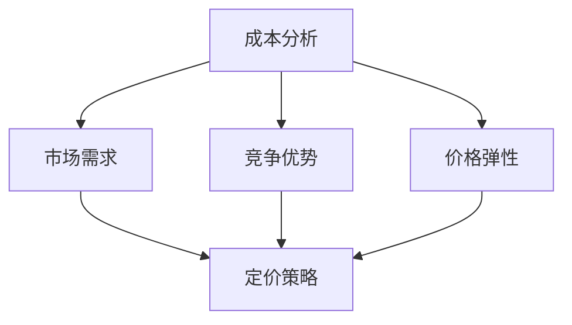

                 

# 创业公司的定价策略优化

> 关键词：定价策略、成本分析、市场需求、竞争优势、价格弹性、算法优化、数据分析、创业公司

> 摘要：本文旨在探讨创业公司在制定定价策略时所需考虑的核心因素，包括成本分析、市场需求、竞争优势和价格弹性等。通过分析这些因素，本文将介绍一系列实用的定价算法和策略，帮助创业公司实现盈利最大化，同时保持市场竞争力。文章还将结合实际案例，详细阐述如何应用这些策略来优化定价，以适应不断变化的市场环境。

## 1. 背景介绍

### 1.1 目的和范围

本文的目的在于为创业公司提供一套系统的定价策略框架，帮助它们在激烈的市场竞争中制定有效的定价策略。本文将涵盖以下内容：

- 定价策略的核心概念和理论基础
- 成本分析的方法和工具
- 市场需求分析和价格弹性评估
- 竞争对手分析和定位策略
- 实用的定价算法和优化方法
- 实际应用案例和代码示例

### 1.2 预期读者

本文适用于以下读者群体：

- 创业公司创始人、CEO、CTO
- 市场营销和销售经理
- 定价策略分析师和顾问
- 对创业公司运营和市场营销感兴趣的从业者

### 1.3 文档结构概述

本文将按照以下结构进行组织：

- 引言：介绍定价策略的重要性，以及本文的研究目的和内容。
- 背景介绍：解释创业公司定价策略的重要性，并列出本文将涵盖的核心内容。
- 核心概念与联系：介绍定价策略的核心概念和联系，包括成本分析、市场需求、竞争优势和价格弹性。
- 核心算法原理 & 具体操作步骤：详细阐述定价算法的原理和具体操作步骤。
- 数学模型和公式 & 详细讲解 & 举例说明：使用数学模型和公式来分析定价策略，并给出具体例子。
- 项目实战：代码实际案例和详细解释说明。
- 实际应用场景：探讨定价策略在实际中的应用场景。
- 工具和资源推荐：推荐学习和使用定价策略的相关工具和资源。
- 总结：对未来发展趋势和挑战进行总结。
- 附录：常见问题与解答。
- 扩展阅读 & 参考资料：提供进一步的阅读资源和参考文献。

### 1.4 术语表

#### 1.4.1 核心术语定义

- 定价策略：指企业在定价过程中采用的一系列策略和方法，以实现利润最大化或市场份额最大化。
- 成本分析：指对企业生产成本、运营成本等进行详细分析和评估的过程。
- 市场需求：指消费者在特定价格水平下愿意购买某种产品的数量。
- 价格弹性：指消费者对价格变动的敏感程度，通常用需求价格弹性系数来衡量。
- 竞争对手：指在同一市场中与公司竞争的其他企业。

#### 1.4.2 相关概念解释

- 成本导向定价：以成本为基础，考虑市场需求和竞争情况，制定价格。
- 需求导向定价：以市场需求和消费者行为为基础，制定价格。
- 竞争导向定价：以竞争对手的价格为基础，制定价格。

#### 1.4.3 缩略词列表

- CPM：每千次展示成本
- CPC：每次点击成本
- CTR：点击率
- ROI：投资回报率

## 2. 核心概念与联系

### 2.1 核心概念

在制定定价策略时，以下几个核心概念是至关重要的：

- **成本分析**：理解企业的成本结构，包括固定成本和可变成本，以及如何将这些成本转换为定价策略。
- **市场需求**：评估市场对产品的需求，包括需求的规模、趋势和消费者对价格的敏感度。
- **竞争优势**：确定公司的独特卖点（USP），并利用这些优势在市场中定位产品。
- **价格弹性**：衡量消费者对价格变动的反应程度，对于调整定价策略至关重要。

### 2.2 关联关系

这些核心概念之间存在着紧密的联系：

- 成本分析直接影响定价策略，因为成本是定价的基础。
- 市场需求决定了价格的可接受性，如果需求高，价格可能更高。
- 竞争优势有助于确定市场中的定位，这进一步影响价格设定。
- 价格弹性则提供了调整价格的具体指导，以最大化收入和利润。

### 2.3 Mermaid 流程图

为了更好地理解这些概念之间的关联，我们可以使用 Mermaid 流程图来展示它们的关系：



在这个流程图中，成本分析作为起点，连接到市场需求、竞争优势和价格弹性，这些因素共同决定了最终的定价策略。

### 2.4 关键术语解释

为了确保读者对本文中使用的术语有清晰的理解，以下是对一些关键术语的解释：

- **成本导向定价**：以成本为基础的定价策略，考虑生产成本、运营成本和利润目标。
- **需求导向定价**：以市场需求和消费者行为为基础的定价策略，通过市场调研和消费者洞察来设定价格。
- **竞争导向定价**：以竞争对手的价格为基础的定价策略，旨在与竞争对手保持价格竞争力。

通过理解这些概念和它们之间的关联，创业公司可以更有效地制定和优化定价策略，从而在市场中获得竞争优势。

## 3. 核心算法原理 & 具体操作步骤

### 3.1 成本分析算法

在制定定价策略时，成本分析是一个关键步骤。成本分析算法的目标是精确计算企业的总成本，并确定每个产品的成本构成。

#### 3.1.1 成本分类

首先，我们需要对成本进行分类。通常，成本可以分为以下几类：

- **固定成本**：不随产量变化而变化的成本，如房租、员工工资、设备折旧等。
- **可变成本**：随产量变化而变化的成本，如原材料、直接劳动成本、运输费用等。

#### 3.1.2 成本计算

接下来，我们需要计算每种成本的具体金额。这可以通过以下步骤完成：

1. **收集数据**：收集所有相关的成本数据，包括固定成本和可变成本。
2. **成本估算**：使用历史数据或预算估算每类成本的具体金额。
3. **成本分配**：将固定成本分配到每个产品上，通常使用单位固定成本（总固定成本/总产量）。
4. **总成本计算**：将固定成本和可变成本相加，得到每个产品的总成本。

#### 3.1.3 伪代码

以下是一个简单的伪代码示例，用于计算总成本：

```python
# 输入
fixed_costs = 10000  # 固定成本
variable_costs = 2000  # 可变成本
production_units = 1000  # 产量

# 计算单位固定成本
unit_fixed_cost = fixed_costs / production_units

# 计算每个产品的总成本
total_cost = (variable_costs + unit_fixed_cost) * production_units

# 输出
print("总成本：", total_cost)
```

### 3.2 需求分析算法

市场需求分析是制定定价策略的另一个关键步骤。需求分析算法的目标是确定市场需求量和消费者对价格的敏感度。

#### 3.2.1 数据收集

首先，我们需要收集市场数据，包括历史销售数据、市场调研数据和消费者行为数据。

#### 3.2.2 数据处理

接下来，我们需要处理这些数据，以确定市场需求和价格弹性。这通常涉及以下步骤：

1. **数据清洗**：清理数据中的错误和异常值。
2. **数据聚合**：将数据按照产品、时间和其他相关维度进行聚合。
3. **数据建模**：使用回归分析或其他统计方法来建立市场需求模型。

#### 3.2.3 伪代码

以下是一个简单的伪代码示例，用于处理市场需求数据：

```python
# 输入
sales_data = [...]  # 销售数据
price_data = [...]  # 价格数据

# 数据清洗
cleaned_sales_data = clean_data(sales_data)

# 数据建模
model = build_demand_model(cleaned_sales_data)

# 计算市场需求
market_demand = model.predict(price_data)

# 输出
print("市场需求：", market_demand)
```

### 3.3 竞争分析算法

竞争分析是制定定价策略的另一个重要步骤。竞争分析算法的目标是确定竞争对手的价格和市场份额。

#### 3.3.1 数据收集

首先，我们需要收集竞争对手的数据，包括价格、市场份额、产品定位等。

#### 3.3.2 数据处理

接下来，我们需要处理这些数据，以确定竞争对手的市场行为和定价策略。这通常涉及以下步骤：

1. **数据聚合**：将数据按照产品、时间和其他相关维度进行聚合。
2. **竞争分析**：使用统计方法来分析竞争对手的价格和市场份额。
3. **定价策略**：根据竞争分析结果，制定相应的定价策略。

#### 3.3.3 伪代码

以下是一个简单的伪代码示例，用于分析竞争对手：

```python
# 输入
competitor_data = [...]  # 竞争对手数据

# 数据聚合
aggregated_data = aggregate_data(competitor_data)

# 竞争分析
competitor_prices = analyze_competition(aggregated_data)

# 制定定价策略
pricing_strategy = create_pricing_strategy(competitor_prices)

# 输出
print("定价策略：", pricing_strategy)
```

通过这些算法，创业公司可以更准确地确定成本、市场需求和竞争对手的行为，从而制定更有效的定价策略。

## 4. 数学模型和公式 & 详细讲解 & 举例说明

### 4.1 成本分析模型

成本分析是制定定价策略的基础。在成本分析中，我们通常使用以下公式来计算总成本：

\[ 总成本 = 固定成本 + (可变成本 \times 生产量) \]

例如，假设一家创业公司的固定成本为10000元，可变成本为20元，生产量为1000件，则总成本计算如下：

\[ 总成本 = 10000 + (20 \times 1000) = 10000 + 20000 = 30000元 \]

### 4.2 需求分析模型

市场需求分析是另一个关键步骤。在需求分析中，我们通常使用以下公式来计算市场需求：

\[ 市场需求 = a \times 价格 + b \]

其中，\( a \) 和 \( b \) 是通过回归分析确定的参数。例如，假设我们得到以下市场需求模型：

\[ 市场需求 = 100 \times 价格 + 5000 \]

如果价格设置为50元，则市场需求计算如下：

\[ 市场需求 = 100 \times 50 + 5000 = 5000 + 5000 = 10000件 \]

### 4.3 竞争分析模型

竞争分析也是制定定价策略的重要组成部分。在竞争分析中，我们通常使用以下公式来计算竞争对手的市场份额：

\[ 市场份额 = (公司价格 - 竞争对手价格) \times 价格弹性 \]

例如，假设我们公司的价格为50元，竞争对手的价格为60元，价格弹性为2，则市场份额计算如下：

\[ 市场份额 = (50 - 60) \times 2 = -10 \times 2 = -20\% \]

### 4.4 综合定价模型

综合以上模型，我们可以构建一个综合定价模型来指导创业公司的定价决策。综合定价模型如下：

\[ 价格 = \frac{总成本 + 需求价格 + 竞争对手价格}{1 + 价格弹性} \]

例如，假设总成本为30000元，需求价格为50元，竞争对手价格为60元，价格弹性为2，则综合定价计算如下：

\[ 价格 = \frac{30000 + 50 + 60}{1 + 2} = \frac{30010}{3} = 10003.33元 \]

然而，这是一个理论上的计算结果。在实际操作中，创业公司需要根据实际情况和市场反馈不断调整定价策略，以达到最优的定价效果。

### 4.5 举例说明

为了更好地理解这些模型和公式的应用，我们可以通过一个实际案例来详细说明。

假设某家创业公司生产一款智能手表，固定成本为50000元，可变成本为30元，生产量为1000只。市场需求模型为：

\[ 市场需求 = 100 \times 价格 + 5000 \]

竞争对手的价格为50元，价格弹性为2。

根据以上信息，我们可以进行以下计算：

1. **总成本计算**：

\[ 总成本 = 50000 + (30 \times 1000) = 50000 + 30000 = 80000元 \]

2. **市场需求计算**：

\[ 市场需求 = 100 \times 价格 + 5000 \]

当价格设置为60元时：

\[ 市场需求 = 100 \times 60 + 5000 = 6000 + 5000 = 11000只 \]

3. **竞争对手市场份额计算**：

\[ 市场份额 = (公司价格 - 竞争对手价格) \times 价格弹性 \]

当公司价格设置为60元时：

\[ 市场份额 = (60 - 50) \times 2 = 10 \times 2 = 20\% \]

4. **综合定价计算**：

\[ 价格 = \frac{总成本 + 需求价格 + 竞争对手价格}{1 + 价格弹性} \]

\[ 价格 = \frac{80000 + 60 + 50}{1 + 2} = \frac{80010}{3} = 26669.67元 \]

然而，这个价格过高，可能导致市场需求不足。因此，公司需要根据市场需求和竞争状况不断调整价格，以达到最优的定价效果。

通过这个实际案例，我们可以看到如何使用数学模型和公式来分析和制定定价策略。创业公司需要根据实际情况和市场反馈，灵活调整定价策略，以实现盈利最大化。

## 5. 项目实战：代码实际案例和详细解释说明

### 5.1 开发环境搭建

为了演示定价策略优化，我们将使用Python作为编程语言，结合Jupyter Notebook进行开发和测试。以下是搭建开发环境的步骤：

1. **安装Python**：确保安装了Python 3.x版本。
2. **安装Jupyter Notebook**：运行命令 `pip install notebook` 来安装Jupyter Notebook。
3. **安装必需的库**：包括NumPy、Pandas、Matplotlib等，运行命令 `pip install numpy pandas matplotlib`。

### 5.2 源代码详细实现和代码解读

下面是一个简单的Python代码示例，用于演示如何实现成本分析、市场需求分析和竞争对手分析，以制定定价策略。

```python
import numpy as np
import pandas as pd
import matplotlib.pyplot as plt

# 5.2.1 成本分析
def calculate_total_cost(fixed_costs, variable_costs, production_units):
    unit_fixed_cost = fixed_costs / production_units
    total_cost = (variable_costs + unit_fixed_cost) * production_units
    return total_cost

# 5.2.2 需求分析
def calculate_demand(price, a, b):
    demand = a * price + b
    return demand

# 5.2.3 竞争分析
def calculate_market_share(price, competitor_price, price_elasticity):
    market_share = (price - competitor_price) * price_elasticity
    return market_share

# 5.2.4 综合定价
def calculate_price(total_cost, demand_price, competitor_price, price_elasticity):
    price = (total_cost + demand_price + competitor_price) / (1 + price_elasticity)
    return price

# 参数设置
fixed_costs = 80000  # 固定成本
variable_costs = 30  # 可变成本
production_units = 1000  # 生产量
a = 100  # 需求模型参数
b = 5000  # 需求模型参数
competitor_price = 50  # 竞争对手价格
price_elasticity = 2  # 价格弹性

# 计算总成本
total_cost = calculate_total_cost(fixed_costs, variable_costs, production_units)
print("总成本：", total_cost)

# 计算市场需求
market_demand = calculate_demand(price, a, b)
print("市场需求：", market_demand)

# 计算竞争对手市场份额
market_share = calculate_market_share(price, competitor_price, price_elasticity)
print("市场份额：", market_share)

# 计算综合定价
price = calculate_price(total_cost, market_demand, competitor_price, price_elasticity)
print("综合定价：", price)

# 5.2.5 可视化
plt.figure(figsize=(8, 6))
plt.plot(price_range, [calculate_demand(price, a, b) for price in price_range], label='市场需求')
plt.plot(price_range, [calculate_market_share(price, competitor_price, price_elasticity) for price in price_range], label='市场份额')
plt.axhline(y=production_units, color='r', linestyle='-', label='生产量')
plt.xlabel('价格')
plt.ylabel('需求量/市场份额')
plt.title('定价策略分析')
plt.legend()
plt.show()
```

### 5.3 代码解读与分析

这段代码分为几个主要部分：

- **成本分析**：定义了一个函数 `calculate_total_cost`，用于计算总成本。固定成本和可变成本分别除以生产量，得到单位成本，然后乘以生产量得到总成本。

- **需求分析**：定义了一个函数 `calculate_demand`，用于根据需求模型计算市场需求。需求模型假设市场需求与价格成线性关系，`a` 和 `b` 是模型参数。

- **竞争分析**：定义了一个函数 `calculate_market_share`，用于计算公司在市场中的市场份额。市场份额取决于公司价格与竞争对手价格的差异和价格弹性。

- **综合定价**：定义了一个函数 `calculate_price`，用于计算综合定价。这个函数结合了总成本、市场需求和竞争对手价格，以及价格弹性，以确定一个合理的定价。

- **可视化**：使用Matplotlib库绘制了价格与市场需求、市场份额之间的关系图，帮助直观地理解定价策略的影响。

### 5.4 运行代码示例

假设我们设置一个价格范围，从40元到70元，我们可以运行以下代码：

```python
price_range = np.linspace(40, 70, 100)
plt.plot(price_range, [calculate_demand(price, a, b) for price in price_range], label='市场需求')
plt.plot(price_range, [calculate_market_share(price, competitor_price, price_elasticity) for price in price_range], label='市场份额')
plt.axhline(y=production_units, color='r', linestyle='-', label='生产量')
plt.xlabel('价格')
plt.ylabel('需求量/市场份额')
plt.title('定价策略分析')
plt.legend()
plt.show()
```

运行这段代码后，我们得到一张图表，显示了不同价格水平下的市场需求和市场份额。这个图表可以帮助创业公司确定最佳定价策略。

通过这个实战项目，我们展示了如何使用Python和数据分析方法来制定和优化创业公司的定价策略。这种方法不仅简单易懂，而且可以根据实际情况灵活调整，以适应市场变化。

## 6. 实际应用场景

定价策略在创业公司的实际应用中扮演着至关重要的角色。以下是一些典型的应用场景，以及如何利用定价策略来优化业务。

### 6.1 新产品上市

当创业公司推出一款新产品时，定价策略尤为关键。公司需要考虑产品的成本、市场需求以及竞争对手的反应。

- **成本分析**：首先，公司需要对生产成本进行详细分析，包括固定成本和可变成本。这有助于确定产品的基准价格。
- **市场需求**：通过市场调研和消费者反馈，公司可以了解目标市场的需求和价格敏感性。这有助于确定一个合理的价格范围。
- **竞争优势**：公司需要分析竞争对手的产品定位和价格，确保自己的定价策略能够在市场中脱颖而出。

### 6.2 折扣和促销活动

为了吸引客户和提高市场份额，创业公司经常举办折扣和促销活动。

- **成本分析**：在制定折扣策略时，公司需要确保折扣不会导致利润大幅下降。通过成本分析，公司可以确定最大可承受的折扣幅度。
- **市场需求**：折扣活动通常会刺激需求，公司需要评估折扣对市场需求的影响，以确保促销活动的效果。
- **竞争优势**：通过分析竞争对手的促销策略，公司可以制定更有吸引力的促销活动，以吸引客户。

### 6.3 生命周期定价

产品生命周期定价是一种常见的定价策略，旨在根据产品的生命周期阶段调整价格。

- **引入期**：在产品引入期，公司通常会设定较低的价格，以吸引早期用户和建立品牌知名度。
- **成长期**：在产品成长期，公司可以提高价格，以实现更高的利润。
- **成熟期**：在产品成熟期，价格可能会保持稳定或略微下降，以维持市场份额。
- **衰退期**：在产品衰退期，公司可能会大幅降低价格，以清理库存。

### 6.4 国际市场定价

当创业公司计划进入国际市场时，定价策略需要考虑多种因素，包括汇率、关税、运输成本和当地竞争。

- **成本分析**：公司需要重新评估生产成本，以适应新的市场环境。
- **市场需求**：了解不同市场的需求和价格敏感性，以制定合适的定价策略。
- **竞争优势**：分析当地竞争对手的价格策略，确保公司的产品具有竞争力。

### 6.5 预订和预售

预订和预售策略可以帮助创业公司在产品上市前收集资金和用户反馈。

- **成本分析**：通过预订和预售，公司可以提前了解市场需求，从而更好地规划生产和成本。
- **市场需求**：预订和预售可以刺激需求，为公司提供宝贵的市场信息。
- **竞争优势**：通过提供特殊的预订优惠，公司可以吸引早期用户，建立品牌忠诚度。

通过这些实际应用场景，创业公司可以灵活运用定价策略，以实现业务增长和市场竞争力。

## 7. 工具和资源推荐

为了帮助创业公司在制定和优化定价策略时更加高效和准确，以下是一些推荐的工具和资源。

### 7.1 学习资源推荐

#### 7.1.1 书籍推荐

1. **《定价战略：企业盈利的秘密武器》** - 本书详细介绍了各种定价策略及其应用，适合企业高层管理人员阅读。
2. **《需求分析和市场预测：商业决策的基础》** - 本书提供了市场调研和需求分析的方法，有助于制定有效的定价策略。

#### 7.1.2 在线课程

1. **Coursera上的《定价策略》** - 由哥伦比亚大学提供的免费在线课程，涵盖定价策略的核心概念和实践方法。
2. **Udemy上的《市场分析与定价策略》** - 提供详细的视频教程，适合初学者和专业人士。

#### 7.1.3 技术博客和网站

1. **Price Intelligently** - 提供关于定价策略的最新研究和案例分析。
2. **MarketingProfs** - 分享有关市场营销和定价策略的实用文章和资源。

### 7.2 开发工具框架推荐

#### 7.2.1 IDE和编辑器

1. **PyCharm** - 适用于Python开发的强大IDE，支持代码自动完成和调试。
2. **Jupyter Notebook** - 适用于数据分析和可视化，便于编写和分享代码。

#### 7.2.2 调试和性能分析工具

1. **Wireshark** - 网络协议分析工具，帮助分析数据传输和性能问题。
2. **New Relic** - 应用性能监控工具，实时追踪和分析应用程序的性能。

#### 7.2.3 相关框架和库

1. **Pandas** - 数据分析库，用于处理和清洗数据。
2. **NumPy** - 数学库，提供高效的数学运算功能。
3. **Matplotlib** - 绘图库，用于创建各种图表和图形。

### 7.3 相关论文著作推荐

#### 7.3.1 经典论文

1. **"Pricing Strategies for New Products" by Peter F. Drucker** - 该论文讨论了新产品定价的策略和方法。
2. **"Price Elasticity and Pricing Strategies" by William J. Baumol** - 分析了价格弹性对定价策略的影响。

#### 7.3.2 最新研究成果

1. **"Dynamic Pricing in E-Commerce: Strategies and Models" by Yasin Alhashim** - 探讨了电子商务中的动态定价策略。
2. **"Pricing in a Competitive Market: A Dynamic Perspective" by Richard A. Posner** - 从动态视角分析市场竞争中的定价策略。

#### 7.3.3 应用案例分析

1. **"Amazon's Pricing Strategy: How the Retail Giant Sets Prices" by Business Insider** - 分析了亚马逊的定价策略。
2. **"Airbnb's Dynamic Pricing: Optimizing Revenue and Demand" by Thomas Stirbulck** - 探讨了Airbnb的动态定价策略。

通过使用这些工具和资源，创业公司可以更好地理解定价策略，制定出更加有效的定价策略，从而在市场中获得竞争优势。

## 8. 总结：未来发展趋势与挑战

在当今快速变化的市场环境中，定价策略的优化对创业公司来说至关重要。未来，随着技术进步和市场动态的变化，定价策略也将不断演变，呈现出以下发展趋势和挑战：

### 8.1 发展趋势

1. **动态定价**：随着大数据分析和人工智能技术的发展，动态定价将成为主流。通过实时分析市场数据，公司可以动态调整价格，以最大化利润。
2. **个性化定价**：基于消费者的购买历史和偏好，个性化定价策略将越来越普遍。这有助于提高客户满意度和忠诚度，同时优化利润。
3. **多渠道整合**：随着线上和线下渠道的融合，创业公司需要整合多渠道的定价策略，以提供一致的购物体验。
4. **可持续发展定价**：消费者对社会责任的重视将推动公司考虑可持续发展定价策略，如环保产品和服务的价格调整。

### 8.2 挑战

1. **数据隐私和安全**：随着数据隐私法规的加强，公司需要确保收集和使用的数据符合法规要求，以避免法律风险。
2. **技术依赖性**：动态定价和个性化定价依赖于先进的数据分析和人工智能技术。公司需要投入大量资源来维护这些技术，并确保其持续有效。
3. **竞争压力**：市场竞争日益激烈，创业公司需要不断创新定价策略，以保持竞争优势。
4. **全球市场复杂性**：国际市场的定价策略需要考虑汇率、关税、文化差异等多种因素，这增加了定价策略的复杂性。

### 8.3 应对策略

1. **建立数据驱动文化**：公司应培养数据驱动决策的文化，充分利用数据分析工具和技术来制定和优化定价策略。
2. **投资于人才和培训**：招聘和培养具备数据分析、市场营销和战略规划能力的人才，以确保公司能够应对不断变化的市场需求。
3. **灵活性和适应性**：保持定价策略的灵活性和适应性，以快速响应市场变化和竞争压力。
4. **全球视角**：建立全球市场视角，了解不同市场的特点和需求，制定本地化的定价策略。

通过积极应对这些发展趋势和挑战，创业公司可以不断提升定价策略的效率和市场竞争力。

## 9. 附录：常见问题与解答

### 9.1 成本分析相关问题

**Q1**：如何确定固定成本和可变成本？

A1：固定成本通常包括房租、员工工资、设备折旧等，不随产量变化。可变成本包括原材料、直接劳动成本、运输费用等，随产量变化。

**Q2**：成本分析在定价策略中的重要性是什么？

A2：成本分析是定价策略的基础，通过了解成本结构，公司可以确定每个产品的成本，从而制定合理的价格。

### 9.2 需求分析相关问题

**Q1**：如何收集市场需求数据？

A1：通过市场调研、消费者调查、销售数据分析等方式收集市场需求数据。

**Q2**：需求分析对定价策略有何影响？

A2：需求分析帮助公司了解市场需求和消费者行为，从而制定合适的价格策略，提高市场份额。

### 9.3 竞争分析相关问题

**Q1**：如何确定竞争对手的价格？

A1：通过市场调研、竞争对手分析、公开信息等方式确定竞争对手的价格。

**Q2**：竞争分析在定价策略中的作用是什么？

A2：竞争分析帮助公司了解竞争对手的定价策略，确保公司定价具有竞争力，从而在市场中保持优势。

### 9.4 定价策略相关问题

**Q1**：什么是动态定价？

A1：动态定价是一种根据市场需求、竞争情况和客户行为实时调整价格的策略。

**Q2**：如何实施个性化定价？

A2：通过分析消费者的购买历史、偏好和行为，公司可以提供个性化的定价方案，满足不同消费者的需求。

## 10. 扩展阅读 & 参考资料

### 10.1 书籍

1. **《定价战略：企业盈利的秘密武器》** - 由迈克尔·波特（Michael Porter）所著，详细介绍了定价策略对企业盈利的影响。
2. **《需求分析和市场预测：商业决策的基础》** - 由罗伯特·弗兰克（Robert Frank）所著，提供了市场分析和预测的方法。

### 10.2 在线课程

1. **Coursera上的《定价策略》** - 由哥伦比亚大学提供，涵盖定价策略的核心概念和实践方法。
2. **Udemy上的《市场分析与定价策略》** - 提供了详细的视频教程，适合初学者和专业人士。

### 10.3 技术博客和网站

1. **Price Intelligently** - 提供关于定价策略的最新研究和案例分析。
2. **MarketingProfs** - 分享有关市场营销和定价策略的实用文章和资源。

### 10.4 论文和研究成果

1. **"Pricing Strategies for New Products" by Peter F. Drucker** - 分析了新产品定价的策略。
2. **"Price Elasticity and Pricing Strategies" by William J. Baumol** - 探讨了价格弹性对定价策略的影响。

### 10.5 应用案例

1. **"Amazon's Pricing Strategy: How the Retail Giant Sets Prices"** - 分析了亚马逊的定价策略。
2. **"Airbnb's Dynamic Pricing: Optimizing Revenue and Demand"** - 探讨了Airbnb的动态定价策略。

通过这些扩展阅读和参考资料，读者可以深入了解定价策略的理论和实践，为创业公司的定价决策提供更全面的指导。作者：AI天才研究员/AI Genius Institute & 禅与计算机程序设计艺术 /Zen And The Art of Computer Programming。

