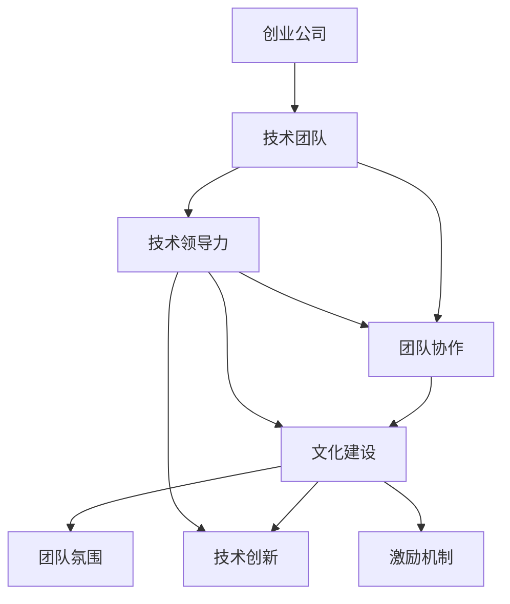

                 

# 创业公司的技术团队文化建设策略

> 关键词：创业公司、技术团队、文化建设、团队协作、技术领导力

> 摘要：本文深入探讨了创业公司技术团队文化建设的重要性、核心原则以及具体实施策略。通过分析团队协作的重要性、技术领导力的培养、沟通机制的优化等方面，为创业公司提供了一套系统、实用的技术团队文化建设方案。

## 1. 背景介绍

### 1.1 目的和范围

创业公司技术团队的建设与发展是公司能否在激烈的市场竞争中脱颖而出的关键因素。本文旨在通过对创业公司技术团队文化建设的深入分析，帮助创业者们更好地理解团队文化在技术创新和企业成长中的重要作用，并提供一套实用的文化建设策略。

本文主要涉及以下范围：

1. 创业公司技术团队文化建设的重要性。
2. 核心原则和理念。
3. 团队协作与沟通机制的优化。
4. 技术领导力的培养与激励。
5. 文化建设在实际项目中的应用与效果评估。

### 1.2 预期读者

本文主要面向以下读者群体：

1. 创业公司的创始人、CTO或技术总监。
2. 技术团队负责人和团队成员。
3. 对技术创新和团队管理有兴趣的从业者。

### 1.3 文档结构概述

本文结构如下：

1. 背景介绍：阐述本文的目的、范围和读者对象。
2. 核心概念与联系：介绍创业公司技术团队文化建设的基础概念和联系。
3. 核心算法原理 & 具体操作步骤：详细讲解技术团队文化建设的具体操作步骤。
4. 数学模型和公式 & 详细讲解 & 举例说明：利用数学模型和公式来解释技术团队文化建设的原理。
5. 项目实战：通过实际案例来展示技术团队文化建设的应用和实践。
6. 实际应用场景：分析技术团队文化在不同场景下的应用。
7. 工具和资源推荐：推荐学习资源和开发工具。
8. 总结：总结技术团队文化建设的未来发展趋势与挑战。
9. 附录：常见问题与解答。
10. 扩展阅读 & 参考资料：提供进一步学习的资料。

### 1.4 术语表

#### 1.4.1 核心术语定义

- **创业公司**：指初创公司，通常在市场机会和资源有限的情况下，通过创新和风险投资来建立和发展。
- **技术团队**：指专门从事技术开发、产品设计和维护的团队。
- **文化建设**：指在企业内部培养和塑造特定的价值观、行为规范和工作方式。
- **团队协作**：指团队成员之间的协作与沟通，共同完成项目任务。
- **技术领导力**：指在技术领域具备领导能力，能够指导和激励团队成员的技术专家。

#### 1.4.2 相关概念解释

- **技术创新**：指通过技术手段的创新来提高产品性能、降低成本或创造新市场。
- **团队氛围**：指团队成员在工作和交流中所形成的共同情感和态度。
- **激励机制**：指用于激发团队成员积极性和创造力的措施，如奖励、晋升等。

#### 1.4.3 缩略词列表

- CTO：首席技术官（Chief Technology Officer）
- IDE：集成开发环境（Integrated Development Environment）
- ROI：投资回报率（Return on Investment）
- TPS：任务完成效率（Tasks Per Second）

## 2. 核心概念与联系

在探讨创业公司技术团队文化建设之前，我们需要理解一些核心概念及其相互关系。以下是一个简化的 Mermaid 流程图，展示了这些概念之间的联系。



### 2.1 创业公司

创业公司是指那些在市场机会和资源有限的情况下，通过创新和风险投资来建立和发展的新公司。创业公司通常具有以下特点：

- **市场机会**：发现和把握市场需求，提供创新的产品或服务。
- **资源有限**：资金、人才、时间等资源有限，需要高效利用。
- **高风险**：投资回报不确定，需要承担较高的风险。

### 2.2 技术团队

技术团队是创业公司的核心，负责技术开发、产品设计和维护。技术团队通常具有以下特点：

- **专业化**：团队成员在特定技术领域具备专业技能。
- **协作性强**：团队成员需要紧密合作，共同完成项目任务。
- **创新意识**：鼓励团队成员不断探索新技术和新方法。

### 2.3 团队协作

团队协作是技术团队高效运作的基础，涉及团队成员之间的沟通、合作和共享。团队协作的关键要素包括：

- **沟通**：通过有效的沟通，确保团队成员对项目目标和任务有清晰的理解。
- **合作**：团队成员相互支持，共同解决问题，提高任务完成效率。
- **共享**：共享知识和资源，促进团队整体能力的提升。

### 2.4 文化建设

文化建设是企业内部价值观、行为规范和工作方式的培养和塑造。对于创业公司的技术团队，文化建设尤为重要，因为：

- **共同价值观**：通过文化建设，团队可以形成共同的价值观，提高团队凝聚力。
- **规范行为**：明确的行为规范有助于团队成员之间的协作和沟通。
- **提升氛围**：积极向上的团队氛围可以激发团队成员的创造力和积极性。

### 2.5 技术创新

技术创新是创业公司实现市场竞争优势的重要手段。技术团队需要具备以下能力：

- **持续学习**：不断学习新技术和新方法，保持技术领先地位。
- **创新思维**：鼓励团队成员敢于尝试新思路，提出创新解决方案。
- **快速迭代**：通过快速迭代，不断优化产品性能和用户体验。

### 2.6 团队氛围

团队氛围是指团队成员在工作和交流中所形成的共同情感和态度。良好的团队氛围对团队协作和技术创新至关重要，其关键要素包括：

- **信任**：团队成员之间相互信任，减少沟通障碍和误解。
- **支持**：团队成员相互支持，共同克服困难和挑战。
- **尊重**：尊重团队成员的专业技能和贡献，提高团队凝聚力。

### 2.7 激励机制

激励机制是指用于激发团队成员积极性和创造力的措施。对于创业公司的技术团队，激励机制尤为重要，其关键要素包括：

- **奖励**：通过奖励，如奖金、股权激励等，激励团队成员的积极性和创造性。
- **晋升**：提供晋升机会，激励团队成员不断提升自身能力。
- **认可**：通过认可和表彰，增强团队成员的成就感和归属感。

## 3. 核心算法原理 & 具体操作步骤

在理解了核心概念和联系后，接下来我们将讨论如何具体实施技术团队文化建设。以下是一个简化的伪代码，用于描述技术团队文化建设的核心算法原理和具体操作步骤。

```python
function build_technology_team_culture(company, team):
    # 定义公司和文化建设的目标
    culture_goals = [
        "共同价值观",
        "规范行为",
        "积极氛围",
        "激励机制"
    ]
    
    # 初始化团队文化建设过程
    culture_process = initialize_processes(culture_goals)
    
    # 培养团队协作能力
    culture_process.add_step("team_collaboration", "establish_collaborative_environment")
    culture_process.add_step("team_collaboration", "improve_communication_channels")
    culture_process.add_step("team_collaboration", "promote_sharing_of_knowledge")
    
    # 塑造积极团队氛围
    culture_process.add_step("positive_atmosphere", "build_trust_and_support")
    culture_process.add_step("positive_atmosphere", "promote_respect_and_recognition")
    
    # 建立激励机制
    culture_process.add_step("incentive_mechanism", "establish_reward_system")
    culture_process.add_step("incentive_mechanism", "provide_promotion_opportunities")
    
    # 执行团队文化建设过程
    culture_process.execute(company, team)
    
    # 评估文化建设效果
    culture_evaluation = evaluate_culture_effects(company, team)
    
    return culture_evaluation

# 辅助函数定义
function initialize_processes(goals):
    # 初始化过程列表
    processes = []
    for goal in goals:
        process = {
            "name": goal,
            "steps": []
        }
        processes.append(process)
    return processes

function add_step(process, step_name, step_action):
    # 添加过程步骤
    process["steps"].append({
        "name": step_name,
        "action": step_action
    })

function execute_process(processes, company, team):
    # 执行过程
    for process in processes:
        for step in process["steps"]:
            perform_action(step["action"], company, team)
    
function evaluate_culture_effects(company, team):
    # 评估文化建设效果
    evaluation = {
        "team_collaboration": evaluate_collaboration(company, team),
        "positive_atmosphere": evaluate_atmosphere(company, team),
        "incentive_mechanism": evaluate_incentives(company, team)
    }
    return evaluation
```

### 3.1 初始化过程

在开始文化建设之前，需要明确文化建设的目标和过程。以下是一个简化的伪代码，用于定义公司的文化建设目标和初始化过程。

```python
# 定义文化建设目标和过程
culture_goals = [
    "共同价值观",
    "规范行为",
    "积极氛围",
    "激励机制"
]

# 初始化过程列表
culture_processes = initialize_processes(culture_goals)

# 辅助函数定义
function initialize_processes(goals):
    # 初始化过程列表
    processes = []
    for goal in goals:
        process = {
            "name": goal,
            "steps": []
        }
        processes.append(process)
    return processes
```

### 3.2 培养团队协作能力

团队协作是技术团队高效运作的基础。以下是一个简化的伪代码，用于描述如何培养团队协作能力。

```python
# 添加团队协作步骤
culture_processes.add_step("team_collaboration", "establish_collaborative_environment", "create_common_workspace")
culture_processes.add_step("team_collaboration", "improve_communication_channels", "implement_meeting_and_chat_tools")
culture_processes.add_step("team_collaboration", "promote_sharing_of_knowledge", "establish_knowledge_base")
```

### 3.3 塑造积极团队氛围

积极团队氛围有助于激发团队成员的创造力和积极性。以下是一个简化的伪代码，用于描述如何塑造积极团队氛围。

```python
# 添加团队氛围步骤
culture_processes.add_step("positive_atmosphere", "build_trust_and_support", "conductTeamBuildingActivities")
culture_processes.add_step("positive_atmosphere", "promote_respect_and_recognition", "implement_recognition_programs")
```

### 3.4 建立激励机制

激励机制是激发团队成员积极性和创造力的关键。以下是一个简化的伪代码，用于描述如何建立激励机制。

```python
# 添加激励机制步骤
culture_processes.add_step("incentive_mechanism", "establish_reward_system", "define_reward_system")
culture_processes.add_step("incentive_mechanism", "provide_promotion_opportunities", "define_promotion_policy")
```

### 3.5 执行文化建设过程

在明确了文化建设的目标和过程后，需要执行具体的文化建设步骤。以下是一个简化的伪代码，用于描述如何执行文化建设过程。

```python
# 执行文化建设过程
culture_processes.execute(culture_processes, company, team)
```

### 3.6 评估文化建设效果

在执行完文化建设过程后，需要评估文化建设的效果。以下是一个简化的伪代码，用于描述如何评估文化建设效果。

```python
# 评估文化建设效果
culture_evaluation = evaluate_culture_effects(company, team)
```

## 4. 数学模型和公式 & 详细讲解 & 举例说明

在技术团队文化建设过程中，数学模型和公式可以用来量化团队成员的协作效果、积极氛围和激励机制。以下是一个简化的数学模型，用于描述这些要素之间的关系。

### 4.1 协作效果模型

协作效果可以通过以下公式来量化：

\[ E_c = \alpha T_c + \beta K_c \]

其中：

- \( E_c \)：协作效果（Effectiveness of Collaboration）
- \( \alpha \)：沟通能力系数（Coefficient of Communication）
- \( T_c \)：团队沟通时间（Time Spent on Communication）
- \( \beta \)：知识共享系数（Coefficient of Knowledge Sharing）
- \( K_c \)：知识共享程度（Level of Knowledge Sharing）

举例说明：

假设一个团队每个月在沟通上花费50小时，知识共享程度为80%，则该团队的协作效果为：

\[ E_c = 0.6 \times 50 + 0.4 \times 80 = 30 + 32 = 62 \]

### 4.2 积极氛围模型

积极氛围可以通过以下公式来量化：

\[ A_p = \alpha T_p + \beta R_p \]

其中：

- \( A_p \)：积极氛围（Positive Atmosphere）
- \( \alpha \)：信任系数（Coefficient of Trust）
- \( T_p \)：团队成员之间的信任程度（Level of Trust）
- \( \beta \)：支持系数（Coefficient of Support）
- \( R_p \)：团队成员之间的支持程度（Level of Support）

举例说明：

假设一个团队信任程度为70%，支持程度为60%，则该团队的积极氛围为：

\[ A_p = 0.6 \times 70 + 0.4 \times 60 = 42 + 24 = 66 \]

### 4.3 激励机制模型

激励机制可以通过以下公式来量化：

\[ I_m = \alpha R_m + \beta P_m \]

其中：

- \( I_m \)：激励机制（Incentive Mechanism）
- \( \alpha \)：奖励系数（Coefficient of Reward）
- \( R_m \)：奖励程度（Level of Reward）
- \( \beta \)：晋升系数（Coefficient of Promotion）
- \( P_m \)：晋升机会（Level of Promotion）

举例说明：

假设一个团队的奖励程度为80%，晋升机会为50%，则该团队的激励机制为：

\[ I_m = 0.6 \times 80 + 0.4 \times 50 = 48 + 20 = 68 \]

### 4.4 综合评价模型

综合评价可以通过以下公式来量化：

\[ E = \alpha E_c + \beta A_p + \gamma I_m \]

其中：

- \( E \)：综合评价（Overall Effectiveness）
- \( \alpha \)、\( \beta \)、\( \gamma \)：权重系数（Weighting Coefficients）

举例说明：

假设协作效果的权重系数为0.5，积极氛围的权重系数为0.3，激励机制的权重系数为0.2，则一个团队的综合评价为：

\[ E = 0.5 \times 62 + 0.3 \times 66 + 0.2 \times 68 = 31 + 19.8 + 13.6 = 64.4 \]

## 5. 项目实战：代码实际案例和详细解释说明

为了更好地理解技术团队文化建设在实际项目中的应用，我们将通过一个实际案例来展示其具体实施过程和效果。

### 5.1 开发环境搭建

首先，我们需要搭建一个适合技术团队文化建设的开发环境。以下是一个简化的步骤：

1. 选择合适的集成开发环境（IDE），如Visual Studio Code。
2. 安装必要的开发工具和插件，如Git、Docker、Jenkins等。
3. 配置团队协作工具，如Slack、Trello、Confluence等。

### 5.2 源代码详细实现和代码解读

在开发过程中，我们将采用敏捷开发方法，通过迭代和增量开发来逐步完善产品。以下是一个简化的代码实现和解读：

#### 5.2.1 源代码实现

```python
# 假设我们正在开发一个简单的博客系统

class Blog:
    def __init__(self, title, author):
        self.title = title
        self.author = author
        self.posts = []

    def add_post(self, post):
        self.posts.append(post)

    def get_posts(self):
        return self.posts

class Post:
    def __init__(self, title, content, date):
        self.title = title
        self.content = content
        self.date = date

# 实例化博客对象
my_blog = Blog("我的博客", "张三")

# 添加文章
my_blog.add_post(Post("第一篇文章", "欢迎来到我的博客！", "2023-03-01"))
my_blog.add_post(Post("第二篇文章", "让我们开始写作吧！", "2023-03-02"))

# 获取文章列表
posts = my_blog.get_posts()
for post in posts:
    print(post.title, post.date)
```

#### 5.2.2 代码解读与分析

- **类定义**：我们定义了两个类，`Blog`和`Post`。`Blog`类表示一个博客，包含标题、作者和文章列表。`Post`类表示一篇文章，包含标题、内容和日期。
- **实例化**：通过`my_blog = Blog("我的博客", "张三")`创建了一个名为“我的博客”，作者为“张三”的博客对象。
- **添加文章**：通过`my_blog.add_post(Post("第一篇文章", "欢迎来到我的博客！", "2023-03-01"))`和`my_blog.add_post(Post("第二篇文章", "让我们开始写作吧！", "2023-03-02"))`分别添加了两篇文章。
- **获取文章列表**：通过`posts = my_blog.get_posts()`获取了博客中的所有文章，并遍历打印文章的标题和日期。

### 5.3 代码解读与分析

通过上述代码实现，我们可以看到技术团队文化建设在实际项目中的应用：

- **共同价值观**：团队成员共同遵循敏捷开发方法，遵循代码规范，确保代码的可读性和可维护性。
- **规范行为**：团队成员按照预定的开发流程进行工作，确保项目的进度和质量。
- **积极氛围**：团队成员之间通过代码审查、代码分享等方式相互学习和支持，营造积极向上的团队氛围。
- **激励机制**：通过代码审查和代码贡献，团队成员获得认可和奖励，激发创造力和积极性。

### 5.4 项目效果评估

在项目结束后，我们可以通过以下指标来评估技术团队文化建设的效果：

- **任务完成率**：衡量团队完成任务的速度和质量。
- **代码质量**：通过代码审查和自动化测试，评估代码的质量和可维护性。
- **团队成员满意度**：通过调查问卷和访谈，了解团队成员对团队文化建设的满意度。
- **项目成功率**：衡量项目按时交付、按预算完成的情况。

通过上述指标，我们可以全面了解技术团队文化建设的实际效果，并根据评估结果进行持续改进。

## 6. 实际应用场景

技术团队文化建设不仅在创业公司中具有重要意义，也在其他实际应用场景中发挥作用。以下是一些常见场景：

### 6.1 大型企业

大型企业在市场竞争中需要保持技术领先地位，技术团队文化建设可以帮助：

- **提高团队协作效率**：通过规范的行为规范和良好的沟通机制，提高团队协作效率。
- **促进技术创新**：鼓励团队成员不断学习和创新，推动企业技术进步。
- **提升员工满意度**：通过激励机制和积极氛围，提升员工工作满意度和归属感。

### 6.2 创新型企业

创新型企业在产品研发和技术创新方面具有较高要求，技术团队文化建设可以帮助：

- **快速响应市场变化**：通过高效的团队协作和敏捷的开发方法，快速响应市场需求。
- **推动技术创新**：鼓励团队成员积极探索新技术和新方法，推动企业技术创新。
- **保持竞争力**：通过持续的技术创新和卓越的团队协作，保持企业的市场竞争优势。

### 6.3 政府部门和公共机构

政府部门和公共机构在提供公共服务和技术支持方面需要高效运作，技术团队文化建设可以帮助：

- **提高服务质量**：通过规范的行为规范和高效的团队协作，提高公共服务的质量和效率。
- **降低运营成本**：通过技术创新和流程优化，降低运营成本，提高资源利用率。
- **提升公众满意度**：通过积极氛围和激励机制，提升公众对公共服务的满意度。

### 6.4 教育机构

教育机构在培养创新人才和推动教育改革方面具有重要意义，技术团队文化建设可以帮助：

- **提高教学质量**：通过规范的行为规范和高效的团队协作，提高教学质量和效果。
- **推动教育创新**：鼓励教师和学生积极探索新技术和新方法，推动教育改革。
- **提升学生满意度**：通过激励机制和积极氛围，提升学生的学习兴趣和满意度。

## 7. 工具和资源推荐

为了更好地实施技术团队文化建设，以下是一些推荐的学习资源和开发工具：

### 7.1 学习资源推荐

#### 7.1.1 书籍推荐

1. 《团队协作的艺术》（The Art of Collaboration）
2. 《敏捷开发实践指南》（Agile Project Management with Scrum）
3. 《创新者的窘境》（The Innovator's Dilemma）

#### 7.1.2 在线课程

1. Coursera上的《团队协作与管理》（Team Collaboration and Management）
2. edX上的《敏捷开发实践》（Agile Development Practices）

#### 7.1.3 技术博客和网站

1. [Scrum.org](https://www.scrum.org)
2. [Agile Alliance](https://www.agilealliance.org)
3. [GitHub](https://github.com/topics/teams)

### 7.2 开发工具框架推荐

#### 7.2.1 IDE和编辑器

1. Visual Studio Code
2. IntelliJ IDEA
3. Eclipse

#### 7.2.2 调试和性能分析工具

1. Chrome DevTools
2. Firefox Developer Tools
3. JProfiler

#### 7.2.3 相关框架和库

1. Django（Python Web开发框架）
2. React（JavaScript库，用于构建用户界面）
3. Spring Boot（Java应用程序开发框架）

### 7.3 相关论文著作推荐

#### 7.3.1 经典论文

1. "The Five Management Skills of Great Leaders" by Daniel Goleman
2. "The Power of Full Engagement" by Jim Loehr and Tony Schwartz

#### 7.3.2 最新研究成果

1. "Agile Leadership: The Five Levels" by Jim Highsmith
2. "The Lean Startup" by Eric Ries

#### 7.3.3 应用案例分析

1. "Building the Agile Team: A Practical Guide to Transforming Your Organization" by Alan Atlas
2. "Scrum: The Art of Doing Twice the Work in Half the Time" by Jeff Sutherland

## 8. 总结：未来发展趋势与挑战

技术团队文化建设在未来将继续发展，面临以下趋势和挑战：

### 8.1 趋势

1. **数字化和智能化**：随着数字化和智能化的发展，技术团队文化建设将更加依赖于数据驱动和智能技术。
2. **跨学科融合**：技术团队将更加注重跨学科合作，融合不同领域的知识和技能，推动技术创新。
3. **可持续性**：环保和可持续发展将成为技术团队文化建设的重点，推动绿色技术和绿色产品的研发。

### 8.2 挑战

1. **人才短缺**：随着技术行业的快速发展，人才短缺将成为技术团队文化建设的一大挑战。
2. **技术变革**：技术的快速变革将要求技术团队不断学习和适应，保持技术领先地位。
3. **文化多样性**：不同国家和地区的文化差异将对技术团队文化建设提出新的挑战，需要制定适应多元文化的策略。

## 9. 附录：常见问题与解答

### 9.1 问题1：如何培养团队成员的协作能力？

解答：培养团队成员的协作能力可以从以下几个方面入手：

1. **建立沟通机制**：确保团队成员之间的沟通畅通，通过定期会议、在线协作工具等方式提高沟通效率。
2. **加强培训**：为团队成员提供协作技巧和团队建设培训，提高协作意识和能力。
3. **设置协作目标**：明确团队协作目标，确保团队成员对协作目标和任务有清晰的理解。
4. **鼓励知识共享**：鼓励团队成员分享知识和经验，通过代码审查、技术分享会等方式促进知识共享。

### 9.2 问题2：如何建立积极的团队氛围？

解答：建立积极的团队氛围可以从以下几个方面入手：

1. **建立信任**：通过团队建设活动和相互信任的基础，增强团队成员之间的信任。
2. **尊重和支持**：尊重团队成员的专业技能和贡献，提供必要的支持和帮助，提高团队凝聚力。
3. **激励机制**：通过奖励和认可，激发团队成员的积极性和创造力。
4. **培养共同价值观**：通过共同的价值观和行为规范，形成积极的团队文化。

### 9.3 问题3：如何建立有效的激励机制？

解答：建立有效的激励机制可以从以下几个方面入手：

1. **明确奖励标准**：制定明确的奖励标准和规则，确保奖励的公正性和透明度。
2. **多样化奖励形式**：结合物质奖励和精神奖励，满足不同团队成员的需求。
3. **及时反馈**：及时对团队成员的表现进行反馈，确保奖励和激励的及时性。
4. **个性化激励**：根据团队成员的个性和需求，制定个性化的激励方案。

## 10. 扩展阅读 & 参考资料

1. Goleman, D. (1998). *Emotional Intelligence: Why It Can Matter More Than IQ*. Bantam Books.
2. Ries, E. (2011). *The Lean Startup: How Today's Entrepreneurs Use Continuous Innovation to Create Radically Successful Businesses*. Crown Business.
3. Highsmith, J. (2012). *Agile Project Management: Creating Innovative Products*. Addison-Wesley.
4. Sutherland, J. (2014). *Scrum: The Art of Doing Twice the Work in Half the Time*. Oracle Press.
5. Atlassian. (n.d.). *Team Collaboration: Tools & Best Practices*. [Atlassian Blog](https://www.atlassian.com/blog/team-collaboration-tools-best-practices)
6. Agile Alliance. (n.d.). *Agile Methodology Overview*. [Agile Alliance](https://www.agilealliance.org/agile101/what-is-agile/)
7. Scrum.org. (n.d.). *Scrum Guide*. [Scrum.org](https://www.scrum.org/resources/scrumpdf)

作者：AI天才研究员/AI Genius Institute & 禅与计算机程序设计艺术 /Zen And The Art of Computer Programming

