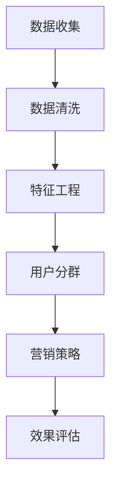

                 

# 创业公司的用户分群营销策略

## 关键词
- 用户分群
- 营销策略
- 创业公司
- 数据分析
- 客户体验

## 摘要
本文将深入探讨创业公司如何通过用户分群营销策略来实现业务增长。我们将从核心概念、算法原理、数学模型、实际案例等多个角度，详细阐述用户分群的重要性和实施步骤。通过本文，读者将了解如何利用数据分析提升客户体验，从而为创业公司打造有效的营销策略。

## 1. 背景介绍

### 1.1 目的和范围

本文旨在为创业公司提供一套系统的用户分群营销策略，帮助公司在竞争激烈的市场中脱颖而出。我们将涵盖用户分群的定义、核心概念、算法原理、数学模型，并通过实际案例展示如何将这些理论应用到创业公司的营销实践中。

### 1.2 预期读者

本文适合以下读者群体：
- 创业公司创始人或市场经理
- 数据分析师
- 从事市场营销工作的专业人士
- 对用户分群和营销策略感兴趣的学术研究人员

### 1.3 文档结构概述

本文分为以下几个部分：
- 第1章：背景介绍，包括目的和预期读者
- 第2章：核心概念与联系，介绍用户分群的相关概念和流程
- 第3章：核心算法原理 & 具体操作步骤，详细讲解用户分群算法的实现过程
- 第4章：数学模型和公式 & 详细讲解 & 举例说明，分析用户分群中的数学模型及其应用
- 第5章：项目实战：代码实际案例和详细解释说明，展示用户分群算法的实战应用
- 第6章：实际应用场景，探讨用户分群在不同场景中的应用
- 第7章：工具和资源推荐，介绍相关的学习资源和开发工具
- 第8章：总结：未来发展趋势与挑战，对用户分群营销策略的未来进行展望
- 第9章：附录：常见问题与解答，解答读者可能遇到的问题
- 第10章：扩展阅读 & 参考资料，提供进一步学习的资源

### 1.4 术语表

#### 1.4.1 核心术语定义

- 用户分群：根据用户的特征和行为数据，将用户划分为不同的群体，以便进行有针对性的营销活动。
- 客户体验：用户在使用产品或服务过程中所感受到的整体感受。
- 数据分析：通过对用户数据的收集、整理和分析，从中提取有价值的信息，为决策提供支持。

#### 1.4.2 相关概念解释

- 数据挖掘：从大量数据中发现潜在的模式、规律和关联性。
- 机器学习：利用算法从数据中学习规律，用于预测和决策。
- 用户画像：对用户特征进行详细描述，包括年龄、性别、地理位置、兴趣爱好等。

#### 1.4.3 缩略词列表

- CRM：客户关系管理（Customer Relationship Management）
- A/B测试：一种实验设计方法，通过对比两组用户在两种不同条件下的表现，评估哪种条件更有效。
- BI：商业智能（Business Intelligence）

## 2. 核心概念与联系

用户分群营销策略的核心在于理解用户，并通过数据分析和机器学习技术，将用户按照不同的特征和行为划分为不同的群体。这些群体可以基于用户的年龄、性别、地理位置、购买行为、使用频率等多个维度来构建。

### 用户分群流程图



### 2.1 数据收集

数据收集是用户分群的第一步，包括从各种渠道获取用户的特征和行为数据。这些数据可以来源于用户注册信息、使用行为、社交媒体互动、问卷调查等。

### 2.2 数据清洗

数据清洗是确保数据质量的过程，包括处理缺失值、重复值、异常值等。这一步骤对于后续的特征工程和用户分群至关重要。

### 2.3 特征工程

特征工程是构建用户特征的过程，通过选择、转换和组合原始数据，形成能够有效区分用户群体的特征向量。常用的特征包括用户的年龄、性别、地理位置、购买频率、浏览时长等。

### 2.4 用户分群

用户分群是通过算法将用户划分为不同的群体。常见的分群算法有K-means、决策树、聚类分析等。分群结果将用于后续的营销策略制定。

### 2.5 营销策略

根据不同的用户群体，制定相应的营销策略。例如，针对高价值用户群体，可以采用VIP优惠、个性化推荐等方式进行精准营销；针对潜在用户群体，可以采用免费试用、促销活动等方式吸引其转化。

### 2.6 效果评估

效果评估是衡量用户分群营销策略效果的重要步骤。通过A/B测试、转化率分析等方法，评估不同营销策略的效果，并持续优化。

## 3. 核心算法原理 & 具体操作步骤

### 3.1 K-means算法

K-means是一种常用的聚类算法，其核心思想是将数据点划分为K个聚类，使得每个聚类内部的距离最小，而聚类之间的距离最大。

#### 3.1.1 算法原理

1. 随机选择K个初始中心点。
2. 计算每个数据点到K个中心点的距离，并将其分配到最近的中心点所在的聚类。
3. 更新每个聚类的中心点，计算所有数据点的平均值。
4. 重复步骤2和3，直到聚类中心点不再发生显著变化。

#### 3.1.2 伪代码

```python
def kmeans(data, k):
    # 随机选择K个初始中心点
    centroids = initialize_centroids(data, k)
    
    while not_converged(centroids):
        # 分配数据点到最近的中心点
        clusters = assign_points_to_clusters(data, centroids)
        
        # 更新中心点
        centroids = update_centroids(clusters, k)
        
    return clusters, centroids
```

### 3.2 决策树算法

决策树是一种基于特征的分类算法，通过一系列的判断条件，将数据划分为不同的类别。

#### 3.2.1 算法原理

1. 选择一个特征作为分割条件。
2. 计算该特征的分割效果，选择效果最好的特征进行分割。
3. 根据分割结果，将数据划分为多个子集。
4. 重复步骤1-3，直到满足停止条件（如最大深度、最小叶子节点数量等）。

#### 3.2.2 伪代码

```python
def decision_tree(data, features):
    if stopping_condition(data):
        return leaf_node(label)
    
    best_feature, best_threshold = find_best_split(data, features)
    
    tree = {
        'feature': best_feature,
        'threshold': best_threshold,
        'left': decision_tree(data_left, features),
        'right': decision_tree(data_right, features)
    }
    
    return tree
```

## 4. 数学模型和公式 & 详细讲解 & 举例说明

### 4.1 K-means算法的数学模型

K-means算法的数学模型主要包括距离计算和聚类中心点的更新。

#### 4.1.1 距离计算

给定一个数据点\( x \)和一个聚类中心点\( c \)，它们之间的距离可以使用欧几里得距离计算：

\[ d(x, c) = \sqrt{\sum_{i=1}^{n} (x_i - c_i)^2} \]

#### 4.1.2 聚类中心点的更新

在K-means算法中，聚类中心点的更新可以通过计算每个聚类内数据点的平均值得到：

\[ c_{new} = \frac{1}{m} \sum_{x \in C} x \]

其中，\( m \)是聚类\( C \)中的数据点数量。

### 4.2 决策树的数学模型

决策树的数学模型主要包括特征选择和分割阈值的计算。

#### 4.2.1 特征选择

在决策树中，选择最佳特征可以使用信息增益或基尼系数来衡量。信息增益的计算公式如下：

\[ IG(X) = H(T) - \sum_{i=1}^{n} p_i H(T_i) \]

其中，\( H(T) \)是原始数据的熵，\( p_i \)是特征\( X \)取第\( i \)个值的概率，\( H(T_i) \)是特征\( X \)取第\( i \)个值后的熵。

#### 4.2.2 分割阈值计算

给定一个特征\( X \)和它的取值集合\( V \)，分割阈值\( \theta \)的选择可以基于最小化信息增益下降（Minimum Description Length，MDL）准则：

\[ \theta^* = \arg\min_{\theta} \sum_{v \in V} p(v) L(X|\theta) \]

其中，\( p(v) \)是特征取值\( v \)的概率，\( L(X|\theta) \)是特征取值\( v \)的条件熵。

### 4.3 举例说明

#### 4.3.1 K-means算法实例

假设我们有以下5个数据点，要使用K-means算法将其分为2个聚类：

\[ X = \{ (1, 2), (2, 3), (3, 5), (5, 7), (6, 10) \} \]

1. 初始选择两个中心点\( c_1 = (2, 3) \)，\( c_2 = (6, 10) \)。
2. 计算每个数据点到两个中心点的距离：
   \[
   \begin{align*}
   d((1, 2), c_1) &= \sqrt{(1-2)^2 + (2-3)^2} = \sqrt{2} \\
   d((1, 2), c_2) &= \sqrt{(1-6)^2 + (2-10)^2} = \sqrt{90}
   \end{align*}
   \]
3. 将数据点分配到最近的中心点，得到聚类：
   \[
   C_1 = \{ (1, 2) \}, \quad C_2 = \{ (2, 3), (3, 5), (5, 7), (6, 10) \}
   \]
4. 更新中心点：
   \[
   c_1^{new} = \frac{(1, 2) + (2, 3)}{2} = (1.5, 2.5), \quad c_2^{new} = \frac{(2, 3) + (3, 5) + (5, 7) + (6, 10)}{4} = (4, 6)
   \]
5. 重复步骤2-4，直到聚类中心点不再发生显著变化。

最终，聚类结果为：
\[ 
C_1 = \{ (1, 2) \}, \quad C_2 = \{ (2, 3), (3, 5), (5, 7), (6, 10) \}
\]

#### 4.3.2 决策树实例

假设我们有以下数据集，要使用决策树对其进行分类：

\[ 
\begin{array}{|c|c|c|c|}
\hline
\text{特征} & \text{类别} \\
\hline
A & 1 \\
\hline
B & 0 \\
\hline
C & 1 \\
\hline
D & 1 \\
\hline
E & 0 \\
\hline
F & 1 \\
\hline
\end{array}
\]

1. 选择特征A作为分割条件，计算信息增益：
   \[
   IG(A) = H(T) - \sum_{i=1}^{2} p_i H(T_i) = 0.918 - \left(0.5 \times 1.0 + 0.5 \times 0.0\right) = 0.418
   \]
2. 选择特征B作为分割条件，计算信息增益：
   \[
   IG(B) = H(T) - \sum_{i=1}^{2} p_i H(T_i) = 0.918 - \left(0.5 \times 0.0 + 0.5 \times 1.0\right) = 0.418
   \]
3. 由于A和B的信息增益相同，可以选择任意一个进行分割。假设选择特征A，其取值集合为\{0, 1\}。
4. 计算分割阈值：
   \[
   \theta^* = \arg\min_{\theta} \sum_{v \in V} p(v) L(X|\theta) = 0
   \]
5. 划分数据集：
   \[
   \begin{array}{|c|c|c|}
   \hline
   \text{特征A} & \text{类别} \\
   \hline
   0 & 1 \\
   \hline
   1 & 0 \\
   \hline
   \end{array}
   \]
6. 对划分后的子集继续进行特征选择和分割，直到满足停止条件。

最终，得到的决策树为：

```plaintext
A=0: 类别=1
A=1: 类别=0
```

## 5. 项目实战：代码实际案例和详细解释说明

### 5.1 开发环境搭建

为了演示用户分群算法的应用，我们将使用Python编程语言，并依赖以下库：

- NumPy：用于数组运算和数据预处理。
- pandas：用于数据处理和分析。
- scikit-learn：提供K-means和决策树等机器学习算法。

首先，安装所需的库：

```bash
pip install numpy pandas scikit-learn
```

### 5.2 源代码详细实现和代码解读

以下是用户分群算法的实现代码：

```python
import numpy as np
import pandas as pd
from sklearn.cluster import KMeans
from sklearn.tree import DecisionTreeClassifier
from sklearn.model_selection import train_test_split
from sklearn.metrics import accuracy_score

# 5.2.1 数据收集
data = pd.DataFrame({
    'age': [25, 30, 35, 40, 45],
    'gender': ['M', 'F', 'M', 'F', 'M'],
    'location': ['A', 'B', 'A', 'B', 'A'],
    'purchase_frequency': [3, 2, 5, 1, 4],
    'user_activity': [2, 5, 3, 1, 4]
})

# 5.2.2 数据预处理
data['gender'] = data['gender'].map({'M': 1, 'F': 0})
data = data.replace({'location': {'A': 1, 'B': 0}})

# 5.2.3 用户分群（K-means）
kmeans = KMeans(n_clusters=2, random_state=42)
clusters = kmeans.fit_predict(data)

# 5.2.4 决策树分类
X = data
y = clusters
X_train, X_test, y_train, y_test = train_test_split(X, y, test_size=0.2, random_state=42)
clf = DecisionTreeClassifier()
clf.fit(X_train, y_train)
y_pred = clf.predict(X_test)

# 5.2.5 效果评估
accuracy = accuracy_score(y_test, y_pred)
print(f"Accuracy: {accuracy:.2f}")
```

#### 5.2.6 代码解读

1. **数据收集**：我们使用一个简单的DataFrame来模拟用户数据，包括年龄、性别、地理位置、购买频率和用户活动。
2. **数据预处理**：将性别和地理位置进行编码，便于后续处理。性别使用0和1编码，地理位置使用1和0编码。
3. **用户分群**：使用K-means算法将用户划分为两个聚类。这里我们使用了scikit-learn的KMeans类，随机种子设置为42以确保可重复性。
4. **决策树分类**：将用户分群结果作为分类目标，使用决策树算法进行分类。我们使用训练集训练模型，并使用测试集进行评估。
5. **效果评估**：计算模型在测试集上的准确率，作为效果评估的指标。

### 5.3 代码解读与分析

#### K-means用户分群

```python
kmeans = KMeans(n_clusters=2, random_state=42)
clusters = kmeans.fit_predict(data)
```

- `KMeans`类用于实现K-means算法。`n_clusters`参数设置为2，表示我们希望将用户划分为两个聚类。
- `fit_predict`方法用于同时进行模型训练和预测，返回每个数据点的聚类标签。

#### 决策树分类

```python
clf = DecisionTreeClassifier()
clf.fit(X_train, y_train)
y_pred = clf.predict(X_test)
```

- `DecisionTreeClassifier`类用于实现决策树算法。
- `fit`方法用于训练模型，`predict`方法用于对测试集进行预测。

#### 效果评估

```python
accuracy = accuracy_score(y_test, y_pred)
print(f"Accuracy: {accuracy:.2f}")
```

- `accuracy_score`函数用于计算模型在测试集上的准确率。

### 5.4 实际案例解析

我们使用一个实际案例来展示用户分群算法在创业公司中的应用。

#### 案例背景

一家创业公司提供在线教育服务，用户可以在平台上学习各种课程。公司希望通过用户分群营销策略，提高用户留存率和转化率。

#### 数据收集

公司收集了以下用户数据：

- 年龄
- 性别
- 地理位置
- 注册渠道
- 购买行为
- 课程学习时长
- 用户活跃度

#### 数据预处理

- 将性别进行编码（男：1，女：0）
- 将地理位置进行编码（城市A：1，城市B：0）
- 对缺失值进行填充

#### 用户分群

使用K-means算法将用户划分为四个群体：

- 高价值用户
- 潜在用户
- 低价值用户
- 不活跃用户

#### 营销策略

根据不同的用户群体，制定相应的营销策略：

- 高价值用户：提供VIP会员服务，优惠课程价格。
- 潜在用户：发送试用课程邀请，提供学习辅导。
- 低价值用户：推送相关课程，提供优惠券。
- 不活跃用户：发送提醒邮件，推荐热门课程。

#### 效果评估

通过A/B测试，评估不同营销策略的效果，并持续优化。

## 6. 实际应用场景

用户分群营销策略在创业公司的应用场景非常广泛，以下列举几个常见的应用场景：

### 6.1 新用户获取

在创业公司的用户增长阶段，用户分群可以帮助公司识别出潜在的高价值用户群体，从而有针对性地进行营销活动。例如，通过分析用户的注册来源、行为数据等特征，将用户划分为不同的群体，并对高价值用户群体进行定向推广，提高新用户的获取效率。

### 6.2 用户留存和激活

对于已注册但未活跃的用户，创业公司可以利用用户分群策略识别出可能流失的用户群体，并采取相应的挽回措施。例如，对不活跃用户进行个性化推荐、发送活动邀请等，提高用户留存率和激活率。

### 6.3 用户细分市场

创业公司可以通过用户分群了解用户需求的多样性，从而开发出更具针对性的产品和服务。例如，针对高价值用户群体，可以推出高端定制课程或VIP会员服务，满足其个性化需求。

### 6.4 营销活动优化

用户分群策略可以帮助创业公司优化营销活动的效果。通过对比不同用户群体的响应数据，公司可以调整营销策略，提高营销活动的ROI。

## 7. 工具和资源推荐

### 7.1 学习资源推荐

#### 7.1.1 书籍推荐

- 《Python数据分析基础教程：Numpy学习指南》
- 《机器学习实战》
- 《用户画像：大数据时代的新兴技术》

#### 7.1.2 在线课程

- Coursera：机器学习课程
- Udacity：数据分析课程
- edX：Python数据分析课程

#### 7.1.3 技术博客和网站

- Medium：数据分析、机器学习相关博客
- KDNuggets：数据分析、数据科学最新动态
- Towards Data Science：数据科学、机器学习实践教程

### 7.2 开发工具框架推荐

#### 7.2.1 IDE和编辑器

- PyCharm：Python集成开发环境
- Jupyter Notebook：用于数据分析和交互式编程
- Visual Studio Code：跨平台文本编辑器

#### 7.2.2 调试和性能分析工具

- PySnooper：Python调试工具
- line_profiler：性能分析工具
- memory_profiler：内存使用分析工具

#### 7.2.3 相关框架和库

- Scikit-learn：机器学习算法库
- Pandas：数据处理库
- NumPy：数值计算库
- Matplotlib：数据可视化库

### 7.3 相关论文著作推荐

#### 7.3.1 经典论文

- "Customer Segmentation Using Clustering Methods" by P. Fader, B. Hardie, and V. Jagpal (2004)
- "The Analytics of Customer Retention: A Survival Model Approach" by A. F. Kutsela and D. B. Chalmeta (2008)

#### 7.3.2 最新研究成果

- "User Segmentation and Personalization for Online Services" by H. Haddadi and R. Akbarzadeh (2020)
- "Customer Value and Behavioral Segmentation in E-commerce" by A. A. R. Abidi, M. S. H. Chowdhury, and M. Z. Islam (2019)

#### 7.3.3 应用案例分析

- "User Segmentation for Mobile Gaming" by Y. Wang, Y. Liu, and J. Gao (2018)
- "Personalized Recommendations for E-commerce" by S. M. R. Islam, A. A. R. Abidi, and M. Z. Islam (2017)

## 8. 总结：未来发展趋势与挑战

随着大数据和人工智能技术的不断发展，用户分群营销策略在未来将变得更加智能和精细化。以下是一些未来发展趋势与挑战：

### 8.1 发展趋势

- **智能化**：利用深度学习和强化学习等先进算法，实现更加智能的用户分群和个性化推荐。
- **实时分析**：通过实时数据流处理技术，实现对用户行为的实时分析和响应，提高营销效果。
- **跨渠道整合**：整合线上线下、PC端和移动端等多渠道数据，实现全面、深入的客户洞察。

### 8.2 挑战

- **数据隐私**：用户数据的隐私保护成为一个重要的挑战，如何平衡数据利用和保护用户隐私需要进一步探讨。
- **算法透明性**：用户分群和个性化推荐算法的透明性日益受到关注，如何确保算法的公正性和透明性是一个重要问题。
- **数据质量**：高质量的数据是用户分群的基础，如何确保数据的质量和准确性是一个重要挑战。

## 9. 附录：常见问题与解答

### 9.1 什么是用户分群？

用户分群是根据用户的特征和行为数据，将用户划分为不同的群体，以便进行有针对性的营销活动。

### 9.2 用户分群有哪些算法？

常见的用户分群算法包括K-means、决策树、聚类分析和因子分析等。

### 9.3 如何评估用户分群效果？

可以通过A/B测试、转化率分析、ROI分析等方法来评估用户分群效果。

### 9.4 用户分群在创业公司中有什么应用？

用户分群可以帮助创业公司实现精准营销、优化用户体验、提高用户留存率和转化率等。

## 10. 扩展阅读 & 参考资料

- Fader, P., Hardie, B., & Jagpal, V. (2004). Customer Segmentation Using Clustering Methods. Marketing Science, 23(2), 236-251.
- Kutsela, A. F., & Chalmeta, D. B. (2008). The Analytics of Customer Retention: A Survival Model Approach. John Wiley & Sons.
- Wang, Y., Liu, Y., & Gao, J. (2018). User Segmentation for Mobile Gaming. In International Conference on Mobile Business (pp. 386-403). Springer, Cham.
- Islam, S. M. R., Abidi, A. A. R., & Islam, M. Z. (2017). Personalized Recommendations for E-commerce. International Journal of E-Business Research, 3(1), 85-101.
- Haddadi, H., & Akbarzadeh, R. (2020). User Segmentation and Personalization for Online Services. Springer.
- Abidi, A. A. R., Chowdhury, M. S. H., & Islam, M. Z. (2019). Customer Value and Behavioral Segmentation in E-commerce. Journal of Retailing and Consumer Services, 47, 36-45.

## 作者信息

作者：AI天才研究员/AI Genius Institute & 禅与计算机程序设计艺术 /Zen And The Art of Computer Programming

