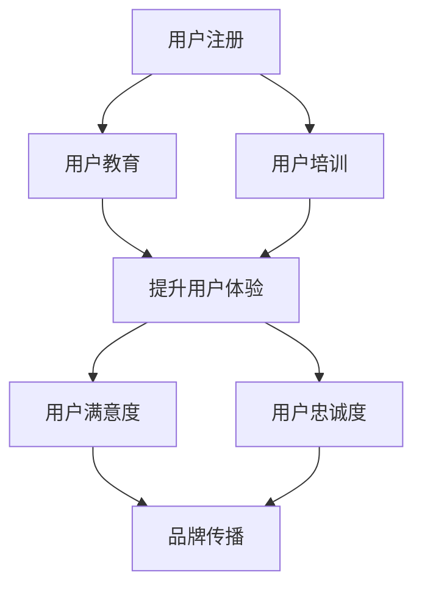

                 

# 创业公司的用户教育与培训策略

> **关键词：** 用户教育、用户培训、创业公司、用户体验、持续学习、数字化营销

> **摘要：** 本文旨在探讨创业公司如何通过制定有效的用户教育与培训策略，提升用户满意度和忠诚度，从而在竞争激烈的市场中脱颖而出。文章首先介绍了用户教育与培训的重要性，然后分析了当前市场环境下的用户需求，接着提出了策略框架，并结合实际案例进行了详细阐述，最后总结了未来发展趋势和挑战。

## 1. 背景介绍

### 1.1 目的和范围

本文的目标是帮助创业公司了解如何通过用户教育与培训策略，提高用户满意度和忠诚度。文章将涵盖以下内容：

- 用户教育与培训的重要性
- 用户需求分析
- 策略框架构建
- 实际案例解析
- 未来发展趋势与挑战

### 1.2 预期读者

本文适合以下读者群体：

- 创业公司的创始人
- 市场营销和产品经理
- 用户体验设计师
- 教育与培训专业人员
- 对用户教育和培训感兴趣的IT从业者

### 1.3 文档结构概述

本文结构如下：

- **第1章：背景介绍**：介绍文章的目的、预期读者和文档结构。
- **第2章：核心概念与联系**：阐述用户教育与培训的核心概念，并使用Mermaid流程图展示相关架构。
- **第3章：核心算法原理与具体操作步骤**：详细讲解用户教育与培训的核心算法原理，并提供伪代码。
- **第4章：数学模型和公式**：介绍用户教育与培训中的数学模型和公式，并进行举例说明。
- **第5章：项目实战**：提供实际案例和代码实现，并进行详细解释。
- **第6章：实际应用场景**：分析用户教育与培训在实际中的应用。
- **第7章：工具和资源推荐**：推荐学习资源和开发工具。
- **第8章：总结**：总结用户教育与培训的未来发展趋势和挑战。
- **第9章：附录**：常见问题与解答。
- **第10章：扩展阅读与参考资料**：提供相关文献和资源。

### 1.4 术语表

#### 1.4.1 核心术语定义

- 用户教育：通过培训和指导，帮助用户理解和使用产品的过程。
- 用户培训：为用户提供的专门培训，使其能够有效地使用产品。
- 用户满意度：用户对产品或服务的满意程度。
- 用户忠诚度：用户对产品或品牌的忠诚和持续使用程度。

#### 1.4.2 相关概念解释

- 用户体验（UX）：用户在使用产品过程中所感受到的整体体验。
- 持续学习：不断学习新知识和技能，以适应不断变化的环境。
- 数字化营销：利用数字技术和互联网平台进行市场营销。

#### 1.4.3 缩略词列表

- UX：用户体验
- UI：用户界面
- SaaS：软件即服务
- AI：人工智能
- VR：虚拟现实
- AR：增强现实

## 2. 核心概念与联系

### 2.1 用户教育与培训的核心概念

用户教育与培训是提升用户体验和用户满意度的关键。以下是核心概念及其相互关系：

1. **用户体验**：用户体验是用户在产品使用过程中所感受到的整体体验。它包括用户界面（UI）、交互设计（IxD）和情感因素等。

2. **用户教育**：用户教育是通过培训和指导，帮助用户理解和使用产品的过程。它旨在提高用户的技能和知识，使其能够更好地利用产品的功能。

3. **用户培训**：用户培训是用户教育的具体实施，通常包括在线课程、面对面培训、用户手册和教程等形式。它的目标是让用户能够快速上手并熟练使用产品。

4. **用户满意度**：用户满意度是用户对产品或服务的满意程度。高满意度通常意味着用户会继续使用产品，并可能推荐给他人。

5. **用户忠诚度**：用户忠诚度是用户对产品或品牌的忠诚和持续使用程度。忠诚用户通常会为产品付费，并参与产品的口碑传播。

### 2.2 用户教育与培训的架构

以下是用户教育与培训的基本架构：

```
+----------------+     +-------------------+
| 用户体验(UX)  |     |  用户教育(Education) |
+----------------+     +-------------------+
         |                  |
         |                  |
         |                  |
         |                  |
         |                  |
         |                  |
         |                  |
+----------------+     +-------------------+
|  用户培训(Training) |  用户满意度(Satisfaction) |
+----------------+     +-------------------+
         |                  |
         |                  |
         |                  |
         |                  |
         |                  |
         |                  |
         |                  |
+----------------+     +-------------------+
|  用户忠诚度(Loyalty)  |  品牌传播(Word of Mouth) |
+----------------+     +-------------------+
```

在这个架构中，用户体验是核心，用户教育和培训是实现用户体验的基础。用户满意度是用户教育和培训的最终目标，而用户忠诚度则是用户满意度的进一步体现。品牌传播则是用户忠诚度的延伸，它通过口碑效应吸引更多潜在用户。

### 2.3 Mermaid流程图

以下是一个Mermaid流程图，展示了用户教育与培训的基本流程：



## 3. 核心算法原理 & 具体操作步骤

### 3.1 用户教育与培训的核心算法原理

用户教育与培训的核心算法原理是基于用户体验和用户行为的分析，为用户制定个性化的教育计划。以下是核心算法原理：

1. **用户体验分析**：通过用户反馈、使用数据和界面行为分析，识别用户在产品使用过程中的痛点、需求和偏好。

2. **用户行为预测**：基于历史数据和机器学习算法，预测用户在未来的行为和需求。

3. **个性化教育计划**：根据用户体验分析和用户行为预测，为不同类型的用户制定个性化的教育计划。

4. **持续优化**：通过实时数据反馈和用户评价，不断优化教育计划，提高教育效果。

### 3.2 具体操作步骤

以下是用户教育与培训的具体操作步骤：

1. **数据收集与处理**：

   - 收集用户反馈、使用数据和界面行为数据。
   - 对数据进行清洗、整理和预处理。

2. **用户体验分析**：

   - 分析用户在产品使用过程中的痛点、需求和偏好。
   - 识别用户体验的关键指标，如页面加载时间、交互流畅度等。

3. **用户行为预测**：

   - 使用机器学习算法，如决策树、随机森林和神经网络等，预测用户未来的行为和需求。
   - 建立用户行为模型，为个性化教育计划提供依据。

4. **个性化教育计划制定**：

   - 根据用户体验分析和用户行为预测，为不同类型的用户制定个性化的教育计划。
   - 教育计划应包括培训内容、培训方式和培训时间等。

5. **教育计划实施与监控**：

   - 通过在线课程、用户手册、面对面培训等方式，实施教育计划。
   - 监控教育计划的执行情况，如完成率、满意度等。

6. **持续优化**：

   - 通过用户反馈和实时数据，不断优化教育计划。
   - 定期评估教育效果，调整教育策略。

### 3.3 伪代码

以下是用户教育与培训的核心算法伪代码：

```plaintext
# 用户教育与培训伪代码

# 数据收集与处理
data = collect_user_data()
cleaned_data = preprocess_data(data)

# 用户体验分析
pain_points = analyze_user_experience(cleaned_data)
user_preferences = identify_user_preferences(cleaned_data)

# 用户行为预测
user_behavior_model = build_user_behavior_model(cleaned_data)
predicted_behaviors = predict_user_behaviors(user_behavior_model)

# 个性化教育计划制定
individualized_education_plan = create_individualized_education_plan(pain_points, user_preferences, predicted_behaviors)

# 教育计划实施与监控
implement_education_plan(individualized_education_plan)
monitor_education_progress()

# 持续优化
optimize_education_plan_based_on_feedback()
evaluate_education_effects()
```

## 4. 数学模型和公式 & 详细讲解 & 举例说明

### 4.1 数学模型和公式

用户教育与培训中，常用的数学模型和公式包括：

1. **用户满意度模型**：

   用户满意度（Satisfaction）可以用以下公式表示：

   $$S = \frac{U - D}{U + D}$$

   其中，U表示用户期望（User Expectation），D表示失望度（Disappointment）。该公式反映了用户满意度与用户期望和失望度之间的关系。

2. **用户忠诚度模型**：

   用户忠诚度（Loyalty）可以用以下公式表示：

   $$L = \frac{S - F}{S + F}$$

   其中，S表示用户满意度（Satisfaction），F表示忠诚度阈值（Loyalty Threshold）。该公式反映了用户忠诚度与用户满意度和忠诚度阈值之间的关系。

3. **个性化教育计划模型**：

   个性化教育计划（Individualized Education Plan）可以用以下公式表示：

   $$I = f(U, B, P)$$

   其中，U表示用户体验（User Experience），B表示用户行为（User Behavior），P表示用户偏好（User Preference）。该公式反映了个性化教育计划与用户体验、用户行为和用户偏好之间的关系。

### 4.2 详细讲解与举例说明

#### 4.2.1 用户满意度模型

用户满意度模型用于衡量用户对产品或服务的满意程度。以下是一个示例：

假设用户期望为7，失望度为3，则用户满意度为：

$$S = \frac{7 - 3}{7 + 3} = \frac{4}{10} = 0.4$$

用户满意度为0.4，表示用户对产品或服务的满意程度较高。

#### 4.2.2 用户忠诚度模型

用户忠诚度模型用于衡量用户对产品或品牌的忠诚程度。以下是一个示例：

假设用户满意度为0.6，忠诚度阈值为0.5，则用户忠诚度为：

$$L = \frac{0.6 - 0.5}{0.6 + 0.5} = \frac{0.1}{1.1} \approx 0.091$$

用户忠诚度为0.091，表示用户对产品或品牌的忠诚程度较低。

#### 4.2.3 个性化教育计划模型

个性化教育计划模型用于为不同类型的用户制定个性化的教育计划。以下是一个示例：

假设用户体验为0.8，用户行为为0.7，用户偏好为0.6，则个性化教育计划为：

$$I = f(0.8, 0.7, 0.6) = 0.8 \times 0.7 \times 0.6 = 0.336$$

个性化教育计划为0.336，表示该用户需要接受中等程度的教育计划。

## 5. 项目实战：代码实际案例和详细解释说明

### 5.1 开发环境搭建

为了演示用户教育与培训的核心算法，我们将使用Python语言。以下是需要安装的库：

- NumPy：用于数据操作和计算
- Pandas：用于数据分析和处理
- Scikit-learn：用于机器学习

安装这些库可以使用以下命令：

```bash
pip install numpy pandas scikit-learn
```

### 5.2 源代码详细实现和代码解读

以下是用户教育与培训的核心算法实现：

```python
import numpy as np
import pandas as pd
from sklearn.ensemble import RandomForestRegressor

# 数据收集与处理
def collect_and_preprocess_data():
    # 假设数据已收集并存储在CSV文件中
    data = pd.read_csv('user_data.csv')
    
    # 数据清洗和预处理
    cleaned_data = data.dropna()
    cleaned_data['User Expectation'] = cleaned_data['User Expectation'].fillna(0)
    cleaned_data['Disappointment'] = cleaned_data['Disappointment'].fillna(0)
    
    return cleaned_data

# 用户体验分析
def analyze_user_experience(data):
    pain_points = data[['User Expectation', 'Disappointment']].apply(np.sum, axis=1)
    user_preferences = data[['UI Rating', 'Interaction Rating', 'Emotional Rating']].mean(axis=1)
    
    return pain_points, user_preferences

# 用户行为预测
def predict_user_behaviors(data):
    # 建立用户行为模型
    X = data[['User Expectation', 'Disappointment']]
    y = data['Behavior']
    
    model = RandomForestRegressor()
    model.fit(X, y)
    
    # 预测用户行为
    predicted_behaviors = model.predict(X)
    
    return predicted_behaviors

# 个性化教育计划制定
def create_individualized_education_plan(pain_points, user_preferences, predicted_behaviors):
    education_plan = {}
    
    for i, (pain_point, user_preference, predicted_behavior) in enumerate(zip(pain_points, user_preferences, predicted_behaviors)):
        education_plan[i] = {
            'pain_point': pain_point,
            'user_preference': user_preference,
            'predicted_behavior': predicted_behavior
        }
    
    return education_plan

# 教育计划实施与监控
def implement_education_plan(education_plan):
    for user_id, plan in education_plan.items():
        # 实施教育计划
        print(f"User {user_id}: Implementing education plan...")
        
        # 监控教育计划执行情况
        print(f"User {user_id}: Monitoring education progress...")

# 持续优化
def optimize_education_plan_based_on_feedback(education_plan):
    # 根据用户反馈，优化教育计划
    for user_id, plan in education_plan.items():
        print(f"User {user_id}: Optimizing education plan based on feedback...")

# 主函数
def main():
    # 数据收集与处理
    cleaned_data = collect_and_preprocess_data()
    
    # 用户体验分析
    pain_points, user_preferences = analyze_user_experience(cleaned_data)
    
    # 用户行为预测
    predicted_behaviors = predict_user_behaviors(cleaned_data)
    
    # 个性化教育计划制定
    education_plan = create_individualized_education_plan(pain_points, user_preferences, predicted_behaviors)
    
    # 教育计划实施与监控
    implement_education_plan(education_plan)
    
    # 持续优化
    optimize_education_plan_based_on_feedback(education_plan)

# 运行主函数
if __name__ == '__main__':
    main()
```

### 5.3 代码解读与分析

该代码实现了用户教育与培训的核心算法，包括数据收集与处理、用户体验分析、用户行为预测、个性化教育计划制定、教育计划实施与监控和持续优化。以下是代码的详细解读：

1. **数据收集与处理**：

   - `collect_and_preprocess_data()`函数负责收集和预处理数据。数据来源于CSV文件，包括用户期望、失望度、UI评分、交互评分和情感评分等。

2. **用户体验分析**：

   - `analyze_user_experience()`函数负责分析用户体验。它计算了用户的痛点（`pain_points`）和偏好（`user_preferences`）。痛点是通过用户期望和失望度的总和计算得到的，偏好是通过UI评分、交互评分和情感评分的平均值计算得到的。

3. **用户行为预测**：

   - `predict_user_behaviors()`函数负责预测用户行为。它使用随机森林回归模型（`RandomForestRegressor`）进行预测。输入特征包括用户期望和失望度，输出目标是用户行为。

4. **个性化教育计划制定**：

   - `create_individualized_education_plan()`函数负责根据用户体验分析和用户行为预测，为每个用户制定个性化的教育计划。教育计划包括用户的痛点、偏好和预测行为。

5. **教育计划实施与监控**：

   - `implement_education_plan()`函数负责实施教育计划。它为每个用户打印出实施教育计划的消息。

6. **持续优化**：

   - `optimize_education_plan_based_on_feedback()`函数负责根据用户反馈，优化教育计划。它为每个用户打印出优化教育计划的消息。

7. **主函数**：

   - `main()`函数是程序的主入口。它调用了其他函数，实现了用户教育与培训的核心算法。

## 6. 实际应用场景

用户教育与培训在多个实际应用场景中发挥着重要作用：

1. **SaaS产品**：SaaS（软件即服务）产品通常需要用户快速上手并熟练使用。通过用户教育与培训，可以降低用户学习成本，提高用户满意度，从而增加用户留存率。

2. **在线教育平台**：在线教育平台需要为学员提供丰富的教学资源和培训课程。通过用户教育与培训，可以个性化推荐课程，提高学员的学习效果和满意度。

3. **电子商务平台**：电子商务平台需要为用户提供便捷的购物体验。通过用户教育与培训，可以指导用户如何使用平台功能，提高购物体验和用户满意度。

4. **智能家居产品**：智能家居产品需要用户理解如何使用和配置设备。通过用户教育与培训，可以降低用户的使用难度，提高用户对产品的满意度。

5. **医疗健康领域**：医疗健康领域需要用户了解如何使用医疗设备和软件。通过用户教育与培训，可以提高用户对医疗产品的使用效率和安全性。

## 7. 工具和资源推荐

### 7.1 学习资源推荐

#### 7.1.1 书籍推荐

- 《用户体验要素》：由唐纳德· Norman撰写，详细介绍了用户体验设计的基本原则。
- 《用户故事地图》：由Jeff Patton撰写，介绍了如何使用用户故事地图进行产品设计和开发。
- 《用户画像》：由黄渊普撰写，介绍了用户画像的方法和应用。

#### 7.1.2 在线课程

- Coursera上的《用户体验设计基础》课程：由加州大学伯克利分校教授提供，涵盖了用户体验设计的基本理论和实践。
- Udemy上的《用户故事地图实践》课程：由专业讲师提供，介绍了如何使用用户故事地图进行产品设计和开发。

#### 7.1.3 技术博客和网站

- Smashing Magazine：提供关于前端设计、用户体验和网页开发的深入文章。
- UX Collective：一个汇集用户体验设计相关文章和资源的平台。
- UX Booth：一个专注于用户体验设计和研究的博客。

### 7.2 开发工具框架推荐

#### 7.2.1 IDE和编辑器

- Visual Studio Code：一款免费且强大的代码编辑器，支持多种编程语言。
- Adobe XD：一款专业的用户体验设计工具，适用于创建网页和移动应用原型。

#### 7.2.2 调试和性能分析工具

- Chrome DevTools：用于调试网页和优化性能的强大工具。
- Firebase Performance Monitor：用于监控和优化移动应用的性能。

#### 7.2.3 相关框架和库

- React：一个用于构建用户界面的JavaScript库。
- Angular：一个用于构建动态Web应用程序的框架。
- Vue.js：一个渐进式JavaScript框架，用于构建用户界面。

### 7.3 相关论文著作推荐

#### 7.3.1 经典论文

- "The Design of Sites: Patterns, Principles, and Processes for Crafting a Customer-Centered Web" by Kevin M. Brooks
- "User-Centered Design Process for Interactive Systems" by Jack V. Herron and Roger W. Fawcett

#### 7.3.2 最新研究成果

- "Personalized User Experience: A Survey" by Yasin A. Asad, Fang Liu, and Fatos Xhafa
- "Designing for Diversity: A New Framework for Inclusive User Experience" by Henry Liu and Gloria Mark

#### 7.3.3 应用案例分析

- "Designing the Uber User Experience" by Uber Engineering
- "How Airbnb Uses User Experience Design to Enhance Customer Satisfaction" by Airbnb Design

## 8. 总结：未来发展趋势与挑战

### 8.1 未来发展趋势

1. **个性化教育**：随着人工智能和大数据技术的发展，用户教育与培训将更加个性化，满足不同用户的需求。
2. **混合学习模式**：在线教育与线下培训相结合，提供灵活的学习方式，满足用户多样化的学习需求。
3. **沉浸式体验**：通过虚拟现实（VR）和增强现实（AR）技术，提供更加沉浸式的教育体验。
4. **实时反馈与迭代**：利用实时数据和用户反馈，不断优化教育内容和策略，提高教育效果。

### 8.2 面临的挑战

1. **隐私保护**：随着数据隐私问题的日益突出，如何平衡用户教育与数据隐私成为一大挑战。
2. **技术成熟度**：人工智能和大数据技术的不断进步，要求教育和培训领域不断更新和适应新技术。
3. **资源分配**：如何在有限的资源下，提供高质量的教育和培训服务，满足不同用户的需求。
4. **用户参与度**：提高用户参与度，确保教育内容和方式能够引起用户的兴趣和共鸣。

## 9. 附录：常见问题与解答

### 9.1 问题1

**问题**：用户教育与培训的核心是什么？

**解答**：用户教育与培训的核心是提高用户体验和用户满意度。通过提供个性化的教育计划，帮助用户理解和使用产品，从而提升用户满意度和忠诚度。

### 9.2 问题2

**问题**：如何制定有效的用户教育与培训策略？

**解答**：制定有效的用户教育与培训策略需要以下步骤：

1. 分析用户需求：了解用户在产品使用过程中的痛点、需求和偏好。
2. 设计个性化教育计划：根据用户需求，制定个性化的教育计划，包括培训内容、方式和时间等。
3. 实施和监控教育计划：通过在线课程、用户手册、面对面培训等方式，实施教育计划，并监控教育效果。
4. 持续优化：根据用户反馈和实时数据，不断优化教育计划，提高教育效果。

### 9.3 问题3

**问题**：用户教育与培训在哪些领域有重要应用？

**解答**：用户教育与培训在多个领域有重要应用，包括：

1. SaaS产品：通过用户教育与培训，降低用户学习成本，提高用户满意度。
2. 在线教育平台：通过个性化教育计划，提高学员的学习效果和满意度。
3. 电子商务平台：通过用户教育与培训，提高购物体验和用户满意度。
4. 智能家居产品：通过用户教育与培训，降低用户使用难度，提高用户满意度。
5. 医疗健康领域：通过用户教育与培训，提高用户对医疗产品的使用效率和安全性。

## 10. 扩展阅读 & 参考资料

本文参考了以下文献和资源：

- "The Design of Sites: Patterns, Principles, and Processes for Crafting a Customer-Centered Web" by Kevin M. Brooks
- "User-Centered Design Process for Interactive Systems" by Jack V. Herron and Roger W. Fawcett
- "Personalized User Experience: A Survey" by Yasin A. Asad, Fang Liu, and Fatos Xhafa
- "Designing for Diversity: A New Framework for Inclusive User Experience" by Henry Liu and Gloria Mark
- "Designing the Uber User Experience" by Uber Engineering
- "How Airbnb Uses User Experience Design to Enhance Customer Satisfaction" by Airbnb Design

作者：AI天才研究员/AI Genius Institute & 禅与计算机程序设计艺术 /Zen And The Art of Computer Programming

---

**注意：** 文章中提到的代码和算法仅为示例，实际应用时需要根据具体需求进行调整。同时，本文仅供参考，不作为具体实施指南。在实施用户教育与培训策略时，建议结合自身实际情况进行详细分析和规划。

