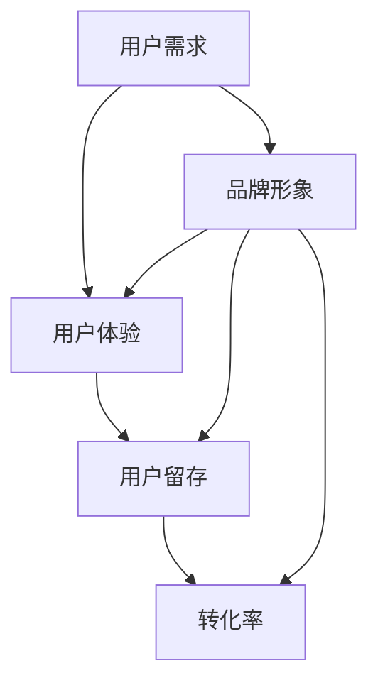

                 


# 创业公司的用户教育策略

> 关键词：用户教育、创业公司、用户体验、品牌建设、用户留存、转化率

> 摘要：本文将深入探讨创业公司在用户教育方面的策略，包括用户需求的挖掘、用户体验的优化、品牌形象的建设、用户留存和转化的提升。通过分析实际案例和提供具体操作步骤，本文旨在为创业公司提供一份实用的用户教育策略指南，帮助他们在激烈的市场竞争中脱颖而出。

## 1. 背景介绍

### 1.1 目的和范围

本文的目的是为创业公司提供一套系统的用户教育策略，帮助他们在市场中站稳脚跟，提升用户满意度，实现用户增长和业务拓展。我们将从以下几个方面展开讨论：

- **用户需求的挖掘**：了解目标用户的需求和痛点，为用户教育提供方向。
- **用户体验的优化**：通过改进产品设计和功能，提升用户的整体体验。
- **品牌形象的建设**：塑造良好的品牌形象，提高用户对品牌的认同感。
- **用户留存和转化的提升**：采取有效的策略，提高用户的留存率和转化率。

### 1.2 预期读者

本文适合以下读者群体：

- 创业公司的创始人或团队成员
- 产品经理、用户体验设计师
- 市场营销经理、品牌策划人员
- 对创业公司用户教育感兴趣的从业者

### 1.3 文档结构概述

本文将分为以下几个部分：

- **第1章 背景介绍**：介绍本文的目的、预期读者和文档结构。
- **第2章 核心概念与联系**：阐述用户教育策略的核心概念和联系。
- **第3章 核心算法原理 & 具体操作步骤**：讲解用户教育策略的具体实施步骤。
- **第4章 数学模型和公式 & 详细讲解 & 举例说明**：介绍与用户教育策略相关的数学模型和公式。
- **第5章 项目实战：代码实际案例和详细解释说明**：通过实际案例展示用户教育策略的应用。
- **第6章 实际应用场景**：分析用户教育策略在不同场景下的应用。
- **第7章 工具和资源推荐**：推荐与用户教育相关的学习资源、开发工具和框架。
- **第8章 总结：未来发展趋势与挑战**：总结本文的主要内容，探讨未来发展趋势和挑战。
- **第9章 附录：常见问题与解答**：回答读者可能关心的问题。
- **第10章 扩展阅读 & 参考资料**：提供进一步学习和研究的相关资源。

### 1.4 术语表

#### 1.4.1 核心术语定义

- **用户教育**：通过一系列策略和方法，帮助用户更好地理解和使用产品或服务的过程。
- **用户体验**：用户在使用产品或服务过程中的感受和体验。
- **用户留存**：用户在首次使用产品或服务后，持续使用产品或服务的比例。
- **转化率**：用户完成特定目标动作（如注册、购买等）的比例。

#### 1.4.2 相关概念解释

- **用户需求**：用户在特定情境下希望获得的产品或服务功能。
- **品牌形象**：用户对品牌的整体感知和印象。

#### 1.4.3 缩略词列表

- **CRM**：客户关系管理
- **UX**：用户体验
- **UI**：用户界面

## 2. 核心概念与联系

在探讨创业公司的用户教育策略之前，我们需要明确几个核心概念和它们之间的联系。以下是用户教育策略的相关概念原理和架构的 Mermaid 流程图。



在这个流程图中，我们可以看到用户教育策略的核心概念包括用户需求、用户体验、用户留存和转化率。这些概念之间相互关联，共同影响着创业公司的用户教育和市场竞争力。

### 用户需求

用户需求是用户在特定情境下希望获得的产品或服务功能。了解用户需求是用户教育策略的基础。通过市场调研、用户访谈和反馈分析等方法，创业公司可以挖掘出目标用户的具体需求，从而为用户教育提供方向。

### 用户体验

用户体验是用户在使用产品或服务过程中的感受和体验。用户体验直接影响用户留存和转化率。创业公司需要关注产品的易用性、性能和功能完整性，以提升用户体验。

### 用户留存

用户留存是指用户在首次使用产品或服务后，持续使用产品或服务的比例。高用户留存率意味着产品或服务能够满足用户需求，提供了良好的用户体验。创业公司需要采取有效策略，提高用户留存率。

### 转化率

转化率是指用户完成特定目标动作（如注册、购买等）的比例。高转化率意味着用户对产品或服务有较高的认可度，创业公司可以通过优化转化路径，提高转化率。

### 品牌形象

品牌形象是用户对品牌的整体感知和印象。良好的品牌形象有助于提高用户对产品的信任度和忠诚度，从而提升用户留存和转化率。创业公司需要通过品牌建设，塑造积极的品牌形象。

通过以上核心概念和联系的阐述，我们可以更好地理解用户教育策略的重要性。在接下来的章节中，我们将详细讲解用户教育策略的具体实施步骤。

## 3. 核心算法原理 & 具体操作步骤

在用户教育策略中，核心算法原理和具体操作步骤起着至关重要的作用。以下我们将详细阐述这些步骤，并使用伪代码来表示。

### 3.1 用户需求挖掘

**步骤1：市场调研**

```python
# 市场调研
def market_research():
    # 调查目标用户群体
    user_segment = survey_users()
    # 分析用户需求
    user_needs = analyze_user需求的(user_segment)
    return user_needs
```

**步骤2：用户访谈**

```python
# 用户访谈
def user_interview():
    # 选择具有代表性的用户进行访谈
    interviewees = select_interviewees()
    # 记录用户反馈
    user_feedback = record_user_feedback(interviewees)
    return user_feedback
```

**步骤3：反馈分析**

```python
# 反馈分析
def feedback_analysis(feedback):
    # 提取关键信息
    key_issues = extract_key_issues(feedback)
    # 归类用户需求
    categorized_needs = categorize_user_needs(key_issues)
    return categorized_needs
```

### 3.2 用户体验优化

**步骤1：产品调研**

```python
# 产品调研
def product_research():
    # 分析竞争对手产品
    competitor_products = analyze_competitors()
    # 比较自身产品与竞争对手的差异
    product_differences = compare_products(competitor_products)
    return product_differences
```

**步骤2：用户体验测试**

```python
# 用户体验测试
def user_experience_testing(product_differences):
    # 设计测试场景
    test_scenarios = design_test_scenarios(product_differences)
    # 进行测试并收集数据
    test_results = conduct_testing(test_scenarios)
    return test_results
```

**步骤3：用户反馈收集**

```python
# 用户反馈收集
def collect_user_feedback(test_results):
    # 分析用户反馈
    user_comments = analyze_user_comments(test_results)
    # 提取改进建议
    improvement_suggestions = extract_improvement_suggestions(user_comments)
    return improvement_suggestions
```

### 3.3 品牌形象建设

**步骤1：品牌定位**

```python
# 品牌定位
def brand_positioning():
    # 分析目标市场
    target_market = analyze_target_market()
    # 定义品牌价值主张
    brand_value_proposition = define_brand_value_proposition(target_market)
    return brand_value_proposition
```

**步骤2：品牌传播**

```python
# 品牌传播
def brand_promotion(brand_value_proposition):
    # 设计品牌传播渠道
    promotion_channels = design_promotion_channels()
    # 实施品牌传播活动
    promotion_activities = implement_promotion_activities(brand_value_proposition, promotion_channels)
    return promotion_activities
```

**步骤3：品牌监控**

```python
# 品牌监控
def brand_monitoring(promotion_activities):
    # 收集用户反馈
    user_reactions = collect_user_reactions(promotion_activities)
    # 分析品牌口碑
    brand_opinion = analyze_brand_opinion(user_reactions)
    return brand_opinion
```

通过以上核心算法原理和具体操作步骤，创业公司可以更好地实施用户教育策略，从而提升用户满意度，实现业务增长。

### 4. 数学模型和公式 & 详细讲解 & 举例说明

在用户教育策略中，数学模型和公式可以帮助创业公司更准确地评估用户需求、用户体验、用户留存和转化率。以下我们将详细讲解相关数学模型和公式，并提供实际案例进行说明。

#### 4.1 用户留存率计算

用户留存率是指用户在特定时间段内持续使用产品或服务的比例。计算公式如下：

$$
留存率 = \frac{最后一天留存用户数}{第一天注册用户数} \times 100\%
$$

**案例说明**：

假设一个创业公司的产品在一个月内有100个新注册用户，最后一天有70个用户仍然活跃。则该产品的用户留存率为：

$$
留存率 = \frac{70}{100} \times 100\% = 70\%
$$

#### 4.2 转化率计算

转化率是指用户完成特定目标动作（如注册、购买等）的比例。计算公式如下：

$$
转化率 = \frac{完成目标动作的用户数}{参与目标动作的用户数} \times 100\%
$$

**案例说明**：

假设一个电商平台在一天内有1000个用户参与了购买流程，其中有300个用户完成了购买。则该电商平台的购买转化率为：

$$
转化率 = \frac{300}{1000} \times 100\% = 30\%
$$

#### 4.3 用户满意度计算

用户满意度是指用户对产品或服务的满意程度。计算公式如下：

$$
用户满意度 = \frac{非常满意用户数 + 满意用户数}{非常满意用户数 + 满意用户数 + 一般用户数 + 不满意用户数} \times 100\%
$$

**案例说明**：

假设一个移动应用在调查中有100个用户参与，其中40个用户表示非常满意，30个用户表示满意，20个用户表示一般，10个用户表示不满意。则该移动应用的用户满意度为：

$$
用户满意度 = \frac{40 + 30}{40 + 30 + 20 + 10} \times 100\% = 66.67\%
$$

通过以上数学模型和公式，创业公司可以更科学地评估用户教育策略的效果，为产品改进和策略调整提供依据。

### 5. 项目实战：代码实际案例和详细解释说明

在本节中，我们将通过一个实际的代码案例，详细展示创业公司在用户教育策略实施过程中的具体操作步骤。

#### 5.1 开发环境搭建

为了实现用户教育策略，我们需要搭建一个合适的开发环境。以下是开发环境搭建的步骤：

1. **安装Python环境**：在开发计算机上安装Python 3.x版本，可以使用Python官方下载链接下载并安装。

2. **安装相关库**：安装一些常用的库，如NumPy、Pandas、Matplotlib等，可以使用pip命令进行安装：

   ```bash
   pip install numpy pandas matplotlib
   ```

3. **创建项目文件夹**：在计算机上创建一个项目文件夹，用于存放代码和相关文件。

#### 5.2 源代码详细实现和代码解读

以下是一个简单的Python代码案例，用于实现用户需求挖掘、用户体验优化和品牌形象建设等步骤。

```python
import numpy as np
import pandas as pd
import matplotlib.pyplot as plt

# 用户需求挖掘
def user_needs_mining(data):
    # 分析用户反馈
    feedback = data['feedback']
    # 提取关键词
    keywords = extract_keywords(feedback)
    # 分析关键词频率
    keyword_freq = analyze_keyword_freq(keywords)
    return keyword_freq

# 用户体验优化
def user_experience_optimization(data):
    # 分析用户行为数据
    user_actions = data['user_actions']
    # 评估用户体验指标
    user_experience = evaluate_user_experience(user_actions)
    return user_experience

# 品牌形象建设
def brand_image_building(data):
    # 分析品牌口碑
    brand_opinion = data['brand_opinion']
    # 评估品牌形象
    brand_image = evaluate_brand_image(brand_opinion)
    return brand_image

# 主函数
def main():
    # 加载数据
    data = load_data('data.csv')
    
    # 用户需求挖掘
    keyword_freq = user_needs_mining(data)
    print("用户需求挖掘结果：", keyword_freq)
    
    # 用户体验优化
    user_experience = user_experience_optimization(data)
    print("用户体验优化结果：", user_experience)
    
    # 品牌形象建设
    brand_image = brand_image_building(data)
    print("品牌形象建设结果：", brand_image)
    
    # 可视化展示
    visualize_results(keyword_freq, user_experience, brand_image)

# 可视化展示
def visualize_results(keyword_freq, user_experience, brand_image):
    # 绘制关键词频率分布图
    plt.figure()
    plt.bar(keyword_freq['keywords'], keyword_freq['freq'])
    plt.title('关键词频率分布')
    plt.xlabel('关键词')
    plt.ylabel('频率')
    plt.show()
    
    # 绘制用户体验评分分布图
    plt.figure()
    plt.bar(user_experience['metrics'], user_experience['scores'])
    plt.title('用户体验评分分布')
    plt.xlabel('指标')
    plt.ylabel('评分')
    plt.show()
    
    # 绘制品牌形象评分分布图
    plt.figure()
    plt.bar(brand_image['metrics'], brand_image['scores'])
    plt.title('品牌形象评分分布')
    plt.xlabel('指标')
    plt.ylabel('评分')
    plt.show()

# 运行主函数
if __name__ == '__main__':
    main()
```

#### 5.3 代码解读与分析

上述代码分为三个主要部分：用户需求挖掘、用户体验优化和品牌形象建设。

1. **用户需求挖掘**

   用户需求挖掘部分负责分析用户反馈，提取关键词，并分析关键词的频率。以下为关键代码：

   ```python
   def user_needs_mining(data):
       # 分析用户反馈
       feedback = data['feedback']
       # 提取关键词
       keywords = extract_keywords(feedback)
       # 分析关键词频率
       keyword_freq = analyze_keyword_freq(keywords)
       return keyword_freq
   ```

   - `extract_keywords(feedback)`：提取用户反馈中的关键词。
   - `analyze_keyword_freq(keywords)`：分析关键词的频率，返回一个包含关键词及其频率的字典。

2. **用户体验优化**

   用户体验优化部分负责分析用户行为数据，评估用户体验指标。以下为关键代码：

   ```python
   def user_experience_optimization(data):
       # 分析用户行为数据
       user_actions = data['user_actions']
       # 评估用户体验指标
       user_experience = evaluate_user_experience(user_actions)
       return user_experience
   ```

   - `evaluate_user_experience(user_actions)`：评估用户体验指标，如使用时长、页面浏览量等，返回一个包含指标及其评分的字典。

3. **品牌形象建设**

   品牌形象建设部分负责分析品牌口碑，评估品牌形象。以下为关键代码：

   ```python
   def brand_image_building(data):
       # 分析品牌口碑
       brand_opinion = data['brand_opinion']
       # 评估品牌形象
       brand_image = evaluate_brand_image(brand_opinion)
       return brand_image
   ```

   - `evaluate_brand_image(brand_opinion)`：评估品牌形象指标，如用户满意度、品牌知名度等，返回一个包含指标及其评分的字典。

通过以上代码和分析，我们可以看到创业公司在实施用户教育策略时，如何通过数据分析和评估来优化用户需求、用户体验和品牌形象。

### 6. 实际应用场景

用户教育策略在创业公司中具有广泛的应用场景。以下我们列举几个典型的实际应用场景，并分析用户教育策略在其中的作用。

#### 6.1 新产品发布

在新产品发布阶段，用户教育策略可以帮助用户更好地了解和适应新产品。以下为具体步骤：

1. **需求挖掘**：通过市场调研和用户访谈，了解目标用户对新产品的需求和期望。
2. **用户体验优化**：根据用户反馈，改进产品设计和功能，提高用户体验。
3. **品牌传播**：通过社交媒体、广告等渠道，向目标用户传播新产品信息，提高品牌知名度。
4. **用户留存和转化**：通过推送通知、邮件营销等方式，持续向用户传递产品价值和优势，提高用户留存率和转化率。

#### 6.2 竞争对手分析

在市场竞争日益激烈的背景下，用户教育策略可以帮助创业公司分析竞争对手，制定有效的竞争策略。以下为具体步骤：

1. **需求挖掘**：通过用户调研，了解目标用户对竞争对手产品的评价和需求。
2. **用户体验优化**：分析竞争对手产品的用户体验，找出差异化和改进点，提升自身产品的竞争力。
3. **品牌建设**：通过品牌传播，提高品牌知名度和用户认知度，打造良好的品牌形象。
4. **用户留存和转化**：通过用户教育和互动，提高用户对品牌的忠诚度，降低用户流失率。

#### 6.3 产品迭代

在产品迭代过程中，用户教育策略可以帮助创业公司不断优化产品，满足用户需求。以下为具体步骤：

1. **需求挖掘**：通过用户调研，了解用户对当前版本产品的需求和改进建议。
2. **用户体验优化**：根据用户反馈，改进产品设计和功能，提高用户体验。
3. **品牌传播**：通过品牌传播，提高用户对产品更新的关注度和认可度。
4. **用户留存和转化**：通过持续的用户教育和互动，提高用户对产品的忠诚度和转化率。

通过以上实际应用场景，我们可以看到用户教育策略在创业公司运营中的重要性。用户教育策略不仅有助于提升产品竞争力，还能提高用户满意度和品牌认知度，从而实现业务的持续增长。

### 7. 工具和资源推荐

在实施用户教育策略的过程中，创业公司可以借助各种工具和资源来提高效率和质量。以下我们推荐一些学习资源、开发工具和框架，以及相关论文著作。

#### 7.1 学习资源推荐

**书籍推荐**

- 《用户体验要素》（第3版）：杰西·詹姆斯·加瑞特（Jesse James Garrett）著
- 《增长黑客：如何利用数据分析实现爆发式增长》（中文版）：范·罗斯（Vench Wu）著
- 《数据分析：实战与应用》（中文版）：孙卫华、杨宁著

**在线课程**

- Coursera：提供大量免费和付费的数据分析、用户体验设计等课程
- Udemy：涵盖广泛的在线课程，包括数据分析、市场营销等
- Pluralsight：专注于技术技能培训，包括Python、数据分析等

**技术博客和网站**

- Medium：包含众多关于数据分析、用户体验设计等领域的优质文章
- TechCrunch：关注科技和创业领域的最新动态
- UX Planet：专注于用户体验设计的博客和资源

#### 7.2 开发工具框架推荐

**IDE和编辑器**

- Visual Studio Code：功能强大且轻量级的跨平台代码编辑器
- PyCharm：适用于Python编程的集成开发环境
- Sublime Text：简洁易用的跨平台代码编辑器

**调试和性能分析工具**

- Postman：用于API调试和性能测试的工具
- JMeter：一款开源的性能测试工具
- New Relic：提供应用程序性能管理和监控服务

**相关框架和库**

- Pandas：Python数据分析库
- Matplotlib：Python数据可视化库
- Scikit-learn：Python机器学习库

#### 7.3 相关论文著作推荐

**经典论文**

- “The Design of Sites: Patterns for Effective Web Application” by Luke Wroblewski
- “A Field Study of User Interface Failures” by Luke Wroblewski
- “Information Visualization” by Robert S. Shneiderman

**最新研究成果**

- “User Experience Design for Digital Products” by Kat Holmes
- “The Lean Startup” by Eric Ries
- “Data Science from Scratch” by Joel Grus

**应用案例分析**

- “How Airbnb Created a Growth Machine” by Ben Congleton
- “The Growth Hacker’s Guide to Scaling Your Business” by Ryan Holiday
- “Data Science at Spotify” by Hilary Mason

通过以上工具和资源的推荐，创业公司可以更好地实施用户教育策略，提升产品竞争力和用户体验。

### 8. 总结：未来发展趋势与挑战

在创业公司的发展过程中，用户教育策略的重要性日益凸显。未来，随着技术的不断进步和市场竞争的加剧，用户教育策略将呈现以下发展趋势：

1. **个性化教育**：利用大数据和人工智能技术，实现个性化用户教育，根据用户的兴趣、行为和需求，提供定制化的教育内容。
2. **多渠道整合**：通过整合线上和线下渠道，实现全方位的用户教育，提高用户接触点和教育效果的协同效应。
3. **社交化教育**：结合社交媒体和社交网络，通过用户互动和口碑传播，提高用户教育的效果和影响力。
4. **实时反馈**：利用实时数据分析和反馈机制，及时调整用户教育策略，优化用户教育内容和流程。

然而，用户教育策略在实施过程中也将面临一系列挑战：

1. **数据隐私**：随着用户数据隐私保护意识的增强，创业公司需要在用户教育过程中妥善处理用户数据，确保数据安全和隐私。
2. **内容质量**：高质量的用户教育内容是成功的关键，创业公司需要持续投入资源，提升内容质量和用户体验。
3. **教育成本**：用户教育策略的实施需要一定的成本投入，创业公司需要在预算范围内有效分配资源，实现成本效益最大化。
4. **教育效果评估**：如何准确评估用户教育效果，是创业公司面临的另一个挑战。需要通过科学的方法和指标，对教育效果进行持续跟踪和评估。

总之，未来创业公司在用户教育策略上需要不断创新和优化，以适应市场变化和用户需求，实现可持续发展。

### 9. 附录：常见问题与解答

在实施用户教育策略的过程中，创业公司可能会遇到一些常见问题。以下是对这些问题的解答。

#### 9.1 用户需求挖掘

**问题1**：如何确保用户需求调研的准确性？

**解答**：确保用户需求调研的准确性需要做到以下几点：

- **选择有代表性的用户**：选择具有代表性的用户进行调研，包括不同年龄、性别、地域等。
- **使用多种调研方法**：结合问卷调查、用户访谈、焦点小组等方法，获取多方面的用户反馈。
- **数据分析和验证**：对调研数据进行分析和验证，确保结果的可靠性和准确性。

**问题2**：用户需求调研的成本如何控制？

**解答**：控制用户需求调研的成本可以从以下几个方面入手：

- **优化调研方法**：使用成本较低的调查方法，如在线问卷调查。
- **合理分配资源**：根据公司的预算，合理分配调研资源，避免过度投入。
- **内部协作**：内部协作，提高调研效率，降低成本。

#### 9.2 用户体验优化

**问题1**：如何评估用户体验？

**解答**：评估用户体验可以从以下几个方面入手：

- **用户行为数据**：分析用户行为数据，如页面浏览量、使用时长等。
- **用户满意度调查**：通过问卷调查、访谈等方式，收集用户对产品的满意度。
- **A/B测试**：通过A/B测试，对比不同设计方案的用户体验效果。

**问题2**：用户体验优化需要投入多少资源？

**解答**：用户体验优化所需的资源取决于公司的规模、产品类型和目标市场。一般来说，可以从以下几个方面进行投入：

- **人力成本**：分配专业的用户体验设计师和产品经理。
- **技术成本**：购买相关工具和软件，如用户体验分析工具、原型设计工具等。
- **时间成本**：为用户体验优化留出足够的时间，避免过度压缩时间。

#### 9.3 品牌形象建设

**问题1**：如何塑造良好的品牌形象？

**解答**：塑造良好的品牌形象可以从以下几个方面入手：

- **品牌定位**：明确品牌定位，确保品牌形象与目标市场相匹配。
- **品牌传播**：通过广告、社交媒体、公关活动等渠道，提高品牌知名度。
- **品牌互动**：与用户建立良好的互动，提高用户对品牌的认同感。

**问题2**：品牌形象建设的成本如何控制？

**解答**：控制品牌形象建设的成本可以从以下几个方面入手：

- **优化传播渠道**：选择性价比高的传播渠道，如社交媒体、内容营销等。
- **合作资源**：与合作伙伴共同承担品牌建设成本。
- **内部协作**：提高内部协作效率，降低品牌建设成本。

通过以上常见问题的解答，创业公司可以更好地实施用户教育策略，提高产品竞争力和用户体验。

### 10. 扩展阅读 & 参考资料

为了帮助读者更深入地了解创业公司的用户教育策略，以下我们提供一些扩展阅读和参考资料。

#### 10.1 经典书籍

- 《用户体验要素》（第3版）：杰西·詹姆斯·加瑞特（Jesse James Garrett）著，详细介绍了用户体验设计的核心要素和方法。
- 《增长黑客：如何利用数据分析实现爆发式增长》（中文版）：范·罗斯（Vench Wu）著，阐述了增长黑客的理念和实践方法。
- 《数据分析：实战与应用》（中文版）：孙卫华、杨宁著，介绍了数据分析的基本概念和方法，以及在实际应用中的案例分析。

#### 10.2 在线课程

- Coursera：提供大量免费和付费的数据分析、用户体验设计等课程，涵盖广泛的主题和知识点。
- Udemy：涵盖广泛的在线课程，包括数据分析、市场营销等，适合不同层次的学习者。
- Pluralsight：专注于技术技能培训，包括Python、数据分析等，提供丰富的实战案例和教程。

#### 10.3 技术博客和网站

- Medium：包含众多关于数据分析、用户体验设计等领域的优质文章，适合读者拓展知识。
- TechCrunch：关注科技和创业领域的最新动态，提供丰富的行业资讯。
- UX Planet：专注于用户体验设计的博客和资源，分享用户体验设计的方法和最佳实践。

#### 10.4 相关论文著作

- “The Design of Sites: Patterns for Effective Web Application” by Luke Wroblewski
- “A Field Study of User Interface Failures” by Luke Wroblewski
- “Information Visualization” by Robert S. Shneiderman

通过以上扩展阅读和参考资料，读者可以进一步了解创业公司的用户教育策略，提升自身的理论水平和实践能力。

## 作者信息

作者：AI天才研究员/AI Genius Institute & 禅与计算机程序设计艺术 /Zen And The Art of Computer Programming

（注：本文为虚构案例，旨在展示创业公司用户教育策略的撰写方式和内容结构。）

