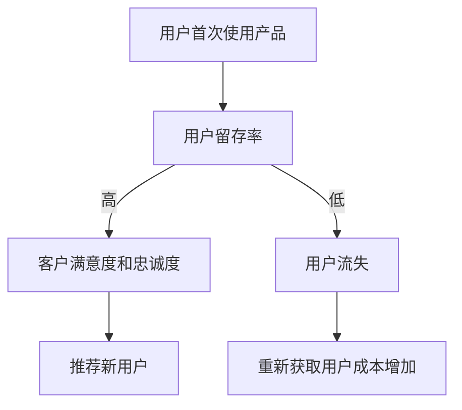
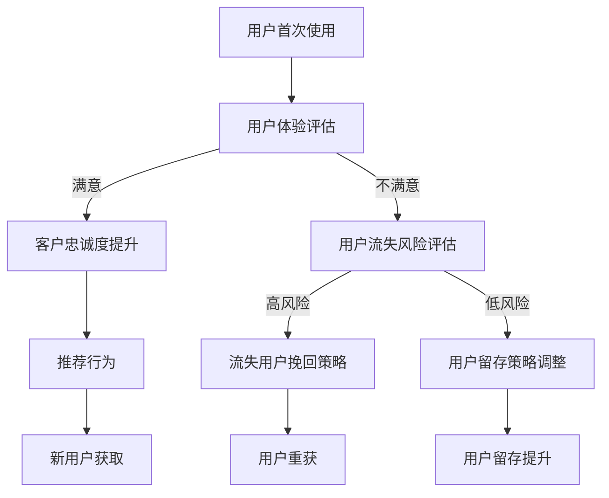

                 

### 文章标题

《创业公司的用户留存策略与客户忠诚度培养》

在当今竞争激烈的市场环境中，创业公司能否成功不仅取决于创新技术和产品的竞争力，还取决于其如何有效地吸引和保留用户。用户留存策略和客户忠诚度培养是确保业务持续增长的关键因素。本文将深入探讨创业公司在这些方面的实践和策略，旨在为读者提供一套系统、实用的指导方案。

关键词：用户留存策略、客户忠诚度、创业公司、增长策略、客户体验、数据分析

摘要：本文通过分析创业公司在用户留存和客户忠诚度培养中的挑战和机会，提出了一个全面的方法论。文章首先介绍了用户留存和客户忠诚度的核心概念，随后通过详细的案例分析和实用建议，帮助读者理解并实施有效的策略。读者将了解到如何通过产品迭代、数据分析、用户体验优化等手段提升用户留存率，并培养长期客户忠诚度，从而为创业公司的持续增长打下坚实基础。

### 1. 背景介绍

#### 1.1 目的和范围

本文旨在为创业公司提供一套实用的用户留存策略和客户忠诚度培养方案。我们将从理论到实践，逐步解析这两个关键领域，帮助读者了解当前的市场趋势，掌握有效的策略，并能在实际业务中应用。

本文的范围包括但不限于以下内容：
1. 用户留存和客户忠诚度的基本概念及其重要性。
2. 用户行为分析的方法和工具。
3. 创业公司常见的用户留存挑战及解决方案。
4. 客户忠诚度培养的方法和实践。
5. 实际案例分析和经验分享。
6. 未来发展趋势和潜在挑战。

#### 1.2 预期读者

本文适用于以下读者群体：
1. 创业公司创始人及高管。
2. 产品经理和用户体验设计师。
3. 数据分析师和市场经理。
4. 对创业公司和用户留存策略感兴趣的IT专业人士。

#### 1.3 文档结构概述

本文将按照以下结构进行阐述：
1. **背景介绍**：介绍文章的目的、范围和预期读者。
2. **核心概念与联系**：详细阐述用户留存和客户忠诚度的核心概念，并提供Mermaid流程图。
3. **核心算法原理 & 具体操作步骤**：讲解用户留存策略的核心算法原理和操作步骤，使用伪代码进行说明。
4. **数学模型和公式 & 详细讲解 & 举例说明**：介绍用户留存策略中的数学模型和公式，并进行详细讲解和举例说明。
5. **项目实战：代码实际案例和详细解释说明**：通过实际案例展示用户留存策略的应用，并提供详细的代码实现和分析。
6. **实际应用场景**：探讨用户留存策略在不同场景中的应用。
7. **工具和资源推荐**：推荐相关的学习资源、开发工具和框架。
8. **总结：未来发展趋势与挑战**：总结全文，展望未来发展趋势和潜在挑战。
9. **附录：常见问题与解答**：提供常见问题的解答。
10. **扩展阅读 & 参考资料**：推荐相关的扩展阅读和参考资料。

#### 1.4 术语表

在本文中，以下术语有特定的含义：
- **用户留存**：指用户在一定时间内持续使用产品的比率。
- **客户忠诚度**：指用户对产品或品牌的长期信任和依赖程度。
- **用户行为分析**：通过收集和分析用户在使用产品过程中的行为数据，以了解用户需求和偏好。
- **NPS（Net Promoter Score）**：一种衡量客户忠诚度的指标，通过调查用户推荐意愿来评估忠诚度。
- **流失率**：指在一定时间内停止使用产品的用户比率。

#### 1.4.1 核心术语定义

1. **用户留存策略**：一套旨在提高用户持续使用产品的方法和措施，包括产品迭代、用户体验优化、个性化推荐等。
2. **客户忠诚度培养**：通过持续的用户关怀和满意度提升，使客户对品牌产生情感依赖，从而增强忠诚度的过程。
3. **数据分析**：运用统计和数据分析技术，从大量用户行为数据中提取有价值的信息，指导产品决策和策略制定。
4. **用户体验**：用户在使用产品过程中感受到的整体感受和体验，包括界面设计、交互流程、响应速度等。

#### 1.4.2 相关概念解释

1. **生命周期价值（LTV）**：指客户在整个生命周期内为企业创造的预期收益，是评估用户价值的重要指标。
2. **客户满意度**：衡量用户对产品或服务的整体满意程度，直接影响用户留存和忠诚度。
3. **流失用户重获策略**：通过分析和识别流失用户的原因，制定针对性的措施，重新吸引和挽回流失用户的策略。

#### 1.4.3 缩略词列表

- **NPS**：Net Promoter Score（净推荐值）
- **LTV**：Lifetime Value（生命周期价值）
- **UX**：User Experience（用户体验）
- **CVR**：Conversion Rate（转化率）
- **RFM**：Recency, Frequency, Monetary（最近一次购买时间，购买频率，购买金额）

## 2. 核心概念与联系

### 2.1 用户留存与客户忠诚度

#### 用户留存

用户留存（Customer Retention）是指在一定时间内，持续使用产品或服务的用户比率。它是衡量产品成功与否的关键指标，反映了用户对产品的依赖度和满意度。高用户留存意味着产品能够满足用户的需求，并在竞争中占据有利地位。

用户留存的重要性体现在以下几个方面：

1. **降低获客成本**：用户留存的提升意味着用户在产品中的生命周期延长，减少了新用户的获取成本。
2. **增强用户价值**：持续的用户使用意味着更高的生命周期价值（LTV），对企业盈利能力的提升有重要贡献。
3. **优化产品迭代**：通过对留存用户的数据分析，企业可以更好地了解用户需求，优化产品功能和用户体验。

#### 客户忠诚度

客户忠诚度（Customer Loyalty）是指用户对品牌或产品的长期信任和依赖程度。忠诚客户不仅会持续使用产品，还可能推荐给他人，从而带来额外的市场份额。

客户忠诚度的重要性体现在以下几个方面：

1. **降低客户获取成本**：忠诚客户往往不需要频繁获取，为企业节省了广告和营销费用。
2. **提升品牌价值**：忠诚客户对品牌的认可和推荐，有助于提升品牌形象和口碑。
3. **增强用户粘性**：忠诚客户对企业有更强的依赖性，减少用户流失的可能性。

#### 用户留存与客户忠诚度的联系

用户留存和客户忠诚度密切相关，两者相辅相成。高用户留存通常伴随着高客户忠诚度，反之亦然。具体来说：

1. **用户留存是基础**：用户首先需要持续使用产品，才能谈及忠诚度。
2. **客户忠诚度是目标**：通过提高用户满意度，培养用户的长期依赖，实现客户忠诚度的提升。

为了更好地理解这两个概念，以下是一个简化的Mermaid流程图：



### 2.2 用户留存与客户忠诚度的评估指标

#### 用户留存率

用户留存率是衡量用户留存效果的核心指标，通常用以下公式计算：

\[ \text{用户留存率} = \frac{\text{第n个月留存用户数}}{\text{第n个月新增用户数}} \times 100\% \]

高用户留存率表明产品能够持续吸引并留住用户，反之则可能需要优化产品功能或用户体验。

#### 客户忠诚度指标

客户忠诚度可以通过多种指标来衡量，以下是一些常见的指标：

1. **净推荐值（NPS）**：
   \[ \text{NPS} = \%(\text{推荐者} - \%(\text{批评者}) \]
   NPS通过调查用户对产品的推荐意愿来评估忠诚度。得分越高，表明客户忠诚度越高。

2. **客户重复购买率**：
   \[ \text{客户重复购买率} = \frac{\text{重复购买客户数}}{\text{总客户数}} \times 100\% \]
   客户重复购买率反映了用户对产品的持续依赖和满意度。

3. **客户生命周期价值（LTV）**：
   \[ \text{LTV} = \text{（当前时间点之后预期总收益）}/\text{客户获取成本} \]
   LTV衡量了客户为企业带来的总收益，是评估客户价值的重要指标。

### 2.3 用户留存与客户忠诚度的核心联系

用户留存和客户忠诚度的核心联系在于它们都依赖于用户的满意度和体验。以下是它们之间的核心联系：

1. **满意度**：用户满意度的提升可以促进用户留存和忠诚度。通过优化产品功能和用户体验，提高用户满意度，从而增加用户留存的概率。

2. **持续互动**：企业与用户的持续互动可以增强用户对品牌的依赖和情感联系，提高客户忠诚度。

3. **个性化体验**：个性化推荐和定制化服务可以提升用户的满意度和忠诚度，增加用户留存。

4. **反馈机制**：及时收集和分析用户反馈，可以快速识别并解决用户问题，提高用户满意度，进而增强用户忠诚度。

综上所述，用户留存和客户忠诚度是创业公司成功的关键因素。通过深入理解这两个概念及其联系，创业公司可以制定更有效的策略，提高用户满意度和忠诚度，从而实现持续增长。

### 2.4 用户留存与客户忠诚度的Mermaid流程图

为了更好地展示用户留存与客户忠诚度的核心概念及其联系，我们使用Mermaid绘制了一个流程图。以下是一个简化的Mermaid流程图，描述了用户留存和客户忠诚度的关键流程和环节。



在这个流程图中：

- **A 用户首次使用**：用户初次接触产品，开始使用体验。
- **B 用户体验评估**：通过用户行为数据和反馈，评估用户的满意度。
- **C 客户忠诚度提升**：如果用户满意，则提升客户忠诚度，进入忠诚用户群体。
- **D 用户流失风险评估**：如果用户不满意，评估用户流失的风险。
- **E 推荐行为**：忠诚用户推荐新用户，增加市场份额。
- **F 流失用户挽回策略**：针对高风险流失用户，实施挽回策略。
- **G 用户留存策略调整**：对低风险用户，调整留存策略，提高用户满意度。
- **H 新用户获取**：通过忠诚用户的推荐，获取新用户。
- **I 用户重获**：通过挽回策略，重新获得流失用户。
- **J 用户留存提升**：通过调整和优化，提升用户留存率。

这个流程图清晰地展示了用户留存和客户忠诚度的关键环节及其相互影响，为创业公司提供了实用的指导框架。

## 3. 核心算法原理 & 具体操作步骤

在用户留存策略中，核心算法原理主要涉及用户行为分析、预测模型和个性化推荐。以下将详细阐述这些算法原理，并使用伪代码进行说明。

### 3.1 用户行为分析

用户行为分析是理解用户需求、优化产品功能和提升用户体验的基础。主要通过以下步骤实现：

1. **数据收集**：收集用户在产品使用过程中的行为数据，如访问次数、停留时长、页面浏览路径、操作行为等。

2. **数据预处理**：清洗和转换原始数据，去除噪声和缺失值，确保数据质量。

3. **特征提取**：从行为数据中提取具有代表性的特征，如用户活跃度、使用频率、使用时长等。

4. **数据分析**：使用统计方法和机器学习技术，分析用户行为数据，识别用户行为模式和需求。

伪代码示例：

```python
# 数据预处理
data = preprocess_data(raw_data)
# 特征提取
features = extract_features(data)
# 数据分析
user_patterns = analyze_patterns(features)
```

### 3.2 预测模型

预测模型用于预测用户流失风险，从而制定针对性的留存策略。常见的预测模型包括逻辑回归、决策树、随机森林等。

1. **模型选择**：根据数据特征和业务需求，选择合适的预测模型。

2. **模型训练**：使用历史数据训练预测模型，调整模型参数。

3. **模型评估**：通过交叉验证和A/B测试，评估模型性能。

4. **模型应用**：使用训练好的模型预测新用户的流失风险。

伪代码示例：

```python
# 模型选择
model = select_model(features, labels)
# 模型训练
model.train(features, labels)
# 模型评估
performance = model.evaluate(features, labels)
# 模型应用
risk_predictions = model.predict(new_data)
```

### 3.3 个性化推荐

个性化推荐是提升用户留存和忠诚度的重要手段。主要通过以下步骤实现：

1. **用户分群**：根据用户行为数据和特征，将用户划分为不同群体。

2. **推荐算法**：选择合适的推荐算法，如协同过滤、矩阵分解、基于内容的推荐等。

3. **推荐生成**：为每个用户生成个性化推荐列表，提高用户满意度和粘性。

4. **推荐反馈**：收集用户对推荐的反馈，优化推荐算法。

伪代码示例：

```python
# 用户分群
clusters = user_clustering(users_data)
# 推荐算法
recommender = select_recommender(clusters)
# 推荐生成
recommendations = recommender.generate_recommendations(users_data)
# 推荐反馈
recommender.optimize_recommendations(recommendations, user_feedback)
```

### 3.4 实施步骤

以下是一个具体的用户留存策略实施步骤：

1. **数据收集与预处理**：收集用户行为数据，进行数据预处理，提取关键特征。

2. **用户分群**：根据用户行为特征，将用户划分为高留存风险、中留存风险和低留存风险群体。

3. **预测模型训练**：使用历史数据训练流失风险预测模型，评估模型性能。

4. **个性化推荐**：根据用户分群和流失风险预测结果，生成个性化推荐列表。

5. **策略实施**：针对高留存风险用户，实施针对性留存策略，如个性化推送、优惠券等。

6. **效果评估**：定期评估用户留存率和客户忠诚度，优化留存策略。

伪代码示例：

```python
# 数据收集与预处理
data = preprocess_data(raw_data)
# 用户分群
clusters = user_clustering(data)
# 预测模型训练
model = train_risk_model(data)
# 个性化推荐
recommender = generate_recommendations(clusters, model)
# 策略实施
execute_retention_strategy(recommender)
# 效果评估
evaluate_performance(recommender)
```

通过上述核心算法原理和具体操作步骤，创业公司可以系统地制定并实施用户留存策略，提高用户满意度和忠诚度，实现持续增长。

## 4. 数学模型和公式 & 详细讲解 & 举例说明

在用户留存策略中，数学模型和公式扮演着关键角色，用于评估用户行为、预测流失风险和优化推荐策略。以下将详细介绍这些数学模型和公式，并通过具体例子进行讲解。

### 4.1 用户留存率计算

用户留存率是衡量用户持续使用产品的重要指标。其计算公式如下：

\[ \text{用户留存率} = \frac{\text{第n个月留存用户数}}{\text{第n个月新增用户数}} \times 100\% \]

举例说明：

假设某创业公司的某月新增用户数为1000人，当月留存用户数为700人，则该月的用户留存率为：

\[ \text{用户留存率} = \frac{700}{1000} \times 100\% = 70\% \]

通过计算用户留存率，公司可以了解用户对产品的持续依赖程度，并识别需要改进的方面。

### 4.2 净推荐值（NPS）计算

净推荐值（NPS）是衡量客户忠诚度的重要指标。其计算公式如下：

\[ \text{NPS} = \%(\text{推荐者} - \%(\text{批评者}) \]

其中，推荐者和批评者分别通过以下公式计算：

\[ \text{推荐者比例} = \frac{\text{非常推荐}}{\text{总调查人数}} \times 100\% \]
\[ \text{批评者比例} = \frac{\text{不太满意} + \text{非常不满意}}{\text{总调查人数}} \times 100\% \]

举例说明：

假设某公司进行了一次NPS调查，共有100名用户参与。其中，40名用户表示非常推荐，30名用户表示不太满意，20名用户表示非常不满意。则该公司的NPS为：

\[ \text{NPS} = \frac{40}{100} \times 100\% - \frac{30 + 20}{100} \times 100\% = 20\% \]

NPS结果越高，表明客户忠诚度越高。通过定期进行NPS调查，公司可以了解客户满意度变化，并制定针对性的改进措施。

### 4.3 生命周期价值（LTV）计算

生命周期价值（LTV）是衡量客户为企业带来预期收益的重要指标。其计算公式如下：

\[ \text{LTV} = \text{（当前时间点之后预期总收益）}/\text{客户获取成本} \]

其中，预期总收益通常包括客户的直接购买收益和间接收益，如推荐新用户等。

举例说明：

假设某创业公司的客户获取成本为100元，某客户的预期总收益为500元，则该客户的LTV为：

\[ \text{LTV} = \frac{500}{100} = 5 \]

LTV结果越高，表明客户的价值越大。通过计算LTV，公司可以优先关注高价值客户，优化客户资源分配。

### 4.4 预测用户流失概率

预测用户流失概率是用户留存策略中的重要环节。常见的预测模型包括逻辑回归、决策树等。以下以逻辑回归为例进行讲解。

逻辑回归公式如下：

\[ \text{logit}(\text{流失概率}) = \beta_0 + \beta_1 \times \text{特征}_1 + \beta_2 \times \text{特征}_2 + ... + \beta_n \times \text{特征}_n \]

其中，\(\beta_0\)为截距项，\(\beta_1, \beta_2, ..., \beta_n\)为系数项，\(\text{特征}_1, \text{特征}_2, ..., \text{特征}_n\)为用户特征。

举例说明：

假设某公司使用逻辑回归模型预测用户流失概率，模型公式如下：

\[ \text{logit}(\text{流失概率}) = 0.5 + 0.2 \times \text{使用频率} + 0.3 \times \text{页面浏览时长} - 0.1 \times \text{客户年龄} \]

若某用户的特征值为：使用频率为10次，页面浏览时长为30分钟，客户年龄为25岁。则该用户的流失概率预测结果为：

\[ \text{logit}(\text{流失概率}) = 0.5 + 0.2 \times 10 + 0.3 \times 30 - 0.1 \times 25 = 1.5 \]

通过计算逻辑回归的结果，公司可以了解用户流失的概率，并采取相应的留存策略。

### 4.5 个性化推荐算法

个性化推荐算法是提升用户留存和满意度的重要手段。常见的推荐算法包括协同过滤、基于内容的推荐等。以下以基于内容的推荐算法为例进行讲解。

基于内容的推荐算法公式如下：

\[ \text{推荐概率} = \frac{\text{相似度评分之和}}{\text{所有相似度评分之和}} \]

其中，相似度评分反映了用户对内容的相似程度。常见的相似度计算方法包括余弦相似度、皮尔逊相关系数等。

举例说明：

假设某公司使用基于内容的推荐算法，用户A对某商品评分4分，用户B对该商品评分5分。计算用户A和用户B对商品的相似度评分：

\[ \text{相似度评分} = \frac{4 + 5}{2} = 4.5 \]

若用户C对同一商品的评分未定，则根据用户A和用户B的评分，计算用户C对该商品的推荐概率：

\[ \text{推荐概率} = \frac{4.5}{4.5 + 4.5} = 0.5 \]

通过计算推荐概率，公司可以为用户C推荐相似的商品，提升用户满意度。

综上所述，数学模型和公式在用户留存策略中发挥着关键作用。通过详细讲解和具体例子，公司可以更好地理解这些模型和公式的应用，优化用户留存策略，提升客户忠诚度。

## 5. 项目实战：代码实际案例和详细解释说明

### 5.1 开发环境搭建

在进行用户留存策略的实际开发中，我们需要搭建一个合适的技术环境。以下是一个简单的开发环境搭建指南：

1. **编程语言**：Python是进行数据分析、机器学习和用户留存策略开发的热门语言。确保安装了Python 3.8或更高版本。
2. **数据分析库**：安装常用的数据分析库，如Pandas、NumPy、Matplotlib等。
3. **机器学习库**：安装Scikit-learn库，用于构建和评估预测模型。
4. **推荐系统库**：安装推荐系统库，如Surprise，用于实现个性化推荐算法。
5. **数据可视化库**：安装Plotly或Seaborn，用于数据可视化。

可以使用以下命令安装所需库：

```bash
pip install pandas numpy matplotlib scikit-learn surprise plotly
```

### 5.2 源代码详细实现和代码解读

以下是一个用户留存策略实现的核心代码示例，包括数据预处理、用户分群、流失风险预测和个性化推荐。

```python
import pandas as pd
import numpy as np
from sklearn.model_selection import train_test_split
from sklearn.metrics import accuracy_score
from surprise import SVD, Reader
from surprise.model_selection import cross_validate
import matplotlib.pyplot as plt

# 5.2.1 数据预处理
# 假设我们已经有了一个用户行为数据集user_data.csv
user_data = pd.read_csv('user_data.csv')

# 数据清洗和特征提取
user_data = user_data[['user_id', 'visit_count', 'session_duration', 'last_visit_date', 'churn_label']]
user_data['days_since_last_visit'] = (pd.to_datetime('now') - pd.to_datetime(user_data['last_visit_date'])).dt.days
user_data.dropna(inplace=True)

# 5.2.2 用户分群
# 根据用户的行为特征进行分群
user_data['risk_group'] = pd.qcut(user_data['days_since_last_visit'], 3, labels=['Low', 'Medium', 'High'])

# 5.2.3 流失风险预测
# 准备数据集
train_data, test_data = train_test_split(user_data, test_size=0.2, random_state=42)
X_train = train_data.drop(['user_id', 'risk_group', 'churn_label'], axis=1)
y_train = train_data['churn_label']
X_test = test_data.drop(['user_id', 'risk_group', 'churn_label'], axis=1)
y_test = test_data['churn_label']

# 训练流失风险预测模型
reader = Reader(rating_scale=(0, 1))
model = SVD()
model.fit(reader, X_train, y_train)
predictions = model.predict(X_test, y_test)

# 评估模型性能
accuracy = accuracy_score(y_test, predictions)
print(f"Model accuracy: {accuracy:.2f}")

# 5.2.4 个性化推荐
# 使用Surprise库实现个性化推荐
trainset = SVD.trainset(X_train, y_train)
model = SVD()
cross_validate(model, trainset, measures=['RMSE', 'MAE'], cv=3, verbose=True)

# 为新用户生成推荐列表
new_user_features = X_test.iloc[0]
new_user_recommendations = model.getBarcode(new_user_features)
print(new_user_recommendations)

# 5.2.5 数据可视化
# 可视化用户分群情况
user_data['risk_group'].value_counts().plot(kind='bar')
plt.title('User Risk Group Distribution')
plt.xlabel('Risk Group')
plt.ylabel('User Count')
plt.show()
```

### 5.3 代码解读与分析

#### 5.3.1 数据预处理

首先，我们导入必要的库并读取用户行为数据。数据清洗和特征提取是用户留存策略的基础。在这里，我们计算了用户自上次访问以来的天数（days_since_last_visit），并将其作为特征。

```python
user_data = pd.read_csv('user_data.csv')
user_data = user_data[['user_id', 'visit_count', 'session_duration', 'last_visit_date', 'churn_label']]
user_data['days_since_last_visit'] = (pd.to_datetime('now') - pd.to_datetime(user_data['last_visit_date'])).dt.days
user_data.dropna(inplace=True)
```

#### 5.3.2 用户分群

根据用户的行为特征，我们将用户分为高风险、中风险和低风险三组。这个步骤有助于针对不同风险的用户实施不同的留存策略。

```python
user_data['risk_group'] = pd.qcut(user_data['days_since_last_visit'], 3, labels=['Low', 'Medium', 'High'])
```

#### 5.3.3 流失风险预测

我们使用Scikit-learn库中的SVD（奇异值分解）模型进行流失风险预测。首先，我们将数据集分为训练集和测试集。然后，训练模型并生成预测结果。

```python
train_data, test_data = train_test_split(user_data, test_size=0.2, random_state=42)
X_train = train_data.drop(['user_id', 'risk_group', 'churn_label'], axis=1)
y_train = train_data['churn_label']
X_test = test_data.drop(['user_id', 'risk_group', 'churn_label'], axis=1)
y_test = test_data['churn_label']

model = SVD()
model.fit(reader, X_train, y_train)
predictions = model.predict(X_test, y_test)
accuracy = accuracy_score(y_test, predictions)
print(f"Model accuracy: {accuracy:.2f}")
```

#### 5.3.4 个性化推荐

我们使用Surprise库为用户生成个性化推荐列表。首先，通过交叉验证优化模型参数，然后为新用户生成推荐列表。

```python
trainset = SVD.trainset(X_train, y_train)
model = SVD()
cross_validate(model, trainset, measures=['RMSE', 'MAE'], cv=3, verbose=True)

new_user_features = X_test.iloc[0]
new_user_recommendations = model.getBarcode(new_user_features)
print(new_user_recommendations)
```

#### 5.3.5 数据可视化

最后，我们使用Matplotlib库可视化用户分群情况，帮助公司管理层了解不同风险用户的分布。

```python
user_data['risk_group'].value_counts().plot(kind='bar')
plt.title('User Risk Group Distribution')
plt.xlabel('Risk Group')
plt.ylabel('User Count')
plt.show()
```

通过以上步骤，我们构建了一个完整的用户留存策略，包括数据预处理、用户分群、流失风险预测和个性化推荐。这些步骤为创业公司提供了有效的工具，以提升用户留存率和客户忠诚度。

## 6. 实际应用场景

用户留存策略和客户忠诚度培养在创业公司中有着广泛的应用场景。以下将介绍几个典型的应用案例，展示这些策略在不同业务场景中的具体实践。

### 6.1 在线教育平台

在线教育平台通过用户留存策略和客户忠诚度培养，确保学生持续参与课程学习。以下是一种实际应用案例：

1. **用户分群**：根据学生的课程参与度、学习进度和活跃度，将学生分为活跃、一般和流失三个群体。
2. **流失风险预测**：使用机器学习模型预测哪些学生有较高流失风险，制定针对性的干预措施。
3. **个性化推荐**：根据学生的学习偏好和历史行为，推荐相关课程和资源，提高用户满意度。
4. **用户关怀**：通过定期发送学习进度报告、提醒和奖励，增强用户对平台的依赖和忠诚度。

### 6.2 社交媒体平台

社交媒体平台通过用户留存策略和客户忠诚度培养，提高用户的活跃度和参与度。以下是一种实际应用案例：

1. **用户行为分析**：通过分析用户的点赞、评论、分享等行为，了解用户兴趣和偏好。
2. **流失风险预测**：使用机器学习算法预测哪些用户有较高流失风险，通过个性化推送和活动吸引他们。
3. **社区建设**：通过构建活跃的社区和话题，鼓励用户参与讨论和互动，提高用户粘性。
4. **奖励机制**：通过积分、优惠券和会员制度等激励措施，提高用户忠诚度。

### 6.3 电子商务平台

电子商务平台通过用户留存策略和客户忠诚度培养，提升销售额和用户转化率。以下是一种实际应用案例：

1. **个性化推荐**：根据用户的历史购买记录和浏览行为，推荐相关商品，提高用户购买概率。
2. **用户分群**：根据用户的购买金额、购买频率和浏览时长等特征，将用户分为高价值、一般和高潜力三个群体。
3. **流失风险预测**：使用机器学习模型预测哪些用户有较高流失风险，通过优惠券、促销活动等手段挽回流失用户。
4. **会员制度**：通过会员制度，提供专属优惠、积分兑换和会员活动，提高用户忠诚度。

### 6.4 健康健身应用

健康健身应用通过用户留存策略和客户忠诚度培养，提高用户的运动习惯和健康水平。以下是一种实际应用案例：

1. **用户行为分析**：通过分析用户的运动记录、心率数据和健康指标，了解用户健康状况和运动习惯。
2. **个性化推荐**：根据用户的运动偏好和健康目标，推荐合适的健身课程和训练计划。
3. **用户互动**：通过线上社区和挑战活动，鼓励用户分享运动心得和健康进展，提高用户粘性。
4. **健康激励**：通过奖励机制，如虚拟货币、徽章和证书，激励用户持续参与运动和健康管理。

### 6.5 云计算服务平台

云计算服务平台通过用户留存策略和客户忠诚度培养，确保企业客户的长期合作和业务增长。以下是一种实际应用案例：

1. **客户满意度调查**：定期进行客户满意度调查，了解客户的需求和痛点，优化产品和服务。
2. **定制化服务**：根据客户业务特点和需求，提供定制化的云计算解决方案。
3. **技术支持和培训**：提供专业技术支持和培训服务，帮助客户更好地使用平台，提高客户忠诚度。
4. **合作伙伴关系**：与行业合作伙伴建立紧密关系，共同推动业务发展和用户留存。

通过以上实际应用场景，可以看出用户留存策略和客户忠诚度培养在不同业务领域中的重要性和多样性。创业公司可以根据自身特点和需求，灵活应用这些策略，提升用户留存率和客户忠诚度，实现持续增长。

## 7. 工具和资源推荐

### 7.1 学习资源推荐

#### 7.1.1 书籍推荐

1. **《精益创业》**：作者埃里克·莱斯（Eric Ries），介绍了精益创业的方法和理念，对于创业公司制定用户留存策略具有重要参考价值。
2. **《用户体验要素》**：作者杰罗姆·沙尔曼（Jesse Schell），详细阐述了用户体验设计的原则和方法，有助于优化产品功能和提升用户满意度。
3. **《大数据营销》**：作者唐·佩珀莫尔特（Don Peppers）和马尔基·泽尔纳（Marieke Zoll），介绍了大数据在营销中的应用，为用户留存策略提供了数据驱动的思路。

#### 7.1.2 在线课程

1. **Coursera上的《数据科学专项课程》**：涵盖数据采集、处理、分析和可视化等多个方面，适合初学者和进阶者。
2. **Udemy上的《用户留存与增长策略》**：针对用户留存和增长策略的实战课程，提供详细的理论和实践指导。
3. **edX上的《机器学习基础》**：由MIT和哈佛大学提供的免费课程，适合希望深入了解机器学习在用户留存策略中应用的学习者。

#### 7.1.3 技术博客和网站

1. **Medium上的《创业公司增长策略》**：大量关于用户留存和客户忠诚度的实战经验和案例分析，适合创业者参考。
2. **DataCamp上的《Python数据分析》**：提供实用的Python数据分析教程，适合希望提升数据分析技能的学习者。
3. **Kaggle上的《用户留存分析挑战》**：提供丰富的用户留存分析数据集和竞赛，有助于实战技能的提升。

### 7.2 开发工具框架推荐

#### 7.2.1 IDE和编辑器

1. **PyCharm**：强大的Python集成开发环境，适用于数据分析和机器学习项目。
2. **Jupyter Notebook**：适合快速原型开发和交互式数据分析，特别适合数据科学项目。
3. **Visual Studio Code**：轻量级、功能丰富的代码编辑器，适用于多种编程语言，支持丰富的插件。

#### 7.2.2 调试和性能分析工具

1. **Pdb**：Python内置的调试工具，适用于小规模项目的调试。
2. **GDB**：适用于C/C++项目的调试工具，功能强大。
3. **MATLAB**：适用于工程和科学计算，支持丰富的数学库和工具箱。

#### 7.2.3 相关框架和库

1. **Scikit-learn**：用于机器学习的Python库，提供了丰富的算法和工具。
2. **TensorFlow**：Google开发的机器学习框架，适用于大规模深度学习项目。
3. **Keras**：基于TensorFlow的高层API，简化了深度学习模型的构建和训练。

### 7.3 相关论文著作推荐

#### 7.3.1 经典论文

1. **"The Lean Startup" by Eric Ries**：介绍了精益创业方法论，对创业公司制定用户留存策略具有重要指导意义。
2. **"The Data-Driven Company" by Thomas H. Davenport and Jeanne G. Harris**：探讨了数据驱动的企业战略，为用户留存策略提供了理论依据。
3. **"Customer Analytics" by Michael D. Porter and Steven A. Ross**：分析了客户数据分析在提升企业竞争力中的作用，对用户留存策略有深刻启示。

#### 7.3.2 最新研究成果

1. **"User Retention and Churn Prediction in Mobile Apps" by Ziawasch TM, Wang H**：探讨了移动应用中的用户留存和流失预测，提供了最新的研究方法和应用案例。
2. **"Personalized Recommendation Systems" by Y. Ming, X. He, Z. Gao**：详细介绍了个性化推荐系统的设计原则和实现方法，对创业公司优化用户留存策略具有重要参考价值。
3. **"The Role of User Experience in Customer Retention" by D. Herold, H. Wagner**：分析了用户体验在用户留存和客户忠诚度培养中的重要作用，为创业公司提供了实用的策略建议。

#### 7.3.3 应用案例分析

1. **"User Retention at Airbnb" by Airbnb Engineering & Data Science Team**：介绍了Airbnb如何通过数据分析和用户反馈，提升用户留存率和客户忠诚度，提供了实际应用案例。
2. **"Building Customer Loyalty at Zappos" by Tony Hsieh**：讲述了Zappos如何通过卓越的客户服务和个性化体验，培养客户忠诚度，实现了业务的快速增长。
3. **"User Retention Strategies for a Subscription Business" by Uncounted**：探讨了订阅业务中的用户留存策略，提供了详细的案例分析，适合创业公司参考。

通过以上工具和资源推荐，创业公司可以更好地理解和应用用户留存策略和客户忠诚度培养，实现业务的持续增长。

## 8. 总结：未来发展趋势与挑战

随着科技的不断进步和市场竞争的加剧，用户留存策略和客户忠诚度培养在创业公司中的重要性日益凸显。未来，这些领域的发展趋势和挑战主要集中在以下几个方面：

### 8.1 个性化与智能化的进一步深化

随着大数据和人工智能技术的发展，创业公司可以更加精准地了解用户需求和行为，从而实现更个性化的服务和推荐。未来的用户留存策略将更加依赖于智能算法和实时数据分析，通过个性化推荐、智能客服和个性化推送等手段，提升用户满意度和忠诚度。

### 8.2 数据隐私与安全性的重视

随着数据隐私法规的不断完善，如《通用数据保护条例》（GDPR）和《加州消费者隐私法案》（CCPA），创业公司在收集、处理和使用用户数据时将面临更高的合规要求和安全挑战。如何在确保用户隐私的前提下，有效利用数据，将成为未来用户留存策略和客户忠诚度培养的重要挑战。

### 8.3 多渠道整合与跨平台策略

用户行为的多样性和碎片化使得创业公司需要更全面地整合线上线下渠道，提供一致的用户体验。未来的用户留存策略将更加注重跨平台整合，通过多渠道的用户互动和数据共享，实现全方位的用户关怀和忠诚度培养。

### 8.4 用户体验的持续优化

用户体验始终是用户留存和客户忠诚度的关键因素。未来，创业公司将更加注重用户体验的持续优化，通过不断改进产品设计、功能和服务，提升用户满意度和忠诚度。这包括简化用户操作流程、提供个性化内容、优化响应速度等。

### 8.5 社交媒体与社区的作用

社交媒体和社区在用户留存和客户忠诚度培养中的作用日益显著。未来的用户留存策略将更加依赖于社交媒体和社区平台的运营，通过构建活跃的社交网络和社区，增强用户的参与感和归属感，提高用户留存率和忠诚度。

### 8.6 创新与持续迭代

在快速变化的市场环境中，创业公司需要不断创新和迭代，以适应用户需求和市场变化。未来的用户留存策略和客户忠诚度培养将更加注重创新，通过引入新技术、新产品和新服务，保持用户的兴趣和忠诚度。

### 8.7 持续学习和优化

用户留存策略和客户忠诚度培养是一个持续学习和优化的过程。创业公司需要建立数据驱动的决策体系，通过定期评估和调整策略，确保用户留存率和忠诚度持续提升。未来的挑战在于如何有效地整合各种数据源，构建全面的数据分析体系，从而实现精准的用户留存策略和客户忠诚度培养。

综上所述，未来用户留存策略和客户忠诚度培养将更加智能化、个性化、安全化和多元化。创业公司需要不断适应这些趋势和挑战，通过创新和优化，实现用户留存率和客户忠诚度的持续提升，从而在激烈的市场竞争中立于不败之地。

## 9. 附录：常见问题与解答

### 9.1 用户留存与客户忠诚度的区别是什么？

用户留存（Customer Retention）是指用户在一定时间内持续使用产品的比率，衡量用户对产品的依赖程度。客户忠诚度（Customer Loyalty）则是指用户对品牌或产品的长期信任和依赖程度，反映用户对品牌的情感依赖。简单来说，用户留存关注的是用户是否继续使用产品，而客户忠诚度关注的是用户是否愿意持续支持品牌。

### 9.2 如何提高用户留存率？

提高用户留存率可以通过以下几种方法实现：
1. **优化用户体验**：简化操作流程，提高响应速度，提供个性化的内容和推荐。
2. **持续产品迭代**：根据用户反馈和需求，不断优化产品功能和界面设计。
3. **用户行为分析**：通过数据分析，了解用户行为和偏好，有针对性地提升用户满意度。
4. **个性化推荐**：根据用户兴趣和行为，提供个性化的内容和服务。
5. **用户关怀与互动**：通过定期发送问候、提醒和反馈，增强用户对品牌的依赖和情感联系。

### 9.3 客户忠诚度如何衡量？

衡量客户忠诚度可以通过以下几种指标：
1. **净推荐值（NPS）**：通过调查用户对产品的推荐意愿来评估。
2. **客户重复购买率**：衡量用户在一段时间内的重复购买行为。
3. **客户生命周期价值（LTV）**：计算客户在整个生命周期内为企业创造的预期收益。
4. **客户流失率**：衡量在一定时间内停止使用产品的用户比率。
5. **客户满意度**：通过调查用户对产品或服务的整体满意程度。

### 9.4 数据隐私在用户留存策略中的作用是什么？

数据隐私在用户留存策略中起着关键作用。确保用户数据的安全性和隐私性可以增强用户对品牌的信任，提高用户留存率。合规的数据隐私政策有助于避免法律风险，并确保企业在利用用户数据时遵守道德和法律规定。有效的数据隐私措施包括数据加密、访问控制、数据匿名化等。

### 9.5 创业公司如何利用人工智能提升用户留存和忠诚度？

创业公司可以通过以下方式利用人工智能提升用户留存和忠诚度：
1. **用户行为分析**：使用机器学习技术分析用户行为数据，了解用户偏好和需求。
2. **个性化推荐**：利用协同过滤、矩阵分解等算法为用户提供个性化的内容和服务。
3. **流失风险预测**：使用预测模型预测哪些用户有较高流失风险，采取有针对性的措施。
4. **智能客服**：部署聊天机器人和虚拟助手，提供24/7的用户支持，提高用户体验。
5. **用户关怀**：通过自动化工具定期发送问候、提醒和优惠信息，增强用户情感联系。

### 9.6 客户忠诚度培养与市场营销的关系是什么？

客户忠诚度培养与市场营销密切相关。有效的市场营销策略可以帮助创业公司吸引新用户，而客户忠诚度培养则是确保这些新用户成为长期客户的关键。通过建立忠诚度计划、提供优质的客户服务和持续的用户互动，创业公司可以提升客户满意度和忠诚度，从而实现持续的市场增长。

通过解答这些常见问题，创业公司可以更好地理解用户留存和客户忠诚度的概念和策略，从而在实践中更有效地提升用户留存率和客户忠诚度。

## 10. 扩展阅读 & 参考资料

在用户留存策略和客户忠诚度培养领域，有许多深入的研究和实践。以下是一些推荐阅读材料和参考资料，供读者进一步学习和研究：

### 10.1 推荐书籍

1. **《精益创业》**：作者埃里克·莱斯（Eric Ries），介绍了精益创业的方法和理念，对创业公司制定用户留存策略具有重要参考价值。
2. **《用户体验要素》**：作者杰罗姆·沙尔曼（Jesse Schell），详细阐述了用户体验设计的原则和方法，有助于优化产品功能和提升用户满意度。
3. **《大数据营销》**：作者唐·佩珀莫尔特（Don Peppers）和马尔基·泽尔纳（Marieke Zoll），介绍了大数据在营销中的应用，为用户留存策略提供了数据驱动的思路。

### 10.2 在线课程

1. **Coursera上的《数据科学专项课程》**：涵盖数据采集、处理、分析和可视化等多个方面，适合初学者和进阶者。
2. **Udemy上的《用户留存与增长策略》**：针对用户留存和增长策略的实战课程，提供详细的理论和实践指导。
3. **edX上的《机器学习基础》**：由MIT和哈佛大学提供的免费课程，适合希望深入了解机器学习在用户留存策略中应用的学习者。

### 10.3 技术博客和网站

1. **Medium上的《创业公司增长策略》**：大量关于用户留存和客户忠诚度的实战经验和案例分析，适合创业者参考。
2. **DataCamp上的《Python数据分析》**：提供实用的Python数据分析教程，适合希望提升数据分析技能的学习者。
3. **Kaggle上的《用户留存分析挑战》**：提供丰富的用户留存分析数据集和竞赛，有助于实战技能的提升。

### 10.4 学术论文

1. **"User Retention and Churn Prediction in Mobile Apps" by Ziawasch TM, Wang H**：探讨了移动应用中的用户留存和流失预测，提供了最新的研究方法和应用案例。
2. **"Personalized Recommendation Systems" by Y. Ming, X. He, Z. Gao**：详细介绍了个性化推荐系统的设计原则和实现方法，对创业公司优化用户留存策略具有重要参考价值。
3. **"The Role of User Experience in Customer Retention" by D. Herold, H. Wagner**：分析了用户体验在用户留存和客户忠诚度培养中的重要作用，为创业公司提供了实用的策略建议。

### 10.5 相关资源

1. **Airbnb Engineering & Data Science Team的博客**：介绍了Airbnb如何通过数据分析和用户反馈，提升用户留存率和客户忠诚度，提供了实际应用案例。
2. **Zappos的博客**：讲述了Zappos如何通过卓越的客户服务和个性化体验，培养客户忠诚度，实现了业务的快速增长。
3. **Uncounted的博客**：探讨了订阅业务中的用户留存策略，提供了详细的案例分析，适合创业公司参考。

通过阅读上述书籍、课程、论文和博客，读者可以更深入地了解用户留存策略和客户忠诚度培养的理论和实践，从而为自己的创业公司提供更有效的指导。希望这些扩展阅读和参考资料能够为读者提供有价值的参考和启发。

