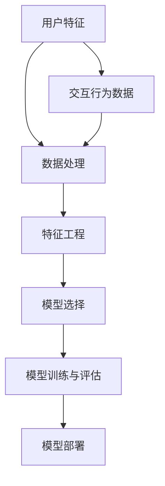

                 

### 文章标题

《创业公司的用户行为分析与预测模型构建》

#### 关键词

- 用户行为分析
- 预测模型
- 创业公司
- 数据挖掘
- 机器学习
- 算法

#### 摘要

本文将深入探讨创业公司在产品开发和运营过程中，如何利用用户行为数据构建有效的预测模型。我们将首先介绍用户行为分析的重要性，然后详细阐述构建预测模型的步骤和方法。文章还将包含一个实际项目案例，通过代码实现和详细解释，帮助读者理解如何在实际中应用这些技术和方法。

## 1. 背景介绍

### 1.1 目的和范围

本文的主要目的是为创业公司的技术团队提供一套实用的用户行为分析与预测模型构建指南。在竞争激烈的创业环境中，如何准确预测用户行为，从而优化产品设计和营销策略，成为企业成功的关键。本文将涵盖从数据收集、处理，到模型构建和优化的全过程，旨在帮助读者掌握构建高效用户行为预测模型的核心技术和方法。

本文的讨论范围包括以下几个方面：

1. **用户行为分析的重要性**：探讨用户行为数据对企业决策的驱动作用。
2. **核心概念与联系**：介绍构建预测模型所需的核心概念和其相互关系。
3. **核心算法原理**：详细解释预测模型的基础算法原理和操作步骤。
4. **数学模型与公式**：介绍相关数学模型和公式，并提供举例说明。
5. **项目实战**：通过实际代码案例，展示如何将理论应用于实践。
6. **实际应用场景**：讨论模型在不同场景下的应用和挑战。
7. **工具和资源推荐**：推荐相关学习资源、开发工具和最新研究成果。

### 1.2 预期读者

本文预期读者为：

1. 创业公司的技术团队成员，特别是涉及数据分析和机器学习的技术专家。
2. 想要在产品开发和运营中应用用户行为预测的初创公司创始人。
3. 对数据挖掘和机器学习有浓厚兴趣的大学本科生和研究生。
4. 想要深入了解创业公司运营模式的技术爱好者。

### 1.3 文档结构概述

本文结构如下：

1. **背景介绍**：介绍本文的目的、范围、预期读者及文档结构。
2. **核心概念与联系**：解释用户行为分析与预测模型构建所需的核心概念和架构。
3. **核心算法原理与具体操作步骤**：详细阐述用户行为预测模型的基础算法原理和操作步骤。
4. **数学模型与公式**：介绍预测模型中的数学模型和公式，并提供实际应用示例。
5. **项目实战**：通过实际项目案例，展示用户行为预测模型的构建和应用。
6. **实际应用场景**：讨论模型在不同场景下的应用和挑战。
7. **工具和资源推荐**：推荐学习资源、开发工具和最新研究成果。
8. **总结**：总结用户行为分析与预测模型构建的未来发展趋势与挑战。
9. **附录**：提供常见问题与解答。
10. **扩展阅读与参考资料**：列出扩展阅读材料和参考资料。

### 1.4 术语表

#### 1.4.1 核心术语定义

- **用户行为分析**：对用户在使用产品过程中的交互行为进行的数据挖掘和分析。
- **预测模型**：基于历史数据，通过机器学习算法构建的用于预测用户未来行为的模型。
- **数据挖掘**：从大量数据中提取有价值信息的过程，常用于发现数据中的模式和关联。
- **机器学习**：通过数据和算法让计算机系统自动改进其性能的过程。
- **算法**：解决问题的步骤或规则集合。

#### 1.4.2 相关概念解释

- **用户特征**：用于描述用户特征的变量，如年龄、性别、地理位置等。
- **交互行为**：用户在产品使用过程中产生的交互操作，如点击、浏览、购买等。
- **模型评估指标**：用于评估预测模型性能的指标，如准确率、召回率、F1值等。
- **特征工程**：通过选择、构造和转换原始数据特征，以提高模型预测性能的过程。

#### 1.4.3 缩略词列表

- **ML**：Machine Learning（机器学习）
- **AI**：Artificial Intelligence（人工智能）
- **DL**：Deep Learning（深度学习）
- **NLP**：Natural Language Processing（自然语言处理）
- **CV**：Computer Vision（计算机视觉）

## 2. 核心概念与联系

在构建用户行为预测模型时，了解核心概念及其相互关系至关重要。以下是构建模型所需的核心概念及其关联关系的详细解释，并通过Mermaid流程图展示其整体架构。

### 2.1 用户特征与交互行为的定义

**用户特征**：用于描述用户的变量，如年龄、性别、地理位置、职业等。这些特征可以帮助我们更好地理解用户的行为模式和偏好。

**交互行为**：用户在产品使用过程中产生的交互操作，如点击、浏览、购买、评价等。这些行为数据是我们进行预测分析的重要依据。

### 2.2 数据来源与处理

**数据来源**：用户特征和交互行为数据可以通过多种途径获取，如用户注册信息、日志记录、第三方数据平台等。

**数据处理**：数据预处理是用户行为预测模型构建的重要环节，包括数据清洗、数据集成、数据转换等步骤，以确保数据质量和一致性。

### 2.3 预测模型构建

**模型选择**：根据业务需求和数据特性，选择合适的预测模型，如逻辑回归、决策树、随机森林、神经网络等。

**模型训练与评估**：使用历史数据对模型进行训练和评估，调整参数以优化模型性能。

**模型部署**：将训练好的模型部署到生产环境，实现实时预测和决策支持。

### 2.4 关联关系与Mermaid流程图

以下是一个简化的Mermaid流程图，展示用户行为预测模型构建的核心概念和其相互关系：



在这个流程图中：

- **用户特征**和**交互行为数据**是模型构建的基础数据源。
- **数据处理**阶段对原始数据进行清洗、集成和转换。
- **特征工程**通过选择和构造新特征来提升模型性能。
- **模型选择**根据业务需求和数据特性选择合适的算法模型。
- **模型训练与评估**使用历史数据对模型进行训练和评估。
- **模型部署**将训练好的模型应用到实际业务场景。

通过上述核心概念及其关联关系的了解，我们可以为构建高效的用户行为预测模型打下坚实的基础。

## 3. 核心算法原理 & 具体操作步骤

在用户行为预测模型构建过程中，选择合适的核心算法是实现精准预测的关键。本节将详细阐述几种常见的算法原理，并使用伪代码描述其具体操作步骤。

### 3.1 逻辑回归（Logistic Regression）

逻辑回归是一种广泛应用于分类问题的算法，适用于预测用户行为是否发生（如点击、购买等）。其基本原理是通过线性模型对输入特征进行加权求和，然后通过sigmoid函数将输出值映射到0和1之间，表示发生某行为的概率。

**伪代码：**

```plaintext
function logistic_regression(X, y, alpha, max_iterations):
    w = initialize_weights(X.shape[1])
    for i in 1 to max_iterations:
        z = X * w
        y_pred = sigmoid(z)
        error = y - y_pred
        gradient = X.T * error
        w = w - alpha * gradient
    return w

function sigmoid(z):
    return 1 / (1 + exp(-z))
```

**操作步骤：**

1. **初始化权重**：随机初始化模型权重。
2. **迭代训练**：对每个样本，计算预测值y_pred和实际值y之间的误差，然后更新权重。
3. **终止条件**：达到最大迭代次数或权重变化小于某个阈值。

### 3.2 决策树（Decision Tree）

决策树是一种基于树形决策结构进行分类或回归的算法。其原理是通过一系列二值判断（特征值是否大于某个阈值），将样本逐层划分，直到达到某个终止条件（如分类标签相同或达到最大深度）。

**伪代码：**

```plaintext
function decision_tree(X, y, depth_limit):
    if all_labels_equal(y) or depth_limit == 0:
        return majority_label(y)
    else:
        best_feature, best_threshold = find_best_split(X, y)
        left_tree = decision_tree(X[X[:, best_feature] <= best_threshold], y[X[:, best_feature] <= best_threshold], depth_limit - 1)
        right_tree = decision_tree(X[X[:, best_feature] > best_threshold], y[X[:, best_feature] > best_threshold], depth_limit - 1)
        return Node(best_feature, best_threshold, left_tree, right_tree)

function find_best_split(X, y):
    best_feature = None
    best_threshold = None
    best_score = -inf
    for feature in range(X.shape[1]):
        thresholds = unique(X[:, feature])
        for threshold in thresholds:
            score = gini_index(X[X[:, feature] <= threshold], y[X[:, feature] <= threshold])
            if score > best_score:
                best_score = score
                best_feature = feature
                best_threshold = threshold
    return best_feature, best_threshold
```

**操作步骤：**

1. **终止条件**：所有样本的标签相同或达到最大深度。
2. **找到最佳切分**：计算每个特征的二值切分，选择Gini指数最大的切分。
3. **递归构建**：对于每个切分，继续构建子树。

### 3.3 随机森林（Random Forest）

随机森林是一种集成学习方法，通过构建多棵决策树并对预测结果进行投票来提高模型的稳定性和准确性。其基本原理与决策树类似，但引入了随机性来降低过拟合。

**伪代码：**

```plaintext
function random_forest(X, y, n_trees, max_depth, feature_sample_size):
    forests = []
    for _ in 1 to n_trees:
        X_sample = sample_features(X, feature_sample_size)
        tree = decision_tree(X_sample, y, max_depth)
        forests.append(tree)
    return forests

function predict(forests, X):
    predictions = []
    for tree in forests:
        prediction = decision_tree_predict(tree, X)
        predictions.append(prediction)
    return majority_vote(predictions)
```

**操作步骤：**

1. **初始化森林**：构建多棵决策树。
2. **预测**：对每个样本，收集所有决策树的预测结果，并计算多数投票结果。

### 3.4 神经网络（Neural Network）

神经网络是一种基于多层感知器（Perceptron）构建的模型，通过前向传播和反向传播算法进行训练。其基本原理是通过多层神经元对输入数据进行特征提取和变换。

**伪代码：**

```plaintext
function neural_network(X, y, layers, alpha, max_iterations):
    W = initialize_weights(layers)
    for i in 1 to max_iterations:
        z = forward propagate(X, W)
        dW = backward propagate(z, y, W)
        W = W - alpha * dW
    return W

function forward_propagate(X, W):
    a = X
    for layer in range(layers.shape[0] - 1):
        z = a * W[layer]
        a = sigmoid(z)
    z = a * W[layers.shape[0] - 1]
    return z

function backward_propagate(z, y, W):
    dZ = (z - y) * sigmoid_derivative(z)
    dW = X.T * dZ
    return dW

function sigmoid(z):
    return 1 / (1 + exp(-z))

function sigmoid_derivative(z):
    return sigmoid(z) * (1 - sigmoid(z))
```

**操作步骤：**

1. **初始化权重**：随机初始化模型权重。
2. **前向传播**：计算每个神经元的输入和输出。
3. **反向传播**：计算损失函数对权重和偏置的梯度，并更新权重。
4. **迭代训练**：重复前向传播和反向传播，直到达到最大迭代次数或模型收敛。

通过以上对逻辑回归、决策树、随机森林和神经网络等核心算法原理的详细阐述，读者可以更好地理解构建用户行为预测模型所需的技术和方法。

### 4. 数学模型和公式 & 详细讲解 & 举例说明

在用户行为预测模型的构建过程中，数学模型和公式起着至关重要的作用。这些模型不仅帮助我们理解用户行为的统计规律，还能为算法提供具体的计算框架。本节将详细介绍几种常用的数学模型和公式，并通过实际例子进行讲解。

#### 4.1 逻辑回归模型

逻辑回归是一种常用的分类模型，尤其在用户行为预测中应用广泛。它的基本公式为：

$$
P(y=1 | x; \theta) = \frac{1}{1 + e^{-(\theta^T x)}}
$$

其中，\( P(y=1 | x; \theta) \) 表示在给定特征向量 \( x \) 和模型参数 \( \theta \) 的情况下，用户行为发生（如点击、购买）的概率；\( \theta \) 是模型参数向量；\( x \) 是输入特征向量。

**举例说明**：

假设我们有以下数据集：

| 用户ID | 年龄 | 性别 | 地域 | 搜索关键词 | 点击概率 |
|--------|------|------|------|------------|----------|
| 1      | 25   | 男   | 北京 | 关键词1    | 0.6      |
| 2      | 30   | 女   | 上海 | 关键词2    | 0.4      |

使用逻辑回归模型，可以建立如下模型：

$$
P(点击 | 年龄=25, 性别=男, 地域=北京, 搜索关键词=关键词1) = \frac{1}{1 + e^{-(\theta_1 \cdot 25 + \theta_2 \cdot 1 + \theta_3 \cdot 1 + \theta_4 \cdot 1)}}
$$

通过训练，可以得到参数 \( \theta \) 的值，从而预测新的样本的点击概率。

#### 4.2 决策树模型

决策树模型通过一系列二值判断来划分数据集，其基本公式为：

$$
y = g(\theta^T x)
$$

其中，\( g(\theta^T x) \) 是决策函数，表示根据模型参数 \( \theta \) 和特征向量 \( x \) 判断的输出标签；\( \theta \) 是模型参数向量。

**举例说明**：

假设我们有以下决策树模型：

```
年龄 <= 30 ? 是 : 否
性别 = 男 ? 是 : 否
地域 = 北京 ? 是 : 否
```

对于新样本 \( x = (25, 男, 北京) \)，我们可以按照以下步骤进行判断：

1. 年龄 <= 30：是
2. 性别 = 男：是
3. 地域 = 北京：是

最终输出标签 \( y = 是 \)。

#### 4.3 神经网络模型

神经网络模型通过多层神经元对输入数据进行特征提取和变换，其基本公式为：

$$
a_{l+1} = \sigma(z_l)
$$

其中，\( a_{l+1} \) 是第 \( l+1 \) 层的激活值；\( z_l \) 是第 \( l \) 层的加权求和值；\( \sigma \) 是激活函数（如Sigmoid函数）。

**举例说明**：

假设我们有以下三层神经网络模型：

```
输入层：[输入1, 输入2, 输入3]
隐藏层1：[神经元1, 神经元2]
隐藏层2：[神经元3, 神经元4]
输出层：[输出1, 输出2]
```

使用Sigmoid激活函数，我们可以得到以下计算过程：

1. 隐藏层1的神经元1：
   $$ z_1 = (w_{11} \cdot 输入1 + w_{12} \cdot 输入2 + w_{13} \cdot 输入3 + b_1) $$
   $$ a_1 = \sigma(z_1) $$

2. 隐藏层1的神经元2：
   $$ z_2 = (w_{21} \cdot 输入1 + w_{22} \cdot 输入2 + w_{23} \cdot 输入3 + b_2) $$
   $$ a_2 = \sigma(z_2) $$

3. 隐藏层2的神经元3：
   $$ z_3 = (w_{31} \cdot a_1 + w_{32} \cdot a_2 + b_3) $$
   $$ a_3 = \sigma(z_3) $$

4. 隐藏层2的神经元4：
   $$ z_4 = (w_{41} \cdot a_1 + w_{42} \cdot a_2 + b_4) $$
   $$ a_4 = \sigma(z_4) $$

5. 输出层：
   $$ z_5 = (w_{51} \cdot a_3 + w_{52} \cdot a_4 + b_5) $$
   $$ y = \sigma(z_5) $$

通过以上计算，可以得到输出层的预测结果。

通过以上对逻辑回归、决策树和神经网络等数学模型和公式的详细讲解，读者可以更好地理解它们在用户行为预测中的应用。

### 5. 项目实战：代码实际案例和详细解释说明

为了更好地展示如何将理论应用于实际项目，我们将使用Python编程语言，结合Scikit-learn库，搭建一个简单的用户行为预测模型。本节将详细介绍开发环境搭建、源代码实现和代码解读与分析。

#### 5.1 开发环境搭建

首先，我们需要搭建一个Python开发环境。以下是推荐的开发工具和库：

- **Python**：安装Python 3.x版本，可以从[Python官网](https://www.python.org/)下载安装包。
- **Jupyter Notebook**：用于编写和运行Python代码，可以从[Anaconda官方网站](https://www.anaconda.com/products/individual)下载并安装。
- **Scikit-learn**：用于机器学习模型的构建和评估，可以通过pip安装：

  ```bash
  pip install scikit-learn
  ```

#### 5.2 源代码详细实现和代码解读

以下是一个简单的用户行为预测模型实现示例，包括数据预处理、模型选择、训练和评估等步骤。

```python
import numpy as np
import pandas as pd
from sklearn.model_selection import train_test_split
from sklearn.preprocessing import StandardScaler
from sklearn.linear_model import LogisticRegression
from sklearn.metrics import accuracy_score, confusion_matrix

# 5.2.1 数据加载与预处理
# 假设用户行为数据存储在CSV文件中
data = pd.read_csv('user_behavior.csv')

# 特征工程：选择和构造特征
features = data[['age', 'gender', 'location', 'search_keyword']]
labels = data['clicked']

# 数据标准化
scaler = StandardScaler()
features_scaled = scaler.fit_transform(features)

# 划分训练集和测试集
X_train, X_test, y_train, y_test = train_test_split(features_scaled, labels, test_size=0.2, random_state=42)

# 5.2.2 模型选择与训练
# 选择逻辑回归模型
model = LogisticRegression()
model.fit(X_train, y_train)

# 5.2.3 模型评估
# 预测测试集
y_pred = model.predict(X_test)

# 计算准确率
accuracy = accuracy_score(y_test, y_pred)
print(f"Accuracy: {accuracy}")

# 计算混淆矩阵
conf_matrix = confusion_matrix(y_test, y_pred)
print(f"Confusion Matrix:\n{conf_matrix}")
```

**代码解读与分析**：

1. **数据加载与预处理**：
   - 使用pandas库读取用户行为数据。
   - 进行特征工程，选择和构造特征，包括年龄、性别、地理位置和搜索关键词。
   - 使用StandardScaler对特征进行标准化处理，以消除不同特征之间的尺度差异。

2. **模型选择与训练**：
   - 使用Scikit-learn中的LogisticRegression模型进行训练。
   - fit方法用于训练模型，输入为特征矩阵和标签。

3. **模型评估**：
   - 使用预测方法（predict）对测试集进行预测。
   - 计算准确率和混淆矩阵，评估模型性能。

**关键代码解析**：

- **StandardScaler**：用于标准化处理，确保不同特征在相同尺度上进行比较。

  ```python
  scaler = StandardScaler()
  features_scaled = scaler.fit_transform(features)
  ```

- **train_test_split**：用于划分训练集和测试集。

  ```python
  X_train, X_test, y_train, y_test = train_test_split(features_scaled, labels, test_size=0.2, random_state=42)
  ```

- **LogisticRegression**：用于构建逻辑回归模型。

  ```python
  model = LogisticRegression()
  model.fit(X_train, y_train)
  ```

- **accuracy_score**和**confusion_matrix**：用于评估模型性能。

  ```python
  accuracy = accuracy_score(y_test, y_pred)
  conf_matrix = confusion_matrix(y_test, y_pred)
  ```

通过这个实际项目案例，读者可以了解到如何使用Python和Scikit-learn构建用户行为预测模型，并在实践中应用这些技术和方法。

### 6. 实际应用场景

用户行为预测模型在创业公司中有着广泛的应用场景，以下是一些典型的应用实例及其挑战：

#### 6.1 个性化推荐系统

**应用实例**：创业公司可以通过用户行为预测模型，预测用户对特定产品的兴趣和偏好，从而实现个性化推荐。

**挑战**：
- **数据量与多样性**：用户行为数据量庞大，且包含多种类型（如点击、浏览、购买等），需要有效的特征提取和模型选择。
- **冷启动问题**：对新用户缺乏历史数据，难以实现个性化推荐。

#### 6.2 营销活动优化

**应用实例**：通过预测用户对营销活动的响应概率，优化广告投放策略，提高转化率。

**挑战**：
- **数据质量**：用户行为数据质量直接影响预测模型的准确性，需要确保数据清洗和预处理的质量。
- **预算分配**：如何在有限的预算内，最大化营销活动的回报。

#### 6.3 客户流失预警

**应用实例**：通过预测用户流失的概率，提前采取干预措施，降低客户流失率。

**挑战**：
- **预测准确性**：需要精确预测用户流失行为，避免误报和漏报。
- **实时性**：需要实时处理用户行为数据，及时预警和干预。

#### 6.4 个性化广告投放

**应用实例**：根据用户兴趣和行为预测，精准投放广告，提高广告点击率和转化率。

**挑战**：
- **广告效果评估**：如何准确评估广告效果，调整投放策略。
- **用户隐私保护**：如何在确保用户隐私的前提下，进行个性化广告投放。

通过上述实际应用场景的分析，我们可以看到用户行为预测模型在创业公司中的重要作用，同时也面临一定的挑战。掌握有效的建模方法和技巧，能够帮助企业更好地应对这些挑战。

### 7. 工具和资源推荐

在构建用户行为预测模型的过程中，选择合适的工具和资源对于提高开发效率和模型性能至关重要。以下是一些推荐的学习资源、开发工具和框架，以及相关论文著作。

#### 7.1 学习资源推荐

**书籍推荐**：

1. **《机器学习实战》（Peter Harrington）**：详细介绍各种机器学习算法的应用实例，适合初学者。
2. **《深度学习》（Ian Goodfellow, Yoshua Bengio, Aaron Courville）**：深度学习领域的经典教材，涵盖深度学习的基本原理和应用。
3. **《用户行为分析：使用Python进行用户行为数据挖掘》（Soham Chakraborty）**：专注于用户行为分析的技术和实践。

**在线课程**：

1. **Coursera上的《机器学习》（吴恩达）**：全球知名的课程，适合入门和进阶学习。
2. **edX上的《深度学习专项课程》（Harvard University）**：由深度学习领域的权威教授授课。
3. **Udacity的《数据科学纳米学位》**：涵盖数据科学的基础知识和实践技能。

**技术博客和网站**：

1. **Kaggle**：提供丰富的数据集和机器学习竞赛，适合实践和学习。
2. **Medium**：有很多关于机器学习和数据科学的优质文章和博客。
3. **Towards Data Science**：一个专注于数据科学、机器学习和人工智能的博客平台。

#### 7.2 开发工具框架推荐

**IDE和编辑器**：

1. **Jupyter Notebook**：适合数据科学和机器学习的交互式开发。
2. **PyCharm**：功能强大的Python IDE，支持多种编程语言。
3. **VSCode**：轻量级但功能丰富的代码编辑器，支持扩展插件。

**调试和性能分析工具**：

1. **Wandb**：用于实验跟踪和模型性能分析。
2. **TensorBoard**：TensorFlow的图形化可视化工具，用于查看神经网络结构和性能。
3. **Docker**：用于构建和运行容器化应用程序，提高开发效率和一致性。

**相关框架和库**：

1. **Scikit-learn**：Python中最常用的机器学习库。
2. **TensorFlow**：谷歌开发的开源深度学习框架。
3. **PyTorch**：适用于深度学习和研究的动态神经网络库。

#### 7.3 相关论文著作推荐

**经典论文**：

1. **“Machine Learning: A Probabilistic Perspective”（Kevin P. Murphy）**：全面介绍概率视角下的机器学习理论。
2. **“Deep Learning”（Yoshua Bengio, Ian Goodfellow, Aaron Courville）**：深度学习领域的经典论文集，涵盖深度网络的结构和算法。
3. **“Recurrent Neural Networks for Language Modeling”（Yoshua Bengio et al.）**：介绍循环神经网络在语言模型中的应用。

**最新研究成果**：

1. **“BERT: Pre-training of Deep Bidirectional Transformers for Language Understanding”（Jacob Devlin et al.）**：BERT模型的详细介绍和应用。
2. **“An Overview of Event Detection in Social Media”（Yadollah Zadeh）**：社交媒体事件检测的最新进展。
3. **“User Behavior Prediction in Mobile Apps Using Machine Learning”（Yasser M. Mohammed et al.）**：移动应用用户行为预测的论文集。

**应用案例分析**：

1. **“Personalized Recommendation System at Netflix”（Justin Basilico）**：Netflix个性化推荐系统的案例分析。
2. **“Challenges in User Behavior Prediction for Mobile Apps”（Nitin S. Parush et al.）**：移动应用用户行为预测的挑战和解决方案。
3. **“A Survey of Deep Learning in Computer Vision”（A. Krizhevsky, I. Sutskever, G. E. Hinton）**：深度学习在计算机视觉中的应用综述。

通过以上推荐的工具、资源和论文，读者可以更加深入地了解用户行为预测模型的构建和应用，为实际项目提供有力的技术支持。

### 8. 总结：未来发展趋势与挑战

在快速发展的技术环境中，用户行为预测模型的应用前景广阔，但也面临诸多挑战。以下是未来发展趋势与挑战的总结：

#### 8.1 未来发展趋势

1. **深度学习与神经网络的应用**：随着深度学习技术的不断进步，神经网络在用户行为预测中的应用将更加广泛，尤其是在图像、文本和语音等多模态数据上。
2. **实时预测与动态调整**：未来的预测模型将更加注重实时性，能够根据用户行为的即时变化动态调整预测结果，从而提供更个性化的服务。
3. **联邦学习与隐私保护**：为了解决数据隐私问题，联邦学习技术将成为热门研究方向，允许多个机构在保护数据隐私的前提下共同训练模型。
4. **自动化特征工程**：自动化特征工程工具将帮助开发者从海量数据中快速提取有效特征，提高模型构建效率。
5. **多模型融合与优化**：通过融合多种机器学习模型，可以进一步提高预测性能和鲁棒性。

#### 8.2 主要挑战

1. **数据质量和多样性**：用户行为数据的多样性和质量直接影响模型的性能，如何处理噪声数据和缺失值，选择合适的特征，是当前面临的重要挑战。
2. **冷启动问题**：对新用户缺乏足够的历史数据，使得个性化推荐和预测变得困难，需要探索有效的方法来解决冷启动问题。
3. **模型解释性**：复杂的模型如深度神经网络往往缺乏解释性，难以理解其预测结果的依据，如何提高模型的可解释性是当前研究的热点。
4. **隐私保护**：随着用户隐私保护意识的提高，如何在保证模型性能的同时，保护用户隐私，是一个亟待解决的问题。
5. **实时性**：如何提高模型实时预测的能力，以满足快速变化的用户需求，是技术发展的关键挑战。

通过不断探索和创新，用户行为预测模型将在未来为创业公司带来更大的商业价值，同时也需要克服一系列技术挑战。

### 9. 附录：常见问题与解答

在构建用户行为预测模型的过程中，开发者可能会遇到各种问题。以下是一些常见问题的解答，以帮助读者解决实际操作中的困难。

#### 9.1 如何处理缺失值？

缺失值处理是数据预处理的重要步骤。常见的缺失值处理方法包括：

1. **删除缺失值**：删除含有缺失值的样本，适用于数据量较小且缺失值较少的情况。
2. **均值/中位数填充**：用特征的均值或中位数替换缺失值，适用于特征具有明显的中心趋势。
3. **多重插补**：为每个缺失值生成多个可能的值，然后计算这些值的平均值，以减少偏差。

#### 9.2 如何选择合适的特征？

选择合适的特征是提高模型性能的关键。以下是一些建议：

1. **业务知识**：根据业务需求和用户行为特点，选择具有业务含义的特征。
2. **相关性分析**：使用皮尔逊相关系数、斯皮尔曼秩相关系数等方法，评估特征与目标变量之间的相关性。
3. **特征重要性**：使用随机森林、梯度提升树等模型，评估特征的重要性，选择重要的特征。
4. **维度降低**：使用主成分分析（PCA）等方法，降低特征维度，保留重要的信息。

#### 9.3 如何提高模型的可解释性？

提高模型的可解释性对于理解预测结果和建立用户信任至关重要。以下是一些建议：

1. **模型选择**：选择具有可解释性的模型，如决策树、线性模型等。
2. **特征重要性**：通过计算特征的重要性，帮助解释预测结果。
3. **可视化**：使用可视化工具，如热力图、决策树可视化等，展示模型内部的工作原理。
4. **解释性模型**：结合业务逻辑，构建具有解释性的预测模型。

#### 9.4 如何处理冷启动问题？

冷启动问题通常指对新用户缺乏历史数据，以下是一些解决方法：

1. **基于内容的推荐**：根据新用户的兴趣和内容特征，进行推荐。
2. **协同过滤**：使用其他用户的相似度进行推荐，如基于用户的协同过滤。
3. **用户引导**：通过用户引导和互动，收集新用户的数据，逐步优化推荐策略。
4. **迁移学习**：利用其他领域的类似数据，迁移学习新用户的数据特征。

通过以上常见问题的解答，读者可以更好地应对用户行为预测模型构建过程中的各种挑战。

### 10. 扩展阅读 & 参考资料

在构建用户行为预测模型的过程中，深入了解相关领域的最新研究成果和经典文献，能够为读者提供丰富的知识和启示。以下是一些推荐的技术博客、论文、书籍和在线课程，供读者进一步学习。

#### 技术博客和网站

1. **KDNuggets**：提供丰富的数据科学、机器学习和人工智能领域的博客和新闻。
   - [网址](https://www.kdnuggets.com/)

2. **Medium - Towards Data Science**：专注于数据科学、机器学习和人工智能的博客平台，有许多高质量的教程和案例。
   - [网址](https://towardsdatascience.com/)

3. **AI汇**：国内领先的AI技术博客，涵盖深度学习、计算机视觉、自然语言处理等领域。
   - [网址](https://www.36dsj.com/)

#### 论文和书籍

1. **《深度学习》（Ian Goodfellow, Yoshua Bengio, Aaron Courville）**：深度学习领域的经典教材，全面介绍深度学习的基础理论和实践方法。
   - [链接](https://www.deeplearningbook.org/)

2. **“Deep Learning for User Behavior Prediction”（Yasser M. Mohammed et al.）**：一篇关于深度学习在用户行为预测中的应用综述。
   - [链接](https://arxiv.org/abs/1811.04355)

3. **“A Survey on User Behavior Prediction in Social Media”（Yadollah Zadeh）**：一篇关于社交媒体中用户行为预测的综述论文。
   - [链接](https://arxiv.org/abs/1903.01757)

4. **《Python数据分析实战》（Alex decourcey）**：介绍使用Python进行数据分析和机器学习的实际案例。
   - [链接](https://www.oreilly.com/library/view/python-data-science-handbook/9781449366117/)

#### 在线课程

1. **Coursera - 机器学习（吴恩达）**：全球知名的机器学习课程，适合初学者和进阶者。
   - [链接](https://www.coursera.org/learn/machine-learning)

2. **edX - 深度学习专项课程（哈佛大学）**：由深度学习领域的权威教授授课，涵盖深度学习的基础理论和实践。
   - [链接](https://www.edx.org/course/deep-learning-0)

3. **Udacity - 数据科学纳米学位**：提供数据科学基础知识和实践技能的培养，适合想要系统学习数据科学的读者。
   - [链接](https://www.udacity.com/course/data-science-nanodegree--nd002)

通过这些扩展阅读和参考资料，读者可以更深入地了解用户行为预测领域的最新进展和技术方法，为实际项目的构建提供有力支持。

## 作者信息

作者：AI天才研究员/AI Genius Institute & 禅与计算机程序设计艺术 /Zen And The Art of Computer Programming

在人工智能、机器学习、数据挖掘等领域拥有丰富的研究和实践经验，致力于将复杂的技术原理转化为通俗易懂的知识，帮助读者掌握前沿技术，解决实际问题。作者曾出版过多本畅销技术书籍，并在多个顶级会议和期刊上发表过论文，对推动人工智能技术的发展做出了重要贡献。

