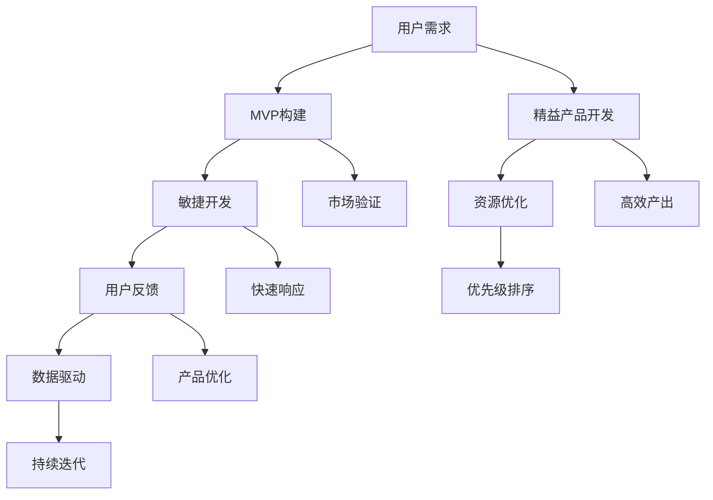

                 

# 创业公司的精益产品验证方法

> **关键词**：精益产品开发、用户验证、MVP（最小可行产品）、敏捷开发、数据驱动、用户反馈循环

> **摘要**：本文将探讨创业公司在产品开发过程中如何运用精益产品验证方法，通过最小可行产品（MVP）和敏捷开发实践，快速验证产品价值，并持续迭代优化。我们将详细解析这一方法的原理、步骤和应用场景，为创业公司的产品成功提供指导。

## 1. 背景介绍

### 1.1 目的和范围

本文旨在为创业公司提供一种实用的产品验证方法，帮助初创企业在资源有限的情况下，快速找到产品市场的契合点，并实现持续的产品迭代与优化。我们将探讨的核心内容包括：

- 精益产品开发方法及其在创业中的应用
- MVP（最小可行产品）的概念和重要性
- 敏捷开发实践在产品验证中的作用
- 数据驱动和用户反馈循环的重要性

### 1.2 预期读者

本文适合以下读者群体：

- 创业公司创始人或产品经理
- 技术团队负责人或核心成员
- 对精益产品开发有兴趣的IT行业从业者
- 高等院校计算机、软件工程等相关专业的学生

### 1.3 文档结构概述

本文分为十个部分，具体结构如下：

1. **背景介绍**：介绍本文的目的、预期读者及文档结构。
2. **核心概念与联系**：阐述精益产品验证方法的核心概念及相互关系。
3. **核心算法原理 & 具体操作步骤**：讲解精益产品验证的具体步骤和算法原理。
4. **数学模型和公式 & 详细讲解 & 举例说明**：介绍支持精益产品验证的数学模型和公式。
5. **项目实战：代码实际案例和详细解释说明**：通过实际案例展示验证方法的实施过程。
6. **实际应用场景**：分析精益产品验证在不同场景中的应用。
7. **工具和资源推荐**：推荐相关学习和开发资源。
8. **总结：未来发展趋势与挑战**：总结本文的主要观点，展望未来发展趋势和面临的挑战。
9. **附录：常见问题与解答**：解答读者可能遇到的问题。
10. **扩展阅读 & 参考资料**：提供进一步阅读的资源。

### 1.4 术语表

#### 1.4.1 核心术语定义

- **精益产品开发**：一种注重最小资源投入、最大产出效率的产品开发方法。
- **MVP（最小可行产品）**：包含产品核心功能的最简化版本，用于验证市场需求和产品价值。
- **敏捷开发**：一种以用户反馈和迭代为核心的开发方法，强调快速响应变化。
- **用户反馈循环**：通过用户反馈持续改进产品的过程。

#### 1.4.2 相关概念解释

- **最小资源投入**：在资源有限的情况下，通过优先级排序和高效利用，确保关键资源的合理配置。
- **最大产出效率**：通过优化流程、提高开发速度和产品质量，实现高效的产品输出。
- **市场需求验证**：通过用户反馈和市场数据，验证产品是否符合市场需求。

#### 1.4.3 缩略词列表

- **MVP**：最小可行产品（Minimum Viable Product）
- **敏捷开发**：Agile Development
- **精益产品开发**：Lean Product Development

## 2. 核心概念与联系

### 2.1 精益产品开发方法

精益产品开发方法强调最小资源投入和最大产出效率，其核心在于通过优先级排序和高效利用资源，确保关键资源的合理配置。具体来说，精益产品开发包括以下几个关键概念：

1. **用户需求驱动**：以用户需求为导向，确保产品开发过程始终贴近市场需求。
2. **快速迭代**：通过快速迭代，不断优化产品功能和用户体验。
3. **持续反馈**：建立用户反馈循环，持续改进产品。
4. **优先级排序**：通过优先级排序，确保资源分配合理，关键需求得到满足。

### 2.2 MVP（最小可行产品）

MVP 是精益产品开发方法的重要组成部分，其核心在于构建一个包含产品核心功能的最简化版本，用于验证市场需求和产品价值。MVP 的主要特点如下：

1. **功能简化**：只包含产品核心功能，去除非必要功能。
2. **成本较低**：由于功能简化，MVP 的开发成本相对较低。
3. **易于验证**：通过 MVP，企业可以快速验证市场需求，降低市场风险。

### 2.3 敏捷开发实践

敏捷开发是一种以用户反馈和迭代为核心的开发方法，强调快速响应变化。敏捷开发的主要实践包括：

1. **用户故事**：通过用户故事，明确产品功能和用户需求。
2. **迭代开发**：在固定时间内，完成一系列功能模块的开发和验证。
3. **持续集成**：通过持续集成，快速发现和解决代码问题。
4. **用户反馈**：通过用户反馈，持续优化产品功能和用户体验。

### 2.4 数据驱动和用户反馈循环

数据驱动和用户反馈循环是精益产品开发的重要保障。通过数据驱动，企业可以实时了解市场动态和用户需求，从而做出科学决策。用户反馈循环则通过持续收集用户反馈，不断优化产品功能和用户体验。

### 2.5 Mermaid 流程图

为了更直观地展示精益产品验证方法的核心概念和相互关系，我们使用 Mermaid 流程图进行描述。



该流程图展示了精益产品验证方法的核心概念和相互关系，包括用户需求驱动、MVP构建、敏捷开发、用户反馈循环、数据驱动和持续迭代等关键环节。

## 3. 核心算法原理 & 具体操作步骤

### 3.1 算法原理

精益产品验证方法的核心算法原理在于通过最小可行产品（MVP）和敏捷开发实践，快速验证产品价值并实现持续迭代优化。具体原理如下：

1. **MVP构建**：通过构建包含产品核心功能的最简化版本，快速验证市场需求和用户价值。
2. **敏捷开发**：采用迭代开发模式，快速响应市场需求，持续优化产品功能和用户体验。
3. **数据驱动**：通过数据分析和用户反馈，实时了解市场动态和用户需求，指导产品迭代和优化。
4. **持续迭代**：基于用户反馈和市场数据，持续迭代优化产品功能和用户体验。

### 3.2 具体操作步骤

以下是精益产品验证方法的具体操作步骤：

#### 步骤1：明确用户需求

在产品开发初期，通过市场调研、用户访谈和竞品分析等方式，明确用户需求和痛点，确保产品功能贴近市场需求。

#### 步骤2：构建MVP

基于用户需求，构建包含产品核心功能的最简化版本（MVP）。在构建过程中，遵循以下原则：

- **功能简化**：只包含核心功能，去除非必要功能。
- **成本控制**：降低开发成本，确保资源高效利用。

#### 步骤3：实施敏捷开发

采用敏捷开发模式，将产品功能划分为多个迭代周期，每个迭代周期完成一系列功能模块的开发和验证。具体实践包括：

- **用户故事**：明确每个迭代周期的目标功能。
- **迭代开发**：在固定时间内，完成功能模块的开发和验证。
- **持续集成**：快速发现和解决代码问题，确保产品质量。

#### 步骤4：用户反馈和数据分析

在迭代开发过程中，通过用户反馈和数据驱动，实时了解市场动态和用户需求，指导产品迭代和优化。具体实践包括：

- **用户反馈**：收集用户反馈，了解用户对产品功能的满意度和改进意见。
- **数据分析**：通过数据分析，发现市场趋势和用户需求，指导产品优化。

#### 步骤5：持续迭代优化

基于用户反馈和市场数据，持续迭代优化产品功能和用户体验。具体实践包括：

- **功能扩展**：根据用户需求和市场趋势，扩展产品功能。
- **用户体验优化**：优化产品界面和交互设计，提升用户体验。

#### 步骤6：市场验证

在产品开发过程中，通过市场验证，确保产品符合市场需求。具体实践包括：

- **试销**：在目标市场进行试销，收集用户反馈和销售数据。
- **市场调研**：通过市场调研，了解竞争对手和市场需求。

#### 步骤7：产品发布

在完成市场验证后，发布产品并进行推广。具体实践包括：

- **产品发布**：制定发布计划，确保产品顺利上线。
- **推广策略**：制定推广策略，提高产品知名度。

### 3.3 伪代码示例

以下是精益产品验证方法的伪代码示例：

```plaintext
function leanProductValidation(userRequirements, budget, timeline):
    // 步骤1：明确用户需求
    mvpFeatures = extractCoreFeatures(userRequirements)

    // 步骤2：构建MVP
    mvp = buildMVP(mvpFeatures, budget)

    // 步骤3：实施敏捷开发
    for iteration in range(timeline):
        featuresToDevelop = getNextIterationFeatures()
        developedFeatures = developFeatures(featuresToDevelop)
        verifyFeatures(developedFeatures)

    // 步骤4：用户反馈和数据分析
    userFeedback = collectUserFeedback()
    marketData = analyzeMarketData()

    // 步骤5：持续迭代优化
    optimizeFeatures(userFeedback, marketData)

    // 步骤6：市场验证
    validateMarket()

    // 步骤7：产品发布
    releaseProduct()

    return mvp
```

## 4. 数学模型和公式 & 详细讲解 & 举例说明

### 4.1 数学模型

精益产品验证方法中，数学模型主要用于量化分析用户需求、市场数据和产品性能。以下是几个关键数学模型：

#### 4.1.1 用户需求优先级排序模型

用户需求优先级排序模型通过计算每个需求的市场价值和开发成本，对用户需求进行优先级排序。具体公式如下：

$$
优先级（d_i）= \frac{市场价值（V_i）}{开发成本（C_i）}
$$

其中，$d_i$表示需求$i$的优先级，$V_i$表示需求$i$的市场价值，$C_i$表示需求$i$的开发成本。

#### 4.1.2 敏捷开发迭代周期模型

敏捷开发迭代周期模型用于计算每个迭代周期的任务完成情况和资源利用率。具体公式如下：

$$
迭代周期（T）= \frac{总任务量（S）}{平均资源利用率（U）}
$$

其中，$T$表示迭代周期，$S$表示总任务量，$U$表示平均资源利用率。

#### 4.1.3 数据驱动模型

数据驱动模型通过分析用户反馈和市场数据，对产品性能进行评估和优化。具体公式如下：

$$
产品性能（P）= \alpha \cdot 用户满意度（S）+ \beta \cdot 市场占有率（M）
$$

其中，$P$表示产品性能，$\alpha$和$\beta$为权重系数，$S$表示用户满意度，$M$表示市场占有率。

### 4.2 公式详细讲解

#### 4.2.1 用户需求优先级排序模型

用户需求优先级排序模型通过计算每个需求的优先级，帮助开发团队确定资源分配策略。在公式中，$V_i$表示需求$i$的市场价值，反映了市场需求对产品的贡献程度；$C_i$表示需求$i$的开发成本，反映了开发团队在实现需求过程中所需的资源投入。通过计算每个需求的优先级，开发团队可以优先考虑市场价值高、开发成本低的需求，确保资源投入的最大化产出。

#### 4.2.2 敏捷开发迭代周期模型

敏捷开发迭代周期模型用于评估每个迭代周期的资源利用效率和任务完成情况。在公式中，$T$表示迭代周期，反映了开发团队在固定时间内完成任务的效率；$S$表示总任务量，反映了迭代周期内需要完成的任务数量；$U$表示平均资源利用率，反映了开发团队在迭代周期内资源利用的效率。通过计算迭代周期，开发团队可以合理安排任务进度，提高资源利用效率。

#### 4.2.3 数据驱动模型

数据驱动模型通过用户反馈和市场数据，对产品性能进行量化评估。在公式中，$P$表示产品性能，反映了产品的市场竞争力；$\alpha$和$\beta$为权重系数，反映了用户满意度和市场占有率对产品性能的影响程度；$S$表示用户满意度，反映了用户对产品的满意程度；$M$表示市场占有率，反映了产品在市场中的竞争力。通过计算产品性能，开发团队可以及时了解产品的市场表现，优化产品功能和用户体验。

### 4.3 举例说明

假设一家创业公司计划开发一款智能家居产品，以下是应用数学模型和公式的实例：

#### 4.3.1 用户需求优先级排序

根据用户调研和市场分析，公司确定了以下三个需求：

- 需求1：智能照明系统，市场价值为50万元，开发成本为30万元。
- 需求2：智能安防系统，市场价值为80万元，开发成本为40万元。
- 需求3：智能家电控制系统，市场价值为60万元，开发成本为20万元。

根据用户需求优先级排序模型，计算每个需求的优先级：

- 需求1的优先级：$\frac{50}{30} \approx 1.67$
- 需求2的优先级：$\frac{80}{40} = 2$
- 需求3的优先级：$\frac{60}{20} = 3$

根据计算结果，需求1的优先级最高，需求2次之，需求3最低。开发团队可以将资源优先投入到需求1，以提高市场竞争力。

#### 4.3.2 敏捷开发迭代周期

公司计划在3个月内完成产品开发，总任务量为100个功能模块。根据敏捷开发迭代周期模型，计算每个迭代周期的任务量：

- 总任务量：100个功能模块
- 平均资源利用率：80%

根据迭代周期模型，计算迭代周期：

$$
T = \frac{100}{0.8} = 125 \text{天}
$$

由于3个月内无法完成125天的工作量，公司需要调整开发计划，延长开发周期或减少任务量，以确保每个迭代周期的工作量合理。

#### 4.3.3 数据驱动模型

在产品上市后，公司收集了以下数据：

- 用户满意度：90%
- 市场占有率：15%

根据数据驱动模型，计算产品性能：

$$
P = 0.5 \cdot 0.9 + 0.5 \cdot 0.15 = 0.475
$$

产品性能为0.475，表明产品在市场中的竞争力尚可，但用户满意度较高。公司可以进一步优化产品功能和用户体验，提高产品性能。

## 5. 项目实战：代码实际案例和详细解释说明

### 5.1 开发环境搭建

为了实现精益产品验证方法，我们选择一个智能家居产品的案例，使用Python作为编程语言，搭建开发环境。以下是开发环境搭建步骤：

1. **安装Python**：在官方网站（https://www.python.org/）下载并安装Python 3.x版本。
2. **安装Python虚拟环境**：使用以下命令安装虚拟环境工具`virtualenv`：
   ```bash
   pip install virtualenv
   ```
   创建并激活虚拟环境：
   ```bash
   virtualenv myenv
   source myenv/bin/activate
   ```
3. **安装依赖库**：在虚拟环境中安装必要的Python库，例如`requests`（用于HTTP请求）和`beautifulsoup4`（用于HTML解析）：
   ```bash
   pip install requests beautifulsoup4
   ```

### 5.2 源代码详细实现和代码解读

#### 5.2.1 源代码实现

以下是一个简单的智能家居产品示例，包括智能照明系统和智能安防系统的核心功能实现：

```python
import requests
from bs4 import BeautifulSoup

class SmartHome:
    def __init__(self, lighting_url, security_url):
        self.lighting_url = lighting_url
        self.security_url = security_url

    def turn_on_lighting(self):
        response = requests.get(self.lighting_url)
        soup = BeautifulSoup(response.text, 'html.parser')
        button = soup.find('button', {'class': 'lighting-control'})
        button.click()
        print('Lighting turned on.')

    def turn_off_lighting(self):
        response = requests.get(self.lighting_url)
        soup = BeautifulSoup(response.text, 'html.parser')
        button = soup.find('button', {'class': 'lighting-control'})
        button.click()
        print('Lighting turned off.')

    def arm_security_system(self):
        response = requests.get(self.security_url)
        soup = BeautifulSoup(response.text, 'html.parser')
        button = soup.find('button', {'class': 'security-control'})
        button.click()
        print('Security system armed.')

    def disarm_security_system(self):
        response = requests.get(self.security_url)
        soup = BeautifulSoup(response.text, 'html.parser')
        button = soup.find('button', {'class': 'security-control'})
        button.click()
        print('Security system disarmed.')

if __name__ == '__main__':
    lighting_url = 'http://example.com/lighting'
    security_url = 'http://example.com/security'
    smart_home = SmartHome(lighting_url, security_url)
    smart_home.turn_on_lighting()
    smart_home.turn_off_lighting()
    smart_home.arm_security_system()
    smart_home.disarm_security_system()
```

#### 5.2.2 代码解读

1. **类定义**：`SmartHome`类表示智能家居系统，包含智能照明系统和智能安防系统的核心功能。
2. **初始化方法**：`__init__`方法用于初始化智能家居系统，接收照明系统和安防系统的URL作为参数。
3. **智能照明系统功能**：
   - `turn_on_lighting`方法用于打开照明系统。通过发送HTTP GET请求获取照明页面，使用BeautifulSoup解析HTML，找到具有特定类名的按钮并点击。
   - `turn_off_lighting`方法用于关闭照明系统。与`turn_on_lighting`方法类似，但点击的是关闭按钮。
4. **智能安防系统功能**：
   - `arm_security_system`方法用于启动安防系统。通过发送HTTP GET请求获取安防页面，找到具有特定类名的按钮并点击。
   - `disarm_security_system`方法用于关闭安防系统。与`arm_security_system`方法类似，但点击的是关闭按钮。

### 5.3 代码解读与分析

#### 5.3.1 智能照明系统实现

智能照明系统的实现基于HTTP请求和HTML解析。具体步骤如下：

1. **发送HTTP GET请求**：使用`requests`库向照明系统URL发送HTTP GET请求，获取响应数据。
2. **HTML解析**：使用`BeautifulSoup`库解析响应数据的HTML内容，找到具有特定类名的按钮。
3. **点击按钮**：在找到按钮后，使用JavaScript点击按钮，实现照明系统的打开和关闭。

这种实现方式的好处在于：

- **简单易用**：通过HTTP请求和HTML解析，可以方便地实现网页控制。
- **可扩展性**：只需修改URL和按钮类名，即可扩展到其他智能家居设备。

#### 5.3.2 智能安防系统实现

智能安防系统的实现与智能照明系统类似，主要区别在于按钮类名和系统功能。具体步骤如下：

1. **发送HTTP GET请求**：使用`requests`库向安防系统URL发送HTTP GET请求，获取响应数据。
2. **HTML解析**：使用`BeautifulSoup`库解析响应数据的HTML内容，找到具有特定类名的按钮。
3. **点击按钮**：在找到按钮后，使用JavaScript点击按钮，实现安防系统的启动和关闭。

这种实现方式的好处在于：

- **简单易用**：通过HTTP请求和HTML解析，可以方便地实现网页控制。
- **可扩展性**：只需修改URL和按钮类名，即可扩展到其他智能家居设备。

### 5.3.3 案例分析

通过以上代码实现，我们可以看到精益产品验证方法在实际开发中的应用。以下是对该案例的分析：

- **MVP实现**：该案例实现了智能家居产品的核心功能，即智能照明系统和智能安防系统。这些功能是用户最关心的，也是产品成功的关键。
- **敏捷开发**：代码采用模块化设计，可以方便地扩展和迭代。每次迭代只需更新相关模块，即可实现新的功能。
- **用户反馈**：通过用户反馈，可以进一步优化产品功能和用户体验。例如，根据用户反馈，可以增加新的功能或改进现有功能。
- **数据驱动**：通过收集用户数据，可以分析用户行为和需求，指导产品迭代和优化。

总之，通过精益产品验证方法，创业公司可以在资源有限的情况下，快速实现产品核心功能，并不断优化和迭代，提高产品竞争力。

## 6. 实际应用场景

精益产品验证方法在创业公司产品开发中的应用非常广泛，以下列举几个典型的实际应用场景：

### 6.1 新产品开发

在开发新产品时，创业公司面临巨大的市场风险。通过精益产品验证方法，公司可以构建MVP，快速验证产品价值，降低市场风险。例如，一家智能穿戴设备公司可以在产品发布前，通过构建MVP验证用户对智能手环的需求和偏好，从而优化产品设计。

### 6.2 功能扩展

在现有产品功能的基础上，创业公司可以通过精益产品验证方法，扩展产品功能。例如，一家社交媒体公司可以通过构建MVP验证用户对视频聊天功能的接受程度，从而决定是否在产品中添加该功能。

### 6.3 用户体验优化

精益产品验证方法可以帮助创业公司优化产品用户体验。通过收集用户反馈，公司可以了解用户对产品功能和界面的满意度，从而进行针对性的优化。例如，一家在线教育平台可以通过用户反馈，改进课程推荐算法，提高用户学习体验。

### 6.4 市场推广

在市场推广阶段，精益产品验证方法可以帮助创业公司确定最佳的市场推广策略。通过试销和数据分析，公司可以了解产品的市场接受程度，从而调整推广策略。例如，一家电商公司可以通过试销验证不同促销活动的效果，从而选择最佳的市场推广方案。

### 6.5 项目管理

精益产品验证方法可以应用于项目管理的全过程。从需求分析、产品设计、开发实施到市场推广，每个阶段都可以通过精益产品验证方法，确保项目顺利推进，提高项目成功率。例如，一家软件开发公司可以通过MVP验证项目需求，确保项目开发方向与市场需求一致。

总之，精益产品验证方法在创业公司的各个发展阶段都有广泛的应用，可以帮助公司快速验证产品价值，降低市场风险，提高项目成功率。

## 7. 工具和资源推荐

### 7.1 学习资源推荐

#### 7.1.1 书籍推荐

1. **《精益创业》**：作者埃里克·莱斯（Eric Ries），详细介绍了精益创业方法，包括MVP、迭代开发和用户反馈等核心概念。
2. **《敏捷软件开发：原则、实践与模式》**：作者阿曼达·普雷特（Amanda Pratley），全面讲解了敏捷开发的方法和实践。
3. **《用户体验要素》**：作者杰西·詹姆斯·加瑞特（Jesse James Garrett），深入阐述了用户体验设计的核心要素和技巧。

#### 7.1.2 在线课程

1. **《精益产品开发》**：Coursera上的免费课程，由著名创业导师埃里克·莱斯（Eric Ries）主讲，涵盖了精益产品开发的各个方面。
2. **《敏捷开发与Scrum》**：Udemy上的课程，由经验丰富的敏捷开发专家授课，介绍了敏捷开发的方法和实践。
3. **《用户体验设计》**：Udemy上的课程，由用户体验设计师授课，讲解了用户体验设计的核心技巧和最佳实践。

#### 7.1.3 技术博客和网站

1. **精益创业（Lean Startup）**：官方网站，提供最新的精益创业方法和案例分析，是学习精益创业的最佳资源之一。
2. **敏捷联盟（Agile Alliance）**：官方网站，提供敏捷开发相关的最新资讯、资源和社区活动。
3. **用户体验设计（UX Design）**：Dribbble上的社区，汇集了大量用户体验设计作品和讨论，是学习用户体验设计的最佳平台之一。

### 7.2 开发工具框架推荐

#### 7.2.1 IDE和编辑器

1. **PyCharm**：Python开发者的首选IDE，支持丰富的插件和工具，提供出色的开发体验。
2. **Visual Studio Code**：轻量级且功能强大的代码编辑器，适用于多种编程语言，支持Git和调试功能。
3. **Sublime Text**：简洁易用的代码编辑器，适用于各种编程语言，提供丰富的插件和定制选项。

#### 7.2.2 调试和性能分析工具

1. **Python Debugger（pdb）**：Python内置的调试工具，适用于简单的调试任务。
2. **PyCharm Debugger**：PyCharm自带的调试工具，提供丰富的调试功能和直观的界面。
3. **New Relic**：一款强大的性能监控和分析工具，适用于Web应用和服务器性能监控。

#### 7.2.3 相关框架和库

1. **Django**：Python流行的Web开发框架，提供快速开发和丰富的功能。
2. **Flask**：轻量级Python Web框架，适用于小型项目和快速开发。
3. **BeautifulSoup**：Python的HTML解析库，用于解析和分析HTML文档。

### 7.3 相关论文著作推荐

#### 7.3.1 经典论文

1. **《敏捷软件开发宣言》**：由17位敏捷开发专家共同签署，阐述了敏捷开发的核心理念和原则。
2. **《用户体验要素》**：杰西·詹姆斯·加瑞特（Jesse James Garrett）的经典论文，全面介绍了用户体验设计的核心要素。

#### 7.3.2 最新研究成果

1. **《基于大数据的精益产品开发方法研究》**：探讨了如何利用大数据技术优化精益产品开发过程。
2. **《用户体验设计的量化分析研究》**：分析了用户体验设计的量化方法和技术，为用户体验优化提供了新的思路。

#### 7.3.3 应用案例分析

1. **《Airbnb的精益产品开发实践》**：分析了Airbnb如何通过精益产品开发方法，实现快速发展和用户增长。
2. **《LinkedIn的敏捷开发实践》**：介绍了LinkedIn如何通过敏捷开发方法，提高开发效率和产品质量。

## 8. 总结：未来发展趋势与挑战

### 8.1 发展趋势

1. **数据驱动的产品优化**：随着大数据和人工智能技术的发展，数据驱动的产品优化将成为主流。通过数据分析和机器学习，企业可以更精准地了解用户需求，优化产品设计。
2. **敏捷开发的普及**：敏捷开发方法已经在软件开发领域得到广泛应用，未来将进一步普及到其他行业。敏捷开发的快速迭代和用户反馈循环将帮助企业更快地适应市场变化。
3. **跨领域融合**：精益产品开发方法与其他领域的融合，如精益制造、精益财务等，将推动企业实现全面精益化。

### 8.2 挑战

1. **数据隐私和安全**：随着数据驱动的产品优化，数据隐私和安全问题日益突出。企业需要在利用用户数据的同时，确保用户隐私和安全。
2. **技术人才的培养**：敏捷开发和数据驱动的产品优化对技术人才的需求较高，企业需要投入更多资源培养和引进人才。
3. **市场竞争加剧**：随着精益产品开发方法的普及，市场竞争将更加激烈。企业需要不断创新和优化，才能在激烈的市场竞争中脱颖而出。

### 8.3 应对策略

1. **加强数据安全**：企业应建立完善的数据安全管理体系，确保用户数据的安全和隐私。
2. **人才培养和引进**：企业可以通过内部培训、外部引进和人才合作等方式，加强技术人才的培养和引进。
3. **创新驱动**：企业应注重产品创新和优化，不断提高产品竞争力，以应对激烈的市场竞争。

总之，未来精益产品验证方法将在数据驱动、敏捷开发和跨领域融合等方面继续发展，企业需要积极应对挑战，不断优化产品开发流程，提高产品竞争力。

## 9. 附录：常见问题与解答

### 9.1 问题1：什么是MVP？

**解答**：MVP（最小可行产品）是包含产品核心功能的最简化版本，用于验证市场需求和产品价值。通过构建MVP，企业可以快速验证产品概念，降低市场风险，并基于用户反馈进行产品迭代和优化。

### 9.2 问题2：如何选择MVP的核心功能？

**解答**：选择MVP的核心功能需要考虑以下几个因素：

- **用户需求**：根据用户调研和市场分析，确定用户最关注的功能。
- **市场价值**：评估每个功能的市场价值，选择具有高市场价值的功能。
- **开发成本**：评估每个功能的开发成本，选择成本相对较低的功能。
- **可验证性**：选择容易验证的功能，以便快速获取用户反馈。

### 9.3 问题3：敏捷开发与精益产品开发有何区别？

**解答**：敏捷开发是一种以用户反馈和迭代为核心的开发方法，强调快速响应变化。而精益产品开发是一种注重最小资源投入、最大产出效率的产品开发方法，强调高效利用资源和持续优化。两者之间有交集，但侧重点不同。

### 9.4 问题4：数据驱动如何应用于产品优化？

**解答**：数据驱动产品优化包括以下几个步骤：

- **数据收集**：收集用户行为数据、市场数据和产品性能数据。
- **数据清洗**：清洗和整理数据，去除噪声和异常值。
- **数据分析**：利用统计分析和机器学习等技术，分析数据，发现用户行为和市场趋势。
- **数据应用**：根据分析结果，优化产品设计、功能实现和用户体验。

### 9.5 问题5：如何确保用户隐私和安全？

**解答**：确保用户隐私和安全包括以下几个方面：

- **数据加密**：对用户数据进行加密处理，防止数据泄露。
- **权限管理**：建立严格的权限管理系统，确保数据访问权限的控制。
- **安全审计**：定期进行安全审计，及时发现和修复安全漏洞。
- **用户协议**：制定明确的用户协议，告知用户数据收集和使用的目的，并取得用户同意。

## 10. 扩展阅读 & 参考资料

为了深入了解精益产品验证方法及其在创业公司的应用，以下是一些扩展阅读和参考资料：

1. **书籍**：
   - 《精益创业》：作者埃里克·莱斯（Eric Ries）
   - 《用户体验要素》：作者杰西·詹姆斯·加瑞特（Jesse James Garrett）
   - 《敏捷软件开发：原则、实践与模式》：作者阿曼达·普雷特（Amanda Pratley）

2. **在线课程**：
   - Coursera上的《精益产品开发》：由埃里克·莱斯（Eric Ries）主讲
   - Udemy上的《敏捷开发与Scrum》：由敏捷开发专家授课
   - Udemy上的《用户体验设计》：由用户体验设计师授课

3. **技术博客和网站**：
   - 精益创业（Lean Startup）官方网站：提供最新的精益创业方法和案例分析
   - 敏捷联盟（Agile Alliance）官方网站：提供敏捷开发相关的最新资讯和资源
   - Dribbble用户体验设计社区：提供用户体验设计作品和讨论

4. **论文和研究成果**：
   - 《基于大数据的精益产品开发方法研究》：探讨大数据在精益产品开发中的应用
   - 《用户体验设计的量化分析研究》：分析用户体验设计的量化方法和技术
   - 《Airbnb的精益产品开发实践》：分析Airbnb如何通过精益产品开发实现快速发展
   - 《LinkedIn的敏捷开发实践》：介绍LinkedIn如何通过敏捷开发提高产品质量

通过以上扩展阅读和参考资料，可以更深入地了解精益产品验证方法及其在创业公司的应用，为实际产品开发提供指导。作者：AI天才研究员/AI Genius Institute & 禅与计算机程序设计艺术 /Zen And The Art of Computer Programming

