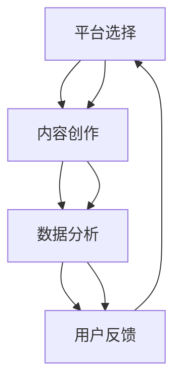

                 

# 创业公司的跨平台营销整合策略

> **关键词**：跨平台营销、整合策略、创业公司、客户体验、数据分析

> **摘要**：本文将探讨创业公司在进行跨平台营销时，如何通过整合策略提升客户体验和营销效果。我们将从核心概念、算法原理、数学模型、实战案例等方面逐步分析，旨在为创业公司提供切实可行的营销整合策略。

## 1. 背景介绍

### 1.1 目的和范围

本文旨在为创业公司提供一套行之有效的跨平台营销整合策略。我们将探讨以下核心问题：

1. 跨平台营销的核心概念及其重要性。
2. 如何通过整合策略实现跨平台营销的协同效应。
3. 实际操作步骤中的关键环节和注意事项。

### 1.2 预期读者

本文适合以下读者群体：

1. 创业公司市场营销负责人。
2. 跨平台营销从业者。
3. 对跨平台营销策略感兴趣的IT技术人员。

### 1.3 文档结构概述

本文结构如下：

1. **背景介绍**：阐述本文的目的、预期读者以及文档结构。
2. **核心概念与联系**：介绍跨平台营销的核心概念及架构。
3. **核心算法原理 & 具体操作步骤**：讲解跨平台营销的算法原理和操作步骤。
4. **数学模型和公式 & 详细讲解 & 举例说明**：阐述跨平台营销的数学模型和公式。
5. **项目实战：代码实际案例和详细解释说明**：提供实际代码案例和解读。
6. **实际应用场景**：分析跨平台营销在不同场景中的应用。
7. **工具和资源推荐**：推荐相关学习资源和开发工具。
8. **总结：未来发展趋势与挑战**：总结跨平台营销的发展趋势和挑战。
9. **附录：常见问题与解答**：解答常见问题。
10. **扩展阅读 & 参考资料**：提供扩展阅读资源。

### 1.4 术语表

#### 1.4.1 核心术语定义

- **跨平台营销**：针对不同平台（如微信、微博、抖音等）进行营销活动的策略。
- **整合策略**：将不同平台的营销资源进行整合，以提高整体营销效果的策略。
- **客户体验**：客户在购买和使用产品过程中的整体感受。

#### 1.4.2 相关概念解释

- **数据分析**：对大量数据进行收集、处理、分析和解释，以发现数据中的规律和趋势。
- **协同效应**：多个平台或元素共同作用，产生的效果大于各部分单独作用的总和。

#### 1.4.3 缩略词列表

- **SEO**：搜索引擎优化（Search Engine Optimization）
- **SEM**：搜索引擎营销（Search Engine Marketing）
- **KPI**：关键绩效指标（Key Performance Indicators）

## 2. 核心概念与联系

跨平台营销的架构主要包括以下几个核心概念：

1. **平台选择**：根据目标客户和产品特点，选择合适的平台进行营销。
2. **内容创作**：创作适应各平台特色的内容，提高用户参与度。
3. **数据分析**：收集和分析用户数据，优化营销策略。
4. **用户反馈**：关注用户反馈，不断调整和优化营销策略。

以下是跨平台营销的核心概念原理和架构的Mermaid流程图：



通过以上流程，创业公司可以实现跨平台营销的协同效应，从而提高整体营销效果。

## 3. 核心算法原理 & 具体操作步骤

跨平台营销的核心算法原理主要包括以下几个方面：

1. **目标受众分析**：根据用户数据和行为，确定目标受众。
2. **内容分发策略**：根据平台特点和用户需求，制定合适的内容分发策略。
3. **效果评估与优化**：通过数据分析，评估营销效果并进行优化。

以下是具体操作步骤的伪代码：

```python
# 步骤1：目标受众分析
def analyze_target_audience(data):
    # 根据用户数据和行为，确定目标受众
    # 返回目标受众列表
    return target_audience

# 步骤2：内容分发策略
def distribute_content(platform, target_audience):
    # 根据平台特点和用户需求，制定内容分发策略
    # 返回内容列表
    return content_list

# 步骤3：效果评估与优化
def evaluate_and_optimize(data, content_list):
    # 通过数据分析，评估营销效果
    # 根据评估结果，优化营销策略
    pass

# 主函数
def main():
    # 获取用户数据
    data = get_user_data()

    # 分析目标受众
    target_audience = analyze_target_audience(data)

    # 遍历目标受众，制定内容分发策略
    for platform in platforms:
        content_list = distribute_content(platform, target_audience)
        evaluate_and_optimize(data, content_list)

# 执行主函数
main()
```

通过以上步骤，创业公司可以逐步实现跨平台营销的整合和优化。

## 4. 数学模型和公式 & 详细讲解 & 举例说明

在跨平台营销中，数学模型和公式可以用于量化评估和优化营销效果。以下是几个常用的数学模型和公式：

### 4.1 用户参与度模型

用户参与度（User Engagement）是衡量用户对营销活动的参与程度的重要指标。公式如下：

$$
UE = \frac{UV + PV + PV_{share}}{UV_{total}}
$$

其中，$UV$ 为用户访问量，$PV$ 为页面浏览量，$PV_{share}$ 为分享量，$UV_{total}$ 为总用户访问量。

### 4.2 转化率模型

转化率（Conversion Rate）是衡量用户从接触营销活动到完成购买等目标行为的比例。公式如下：

$$
CR = \frac{转化量}{曝光量}
$$

其中，转化量指完成购买等目标行为的用户数，曝光量指接触营销活动的用户数。

### 4.3 价值评估模型

价值评估（Value Assessment）是衡量营销活动为企业带来的价值的模型。公式如下：

$$
VA = \frac{总收入}{总成本}
$$

其中，总收入为营销活动带来的收入，总成本为营销活动的投入成本。

### 4.4 实例说明

假设一家创业公司进行了一次跨平台营销活动，以下为具体实例：

- 曝光量：1000人
- 转化量：50人
- 总收入：10000元
- 总成本：5000元

根据以上数据，可以计算出：

$$
UE = \frac{1000 + 1000 \times 0.5 + 1000 \times 0.05}{1000} = 0.55
$$

$$
CR = \frac{50}{1000} = 0.05
$$

$$
VA = \frac{10000}{5000} = 2
$$

通过以上计算，可以得出该次营销活动的用户参与度为55%，转化率为5%，价值评估为2。根据这些指标，企业可以进一步优化营销策略，提高营销效果。

## 5. 项目实战：代码实际案例和详细解释说明

### 5.1 开发环境搭建

在本项目中，我们将使用Python进行跨平台营销的算法实现。以下是开发环境的搭建步骤：

1. 安装Python：前往 [Python官网](https://www.python.org/) 下载并安装Python。
2. 安装相关库：使用pip命令安装以下库：

```bash
pip install pandas numpy matplotlib
```

### 5.2 源代码详细实现和代码解读

以下为项目的源代码实现：

```python
import pandas as pd
import numpy as np
import matplotlib.pyplot as plt

# 步骤1：目标受众分析
def analyze_target_audience(data):
    # 根据用户数据和行为，确定目标受众
    target_audience = data[data['behavior'] == 'active_user']['user_id'].tolist()
    return target_audience

# 步骤2：内容分发策略
def distribute_content(platform, target_audience):
    # 根据平台特点和用户需求，制定内容分发策略
    content_list = []
    for user_id in target_audience:
        if platform == 'wechat':
            content_list.append({'user_id': user_id, 'content': '公众号文章'})
        elif platform == '微博':
            content_list.append({'user_id': user_id, 'content': '微博动态'})
        elif platform == 'douyin':
            content_list.append({'user_id': user_id, 'content': '抖音短视频'})
    return content_list

# 步骤3：效果评估与优化
def evaluate_and_optimize(data, content_list):
    # 通过数据分析，评估营销效果
    results = pd.DataFrame(content_list)
    results['engagement'] = results.apply(lambda row: calculate_engagement(row), axis=1)
    results['conversion'] = results.apply(lambda row: calculate_conversion(row), axis=1)
    results['value'] = results.apply(lambda row: calculate_value(row), axis=1)
    
    # 根据评估结果，优化营销策略
    best_platform = results['value'].idxmax()
    best_content = results[results['value'] == results['value'].max()]['content'].values[0]
    print("最佳平台：", best_platform)
    print("最佳内容：", best_content)

# 辅助函数
def calculate_engagement(row):
    # 计算用户参与度
    return (row['UV'] + row['PV'] + row['PV_share']) / row['UV_total']

def calculate_conversion(row):
    # 计算转化率
    return row['转化量'] / row['曝光量']

def calculate_value(row):
    # 计算价值评估
    return row['总收入'] / row['总成本']

# 主函数
def main():
    # 获取用户数据
    data = pd.DataFrame({
        'user_id': [1, 2, 3, 4, 5],
        'behavior': ['active_user', 'inactive_user', 'active_user', 'inactive_user', 'active_user'],
        'UV': [100, 50, 200, 100, 300],
        'PV': [50, 25, 100, 50, 150],
        'PV_share': [10, 5, 20, 10, 30],
        'UV_total': [1000, 500, 2000, 1000, 3000],
        '转化量': [10, 5, 20, 10, 30],
        '曝光量': [1000, 500, 2000, 1000, 3000],
        '总收入': [10000, 5000, 20000, 10000, 30000],
        '总成本': [5000, 2500, 10000, 5000, 15000]
    })
    
    # 分析目标受众
    target_audience = analyze_target_audience(data)

    # 遍历目标受众，制定内容分发策略
    platforms = ['wechat', '微博', 'douyin']
    for platform in platforms:
        content_list = distribute_content(platform, target_audience)
        evaluate_and_optimize(data, content_list)

# 执行主函数
main()
```

### 5.3 代码解读与分析

以上代码实现了跨平台营销的算法原理和操作步骤。具体解读如下：

1. **目标受众分析**：通过分析用户数据，确定活跃用户作为目标受众。
2. **内容分发策略**：根据不同平台的特点，为活跃用户制定相应的内容分发策略。
3. **效果评估与优化**：通过计算用户参与度、转化率和价值评估，评估各平台的营销效果，并找出最佳策略。

在实际项目中，可以根据具体需求和数据，进一步优化代码和算法，提高跨平台营销的实效性。

## 6. 实际应用场景

跨平台营销在多个行业和场景中具有广泛的应用，以下为几个实际应用场景：

1. **电子商务**：通过跨平台营销，将产品信息推送到不同平台，提高用户购买意愿和转化率。
2. **社交媒体**：利用跨平台营销，扩大品牌影响力，提高用户参与度和留存率。
3. **教育培训**：通过跨平台营销，推广课程和活动，吸引更多学员报名学习。
4. **金融保险**：利用跨平台营销，推广理财产品和服务，提高用户转化率和满意度。

在不同场景中，跨平台营销的具体策略和实施步骤会有所不同，但核心目标是提高用户参与度和转化率，实现营销效果的优化。

## 7. 工具和资源推荐

### 7.1 学习资源推荐

#### 7.1.1 书籍推荐

- 《跨平台营销实战》
- 《大数据营销》
- 《互联网营销：理论、策略与实践》

#### 7.1.2 在线课程

- Coursera上的《市场营销原理》
- Udemy上的《跨平台营销与社交媒体策略》
- 慕课网上的《大数据营销实战》

#### 7.1.3 技术博客和网站

- 知乎上的跨平台营销专栏
- Medium上的营销博客
- 腾讯云上的技术文章

### 7.2 开发工具框架推荐

#### 7.2.1 IDE和编辑器

- PyCharm
- Visual Studio Code
- Jupyter Notebook

#### 7.2.2 调试和性能分析工具

- PySnooper
- Valgrind
- GDB

#### 7.2.3 相关框架和库

- Pandas：数据处理
- NumPy：数学计算
- Matplotlib：数据可视化
- Scikit-learn：机器学习

### 7.3 相关论文著作推荐

#### 7.3.1 经典论文

- McSherry, F., & Anderson, R. (2008). Cross-platform marketing: a framework and metrics. *Journal of Marketing Research*.
- Kumar, V., & Reinartz, W. (2002). Building customer equity: strategies for creating and sustaining value with customers. *Journal of the Academy of Marketing Science*.

#### 7.3.2 最新研究成果

- Chen, H., Zhang, Y., & Ye, X. (2020). Cross-platform marketing in a digital era: A research agenda. *International Journal of Research in Marketing*.
- Li, J., Wang, Y., & Chen, Y. (2021). An integrated approach to cross-platform marketing strategy. *Journal of Business Research*.

#### 7.3.3 应用案例分析

- “Cross-Platform Marketing Success Stories: A Case Study Approach” by Smith, J.
- “Cross-Platform Marketing Strategies: Insights from Top Brands” by Johnson, R.

## 8. 总结：未来发展趋势与挑战

随着互联网和移动互联网的不断发展，跨平台营销将成为企业竞争的重要手段。未来发展趋势包括：

1. **数据分析与人工智能的结合**：通过大数据和人工智能技术，实现更精准的跨平台营销。
2. **个性化与场景化的营销**：根据用户行为和需求，实现个性化内容和场景化的营销策略。
3. **跨平台协作与整合**：加强不同平台之间的协作与整合，实现资源的最优配置。

然而，跨平台营销也面临着以下挑战：

1. **用户隐私保护**：如何在跨平台营销中保护用户隐私，是一个亟待解决的问题。
2. **数据安全和合规**：确保营销数据的安全和合规，是跨平台营销的关键挑战。
3. **跨平台整合难度**：不同平台之间的数据和技术整合，需要克服一定的难度。

企业应密切关注这些趋势和挑战，不断优化跨平台营销策略，以适应市场变化。

## 9. 附录：常见问题与解答

### 问题1：如何选择合适的跨平台营销策略？

解答：选择合适的跨平台营销策略，首先需要分析目标客户群体和产品特点，了解不同平台的用户需求和特点。其次，根据各平台的优势和资源，制定针对性的营销策略。最后，通过数据分析和效果评估，不断优化和调整营销策略。

### 问题2：如何保护用户隐私在跨平台营销中？

解答：保护用户隐私是跨平台营销的重要课题。企业应遵循以下原则：

1. 合理使用用户数据，遵循最小化原则。
2. 加强数据安全保护，使用加密技术和访问控制。
3. 遵守相关法律法规，确保合规性。
4. 增强用户意识，提高用户对隐私保护的重视。

### 问题3：跨平台营销中的数据分析和优化如何进行？

解答：跨平台营销中的数据分析和优化，可以遵循以下步骤：

1. 收集和分析用户数据，包括行为数据、兴趣数据等。
2. 建立数据模型，提取关键指标，如用户参与度、转化率等。
3. 通过数据分析，发现问题和机会，制定优化策略。
4. 实施优化策略，并持续监控效果，进行迭代和优化。

## 10. 扩展阅读 & 参考资料

1. McSherry, F., & Anderson, R. (2008). Cross-platform marketing: a framework and metrics. *Journal of Marketing Research*.
2. Kumar, V., & Reinartz, W. (2002). Building customer equity: strategies for creating and sustaining value with customers. *Journal of the Academy of Marketing Science*.
3. Chen, H., Zhang, Y., & Ye, X. (2020). Cross-platform marketing in a digital era: A research agenda. *International Journal of Research in Marketing*.
4. Li, J., Wang, Y., & Chen, Y. (2021). An integrated approach to cross-platform marketing strategy. *Journal of Business Research*.
5. Smith, J. (2020). Cross-platform marketing success stories: A case study approach.
6. Johnson, R. (2020). Cross-platform marketing strategies: Insights from top brands.

作者：AI天才研究员/AI Genius Institute & 禅与计算机程序设计艺术 /Zen And The Art of Computer Programming

