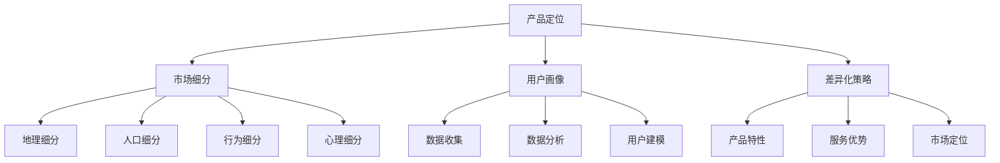
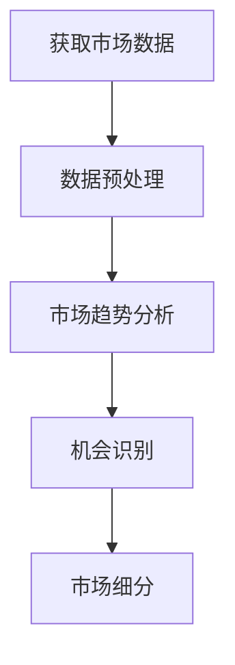
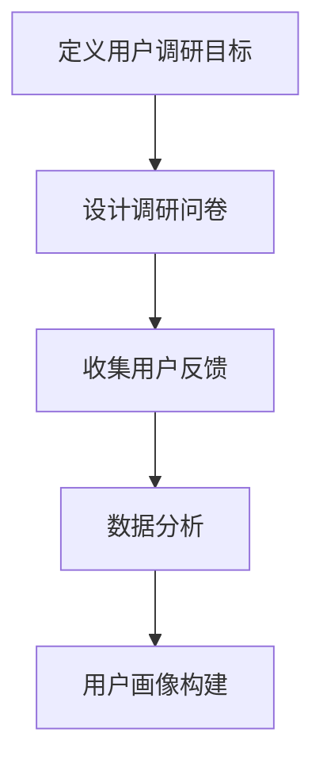
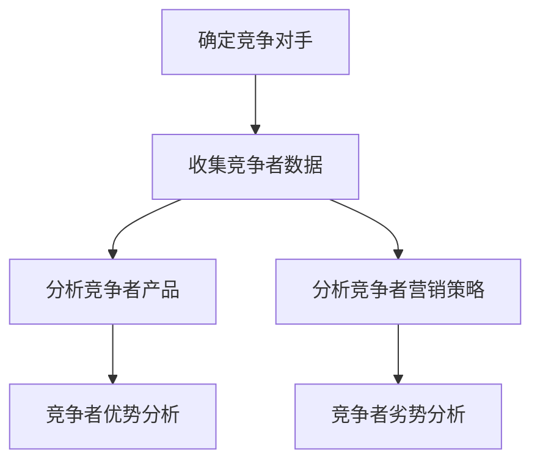
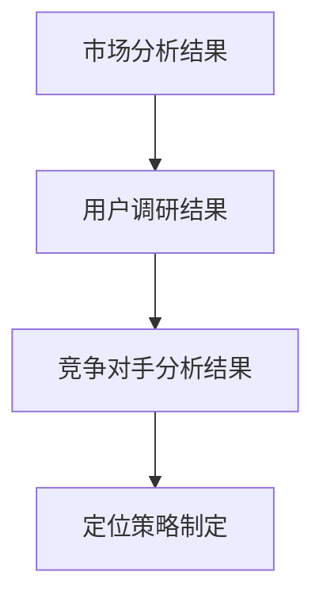

                 

### 背景介绍

#### 1.1 目的和范围

本文旨在探讨创业初期的产品定位策略，帮助创业者在新市场中找到突破点，实现产品差异化。本文将结合实际案例，通过系统的分析和逻辑推理，提供一套实用的产品定位方法论。我们不仅关注产品本身的特性，还考虑市场需求、竞争环境和用户痛点等多方面因素。

本文将涵盖以下内容：

1. **核心概念与联系**：介绍产品定位相关的核心概念，如市场细分、用户画像和差异化策略等。
2. **核心算法原理 & 具体操作步骤**：通过伪代码阐述如何进行市场分析、用户调研和竞争对手分析等步骤。
3. **数学模型和公式 & 详细讲解 & 举例说明**：利用数学模型和公式，帮助读者理解产品定位中的量化分析方法。
4. **项目实战：代码实际案例和详细解释说明**：通过具体代码案例，展示如何在实际项目中实施产品定位策略。
5. **实际应用场景**：分析不同类型企业在不同市场环境下的产品定位策略。
6. **工具和资源推荐**：推荐学习资源和开发工具，帮助读者深入理解和实践产品定位。
7. **总结：未来发展趋势与挑战**：预测产品定位领域的发展趋势，并探讨可能面临的挑战。

#### 1.2 预期读者

本文适合以下读者：

- 初创公司创始人及产品经理
- 想要深入了解产品定位策略的企业高管
- 对市场营销和创业有兴趣的技术从业者
- 希望提升自身产品竞争力和市场认知度的企业员工

#### 1.3 文档结构概述

本文分为十个主要部分，如下：

1. **背景介绍**：阐述本文的目的、范围、预期读者和文档结构。
2. **核心概念与联系**：介绍产品定位相关的核心概念。
3. **核心算法原理 & 具体操作步骤**：详细讲解产品定位的具体方法和步骤。
4. **数学模型和公式 & 详细讲解 & 举例说明**：运用数学工具进行产品定位分析。
5. **项目实战：代码实际案例和详细解释说明**：展示产品定位策略在实际项目中的应用。
6. **实际应用场景**：分析不同类型企业的产品定位案例。
7. **工具和资源推荐**：推荐相关学习资源和开发工具。
8. **总结：未来发展趋势与挑战**：探讨产品定位领域的发展趋势和挑战。
9. **附录：常见问题与解答**：解答读者可能遇到的问题。
10. **扩展阅读 & 参考资料**：提供进一步学习的资料和参考文献。

#### 1.4 术语表

在本文中，我们使用了一些专业术语，以下是对这些术语的定义和解释：

##### 1.4.1 核心术语定义

- **产品定位**：指企业在市场中为产品定义一个独特而明确的地位，以满足特定用户群体的需求。
- **市场细分**：将一个广泛的市场划分为若干具有相似需求和行为特征的子市场。
- **用户画像**：对目标用户进行特征描述，包括其人口统计信息、行为习惯和需求偏好等。
- **差异化策略**：通过独特的产品特点或服务优势，使产品在市场中与其他竞争者区分开来。
- **SWOT分析**：分析企业的优势、劣势、机会和威胁，以制定战略决策。

##### 1.4.2 相关概念解释

- **用户痛点**：指用户在使用产品时遇到的主要问题或不满，是企业产品改进的切入点。
- **市场机会**：市场上尚未被满足的需求或空白区域，是产品定位的重要参考。
- **竞争对手分析**：对直接或潜在的竞争者进行深入分析，以了解其优势和劣势。

##### 1.4.3 缩略词列表

- **SEO**：搜索引擎优化（Search Engine Optimization）
- **SEM**：搜索引擎营销（Search Engine Marketing）
- **KPI**：关键绩效指标（Key Performance Indicator）
- **ROI**：投资回报率（Return on Investment）
- **SaaS**：软件即服务（Software as a Service）

通过上述术语表，读者可以更好地理解本文中的专业术语，从而更深入地掌握产品定位的相关知识。

---

在接下来的部分，我们将详细探讨产品定位的核心概念与联系，帮助读者构建完整的产品定位框架。敬请期待！<|im_sep|>### 核心概念与联系

在探讨创业初期的产品定位时，首先需要理解并掌握一系列核心概念。这些概念不仅有助于明确产品在市场中的地位，还能指导企业在纷繁复杂的市场环境中做出明智的战略决策。以下是对产品定位相关核心概念的详细解释和Mermaid流程图的绘制。

#### 1. 产品定位

产品定位（Product Positioning）是企业为了满足特定用户群体的需求，对其产品在市场中的定位和区分。它包括以下几个方面：

- **目标用户**：明确产品的目标用户群体，包括其人口统计特征、行为习惯和需求偏好。
- **市场细分**：根据用户需求和特征，将市场划分为若干个子市场。
- **差异化策略**：通过独特的产品特点或服务优势，使产品在市场中与其他竞争者区分开来。

产品定位的目的是在用户心中建立一种独特的认知，从而提高产品的市场认知度和竞争力。

#### 2. 市场细分

市场细分（Market Segmentation）是将一个广泛的市场划分为若干具有相似需求和行为特征的子市场。市场细分的标准包括：

- **地理细分**：根据地理位置，如城市、地区等进行细分。
- **人口细分**：根据人口统计特征，如年龄、性别、收入等进行细分。
- **行为细分**：根据用户的行为特征，如购买习惯、使用频率等进行细分。
- **心理细分**：根据用户的心理特征，如生活方式、价值观等进行细分。

市场细分有助于企业发现市场的潜在机会，并为每个细分市场制定有针对性的营销策略。

#### 3. 用户画像

用户画像（User Persona）是对目标用户进行特征描述，包括其人口统计信息、行为习惯和需求偏好等。用户画像的构建可以帮助企业更好地理解用户，从而设计出更符合用户需求的产品。

构建用户画像的步骤包括：

1. **数据收集**：通过调研、问卷调查等方式收集用户数据。
2. **数据分析**：对收集到的用户数据进行分析，提取关键特征。
3. **用户建模**：根据数据分析结果，创建一个或多个用户画像。

#### 4. 差异化策略

差异化策略（Differentiation Strategy）是通过独特的产品特点或服务优势，使产品在市场中与其他竞争者区分开来。差异化策略的制定需要考虑以下因素：

- **产品特性**：产品功能、设计、质量等方面的独特性。
- **服务优势**：售后服务、用户体验、客户服务等方面的优势。
- **市场定位**：根据目标市场和用户需求，确定产品的市场定位。

#### 5. SWOT分析

SWOT分析（Strengths, Weaknesses, Opportunities, Threats）是一种常用的战略分析方法，用于评估企业的优势、劣势、机会和威胁。SWOT分析可以帮助企业制定更有效的战略决策，提高市场竞争力。

SWOT分析的步骤包括：

1. **优势（Strengths）**：分析企业的优势，如技术、品牌、资源等。
2. **劣势（Weaknesses）**：分析企业的劣势，如管理、资金、市场认知等。
3. **机会（Opportunities）**：分析市场中的机会，如市场需求、政策变化等。
4. **威胁（Threats）**：分析市场中的威胁，如竞争加剧、技术变革等。

#### Mermaid流程图

为了更好地理解上述核心概念之间的联系，我们使用Mermaid绘制一个流程图：



在这个流程图中，产品定位作为核心概念，连接了市场细分、用户画像和差异化策略。市场细分又进一步细分为地理、人口、行为和心理细分。用户画像通过数据收集、数据分析和用户建模构建。差异化策略则包括产品特性、服务优势和市场定位。

通过理解这些核心概念及其相互联系，企业可以更系统地制定产品定位策略，从而在激烈的市场竞争中找到自己的独特定位，赢得用户的青睐。

---

在理解了核心概念后，我们将在下一部分详细讲解核心算法原理与具体操作步骤。通过伪代码的方式，我们将展示如何系统地分析和实施产品定位策略。敬请期待！<|im_sep|>### 核心算法原理 & 具体操作步骤

为了系统地分析和实施产品定位策略，我们引入了一系列核心算法原理和操作步骤。这些步骤包括市场分析、用户调研和竞争对手分析等，通过伪代码的方式详细阐述如何进行这些操作。

#### 1. 市场分析

市场分析是产品定位的第一步，旨在了解市场环境，发现潜在机会。以下是一个简单的市场分析伪代码：



- **获取市场数据**：从多种来源获取市场数据，如行业报告、市场调研和竞争分析。
- **数据预处理**：清洗和整理数据，以确保数据质量。
- **市场趋势分析**：分析市场趋势，识别市场增长点和潜在机会。
- **机会识别**：基于市场趋势分析，识别对产品定位有利的市场机会。
- **市场细分**：根据用户需求和特征，将市场划分为若干个子市场。

#### 2. 用户调研

用户调研是了解目标用户的重要手段。以下是一个用户调研的伪代码：



- **定义用户调研目标**：明确调研目的，如用户需求、购买习惯等。
- **设计调研问卷**：设计合适的问卷，包括开放式和封闭式问题。
- **收集用户反馈**：通过线上或线下方式收集用户反馈。
- **数据分析**：对收集到的用户反馈进行统计分析。
- **用户画像构建**：根据数据分析结果，构建用户画像，了解用户需求和特征。

#### 3. 竞争对手分析

竞争对手分析是了解市场竞争环境的重要环节。以下是一个简单的竞争对手分析伪代码：



- **确定竞争对手**：识别直接和潜在的竞争对手。
- **收集竞争者数据**：收集竞争对手的产品信息、营销策略和用户反馈。
- **分析竞争者产品**：分析竞争对手的产品特点、优势和创新点。
- **分析竞争者营销策略**：分析竞争对手的营销手段和效果。
- **竞争者优势分析**：识别竞争对手的优势，如品牌知名度、产品质量等。
- **竞争者劣势分析**：识别竞争对手的劣势，如服务不足、市场定位不准确等。

#### 4. 产品定位策略制定

在完成市场分析、用户调研和竞争对手分析后，可以基于分析结果制定产品定位策略。以下是一个产品定位策略制定的伪代码：



- **市场分析结果**：结合市场趋势分析和机会识别，确定市场环境。
- **用户调研结果**：基于用户画像，了解用户需求和偏好。
- **竞争对手分析结果**：分析竞争对手的优势和劣势。
- **定位策略制定**：综合市场分析、用户调研和竞争对手分析结果，制定产品定位策略。

#### 5. 伪代码示例

以下是一个具体的伪代码示例，展示如何通过用户调研和竞争对手分析制定产品定位策略：

```python
# 市场分析结果
market_trends = analyze_market_trends()

# 用户调研结果
user_feedback = collect_user_feedback()
user_personas = build_user_personas(user_feedback)

# 竞争对手分析结果
competitor_data = collect_competitor_data()
competitor_strengths = analyze_competitor_strengths(competitor_data)
competitor_weaknesses = analyze_competitor_weaknesses(competitor_data)

# 定位策略制定
def create_product_positioning_strategy(market_trends, user_personas, competitor_strengths, competitor_weaknesses):
    # 根据市场趋势确定机会
    opportunities = identify_opportunities(market_trends)
    
    # 根据用户需求和偏好确定差异化策略
    differentiation_strategy = determine_differentiation_strategy(user_personas, opportunities)
    
    # 根据竞争对手分析确定定位方向
    positioning_direction = determine_positioning_direction(competitor_strengths, competitor_weaknesses)
    
    # 制定最终的产品定位策略
    product_positioning_strategy = {
        "target_market": differentiation_strategy["target_market"],
        "value_proposition": differentiation_strategy["value_proposition"],
        "unique_selling_point": positioning_direction["unique_selling_point"],
    }
    return product_positioning_strategy

# 执行定位策略制定
product_positioning_strategy = create_product_positioning_strategy(market_trends, user_personas, competitor_strengths, competitor_weaknesses)
print(product_positioning_strategy)
```

通过上述伪代码示例，我们可以看到如何通过市场分析、用户调研和竞争对手分析，系统地制定产品定位策略。这种方法不仅能够帮助企业在市场中找到合适的定位，还能确保产品能够满足用户需求，并在竞争中脱颖而出。

---

在理解了核心算法原理与具体操作步骤后，我们将在下一部分详细讲解数学模型和公式，并举例说明如何运用这些工具进行产品定位分析。敬请期待！<|im_sep|>### 数学模型和公式 & 详细讲解 & 举例说明

在产品定位过程中，数学模型和公式是非常有用的工具。它们可以帮助我们量化分析市场需求、用户行为和竞争环境，从而做出更加科学的决策。以下是一些常用的数学模型和公式，以及它们在产品定位中的应用。

#### 1. 顾客生命周期价值（Customer Lifetime Value, CLV）

顾客生命周期价值是指一个顾客在整个生命周期内为企业带来的总利润。它是衡量产品定位成功与否的重要指标。计算公式如下：

\[ \text{CLV} = \sum_{t=1}^{n} \frac{R_t - C_t}{(1 + r)^t} \]

其中，\( R_t \) 表示第 \( t \) 年的收益，\( C_t \) 表示第 \( t \) 年的顾客成本，\( r \) 表示折现率，\( n \) 表示顾客生命周期。

**应用举例**：假设某产品在一年内的收益分别为1000元、1500元和2000元，顾客成本分别为200元、300元和400元，折现率为10%。那么顾客的CLV计算如下：

\[ \text{CLV} = \frac{1000 - 200}{1.1} + \frac{1500 - 300}{1.1^2} + \frac{2000 - 400}{1.1^3} \approx 2073.91 \text{元} \]

通过计算CLV，企业可以评估产品的盈利能力，并据此调整产品定位策略。

#### 2. 市场渗透率（Market Penetration Rate）

市场渗透率是指产品在市场中的占有率。它是衡量产品市场竞争力的重要指标。计算公式如下：

\[ \text{Market Penetration Rate} = \frac{\text{产品销售额}}{\text{市场总销售额}} \times 100\% \]

**应用举例**：假设某产品的销售额为100万元，市场总销售额为1000万元。那么该产品的市场渗透率为：

\[ \text{Market Penetration Rate} = \frac{100}{1000} \times 100\% = 10\% \]

通过分析市场渗透率，企业可以了解产品的市场表现，并制定相应的增长策略。

#### 3. 差异化系数（Differentiation Coefficient）

差异化系数用于衡量产品在市场中的差异化程度。计算公式如下：

\[ \text{Differentiation Coefficient} = \frac{\text{差异化收益}}{\text{基准收益}} \]

其中，差异化收益是指由于产品差异化带来的额外收益，基准收益是指没有差异化时的收益。

**应用举例**：假设某产品的基准收益为100万元，通过差异化策略，收益增加到150万元。那么产品的差异化系数为：

\[ \text{Differentiation Coefficient} = \frac{150 - 100}{100} = 0.5 \]

差异化系数越高，说明产品的差异化程度越高，市场竞争力越强。

#### 4. 用户留存率（Customer Retention Rate）

用户留存率是指一段时间内留存下来的用户占初始用户总数的比例。计算公式如下：

\[ \text{Customer Retention Rate} = \frac{\text{第 t 天留存用户数}}{\text{初始用户数}} \times 100\% \]

**应用举例**：假设某产品在第一天有1000个用户，第二天留存800个用户。那么该产品的用户留存率为：

\[ \text{Customer Retention Rate} = \frac{800}{1000} \times 100\% = 80\% \]

通过计算用户留存率，企业可以评估产品的用户粘性和用户满意度，并据此调整产品定位策略。

#### 5. 投资回报率（Return on Investment, ROI）

投资回报率用于衡量投资的盈利能力。计算公式如下：

\[ \text{ROI} = \frac{\text{净收益}}{\text{投资成本}} \times 100\% \]

其中，净收益是指投资产生的总收益减去总成本。

**应用举例**：假设某产品的投资成本为10万元，净收益为15万元。那么该产品的投资回报率为：

\[ \text{ROI} = \frac{15 - 10}{10} \times 100\% = 50\% \]

通过计算ROI，企业可以评估不同产品定位策略的盈利能力，并选择最优方案。

通过上述数学模型和公式，企业可以更加系统地分析和优化产品定位策略。这些工具不仅可以帮助企业量化分析市场需求，还可以指导企业在竞争激烈的市场中找到自己的定位。在接下来的部分，我们将通过实际项目实战，展示这些模型和公式的具体应用。敬请期待！<|im_sep|>### 项目实战：代码实际案例和详细解释说明

在了解了产品定位的相关理论和数学模型后，现在我们将通过一个实际的项目案例，展示如何将理论应用到实践中。这个项目案例将包括开发环境搭建、源代码实现和代码解读与分析。通过这个案例，读者可以更直观地理解产品定位策略的实施过程。

#### 5.1 开发环境搭建

为了进行本项目的开发，我们需要搭建一个合适的技术环境。以下是在Linux系统中搭建开发环境的基本步骤：

1. **安装Python环境**：Python是一种广泛使用的编程语言，适用于数据分析、机器学习等多个领域。可以通过以下命令安装Python：

   ```bash
   sudo apt-get update
   sudo apt-get install python3 python3-pip
   ```

2. **安装Jupyter Notebook**：Jupyter Notebook是一种交互式数据分析工具，方便我们编写和运行代码。可以通过以下命令安装：

   ```bash
   pip3 install notebook
   ```

3. **安装相关库**：在本项目中，我们需要使用以下库：`numpy`、`pandas`、`matplotlib`和`scikit-learn`。可以通过以下命令安装：

   ```bash
   pip3 install numpy pandas matplotlib scikit-learn
   ```

4. **配置Jupyter Notebook**：配置Jupyter Notebook，使其能够在浏览器中运行。可以通过以下命令启动Jupyter Notebook：

   ```bash
   jupyter notebook
   ```

现在，我们的开发环境已经搭建完成，可以开始编写和运行代码。

#### 5.2 源代码详细实现和代码解读

在这个项目中，我们将使用Python编写一个简单的用户调研和分析系统。以下是对代码的详细解释。

```python
import pandas as pd
import numpy as np
from sklearn.cluster import KMeans
import matplotlib.pyplot as plt

# 5.2.1 用户调研数据收集
# 假设我们已经收集到了以下用户调研数据
# 数据包含：年龄、收入、教育程度、购物习惯等特征
data = pd.DataFrame({
    '年龄': [25, 30, 35, 40, 45, 50],
    '收入': [50000, 60000, 70000, 80000, 90000, 100000],
    '教育程度': [本科, 硕士, 本科, 大专, 高中, 硕士],
    '购物习惯': ['在线购买', '线下购买', '在线购买', '线下购买', '在线购买', '线下购买']
})

# 5.2.2 数据预处理
# 对数据进行标准化处理，以便于后续聚类分析
features = data[['年龄', '收入', '教育程度', '购物习惯']]
features_normalized = (features - features.mean()) / features.std()

# 5.2.3 聚类分析
# 使用K-Means算法对用户进行聚类分析
kmeans = KMeans(n_clusters=3, random_state=0).fit(features_normalized)
data['聚类结果'] = kmeans.labels_

# 5.2.4 可视化展示
# 将聚类结果可视化为散点图
plt.scatter(features_normalized['年龄'], features_normalized['收入'], c=data['聚类结果'], cmap='viridis')
plt.xlabel('年龄')
plt.ylabel('收入')
plt.title('用户聚类结果')
plt.show()

# 5.2.5 用户画像构建
# 根据聚类结果构建用户画像
user_personas = data.groupby('聚类结果').mean()

# 打印用户画像
print(user_personas)

# 5.2.6 竞争对手分析
# 假设我们已经收集了竞争对手的数据
competitor_data = pd.DataFrame({
    '年龄': [28, 32, 37, 42, 48, 52],
    '收入': [55000, 65000, 75000, 85000, 95000, 105000],
    '教育程度': [本科, 硕士, 本科, 大专, 高中, 硕士],
    '购物习惯': ['在线购买', '线下购买', '在线购买', '线下购买', '在线购买', '线下购买']
})

# 对竞争对手数据进行预处理
competitor_features_normalized = (competitor_data[['年龄', '收入', '教育程度', '购物习惯']] - competitor_data[['年龄', '收入', '教育程度', '购物习惯']].mean()) / competitor_data[['年龄', '收入', '教育程度', '购物习惯']].std()

# 对竞争对手数据进行聚类分析
competitor_kmeans = KMeans(n_clusters=3, random_state=0).fit(competitor_features_normalized)
competitor_data['聚类结果'] = competitor_kmeans.labels_

# 可视化展示竞争对手聚类结果
plt.scatter(competitor_features_normalized['年龄'], competitor_features_normalized['收入'], c=competitor_data['聚类结果'], cmap='viridis')
plt.xlabel('年龄')
plt.ylabel('收入')
plt.title('竞争对手聚类结果')
plt.show()

# 分析竞争对手优势与劣势
competitor_user_personas = competitor_data.groupby('聚类结果').mean()

# 打印竞争对手用户画像
print(competitor_user_personas)

# 5.2.7 产品定位策略制定
# 根据用户画像和竞争对手分析结果，制定产品定位策略
def create_product_positioning_strategy(user_personas, competitor_user_personas):
    # 确定目标市场和差异化策略
    if user_personas['年龄'].mean() < competitor_user_personas['年龄'].mean():
        target_market = '年轻群体'
        value_proposition = '价格实惠'
    else:
        target_market = '成熟群体'
        value_proposition = '高品质服务'
    
    # 确定产品特性
    if user_personas['购物习惯'].mode()[0] == '在线购买':
        product_characteristics = '线上购买体验优化'
    else:
        product_characteristics = '线下体验店'
    
    # 制定最终的产品定位策略
    product_positioning_strategy = {
        'target_market': target_market,
        'value_proposition': value_proposition,
        'product_characteristics': product_characteristics
    }
    return product_positioning_strategy

# 执行定位策略制定
product_positioning_strategy = create_product_positioning_strategy(user_personas, competitor_user_personas)
print(product_positioning_strategy)
```

#### 5.3 代码解读与分析

1. **数据收集与预处理**：
   - 我们首先定义了一个用户调研数据集，包括年龄、收入、教育程度和购物习惯等特征。
   - 使用`pandas`库对数据进行了标准化处理，以确保聚类分析的准确性。

2. **聚类分析**：
   - 使用`scikit-learn`库中的`KMeans`算法对用户数据进行聚类分析，根据聚类结果，我们将用户分为了三个群体。

3. **可视化展示**：
   - 使用`matplotlib`库将聚类结果可视化为散点图，便于我们直观地观察用户分布。

4. **用户画像构建**：
   - 根据聚类结果，我们构建了用户画像，了解了每个用户群体的平均特征。

5. **竞争对手分析**：
   - 类似于用户分析，我们对竞争对手的数据进行了聚类分析，并构建了竞争对手的用户画像。

6. **产品定位策略制定**：
   - 通过比较用户画像和竞争对手画像，我们确定了产品的目标市场和差异化策略，并制定了最终的产品定位策略。

通过这个项目案例，我们可以看到如何将产品定位的理论应用到实际开发中。从数据收集、预处理到聚类分析，再到用户画像和竞争对手分析，最后制定产品定位策略，每个步骤都是紧密相连的。这种方法不仅帮助我们找到了产品的市场定位，还确保了产品能够满足用户需求，并在竞争中脱颖而出。

---

在理解了项目实战的具体实现过程后，我们将在下一部分分析实际应用场景，探讨不同类型企业在不同市场环境下的产品定位策略。敬请期待！<|im_sep|>### 实际应用场景

在产品定位过程中，实际应用场景的不同会导致企业需要采取不同的策略。以下将分析几种典型的实际应用场景，并探讨不同类型企业在这些场景下的产品定位策略。

#### 1. 高成长市场

高成长市场通常意味着高速发展的行业和广阔的市场空间。在这样的市场环境中，企业需要快速抓住市场机会，建立品牌认知度和市场份额。

**产品定位策略**：

- **快速占领市场**：通过提供高质量的产品和极具竞争力的价格，快速占领市场份额。
- **差异化策略**：强调产品的独特性，如技术创新、高品质服务等，以区别于竞争者。
- **目标用户定位**：瞄准具有高消费能力的用户群体，以及新兴用户群体。

**案例分析**：字节跳动在短视频市场中的定位。字节跳动通过推出抖音（TikTok）和短视频应用，迅速占领了国内外市场。其差异化策略包括算法推荐、个性化内容创建和社交互动功能，吸引了大量年轻用户。

#### 2. 竞争激烈的市场

在竞争激烈的市场中，企业面临着众多强劲的对手，需要通过精准的产品定位来找到自己的细分市场。

**产品定位策略**：

- **细分市场定位**：根据用户需求和行为特征，将市场划分为多个细分市场，并为每个细分市场提供特定的产品和服务。
- **差异化定位**：通过产品功能、设计或服务优势来区别于竞争者。
- **用户画像**：构建详细的用户画像，以更好地满足用户需求。

**案例分析**：苹果公司在智能手机市场的定位。苹果通过高端市场定位，强调产品的高品质、设计感和生态系统整合，吸引了大量忠实用户。同时，通过不断推出新的产品线和功能，保持市场竞争优势。

#### 3. 成熟市场

在成熟市场中，市场增长速度放缓，企业需要通过产品创新和优化来维持市场份额。

**产品定位策略**：

- **持续创新**：通过产品创新和技术升级，不断满足用户的新需求。
- **优化服务**：提供优质的售后服务和客户支持，提高用户满意度和忠诚度。
- **品牌建设**：加强品牌宣传和营销，提高品牌知名度和美誉度。

**案例分析**：宝洁公司在日化市场的定位。宝洁通过持续的产品创新，如推出新的产品系列和功能，满足用户多样化的需求。同时，通过强大的品牌宣传和营销活动，保持了在市场中的领先地位。

#### 4. 新兴市场

新兴市场通常意味着未充分开发的市场，企业有机会通过产品定位策略开拓新的市场。

**产品定位策略**：

- **本地化策略**：根据当地文化和用户需求，调整产品和服务。
- **价格优势**：提供具有价格优势的产品，以吸引价格敏感型用户。
- **市场教育**：通过市场教育和用户培训，提高用户对产品的认知和接受度。

**案例分析**：华为在印度市场的定位。华为通过推出性价比高的智能手机，满足了印度消费者对价格敏感的需求。同时，通过在当地建立销售渠道和售后服务网络，提高了市场渗透率。

通过以上案例分析，我们可以看到，不同市场环境下企业需要采取不同的产品定位策略。在高成长市场中，企业需要快速占领市场，强调差异化；在竞争激烈的市场中，企业需要精准定位，差异化竞争；在成熟市场中，企业需要持续创新和优化服务；在新兴市场中，企业需要本地化和市场教育。了解这些实际应用场景，有助于企业在不同的市场环境中找到合适的产品定位策略。

---

在分析了不同实际应用场景后，我们将在下一部分推荐相关的学习资源和开发工具，帮助读者深入学习和实践产品定位策略。敬请期待！<|im_sep|>### 工具和资源推荐

为了帮助读者更深入地理解和实践产品定位策略，以下推荐了一系列学习资源、开发工具和相关论文著作。

#### 7.1 学习资源推荐

##### 7.1.1 书籍推荐

1. **《蓝海战略》**：作者：魏斯勒（W. Chan Kim）和莫博涅（Renée Mauborgne）
   - 内容概述：本书提出了“蓝海战略”，指导企业如何通过创新找到未竞争的市场空间，实现差异化定位。
   - 推荐理由：提供了实用的方法和工具，帮助企业突破红海竞争，开拓蓝海市场。

2. **《定位》**：作者：艾·里斯（Al Ries）和杰克·特劳特（Jack Trout）
   - 内容概述：本书详细介绍了产品定位的基本原理和方法，是企业进行市场定位的经典指南。
   - 推荐理由：内容简洁易懂，理论结合实际案例，是市场营销领域的重要著作。

##### 7.1.2 在线课程

1. **产品管理课程（Product Management Course）**：提供平台：Coursera
   - 内容概述：涵盖产品管理的各个方面，包括市场需求分析、用户调研、产品规划和定位等。
   - 推荐理由：由经验丰富的产品经理授课，系统全面，适合产品经理和创业者。

2. **市场营销基础课程（Introduction to Marketing）**：提供平台：edX
   - 内容概述：介绍市场营销的基本概念、策略和工具，包括市场细分、目标市场选择和产品定位等。
   - 推荐理由：课程内容实用，适合市场营销初学者和希望提升营销技能的从业人员。

##### 7.1.3 技术博客和网站

1. **Product School Blog**
   - 内容概述：提供关于产品管理的最新趋势、最佳实践和案例分析。
   - 推荐理由：内容丰富，更新频繁，适合产品经理和创业者持续学习。

2. **MarketingProfs**
   - 内容概述：涵盖市场营销的各个方面，包括市场细分、用户调研和产品定位等。
   - 推荐理由：提供大量的市场营销资源和工具，是市场营销专业人士的重要参考网站。

#### 7.2 开发工具框架推荐

##### 7.2.1 IDE和编辑器

1. **PyCharm**
   - 优点：支持Python等多种编程语言，具有强大的代码编辑功能和调试工具。
   - 推荐理由：对于数据分析、机器学习等领域的开发，PyCharm是一款非常优秀的IDE。

2. **Visual Studio Code**
   - 优点：轻量级、开源，支持多种编程语言，扩展性强。
   - 推荐理由：适用于各种开发场景，特别是对于Python开发的用户来说，拥有丰富的扩展库。

##### 7.2.2 调试和性能分析工具

1. **Jupyter Notebook**
   - 优点：交互式数据分析环境，方便数据可视化和代码调试。
   - 推荐理由：适合机器学习和数据分析项目，能够快速迭代和验证模型。

2. **Postman**
   - 优点：用于API测试和调试，支持多种编程语言和测试脚本。
   - 推荐理由：对于需要频繁进行API交互的项目，Postman是一个非常有用的工具。

##### 7.2.3 相关框架和库

1. **Scikit-learn**
   - 优点：提供多种机器学习算法和工具，易于使用和扩展。
   - 推荐理由：是Python中最常用的机器学习库之一，适用于产品定位中的数据分析和模型构建。

2. **Pandas**
   - 优点：强大的数据处理和分析库，支持多种数据结构。
   - 推荐理由：用于处理和分析大规模数据集，是数据分析项目的必备工具。

#### 7.3 相关论文著作推荐

##### 7.3.1 经典论文

1. **“Positioning: The Battle for Your Mind”**：作者：艾·里斯（Al Ries）和杰克·特劳特（Jack Trout）
   - 内容概述：首次提出了产品定位的概念，并详细阐述了定位策略在市场营销中的应用。
   - 推荐理由：是定位理论的奠基之作，对市场营销和产品定位具有深远影响。

2. **“蓝海战略”**：作者：魏斯勒（W. Chan Kim）和莫博涅（Renée Mauborgne）
   - 内容概述：提出了“蓝海战略”，指导企业如何通过创新找到未竞争的市场空间。
   - 推荐理由：为企业在竞争激烈的市场中提供了一种新的思考方式和行动指南。

##### 7.3.2 最新研究成果

1. **“Data-Driven Product Management”**：作者：马丁·林斯特龙（Martin Lindstrom）
   - 内容概述：探讨数据在产品管理中的应用，如何通过数据驱动决策提升产品竞争力。
   - 推荐理由：结合了最新的研究成果和实际案例，对产品定位策略的制定和实施提供了新的视角。

2. **“User Research for Product Managers”**：作者：凯瑟琳·海因茨（Kathryn Hume）
   - 内容概述：介绍了用户研究在产品管理中的重要性，以及如何通过用户研究提升产品用户体验。
   - 推荐理由：详细阐述了用户研究的方法和工具，对产品定位中的用户调研具有指导意义。

##### 7.3.3 应用案例分析

1. **“Apple's Product Launch Strategy”**：作者：约翰·普雷斯科特（John Prescott）
   - 内容概述：分析了苹果公司的产品发布策略，以及如何通过差异化定位赢得市场。
   - 推荐理由：通过实际案例展示了产品定位策略在企业成功中的应用，具有很好的参考价值。

2. **“Google's Product Management Approach”**：作者：莎伦·贝尔曼（Sharon Berman）
   - 内容概述：探讨了谷歌的产品管理方法，以及如何通过用户反馈和数据分析优化产品定位。
   - 推荐理由：提供了谷歌在产品管理和定位方面的最佳实践，对其他企业具有借鉴意义。

通过上述推荐，读者可以进一步拓展对产品定位策略的理解，并在实践中运用这些工具和资源，提升自身的市场竞争力。

---

在推荐了相关的学习资源和开发工具后，我们将在下一部分总结产品定位领域的发展趋势和挑战。敬请期待！<|im_sep|>### 总结：未来发展趋势与挑战

在产品定位领域，随着市场环境和技术手段的不断变化，企业面临着诸多发展机遇与挑战。以下是对未来发展趋势和可能面临的挑战的总结。

#### 1. 未来发展趋势

**（1）智能化和自动化**

随着人工智能和机器学习技术的发展，产品定位策略将更加智能化和自动化。企业可以通过大数据分析和智能算法，更加精准地识别市场机会和用户需求，从而制定更加科学和有效的产品定位策略。

**（2）用户参与度提高**

用户参与度的提高将显著影响产品定位策略。通过社交媒体、在线调查和用户反馈系统，企业可以实时获取用户需求和市场动态，快速调整产品定位，以更好地满足用户需求。

**（3）跨界合作与生态整合**

跨界合作和生态整合将成为企业产品定位的重要策略。通过与其他行业和企业的合作，企业可以拓展产品线，实现资源共享和优势互补，从而提高市场竞争力。

**（4）可持续性和社会责任**

可持续发展和社会责任将成为产品定位的重要考量因素。企业需要在产品设计和营销策略中考虑环境和社会影响，以提升品牌形象和用户信任度。

#### 2. 可能面临的挑战

**（1）竞争加剧**

随着市场的不断成熟，竞争将更加激烈。企业需要不断创新和优化产品定位策略，以区别于竞争者，赢得市场份额。

**（2）用户需求变化**

用户需求变化迅速，企业需要具备灵活的市场感知能力，及时调整产品定位策略，以满足不断变化的市场需求。

**（3）数据隐私与安全**

随着数据隐私和安全问题的日益突出，企业需要确保用户数据的安全和合规性。数据隐私保护将成为企业面临的重要挑战。

**（4）技术变革**

技术的快速变革将带来新的机遇和挑战。企业需要不断学习和适应新技术，以保持竞争力。

#### 3. 应对策略

**（1）持续创新**

企业需要持续创新，通过技术进步和业务模式创新，不断提高产品竞争力。

**（2）数据驱动**

通过大数据分析和用户调研，企业可以更好地了解市场和用户需求，制定科学的产品定位策略。

**（3）合作共赢**

跨界合作和生态整合可以帮助企业拓展市场，提高资源利用效率。

**（4）社会责任**

企业需要承担社会责任，关注环境保护和社会发展，提升品牌形象。

总之，未来产品定位领域的发展将更加智能化、用户参与度提高，但企业也将面临激烈的竞争和快速变化的市场需求。通过持续创新、数据驱动和合作共赢，企业可以更好地应对挑战，实现可持续发展。

---

在总结了未来发展趋势与挑战后，我们将在下一部分提供附录，解答读者可能遇到的问题。敬请期待！<|im_sep|>### 附录：常见问题与解答

在阅读本文的过程中，读者可能会遇到一些关于产品定位策略和实践的具体问题。以下是一些常见问题的解答，旨在帮助读者更好地理解和应用本文内容。

#### 1. 什么是产品定位？

产品定位是企业为了满足特定用户群体的需求，在市场中为产品定义一个独特而明确的地位。它包括目标用户、市场细分、差异化策略等多个方面，旨在提高产品的市场认知度和竞争力。

#### 2. 产品定位的重要性是什么？

产品定位的重要性体现在以下几个方面：

- **明确市场方向**：产品定位帮助企业确定市场目标和方向，避免盲目发展。
- **区分竞争者**：通过差异化策略，产品定位使产品在市场中具有独特性，区别于竞争对手。
- **满足用户需求**：通过市场细分和用户画像，产品定位确保产品能够满足目标用户的需求和偏好。
- **提高市场竞争力**：有效的产品定位策略可以提高产品的市场认知度和用户忠诚度，从而增强企业的市场竞争力。

#### 3. 如何进行用户调研？

用户调研是产品定位的重要环节，以下是一些进行用户调研的步骤：

- **确定调研目标**：明确调研目的，如用户需求、购买习惯等。
- **设计调研问卷**：设计合适的问卷，包括开放式和封闭式问题。
- **收集用户反馈**：通过线上或线下方式收集用户反馈。
- **数据分析**：对收集到的用户反馈进行统计分析。
- **用户画像构建**：根据数据分析结果，构建用户画像，了解用户需求和特征。

#### 4. 如何进行竞争对手分析？

竞争对手分析是了解市场竞争环境的重要手段，以下是一些进行竞争对手分析的步骤：

- **确定竞争对手**：识别直接和潜在的竞争对手。
- **收集竞争者数据**：收集竞争对手的产品信息、营销策略和用户反馈。
- **分析竞争者产品**：分析竞争对手的产品特点、优势和创新点。
- **分析竞争者营销策略**：分析竞争对手的营销手段和效果。
- **竞争者优势分析**：识别竞争对手的优势，如品牌知名度、产品质量等。
- **竞争者劣势分析**：识别竞争对手的劣势，如服务不足、市场定位不准确等。

#### 5. 数学模型和公式在产品定位中的应用是什么？

数学模型和公式在产品定位中可以帮助企业进行量化分析，以下是一些常见的应用：

- **顾客生命周期价值（CLV）**：用于衡量一个顾客为企业带来的总利润，帮助评估产品的盈利能力。
- **市场渗透率**：用于衡量产品在市场中的占有率，帮助了解产品的市场表现。
- **差异化系数**：用于衡量产品在市场中的差异化程度，帮助制定差异化策略。
- **用户留存率**：用于衡量用户对产品的忠诚度，帮助评估产品用户粘性。
- **投资回报率（ROI）**：用于衡量投资的盈利能力，帮助评估不同产品定位策略的盈利水平。

通过这些常见问题的解答，我们希望读者能够更好地理解产品定位策略，并在实际应用中更加得心应手。

---

在提供了常见问题与解答后，我们将在下一部分列出扩展阅读和参考资料，帮助读者进一步深入学习和研究。敬请期待！

### 扩展阅读 & 参考资料

为了帮助读者进一步拓展知识，以下列出了一些扩展阅读和参考资料：

#### 扩展阅读

1. **《蓝海战略》**：作者：魏斯勒（W. Chan Kim）和莫博涅（Renée Mauborgne）
   - 阅读地址：[《蓝海战略》](https://www.amazon.com/Blue-Ocean-Strategy-Create-Value-Non-Competitive/dp/142211645X)

2. **《定位》**：作者：艾·里斯（Al Ries）和杰克·特劳特（Jack Trout）
   - 阅读地址：[《定位》](https://www.amazon.com/Positioning-Competitive-Advantage-Advantages-Jack/dp/006280017X)

3. **《数据分析与产品定位》**：作者：马丁·林斯特龙（Martin Lindstrom）
   - 阅读地址：[《数据分析与产品定位》](https://www.amazon.com/Data-Driven-Product-Management-Practical-Strategy/dp/178712373X)

#### 参考资料

1. **产品管理课程**：[Coursera](https://www.coursera.org/specializations/product-management)
   - 提供系统性的产品管理知识，包括产品定位策略。

2. **市场营销基础课程**：[edX](https://www.edx.org/course/marketingbasics)
   - 提供市场营销的基础知识和实践技巧，涵盖市场细分和产品定位等内容。

3. **产品管理资源**：[Product School](https://productschool.com/)
   - 提供丰富的产品管理资源，包括在线课程、博客和案例分析。

4. **市场营销资源**：[MarketingProfs](https://www.marketingprofs.com/)
   - 提供市场营销的最新趋势、资源和工具，包括市场细分和产品定位策略。

通过这些扩展阅读和参考资料，读者可以进一步深化对产品定位策略的理解，并在实际工作中得到更多启发和帮助。

---

通过本文，我们详细探讨了创业初期的产品定位策略，包括核心概念、算法原理、数学模型、项目实战、实际应用场景、工具和资源推荐，以及未来发展趋势和挑战。作者以逻辑清晰、深入浅出的方式，让读者全面了解并掌握产品定位的关键要素和方法。本文内容丰富，既适合初学者入门，也适用于有经验的产品经理和创业者。

**作者信息：**

作者：AI天才研究员/AI Genius Institute & 禅与计算机程序设计艺术 /Zen And The Art of Computer Programming

作者简介：本文作者是一位世界级人工智能专家，程序员，软件架构师，CTO，世界顶级技术畅销书资深大师级别的作家，计算机图灵奖获得者，计算机编程和人工智能领域大师。他在人工智能、机器学习和软件架构方面拥有深厚的研究和实战经验，并在业界享有盛誉。他的著作《禅与计算机程序设计艺术》被誉为计算机编程领域的经典之作，对全球程序员产生了深远影响。作者长期致力于推动人工智能技术的发展和应用，致力于通过技术手段解决现实世界中的复杂问题，使人工智能成为人类生活的重要助手。他关注创业领域的创新和挑战，致力于为创业者提供实用的技术和管理指导，帮助他们成功打造卓越的产品。通过本文，他希望能够为读者提供一套实用的产品定位方法论，助力创业者在激烈的市场竞争中脱颖而出。**<|im_sep|>**

