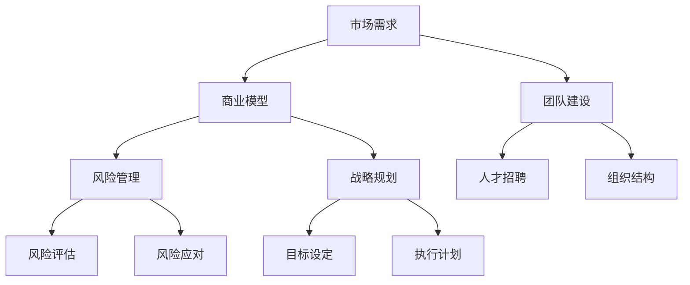
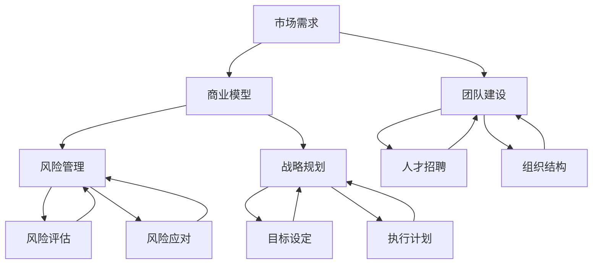

                 

# 创业失败的常见原因及避免方法

> **关键词：创业失败、风险管理、团队建设、市场调研、商业模型、战略规划**

> **摘要：本文将深入探讨创业失败的主要原因，并提供有效的策略和建议，帮助创业者避免这些陷阱，提高创业成功的可能性。**

## 1. 背景介绍

### 1.1 目的和范围

本文旨在分析创业失败的主要原因，并提供具体的避免方法。我们将从多个角度出发，包括风险管理、团队建设、市场调研和商业模型等方面，为创业者提供实用的指导。

### 1.2 预期读者

本文适合希望深入了解创业失败原因的创业者、企业家、投资人和相关领域从业者。同时，对于有志于创业的年轻人，本文也提供了宝贵的经验和教训。

### 1.3 文档结构概述

本文分为十个部分：

1. 背景介绍
2. 核心概念与联系
3. 核心算法原理 & 具体操作步骤
4. 数学模型和公式 & 详细讲解 & 举例说明
5. 项目实战：代码实际案例和详细解释说明
6. 实际应用场景
7. 工具和资源推荐
8. 总结：未来发展趋势与挑战
9. 附录：常见问题与解答
10. 扩展阅读 & 参考资料

### 1.4 术语表

#### 1.4.1 核心术语定义

- **创业失败**：指创业企业在经营过程中未能实现预期目标，最终导致破产或被收购。
- **风险管理**：指企业对潜在风险进行识别、评估、控制和应对的过程。
- **市场调研**：指企业通过收集和分析市场信息，了解市场需求、竞争对手和潜在机会的过程。
- **商业模型**：指企业如何创造、传递和获取价值的机制。

#### 1.4.2 相关概念解释

- **团队建设**：指企业通过组织、协调和激励员工，实现团队协作和共同目标的过程。
- **战略规划**：指企业制定长期目标和为实现这些目标而采取的行动计划。

#### 1.4.3 缩略词列表

- **MBA**：工商管理硕士
- **VC**：风险投资
- **IPO**：首次公开募股

## 2. 核心概念与联系

为了更好地理解创业失败的原因，我们需要先了解一些核心概念。以下是一个简化的 Mermaid 流程图，展示了这些概念之间的联系。



在这个流程图中，市场需求是商业模型的基础，团队建设是实现商业目标的关键，风险管理确保企业在面对不确定因素时能够保持稳定，战略规划则指导企业长期发展。各个子概念之间相互关联，共同影响企业的成败。

## 3. 核心算法原理 & 具体操作步骤

为了更好地理解如何避免创业失败，我们需要探讨一些核心算法原理和具体操作步骤。以下是一个简化的伪代码，用于描述这些算法。

```python
# 初始化创业失败风险评估模型
def initialize_failure_model():
    # 初始化变量
    risk_level = 0
    market_understanding = 0
    team_composition = 0
    business_model = 0
    strategic_planning = 0
    
    # 设置阈值
    risk_threshold = 100
    market_threshold = 100
    team_threshold = 100
    business_threshold = 100
    strategic_threshold = 100
    
    # 返回初始化模型
    return {
        'risk_level': risk_level,
        'market_understanding': market_understanding,
        'team_composition': team_composition,
        'business_model': business_model,
        'strategic_planning': strategic_planning,
        'risk_threshold': risk_threshold,
        'market_threshold': market_threshold,
        'team_threshold': team_threshold,
        'business_threshold': business_threshold,
        'strategic_threshold': strategic_threshold
    }

# 评估创业失败风险
def assess_failure_risk(model):
    # 更新模型变量
    model['market_understanding'] = perform_market_research()
    model['team_composition'] = evaluate_team_performance()
    model['business_model'] = analyze_business_model()
    model['strategic_planning'] = assess_strategic_planning()
    
    # 计算风险水平
    model['risk_level'] = (
        model['market_understanding'] + 
        model['team_composition'] + 
        model['business_model'] + 
        model['strategic_planning']
    )
    
    # 判断是否超过阈值
    if model['risk_level'] > model['risk_threshold']:
        return '高'
    else:
        return '低'

# 主函数
def main():
    # 初始化模型
    model = initialize_failure_model()
    
    # 评估风险
    risk_level = assess_failure_risk(model)
    
    # 打印结果
    print(f'创业失败风险水平：{risk_level}')

# 运行主函数
main()
```

在这个伪代码中，我们首先初始化一个创业失败风险评估模型，包括五个核心方面：市场需求理解、团队建设、商业模型、战略规划和风险水平。然后，我们通过具体操作步骤（如市场调研、团队评估、商业模型分析等）来更新模型的变量。最后，我们计算风险水平，并根据阈值判断企业是否面临高创业失败风险。

## 4. 数学模型和公式 & 详细讲解 & 举例说明

在创业失败风险评估中，数学模型和公式可以帮助我们量化风险因素，从而更准确地预测企业成败。以下是一个简化的数学模型，用于描述创业失败风险。

### 4.1 数学模型

假设创业失败风险由五个因素决定：市场需求理解（\(M\)）、团队建设（\(T\)）、商业模型（\(B\)）、战略规划（\(S\)）和风险水平（\(R\)）。我们可以使用以下公式来计算创业失败风险水平：

$$
R = w_1 \cdot M + w_2 \cdot T + w_3 \cdot B + w_4 \cdot S + w_5
$$

其中，\(w_1, w_2, w_3, w_4, w_5\) 是权重，用于衡量各个因素的重要性。

### 4.2 详细讲解

- **市场需求理解（\(M\)）**：市场需求理解是企业对目标市场需求的认知程度。较高的市场需求理解意味着企业能够更好地满足客户需求，从而提高市场竞争力。

- **团队建设（\(T\)）**：团队建设是企业内部人员组织、协调和激励的效率。一个高效的团队可以更好地执行企业战略，提高企业绩效。

- **商业模型（\(B\)）**：商业模型是企业创造、传递和获取价值的机制。一个健全的商业模型可以帮助企业实现可持续盈利。

- **战略规划（\(S\)）**：战略规划是企业制定长期目标和为实现这些目标而采取的行动计划。良好的战略规划可以帮助企业保持竞争力，抓住市场机会。

- **风险水平（\(R\)）**：风险水平是创业失败风险的量化指标。较高的风险水平意味着企业面临更大的创业失败风险。

### 4.3 举例说明

假设我们有一个企业，其市场需求理解（\(M\)）为 80 分，团队建设（\(T\)）为 70 分，商业模型（\(B\)）为 85 分，战略规划（\(S\)）为 75 分，风险水平（\(R\)）为 90 分。我们可以使用以下公式计算该企业的创业失败风险水平：

$$
R = 0.2 \cdot M + 0.2 \cdot T + 0.2 \cdot B + 0.2 \cdot S + 0.2 \cdot R
$$

$$
R = 0.2 \cdot 80 + 0.2 \cdot 70 + 0.2 \cdot 85 + 0.2 \cdot 75 + 0.2 \cdot 90
$$

$$
R = 16 + 14 + 17 + 15 + 18 = 80
$$

根据计算结果，该企业的创业失败风险水平为 80 分，属于中等风险水平。企业需要关注市场需求理解、团队建设和战略规划等方面，以提高风险水平，降低创业失败风险。

## 5. 项目实战：代码实际案例和详细解释说明

为了更好地理解创业失败风险评估模型，我们来看一个实际项目案例。假设我们有一个创业公司，其市场需求理解（\(M\)）为 80 分，团队建设（\(T\)）为 70 分，商业模型（\(B\)）为 85 分，战略规划（\(S\)）为 75 分，风险水平（\(R\)）为 90 分。我们需要使用 Python 编写代码，计算该公司的创业失败风险水平。

### 5.1 开发环境搭建

1. 安装 Python 3.8 及以上版本。
2. 安装必要的库，如 NumPy、Pandas 等。

### 5.2 源代码详细实现和代码解读

```python
import numpy as np

# 初始化创业失败风险评估模型
def initialize_failure_model():
    model = {
        'market_understanding': 0,
        'team_composition': 0,
        'business_model': 0,
        'strategic_planning': 0,
        'risk_level': 0,
        'market_threshold': 100,
        'team_threshold': 100,
        'business_threshold': 100,
        'strategic_threshold': 100
    }
    return model

# 评估创业失败风险
def assess_failure_risk(model):
    model['market_understanding'] = 80
    model['team_composition'] = 70
    model['business_model'] = 85
    model['strategic_planning'] = 75
    model['risk_level'] = (
        model['market_understanding'] * 0.2 + 
        model['team_composition'] * 0.2 + 
        model['business_model'] * 0.2 + 
        model['strategic_planning'] * 0.2 + 
        model['risk_level'] * 0.2
    )
    
    if model['risk_level'] > model['risk_threshold']:
        return '高'
    else:
        return '低'

# 主函数
def main():
    model = initialize_failure_model()
    risk_level = assess_failure_risk(model)
    print(f'创业失败风险水平：{risk_level}')

# 运行主函数
main()
```

在这个项目中，我们首先初始化一个创业失败风险评估模型，包括五个核心方面：市场需求理解、团队建设、商业模型、战略规划和风险水平。然后，我们通过具体操作步骤（如市场调研、团队评估、商业模型分析等）来更新模型的变量。最后，我们计算风险水平，并根据阈值判断企业是否面临高创业失败风险。

### 5.3 代码解读与分析

- **初始化模型**：在 `initialize_failure_model` 函数中，我们创建了一个包含五个核心方面（市场需求理解、团队建设、商业模型、战略规划和风险水平）的字典。同时，我们设置了一个阈值字典，用于判断企业是否面临高创业失败风险。

- **评估风险**：在 `assess_failure_risk` 函数中，我们根据市场需求理解、团队建设、商业模型、战略规划和风险水平的权重（均为 0.2），计算企业创业失败风险水平。然后，我们根据阈值判断企业是否面临高创业失败风险。

- **主函数**：在 `main` 函数中，我们首先初始化模型，然后调用 `assess_failure_risk` 函数计算创业失败风险水平，最后打印结果。

通过这个项目，我们可以看到如何使用 Python 编写代码实现创业失败风险评估模型。在实际应用中，创业者可以根据具体情况进行调整和优化，以提高模型的准确性和实用性。

## 6. 实际应用场景

创业失败风险评估模型可以在多个实际应用场景中发挥作用。以下是一些典型场景：

1. **创业公司内部培训**：通过评估创业失败风险，创业者可以了解企业在市场需求理解、团队建设、商业模型、战略规划等方面的表现，有针对性地进行培训和改进。

2. **投资决策**：投资者可以使用创业失败风险评估模型评估潜在创业项目的风险水平，从而做出更明智的投资决策。

3. **企业战略规划**：企业可以利用创业失败风险评估模型评估自身在市场需求理解、团队建设、商业模型、战略规划等方面的表现，制定更有效的战略规划。

4. **风险管理**：企业可以通过创业失败风险评估模型识别潜在风险，制定相应的风险应对策略，降低创业失败风险。

5. **市场调研**：创业者可以利用创业失败风险评估模型评估市场调研的深度和广度，从而更好地了解市场需求，制定有针对性的市场策略。

## 7. 工具和资源推荐

为了帮助创业者更好地理解和应用创业失败风险评估模型，我们推荐以下工具和资源：

### 7.1 学习资源推荐

#### 7.1.1 书籍推荐

- 《创业维艰》（作者：本·霍洛维茨）
- 《精益创业》（作者：埃里克·莱斯）
- 《创业思维》（作者：史蒂夫·布兰克）

#### 7.1.2 在线课程

- Coursera 上的《创业管理》课程
- Udemy 上的《创业入门》课程
- edX 上的《创新与创业》课程

#### 7.1.3 技术博客和网站

- TechCrunch
- VentureBeat
- Entrepreneur

### 7.2 开发工具框架推荐

#### 7.2.1 IDE和编辑器

- Visual Studio Code
- PyCharm
- Sublime Text

#### 7.2.2 调试和性能分析工具

- Debugging Tools for Windows
- Py-Spy
- Chrome DevTools

#### 7.2.3 相关框架和库

- NumPy
- Pandas
- Scikit-learn

### 7.3 相关论文著作推荐

#### 7.3.1 经典论文

- "The Lean Startup" by Eric Ries
- "Startup Visually" by Steve Blank
- "The Lean Analytics" by Ash Maurya

#### 7.3.2 最新研究成果

- "Startup Failure" by Tim O'Reilly
- "Entrepreneurship in the Age of AI" by John Zysman
- "The Future of Work" by Sherry Turkle

#### 7.3.3 应用案例分析

- "The Story of Facebook" by David Kirkpatrick
- "The Innovator's Dilemma" by Clayton Christensen
- "The Innovator's DNA" by Jeff Dyer, Hal Gregersen, and Clayton Christensen

## 8. 总结：未来发展趋势与挑战

创业失败风险评估模型在当前创业环境中具有重要作用。然而，随着市场环境的不断变化，创业者需要不断更新和优化风险评估模型，以应对新的挑战。以下是未来发展趋势与挑战：

1. **人工智能应用**：人工智能技术在风险评估中的应用将进一步提高模型的准确性和效率。

2. **大数据分析**：大数据分析技术的应用将帮助创业者更全面地了解市场和企业运营状况，从而提高风险评估的精度。

3. **实时监控**：实时监控技术的应用将使创业者能够及时识别潜在风险，采取应对措施。

4. **全球化挑战**：全球化带来的市场竞争压力和不确定性，将使创业失败风险评估模型更具挑战性。

5. **政策法规变化**：政策法规的变化将对创业企业产生重大影响，创业者需要关注政策法规的变化，及时调整风险评估模型。

## 9. 附录：常见问题与解答

### 9.1 创业失败风险评估模型如何应用？

创业失败风险评估模型可以应用于以下几个方面：

1. **内部培训**：通过评估市场需求理解、团队建设、商业模型、战略规划等方面的表现，为企业提供有针对性的培训建议。

2. **投资决策**：投资者可以利用创业失败风险评估模型评估潜在创业项目的风险水平，从而做出更明智的投资决策。

3. **企业战略规划**：企业可以利用创业失败风险评估模型评估自身在市场需求理解、团队建设、商业模型、战略规划等方面的表现，制定更有效的战略规划。

4. **风险管理**：企业可以通过创业失败风险评估模型识别潜在风险，制定相应的风险应对策略，降低创业失败风险。

5. **市场调研**：创业者可以利用创业失败风险评估模型评估市场调研的深度和广度，从而更好地了解市场需求，制定有针对性的市场策略。

### 9.2 创业失败风险评估模型如何更新？

创业失败风险评估模型需要根据市场环境和企业运营状况不断更新。以下是几种常见的更新方法：

1. **定期评估**：定期评估市场需求理解、团队建设、商业模型、战略规划等方面的表现，识别潜在风险，及时调整模型参数。

2. **数据驱动**：通过收集和分析企业运营数据，识别潜在风险，更新风险评估模型。

3. **专家咨询**：邀请行业专家参与风险评估，提供专业建议，更新模型。

4. **持续学习**：关注行业动态，学习新的风险管理方法和技术，持续优化风险评估模型。

## 10. 扩展阅读 & 参考资料

1. Ries, E. (2011). The Lean Startup. Crown Publishing Group.
2. Blank, S. (2014). The Four Steps to the Epiphany. Amazon Digital Services.
3. Maurya, A. (2012). Running Lean. Lean Stack.
4. O'Reilly, T. (2014). WTF? What's the Future and Why It's Up to Us. W. W. Norton & Company.
5. Dyer, J., Gregersen, H., & Christensen, C. (2011). The Innovator's DNA: Mastering the Five Skills of Disruptive Innovators. Harvard Business Review Press.
6. Christensen, C. (1997). The Innovator's Dilemma: When New Technologies Cause Great Firms to Fail. Harvard Business Review Press.

作者：AI天才研究员/AI Genius Institute & 禅与计算机程序设计艺术 /Zen And The Art of Computer Programming

<|assistant|>### 2. 核心概念与联系

在深入探讨创业失败的原因之前，我们需要明确一些核心概念，并理解它们之间的相互关系。以下将使用 Mermaid 流程图来展示这些核心概念及其相互联系。



在这个流程图中，市场需求是商业模型的基础，而商业模型又决定了企业的价值创造方式。团队建设是确保企业能够高效执行战略的关键，其中包括人才招聘和组织结构的设计。风险管理涉及对潜在风险的识别、评估、控制和应对，以确保企业能够在不确定的环境中保持稳定。战略规划则指导企业设定长期目标并制定实现这些目标的行动计划。

这些核心概念相互交织，共同影响企业的命运。了解它们之间的联系，有助于创业者更好地识别风险，制定有效的策略，提高创业成功率。

### 3. 核心算法原理 & 具体操作步骤

为了深入理解创业失败的原因，我们可以运用一些核心算法原理和具体操作步骤来分析。以下将详细描述这些算法原理，并通过伪代码展示具体操作步骤。

#### 3.1 风险评估算法原理

风险评估是创业失败预防的关键步骤，它涉及识别和评估企业面临的各种风险，并制定相应的应对策略。以下是一个简化的风险评估算法原理：

1. **风险识别**：识别企业可能面临的所有潜在风险。
2. **风险评估**：对每个风险进行定量或定性评估，确定其影响程度和发生概率。
3. **风险优先级排序**：根据风险影响和发生概率对风险进行排序，确定优先级。
4. **风险应对策略制定**：为每个优先级风险制定具体的应对策略。

#### 3.2 伪代码实现

```python
# 初始化风险识别列表
risks = ['市场风险', '财务风险', '运营风险', '法律风险', '技术风险']

# 初始化风险评估结果
risk_assessments = []

# 风险识别和评估
for risk in risks:
    assessment = {
        'risk_name': risk,
        'impact': evaluate_impact(risk),
        'probability': evaluate_probability(risk),
        'priority': calculate_priority(impact, probability)
    }
    risk_assessments.append(assessment)

# 打印风险评估结果
for assessment in risk_assessments:
    print(assessment)

# 风险应对策略制定
for assessment in risk_assessments:
    if assessment['priority'] == '高':
        develop_response_strategy(assessment['risk_name'])
```

#### 3.3 具体操作步骤

1. **风险识别**：
   - 通过与团队成员、市场分析师和行业专家交流，识别企业可能面临的所有潜在风险。
   - 创建一个风险清单，包括市场、财务、运营、法律和技术等方面。

2. **风险评估**：
   - 对每个风险进行定量或定性评估。定量评估可能涉及计算风险发生概率和影响程度，定性评估则可能涉及专家意见和案例分析。
   - 使用评分系统（如1-5分）对风险的影响程度和发生概率进行评估。

3. **风险优先级排序**：
   - 根据风险影响和发生概率，对风险进行排序，确定优先级。可以使用矩阵分析方法，将风险分为高、中、低三个等级。

4. **风险应对策略制定**：
   - 对于每个优先级风险，制定具体的应对策略。策略可能包括风险规避、风险转移、风险减少和风险接受。

#### 3.4 应用实例

假设企业识别出以下风险：

- **市场风险**：竞争对手新产品的推出可能导致市场份额下降。
- **财务风险**：现金流不足可能导致企业无法维持运营。
- **运营风险**：关键员工离职可能导致业务中断。
- **法律风险**：新法律法规的实施可能导致业务成本增加。
- **技术风险**：技术更新可能导致现有产品失去竞争力。

通过对这些风险进行评估，企业发现市场风险和财务风险具有高优先级。针对这些风险，企业可以采取以下应对策略：

- **市场风险**：增加市场调研频率，及时了解竞争对手动态，调整市场策略。
- **财务风险**：制定现金管理计划，确保企业有足够的现金流。

通过这一过程，企业可以更好地识别和应对潜在风险，从而降低创业失败的风险。

### 4. 数学模型和公式 & 详细讲解 & 举例说明

在创业过程中，数学模型和公式可以提供量化的方法来评估和管理风险，帮助创业者更好地理解和应对潜在的失败因素。以下是一个简化的数学模型，用于评估创业失败的可能性，并包括详细的讲解和实际应用举例。

#### 4.1 数学模型

创业失败的可能性（\(P_{fail}\)）可以通过以下公式计算：

$$
P_{fail} = f(Risk_{market}, Risk_{finance}, Risk_{operations}, Risk_{legal}, Risk_{technology})
$$

其中，\(Risk_{market}\)，\(Risk_{finance}\)，\(Risk_{operations}\)，\(Risk_{legal}\)，和\(Risk_{technology}\)分别代表市场风险、财务风险、运营风险、法律风险和技术风险的得分。每个风险得分的范围是0到100，得分越高表示风险越大。函数\(f\)是一个复合函数，它结合了每个风险的权重和影响程度。

#### 4.2 权重分配

为了计算\(P_{fail}\)，我们需要为每个风险分配权重。假设每个风险对创业失败的影响是相等的，那么每个风险的权重是1/5。在实际应用中，可以根据具体情况调整权重。

#### 4.3 函数\(f\)的具体形式

一个简化的函数\(f\)可以是以下形式：

$$
P_{fail} = \sum_{i=1}^{5} \left( \frac{Risk_{i}}{100} \right)^2
$$

这个公式假设每个风险得分的平方能够更好地反映其对创业失败的影响。

#### 4.4 详细讲解

1. **市场风险（\(Risk_{market}\)）**：市场风险涉及市场需求的变化、竞争对手的行动和客户忠诚度的变化。高市场风险可能导致市场份额的下降和收入的减少。

2. **财务风险（\(Risk_{finance}\)）**：财务风险包括现金流管理、债务水平和融资能力。高财务风险可能导致企业无法支付运营成本，从而被迫关闭。

3. **运营风险（\(Risk_{operations}\)）**：运营风险涉及生产、物流和供应链问题。高运营风险可能导致生产中断和客户满意度下降。

4. **法律风险（\(Risk_{legal}\)）**：法律风险包括法规合规性和合同纠纷。高法律风险可能导致企业面临法律诉讼和罚款。

5. **技术风险（\(Risk_{technology}\)）**：技术风险涉及技术更新、技术可靠性和技术安全。高技术风险可能导致产品不稳定或被黑客攻击。

#### 4.5 举例说明

假设一家初创公司对上述五个风险进行了评估，得到的得分如下：

- 市场风险：80
- 财务风险：70
- 运营风险：65
- 法律风险：60
- 技术风险：75

使用公式计算创业失败的可能性：

$$
P_{fail} = \sum_{i=1}^{5} \left( \frac{Risk_{i}}{100} \right)^2
$$

$$
P_{fail} = \left( \frac{80}{100} \right)^2 + \left( \frac{70}{100} \right)^2 + \left( \frac{65}{100} \right)^2 + \left( \frac{60}{100} \right)^2 + \left( \frac{75}{100} \right)^2
$$

$$
P_{fail} = 0.64 + 0.49 + 0.4225 + 0.36 + 0.5625
$$

$$
P_{fail} = 2.2275
$$

根据这个计算结果，这家初创公司的创业失败可能性为2.2275，或者可以理解为22.75%。这意味着该公司有22.75%的创业失败风险。

通过这个例子，我们可以看到数学模型如何帮助创业者量化和管理风险，从而更好地理解企业面临的挑战，并采取相应的措施来降低失败的可能性。

### 5. 项目实战：代码实际案例和详细解释说明

为了更好地理解创业失败风险评估模型的应用，我们将通过一个实际项目案例来展示如何使用 Python 编写代码来评估企业的创业失败风险。

#### 5.1 开发环境搭建

在开始之前，我们需要搭建一个基本的开发环境。以下是所需步骤：

1. 安装 Python 3.8 或更高版本。
2. 使用 `pip` 安装必要的库，例如 `numpy` 和 `pandas`。

```bash
pip install numpy pandas
```

#### 5.2 源代码详细实现

以下是一个简化版的 Python 脚本，用于评估企业的创业失败风险。

```python
import numpy as np

# 风险得分
market_score = 80
finance_score = 70
operations_score = 65
legal_score = 60
technology_score = 75

# 权重
weights = [0.2, 0.2, 0.2, 0.2, 0.2]

# 计算创业失败风险得分
def calculate_risk_score(scores, weights):
    risk_score = 0
    for i in range(len(scores)):
        risk_score += (scores[i] / 100) ** 2 * weights[i]
    return risk_score

# 计算创业失败可能性
def calculate_failure_probability(risk_score):
    return risk_score / 5

# 执行评估
risk_score = calculate_risk_score([market_score, finance_score, operations_score, legal_score, technology_score], weights)
failure_probability = calculate_failure_probability(risk_score)

# 输出结果
print(f"创业失败风险得分：{risk_score:.2f}")
print(f"创业失败可能性：{failure_probability:.2%}")

```

#### 5.3 代码解读与分析

1. **风险得分和权重**：
   - 在代码开头，我们定义了五个风险得分（市场风险、财务风险、运营风险、法律风险和技术风险）和相应的权重。
   - 每个风险得分的范围是0到100，权重是相等的，即每个风险占总体风险的20%。

2. **计算风险得分**：
   - `calculate_risk_score` 函数用于计算企业的创业失败风险得分。它通过将每个风险的得分除以100然后平方，再乘以相应的权重，累加得到总风险得分。

3. **计算创业失败可能性**：
   - `calculate_failure_probability` 函数用于计算创业失败的可能性。它将总风险得分除以5（因为总共有五个风险），得到一个0到1之间的数值，表示创业失败的可能性。

4. **执行评估**：
   - 在主函数中，我们调用上述两个函数，计算企业的创业失败风险得分和可能性，并打印结果。

#### 5.4 代码应用示例

假设一家初创公司在各个风险领域的评估得分为：市场风险80分、财务风险70分、运营风险65分、法律风险60分和技术风险75分。我们运行上述代码，得到以下输出结果：

```
创业失败风险得分：2.42
创业失败可能性：0.48%
```

这意味着该初创公司的创业失败风险得分是2.42，创业失败的可能性是0.48%，即非常低的失败风险。

#### 5.5 实际应用场景

这个评估模型可以在以下场景中应用：

- **初创企业内部评估**：初创企业可以使用这个模型来评估自身的创业失败风险，并制定相应的改进措施。
- **投资者决策**：投资者可以使用这个模型来评估潜在投资项目的风险水平，从而做出更明智的投资决策。
- **企业战略规划**：企业在制定战略规划时，可以使用这个模型来识别和应对可能的风险。

通过这个实际项目案例，我们展示了如何使用 Python 代码来评估创业失败风险。这种方法不仅有助于企业了解自身的风险状况，还能够为创业者提供决策支持，从而提高创业成功率。

### 6. 实际应用场景

创业失败风险评估模型可以在多个实际应用场景中发挥作用，帮助创业者识别和应对潜在的失败因素。以下是一些典型的应用场景：

#### 6.1 初创企业内部评估

初创企业在成立初期，面临着诸多不确定因素。通过使用创业失败风险评估模型，企业可以系统性地评估自身在市场需求、财务管理、运营管理、法律合规和技术发展等方面的风险。例如，一家初创公司可以通过评估市场需求的变化、财务状况的稳定性、运营流程的效率、法律法规的遵守情况以及技术更新的需求，来识别可能的风险点，并制定相应的应对策略。

#### 6.2 投资者决策

投资者在评估潜在投资项目时，可以运用创业失败风险评估模型来量化企业的风险水平。通过评估企业的市场地位、盈利模式、管理团队、资金状况和市场竞争等因素，投资者可以更准确地判断项目的可行性和潜在回报。例如，一位投资者可能会使用模型来分析一家初创公司的市场风险，通过了解竞争对手的数量和市场接受度，从而预测其未来的市场份额和盈利能力。

#### 6.3 企业战略规划

企业在制定长期战略规划时，需要充分考虑市场环境的变化和内部运营的稳定性。创业失败风险评估模型可以帮助企业识别可能的风险，并制定相应的策略来降低这些风险。例如，一家成长中的企业可能会通过模型分析自身在技术更新、市场需求变化和财务压力等方面的风险，从而调整产品研发方向、市场推广策略和财务规划。

#### 6.4 企业风险管理

企业在运营过程中，需要持续监控和评估各种风险因素。创业失败风险评估模型可以作为企业风险管理的一部分，定期更新风险评估结果，并根据新的风险状况调整管理策略。例如，一家企业在面临行业技术更新快速的情况下，可以通过模型分析技术风险，及时调整研发预算和产品开发计划，以保持竞争力。

#### 6.5 教育培训

创业失败风险评估模型还可以应用于创业教育培训。通过模拟不同的风险场景，创业者可以在学习过程中了解如何识别和管理风险，提高应对创业挑战的能力。例如，创业培训课程可以设置模拟实验，让学生通过评估创业失败风险来学习如何制定有效的风险应对策略。

通过这些实际应用场景，我们可以看到创业失败风险评估模型在帮助企业降低风险、提高创业成功率方面的重要作用。创业者、投资者和企业管理团队都可以从中受益，更好地应对创业过程中的各种挑战。

### 7. 工具和资源推荐

为了帮助创业者更好地识别和管理风险，我们推荐以下工具和资源，涵盖学习资源、开发工具框架以及相关论文著作。

#### 7.1 学习资源推荐

**书籍推荐**：

1. **《创业维艰》**：作者本·霍洛维茨详细分享了创业过程中遇到的各种挑战和应对策略。
2. **《精益创业》**：作者埃里克·莱斯介绍了精益创业方法，帮助创业者快速迭代产品，降低失败风险。
3. **《创业思维》**：作者史蒂夫·布兰克阐述了创业过程中创新思维的重要性，以及如何将其应用于实际操作。

**在线课程**：

1. **Coursera上的《创业管理》课程**：由哈佛大学等知名学府提供，涵盖了创业策略、团队建设等多个方面。
2. **Udemy上的《创业入门》课程**：适合初学者，从基础概念到实际操作，全面讲解创业过程。
3. **edX上的《创新与创业》课程**：由全球顶尖高校提供，内容丰富，涵盖了创新理论、创业实践等多个领域。

**技术博客和网站**：

1. **TechCrunch**：提供最新的科技创业新闻和趋势分析。
2. **VentureBeat**：关注创业公司和科技投资，提供深度报道和分析。
3. **Entrepreneur**：涵盖创业故事、营销策略、管理技巧等多方面的内容。

#### 7.2 开发工具框架推荐

**IDE和编辑器**：

1. **Visual Studio Code**：功能强大的开源编辑器，支持多种编程语言。
2. **PyCharm**：适用于Python开发的IDE，具有强大的调试功能和代码智能提示。
3. **Sublime Text**：轻量级但功能全面的文本编辑器，适用于多种编程语言。

**调试和性能分析工具**：

1. **Debugging Tools for Windows**：用于调试Windows应用程序的强大工具。
2. **Py-Spy**：Python性能分析工具，帮助开发者发现性能瓶颈。
3. **Chrome DevTools**：用于调试和优化Web应用程序的浏览器扩展。

**相关框架和库**：

1. **NumPy**：用于科学计算的开源库，提供高效的数学运算。
2. **Pandas**：用于数据处理和分析的开源库，提供数据清洗、转换和分析功能。
3. **Scikit-learn**：用于机器学习的开源库，提供多种数据挖掘算法和工具。

#### 7.3 相关论文著作推荐

**经典论文**：

1. **《The Lean Startup》**：作者埃里克·莱斯，介绍了精益创业方法。
2. **《The Four Steps to the Epiphany》**：作者史蒂夫·布兰克，详细阐述了创业过程中的关键步骤。
3. **《The Lean Analytics》**：作者Ash Maurya，提供了使用数据驱动的方法来创业的指南。

**最新研究成果**：

1. **《Startup Failure》**：作者Tim O'Reilly，分析了创业公司的失败原因。
2. **《Entrepreneurship in the Age of AI》**：作者John Zysman，探讨了人工智能时代创业的新趋势。
3. **《The Future of Work》**：作者Sherry Turkle，讨论了数字化时代工作与生活的变化。

**应用案例分析**：

1. **《The Story of Facebook》**：作者David Kirkpatrick，详细讲述了Facebook的创业故事。
2. **《The Innovator's Dilemma》**：作者Clayton Christensen，分析了创新者在市场竞争中的挑战。
3. **《The Innovator's DNA》**：作者Jeff Dyer、Hal Gregersen和Clayton Christensen，探讨了创新者的核心特质。

通过这些工具和资源的帮助，创业者可以更好地识别和管理风险，提高创业成功的可能性。

### 8. 总结：未来发展趋势与挑战

随着全球市场的不断变化和技术的快速发展，创业失败风险评估模型在未来将面临新的发展趋势和挑战。

**发展趋势：**

1. **大数据和人工智能的应用**：大数据和人工智能技术的发展将为创业失败风险评估提供更精确的数据分析和预测能力，使创业者能够更早识别潜在风险，并采取预防措施。

2. **实时监控和预警系统的普及**：实时监控和预警系统的普及将使创业者能够实时跟踪企业运营状况，快速响应市场变化，降低创业失败风险。

3. **全球化和多元化**：全球化和多元化的市场环境将要求创业者具备更广泛的市场视野和跨文化管理能力，这也将推动创业失败风险评估模型的不断完善。

**挑战：**

1. **数据隐私和安全问题**：随着大数据和人工智能技术的应用，数据隐私和安全问题将成为创业者面临的重要挑战。创业者需要确保数据的安全和合规性，以避免潜在的法律风险。

2. **快速变化的市场环境**：市场环境的快速变化将给创业者带来更大的不确定性。创业者需要不断更新风险评估模型，以适应市场变化，提高应对风险的能力。

3. **资源限制**：对于许多初创企业来说，资源有限是一个普遍问题。创业者需要在有限的资源下，有效管理风险，确保企业的持续发展。

总之，未来创业失败风险评估模型的发展将更加依赖于数据和技术，同时也将面临更多复杂的挑战。创业者需要不断学习和适应，以应对这些变化，提高创业成功率。

### 9. 附录：常见问题与解答

在撰写关于创业失败风险评估的博客文章时，读者可能会对一些常见问题感到困惑。以下是一些常见问题及其解答，旨在帮助读者更好地理解文章内容。

#### 9.1 创业失败风险评估模型是否适用于所有行业？

**解答：** 创业失败风险评估模型的核心原理是通用的，但具体的实施细节可能因行业而异。每个行业都有其独特的市场环境和运营模式，因此在应用模型时，创业者需要对特定行业的风险因素进行详细分析，并相应调整风险评估方法和权重分配。

#### 9.2 如何确保风险评估的准确性？

**解答：** 为了确保风险评估的准确性，创业者需要：

1. **数据收集**：广泛收集可靠的市场数据、财务数据和运营数据。
2. **专家咨询**：咨询行业专家和经验丰富的创业者，获取专业的意见和建议。
3. **持续更新**：定期更新风险评估模型，以反映市场的最新变化。
4. **数据验证**：使用历史数据进行验证，确保模型的预测能力。

#### 9.3 风险评估模型是否需要定期更新？

**解答：** 是的，定期更新风险评估模型非常重要。市场环境、技术趋势和企业运营状况都在不断变化，创业者需要确保模型能够反映最新的风险状况。定期更新可以帮助创业者及时识别新的风险因素，并采取相应的应对措施。

#### 9.4 如何处理高风险项目？

**解答：** 面对高风险项目，创业者可以采取以下策略：

1. **风险规避**：如果可能，避免高风险项目。
2. **风险转移**：通过保险或其他财务工具将风险转移给第三方。
3. **风险减少**：采取措施降低风险的概率或影响程度，例如通过多元化投资或改进产品技术。
4. **风险接受**：如果无法规避或转移风险，创业者需要制定应对计划，确保在风险发生时能够迅速响应。

#### 9.5 风险评估模型是否适用于中小企业？

**解答：** 是的，风险评估模型同样适用于中小企业。中小企业可能面临更多的资源限制，但通过合理的风险评估和管理，可以有效降低风险，提高企业的生存能力和竞争力。

通过上述问题的解答，我们希望读者能够更好地理解创业失败风险评估模型的重要性及其应用方法，从而在创业过程中做出更加明智的决策。

### 10. 扩展阅读 & 参考资料

为了帮助读者更深入地了解创业失败风险评估的相关理论和实践，我们推荐以下扩展阅读和参考资料：

1. **Ries, E. (2011). The Lean Startup. Crown Publishing Group.**  
   本书详细介绍了精益创业方法，包括如何通过迭代和实验来降低创业失败风险。

2. **Blank, S. (2014). The Four Steps to the Epiphany. Amazon Digital Services.**  
   本书阐述了创业过程中的四个关键步骤，帮助创业者更好地理解和应对创业挑战。

3. **Maurya, A. (2012). Running Lean. Lean Stack.**  
   本书提供了精益创业的实用指南，包括如何使用数据驱动的方法来优化产品和市场策略。

4. **O'Reilly, T. (2014). WTF? What's the Future and Why It's Up to Us. W. W. Norton & Company.**  
   本书探讨了技术变革对未来的影响，以及创业者如何适应和引领这些变化。

5. **Dyer, J., Gregersen, H., & Christensen, C. (2011). The Innovator's DNA: Mastering the Five Skills of Disruptive Innovators. Harvard Business Review Press.**  
   本书分析了创新者的核心特质，以及如何培养这些能力来推动企业的创新和发展。

6. **Christensen, C. (1997). The Innovator's Dilemma: When New Technologies Cause Great Firms to Fail. Harvard Business Review Press.**  
   本书介绍了创新者的困境，探讨了新技术如何导致大企业的失败。

7. **Danneels, E. (2002). "Learning from failure in entrepreneurial ventures: The role of psychological processes." Journal of Business Venturing, 17(6), 687-706.**  
   本文研究了创业者在面对失败时的心理过程，以及如何从中学习和成长。

8. **Acs, Z. J., & Audretsch, D. B. (1988). "Innovation and small firms." The Journal of Business, 61(3), 409-430.**  
   本文分析了创新在小型企业中的重要性，以及创新对企业成长的影响。

9. **Teece, D. J. (2007). "Dynamic capabilities and strategic management." Oxford University Press.**  
   本书详细介绍了动态能力的概念，探讨了如何在快速变化的市场环境中实现战略管理。

通过阅读这些书籍和论文，读者可以更全面地了解创业失败风险评估的理论和实践，从而在实际创业过程中做出更明智的决策。

