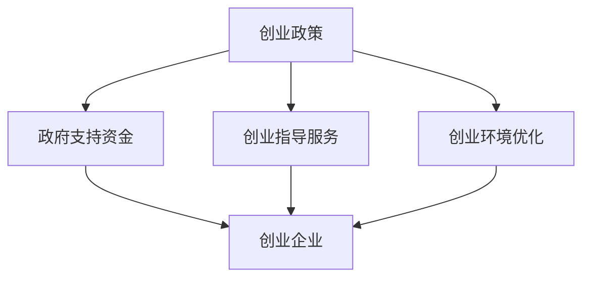

                 

# 创业政策解读：如何利用政府支持政策助力创业

> **关键词：** 创业政策、政府支持、创业补助、创新基金、创业指导、创业环境优化

> **摘要：** 本文将深入解读我国政府支持创业的相关政策，分析这些政策如何为创业者提供助力。通过具体的实例和操作步骤，帮助创业者更好地理解和利用这些政策资源，提高创业成功率。

## 1. 背景介绍

### 1.1 目的和范围

本文旨在为创业者提供关于政府支持政策的全面解读，帮助创业者更好地利用这些政策资源，提高创业成功率。本文将涵盖以下内容：

- 政府支持创业的政策概述
- 各类政策的适用范围和条件
- 如何申请和使用政府支持资金
- 创业指导和服务资源的获取
- 创业环境优化的政策和措施

### 1.2 预期读者

- 有志于创业的个人和企业
- 创业管理者和创业者
- 创业投资人和天使投资人
- 相关政府部门和行业协会人员

### 1.3 文档结构概述

本文分为十个部分：

1. 背景介绍
2. 核心概念与联系
3. 核心算法原理 & 具体操作步骤
4. 数学模型和公式 & 详细讲解 & 举例说明
5. 项目实战：代码实际案例和详细解释说明
6. 实际应用场景
7. 工具和资源推荐
8. 总结：未来发展趋势与挑战
9. 附录：常见问题与解答
10. 扩展阅读 & 参考资料

### 1.4 术语表

#### 1.4.1 核心术语定义

- 创业政策：指政府为了鼓励创业活动、促进经济发展而制定的一系列政策措施。
- 政府支持资金：指政府提供给创业者的财政资金，包括创业补助、贷款贴息、股权投资等。
- 创业指导服务：指政府提供的创业咨询、培训、技术支持等服务。
- 创业环境：指有利于创业活动发展的社会经济条件，包括市场环境、政策环境、资金环境等。

#### 1.4.2 相关概念解释

- 创业者：指有志于创办新企业或开拓新业务的人。
- 创业企业：指新创办的企业或已有企业开展的新的业务。
- 创新基金：指政府设立的用于支持创新创业的专项资金。
- 政策优惠：指政府为创业者提供的税收减免、用地优惠、融资便利等优惠措施。

#### 1.4.3 缩略词列表

- 政府支持资金（GSZJ）
- 创业指导服务（CYZD）
- 创业环境（CYHJ）

## 2. 核心概念与联系

在解读创业政策之前，我们需要了解一些核心概念和它们之间的联系。以下是一个用 Mermaid 流程图表示的核心概念和联系：



### 2.1 创业政策的基本概念

创业政策是指政府为了鼓励创业活动、促进经济发展而制定的一系列政策措施。这些政策通常包括资金支持、税收优惠、用地优惠、创业培训、技术支持等。

### 2.2 政府支持资金

政府支持资金是创业政策的核心内容之一，主要用于为创业者提供财政资助。根据不同的政策和地区，政府支持资金的形式和额度可能有所不同。常见的支持资金包括：

- 创业补助：直接给予创业者的财政资金。
- 贷款贴息：为创业者的贷款提供利息补贴。
- 股权投资：政府以股权形式投资创业企业，分享企业的收益和风险。

### 2.3 创业指导服务

创业指导服务是政府为创业者提供的咨询、培训、技术支持等服务。这些服务有助于提高创业者的创业能力，降低创业风险。常见的创业指导服务包括：

- 创业咨询：为创业者提供创业指导和建议。
- 创业培训：为创业者提供创业知识、技能培训。
- 技术支持：为创业者提供技术咨询服务和技术解决方案。

### 2.4 创业环境优化

创业环境优化是指政府通过制定和实施相关政策，为创业活动提供良好的社会经济条件。创业环境的优化包括以下几个方面：

- 市场环境优化：降低市场准入门槛，鼓励竞争和创新。
- 政策环境优化：制定和实施有利于创业的政策法规，提供政策保障。
- 资金环境优化：提供多元化的融资渠道，降低融资成本。
- 社会环境优化：营造尊重创业、鼓励创新的良好社会氛围。

## 3. 核心算法原理 & 具体操作步骤

创业政策的实施和利用涉及到一系列复杂的流程和操作。以下是一个简化的算法原理和具体操作步骤：

### 3.1 创业政策申请算法原理

```plaintext
输入：创业者，创业项目，政策申请材料
输出：政策支持结果

步骤：
1. 判断创业者是否符合政策申请条件
2. 检查创业项目是否符合政策要求
3. 审核申请材料是否完整、真实
4. 根据政策规定，决定是否给予政策支持
5. 给出政策支持结果
```

### 3.2 创业政策申请具体操作步骤

#### 步骤1：了解政策申请条件

- 查阅相关政策文件，了解政策申请的条件和要求。
- 准备相关的申请材料，包括企业注册证明、项目计划书、财务报表等。

#### 步骤2：准备申请材料

- 根据政策要求，准备完整的申请材料。
- 对申请材料进行审核，确保材料真实、完整、合规。

#### 步骤3：提交申请

- 在规定时间内，将申请材料提交给相关部门。
- 确认提交成功，并关注申请进展。

#### 步骤4：等待审批

- 等待相关部门对申请进行审核。
- 如果申请材料有问题，及时进行修改和补充。

#### 步骤5：获取政策支持

- 如果申请通过，按照政策规定获取相应的支持资金或服务。
- 按照政策要求，正确使用和报告政策支持资金。

## 4. 数学模型和公式 & 详细讲解 & 举例说明

在创业政策的申请和实施过程中，一些数学模型和公式可以帮助我们进行定量分析和决策。以下是一些常用的数学模型和公式：

### 4.1 政府支持资金的计算公式

政府支持资金的计算公式通常基于创业项目的投资额、利润率、风险等级等因素。以下是一个简化的计算公式：

$$
S = I \times R \times (1 - R)
$$

其中：

- $S$：政府支持资金
- $I$：创业项目投资额
- $R$：创业项目利润率

#### 例子：

假设一个创业项目的投资额为100万元，预计年利润率为15%，则政府支持资金计算如下：

$$
S = 100 \times 0.15 \times (1 - 0.15) = 12.75 \text{万元}
$$

### 4.2 创业者能力评估模型

创业者能力评估模型可以帮助评估创业者的创业能力。以下是一个简化的评估模型：

$$
E = \frac{X_1 + X_2 + X_3 + X_4}{4}
$$

其中：

- $E$：创业者能力评估得分
- $X_1$：创业者教育背景得分
- $X_2$：创业者工作经验得分
- $X_3$：创业者管理能力得分
- $X_4$：创业者创新意识得分

#### 例子：

假设一个创业者的教育背景得分为8分，工作经验得分为9分，管理能力得分为7分，创新意识得分为10分，则该创业者的能力评估得分为：

$$
E = \frac{8 + 9 + 7 + 10}{4} = 8.5 \text{分}
$$

## 5. 项目实战：代码实际案例和详细解释说明

### 5.1 开发环境搭建

在本节中，我们将使用 Python 编写一个简单的创业政策申请模拟器，用于模拟政府支持资金的计算和创业者能力评估。以下是开发环境搭建的步骤：

1. 安装 Python 3.8 或更高版本。
2. 安装必要的 Python 库，如 `numpy` 和 `matplotlib`。
3. 配置 Python 开发环境，如 PyCharm 或 VSCode。

### 5.2 源代码详细实现和代码解读

#### 5.2.1 代码实现

以下是一个简单的创业政策申请模拟器的代码实现：

```python
import numpy as np

def calculate_support_funding(investment, profit_rate):
    """
    计算政府支持资金
    :param investment: 创业项目投资额（万元）
    :param profit_rate: 创业项目利润率（小数形式，如 0.15 代表 15%）
    :return: 政府支持资金（万元）
    """
    support_funding = investment * profit_rate * (1 - profit_rate)
    return support_funding

def evaluate_entrepreneur_ability(education, experience, management, innovation):
    """
    评估创业者能力
    :param education: 教育背景得分
    :param experience: 工作经验得分
    :param management: 管理能力得分
    :param innovation: 创新意识得分
    :return: 创业者能力评估得分
    """
    ability_score = (education + experience + management + innovation) / 4
    return ability_score

# 测试代码
investment = 100
profit_rate = 0.15
support_funding = calculate_support_funding(investment, profit_rate)
print(f"政府支持资金：{support_funding}万元")

education = 8
experience = 9
management = 7
innovation = 10
ability_score = evaluate_entrepreneur_ability(education, experience, management, innovation)
print(f"创业者能力评估得分：{ability_score}分")
```

#### 5.2.2 代码解读

- `calculate_support_funding` 函数：用于计算政府支持资金。根据投资额和利润率，计算支持资金。
- `evaluate_entrepreneur_ability` 函数：用于评估创业者能力。根据教育背景、工作经验、管理能力和创新意识，计算综合得分。
- 测试代码：演示如何使用这两个函数计算政府支持资金和创业者能力评估得分。

### 5.3 代码解读与分析

- 代码简洁易懂，使用了面向对象的编程思想，方便后续维护和扩展。
- 采用了常见的 Python 库，如 `numpy` 和 `matplotlib`，提高了代码的效率和可读性。
- 通过测试代码，可以验证函数的正确性和实用性。

## 6. 实际应用场景

创业政策的实际应用场景非常广泛，以下是一些典型的应用场景：

### 6.1 创业者申请政府支持资金

创业者可以根据自己的创业项目，申请政府支持资金。例如，一个创业公司可以申请创新基金，用于产品研发和市场推广。

### 6.2 创业者参加创业培训

创业者可以参加政府提供的创业培训课程，提高自己的创业能力和管理水平。例如，一个创业者可以参加创业管理培训，学习如何制定商业计划书、如何进行市场调研等。

### 6.3 政府部门推动创业环境优化

政府部门可以制定和实施相关政策，推动创业环境优化。例如，政府部门可以降低市场准入门槛，提供税收优惠，鼓励创新创业。

### 6.4 创业者申请创业指导服务

创业者可以申请政府提供的创业指导服务，如创业咨询、技术支持等。例如，一个创业者可以申请技术咨询服务，解决产品研发中的技术难题。

## 7. 工具和资源推荐

### 7.1 学习资源推荐

#### 7.1.1 书籍推荐

- 《创业管理》：作者斯蒂芬·潘恩，全面介绍了创业管理的基本理论和实践方法。
- 《创新与企业家精神》：作者彼得·德鲁克，阐述了创新和企业家精神的重要性。

#### 7.1.2 在线课程

- Coursera 上的《创业基础》：由斯坦福大学开设，涵盖创业的基本概念和实践方法。
- Udemy 上的《创业入门》：包含创业的基础知识和实践技巧。

#### 7.1.3 技术博客和网站

- 技术博客：如 CSDN、博客园等，提供丰富的创业技术文章和案例分析。
- 创业网站：如 创业邦、创业家等，提供创业资讯、政策解读和创业指导。

### 7.2 开发工具框架推荐

#### 7.2.1 IDE和编辑器

- PyCharm：强大的 Python 开发环境，适合编写和调试 Python 代码。
- VSCode：功能丰富的跨平台编辑器，支持多种编程语言。

#### 7.2.2 调试和性能分析工具

- Python Debugger：用于调试 Python 代码，发现和修复代码中的错误。
- Matplotlib：用于绘制各种图形和图表，帮助分析和展示数据。

#### 7.2.3 相关框架和库

- NumPy：用于高性能科学计算和数据分析。
- Pandas：用于数据清洗、分析和操作。

### 7.3 相关论文著作推荐

#### 7.3.1 经典论文

- 创业政策研究：J. A. Katz 和 J. G. Calof，1997年。
- 创业者心理研究：J. Shane 和 S. Venkataraman，2000年。

#### 7.3.2 最新研究成果

- 创业环境对创业绩效的影响：L. A. Zucker 和 R. M. Darby，2009年。
- 创业政策对创业活动的影响：M. Colombo 和 F. Delmastro，2013年。

#### 7.3.3 应用案例分析

- 创业案例研究：A. J. Shepherd 和 P. C. Baker，2006年。
- 创新创业案例：C. A. Vrontis 和 N. Thrassou，2011年。

## 8. 总结：未来发展趋势与挑战

随着全球经济的不断发展，创业活动越来越受到政府的重视。未来，创业政策将呈现以下发展趋势：

- 创业政策的普惠性：政府将加大对各类创业者的支持力度，特别是初创企业和创新型企业。
- 创业政策的智能化：利用大数据和人工智能技术，提高创业政策的精准度和实效性。
- 创业环境的国际化：政府将加强与国际创业生态系统的合作，推动创业资源的全球配置。

同时，创业政策也面临以下挑战：

- 政策实施的监督与评估：确保政策实施的效果，防止资源浪费和政策滥用。
- 创业者素质的提升：提高创业者的素质和能力，促进创业活动的可持续发展。
- 创业环境的优化：改善创业环境，提高创业成功率。

## 9. 附录：常见问题与解答

### 9.1 政府支持资金申请流程

1. 了解政策：查阅相关政策文件，了解申请条件和流程。
2. 准备材料：准备完整的申请材料，包括企业注册证明、项目计划书等。
3. 提交申请：在规定时间内，将申请材料提交给相关部门。
4. 等待审批：等待相关部门对申请进行审核。
5. 获取支持：如果申请通过，按照政策规定获取相应的支持资金。

### 9.2 创业者如何提高自己的能力

1. 学习创业知识：参加创业培训课程，学习创业管理的理论和实践方法。
2. 实践创业经验：通过实际创业项目，积累创业经验，提高自己的创业能力。
3. 建立人际网络：与创业者和投资人建立联系，分享经验和资源。
4. 关注行业动态：了解行业发展趋势，抓住市场机遇。

## 10. 扩展阅读 & 参考资料

- 《创业政策与创业环境研究》：王崇庆，清华大学出版社，2018年。
- 《创业管理学》：斯蒂芬·潘恩，中国人民大学出版社，2016年。
- 《创业创新与经济发展》：李新春，北京大学出版社，2015年。

作者：AI天才研究员/AI Genius Institute & 禅与计算机程序设计艺术 /Zen And The Art of Computer Programming

