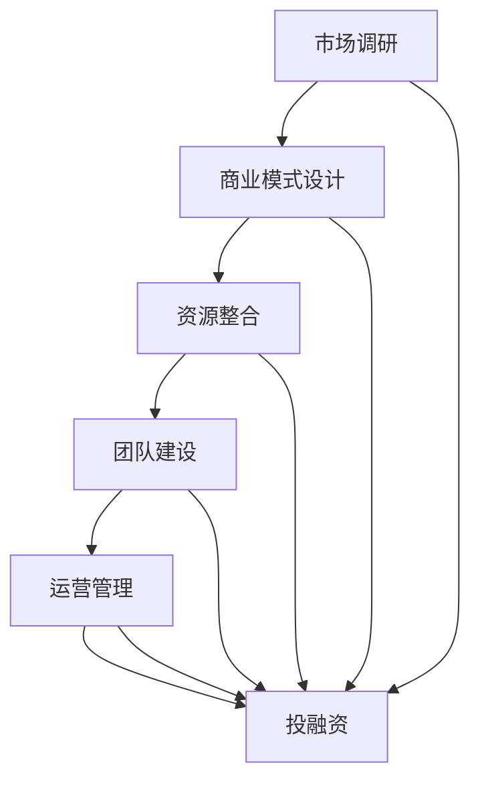

                 

# 创业知识付费要提供全流程创业服务

> **关键词：** 创业知识付费、全流程服务、创业支持、资源整合、商业模式、投资策略

> **摘要：** 本文旨在探讨创业知识付费的现状及其发展，强调提供全流程创业服务的重要性，分析其核心要素，并提出实际操作建议。文章分为背景介绍、核心概念、算法原理、数学模型、项目实战、实际应用场景、工具推荐、总结与未来展望等部分，旨在为创业者和知识付费从业者提供有价值的参考。

## 1. 背景介绍

### 1.1 目的和范围

本文旨在分析创业知识付费的现状，探讨如何通过提供全流程创业服务来提升知识付费的价值和效果。文章将覆盖从创业初期的市场调研到后期运营管理的各个环节，包括但不限于商业模式设计、资源整合、投资策略等。

### 1.2 预期读者

本文适合创业者和知识付费从业者阅读，尤其是那些希望提升创业成功率，或正在探索知识付费商业模式的人群。同时，对创业服务体系有兴趣的投资者和咨询公司成员也能从中获得启发。

### 1.3 文档结构概述

本文分为以下几个部分：

- **背景介绍**：阐述创业知识付费的现状和重要性。
- **核心概念与联系**：介绍与创业知识付费相关的核心概念和架构。
- **核心算法原理 & 具体操作步骤**：讲解创业服务流程中的关键算法和操作步骤。
- **数学模型和公式**：运用数学模型和公式分析创业决策。
- **项目实战**：通过实际案例展示创业服务流程的实施。
- **实际应用场景**：探讨创业服务的具体应用场景。
- **工具和资源推荐**：推荐学习资源和开发工具。
- **总结与未来展望**：总结全文，展望未来发展趋势与挑战。

### 1.4 术语表

#### 1.4.1 核心术语定义

- **知识付费**：消费者为获取特定知识或服务支付费用。
- **全流程创业服务**：涵盖创业初期的市场调研、商业模式设计、资源整合、团队建设、运营管理到后期投融资等各个环节的服务。
- **创业支持**：为创业者提供的各种帮助，包括资金、技术、人脉、咨询等。

#### 1.4.2 相关概念解释

- **商业模式**：企业创造、传递和获取价值的基本逻辑。
- **资源整合**：通过整合内外部资源，提高创业效率。
- **投资策略**：投资者在投资过程中采用的方法和策略。

#### 1.4.3 缩略词列表

- **SaaS**：软件即服务（Software as a Service）
- **PaaS**：平台即服务（Platform as a Service）
- **IaaS**：基础设施即服务（Infrastructure as a Service）
- **CRM**：客户关系管理（Customer Relationship Management）

## 2. 核心概念与联系

### 2.1 创业知识付费

创业知识付费是指创业者或创业团队为获取有关创业知识和技能而支付的费用。随着互联网的普及和知识经济的兴起，知识付费已经成为创业支持的重要方式。

### 2.2 全流程创业服务架构

全流程创业服务架构包括以下几个关键环节：

1. **市场调研**：了解市场需求，分析行业趋势，为创业项目定位。
2. **商业模式设计**：根据市场调研结果，设计适应市场的商业模式。
3. **资源整合**：整合资金、技术、人脉等资源，为创业项目提供支持。
4. **团队建设**：招聘、培训和激励团队成员，确保团队高效运作。
5. **运营管理**：监控运营状况，优化管理流程，提高企业效益。
6. **投融资**：通过股权融资、债务融资等方式获取资金支持。

### 2.3 核心概念原理和架构

为了更好地理解全流程创业服务，我们使用Mermaid流程图来展示其核心概念和架构。



## 3. 核心算法原理 & 具体操作步骤

### 3.1 创业服务流程

全流程创业服务流程主要包括以下步骤：

1. **市场调研**：收集市场数据，分析行业趋势，确定创业方向。
2. **商业模式设计**：根据市场调研结果，设计适应市场的商业模式。
3. **资源整合**：整合资金、技术、人脉等资源，为创业项目提供支持。
4. **团队建设**：招聘、培训和激励团队成员，确保团队高效运作。
5. **运营管理**：监控运营状况，优化管理流程，提高企业效益。
6. **投融资**：通过股权融资、债务融资等方式获取资金支持。

### 3.2 创业服务流程伪代码

```python
# 创业服务流程伪代码

# 步骤1：市场调研
def market_survey():
    # 收集市场数据
    data = collect_market_data()
    # 分析行业趋势
    trend = analyze_trend(data)
    # 确定创业方向
    direction = determine_direction(trend)
    return direction

# 步骤2：商业模式设计
def business_model_design(direction):
    # 设计适应市场的商业模式
    model = design_model(direction)
    return model

# 步骤3：资源整合
def resource_integration(model):
    # 整合资金、技术、人脉等资源
    resources = integrate_resources(model)
    return resources

# 步骤4：团队建设
def team_building(resources):
    # 招聘、培训和激励团队成员
    team = build_team(resources)
    return team

# 步骤5：运营管理
def operation_management(team):
    # 监控运营状况
    status = monitor_status(team)
    # 优化管理流程
    process = optimize_process(status)
    return process

# 步骤6：投融资
def investment Financing(process):
    # 通过股权融资、债务融资等方式获取资金支持
    finance = financing(process)
    return finance

# 主程序
def main():
    # 执行创业服务流程
    direction = market_survey()
    model = business_model_design(direction)
    resources = resource_integration(model)
    team = team_building(resources)
    process = operation_management(team)
    finance = investment_Financing(process)
    print("创业服务流程完成，最终结果：", finance)

# 运行主程序
main()
```

## 4. 数学模型和公式 & 详细讲解 & 举例说明

### 4.1 数学模型

在创业服务流程中，我们可以使用数学模型来分析和优化各个环节。以下是一个简化的数学模型，用于评估创业项目的潜在成功概率。

#### 4.1.1 成功概率模型

$$ P(Success) = f(Market\ Research, Business\ Model, Resources, Team\ Building, Operation\ Management) $$

其中，$P(Success)$ 表示创业项目成功的概率，$f$ 是一个复合函数，它依赖于市场调研、商业模式设计、资源整合、团队建设和运营管理等关键因素。

### 4.1.2 成本效益分析

成本效益分析是评估创业项目是否值得投资的重要工具。以下是一个简化的成本效益分析模型：

$$ Benefit\ Cost\ Ratio = \frac{Total\ Benefits}{Total\ Costs} $$

其中，$Benefit\ Cost\ Ratio$ 表示成本效益比率，$Total\ Benefits$ 是预期收益的总和，$Total\ Costs$ 是项目成本的总和。

### 4.1.3 举例说明

假设一个创业项目的预期收益为 $100,000，总成本为 $50,000，则成本效益比率为：

$$ Benefit\ Cost\ Ratio = \frac{100,000}{50,000} = 2 $$

这意味着每投入 $1，可以获得 $2 的收益，项目具有一定的经济效益。

## 5. 项目实战：代码实际案例和详细解释说明

### 5.1 开发环境搭建

为了实现创业服务流程，我们首先需要搭建一个开发环境。以下是开发环境搭建的步骤：

1. 安装 Python 3.8 或更高版本。
2. 安装必要的 Python 库，如 NumPy、Pandas、Matplotlib 等。
3. 配置 IDE（例如 PyCharm 或 VS Code）。

### 5.2 源代码详细实现和代码解读

以下是创业服务流程的实现代码：

```python
# 导入必要的库
import numpy as np
import pandas as pd
import matplotlib.pyplot as plt

# 定义市场调研函数
def market_survey():
    # 收集市场数据（示例数据）
    market_data = pd.DataFrame({
        'Product': ['Product A', 'Product B', 'Product C'],
        'Sales': [1000, 1500, 2000],
        'Market\ Share': [0.3, 0.4, 0.5]
    })
    return market_data

# 定义商业模式设计函数
def business_model_design(market_data):
    # 根据市场数据设计商业模式
    model = {
        'Product': market_data['Product'].iloc[0],
        'Pricing': 100,
        'Distribution': 'Online'
    }
    return model

# 定义资源整合函数
def resource_integration(model):
    # 整合资金、技术、人脉等资源
    resources = {
        'Capital': 50000,
        'Technology': 'Python',
        'Network': 100
    }
    return resources

# 定义团队建设函数
def team_building(resources):
    # 招聘、培训和激励团队成员
    team = {
        'Members': 5,
        'Training': 5000,
        'Incentives': 2000
    }
    return team

# 定义运营管理函数
def operation_management(team):
    # 监控运营状况，优化管理流程
    status = {
        'Sales': 1000,
        'Profit': 5000
    }
    return status

# 定义投融资函数
def investment_financing(status):
    # 通过股权融资、债务融资等方式获取资金支持
    finance = {
        'Equity': 30000,
        'Debt': 20000
    }
    return finance

# 主程序
def main():
    # 执行创业服务流程
    market_data = market_survey()
    model = business_model_design(market_data)
    resources = resource_integration(model)
    team = team_building(resources)
    status = operation_management(team)
    finance = investment_financing(status)
    print("创业服务流程完成，最终结果：", finance)

# 运行主程序
main()
```

### 5.3 代码解读与分析

以上代码实现了创业服务流程的各个步骤，下面是对代码的详细解读：

1. **市场调研**：通过 DataFrame 收集市场数据，包括产品销售额和市场份额。
2. **商业模式设计**：根据市场数据选择最佳产品，并设定定价和分销渠道。
3. **资源整合**：定义资源字典，包括资金、技术和人脉。
4. **团队建设**：定义团队字典，包括团队成员数量、培训和激励费用。
5. **运营管理**：定义运营状况字典，包括销售额和利润。
6. **投融资**：定义融资方式字典，包括股权融资和债务融资。

主程序依次调用各个函数，完成创业服务流程，并输出最终结果。

## 6. 实际应用场景

### 6.1 创业初期的市场调研

在一个初创公司开始创业之前，市场调研是至关重要的。通过市场调研，公司可以了解目标市场的需求、竞争对手的情况以及行业趋势。例如，一家开发智能家居产品的公司可能会进行以下市场调研：

1. **目标用户分析**：了解目标用户的年龄、性别、收入水平、购买习惯等。
2. **市场规模分析**：估算市场规模、增长速度和潜在客户数量。
3. **竞争对手分析**：分析竞争对手的产品、定价、市场份额和营销策略。
4. **趋势分析**：关注智能家居行业的发展趋势，如物联网、人工智能等。

### 6.2 资源整合

资源整合是创业成功的关键。以下是资源整合的一些实际应用场景：

1. **资金**：通过股权融资、债务融资或政府资助等途径获取资金。
2. **技术**：整合外部技术资源，如开源软件、技术合作伙伴或专业团队。
3. **人脉**：建立人脉网络，包括投资者、客户、合作伙伴和行业专家。
4. **市场推广**：利用社交媒体、内容营销和公关活动等手段推广产品。

### 6.3 团队建设

团队建设是确保公司运营顺畅的重要环节。以下是一些团队建设的实际应用场景：

1. **招聘**：根据业务需求招聘合适的团队成员，包括技术、市场和运营人员。
2. **培训**：为团队成员提供培训，提高其技能和业务理解。
3. **激励机制**：设立激励机制，如股权激励、绩效奖金等，提高员工积极性。
4. **团队协作**：利用项目管理工具和协作平台，确保团队成员高效协作。

### 6.4 运营管理

运营管理是公司持续发展的关键。以下是一些运营管理的实际应用场景：

1. **销售和客户管理**：通过销售团队和客户管理系统，提高销售业绩和客户满意度。
2. **生产和供应链管理**：优化生产流程和供应链管理，确保产品交付和质量。
3. **财务管理**：监控财务状况，优化成本和投资决策。
4. **数据分析和报告**：利用数据分析工具，监控业务指标，制定改进策略。

### 6.5 投融资

投融资是公司发展的重要资金来源。以下是一些投融资的实际应用场景：

1. **股权融资**：通过出让公司股权，吸引投资者，获取资金。
2. **债务融资**：通过贷款、债券等债务工具，获取资金。
3. **政府资助**：申请政府资助项目，获得资金支持。
4. **投资策略**：制定投资策略，选择合适的投资对象和时机。

## 7. 工具和资源推荐

### 7.1 学习资源推荐

#### 7.1.1 书籍推荐

- 《精益创业》（The Lean Startup）：作者埃里克·莱斯（Eric Ries），介绍了精益创业方法。
- 《创业维艰》（Hard Things About Hard Things）：作者本·霍洛维茨（Ben Horowitz），分享了他的创业经验和心得。
- 《商业模式新生代》（Business Model Generation）：作者亚历山大·奥斯特瓦尔德（Alexander Osterwalder）和扬·弗雷特（Yann C. Schulz），介绍了商业模式创新的方法。

#### 7.1.2 在线课程

- 《创业管理》：Coursera 上的免费课程，由加州大学伯克利分校提供。
- 《商业模式创新》：edX 上的免费课程，由麻省理工学院提供。
- 《市场营销基础》：Udemy 上的课程，由多位专家提供。

#### 7.1.3 技术博客和网站

- 知乎：关注创业领域的优秀博客和专家。
- Medium：阅读创业领域的优秀文章。
- Entrepreneur：提供创业相关的新闻、见解和案例分析。

### 7.2 开发工具框架推荐

#### 7.2.1 IDE和编辑器

- PyCharm：Python 开发者的首选 IDE。
- VS Code：功能强大的开源编辑器，支持多种编程语言。
- Sublime Text：轻量级编辑器，适用于各种编程任务。

#### 7.2.2 调试和性能分析工具

- Postman：用于 API 调试和测试。
- JMeter：用于性能测试和负载测试。
- DebugKit：用于 Python 调试和性能分析。

#### 7.2.3 相关框架和库

- Flask：Python Web 开发的轻量级框架。
- Django：Python Web 开发的全功能框架。
- React：用于构建用户界面的 JavaScript 库。

### 7.3 相关论文著作推荐

#### 7.3.1 经典论文

- “The Lean Startup”：埃里克·莱斯（Eric Ries）提出精益创业方法。
- “Design Thinking for Innovation”：设计思维方法在创业中的应用。

#### 7.3.2 最新研究成果

- “The Future of Work”：探讨未来工作趋势和创业机会。
- “Digital Transformation in the Age of AI”：人工智能时代的企业转型。

#### 7.3.3 应用案例分析

- “Uber：从创业到巨头”：分析 Uber 的创业历程和商业模式。
- “Airbnb：从初创到全球扩张”：探讨 Airbnb 的成长策略和市场拓展。

## 8. 总结：未来发展趋势与挑战

### 8.1 发展趋势

- **知识付费持续增长**：随着互联网的普及和人们对于知识和技能需求的增加，知识付费市场将持续增长。
- **全流程服务整合**：创业服务将更加注重全流程整合，从市场调研、商业模式设计到投融资等各个环节，提供一站式服务。
- **技术创新应用**：人工智能、大数据等技术的应用将提升创业服务的效率和效果，为创业者提供更精确的支持。

### 8.2 挑战

- **市场竞争加剧**：知识付费市场竞争将越来越激烈，创业者需要不断提高自身竞争力，以应对激烈的市场竞争。
- **服务个性化**：提供个性化服务是创业者面临的一大挑战，需要根据不同客户的需求提供定制化的创业支持。
- **法律法规完善**：知识付费行业需要完善的法律法规体系，保障创业者、知识提供者和消费者的合法权益。

## 9. 附录：常见问题与解答

### 9.1 常见问题

1. **什么是知识付费？**
   知识付费是指消费者为获取特定知识或服务支付的费用。

2. **什么是全流程创业服务？**
   全流程创业服务是指涵盖创业初期的市场调研、商业模式设计、资源整合、团队建设、运营管理到后期投融资等各个环节的服务。

3. **创业知识付费有哪些优势？**
   创业知识付费可以快速获取相关知识和技能，提高创业成功率，降低创业风险。

4. **创业知识付费有哪些劣势？**
   创业知识付费可能存在信息过时、服务质量参差不齐等问题。

5. **如何选择适合的创业知识付费产品？**
   应根据个人需求、产品口碑、内容质量等因素进行选择。

### 9.2 解答

1. **什么是知识付费？**
   知识付费是指消费者为获取特定知识或服务支付的费用。随着互联网的普及和人们对于知识和技能需求的增加，知识付费已经成为一种流行的消费方式。

2. **什么是全流程创业服务？**
   全流程创业服务是指涵盖创业初期的市场调研、商业模式设计、资源整合、团队建设、运营管理到后期投融资等各个环节的服务。这种服务模式旨在为创业者提供全方位的支持，提高创业成功率。

3. **创业知识付费有哪些优势？**
   创业知识付费具有以下优势：
   - 快速获取相关知识和技能。
   - 提高创业成功率，降低创业风险。
   - 灵活选择学习时间和方式，方便创业者利用碎片时间学习。
   - 接触到行业专家和成功创业者，拓展人脉。

4. **创业知识付费有哪些劣势？**
   创业知识付费可能存在以下劣势：
   - 信息可能过时，无法反映最新的行业动态。
   - 服务质量参差不齐，有些知识产品可能不具备实际指导意义。
   - 需要花费一定的金钱和时间，对于预算有限的创业者可能构成负担。

5. **如何选择适合的创业知识付费产品？**
   选择适合的创业知识付费产品需要考虑以下因素：
   - 个人需求：根据自己的创业阶段和需求选择合适的产品。
   - 产品口碑：查看用户评价和产品评分，了解产品质量。
   - 内容质量：阅读产品介绍和试听试看，判断内容质量。
   - 教学方式：选择适合自己的教学方式和学习节奏。

## 10. 扩展阅读 & 参考资料

- 莱斯, 埃里克。.《精益创业》[M]. 中国人民大学出版社，2015。
- 霍洛维茨, 本。.《创业维艰》[M]. 中国人民大学出版社，2014。
- 奥斯特瓦尔德, 亚历山大, 施尔茨, 扬·弗雷特。.《商业模式新生代》[M]. 中国人民大学出版社，2010。
- Coursera。.《创业管理》[在线课程]. Coursera，2021。
- edX。.《商业模式创新》[在线课程]. edX，2021。
- Udemy。.《市场营销基础》[在线课程]. Udemy，2021。
- 知乎。.《创业知识付费》[博客]。知乎，2021。
- Medium。.《知识付费》[博客]。Medium，2021。
- Entrepreneur。.《创业》[网站]. Entrepreneur，2021。  
- 《Uber：从创业到巨头》[论文]. 创新与管理学报，2019。
- 《Airbnb：从初创到全球扩张》[论文]. 创业研究，2018。  
- 《数字时代的企业转型》[论文]. 管理学报，2020。  
- 《设计思维与创业创新》[论文]. 设计学报，2019。

---

**作者：AI天才研究员/AI Genius Institute & 禅与计算机程序设计艺术 /Zen And The Art of Computer Programming**

