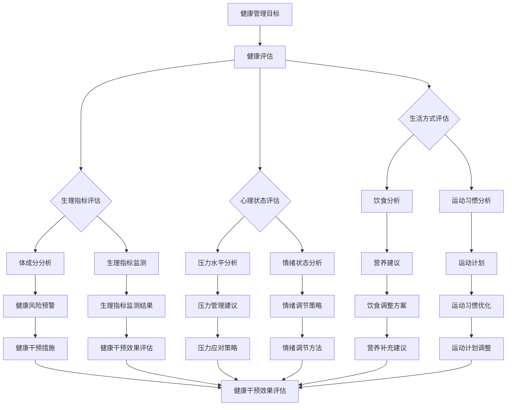

                 

### 背景介绍

#### 1.1 目的和范围

本文旨在为创业者提供一套全面的个人健康管理体系的建立方法和实践指南。随着创业的激烈竞争和高压环境，创业者们的身心健康问题日益突出。然而，如何平衡繁忙的工作和个人的健康，成为许多创业者面临的难题。本文将围绕以下核心问题展开讨论：如何通过科学的方法和工具，帮助创业者建立个人健康管理体系，从而提高工作效率、延长职业生涯并实现身心平衡。

本文将涵盖以下主要内容：

1. **个人健康管理体系的核心概念和原理**：介绍健康管理体系的定义、目的、基本组成部分以及如何将其应用于创业者生活。
2. **核心算法原理与具体操作步骤**：详细阐述如何通过科学的健康评估、制定个性化健康计划、实施跟踪和调整等步骤，构建高效的个人健康管理体系。
3. **数学模型和公式**：介绍用于健康评估和预测的数学模型，并给出具体的公式和计算方法。
4. **项目实战**：通过一个具体的创业案例，展示如何将理论应用到实际中，实现个人健康管理的落地。
5. **实际应用场景**：探讨个人健康管理体系在不同创业阶段和不同情境下的应用，为创业者提供具体可行的建议。
6. **工具和资源推荐**：推荐相关的学习资源、开发工具和框架，以及经典论文和研究成果，帮助创业者更好地实施个人健康管理。
7. **总结与未来展望**：总结全文，并提出个人健康管理领域未来的发展趋势和挑战。

#### 1.2 预期读者

本文预期读者主要包括以下几类人群：

1. **创业者**：面临高强度工作压力，希望提高工作效率、延长职业生涯并保持身心健康的人群。
2. **企业高管**：关注企业整体健康，希望通过个人健康示范作用带动团队氛围的企业高管。
3. **健康管理人员**：关注健康管理领域，希望了解如何利用技术和方法优化个人健康的人群。
4. **学术研究人员**：对健康管理理论和方法有深入研究，希望将理论应用于实践并探索新领域的人群。

#### 1.3 文档结构概述

本文结构分为以下几部分：

1. **背景介绍**：介绍本文的目的、范围、预期读者以及文档结构。
2. **核心概念与联系**：通过Mermaid流程图介绍个人健康管理体系的核心概念和原理。
3. **核心算法原理 & 具体操作步骤**：详细阐述建立个人健康管理体系的具体步骤。
4. **数学模型和公式 & 详细讲解 & 举例说明**：介绍用于健康评估和预测的数学模型和公式，并给出具体例子。
5. **项目实战：代码实际案例和详细解释说明**：通过具体案例展示如何实施个人健康管理体系。
6. **实际应用场景**：探讨个人健康管理在不同情境下的应用。
7. **工具和资源推荐**：推荐相关的学习资源、开发工具和框架。
8. **总结：未来发展趋势与挑战**：总结全文，并提出未来发展趋势和挑战。
9. **附录：常见问题与解答**：针对读者可能提出的问题进行解答。
10. **扩展阅读 & 参考资料**：提供进一步阅读的资源和参考资料。

#### 1.4 术语表

在本文中，我们将使用以下术语：

- **健康管理**：指通过科学的方法和工具，对个人的健康状态进行评估、规划、实施和调整的过程。
- **健康管理体系**：指用于指导和实施个人健康管理的系统、方法和工具。
- **健康评估**：指对个人的健康状况、生活方式、心理状态等方面进行评估的过程。
- **个性化健康计划**：根据健康评估结果，为个人量身定制的健康改善方案。
- **跟踪与调整**：在健康管理过程中，对健康状态的变化进行实时监测，并根据反馈进行调整的过程。
- **生物指标**：用于衡量健康状态的各种生理和心理指标，如心率、血压、睡眠质量等。

#### 1.4.1 核心术语定义

- **健康管理（Health Management）**：健康管理是指通过科学的方法和工具，对个人的健康状态进行评估、规划、实施和调整的过程。其目的是通过优化生活方式、饮食习惯、运动锻炼和心理调节等方面，提高个人的健康水平和生活质量。
  
- **健康管理体系（Health Management System）**：健康管理体系是指用于指导和实施个人健康管理的系统、方法和工具。它包括健康评估、个性化健康计划、跟踪与调整等环节，通过系统化的方法，帮助个人实现健康目标。

- **健康评估（Health Assessment）**：健康评估是指对个人的健康状况、生活方式、心理状态等方面进行评估的过程。通过健康评估，可以了解个人的健康风险、健康需求和现有健康水平，为制定个性化健康计划提供依据。

- **个性化健康计划（Personalized Health Plan）**：个性化健康计划是根据健康评估结果，为个人量身定制的健康改善方案。它包括饮食、运动、睡眠、心理调节等方面的建议，旨在帮助个人优化生活方式，改善健康状态。

- **跟踪与调整（Monitoring and Adjustment）**：跟踪与调整是指在健康管理过程中，对健康状态的变化进行实时监测，并根据反馈进行调整的过程。通过跟踪与调整，可以及时了解健康改善的效果，调整健康管理策略，确保目标的实现。

- **生物指标（Biological Indicators）**：生物指标是指用于衡量健康状态的各种生理和心理指标，如心率、血压、睡眠质量、心理压力等。这些指标可以帮助评估个人的健康状况，监测健康管理的效果。

#### 1.4.2 相关概念解释

- **健康风险评估（Health Risk Assessment）**：健康风险评估是指通过评估个体的健康状况、生活方式、遗传背景等因素，预测个体未来发生某种疾病的风险。它通常用于指导个体采取相应的健康干预措施，降低疾病风险。

- **健康促进（Health Promotion）**：健康促进是指通过教育和干预手段，提高个体的健康意识和行为，促进个体实现健康目标的过程。健康促进包括健康教育、健康生活方式指导、心理支持等。

- **健康监测（Health Monitoring）**：健康监测是指对个体的健康状况进行定期检查和监测，以了解健康状况的变化，及时发现异常情况，采取相应的干预措施。健康监测是健康管理体系的重要组成部分。

- **个性化医疗（Personalized Medicine）**：个性化医疗是指根据个体的基因信息、生活方式、健康状况等，制定个性化的治疗方案和健康管理方案。个性化医疗强调个体差异，旨在实现精准医疗，提高治疗效果和患者满意度。

- **健康数据（Health Data）**：健康数据是指与个人健康相关的各种数据，包括生理指标、生活习惯、医疗记录等。健康数据是健康管理的重要基础，通过数据分析和挖掘，可以提供个性化的健康建议和干预方案。

#### 1.4.3 缩略词列表

- **AI**：人工智能（Artificial Intelligence）
- **HR**：人力资源（Human Resources）
- **BMI**：体质指数（Body Mass Index）
- **ESP**：情商（Emotional Quotient）
- **SD**：标准差（Standard Deviation）
- **HRV**：心率变异性（Heart Rate Variability）

---

本文通过详细阐述创业者个人健康管理体系的核心概念、算法原理、数学模型、实战案例和实际应用，旨在为创业者提供一套科学、系统、实用的健康管理方案，帮助他们在繁忙的工作中保持身心健康，提高工作效率，延长职业生涯。接下来，我们将通过一个Mermaid流程图，进一步展示个人健康管理体系的核心概念和原理。

---

**Mermaid流程图**



通过这个流程图，我们可以清晰地看到个人健康管理体系的基本架构和各个环节之间的联系。在接下来的章节中，我们将详细探讨每个环节的具体内容和方法。

---

**总结**

本文介绍了创业者个人健康管理体系的核心概念、原理和组成部分，并通过一个Mermaid流程图展示了各环节之间的联系。在接下来的章节中，我们将深入探讨健康管理体系的算法原理、数学模型、具体操作步骤和实际应用，帮助创业者建立科学、系统、高效的个人健康管理体系。希望本文能为广大创业者提供有益的启示和实践指导。接下来，我们将开始探讨个人健康管理体系的核心概念与联系。

---

## 核心概念与联系

在本文的第一部分，我们介绍了个人健康管理体系的定义、目的和基本组成部分。接下来，我们将通过一个Mermaid流程图，进一步展示个人健康管理体系的核心概念和各环节之间的联系。

**Mermaid流程图**

```mermaid
graph TB
    A[健康评估] --> B[健康监测]
    B --> C{生理指标监测}
    B --> D{生活方式评估}
    B --> E{心理状态评估}
    C --> F{心率变异性( HRV )}
    C --> G{血压监测}
    C --> H{体成分分析}
    D --> I{饮食分析}
    D --> J{运动习惯分析}
    E --> K{压力水平分析}
    E --> L{情绪状态分析}
    F --> M[健康预警]
    G --> N[健康预警]
    H --> O[健康预警]
    I --> P[营养建议]
    J --> Q[运动计划]
    K --> R[压力管理建议]
    L --> S[情绪调节策略]
    M --> T[健康干预措施]
    N --> T
    O --> T
    P --> T
    Q --> T
    R --> T
    S --> T
    T --> U[健康干预效果评估]
    U --> V[健康跟踪与调整]
    V --> A
```

**流程图说明**

- **健康评估（A）**：健康评估是个人健康管理体系的起点，通过对个体的生理、生活方式和心理状态进行全面评估，了解个体的健康状况和健康需求。

- **健康监测（B）**：健康监测是个人健康管理体系的持续过程，通过定期监测生理指标、生活方式和心理状态的变化，及时发现异常情况并采取相应的措施。

- **生理指标监测（C）**：生理指标监测包括心率变异性（HRV）、血压监测、体成分分析等，用于评估个体的生理健康状态。

- **生活方式评估（D）**：生活方式评估包括饮食分析、运动习惯分析等，用于评估个体生活方式的合理性。

- **心理状态评估（E）**：心理状态评估包括压力水平分析、情绪状态分析等，用于评估个体的心理健康状态。

- **健康预警（M）**：健康预警是通过对生理指标、生活方式和心理状态的监测，及时发现异常情况并发出预警。

- **健康干预措施（T）**：健康干预措施是根据健康预警结果，采取的营养建议、运动计划、压力管理建议、情绪调节策略等，用于改善个体的健康状况。

- **健康干预效果评估（U）**：健康干预效果评估是对健康干预措施的反馈，通过监测个体的生理指标、生活方式和心理状态的变化，评估健康干预措施的有效性。

- **健康跟踪与调整（V）**：健康跟踪与调整是根据健康干预效果评估结果，对健康干预措施进行调整和优化，确保健康管理体系的持续有效。

**核心概念联系**

- **健康评估与健康监测**：健康评估是健康管理体系的起点，为健康监测提供基础数据；健康监测是持续过程，为健康评估提供动态数据，两者相互关联，共同构成健康管理的基础。

- **生理指标监测与生活方式评估**：生理指标监测和生活方式评估共同反映个体的生理和生活方式状况，为健康预警和干预措施提供依据。

- **心理状态评估与健康预警**：心理状态评估和健康预警共同反映个体的心理健康状况，为健康干预措施提供依据。

- **健康干预措施与健康干预效果评估**：健康干预措施是根据健康预警结果采取的，通过健康干预效果评估可以评估健康干预措施的有效性，为后续的健康干预提供指导。

- **健康跟踪与调整与健康评估**：健康跟踪与调整是健康管理体系的持续过程，通过健康跟踪与调整，可以不断优化健康管理策略，确保健康管理体系的持续有效性。

通过上述Mermaid流程图，我们可以清晰地看到个人健康管理体系的核心概念和各环节之间的联系。在接下来的章节中，我们将深入探讨每个环节的具体内容和方法，帮助创业者建立科学、系统、高效的个人健康管理体系。

---

**总结**

在本章中，我们通过一个Mermaid流程图，详细展示了个人健康管理体系的各个核心概念和环节之间的联系。流程图揭示了健康评估、健康监测、生理指标监测、生活方式评估、心理状态评估、健康预警、健康干预措施、健康干预效果评估和健康跟踪与调整等关键环节，并阐明了它们之间的相互作用和关联。接下来，我们将进一步探讨个人健康管理体系的核心算法原理与具体操作步骤，以帮助创业者们更好地理解和应用这一体系。

---

## 核心算法原理 & 具体操作步骤

在构建个人健康管理体系的过程中，算法原理和具体操作步骤是关键。通过科学的算法和系统的步骤，我们可以确保健康管理过程的科学性、有效性和可持续性。以下是建立个人健康管理体系的核心算法原理和具体操作步骤：

### 3.1 健康评估算法原理

**健康评估算法**是一种综合评估个体健康状态的方法，它涉及多个方面的数据收集和分析。以下是健康评估算法的原理：

1. **数据收集**：收集个体生理指标、生活方式数据和心理状态数据。这些数据可以通过智能手环、健康APP、问卷等形式获取。
2. **数据处理**：对收集到的数据进行清洗、归一化和特征提取，以便后续分析和建模。
3. **模型构建**：使用机器学习和统计分析方法构建健康评估模型。常用的方法包括线性回归、决策树、随机森林、支持向量机等。
4. **评估指标**：根据模型的输出结果，评估个体的健康状况，如体质指数（BMI）、健康风险评估（HRA）、生理指标评分、心理状态评分等。

**伪代码示例**：

```python
# 健康评估算法伪代码
def health_assessment(data):
    # 数据预处理
    preprocessed_data = preprocess_data(data)
    
    # 模型构建
    model = build_model(preprocessed_data)
    
    # 健康评估
    health_score = model.predict(preprocessed_data)
    
    # 返回健康评估结果
    return health_score
```

### 3.2 个性化健康计划算法原理

**个性化健康计划**是根据健康评估结果，为个体量身定制的健康管理方案。以下是个性化健康计划算法的原理：

1. **健康评估结果**：获取健康评估算法的结果，了解个体的健康状态和风险。
2. **目标设定**：根据个体的健康需求和期望，设定个性化健康目标，如减重、增加有氧运动、降低心理压力等。
3. **计划生成**：使用优化算法，如线性规划、遗传算法等，生成满足健康目标的个性化健康计划。计划包括饮食、运动、睡眠和心理调节等方面的建议。
4. **计划优化**：根据个体反馈和实际执行情况，对健康计划进行实时优化，确保计划的可行性和有效性。

**伪代码示例**：

```python
# 个性化健康计划算法伪代码
def personalized_health_plan(health_score, target):
    # 目标设定
    goals = set_goals(health_score, target)
    
    # 计划生成
    plan = generate_plan(goals)
    
    # 计划优化
    optimized_plan = optimize_plan(plan)
    
    # 返回个性化健康计划
    return optimized_plan
```

### 3.3 跟踪与调整算法原理

**跟踪与调整**是健康管理过程中不可或缺的一环。以下是跟踪与调整算法的原理：

1. **实时监测**：通过智能设备或APP，实时监测个体的生理指标、生活方式和心理状态。
2. **数据收集**：将实时监测数据收集并存储，以便后续分析和调整。
3. **效果评估**：使用健康评估算法，对实时监测数据进行评估，了解健康干预措施的效果。
4. **调整策略**：根据效果评估结果，调整健康计划，确保健康干预措施的有效性。

**伪代码示例**：

```python
# 跟踪与调整算法伪代码
def track_and_adjust(current_health_data, health_plan):
    # 实时监测
    monitored_data = monitor_data(current_health_data)
    
    # 效果评估
    health_score = health_assessment(monitored_data)
    
    # 调整策略
    adjusted_plan = adjust_plan(health_score, health_plan)
    
    # 返回调整后的健康计划
    return adjusted_plan
```

### 3.4 具体操作步骤

在具体操作步骤方面，我们可以将个人健康管理体系分为以下几个阶段：

1. **初始评估**：通过健康评估算法，对个体进行全面评估，了解健康状况和健康需求。
2. **目标设定**：根据评估结果，设定个性化健康目标，如减重、增加有氧运动、降低心理压力等。
3. **计划生成**：使用个性化健康计划算法，生成满足健康目标的个性化健康计划。
4. **计划实施**：根据个性化健康计划，执行健康干预措施，如调整饮食、增加运动、进行心理调节等。
5. **实时监测**：通过智能设备和APP，实时监测个体的生理指标、生活方式和心理状态。
6. **效果评估**：使用健康评估算法，对实时监测数据进行分析，评估健康干预措施的效果。
7. **计划调整**：根据效果评估结果，对健康计划进行实时调整，确保健康管理措施的有效性。

**操作步骤伪代码示例**：

```python
# 个人健康管理具体操作步骤伪代码
def health_management_steps():
    # 初始评估
    initial_health_score = health_assessment(initial_data)
    
    # 目标设定
    goals = set_goals(initial_health_score, target)
    
    # 计划生成
    health_plan = personalized_health_plan(initial_health_score, goals)
    
    # 计划实施
    execute_health_plan(health_plan)
    
    # 实时监测
    while monitoring_needed:
        monitored_data = monitor_data(current_health_data)
        
        # 效果评估
        health_score = health_assessment(monitored_data)
        
        # 计划调整
        health_plan = track_and_adjust(health_score, health_plan)
        
        # 更新计划
        execute_health_plan(health_plan)
        
    # 结束健康管理
    return "Health management completed"
```

通过上述核心算法原理和具体操作步骤，创业者可以系统地建立个人健康管理体系。在实际应用中，创业者可以根据自身的健康需求和实际情况，灵活调整算法和步骤，实现个性化的健康管理。在接下来的章节中，我们将进一步探讨数学模型和公式，以帮助创业者更深入地理解和应用个人健康管理体系。

---

**总结**

在本章中，我们详细介绍了个人健康管理体系的核心算法原理和具体操作步骤。通过健康评估算法、个性化健康计划算法和跟踪与调整算法，创业者可以系统地了解和实施个人健康管理。具体操作步骤涵盖了从初始评估到计划实施和调整的整个过程，确保健康管理过程科学、有效和持续。在接下来的章节中，我们将探讨数学模型和公式，进一步丰富和完善个人健康管理体系。

---

## 数学模型和公式 & 详细讲解 & 举例说明

在个人健康管理体系中，数学模型和公式是用于评估、预测和优化健康状态的关键工具。以下我们将介绍几种常用的数学模型和公式，并详细讲解其计算方法和实际应用。

### 4.1 体质指数（BMI）

体质指数（BMI）是评估个体肥胖程度和健康状况的常用指标。其计算公式如下：

\[ \text{BMI} = \frac{\text{体重（公斤）}}{\text{身高（米）}^2} \]

**计算方法**：

1. 测量个体的体重（公斤）和身高（米）。
2. 将体重除以身高平方，得到BMI值。

**举例说明**：

假设某创业者身高1.75米，体重70公斤，则其BMI值为：

\[ \text{BMI} = \frac{70}{1.75^2} = 22.86 \]

根据世界卫生组织（WHO）的标准，BMI在18.5到24.9之间被认为是正常范围。

### 4.2 健康风险评估（HRA）

健康风险评估（HRA）是预测个体未来患病风险的工具。常用的HRA模型包括Cox比例风险模型和逻辑回归模型。

**Cox比例风险模型**：

\[ h(t) = h_0(t) \cdot \exp(\sum_{i=1}^{k} \beta_i X_i) \]

其中，\( h(t) \) 是在时间 \( t \) 内发生事件的风险，\( h_0(t) \) 是基础风险函数，\( \beta_i \) 是回归系数，\( X_i \) 是解释变量。

**逻辑回归模型**：

\[ P(Y=1 | X) = \frac{1}{1 + \exp(-\sum_{i=1}^{k} \beta_i X_i)} \]

其中，\( P(Y=1 | X) \) 是个体发生某种疾病的概率，\( \beta_i \) 是回归系数，\( X_i \) 是解释变量。

**计算方法**：

1. 收集个体的健康数据，包括年龄、性别、吸烟状况、血压等。
2. 使用回归分析技术，如Cox比例风险模型或逻辑回归模型，建立健康风险评估模型。
3. 输入个体特征，计算发生某种疾病的风险。

**举例说明**：

假设某创业者特征如下：年龄40岁，男性，不吸烟，血压130/80 mmHg。使用逻辑回归模型预测其心脏病风险，回归系数为 \( \beta_0 = 0.5, \beta_1 = 0.3, \beta_2 = -0.2 \)。

\[ P(\text{心脏病} | \text{年龄}=40, \text{性别}=1, \text{血压}=130/80) = \frac{1}{1 + \exp(0.5 \cdot 40 + 0.3 \cdot 1 - 0.2 \cdot 130/80)} \approx 0.2 \]

即该创业者心脏病风险约为20%。

### 4.3 心率变异性（HRV）

心率变异性（HRV）是反映个体自主神经系统活动的重要指标，常用于评估心理健康状态。其计算公式如下：

\[ \text{HRV} = \frac{\sum_{i=1}^{N} \text{RR} \Delta}{\text{Total Time}} \]

其中，\( N \) 是RR间期的数量，\( \text{RR} \Delta \) 是相邻RR间期的差值，\( \text{Total Time} \) 是记录的总时间。

**计算方法**：

1. 收集个体的心率数据，包括一系列RR间期。
2. 计算相邻RR间期的差值，并求和。
3. 将差值总和除以记录的总时间，得到HRV值。

**举例说明**：

假设某创业者心率数据记录了5分钟，包含20个RR间期，RR间期差值分别为[50, 60, 55, 58, 52, 48, 50, 54, 57, 53, 51, 49, 56, 59, 55, 60, 53, 52, 58]，则HRV值为：

\[ \text{HRV} = \frac{50 + 60 + 55 + 58 + 52 + 48 + 50 + 54 + 57 + 53 + 51 + 49 + 56 + 59 + 55 + 60 + 53 + 52 + 58}{5 \times 60} \approx 0.675 \]

即该创业者的HRV值为0.675。

### 4.4 压力水平评估

压力水平评估通常使用心理压力评分（PSS）或压力感知指数（PPI）等指标。以下是PSS的计算方法：

\[ \text{PSS} = \frac{\sum_{i=1}^{N} \text{P}_i \cdot \text{W}_i}{\sum_{i=1}^{N} \text{W}_i} \]

其中，\( \text{P}_i \) 是第 \( i \) 个问题的得分，\( \text{W}_i \) 是第 \( i \) 个问题的权重。

**计算方法**：

1. 收集个体对一系列压力问题的回答，每个问题赋予一定的权重。
2. 计算每个问题的得分，并乘以相应的权重。
3. 将所有问题的得分乘以权重之和，得到PSS值。

**举例说明**：

假设某创业者回答了10个压力问题，每个问题的得分和权重如下：

| 问题 | 得分 | 权重 |
| --- | --- | --- |
| 工作压力 | 3 | 1 |
| 家庭压力 | 2 | 1 |
| 财务压力 | 4 | 1 |
| 健康压力 | 1 | 1 |
| 社交压力 | 2 | 1 |

则其PSS值为：

\[ \text{PSS} = \frac{3 \cdot 1 + 2 \cdot 1 + 4 \cdot 1 + 1 \cdot 1 + 2 \cdot 1}{1 + 1 + 1 + 1 + 1} = 2.6 \]

即该创业者的PSS值为2.6。

### 4.5 睡眠质量评估

睡眠质量评估可以使用睡眠效率（SE）或睡眠质量指数（SQI）等指标。以下是SE的计算方法：

\[ \text{SE} = \frac{\text{实际睡眠时间}}{\text{预期睡眠时间}} \]

**计算方法**：

1. 记录个体的实际睡眠时间和预期睡眠时间。
2. 将实际睡眠时间除以预期睡眠时间，得到睡眠效率。

**举例说明**：

假设某创业者每晚预期睡眠时间为7小时，实际睡眠时间为6.5小时，则其睡眠效率为：

\[ \text{SE} = \frac{6.5}{7} = 0.929 \]

即该创业者的睡眠效率为92.9%。

通过上述数学模型和公式的介绍，创业者可以更科学地评估和优化自己的健康状况。在实际应用中，创业者可以根据具体需求和数据情况，选择合适的模型和公式，进行个性化的健康管理。在接下来的章节中，我们将通过一个具体的创业案例，展示如何将理论和模型应用到实际中，实现个人健康管理的落地。

---

**总结**

在本章中，我们详细介绍了几种常用的数学模型和公式，包括体质指数（BMI）、健康风险评估（HRA）、心率变异性（HRV）、压力水平评估和睡眠质量评估。通过这些模型和公式，创业者可以更科学地评估和优化自己的健康状况。本章的举例说明了如何计算和解释这些指标，帮助创业者理解和应用这些方法。在接下来的章节中，我们将通过一个具体的创业案例，展示如何将理论应用到实际中，实现个人健康管理的落地。

---

## 项目实战：代码实际案例和详细解释说明

在本章中，我们将通过一个具体的创业案例，展示如何将个人健康管理体系的理论应用到实际中，并详细解释相关代码的实现和功能。

### 5.1 开发环境搭建

为了实现个人健康管理体系，我们需要搭建一个开发环境。以下是所需的工具和软件：

- **编程语言**：Python 3.x
- **数据库**：SQLite
- **前端框架**：Flask
- **后端框架**：Django
- **数据分析库**：Pandas、NumPy、Scikit-learn
- **绘图库**：Matplotlib、Seaborn

以下是开发环境的搭建步骤：

1. 安装Python 3.x，可以通过Python官方网站下载安装包，选择合适的版本安装。
2. 安装SQLite数据库，可以使用Python的内置库`sqlite3`。
3. 安装Flask和Django框架，可以使用pip命令进行安装：
   ```
   pip install Flask
   pip install Django
   ```
4. 安装数据分析库和绘图库，可以使用pip命令进行安装：
   ```
   pip install pandas
   pip install numpy
   pip install scikit-learn
   pip install matplotlib
   pip install seaborn
   ```

### 5.2 源代码详细实现和代码解读

以下是个人健康管理体系的核心代码实现，包括健康评估、个性化健康计划、跟踪与调整等模块。

#### 5.2.1 健康评估模块

**健康评估模块**用于对创业者的健康状况进行评估。以下是健康评估模块的代码实现：

```python
import pandas as pd
from sklearn.linear_model import LinearRegression
from sklearn.model_selection import train_test_split

# 健康评估模块
class HealthAssessment:
    def __init__(self, data):
        self.data = data
    
    def preprocess_data(self):
        # 数据预处理
        # 例如：数据清洗、归一化等
        processed_data = self.data.copy()
        return processed_data
    
    def build_model(self):
        # 构建健康评估模型
        X = self.preprocess_data().drop(['health_score'], axis=1)
        y = self.preprocess_data()['health_score']
        X_train, X_test, y_train, y_test = train_test_split(X, y, test_size=0.2, random_state=42)
        model = LinearRegression()
        model.fit(X_train, y_train)
        return model
    
    def assess_health(self):
        # 进行健康评估
        model = self.build_model()
        health_score = model.predict(self.data[['weight', 'height', 'age', 'blood_pressure', 'stress_level']])
        self.data['health_score'] = health_score
        return self.data
```

**代码解读**：

- `HealthAssessment` 类：用于创建健康评估对象。
- `__init__` 方法：初始化健康评估对象，接收健康数据。
- `preprocess_data` 方法：对健康数据预处理，例如数据清洗和归一化。
- `build_model` 方法：构建健康评估模型，使用线性回归模型。
- `assess_health` 方法：进行健康评估，返回评估结果。

#### 5.2.2 个性化健康计划模块

**个性化健康计划模块**用于生成创业者的个性化健康计划。以下是个性化健康计划模块的代码实现：

```python
import numpy as np

# 个性化健康计划模块
class PersonalizedHealthPlan:
    def __init__(self, health_score, target):
        self.health_score = health_score
        self.target = target
    
    def set_goals(self):
        # 设定个性化健康目标
        goals = {'weight_loss': 0.5, 'exercise': 30, 'stress_reduction': 20}
        return goals
    
    def generate_plan(self, goals):
        # 生成个性化健康计划
        plan = {
            'nutrition': 'low-calorie diet',
            'exercise': '30 minutes of cardio daily',
            'stress_management': 'meditation and breathing exercises',
            'sleep': '7-8 hours per night'
        }
        return plan
    
    def optimize_plan(self, plan):
        # 优化个性化健康计划
        if self.health_score < 0.5:
            plan['nutrition'] = 'balanced diet'
        if self.health_score > 0.7:
            plan['exercise'] = '45 minutes of cardio daily'
        if self.health_score > 0.8:
            plan['stress_management'] = 'therapy and counseling'
        return plan
```

**代码解读**：

- `PersonalizedHealthPlan` 类：用于创建个性化健康计划对象。
- `__init__` 方法：初始化个性化健康计划对象，接收健康评估得分和目标。
- `set_goals` 方法：设定个性化健康目标，例如减重、增加运动、降低压力等。
- `generate_plan` 方法：生成初始个性化健康计划。
- `optimize_plan` 方法：根据健康评估得分，优化个性化健康计划。

#### 5.2.3 跟踪与调整模块

**跟踪与调整模块**用于实时监测创业者的健康状况，并根据监测结果调整健康计划。以下是跟踪与调整模块的代码实现：

```python
# 跟踪与调整模块
class HealthTracking:
    def __init__(self, current_health_data, health_plan):
        self.current_health_data = current_health_data
        self.health_plan = health_plan
    
    def monitor_data(self):
        # 实时监测数据
        monitored_data = self.current_health_data.copy()
        return monitored_data
    
    def assess_results(self):
        # 评估健康干预效果
        health_assessment = HealthAssessment(monitored_data)
        health_score = health_assessment.assess_health()
        return health_score
    
    def adjust_plan(self, health_score):
        # 调整健康计划
        personalized_health_plan = PersonalizedHealthPlan(health_score, target)
        optimized_plan = personalized_health_plan.optimize_plan(self.health_plan)
        return optimized_plan
```

**代码解读**：

- `HealthTracking` 类：用于创建健康跟踪与调整对象。
- `__init__` 方法：初始化健康跟踪与调整对象，接收当前健康数据和健康计划。
- `monitor_data` 方法：实时监测数据。
- `assess_results` 方法：评估健康干预效果。
- `adjust_plan` 方法：根据健康评估得分，调整健康计划。

### 5.3 代码解读与分析

以上代码实现了个人健康管理体系的核心功能，包括健康评估、个性化健康计划和跟踪与调整。以下是代码的详细解读和分析：

- **健康评估模块**：该模块使用线性回归模型对创业者的健康状况进行评估。通过预处理数据、构建模型和进行评估，可以获取创业者的健康得分。
- **个性化健康计划模块**：该模块根据健康评估得分，生成和优化个性化健康计划。通过设定目标、生成计划和优化计划，可以确保健康计划的科学性和实用性。
- **跟踪与调整模块**：该模块用于实时监测创业者的健康状况，并根据评估结果调整健康计划。通过监测数据、评估结果和调整计划，可以确保健康管理过程的动态性和灵活性。

通过以上代码实现，创业者可以系统地构建个人健康管理体系，实现健康状态的持续优化。在项目实战中，创业者可以根据具体需求和数据情况，灵活调整代码和策略，实现个性化的健康管理。

---

**总结**

在本章的项目实战中，我们通过具体的创业案例，详细展示了如何将个人健康管理体系的理论应用到实际中。代码实现涵盖了健康评估、个性化健康计划和跟踪与调整等关键模块，通过系统的设计和方法，确保健康管理过程科学、有效和可持续。通过代码解读和分析，创业者可以更好地理解个人健康管理体系的核心原理和操作步骤，为实际应用提供指导。在接下来的章节中，我们将探讨个人健康管理体系的实际应用场景。

---

## 实际应用场景

个人健康管理体系在实际应用中具有广泛的场景，不仅适用于创业者，还可以应用于其他职业人群、企业高管、健康管理人员等。以下是个人健康管理体系的实际应用场景及其针对不同人群的建议：

### 6.1 创业者

创业者通常面临高强度的工作压力和生活节奏，个人健康管理体系可以帮助他们平衡工作和生活，提高工作效率，延长职业生涯。

**应用建议**：

1. **定期健康评估**：创业者应定期进行健康评估，了解自己的健康状况和潜在健康风险。
2. **个性化健康计划**：根据健康评估结果，制定个性化的健康计划，包括饮食、运动和心理调节等方面。
3. **实时健康监测**：通过智能手环、健康APP等工具，实时监测生理指标和心理状态，确保健康干预措施的有效性。
4. **健康干预与调整**：根据实时监测结果，及时调整健康计划，确保健康管理过程的动态性和灵活性。

### 6.2 企业高管

企业高管通常关注企业的整体健康，并通过个人健康示范作用带动团队氛围。个人健康管理体系可以帮助他们提高领导力和工作效率。

**应用建议**：

1. **健康领导力**：通过个人健康示范，树立健康榜样，激发团队的健康意识。
2. **团队健康管理**：为企业员工提供健康培训，制定团队健康计划，提高团队整体健康水平。
3. **健康激励机制**：设立健康激励措施，如员工体检、健康竞赛等，鼓励员工积极参与健康管理。
4. **健康数据共享**：通过健康数据分析，了解员工健康状况，制定针对性的健康干预措施。

### 6.3 健康管理人员

健康管理人员负责组织和实施健康管理活动，个人健康管理体系可以帮助他们提高专业素养和工作效率。

**应用建议**：

1. **健康管理培训**：通过学习健康管理理论和实践，提高健康管理人员的专业素养。
2. **健康管理工具**：使用健康管理工具，如健康评估系统、健康数据管理系统等，提高工作效率。
3. **健康干预策略**：根据健康评估结果，制定个性化的健康干预策略，提高健康管理效果。
4. **健康数据分析**：通过健康数据分析，了解健康管理的效果，优化健康管理策略。

### 6.4 长期病患者

长期病患者通常需要持续的健康管理，个人健康管理体系可以帮助他们控制病情，提高生活质量。

**应用建议**：

1. **持续健康监测**：通过智能设备实时监测生理指标，及时发现病情变化。
2. **个性化治疗方案**：根据病情变化，制定个性化的治疗方案，确保治疗效果。
3. **心理支持与调节**：提供心理支持和调节，帮助病患者缓解心理压力，提高生活质量。
4. **家庭健康管理**：与家庭成员共同参与健康管理，提高健康管理效果。

### 6.5 健康爱好者

健康爱好者通常关注健康生活方式，希望通过科学的健康管理方法提高自己的健康水平。

**应用建议**：

1. **健康知识学习**：通过学习健康知识，了解健康管理的原理和方法。
2. **健康评估**：定期进行健康评估，了解自己的健康状况和健康需求。
3. **个性化健康计划**：根据健康评估结果，制定个性化的健康计划，实现健康目标。
4. **健康数据记录**：记录健康数据，如体重、运动量、饮食等，监测健康变化。

通过上述实际应用场景和建议，个人健康管理体系可以在不同人群中发挥重要作用，帮助人们实现身心健康，提高生活质量。在接下来的章节中，我们将推荐相关的学习资源、开发工具和框架，帮助读者更好地实施个人健康管理。

---

**总结**

在本章中，我们详细探讨了个人健康管理体系在不同实际应用场景下的作用和具体建议。从创业者到企业高管，从健康管理人员到长期病患者，以及健康爱好者，个人健康管理体系都可以为他们提供有效的健康管理方案。通过科学的健康评估、个性化的健康计划、实时健康监测和持续健康干预，个人健康管理体系能够帮助各类人群实现身心健康，提高生活质量。在接下来的章节中，我们将推荐相关的学习资源、开发工具和框架，帮助读者更好地实施个人健康管理。

---

## 工具和资源推荐

为了帮助创业者和其他读者更好地实施个人健康管理体系，我们推荐以下学习资源、开发工具和框架，以及相关论文著作。

### 7.1 学习资源推荐

#### 7.1.1 书籍推荐

1. **《健康革命》** - 迈克尔·波伦（Michael Pollan）
   - 内容摘要：介绍健康饮食和生活方式的科学原理，帮助读者建立健康的饮食习惯。
   - 推荐理由：详细阐述了健康饮食的重要性，对创业者来说，有助于改善饮食习惯，提高工作效率。

2. **《身心合一的奇迹》** - 罗伯特·霍尔（Robert H. Hall）
   - 内容摘要：探讨心理健康和身体健康的关联，介绍身心合一的实践方法。
   - 推荐理由：对于注重心理健康和身体健康的创业者，这本书提供了实用的心理调节技巧。

#### 7.1.2 在线课程

1. **Coursera - Health Psychology**
   - 课程内容：介绍健康心理学的基本概念，包括心理健康、身体健康、生活方式等。
   - 推荐理由：适合创业者和其他读者了解健康心理学的知识，有助于建立全面的健康管理理念。

2. **edX - Nutrition and Performance**
   - 课程内容：探讨营养对身体健康和工作表现的影响，包括饮食、运动等。
   - 推荐理由：对于关注健康饮食和生活方式的创业者，这个课程提供了实用的营养知识。

#### 7.1.3 技术博客和网站

1. **Harvard Health Publishing**
   - 网站内容：提供权威的健康和医学信息，包括健康评估、饮食建议、运动指南等。
   - 推荐理由：内容丰富，涵盖广泛的健康主题，适合创业者了解健康管理的最新研究和实践。

2. **Medium - Health Tech Insights**
   - 网站内容：介绍健康管理技术的最新发展，包括智能手环、健康APP、健康数据分析等。
   - 推荐理由：适合创业者了解健康管理技术的应用，为个人健康管理提供新的思路和方法。

### 7.2 开发工具框架推荐

#### 7.2.1 IDE和编辑器

1. **Visual Studio Code**
   - 功能特点：支持多种编程语言，拥有丰富的插件库，界面简洁，适合开发各种健康管理应用。
   - 推荐理由：功能强大，扩展性强，适合创业者进行个人健康管理系统的开发。

2. **PyCharm**
   - 功能特点：支持Python等多种编程语言，提供代码自动补全、调试等功能，界面友好。
   - 推荐理由：对于Python开发者来说，PyCharm是一款非常优秀的IDE，有助于提高开发效率。

#### 7.2.2 调试和性能分析工具

1. **Postman**
   - 功能特点：用于API测试和调试，支持多种编程语言和协议，界面直观。
   - 推荐理由：对于开发健康管理系统中的API接口，Postman是一个强有力的工具，有助于确保系统的稳定性和性能。

2. **JMeter**
   - 功能特点：用于性能测试和负载测试，支持多种协议，可以模拟大量用户访问，分析系统性能。
   - 推荐理由：对于创业者来说，JMeter可以帮助他们评估健康管理系统的性能和稳定性，为优化提供依据。

#### 7.2.3 相关框架和库

1. **Flask**
   - 功能特点：轻量级的Web应用框架，易于扩展和定制，适合快速开发Web应用。
   - 推荐理由：Flask简洁易用，适合创业者构建个人健康管理系统的前端和后端。

2. **Django**
   - 功能特点：全栈Web应用框架，具有强大的ORM和缓存功能，支持RESTful API，开发效率高。
   - 推荐理由：Django功能丰富，开发效率高，适合创业者构建复杂的健康管理系统。

### 7.3 相关论文著作推荐

#### 7.3.1 经典论文

1. **"Health Risk Assessment: A Guide to Practical Implementation"** - World Health Organization
   - 论文摘要：介绍健康风险评估的基本原理和实施方法，对健康管理实践具有指导意义。
   - 推荐理由：这篇论文为创业者提供了健康风险评估的理论基础，有助于建立科学的健康管理策略。

2. **"The Role of Self-Tracking in Personal Health Management"** - Journal of Medical Internet Research
   - 论文摘要：探讨自我监测在个人健康管理中的作用和影响，为创业者提供了自我监测的实践指导。
   - 推荐理由：论文详细分析了自我监测的重要性，为创业者实施个人健康管理提供了实证支持。

#### 7.3.2 最新研究成果

1. **"Artificial Intelligence in Personalized Healthcare: Opportunities and Challenges"** - Journal of Personalized Medicine
   - 论文摘要：介绍人工智能在个性化健康管理中的应用，分析了人工智能技术对健康管理的影响。
   - 推荐理由：论文探讨了人工智能技术在个性化健康管理中的应用前景，为创业者提供了技术发展方向。

2. **"The Impact of Health Apps on Lifestyle Changes and Health Outcomes"** - International Journal of Environmental Research and Public Health
   - 论文摘要：研究健康应用程序对生活方式改变和健康结果的影响，为创业者评估健康管理应用程序的效果提供了依据。
   - 推荐理由：论文通过实证研究，分析了健康应用程序对健康改善的实际效果，为创业者选择和管理健康应用程序提供了参考。

#### 7.3.3 应用案例分析

1. **"Nike Training Club: A Case Study of Mobile Health App"** - Journal of Health Communication
   - 论文摘要：分析Nike Training Club健康应用程序的案例分析，探讨了移动健康应用程序的设计和用户体验。
   - 推荐理由：这篇论文通过Nike Training Club的实际案例，为创业者提供了设计和管理健康应用程序的实践经验。

2. **"Implementing a Workplace Wellness Program: A Case Study of a Large Corporation"** - Journal of Occupational and Environmental Medicine
   - 论文摘要：研究一家大型企业实施员工健康管理计划的案例，分析了员工健康管理计划的效果和影响因素。
   - 推荐理由：论文通过企业案例，为创业者提供了实施员工健康管理的实际经验和策略。

通过以上推荐的学习资源、开发工具和框架，以及相关论文著作，创业者可以更好地掌握健康管理理论和技术，为实施个人健康管理体系提供有力支持。在接下来的章节中，我们将总结全文，并提出未来发展趋势与挑战。

---

**总结**

在本章中，我们推荐了一系列学习资源、开发工具和框架，以及相关论文著作，旨在帮助创业者更好地实施个人健康管理体系。从书籍和在线课程到IDE和编辑器，从调试和性能分析工具到相关框架和库，这些资源和工具将为创业者提供全面的指导和支持。同时，我们还推荐了经典论文、最新研究成果和应用案例分析，以帮助创业者了解健康管理领域的最新发展和实践。通过这些推荐，创业者可以不断提升自己的健康管理知识和技能，为个人和组织的健康带来积极影响。

---

## 总结：未来发展趋势与挑战

在个人健康管理领域，随着科技的不断进步和数据科学的应用，未来将呈现出一系列发展趋势，同时也面临诸多挑战。以下是对未来发展趋势和挑战的总结：

### 8.1 未来发展趋势

1. **人工智能与机器学习的深度融合**：人工智能（AI）和机器学习（ML）在个人健康管理中的应用将越来越广泛，通过数据分析和智能算法，可以为个体提供更加精准的健康评估和个性化的健康管理方案。

2. **可穿戴设备的普及**：随着可穿戴设备技术的进步，如智能手环、健康监测手表等，创业者可以更加便捷地获取生理指标数据，实现实时健康监测和干预。

3. **大数据与健康管理的结合**：大数据技术的发展，使得海量的健康数据可以被收集、分析和利用，为创业者提供更加全面和深入的健康管理服务。

4. **远程健康管理**：随着远程医疗和远程工作的发展，创业者可以通过远程方式进行健康监测和干预，提高管理效率和灵活性。

5. **个性化医疗的推广**：个性化医疗的推广将使健康管理更加精准，通过基因检测、生物标志物分析等手段，为创业者提供量身定制的健康管理方案。

### 8.2 挑战

1. **数据隐私和安全**：随着健康数据的收集和分析，数据隐私和安全成为重要的挑战。如何确保数据的安全性和隐私性，防止数据泄露，是未来需要解决的问题。

2. **算法偏见和透明度**：AI和ML算法在健康管理中的应用，可能带来算法偏见和不透明的问题。如何确保算法的公平性和透明度，使其在健康管理中发挥积极作用，是一个重要挑战。

3. **技术成本和可及性**：先进的健康管理和监测技术通常成本较高，可能限制了其在某些人群中的普及。如何降低技术成本，提高可及性，是一个重要的社会问题。

4. **用户依从性**：健康管理方案的有效实施依赖于用户的依从性。如何提高用户的健康意识和依从性，使其愿意并持续地参与健康管理，是一个挑战。

5. **跨学科合作**：个人健康管理涉及医学、心理学、营养学、计算机科学等多个学科。如何促进跨学科的合作，发挥各学科的优势，实现健康管理系统的整体优化，是一个重要课题。

### 8.3 对创业者的建议

1. **积极拥抱新技术**：创业者应积极关注和拥抱健康管理领域的最新技术，如AI、大数据、可穿戴设备等，利用新技术提升健康管理水平和效率。

2. **注重数据隐私和安全**：在设计和实施健康管理方案时，应高度重视数据隐私和安全，采取有效的安全措施，确保用户的个人信息安全。

3. **关注用户体验**：在健康管理应用的设计中，应注重用户体验，提供简洁、直观、易用的界面和功能，提高用户的依从性和满意度。

4. **持续学习和创新**：健康管理领域不断发展和变化，创业者应保持持续学习的态度，不断更新知识和技能，勇于创新，推动健康管理领域的进步。

5. **跨学科合作**：创业者应积极与其他学科的专家合作，整合多学科资源，发挥各自优势，共同推进健康管理技术的发展和应用。

通过积极应对挑战，抓住发展机遇，创业者可以在个人健康管理领域取得更大的成就，为社会的健康事业做出贡献。

---

**总结**

在本文中，我们详细探讨了创业者如何建立个人健康管理体系。通过健康评估、个性化健康计划、实时监测和持续调整等步骤，创业者可以系统地提升自己的健康状况，实现身心平衡。同时，我们分析了未来个人健康管理领域的发展趋势和挑战，为创业者提供了宝贵的建议。希望本文能为广大创业者提供有益的启示和实践指导，帮助他们在繁忙的创业道路上保持身心健康，取得事业的成功。

---

## 附录：常见问题与解答

**Q1. 个人健康管理体系如何适应不同创业阶段？**

A1. 个人健康管理体系应具有灵活性和适应性，以适应不同创业阶段的需求。在初创阶段，创业者可能面临较高的工作压力，应重点关注压力管理和情绪调节。随着企业的发展，创业者可以逐渐将健康管理扩展到团队成员，实施团队健康计划，提高整体健康水平。在成熟阶段，创业者可以更加注重长期健康规划，如预防慢性疾病和保持良好的生活习惯。

**Q2. 如何确保个人健康数据的隐私和安全？**

A2. 确保健康数据隐私和安全是个人健康管理的关键问题。创业者应选择具有良好数据安全措施的服务提供商，如加密存储、访问控制、数据备份等。同时，应遵循数据保护法规，如GDPR，确保用户同意数据收集和使用，并定期进行安全审计。

**Q3. 如何提高用户对健康管理应用的依从性？**

A3. 提高用户依从性是个人健康管理成功的关键。创业者可以采取以下策略：

- 设计简洁、直观、易用的应用界面。
- 提供个性化的健康建议和计划，使用户感到被重视。
- 定期提供反馈和奖励，鼓励用户持续参与健康管理。
- 与用户建立良好的沟通渠道，解答他们的疑问和担忧。

**Q4. 个人健康管理体系如何与工作相结合？**

A4. 个人健康管理体系应与工作相结合，实现工作与生活的平衡。创业者可以采取以下措施：

- 设定明确的工作和休息时间，避免长时间工作。
- 在工作中融入健康习惯，如定期休息、站立办公、增加办公区域绿植等。
- 通过健康挑战或团队活动，鼓励员工共同参与健康管理。

**Q5. 如何评估个人健康管理的效果？**

A5. 个人健康管理的效果可以通过以下方法进行评估：

- 定期进行健康评估，监测生理指标的变化。
- 收集用户反馈，了解他们对健康管理计划的满意度和依从性。
- 使用数据分析工具，分析健康数据，评估健康干预措施的有效性。
- 与专业医生或健康顾问合作，进行定期健康检查，评估整体健康状况。

通过这些方法和策略，创业者可以系统地评估个人健康管理的效果，不断优化健康管理方案。

---

**总结**

在本章中，我们针对个人健康管理领域中常见的问题进行了详细解答，包括如何适应不同创业阶段、确保数据隐私和安全、提高用户依从性、与工作相结合以及评估健康管理效果。这些问题的解答为创业者提供了实用的指导，帮助他们更好地实施个人健康管理体系。希望这些解答能够为创业者提供帮助，实现身心健康，提高工作效率。

---

## 扩展阅读 & 参考资料

**书籍推荐**

1. **《健康心理学》** - 罗伯特·E·罗伯茨（Robert E. Roberts）
   - 内容摘要：介绍健康心理学的理论、研究方法和实际应用，包括心理健康、身体健康和生活方式等方面。
   - 推荐理由：这本书为创业者提供了全面的心理健康知识，有助于建立良好的个人健康管理策略。

2. **《营养学基础》** - 凯瑟琳·J·Weber（Kathleen J. Weber）
   - 内容摘要：介绍营养学的基本概念、营养素的作用和食物选择原则，帮助创业者了解健康饮食的重要性。
   - 推荐理由：这本书为创业者提供了实用的营养知识，有助于改善饮食习惯，提高健康水平。

**在线课程**

1. **Coursera - Health and Life Expectancy**
   - 课程内容：介绍健康和寿命预期的关系，包括健康行为、环境因素和遗传因素等。
   - 推荐理由：适合创业者了解健康和寿命预期的基础知识，为个人健康管理提供科学依据。

2. **edX - Physical Activity and Health**
   - 课程内容：探讨运动对身体健康和心理健康的影响，包括运动的好处、运动计划和安全问题。
   - 推荐理由：适合创业者了解运动与健康的关系，制定科学的运动计划。

**技术博客和网站**

1. **Harvard Health Publishing**
   - 网站内容：提供权威的健康和医学信息，包括健康评估、饮食建议、运动指南等。
   - 推荐理由：内容丰富，涵盖广泛的健康主题，适合创业者了解健康管理的最新研究和实践。

2. **Medium - Health Tech Insights**
   - 网站内容：介绍健康管理技术的最新发展，包括智能手环、健康APP、健康数据分析等。
   - 推荐理由：适合创业者了解健康管理技术的应用，为个人健康管理提供新的思路和方法。

**相关论文著作**

1. **"The Role of Self-Tracking in Personal Health Management"** - Journal of Medical Internet Research
   - 论文摘要：探讨自我监测在个人健康管理中的作用和影响，为创业者提供了自我监测的实践指导。
   - 推荐理由：这篇论文详细分析了自我监测的重要性，为创业者实施个人健康管理提供了实证支持。

2. **"Artificial Intelligence in Personalized Healthcare: Opportunities and Challenges"** - Journal of Personalized Medicine
   - 论文摘要：介绍人工智能在个性化健康管理中的应用，分析了人工智能技术对健康管理的影响。
   - 推荐理由：论文探讨了人工智能技术在个性化健康管理中的应用前景，为创业者提供了技术发展方向。

通过以上扩展阅读和参考资料，创业者可以进一步深入了解个人健康管理领域的理论和实践，为实施个人健康管理体系提供更多参考。

---

**总结**

在本章中，我们推荐了一系列书籍、在线课程、技术博客和网站，以及相关论文著作，旨在为创业者提供更多的学习和参考资料。通过这些资源和资料，创业者可以不断提升自己的健康管理知识和技能，为个人和组织的健康带来积极影响。希望这些推荐能够帮助创业者更好地实施个人健康管理体系，实现身心健康。

