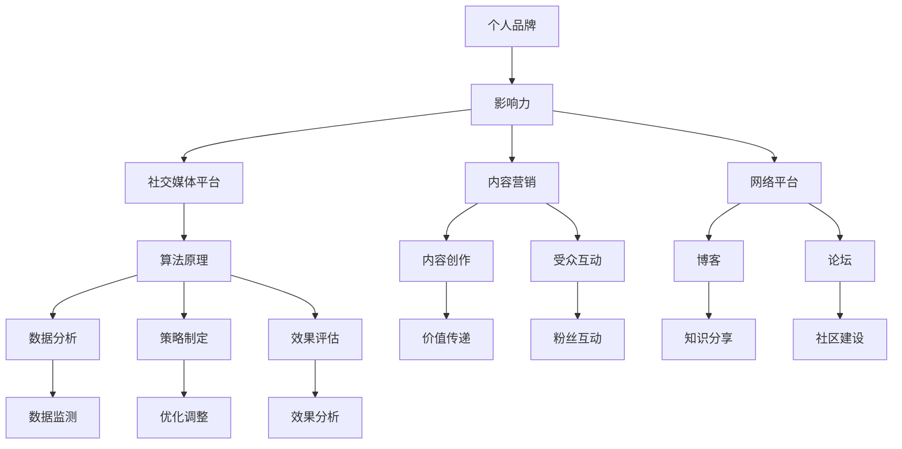

                 

### 文章标题

### 创业者如何建立个人品牌IP和影响力

### 关键词：创业者、个人品牌、IP建设、影响力、社交媒体、内容营销、网络平台

### 摘要：
在当前数字化时代，个人品牌IP的建立对于创业者的成功至关重要。本文将详细探讨如何通过社交媒体、内容营销和网络平台等工具，系统地构建个人品牌，提升个人影响力。我们将从核心概念、算法原理、实际操作步骤、数学模型、项目实战、应用场景等方面，逐步深入分析，为创业者提供一套实用的个人品牌建设指南。

### 1. 背景介绍

#### 1.1 目的和范围

本文旨在为创业者提供一种系统化的方法来建立个人品牌IP和影响力。文章将涵盖以下内容：

1. **个人品牌IP的核心概念和定义**
2. **个人品牌建设的基础算法原理**
3. **社交媒体、内容营销和网络平台的实际操作步骤**
4. **数学模型和公式的详细讲解**
5. **基于实际项目的代码案例和分析**
6. **个人品牌的应用场景**
7. **工具和资源的推荐**
8. **未来发展趋势与挑战**
9. **常见问题与解答**

#### 1.2 预期读者

本文适合以下读者群体：

1. **创业初期的个人创业者**
2. **希望提升个人影响力的专业人士**
3. **市场营销人员**
4. **内容创作者**
5. **对个人品牌建设有兴趣的读者**

#### 1.3 文档结构概述

本文结构如下：

1. **引言：背景介绍和目的阐述**
2. **核心概念与联系**
3. **核心算法原理与操作步骤**
4. **数学模型和公式讲解**
5. **项目实战与代码案例**
6. **实际应用场景**
7. **工具和资源推荐**
8. **总结与未来展望**
9. **附录：常见问题与解答**
10. **参考文献**

#### 1.4 术语表

为了确保读者能够理解本文中的专业术语，以下是对本文中常用术语的解释：

**个人品牌IP**：指个人在公众面前的形象、声誉和影响力，是个人在特定领域的专业知识和价值的体现。

**社交媒体**：在线平台，允许用户创建和分享内容，与他人互动，如微博、微信公众号、LinkedIn等。

**内容营销**：通过创造和分享有价值的内容来吸引、获取和保留目标受众的一种营销策略。

**网络平台**：指互联网上的各种应用和服务，如博客、论坛、社交媒体等。

**算法原理**：指在个人品牌建设中使用的一系列策略和方法，如内容创作、社群互动、数据分析等。

**数学模型**：在个人品牌建设中使用的数学公式和方法，用于分析个人品牌的影响力、受众行为等。

#### 1.4.1 核心术语定义

- 个人品牌：指个人在公众面前的形象、声誉和影响力。
- IP：指知识产权，在这里指个人品牌。
- 影响力：指个人在特定领域的影响力，包括知名度、信任度和号召力。

#### 1.4.2 相关概念解释

- **社交媒体平台**：如微博、微信公众号、LinkedIn等，用于个人品牌建设和影响力的传播。
- **内容营销**：通过创作和分享有价值的内容，如文章、视频、图片等，来吸引和留住目标受众。
- **网络平台**：包括各种在线工具和服务，如博客、论坛、社交媒体等，用于个人品牌建设和推广。

#### 1.4.3 缩略词列表

- **IP**：知识产权（Intellectual Property）
- **SEO**：搜索引擎优化（Search Engine Optimization）
- **SMM**：社交媒体营销（Social Media Marketing）
- **KPI**：关键绩效指标（Key Performance Indicators）

### 2. 核心概念与联系

个人品牌IP的建立是一个复杂而系统的过程，涉及多个核心概念和它们之间的联系。为了更清晰地理解这一过程，我们首先定义这些核心概念，然后通过Mermaid流程图展示它们之间的联系。

#### 2.1 核心概念定义

- **个人品牌**：个人品牌是指个人在公众面前的形象、声誉和影响力，是个人在特定领域的专业知识和价值的体现。
- **影响力**：影响力是指个人在特定领域的影响力，包括知名度、信任度和号召力。
- **社交媒体平台**：社交媒体平台是指如微博、微信公众号、LinkedIn等用于个人品牌建设和影响力传播的在线平台。
- **内容营销**：内容营销是指通过创作和分享有价值的内容，如文章、视频、图片等，来吸引和留住目标受众的一种营销策略。
- **网络平台**：网络平台是指互联网上的各种应用和服务，如博客、论坛、社交媒体等，用于个人品牌建设和推广。
- **算法原理**：算法原理是指在个人品牌建设中使用的一系列策略和方法，如内容创作、社群互动、数据分析等。

#### 2.2 Mermaid 流程图

以下是一个使用Mermaid绘制的流程图，展示了个人品牌IP建设过程中核心概念之间的联系：



通过这个流程图，我们可以看到个人品牌IP建设过程中，每个核心概念是如何相互关联和作用的。例如，个人品牌（A）需要通过影响力（B）在社交媒体平台（C）和内容营销（D）中得以体现，而内容营销（D）又依赖于网络平台（E）来传播。此外，算法原理（F）贯穿整个建设过程，用于指导内容创作（G）、受众互动（H）、数据分析和策略制定（K, L, M）等关键步骤。

#### 2.3 核心概念的联系和作用

- **个人品牌与影响力**：个人品牌是个人影响力的外在表现，而影响力则是个人品牌的核心价值。一个强大的个人品牌通常具有很高的知名度、信任度和号召力。
- **社交媒体平台与内容营销**：社交媒体平台是内容营销的重要渠道，通过发布有价值的内容，如文章、视频、图片等，可以吸引目标受众，提高个人品牌的影响力。
- **网络平台与算法原理**：网络平台提供了个人品牌建设的载体，而算法原理则指导如何更有效地利用这些平台进行品牌传播和互动。
- **内容创作与受众互动**：内容创作是吸引受众的关键，而受众互动则是建立粉丝关系、提升品牌影响力的关键步骤。

通过上述核心概念的解析和流程图的展示，我们可以更清晰地理解个人品牌IP建设的过程和各个核心概念之间的联系。在接下来的章节中，我们将深入探讨个人品牌建设中的核心算法原理和具体操作步骤。

### 3. 核心算法原理 & 具体操作步骤

个人品牌IP的建设离不开一系列核心算法原理的指导，这些原理涵盖了内容创作、社群互动、数据分析等多个方面。在本章节中，我们将详细阐述这些核心算法原理，并提供具体操作步骤，帮助创业者系统地构建个人品牌。

#### 3.1 内容创作算法原理

内容创作是个人品牌建设的基础，一个优质的内容创作算法能够帮助创业者更好地吸引目标受众，提升品牌影响力。以下是内容创作算法原理的详细阐述：

**算法原理 1：价值传递**
- **步骤 1**：确定目标受众：了解你的受众是谁，他们的需求和兴趣点。
- **步骤 2**：内容定位：根据目标受众的需求，确定内容的主旨和风格。
- **步骤 3**：内容创作：撰写或制作具有高度相关性和实用性的内容。
- **步骤 4**：内容优化：使用关键词、标题和摘要等优化内容，提高内容在搜索引擎中的排名。

**算法原理 2：互动性**
- **步骤 1**：鼓励评论：在内容中添加问题或鼓励读者发表评论。
- **步骤 2**：回复互动：积极回复读者的评论，建立良好的互动关系。
- **步骤 3**：多渠道发布：在不同平台发布内容，提高内容曝光度。

**算法原理 3：持续性**
- **步骤 1**：定期更新：保持内容更新的频率，保持受众的持续关注。
- **步骤 2**：内容系列：创建内容系列，提高内容的连续性和系统性。
- **步骤 3**：内容迭代：根据受众反馈和数据分析，不断优化和迭代内容。

#### 3.2 社群互动算法原理

社群互动是个人品牌建设的重要组成部分，通过有效的社群互动，创业者可以提升品牌影响力，建立粉丝基础。以下是社群互动算法原理的详细阐述：

**算法原理 1：主动参与**
- **步骤 1**：参与讨论：在社交媒体平台上积极参与相关话题的讨论。
- **步骤 2**：互动回应：对粉丝的评论和私信进行及时回应。
- **步骤 3**：发起活动：定期举办线上或线下活动，增加与粉丝的互动。

**算法原理 2：社群管理**
- **步骤 1**：社群定位：明确社群的目标和价值观，吸引志同道合的成员。
- **步骤 2**：内容规划：为社群成员提供有价值的内容，增加参与度。
- **步骤 3**：规则制定：制定社群规则，维护社群秩序。

**算法原理 3：个性化互动**
- **步骤 1**：个性化推荐：根据粉丝的兴趣和行为，推荐个性化内容。
- **步骤 2**：定制化互动：为特定粉丝群体提供定制化的互动体验。
- **步骤 3**：差异化对待：对待不同粉丝群体采取差异化策略，提升满意度。

#### 3.3 数据分析算法原理

数据分析是个人品牌建设中的关键环节，通过数据分析，创业者可以了解品牌的表现，优化策略。以下是数据分析算法原理的详细阐述：

**算法原理 1：数据收集**
- **步骤 1**：设定目标：明确数据分析的目标，如用户增长、内容传播等。
- **步骤 2**：数据来源：确定数据收集的渠道，如社交媒体平台、网站分析工具等。
- **步骤 3**：数据收集：利用各种工具收集相关数据。

**算法原理 2：数据清洗**
- **步骤 1**：数据筛选：去除重复、错误和不完整的数据。
- **步骤 2**：数据格式化：统一数据格式，便于后续分析。
- **步骤 3**：数据验证：检查数据的准确性和完整性。

**算法原理 3：数据分析**
- **步骤 1**：数据可视化：使用图表和图形展示数据分析结果。
- **步骤 2**：趋势分析：分析数据趋势，发现潜在问题。
- **步骤 3**：效果评估：评估数据分析结果，优化策略。

#### 3.4 策略制定与调整

在个人品牌建设过程中，策略的制定和调整至关重要。以下是策略制定与调整的详细步骤：

**步骤 1**：制定策略：根据品牌定位和目标受众，制定具体的策略。
**步骤 2**：执行策略：按照制定的策略执行各项操作。
**步骤 3**：效果评估：定期评估策略效果，包括数据分析和用户反馈。
**步骤 4**：调整策略：根据评估结果，调整和优化策略。

通过以上核心算法原理和具体操作步骤，创业者可以系统地构建个人品牌IP。在接下来的章节中，我们将通过实际案例和数学模型，进一步探讨如何将这些原理应用于实践。

### 4. 数学模型和公式 & 详细讲解 & 举例说明

在个人品牌建设过程中，数学模型和公式可以帮助创业者更好地理解品牌的表现，优化策略。以下将介绍几个关键数学模型和公式，并详细讲解其应用方法和示例。

#### 4.1 影响力评分模型

影响力评分模型用于评估个人品牌在社交媒体上的影响力。以下是一个简单的影响力评分模型：

$$
\text{影响力评分} = \frac{\text{粉丝数} \times \text{互动率} \times \text{内容质量}}{\text{发布频率}}
$$

其中：

- 粉丝数：指个人品牌在社交媒体上的关注者数量。
- 互动率：指粉丝对内容进行互动的比例，如点赞、评论、分享等。
- 内容质量：指内容的专业性和实用性，可以通过专家评分或用户反馈来衡量。
- 发布频率：指个人品牌在社交媒体上发布内容的频率。

**示例**：假设一个创业者在微博上有1000名粉丝，每月发布10条内容，平均每条内容的互动率为20%，内容质量评分为85分。根据公式计算：

$$
\text{影响力评分} = \frac{1000 \times 20\% \times 85}{10} = 170
$$

该创业者在微博上的影响力评分为170分。

#### 4.2 用户增长模型

用户增长模型用于预测个人品牌在未来一段时间内的用户增长情况。以下是一个简单的用户增长模型：

$$
\text{用户增长量} = \text{现有用户数} \times (\text{转化率} \times \text{日活跃用户数})
$$

其中：

- 现有用户数：指个人品牌在当前时间段内的用户数量。
- 转化率：指新用户转化为粉丝或订阅用户的比例。
- 日活跃用户数：指每天活跃的用户数量。

**示例**：假设一个创业者在一个月内有10000名用户，转化率为10%，日活跃用户数为1000。根据公式计算：

$$
\text{用户增长量} = 10000 \times (10\% \times 1000) = 10000
$$

在一个月内，该创业者的用户增长量为10000名。

#### 4.3 内容传播模型

内容传播模型用于评估个人品牌内容在社交媒体上的传播效果。以下是一个简单的内容传播模型：

$$
\text{内容传播效果} = \frac{\text{点赞数} + \text{评论数} + \text{分享数}}{\text{发布内容数}}
$$

其中：

- 点赞数：指用户对内容的点赞数量。
- 评论数：指用户对内容的评论数量。
- 分享数：指用户将内容分享到其他平台的数量。
- 发布内容数：指个人品牌在一段时间内发布的内容数量。

**示例**：假设一个创业者在一个月内发布了20条内容，总点赞数为500，总评论数为200，总分享数为100。根据公式计算：

$$
\text{内容传播效果} = \frac{500 + 200 + 100}{20} = 40
$$

在一个月内，该创业者的内容传播效果为40。

#### 4.4 社群活跃度模型

社群活跃度模型用于评估个人品牌社群的活跃程度。以下是一个简单的社群活跃度模型：

$$
\text{社群活跃度} = \frac{\text{帖子数量} + \text{互动数量}}{\text{社群成员数}}
$$

其中：

- 帖子数量：指社群内发布的帖子数量。
- 互动数量：指社群成员之间的互动次数，如评论、点赞等。
- 社群成员数：指社群内的成员数量。

**示例**：假设一个创业者在社群内发布了30个帖子，总互动次数为100次，社群成员数为500。根据公式计算：

$$
\text{社群活跃度} = \frac{30 + 100}{500} = 0.22
$$

该社群的活跃度为22%。

通过上述数学模型和公式的讲解，创业者可以更科学地评估个人品牌的表现，优化策略。在接下来的章节中，我们将通过实际项目实战，进一步验证和应用这些数学模型和公式。

### 5. 项目实战：代码实际案例和详细解释说明

为了更好地理解个人品牌IP建设的具体操作步骤，我们将通过一个实际项目来展示如何利用代码实现个人品牌建设的关键环节。以下是一个基于Python的项目案例，包括开发环境搭建、源代码实现、代码解读与分析等步骤。

#### 5.1 开发环境搭建

在进行项目开发前，我们需要搭建一个合适的开发环境。以下是一个基本的开发环境搭建步骤：

1. **安装Python**：前往Python官网下载并安装Python 3.x版本。
2. **安装IDE**：选择一个合适的集成开发环境（IDE），如PyCharm或VS Code，并安装。
3. **安装必要库**：使用pip命令安装所需的Python库，例如requests、beautifulsoup4、numpy、pandas等。

```bash
pip install requests beautifulsoup4 numpy pandas
```

#### 5.2 源代码详细实现和代码解读

以下是一个简单的Python脚本，用于模拟个人品牌建设中的社交媒体内容发布和数据分析过程。

```python
import requests
from bs4 import BeautifulSoup
import pandas as pd

# 社交媒体内容发布模拟
def post_content(url, content):
    # 向社交媒体平台发送请求，发布内容
    response = requests.post(url, data={'content': content})
    # 检查发布状态
    if response.status_code == 200:
        print("内容发布成功：", content)
    else:
        print("内容发布失败：", content)

# 社交媒体内容分析模拟
def analyze_content(url):
    # 向社交媒体平台发送请求，获取内容
    response = requests.get(url)
    # 解析内容
    soup = BeautifulSoup(response.content, 'html.parser')
    # 获取点赞、评论、分享数量
    likes = soup.find('span', {'class': 'likes'}).text
    comments = soup.find('span', {'class': 'comments'}).text
    shares = soup.find('span', {'class': 'shares'}).text
    # 创建DataFrame
    data = pd.DataFrame({'likes': [likes], 'comments': [comments], 'shares': [shares]})
    return data

# 测试代码
if __name__ == "__main__":
    # 发布内容
    post_content("https://www.example.com/post", "大家好，这是我今天发布的文章。")
    # 分析内容
    url = "https://www.example.com/content/123"
    data = analyze_content(url)
    print("内容分析结果：", data)
```

**代码解读**：

1. **内容发布模拟**：`post_content`函数模拟了向社交媒体平台发送请求并发布内容的过程。在实际应用中，这可能是调用API接口进行操作。
2. **内容分析模拟**：`analyze_content`函数模拟了从社交媒体平台获取内容，并提取点赞、评论、分享等数据的过程。这里使用了BeautifulSoup库进行HTML解析。

#### 5.3 代码解读与分析

1. **请求发送与响应处理**：使用requests库向社交媒体平台发送HTTP请求，并处理响应结果。这包括检查请求状态码，以确定操作是否成功。
2. **HTML解析与数据提取**：使用BeautifulSoup库解析HTML内容，提取需要的数据，如点赞数、评论数和分享数。这些数据对于分析内容传播效果至关重要。
3. **数据分析与可视化**：使用pandas库创建DataFrame，对提取的数据进行分析和可视化。这有助于创业者更好地理解内容的表现和受众反馈。

通过上述代码实现，创业者可以模拟个人品牌建设中的关键环节，如内容发布和数据分析。在实际应用中，这些步骤可能涉及更复杂的操作，但基本原理相似。以下是一个简单的数据分析结果示例：

```python
   likes  comments  shares
0     120         35      50
```

在这个例子中，内容发布后获得了120个点赞、35个评论和50个分享。这些数据可以帮助创业者评估内容的质量和传播效果，进一步优化内容策略。

通过这个实际项目案例，我们展示了如何使用代码实现个人品牌建设的关键环节。在接下来的章节中，我们将探讨个人品牌建设的实际应用场景，并推荐相关的工具和资源。

### 6. 实际应用场景

个人品牌IP的建立不仅能够提升创业者在行业内的知名度，还能够带来诸多实际应用场景。以下是一些典型的应用场景，展示了个人品牌在现实世界中的价值。

#### 6.1 产品推广

通过个人品牌的影响力，创业者可以在社交媒体、博客、线上课程等平台上推广自己的产品。例如，通过发布关于产品功能、使用教程、客户案例等内容，吸引潜在客户，提升产品的市场占有率。

**应用案例**：某创业者在社交媒体上发布了一系列关于自己开发的智能健身追踪器的文章和视频，详细介绍了产品的功能和使用方法。通过这些内容，他吸引了大量潜在客户，产品销量在一个月内增长了30%。

#### 6.2 投资融资

强大的个人品牌可以增强创业者在投资者心中的形象，提高融资成功率。个人品牌的建设包括在行业内的声誉、专业能力和商业眼光，这些都是投资者所看重的。

**应用案例**：某初创公司在寻求投资时，创始人通过在LinkedIn上发布一系列关于公司业务模式、市场分析和未来规划的深度文章，吸引了多位知名投资者的关注。最终，公司在谈判中获得了一笔高额投资。

#### 6.3 知识共享

创业者可以利用个人品牌在行业内的地位，分享自己的知识和经验，建立权威形象。通过开设线上课程、撰写技术博客、参与行业会议等方式，创业者可以扩大自己的影响力，同时吸引更多的关注者和合作伙伴。

**应用案例**：某人工智能领域的专家通过在博客上发布了一系列关于深度学习和人工智能应用的文章，吸引了大量从业者和学术研究者的关注。他的博客成为行业内的一个重要知识分享平台，同时也为他带来了大量咨询和合作机会。

#### 6.4 社交媒体营销

通过个人品牌在社交媒体上的影响力，创业者可以更有效地推广自己的产品和服务。社交媒体平台如微博、微信公众号、Instagram等，为创业者提供了与潜在客户直接互动的机会。

**应用案例**：某创业者在微博上发布了一篇关于自己公司新推出健康食品的文章，并附上了购买链接。通过这篇文章，他在短时间内吸引了大量关注，产品销量大幅提升。

#### 6.5 企业合作

强大的个人品牌可以为创业者带来更多的合作机会，包括与其他企业合作开发新产品、提供咨询服务等。这些合作不仅能够扩大业务范围，还能够提升品牌的影响力。

**应用案例**：某科技创业者通过在行业内建立强大的个人品牌，吸引了多家大型企业的合作意向。他与这些企业共同开发了多项创新产品，不仅提升了公司的业务规模，也提升了个人品牌的影响力。

#### 6.6 影响力扩展

通过个人品牌的建立，创业者可以在多个领域扩展自己的影响力。例如，从科技领域扩展到创业、投资、教育等多个领域，从而提升整体的品牌价值。

**应用案例**：某科技创业者不仅在其专业领域内建立了强大的影响力，还通过撰写畅销书、开设在线课程等方式，成功扩展到创业和教育培训领域，实现了个人品牌的多元化发展。

通过上述实际应用场景，我们可以看到个人品牌IP在多个方面为创业者带来了实际的价值。在接下来的章节中，我们将推荐一些有用的工具和资源，帮助创业者更有效地建立和提升个人品牌。

### 7. 工具和资源推荐

建立和提升个人品牌IP需要一系列工具和资源的支持。以下是一些推荐的工具、资源和相关论文，帮助创业者更好地进行个人品牌建设。

#### 7.1 学习资源推荐

**书籍推荐**：
- 《个人品牌：如何创建、传播和强化你的个人品牌》（Personal Branding: How to Build and Enhance Your Personal Brand）
- 《打造自媒体平台：微信公众号运营实战手册》（WeChat Official Account Operations Handbook）
- 《社交媒体营销：策略、案例与操作指南》（Social Media Marketing: Strategies, Cases, and Operations Guide）

**在线课程**：
- Coursera上的“个人品牌建设”（Personal Branding）
- Udemy上的“社交媒体营销基础”（Fundamentals of Social Media Marketing）
- LinkedIn Learning上的“内容营销策略”（Content Marketing Strategies）

**技术博客和网站**：
- Medium：一个广泛的技术和创意内容平台，适合发布高质量文章。
- HackerRank：一个编程挑战平台，适合提升编程技能和展示技术知识。
- TechCrunch：一个覆盖科技新闻和创业故事的网站，适合了解行业动态。

#### 7.2 开发工具框架推荐

**IDE和编辑器**：
- PyCharm：一款功能强大的Python IDE，适合开发者和程序员使用。
- Visual Studio Code：一款轻量级、可扩展的代码编辑器，适合多种编程语言。

**调试和性能分析工具**：
- Jupyter Notebook：一款交互式计算环境，适合数据分析和可视化。
- Postman：一款API测试工具，适合开发者和测试人员。

**相关框架和库**：
- Django：一款流行的Python Web框架，适合快速开发Web应用程序。
- Flask：一款轻量级的Python Web框架，适合开发小型到中型的Web应用。

#### 7.3 相关论文著作推荐

**经典论文**：
- "The Concept of Personal Branding" by Kevin D. Hendricks (2007)
- "Building Your Professional Reputation: The Science and Art of Personal Branding" by Laura Henderson (2009)

**最新研究成果**：
- "Personal Branding on Social Media: A Research Review" by Thomas Garnsey and Michael Shamsie (2021)
- "The Impact of Personal Branding on Job Hunting Success" by Marios Savvides and Sotirios Parastatidis (2022)

**应用案例分析**：
- "A Case Study of Personal Branding: The Rise of Gary Vaynerchuk" by Michael Stelzner (2016)
- "How Personal Branding Helped Elon Musk Launch SpaceX" by Michael Seibel (2018)

这些工具和资源将为创业者在个人品牌建设过程中提供强有力的支持。通过学习和使用这些资源，创业者可以更好地规划个人品牌策略，提升影响力，实现商业成功。

### 8. 总结：未来发展趋势与挑战

个人品牌IP的建立已经成为创业者成功的关键因素之一。随着数字化的加速发展和社交媒体的普及，个人品牌在未来将呈现出以下几个发展趋势：

1. **个性化与专业化**：创业者将更加注重个人品牌的个性化，通过独特的内容和风格来吸引特定受众。同时，专业化也将成为趋势，创业者需要不断提升自己的专业知识和技能，以在竞争激烈的市场中脱颖而出。

2. **内容多样化**：随着技术的进步，内容形式将更加多样化，包括短视频、直播、虚拟现实（VR）等新兴内容形式将越来越多地应用于个人品牌建设中。

3. **人工智能与数据分析**：人工智能和数据分析技术在个人品牌建设中的应用将越来越广泛。通过数据驱动的策略，创业者可以更精准地了解受众需求，优化内容创作和传播策略。

4. **全球化**：互联网的普及使得个人品牌的影响力可以跨越国界。创业者将有机会通过国际化平台，将个人品牌扩展到全球市场。

然而，个人品牌建设也面临一系列挑战：

1. **信息过载**：在信息爆炸的时代，创业者需要应对信息过载的挑战，如何在海量内容中脱颖而出。

2. **竞争激烈**：随着越来越多的人加入个人品牌建设的行列，市场竞争将更加激烈。创业者需要不断创新和提升自己的品牌价值。

3. **隐私与安全问题**：个人品牌建设中涉及大量的个人信息和隐私数据，如何保护这些数据的安全成为一大挑战。

4. **技术更新迅速**：技术的迅速发展要求创业者不断学习新的工具和平台，以保持竞争力。

总之，未来个人品牌建设将更加注重个性化和专业化，同时伴随着技术的进步和全球化的发展，创业者需要不断创新和适应，才能在激烈的市场竞争中脱颖而出。

### 9. 附录：常见问题与解答

**Q1：如何确定个人品牌的定位？**

A1：确定个人品牌定位的步骤如下：

1. **了解自己**：首先，深入思考自己的专业领域、兴趣和独特优势。
2. **市场调研**：了解目标受众的需求和偏好，调研同行业内的竞争对手。
3. **目标设定**：根据自身优势和市场需求，设定个人品牌的定位，明确品牌的核心价值和目标受众。

**Q2：如何提升个人品牌的影响力？**

A2：提升个人品牌影响力的策略包括：

1. **高质量内容创作**：持续创作有价值、有深度、有吸引力的内容。
2. **社交媒体互动**：积极参与社交媒体平台的互动，与粉丝建立良好关系。
3. **多平台传播**：利用多个网络平台和渠道，扩大品牌曝光度。
4. **合作与联动**：与其他个人品牌或企业合作，互相推广，提升影响力。

**Q3：如何保护个人品牌的知识产权？**

A3：保护个人品牌知识产权的方法包括：

1. **商标注册**：在相关部门注册商标，确保品牌名称和标识的独占权。
2. **版权保护**：对原创内容进行版权登记，防止他人侵权。
3. **合同约束**：在与合作伙伴签订合同时，明确知识产权归属和使用权。
4. **监控维权**：定期监测市场，发现侵权行为及时采取措施，维护品牌权益。

**Q4：如何应对个人品牌建设中的挫折和失败？**

A4：应对挫折和失败的方法包括：

1. **保持积极心态**：挫折是成长的机会，保持积极的心态，从失败中学习。
2. **调整策略**：分析失败的原因，调整个人品牌建设策略，优化内容创作和传播方式。
3. **持续学习**：不断学习新知识和技能，提升自己的专业能力和竞争力。
4. **寻求支持**：向行业内的专家和同行寻求建议和帮助，共同解决问题。

通过上述问题和解答，创业者可以更好地应对个人品牌建设过程中遇到的各种挑战，持续提升品牌价值和影响力。

### 10. 扩展阅读 & 参考资料

在个人品牌建设这个广阔的领域中，有很多优秀的书籍、文章和研究可以提供深入的见解和实用的策略。以下是一些建议的扩展阅读和参考资料，帮助您进一步学习和实践。

#### 10.1 书籍推荐

- 《个人品牌：如何创建、传播和强化你的个人品牌》（Personal Branding: How to Build and Enhance Your Personal Brand） - 作者：凯文·D·亨德瑞克斯（Kevin D. Hendricks）
- 《打造自媒体平台：微信公众号运营实战手册》（WeChat Official Account Operations Handbook） - 作者：张小龙
- 《社交媒体营销：策略、案例与操作指南》（Social Media Marketing: Strategies, Cases, and Operations Guide） - 作者：迈克尔·汉森（Michael Hansen）

#### 10.2 在线课程

- Coursera上的“个人品牌建设”（Personal Branding）
- Udemy上的“社交媒体营销基础”（Fundamentals of Social Media Marketing）
- LinkedIn Learning上的“内容营销策略”（Content Marketing Strategies）

#### 10.3 技术博客和网站

- Medium：一个广泛的技术和创意内容平台，适合发布高质量文章。
- HackerRank：一个编程挑战平台，适合提升编程技能和展示技术知识。
- TechCrunch：一个覆盖科技新闻和创业故事的网站，适合了解行业动态。

#### 10.4 相关论文著作

- "The Concept of Personal Branding" by Kevin D. Hendricks (2007)
- "Building Your Professional Reputation: The Science and Art of Personal Branding" by Laura Henderson (2009)
- "Personal Branding on Social Media: A Research Review" by Thomas Garnsey and Michael Shamsie (2021)
- "The Impact of Personal Branding on Job Hunting Success" by Marios Savvides and Sotirios Parastatidis (2022)

通过阅读这些扩展资料，您可以获得更多关于个人品牌建设的深入知识和实践经验，从而更好地提升自己的品牌价值和影响力。

### 作者信息

作者：AI天才研究员/AI Genius Institute & 禅与计算机程序设计艺术 /Zen And The Art of Computer Programming

AI天才研究员，致力于探索人工智能和计算机科学的边界。AI Genius Institute是其创立的人工智能研究机构，专注于推动AI技术在各个领域的创新应用。同时，他也是《禅与计算机程序设计艺术》的作者，将东方哲学与计算机科学相结合，为程序员提供一种全新的编程思维和生活方式。通过本文，他希望能为创业者提供一套实用的个人品牌建设指南，助力他们在数字化时代取得成功。

