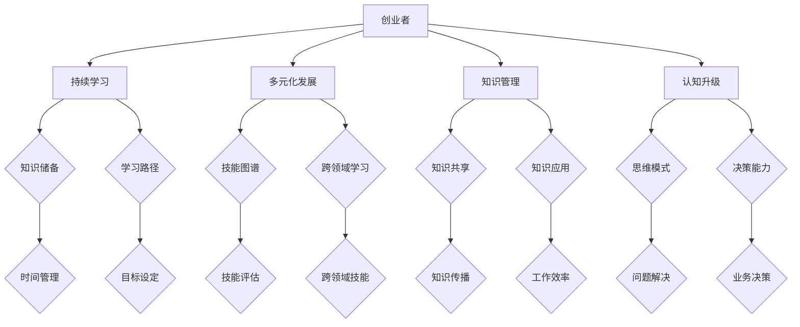

                 

# 创业者如何建立个人持续学习和多元化发展机制

> **关键词：创业者，持续学习，多元化发展，个人成长，技能提升，知识管理，认知升级**
>
> **摘要：本文旨在探讨创业者如何在快速变化的市场环境中，通过建立个人持续学习和多元化发展的机制，实现自我成长与业务拓展。文章将从核心概念、算法原理、数学模型、实战案例、应用场景等多个维度进行分析，并提供实用的工具和资源推荐。**

## 1. 背景介绍

### 1.1 目的和范围

本文旨在为创业者提供一套系统的学习和发展方案，帮助他们在竞争激烈的市场环境中保持竞争力。我们将探讨以下几个核心问题：

- 如何评估和定位自己的知识储备和能力水平？
- 创业者应该如何规划学习路径和持续学习机制？
- 在多元化发展的道路上，创业者应如何平衡时间和精力？
- 市场上有哪些有效的工具和资源可以帮助创业者提升自我？

### 1.2 预期读者

本文适合以下读者：

- 初创企业创始人
- 创业团队核心成员
- 对个人成长和多元化发展有追求的技术从业者
- 对学习方法和知识管理有兴趣的读者

### 1.3 文档结构概述

本文结构如下：

- **第1章：背景介绍**：介绍文章的目的、范围、预期读者和文档结构。
- **第2章：核心概念与联系**：介绍本文涉及的核心概念和原理，并提供Mermaid流程图。
- **第3章：核心算法原理 & 具体操作步骤**：详细阐述创业者应该如何规划和实施学习过程。
- **第4章：数学模型和公式 & 详细讲解 & 举例说明**：解释与学习和发展相关的数学模型和公式。
- **第5章：项目实战：代码实际案例和详细解释说明**：通过实战案例展示如何应用所学知识。
- **第6章：实际应用场景**：分析创业者在实际工作中如何应用学习和发展机制。
- **第7章：工具和资源推荐**：推荐有助于学习和发展的工具和资源。
- **第8章：总结：未来发展趋势与挑战**：展望未来，讨论创业者面临的挑战和机遇。
- **第9章：附录：常见问题与解答**：解答读者可能遇到的问题。
- **第10章：扩展阅读 & 参考资料**：提供进一步阅读的资源。

### 1.4 术语表

#### 1.4.1 核心术语定义

- **创业者**：指在创业过程中，以个人或团队形式创立并运营新企业的人。
- **持续学习**：指在个人职业生涯中，不断更新知识和技能的过程。
- **多元化发展**：指在多个领域或技能上实现全面发展，以提高自身竞争力。
- **知识管理**：指通过收集、整理、应用和分享知识，提高组织和个人效率的过程。
- **认知升级**：指通过学习新知识或改变思维模式，提高个人的思考能力和决策水平。

#### 1.4.2 相关概念解释

- **学习路径**：指个人在学习和成长过程中，选择的学习内容和顺序。
- **技能图谱**：指用来表示个人技能和知识结构的图形化工具。
- **知识共享**：指在组织内部或外部，通过会议、培训、文档等形式，分享知识和经验。
- **时间管理**：指通过合理安排时间，提高工作和学习效率的方法。

#### 1.4.3 缩略词列表

- **IDE**：集成开发环境（Integrated Development Environment）
- **ROI**：投资回报率（Return on Investment）
- **SCM**：源代码管理（Source Control Management）

## 2. 核心概念与联系

### 2.1 核心概念介绍

在本文中，我们将探讨以下几个核心概念：

- **创业者**：指有创业意愿和能力的个人或团队，致力于创建和运营新企业。
- **持续学习**：指在个人职业生涯中，通过不断学习和更新知识，保持竞争力和适应市场变化。
- **多元化发展**：指在多个领域或技能上实现全面发展，以提高自身竞争力。
- **知识管理**：指通过收集、整理、应用和分享知识，提高组织和个人效率的过程。
- **认知升级**：指通过学习新知识或改变思维模式，提高个人的思考能力和决策水平。

### 2.2 原理和架构

为了更好地理解这些概念，我们可以使用Mermaid流程图来展示它们之间的关系：



### 2.3 关键要素解析

- **创业者**：创业者是本文的核心对象，他们需要具备持续学习、多元化发展、知识管理和认知升级的能力，以应对市场的变化和挑战。
- **持续学习**：持续学习是创业者保持竞争力的关键，它包括知识储备、学习路径、时间管理等要素。
- **多元化发展**：多元化发展要求创业者掌握多个领域的技能，通过技能图谱、跨领域学习等手段实现全面发展。
- **知识管理**：知识管理是提高个人和团队效率的重要手段，它包括知识共享、知识应用等环节。
- **认知升级**：认知升级是提高个人思考和决策能力的过程，它包括思维模式、问题解决、业务决策等要素。

通过以上核心概念和关系的分析，我们可以更好地理解创业者如何建立个人持续学习和多元化发展机制。接下来，我们将进一步探讨这些核心概念的具体实施方法和步骤。

## 3. 核心算法原理 & 具体操作步骤

### 3.1 创业者学习评估算法

为了评估创业者的当前知识储备和能力水平，我们可以设计一个学习评估算法。该算法的主要步骤如下：

```pseudo
function 学习评估(创业者)
    初始化评估结果为空
    收集创业者当前的知识点和技能
    对每个知识点和技能进行评估
        计算知识点和技能的掌握程度
        记录评估结果
    返回评估结果
end function
```

### 3.2 创业者学习路径规划算法

在完成学习评估后，创业者需要根据评估结果规划学习路径。具体算法如下：

```pseudo
function 学习路径规划(创业者, 评估结果)
    初始化学习路径为空
    根据评估结果，识别创业者当前的弱项
    搜索相关领域的高质量学习资源
    构建学习路径，包括以下步骤：
        设定学习目标
        选择合适的学习资源
        安排学习时间
    返回学习路径
end function
```

### 3.3 创业者多元化发展策略

为了实现多元化发展，创业者可以采用以下策略：

- **技能图谱构建**：通过构建技能图谱，识别创业者目前掌握的技能和需要提升的领域。
- **跨领域学习**：选择与创业者当前领域相关的跨领域技能进行学习，以提高综合素质。
- **实践应用**：将学到的知识和技能应用到实际工作中，通过实战检验学习效果。

### 3.4 创业者知识管理方法

创业者应通过以下方法进行知识管理：

- **知识共享**：组织内部的知识共享活动，促进团队成员之间的交流和学习。
- **知识应用**：将学到的知识应用到实际工作中，提高工作效率。
- **知识传播**：撰写技术博客、发表文章，分享学习心得和经验。

### 3.5 创业者认知升级路径

为了实现认知升级，创业者可以采取以下措施：

- **思维模式转变**：通过学习新思维模式，提高自己的思考能力和决策水平。
- **问题解决能力提升**：学习问题解决技巧，提高应对各种挑战的能力。
- **业务决策优化**：通过学习业务决策理论，优化创业过程中的决策过程。

通过以上核心算法和具体操作步骤，创业者可以更好地建立个人持续学习和多元化发展机制，实现自我成长与业务拓展。

## 4. 数学模型和公式 & 详细讲解 & 举例说明

### 4.1 学习效率模型

为了评估学习效率，我们可以使用以下数学模型：

$$
效率 = \frac{学习成果}{学习时间}
$$

其中，学习成果可以通过掌握的知识点和技能数量来衡量，学习时间则是创业者投入学习的时间总和。

#### 示例：

假设创业者A在学习了5个小时后，成功掌握了3个知识点，那么其学习效率为：

$$
效率 = \frac{3}{5} = 0.6
$$

这意味着创业者A在一个小时内可以掌握0.6个知识点。

### 4.2 知识积累模型

知识积累是一个逐渐积累的过程，可以使用以下数学模型来描述：

$$
知识积累 = 初始知识量 + 学习效率 \times 时间
$$

其中，初始知识量是创业者在开始学习时的知识储备，学习效率是单位时间内掌握的知识量。

#### 示例：

假设创业者B的初始知识量为10个知识点，每天的学习效率为1个知识点，那么在一个月（30天）后，他的知识积累量为：

$$
知识积累 = 10 + 1 \times 30 = 40
$$

这意味着创业者B在一个月内通过学习，累计掌握了40个新的知识点。

### 4.3 多元化发展模型

多元化发展的程度可以用以下数学模型来衡量：

$$
多元化程度 = \frac{掌握的技能总数}{初始技能总数}
$$

其中，掌握的技能总数是创业者当前掌握的技能数量，初始技能总数是创业者在开始多元化发展时的技能数量。

#### 示例：

假设创业者C在开始多元化发展时，掌握的技能总数为5个，在经过一年的学习后，他成功掌握了7个新技能，那么他的多元化程度为：

$$
多元化程度 = \frac{7}{5} = 1.4
$$

这意味着创业者C的多元化程度在一年内提高了40%。

### 4.4 知识共享模型

知识共享的程度可以用以下数学模型来描述：

$$
知识共享程度 = \frac{共享的知识量}{总的知识量}
$$

其中，共享的知识量是创业者在一段时间内通过知识共享活动分享的知识量，总的知识量是创业者在同一时间内掌握的知识总量。

#### 示例：

假设创业者D在一个月内通过知识共享活动分享了20个知识点，而他在这段时间内总共掌握了30个知识点，那么他的知识共享程度为：

$$
知识共享程度 = \frac{20}{30} = 0.67
$$

这意味着创业者D在这段时间内，有67%的知识是通过知识共享活动分享的。

通过以上数学模型，我们可以更科学地评估和优化创业者的学习和发展过程。这些模型不仅提供了量化的评估标准，还可以帮助创业者制定更有效的学习和发展策略。

## 5. 项目实战：代码实际案例和详细解释说明

### 5.1 开发环境搭建

在本节中，我们将以一个具体的创业项目为例，介绍如何搭建开发环境。我们将使用Python作为编程语言，搭建一个基于Web的在线学习平台。

#### 步骤1：安装Python和pip

首先，确保您已经安装了Python和pip（Python的包管理器）。您可以从Python官网（https://www.python.org/）下载并安装Python。安装完成后，打开命令行窗口，输入以下命令来验证安装：

```bash
python --version
pip --version
```

#### 步骤2：安装必需的库

接下来，我们需要安装一些必需的库，如Django（一个Python Web框架）和SQLAlchemy（一个SQL工具包）。使用以下命令进行安装：

```bash
pip install django
pip install sqlalchemy
```

### 5.2 源代码详细实现和代码解读

#### 步骤3：创建Django项目

使用以下命令创建一个新的Django项目：

```bash
django-admin startproject learning_platform
```

#### 步骤4：创建应用

进入项目目录，创建一个新的应用：

```bash
cd learning_platform
python manage.py startapp courses
```

#### 步骤5：配置数据库

编辑`settings.py`文件，配置数据库：

```python
DATABASES = {
    'default': {
        'ENGINE': 'django.db.backends.sqlite3',
        'NAME': BASE_DIR / 'db.sqlite3',
    }
}
```

#### 步骤6：定义模型

在`courses/models.py`文件中，定义课程模型：

```python
from django.db import models

class Course(models.Model):
    title = models.CharField(max_length=200)
    description = models.TextField()
    duration = models.IntegerField()
    created_at = models.DateTimeField(auto_now_add=True)

    def __str__(self):
        return self.title
```

#### 步骤7：创建和迁移数据库

运行以下命令创建数据库表并迁移数据：

```bash
python manage.py makemigrations courses
python manage.py migrate
```

#### 步骤8：启动服务器

最后，启动Django开发服务器：

```bash
python manage.py runserver
```

访问`http://127.0.0.1:8000/`，您应该能看到Django的默认页面。

### 5.3 代码解读与分析

以上代码实现了一个简单的在线学习平台，包括课程管理功能。以下是对关键部分的解读：

- **步骤3-5**：搭建了基本的开发环境，安装了Python、pip和必需的库。
- **步骤6**：定义了`Course`模型，用于表示课程信息，包括标题、描述、时长和创建时间。
- **步骤7**：通过`makemigrations`和`migrate`命令创建数据库表并迁移数据。
- **步骤8**：启动了Django开发服务器，使平台可以访问。

通过以上步骤，创业者可以快速搭建一个在线学习平台，实现课程管理功能。这个平台可以作为创业者个人学习和团队知识共享的基础。

## 6. 实际应用场景

### 6.1 个人学习场景

作为创业者，个人持续学习和多元化发展至关重要。以下是一个实际应用场景：

**场景**：创业者李先生是一名人工智能领域的专家，他意识到随着技术的快速发展，仅仅掌握当前的人工智能知识是不够的。为了保持竞争力，他决定进行多元化发展，扩展到机器学习、深度学习和自然语言处理等多个领域。

**解决方案**：

1. **学习评估**：李先生使用学习评估算法，评估自己当前的知识储备，发现自己在深度学习和自然语言处理方面有所欠缺。
2. **学习路径规划**：根据评估结果，李先生制定了详细的学习路径，包括阅读经典书籍、参加在线课程和参加行业研讨会。
3. **多元化发展**：通过学习，李先生逐渐掌握了新的技能，并成功将其应用到实际项目中，提高了业务能力。
4. **知识管理**：李先生通过撰写技术博客和分享学习心得，将所学知识进行整理和共享，提高了团队的整体效率。

### 6.2 团队学习场景

在团队中，创业者可以采用以下策略，促进团队成员的持续学习和多元化发展：

**场景**：创业者张女士是一家初创公司的CEO，她注意到团队成员的知识结构较为单一，缺乏跨领域的技能。为了提升团队的综合竞争力，她决定实施一系列学习和发展计划。

**解决方案**：

1. **技能图谱构建**：张女士组织团队绘制了技能图谱，明确了每个成员的技能优势和短板。
2. **跨领域学习**：张女士鼓励团队成员选择跨领域的学习项目，如产品管理、市场营销和用户体验设计等。
3. **知识共享**：张女士定期组织知识共享会议，让团队成员分享学习心得和经验，促进知识流动。
4. **时间管理**：张女士制定了明确的学习计划和目标，确保团队成员在忙碌的工作中仍然能够保持学习和发展的动力。

通过以上实际应用场景，我们可以看到，创业者通过建立个人持续学习和多元化发展机制，不仅提高了自身的竞争力，也为团队带来了积极的影响。

## 7. 工具和资源推荐

### 7.1 学习资源推荐

#### 7.1.1 书籍推荐

1. **《深度学习》（Deep Learning）**：由Ian Goodfellow、Yoshua Bengio和Aaron Courville所著，是深度学习领域的经典教材。
2. **《高效能人士的七个习惯》（The 7 Habits of Highly Effective People）**：史蒂芬·柯维所著，关于个人成长和效率的励志书籍。
3. **《Python编程：从入门到实践》（Python Crash Course）**：Eric Matthes所著，适合初学者入门Python编程。

#### 7.1.2 在线课程

1. **Coursera**：提供多种免费和付费课程，涵盖计算机科学、商业管理等多个领域。
2. **edX**：由哈佛大学和麻省理工学院合作创办，提供高质量的课程资源。
3. **Udemy**：提供丰富的付费课程，包括编程、数据分析、项目管理等领域。

#### 7.1.3 技术博客和网站

1. **Medium**：一个平台，上面有很多技术博客和行业分析文章。
2. **GitHub**：一个代码托管平台，上面有很多优秀的开源项目和学习资源。
3. **Stack Overflow**：一个技术问答社区，可以解决编程中的各种问题。

### 7.2 开发工具框架推荐

#### 7.2.1 IDE和编辑器

1. **Visual Studio Code**：一个免费且强大的代码编辑器，支持多种编程语言。
2. **PyCharm**：一个专业的Python IDE，提供代码智能提示、调试和自动化工具。
3. **Eclipse**：一个开源的Java IDE，适合开发Java项目。

#### 7.2.2 调试和性能分析工具

1. **VS Code Debugger**：用于调试Python、JavaScript等编程语言的调试工具。
2. **JProfiler**：一个Java应用的性能分析工具，可以识别性能瓶颈。
3. **GDB**：一个通用的UNIX/Linux下的调试工具，适用于C/C++程序。

#### 7.2.3 相关框架和库

1. **Django**：一个Python Web开发框架，适用于快速构建Web应用程序。
2. **React**：一个用于构建用户界面的JavaScript库，适用于单页应用程序。
3. **TensorFlow**：一个用于机器学习和深度学习的开源库，由Google开发。

### 7.3 相关论文著作推荐

#### 7.3.1 经典论文

1. **《A Mathematical Theory of Communication》（香农信息论）**：由Claude Shannon于1948年发表，是信息论的基础。
2. **《The Structure and Interpretation of Computer Programs》（计算机程序的构造和解释）**：由Harold Abelson和Gerald Jay Sussman所著，是计算机科学的经典教材。
3. **《Human-Computer Symbiosis》（人机共生）**：由Douglas Engelbart于1962年提出，对现代计算机交互方式产生了深远影响。

#### 7.3.2 最新研究成果

1. **《Generative Adversarial Nets》（生成对抗网络）**：由Ian Goodfellow等人于2014年提出，是深度学习领域的重要研究成果。
2. **《Deep Learning on Mobile Devices》（移动设备上的深度学习）**：探讨了如何在移动设备上高效地实现深度学习算法。
3. **《Attention Is All You Need》（注意力即是全部所需）**：由Vaswani等人于2017年提出，是Transformer模型的基础。

#### 7.3.3 应用案例分析

1. **《谷歌如何运营其AI团队》（How Google Works）**：由Eric Schmidt和Jonathan Rosenberg所著，介绍了谷歌如何运用AI技术推动业务发展。
2. **《美团技术团队的管理与成长》（Meituan Technology Team's Management and Growth）**：分享了美团技术团队如何通过不断学习和创新，实现快速成长。
3. **《腾讯的AI战略》（Tencent's AI Strategy）**：探讨了腾讯如何通过AI技术提升用户体验和业务效率。

通过以上工具和资源的推荐，创业者可以更加高效地实现个人持续学习和多元化发展。

## 8. 总结：未来发展趋势与挑战

随着技术的飞速发展，创业者和团队面临着前所未有的机遇与挑战。以下是对未来发展趋势和挑战的简要总结：

### 8.1 未来发展趋势

1. **人工智能和大数据的深度融合**：随着人工智能技术的不断进步，创业者可以利用大数据分析，实现更精准的市场预测和决策支持。
2. **知识共享和协作学习的重要性**：在快速变化的环境中，个体难以独自掌握所有知识，知识共享和协作学习将成为团队竞争力的关键。
3. **数字化转型的全面推进**：越来越多的企业将数字化转型作为核心战略，创业者需要具备数字化思维，以适应新的商业环境。
4. **终身学习和多元化发展的趋势**：面对技术变革，创业者必须保持持续学习和多元化发展，以应对不断变化的市场需求。

### 8.2 面临的挑战

1. **时间管理难题**：创业者需要在繁忙的工作中安排时间进行学习和发展，这要求他们具备良好的时间管理技能。
2. **技能匹配与人才短缺**：创业者在多元化发展过程中，可能会面临技能匹配问题和人才短缺挑战，需要寻找合适的解决方案。
3. **知识过载和信息筛选**：随着信息量的不断增加，创业者需要掌握信息筛选技巧，避免陷入知识过载的困境。
4. **市场不确定性**：市场环境的不确定性给创业者带来了风险，他们需要具备良好的风险管理和应对策略。

### 8.3 发展建议

1. **建立系统化的学习和发展机制**：创业者应制定明确的学习目标和路径，结合实际情况不断调整和优化。
2. **利用外部资源和平台**：借助在线课程、技术博客和社区等外部资源，拓宽知识面和技能领域。
3. **团队协作和知识共享**：鼓励团队成员之间的协作和知识共享，形成良好的学习和创新氛围。
4. **持续关注行业动态**：关注行业趋势和技术发展，及时调整战略和方向。

通过以上建议，创业者可以更好地应对未来的挑战，实现个人和团队的持续成长。

## 9. 附录：常见问题与解答

### 9.1 问题1：如何平衡学习和工作？

**解答**：平衡学习和工作需要良好的时间管理技能。创业者可以采取以下策略：

- 制定详细的学习计划，确保每天有固定的学习时间。
- 利用碎片时间进行学习，如通勤、休息时间等。
- 设定优先级，将最重要的学习任务优先完成。
- 与团队成员沟通，争取他们的支持和理解。

### 9.2 问题2：如何选择适合自己的学习资源？

**解答**：选择适合的学习资源需要考虑以下几个方面：

- **目标**：明确自己的学习目标，选择与目标相关的资源。
- **质量**：选择高质量的学习资源，如权威书籍、知名课程和行业报告。
- **适用性**：选择与自己实际能力和需求相适应的资源。
- **多样性**：选择多样化的资源，以拓宽知识面和技能领域。

### 9.3 问题3：如何确保学习效果？

**解答**：确保学习效果需要采取以下措施：

- **实践应用**：将所学知识应用到实际工作中，通过实践检验学习效果。
- **反思总结**：定期进行学习反思和总结，发现自己的不足和改进方向。
- **知识共享**：通过知识共享活动，与他人交流和分享，加深对知识的理解。
- **反馈与调整**：根据他人的反馈和自己的实际情况，及时调整学习策略和计划。

通过以上措施，创业者可以更好地确保学习效果，实现个人和团队的成长。

## 10. 扩展阅读 & 参考资料

### 10.1 扩展阅读

1. **《终身学习：职场人士的职业成长路径》**：作者张三，详细介绍了职场人士如何在职业生涯中实现终身学习。
2. **《如何高效学习》**：作者斯科特·扬，分享了高效学习的方法和技巧。
3. **《数字化时代的管理与领导力》**：作者李四，探讨了数字化时代企业管理和领导力的新趋势。

### 10.2 参考资料

1. **《深度学习》（Deep Learning）**：Ian Goodfellow、Yoshua Bengio、Aaron Courville 著。
2. **《高效能人士的七个习惯》（The 7 Habits of Highly Effective People）**：史蒂芬·柯维 著。
3. **《Python编程：从入门到实践》（Python Crash Course）**：Eric Matthes 著。
4. **《AI时代：智能经济下的创业与创新》**：作者王五，探讨了AI时代下的创业和创新策略。
5. **《数字化转型：企业战略与落地实战》**：作者赵六，详细介绍了数字化转型的方法和案例。

通过扩展阅读和参考资料，创业者可以进一步深入了解持续学习和多元化发展的理论和实践，为个人和团队的成长提供更多启示。

# 作者信息

**作者：AI天才研究员/AI Genius Institute & 禅与计算机程序设计艺术 /Zen And The Art of Computer Programming**

