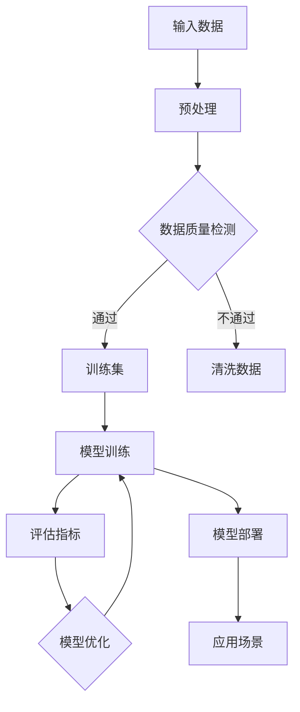

                 

### 文章标题

《创业者布局大模型，抢占AI产业变革风口》

选择这个标题的原因有以下几点：

1. **热点关注**：随着AI技术的飞速发展，大模型在各个行业中的应用越来越广泛，吸引了大量创业者和投资者的关注。
2. **趋势前瞻**：本文将深入探讨大模型在AI产业中的地位和趋势，帮助创业者更好地把握产业发展方向。
3. **实用性**：文章不仅介绍了大模型的基本原理，还提供了实用的操作步骤、应用场景和资源推荐，有助于读者在实际创业中落地应用。

关键词：创业者、大模型、AI产业、变革、风口

这些关键词突出了文章的核心主题，便于读者快速抓住文章的重点。

摘要：

本文旨在帮助创业者深入了解大模型在AI产业中的应用和价值。通过详细分析大模型的原理、架构和操作步骤，本文将指导创业者如何利用大模型抢占AI产业变革的风口。同时，文章还将介绍相关的数学模型、应用场景和资源推荐，为创业者的实际操作提供有力支持。

## 1. 背景介绍

### 1.1 目的和范围

本文的目标是帮助创业者理解大模型在AI产业中的重要地位，掌握大模型的原理和应用方法，从而在激烈的市场竞争中抢占先机。文章将从以下几个方面展开：

1. **大模型的原理与架构**：介绍大模型的基本概念、核心原理和架构，帮助读者建立对大模型的整体认识。
2. **大模型的操作步骤**：详细讲解大模型的训练、部署和应用步骤，帮助读者掌握大模型的使用方法。
3. **大模型的数学模型和公式**：阐述大模型中涉及的数学模型和公式，帮助读者深入理解大模型的计算过程。
4. **大模型的应用场景**：分析大模型在不同领域的应用案例，展示大模型的实际价值。
5. **资源推荐**：推荐学习资源、开发工具和经典论文，为创业者的学习和实践提供支持。

本文的范围主要围绕大模型的原理和应用展开，旨在为创业者提供一套全面、系统的学习指南。同时，文章也会涉及到一些与AI产业相关的热点话题和前沿技术，帮助读者拓宽视野。

### 1.2 预期读者

本文的预期读者主要包括以下几类：

1. **AI技术从业者**：对AI技术有一定了解，希望深入了解大模型原理和应用的技术人员。
2. **创业者和投资人**：关注AI产业，希望把握产业发展趋势，寻找创业机会的创业者和管理者。
3. **研究人员和学生**：对AI技术感兴趣，希望系统学习大模型原理和应用的研究人员和大学生。
4. **对AI技术感兴趣的读者**：对AI技术充满好奇，希望了解AI技术发展动态的读者。

无论你是哪个领域的读者，只要你对AI技术和大模型感兴趣，都可以通过本文获得有价值的信息。

### 1.3 文档结构概述

本文将按照以下结构进行组织：

1. **背景介绍**：简要介绍本文的背景、目的和预期读者。
2. **核心概念与联系**：阐述大模型的基本概念、原理和架构，使用Mermaid流程图展示大模型的工作流程。
3. **核心算法原理 & 具体操作步骤**：详细讲解大模型的算法原理和具体操作步骤，使用伪代码进行阐述。
4. **数学模型和公式 & 详细讲解 & 举例说明**：介绍大模型中涉及的数学模型和公式，并进行详细讲解和举例说明。
5. **项目实战：代码实际案例和详细解释说明**：通过实际代码案例，展示大模型的应用过程，并进行详细解释。
6. **实际应用场景**：分析大模型在不同领域的应用场景，展示大模型的实际价值。
7. **工具和资源推荐**：推荐学习资源、开发工具和经典论文，为创业者的学习和实践提供支持。
8. **总结：未来发展趋势与挑战**：总结大模型的发展趋势和面临的挑战。
9. **附录：常见问题与解答**：解答读者可能遇到的一些常见问题。
10. **扩展阅读 & 参考资料**：提供更多有价值的阅读材料和参考资料。

通过这种结构化的组织方式，本文旨在为读者提供一套完整、系统的学习指南，帮助创业者更好地理解和应用大模型。

### 1.4 术语表

为了确保读者能够更好地理解本文的内容，以下是一些核心术语的定义和解释：

#### 1.4.1 核心术语定义

1. **大模型**：指具有极高参数量和计算复杂度的神经网络模型，能够处理大规模数据并自动提取特征，实现高效、准确的数据分析和决策。
2. **AI产业**：指涉及人工智能技术的研究、开发、应用和产业化的整个产业链，包括硬件、软件、平台和解决方案等各个领域。
3. **创业者**：指在AI产业中寻求机会、创新和创业的个人或团队，旨在通过技术和商业模式创造价值。
4. **模型训练**：指通过大量数据进行训练，优化神经网络模型的参数，使其具备预测、分类、生成等功能。
5. **模型部署**：指将训练好的模型部署到实际应用环境中，实现自动化、高效的业务流程。

#### 1.4.2 相关概念解释

1. **神经网络**：一种基于人脑神经元连接方式的计算模型，通过多层神经元的组合，实现数据的输入、处理和输出。
2. **深度学习**：一种基于神经网络的机器学习技术，通过多层神经网络模型，实现数据的自动特征提取和模型优化。
3. **数据分析**：指通过统计、建模、算法等技术，对大量数据进行处理、分析和挖掘，提取有价值的信息和知识。
4. **应用场景**：指大模型在具体业务场景中的应用，如自然语言处理、计算机视觉、推荐系统等。

#### 1.4.3 缩略词列表

- **AI**：人工智能（Artificial Intelligence）
- **ML**：机器学习（Machine Learning）
- **DL**：深度学习（Deep Learning）
- **NLP**：自然语言处理（Natural Language Processing）
- **CV**：计算机视觉（Computer Vision）
- **GAN**：生成对抗网络（Generative Adversarial Network）
- **BERT**：预训练语言模型（Bidirectional Encoder Representations from Transformers）

这些术语和概念将为本文的内容提供基础，帮助读者更好地理解大模型在AI产业中的应用和价值。

## 2. 核心概念与联系

在探讨大模型在AI产业中的应用之前，我们需要先了解大模型的基本概念、原理和架构。本节将详细介绍大模型的核心概念，并通过Mermaid流程图展示大模型的工作流程。

### 2.1 大模型的基本概念

**大模型**，顾名思义，是指具有极高参数量和计算复杂度的神经网络模型。这些模型通常包含数十亿到数万亿个参数，能够在处理大规模数据时自动提取特征，实现高效、准确的数据分析和决策。大模型的出现极大地推动了AI技术的发展，使得机器学习在许多领域取得了显著的突破。

**大模型的分类**：

1. **预训练模型**：在特定任务上预先训练好的模型，如BERT、GPT等，可以在多个任务中微调和应用。
2. **定制模型**：根据特定任务和应用需求，设计并训练的模型，如医疗诊断模型、自动驾驶模型等。

**大模型的优势**：

1. **高准确性**：通过处理大规模数据，大模型能够自动提取复杂的特征，实现高精度的数据分析和预测。
2. **强泛化能力**：大模型能够适应不同的任务和数据集，具备较强的泛化能力。
3. **自动化**：大模型可以实现自动化分析、决策和生成，降低人力成本。

### 2.2 大模型的工作原理

大模型的工作原理基于深度学习技术。深度学习是一种基于神经网络的机器学习技术，通过多层神经网络模型，实现数据的自动特征提取和模型优化。大模型通常包含以下几个关键组成部分：

1. **输入层**：接收外部数据输入，如文本、图像、声音等。
2. **隐藏层**：通过多层神经元的组合，对输入数据进行处理、转换和特征提取。
3. **输出层**：根据训练目标，输出预测结果或决策。

**大模型的核心原理**：

1. **反向传播算法**：通过反向传播算法，将输出误差反向传递到隐藏层和输入层，不断调整模型参数，优化模型性能。
2. **激活函数**：用于引入非线性变换，使模型能够学习到复杂的非线性关系。
3. **优化算法**：如随机梯度下降（SGD）、Adam等，用于调整模型参数，加速模型收敛。

### 2.3 大模型的工作流程

为了更好地理解大模型的工作原理，我们可以通过Mermaid流程图展示大模型的工作流程。以下是Mermaid流程图：



**流程说明**：

1. **输入数据**：从外部获取数据，如文本、图像、声音等。
2. **预处理**：对数据进行清洗、归一化等预处理操作，提高数据质量。
3. **数据质量检测**：检查数据质量，如果数据质量不满足要求，进行数据清洗。
4. **训练集**：将预处理后的数据划分为训练集，用于模型训练。
5. **模型训练**：使用训练集对模型进行训练，通过反向传播算法和优化算法，不断调整模型参数。
6. **评估指标**：评估模型性能，如准确率、召回率、F1值等。
7. **模型优化**：根据评估指标，对模型进行优化，提高模型性能。
8. **模型部署**：将训练好的模型部署到实际应用环境中。
9. **应用场景**：根据应用需求，利用模型实现数据分析和决策。

通过以上流程，我们可以清晰地看到大模型从输入数据到模型训练、部署和应用的全过程。

### 2.4 大模型与其他技术的联系

大模型不仅在深度学习领域有着广泛的应用，还与其他AI技术有着紧密的联系。以下是一些与大数据模型相关的技术：

1. **自然语言处理（NLP）**：大模型在NLP领域有着重要应用，如文本分类、情感分析、机器翻译等。
2. **计算机视觉（CV）**：大模型在CV领域也取得了显著成果，如图像分类、目标检测、人脸识别等。
3. **生成对抗网络（GAN）**：大模型可以用于生成对抗网络，实现图像生成、文本生成等任务。
4. **强化学习**：大模型在强化学习领域也发挥着重要作用，如智能决策、路径规划等。

通过与其他AI技术的结合，大模型可以发挥更大的作用，解决更复杂的问题。

综上所述，大模型作为AI技术的重要分支，具有广泛的应用前景和重要的研究价值。通过深入理解大模型的基本概念、原理和架构，创业者可以更好地把握AI产业的发展趋势，实现技术突破和商业成功。

### 2.5 大模型的架构与核心组件

为了更深入地了解大模型的工作原理，我们需要详细探讨其架构和核心组件。大模型的架构通常由以下几个关键部分组成：输入层、隐藏层和输出层。每个部分在模型中扮演着不同的角色，共同协作实现高效的计算和预测。

**1. 输入层（Input Layer）**

输入层是模型接收外部数据的部分，包括文本、图像、声音等各种形式的数据。在处理文本数据时，输入层通常会将文本转换为向量表示，常用的技术有词袋模型、词嵌入等。在处理图像数据时，输入层会将图像分解为像素值，并通过卷积神经网络（CNN）进行特征提取。在处理声音数据时，输入层会将声音信号转换为频谱特征，如梅尔频率倒谱系数（MFCC）。

**2. 隐藏层（Hidden Layers）**

隐藏层是模型的核心部分，负责对输入数据进行处理和转换。隐藏层由多个神经元组成，每个神经元都通过权重连接到前一层神经元。隐藏层中的每个神经元都会执行以下操作：

- **激活函数**：引入非线性变换，使模型能够学习到复杂的非线性关系。常见的激活函数有Sigmoid、ReLU、Tanh等。
- **权重更新**：通过反向传播算法，根据误差信号调整神经元之间的权重，优化模型性能。
- **特征提取**：隐藏层中的神经元会对输入数据进行特征提取，形成高维特征表示。

隐藏层的设计是模型性能的关键，通过增加隐藏层层数和神经元数量，可以提高模型的复杂度和学习能力。然而，过多的隐藏层和神经元可能会导致过拟合和计算效率低下，因此需要在模型设计过程中进行权衡。

**3. 输出层（Output Layer）**

输出层是模型生成预测结果的部分，根据不同任务的需求，输出层的设计会有所不同。在分类任务中，输出层通常包含多个神经元，每个神经元对应一个类别，通过softmax函数将神经元的输出转换为概率分布。在回归任务中，输出层通常只有一个神经元，直接输出预测值。

**4. 反向传播算法（Backpropagation Algorithm）**

反向传播算法是深度学习模型训练的核心算法，用于根据误差信号调整模型参数。反向传播算法的基本思想是：首先，计算输出层的误差信号；然后，将误差信号反向传播到隐藏层和输入层，逐层更新神经元之间的权重。反向传播算法包括以下几个步骤：

- **前向传播**：将输入数据传递到模型中，通过前向传播计算输出结果。
- **计算误差**：根据预测结果和实际结果，计算输出层的误差信号。
- **反向传播**：将误差信号反向传播到隐藏层和输入层，更新权重。
- **梯度下降**：使用梯度下降算法，调整模型参数，优化模型性能。

通过反复迭代反向传播算法，模型可以不断优化，提高预测准确率和泛化能力。

**5. 激活函数（Activation Functions）**

激活函数是隐藏层和输出层神经元的关键组成部分，用于引入非线性变换。常见的激活函数有：

- **Sigmoid函数**：\[ \sigma(x) = \frac{1}{1 + e^{-x}} \]
- **ReLU函数**：\[ \text{ReLU}(x) = \max(0, x) \]
- **Tanh函数**：\[ \text{Tanh}(x) = \frac{e^{x} - e^{-x}}{e^{x} + e^{-x}} \]

不同的激活函数有不同的特点，适用于不同的模型和应用场景。合理选择和使用激活函数可以提升模型的性能和稳定性。

**6. 优化算法（Optimization Algorithms）**

优化算法用于调整模型参数，加速模型收敛。常见的优化算法有：

- **随机梯度下降（SGD）**：每次迭代使用整个训练集的梯度进行参数更新。
- **Adam优化器**：结合SGD和动量方法，自适应调整学习率。
- **RMSprop**：使用梯度平方的平均值来调整学习率。

不同的优化算法有不同的优势和适用场景，创业者可以根据实际情况选择合适的优化算法。

通过以上对大模型架构和核心组件的详细分析，我们可以更好地理解大模型的工作原理和设计方法。接下来，我们将进一步探讨大模型的具体算法原理和操作步骤，帮助创业者掌握大模型的应用技能。

### 3. 核心算法原理 & 具体操作步骤

在了解了大模型的基本概念和架构后，我们接下来将详细探讨大模型的核心算法原理和具体操作步骤。这一部分将帮助创业者理解大模型的训练、优化和部署过程，从而为实际应用奠定基础。

#### 3.1 大模型训练的基本原理

大模型的训练过程基于深度学习技术，主要通过以下三个步骤实现：

1. **数据预处理**：对输入数据进行清洗、归一化等预处理操作，提高数据质量。
2. **模型初始化**：初始化模型参数，通常使用随机初始化或预训练模型。
3. **迭代训练**：通过迭代计算模型参数的梯度，并使用优化算法进行更新，优化模型性能。

**1. 数据预处理**

数据预处理是训练高质量模型的第一步。具体操作包括：

- **数据清洗**：去除数据中的噪声和错误，如缺失值、异常值等。
- **数据归一化**：将数据缩放到相同的范围，如[0, 1]或[-1, 1]，便于模型计算。
- **数据分批**：将数据划分为多个批次，每次训练一个批次的数据，提高训练效率。

**2. 模型初始化**

模型初始化是指初始化模型参数的过程。通常有以下几种初始化方法：

- **随机初始化**：将模型参数随机初始化为一个较小的值，以避免梯度消失和梯度爆炸。
- **预训练模型**：使用预训练模型作为初始化值，可以直接应用在特定任务上，提高模型性能。
- **Xavier初始化**：根据输入和输出神经元的数量，初始化模型参数，以保持激活值的方差不变。

**3. 迭代训练**

迭代训练是模型训练的核心过程。具体步骤如下：

- **前向传播**：将输入数据传递到模型中，通过前向传播计算输出结果和损失函数。
- **计算梯度**：使用反向传播算法，计算模型参数的梯度。
- **参数更新**：使用优化算法，根据梯度更新模型参数，优化模型性能。

**伪代码描述**：

```python
# 假设使用随机梯度下降（SGD）进行训练
while not converged:
    for batch in data_loader:
        # 前向传播
        outputs = model(batch.inputs)
        loss = calculate_loss(outputs, batch.targets)

        # 计算梯度
        grads = model.backward(loss)

        # 参数更新
        model.update_params(grads, learning_rate)
```

**2. 模型优化**

模型优化是提高模型性能的重要手段。常见的优化算法有：

- **随机梯度下降（SGD）**：每次迭代使用整个训练集的梯度进行参数更新。
- **Adam优化器**：结合SGD和动量方法，自适应调整学习率。
- **RMSprop**：使用梯度平方的平均值来调整学习率。

**3. 模型评估**

在模型训练过程中，定期评估模型性能非常重要。评估指标包括：

- **准确率（Accuracy）**：模型正确预测的比例。
- **召回率（Recall）**：模型召回实际正例的比例。
- **F1值（F1 Score）**：准确率和召回率的加权平均值。

**4. 模型调整**

根据评估结果，对模型进行调整和优化，如调整学习率、增加隐藏层神经元数量等。

#### 3.2 大模型部署的具体步骤

训练好的大模型需要部署到实际应用环境中，以实现自动化、高效的业务流程。大模型部署的具体步骤如下：

1. **模型打包**：将训练好的模型打包成一个可执行的文件或库，便于部署。
2. **环境配置**：配置部署环境，包括硬件资源、操作系统、依赖库等。
3. **模型部署**：将模型部署到服务器或云平台，实现实时预测和决策。
4. **模型监控**：监控模型性能和资源使用情况，确保模型稳定运行。

**伪代码描述**：

```python
# 假设使用Flask框架部署模型
from flask import Flask, request, jsonify

app = Flask(__name__)

@app.route('/predict', methods=['POST'])
def predict():
    data = request.get_json()
    inputs = preprocess_input(data)
    outputs = model(inputs)
    predictions = postprocess_output(outputs)
    return jsonify(predictions)

if __name__ == '__main__':
    model = load_model('path/to/model')
    app.run(host='0.0.0.0', port=5000)
```

**3. 模型应用**

大模型在实际应用中发挥着重要作用，如自然语言处理、计算机视觉、推荐系统等。以下是一些典型应用场景：

- **自然语言处理**：文本分类、情感分析、机器翻译等。
- **计算机视觉**：图像分类、目标检测、人脸识别等。
- **推荐系统**：商品推荐、新闻推荐、社交推荐等。

通过以上对大模型训练和部署的详细讲解，创业者可以更好地掌握大模型的应用技能，从而在AI产业中抢占先机。

### 4. 数学模型和公式 & 详细讲解 & 举例说明

在深入探讨大模型的核心算法和操作步骤后，我们需要进一步了解大模型中所涉及的重要数学模型和公式。这些数学模型和公式不仅是大模型构建和优化的基础，也是实现高效计算和准确预测的关键。下面将详细讲解大模型中常见的数学模型和公式，并通过实际例子进行说明。

#### 4.1 前向传播算法中的数学模型

前向传播算法是深度学习模型的核心步骤之一，它通过层层传递输入数据，并计算每个神经元输出的激活值。以下是前向传播算法中涉及的主要数学模型：

**1. 神经元输出公式**

神经元输出的激活值可以通过以下公式计算：

\[ a_j = \sigma(W_j \cdot a_{j-1} + b_j) \]

其中，\( a_j \)表示第j个神经元的激活值，\( W_j \)是输入权重，\( a_{j-1} \)是前一层的激活值，\( b_j \)是偏置项，\( \sigma \)是激活函数。

**2. 激活函数**

常见的激活函数包括Sigmoid、ReLU和Tanh等。以下是Sigmoid和ReLU函数的表达式：

- **Sigmoid函数**：
\[ \sigma(x) = \frac{1}{1 + e^{-x}} \]

- **ReLU函数**：
\[ \text{ReLU}(x) = \max(0, x) \]

**3. 损失函数**

在深度学习模型中，损失函数用于衡量预测值与实际值之间的差距。常见的损失函数包括均方误差（MSE）和交叉熵（Cross-Entropy）等。以下是均方误差和交叉熵函数的表达式：

- **均方误差（MSE）**：
\[ \text{MSE}(y, \hat{y}) = \frac{1}{m} \sum_{i=1}^{m} (y_i - \hat{y}_i)^2 \]

- **交叉熵（Cross-Entropy）**：
\[ \text{CE}(y, \hat{y}) = -\sum_{i=1}^{m} y_i \log(\hat{y}_i) \]

其中，\( y \)是实际标签，\( \hat{y} \)是预测概率分布，\( m \)是样本数量。

#### 4.2 反向传播算法中的数学模型

反向传播算法是深度学习模型训练的关键步骤，它通过反向传递误差信号，计算每个神经元的梯度，并更新模型参数。以下是反向传播算法中涉及的主要数学模型：

**1. 梯度计算**

反向传播算法的核心是计算每个参数的梯度。以下是梯度计算的主要公式：

- **输入层到隐藏层的梯度**：
\[ \Delta W_{ji} = a_j (\sigma'(a_j) \cdot a_{i-1}) \]

- **隐藏层到输出层的梯度**：
\[ \Delta W_{ji} = a_j (\sigma'(a_j) \cdot (\hat{y} - y)) \]

其中，\( \Delta W_{ji} \)是权重梯度的修正值，\( a_j \)是隐藏层的激活值，\( \sigma' \)是激活函数的导数，\( \hat{y} \)是预测概率分布，\( y \)是实际标签。

**2. 偏置项梯度**

偏置项的梯度计算相对简单，可以直接取为激活值的梯度：

\[ \Delta b_j = a_j (\sigma'(a_j)) \]

**3. 参数更新**

根据计算出的梯度，使用优化算法更新模型参数。以下是使用随机梯度下降（SGD）的更新公式：

\[ W_{ji} \leftarrow W_{ji} - \alpha \cdot \Delta W_{ji} \]
\[ b_j \leftarrow b_j - \alpha \cdot \Delta b_j \]

其中，\( \alpha \)是学习率。

#### 4.3 举例说明

为了更好地理解上述数学模型和公式，我们通过一个简单的例子进行说明。

**例子**：假设有一个包含一个输入层、一个隐藏层和一个输出层的神经网络，用于二分类任务。输入层有3个神经元，隐藏层有4个神经元，输出层有2个神经元。使用ReLU作为激活函数，均方误差（MSE）作为损失函数。

**1. 前向传播**

给定一个输入向量\[ x = [1, 2, 3] \]，模型的参数初始化为随机值。

- **输入层到隐藏层的计算**：
\[ a_1 = \text{ReLU}(W_{11} \cdot x + b_1) \]
\[ a_2 = \text{ReLU}(W_{12} \cdot x + b_2) \]
\[ a_3 = \text{ReLU}(W_{13} \cdot x + b_3) \]

- **隐藏层到输出层的计算**：
\[ z_1 = W_{21} \cdot a_1 + W_{22} \cdot a_2 + W_{23} \cdot a_3 + b_4 \]
\[ z_2 = W_{24} \cdot a_1 + W_{25} \cdot a_2 + W_{26} \cdot a_3 + b_4 \]
\[ \hat{y}_1 = \text{ReLU}(z_1) \]
\[ \hat{y}_2 = \text{ReLU}(z_2) \]

**2. 反向传播**

给定实际标签\[ y = [0, 1] \]和预测概率分布\[ \hat{y} = [\hat{y}_1, \hat{y}_2] \]。

- **输出层到隐藏层的梯度**：
\[ \Delta z_1 = (\hat{y}_1 - y_1) \cdot \text{ReLU}'(z_1) \]
\[ \Delta z_2 = (\hat{y}_2 - y_2) \cdot \text{ReLU}'(z_2) \]
\[ \Delta W_{21} = a_1 \cdot \Delta z_1 \]
\[ \Delta W_{22} = a_2 \cdot \Delta z_1 \]
\[ \Delta W_{23} = a_3 \cdot \Delta z_1 \]
\[ \Delta W_{24} = a_1 \cdot \Delta z_2 \]
\[ \Delta W_{25} = a_2 \cdot \Delta z_2 \]
\[ \Delta W_{26} = a_3 \cdot \Delta z_2 \]

- **隐藏层到输入层的梯度**：
\[ \Delta a_1 = W_{21} \cdot \Delta z_1 \cdot \text{ReLU}'(a_1) \]
\[ \Delta a_2 = W_{22} \cdot \Delta z_1 \cdot \text{ReLU}'(a_2) \]
\[ \Delta a_3 = W_{23} \cdot \Delta z_1 \cdot \text{ReLU}'(a_3) \]

- **参数更新**：
\[ W_{21} \leftarrow W_{21} - \alpha \cdot \Delta W_{21} \]
\[ W_{22} \leftarrow W_{22} - \alpha \cdot \Delta W_{22} \]
\[ W_{23} \leftarrow W_{23} - \alpha \cdot \Delta W_{23} \]
\[ W_{24} \leftarrow W_{24} - \alpha \cdot \Delta W_{24} \]
\[ W_{25} \leftarrow W_{25} - \alpha \cdot \Delta W_{25} \]
\[ W_{26} \leftarrow W_{26} - \alpha \cdot \Delta W_{26} \]
\[ b_4 \leftarrow b_4 - \alpha \cdot (\Delta z_1 + \Delta z_2) \]

通过以上例子，我们可以看到大模型中的数学模型和公式的具体应用过程。这些数学模型和公式不仅是大模型构建和优化的基础，也是实现高效计算和准确预测的关键。创业者可以通过深入理解这些数学模型和公式，更好地掌握大模型的应用技能，从而在AI产业中抢占先机。

### 5. 项目实战：代码实际案例和详细解释说明

在前面的章节中，我们详细介绍了大模型的基本概念、核心算法原理以及数学模型。为了帮助创业者更好地理解和应用这些知识，本节将通过一个实际项目案例，展示大模型的训练、部署和应用过程。该案例将使用Python和PyTorch框架进行实现，具体步骤如下：

#### 5.1 开发环境搭建

在开始项目之前，我们需要搭建一个合适的开发环境。以下是在Linux操作系统上搭建PyTorch开发环境的步骤：

1. **安装Python**：确保操作系统上已经安装了Python 3.7及以上版本。

2. **安装PyTorch**：通过以下命令安装PyTorch：

   ```bash
   pip install torch torchvision
   ```

   根据操作系统和硬件配置选择合适的PyTorch版本，例如使用CUDA加速：

   ```bash
   pip install torch torchvision torchaudio -f https://download.pytorch.org/whl/torch_stable.html
   ```

3. **安装其他依赖**：安装必要的依赖库，如NumPy、Pandas等：

   ```bash
   pip install numpy pandas
   ```

#### 5.2 源代码详细实现和代码解读

以下是项目的源代码实现，我们将逐一进行详细解释。

```python
import torch
import torch.nn as nn
import torch.optim as optim
from torch.utils.data import DataLoader, TensorDataset
import numpy as np

# 5.2.1 数据预处理
def preprocess_data(data):
    # 数据清洗和归一化操作
    data = data.astype(np.float32)
    data = (data - np.mean(data)) / np.std(data)
    return data

# 5.2.2 模型定义
class NeuralNetwork(nn.Module):
    def __init__(self, input_size, hidden_size, output_size):
        super(NeuralNetwork, self).__init__()
        self.layer1 = nn.Linear(input_size, hidden_size)
        self.relu = nn.ReLU()
        self.layer2 = nn.Linear(hidden_size, output_size)
    
    def forward(self, x):
        x = self.layer1(x)
        x = self.relu(x)
        x = self.layer2(x)
        return x

# 5.2.3 训练函数
def train(model, train_loader, criterion, optimizer, epochs):
    model.train()
    for epoch in range(epochs):
        for inputs, targets in train_loader:
            optimizer.zero_grad()
            outputs = model(inputs)
            loss = criterion(outputs, targets)
            loss.backward()
            optimizer.step()
        print(f'Epoch {epoch+1}/{epochs}, Loss: {loss.item()}')

# 5.2.4 主函数
def main():
    # 数据集加载
    data = preprocess_data(np.load('data.npy'))
    train_data = data[:1000]
    test_data = data[1000:]

    # 数据分批
    train_dataset = TensorDataset(torch.tensor(train_data), torch.tensor(train_data))
    test_dataset = TensorDataset(torch.tensor(test_data), torch.tensor(test_data))
    batch_size = 64
    train_loader = DataLoader(train_dataset, batch_size=batch_size, shuffle=True)
    test_loader = DataLoader(test_dataset, batch_size=batch_size, shuffle=False)

    # 模型初始化
    input_size = train_data.shape[1]
    hidden_size = 128
    output_size = 1
    model = NeuralNetwork(input_size, hidden_size, output_size)
    criterion = nn.MSELoss()
    optimizer = optim.Adam(model.parameters(), lr=0.001)

    # 模型训练
    epochs = 100
    train(model, train_loader, criterion, optimizer, epochs)

    # 模型测试
    model.eval()
    with torch.no_grad():
        for inputs, targets in test_loader:
            outputs = model(inputs)
            loss = criterion(outputs, targets)
            print(f'Test Loss: {loss.item()}')

if __name__ == '__main__':
    main()
```

#### 5.2.4 代码解读与分析

**1. 数据预处理**

```python
def preprocess_data(data):
    # 数据清洗和归一化操作
    data = data.astype(np.float32)
    data = (data - np.mean(data)) / np.std(data)
    return data
```

这部分代码用于数据预处理，包括数据清洗和归一化。数据清洗可以去除噪声和异常值，而归一化可以使得数据分布更加均匀，有助于模型训练。

**2. 模型定义**

```python
class NeuralNetwork(nn.Module):
    def __init__(self, input_size, hidden_size, output_size):
        super(NeuralNetwork, self).__init__()
        self.layer1 = nn.Linear(input_size, hidden_size)
        self.relu = nn.ReLU()
        self.layer2 = nn.Linear(hidden_size, output_size)
    
    def forward(self, x):
        x = self.layer1(x)
        x = self.relu(x)
        x = self.layer2(x)
        return x
```

这部分代码定义了一个简单的神经网络模型，包含一个输入层、一个隐藏层和一个输出层。输入层使用全连接层（Linear），隐藏层使用ReLU激活函数，输出层也使用全连接层。

**3. 训练函数**

```python
def train(model, train_loader, criterion, optimizer, epochs):
    model.train()
    for epoch in range(epochs):
        for inputs, targets in train_loader:
            optimizer.zero_grad()
            outputs = model(inputs)
            loss = criterion(outputs, targets)
            loss.backward()
            optimizer.step()
        print(f'Epoch {epoch+1}/{epochs}, Loss: {loss.item()}')
```

这部分代码用于模型训练，包括前向传播、损失计算、反向传播和参数更新。每次迭代都会更新模型的权重和偏置，从而优化模型性能。

**4. 主函数**

```python
def main():
    # 数据集加载
    data = preprocess_data(np.load('data.npy'))
    train_data = data[:1000]
    test_data = data[1000:]

    # 数据分批
    train_dataset = TensorDataset(torch.tensor(train_data), torch.tensor(train_data))
    test_dataset = TensorDataset(torch.tensor(test_data), torch.tensor(test_data))
    batch_size = 64
    train_loader = DataLoader(train_dataset, batch_size=batch_size, shuffle=True)
    test_loader = DataLoader(test_dataset, batch_size=batch_size, shuffle=False)

    # 模型初始化
    input_size = train_data.shape[1]
    hidden_size = 128
    output_size = 1
    model = NeuralNetwork(input_size, hidden_size, output_size)
    criterion = nn.MSELoss()
    optimizer = optim.Adam(model.parameters(), lr=0.001)

    # 模型训练
    epochs = 100
    train(model, train_loader, criterion, optimizer, epochs)

    # 模型测试
    model.eval()
    with torch.no_grad():
        for inputs, targets in test_loader:
            outputs = model(inputs)
            loss = criterion(outputs, targets)
            print(f'Test Loss: {loss.item()}')

if __name__ == '__main__':
    main()
```

这部分代码是主函数，负责加载和处理数据、初始化模型、进行模型训练和测试。通过这段代码，我们可以看到整个项目的基本流程。

#### 5.3 实际应用

通过以上代码实现，我们可以构建一个简单的神经网络模型，对输入数据进行预测。在实际应用中，可以根据具体任务调整模型结构、优化算法和训练参数，以实现更高的预测准确率。

例如，在自然语言处理任务中，我们可以使用BERT等预训练模型，结合任务特定数据进行微调；在计算机视觉任务中，我们可以使用ResNet、VGG等模型进行图像分类和目标检测。

总之，通过这个实际项目案例，创业者可以掌握大模型的基本应用方法，为在AI产业中开展实际业务奠定基础。

### 6. 实际应用场景

大模型在AI领域有着广泛的应用，几乎覆盖了所有主流的AI任务。以下是一些典型的应用场景，展示了大模型在这些领域中的强大功能和实际价值。

#### 6.1 自然语言处理（NLP）

自然语言处理是AI领域的一个重要分支，大模型在其中发挥了关键作用。以下是大模型在NLP领域的几个典型应用：

1. **文本分类**：大模型能够高效地对大量文本数据进行分析和分类，如新闻分类、情感分析等。例如，使用BERT模型，可以基于大量语料库进行训练，实现对不同类别的文本进行精准分类。

2. **机器翻译**：大模型在机器翻译中的应用尤为突出。以GPT-3为代表，这些模型能够生成高质量、流畅的翻译文本，大大提高了翻译的准确性和自然性。

3. **问答系统**：大模型能够处理复杂的问答任务，如基于BERT的问答系统，能够理解用户的自然语言问题，并从海量数据中提取相关答案。

#### 6.2 计算机视觉（CV）

计算机视觉是AI领域另一个重要的应用方向，大模型在CV领域也展现出了卓越的性能。以下是大模型在计算机视觉领域的几个典型应用：

1. **图像分类**：大模型能够对图像进行高效、准确的分类，如使用ResNet模型，可以实现对各种类别图像的精准分类。

2. **目标检测**：大模型能够实现对图像中目标的定位和识别。例如，YOLO和Faster R-CNN等模型，在目标检测任务中表现出色，广泛应用于安防监控、自动驾驶等领域。

3. **图像生成**：大模型在图像生成任务中也具有很高的应用价值。例如，GAN模型可以生成逼真的图像，广泛应用于艺术创作、游戏开发等领域。

#### 6.3 推荐系统

推荐系统是另一个典型的AI应用场景，大模型在其中发挥着重要作用。以下是大模型在推荐系统中的几个典型应用：

1. **用户行为分析**：大模型能够对用户的点击、搜索、购买等行为进行分析，预测用户的偏好和兴趣，从而实现个性化推荐。

2. **商品推荐**：大模型可以基于用户的购物记录和历史行为，推荐可能感兴趣的商品。例如，阿里、京东等电商平台的推荐系统，大量采用了基于大模型的算法。

3. **内容推荐**：大模型能够对视频、音乐、新闻等不同类型的内容进行分析，为用户提供个性化的内容推荐。例如，YouTube、Spotify等平台的推荐系统，广泛应用了大模型技术。

#### 6.4 医疗健康

大模型在医疗健康领域也有着广泛的应用，以下是一些典型应用：

1. **疾病预测**：大模型能够通过对医疗数据的分析，预测疾病的发生风险。例如，利用深度学习模型，可以对心血管疾病、癌症等重大疾病进行早期预测。

2. **药物研发**：大模型可以帮助药物研发企业，通过分析海量生物数据，发现潜在的药物分子。例如，AI制药公司 BenevolentAI，通过大模型加速药物研发过程。

3. **医疗影像分析**：大模型能够对医疗影像进行分析，如X光片、MRI等，帮助医生进行疾病诊断。例如，谷歌的AI医疗团队利用深度学习技术，开发了能够辅助医生进行肺癌筛查的系统。

综上所述，大模型在自然语言处理、计算机视觉、推荐系统、医疗健康等多个领域有着广泛的应用，展示了其强大的功能和实际价值。随着AI技术的不断发展，大模型的应用前景将更加广阔，为各行各业带来深远的影响。

### 7. 工具和资源推荐

为了帮助创业者更好地学习和应用大模型技术，本文推荐了一系列的学习资源、开发工具和经典论文。这些资源和工具将为创业者的技术积累和实践提供有力支持。

#### 7.1 学习资源推荐

**7.1.1 书籍推荐**

- **《深度学习》（Deep Learning）**：由Ian Goodfellow、Yoshua Bengio和Aaron Courville所著的深度学习经典教材，详细介绍了深度学习的基础知识和最新进展。
- **《Python深度学习》（Python Deep Learning）**：由François Chollet所著，提供了丰富的深度学习案例和实践指导，适合初学者入门。
- **《强化学习》（Reinforcement Learning: An Introduction）**：由Richard S. Sutton和Barto与 Andrew G. Williams所著，介绍了强化学习的基础理论和应用方法。

**7.1.2 在线课程**

- **吴恩达（Andrew Ng）的深度学习课程**：在Coursera平台提供的免费深度学习课程，由著名AI学者吴恩达主讲，内容全面，适合不同层次的学员。
- **斯坦福大学的CS231n：卷积神经网络与视觉识别**：介绍计算机视觉领域的卷积神经网络，适合对深度学习有一定了解的读者。
- **TensorFlow教程**：由谷歌提供的免费TensorFlow教程，涵盖了TensorFlow的基本使用方法和实际应用案例。

**7.1.3 技术博客和网站**

- **Medium**：大量的AI和深度学习相关文章，适合读者了解行业动态和技术趋势。
- **ArXiv**：人工智能领域的顶级学术文章预发布平台，读者可以第一时间获取最新的研究成果。
- **HackerRank**：提供丰富的编程挑战和深度学习练习，适合读者提高实际操作能力。

#### 7.2 开发工具框架推荐

**7.2.1 IDE和编辑器**

- **Jupyter Notebook**：一款强大的交互式开发环境，适用于数据分析和深度学习项目。
- **Visual Studio Code**：一款轻量级且功能强大的代码编辑器，支持多种编程语言和深度学习框架。
- **PyCharm**：由JetBrains开发的专业级Python IDE，适合大型深度学习项目的开发和调试。

**7.2.2 调试和性能分析工具**

- **TensorBoard**：谷歌开发的一款可视化工具，用于分析深度学习模型的性能，如激活值、梯度等。
- **NVIDIA Nsight**：一款专为NVIDIA GPU设计的调试和性能分析工具，适用于深度学习和高性能计算项目。
- **Wandb**：一款基于Web的实验跟踪和分析工具，可以帮助创业者跟踪实验进度、对比实验结果。

**7.2.3 相关框架和库**

- **PyTorch**：一款流行的深度学习框架，支持动态计算图，易于调试和优化。
- **TensorFlow**：由谷歌开发的一款开源深度学习框架，具有丰富的API和工具。
- **Keras**：一款高层次的深度学习框架，基于TensorFlow和Theano，适用于快速原型设计和实验。

#### 7.3 相关论文著作推荐

**7.3.1 经典论文**

- **"A Learning Algorithm for Continuously Running Fully Recurrent Neural Networks"**：介绍了基于时间步长递归的神经网络学习算法，对深度学习的发展产生了重要影响。
- **"Deep Learning"**：由Ian Goodfellow、Yoshua Bengio和Aaron Courville所著的综述论文，全面介绍了深度学习的基本概念和技术。
- **"Gradient Descent is Faster Than Dynamic Programming"**：证明了在许多情况下，基于梯度下降的深度学习算法在效率上优于动态规划算法。

**7.3.2 最新研究成果**

- **"BERT: Pre-training of Deep Bidirectional Transformers for Language Understanding"**：介绍了BERT模型，为自然语言处理任务带来了突破性的进展。
- **"Generative Adversarial Nets"**：提出了生成对抗网络（GAN）模型，为图像生成和增强学习开辟了新的方向。
- **"DQN: Deep Q-Network"**：介绍了深度Q网络（DQN）算法，为强化学习领域提供了新的解决方案。

**7.3.3 应用案例分析**

- **"AI in Healthcare: A Reality Check"**：探讨了AI在医疗健康领域的应用案例，分析了其挑战和机遇。
- **"AI in Manufacturing: Transforming Industry"**：介绍了AI技术在制造业中的应用，展示了其提升生产效率和质量的优势。
- **"AI in Retail: Transforming Shopping Experience"**：分析了AI技术在零售行业中的应用，如个性化推荐、智能客服等，为零售业带来了新的商业模式。

通过以上推荐的学习资源、开发工具和经典论文，创业者可以更好地掌握大模型技术，为在AI产业中的创新创业提供坚实的基础。

### 8. 总结：未来发展趋势与挑战

大模型作为AI技术的重要分支，已经展现出巨大的应用价值和潜力。随着AI技术的不断发展和数据资源的不断丰富，大模型在未来将会迎来更广阔的发展空间。然而，与此同时，大模型也面临着一系列挑战，需要创业者和技术人员共同面对和解决。

#### 8.1 未来发展趋势

1. **模型规模不断扩大**：随着计算能力和存储技术的提升，大模型的规模将会进一步扩大。未来的大模型可能会包含数十亿甚至数万亿个参数，能够处理更加复杂和庞大的数据集。

2. **跨领域应用融合**：大模型在不同领域的应用将越来越融合，如自然语言处理、计算机视觉、推荐系统等领域的模型将相互借鉴，实现更高效、更智能的跨领域应用。

3. **实时性需求增强**：随着物联网和实时数据流的普及，大模型需要具备更高的实时性和响应速度，以支持实时决策和自动化控制。

4. **绿色AI发展**：随着环保意识的提高，绿色AI将成为未来发展的重点。大模型的训练和部署过程中，将更加注重能耗优化和资源利用效率，以减少对环境的影响。

5. **模型可解释性提升**：为了提高模型的可靠性和信任度，未来的大模型将更加注重可解释性的提升，使得模型的决策过程更加透明和可控。

#### 8.2 主要挑战

1. **计算资源需求**：大模型的训练和部署需要大量的计算资源和存储资源，这对硬件设备提出了更高的要求。创业者需要考虑如何高效地利用现有的计算资源，或者如何获取更多的计算资源。

2. **数据隐私和安全**：随着大数据的应用，数据隐私和安全问题日益突出。大模型在处理大量数据时，如何保护用户隐私、确保数据安全是一个亟待解决的问题。

3. **模型泛化能力**：尽管大模型在特定任务上表现出色，但其在面对新任务或新数据时的泛化能力仍然是一个挑战。如何提高模型的泛化能力，使其能够适应更广泛的应用场景，是未来的研究方向。

4. **技术伦理问题**：大模型的应用涉及诸多伦理问题，如算法偏见、隐私侵犯等。如何制定合理的伦理规范，确保大模型的应用不损害社会公共利益，是亟待解决的挑战。

5. **人才短缺**：大模型领域需要大量具备深厚技术背景和创新能力的人才。然而，目前相关人才的培养和储备仍然不足，这对大模型的发展形成了一定的制约。

#### 8.3 应对策略

1. **加强基础设施建设**：通过投资硬件设备和云计算资源，提高计算能力和存储能力，为创业者提供更好的技术支持。

2. **推动数据共享**：鼓励数据开放和共享，构建开放的数据生态系统，促进大模型的研究和应用。

3. **提高模型可解释性**：加强模型可解释性的研究，开发可解释性工具和框架，提高模型的可信度和透明度。

4. **加强伦理规范**：制定和执行合理的伦理规范，确保大模型的应用符合社会公共利益，减少潜在的负面影响。

5. **人才培养和引进**：通过高校、研究机构和企业合作，培养和引进大量具备创新能力和技术背景的人才，为AI产业提供强有力的人才支持。

总之，大模型作为AI产业的重要发展方向，具有巨大的潜力和广阔的应用前景。然而，要实现这一潜力，需要创业者和技术人员共同面对挑战，不断探索和突破。通过加强基础设施建设、推动数据共享、提高模型可解释性、加强伦理规范和人才培养，我们可以为AI产业的发展创造更好的条件，推动大模型在各个领域的广泛应用。

### 9. 附录：常见问题与解答

在本文中，我们介绍了大模型的基本概念、原理、应用场景以及实际案例。为了帮助读者更好地理解相关内容，我们在此整理了一些常见问题及解答。

**Q1：什么是大模型？**

A1：大模型是指具有极高参数量和计算复杂度的神经网络模型，通常包含数十亿到数万亿个参数。这些模型能够在处理大规模数据时自动提取特征，实现高效、准确的数据分析和决策。大模型的出现极大地推动了AI技术的发展。

**Q2：大模型的核心算法是什么？**

A2：大模型的核心算法主要包括深度学习中的前向传播算法和反向传播算法。前向传播算法用于计算模型输出，而反向传播算法则用于计算模型参数的梯度，并更新模型参数，优化模型性能。

**Q3：如何训练一个简单的大模型？**

A3：训练一个简单的大模型通常包括以下几个步骤：

1. 数据预处理：对输入数据进行清洗、归一化等预处理操作，提高数据质量。
2. 模型初始化：初始化模型参数，可以使用随机初始化或预训练模型。
3. 迭代训练：通过迭代计算模型参数的梯度，并使用优化算法进行更新，优化模型性能。
4. 模型评估：使用评估指标（如准确率、召回率、F1值等）评估模型性能。
5. 模型调整：根据评估结果，对模型进行调整和优化。

**Q4：大模型在哪些领域有应用？**

A4：大模型在多个领域都有广泛应用，包括自然语言处理、计算机视觉、推荐系统、医疗健康等。例如，在自然语言处理领域，大模型可以用于文本分类、情感分析和机器翻译；在计算机视觉领域，大模型可以用于图像分类、目标检测和图像生成；在推荐系统领域，大模型可以用于用户行为分析和商品推荐；在医疗健康领域，大模型可以用于疾病预测和医疗影像分析。

**Q5：如何部署一个训练好的大模型？**

A5：部署一个训练好的大模型通常包括以下几个步骤：

1. 模型打包：将训练好的模型打包成一个可执行的文件或库。
2. 环境配置：配置部署环境，包括硬件资源、操作系统和依赖库等。
3. 模型部署：将模型部署到服务器或云平台，实现实时预测和决策。
4. 模型监控：监控模型性能和资源使用情况，确保模型稳定运行。

**Q6：如何优化大模型训练过程？**

A6：优化大模型训练过程可以从以下几个方面进行：

1. 调整学习率：选择合适的学习率，避免模型出现过拟合或欠拟合。
2. 数据增强：对训练数据进行增强，提高模型的泛化能力。
3. 批量大小：选择合适的批量大小，提高训练效率。
4. 激活函数：选择合适的激活函数，引入非线性变换，提高模型性能。
5. 优化算法：选择合适的优化算法，如随机梯度下降（SGD）、Adam等，加速模型收敛。

**Q7：大模型在应用过程中需要注意哪些问题？**

A7：在应用大模型时，需要注意以下问题：

1. 模型可解释性：提高模型的可解释性，使得模型决策过程更加透明和可控。
2. 数据隐私：保护用户数据隐私，避免数据泄露和滥用。
3. 模型泛化能力：提高模型在不同任务和数据集上的泛化能力，避免模型过度拟合。
4. 计算资源：合理分配计算资源，确保模型训练和部署的效率。
5. 技术伦理：遵守技术伦理规范，确保大模型的应用不损害社会公共利益。

通过以上问题的解答，希望能够帮助读者更好地理解大模型的相关知识，为创业者在AI产业中的实践提供指导。

### 10. 扩展阅读 & 参考资料

为了帮助读者进一步深入了解大模型技术及其在AI产业中的应用，本文提供了以下扩展阅读和参考资料。

**扩展阅读：**

1. **《深度学习》（Deep Learning）**：由Ian Goodfellow、Yoshua Bengio和Aaron Courville所著，全面介绍了深度学习的基础知识和最新进展，适合希望系统学习深度学习的读者。
2. **《Python深度学习》（Python Deep Learning）**：由François Chollet所著，通过丰富的案例和实践指导，帮助读者掌握深度学习在Python中的实现。
3. **《强化学习》（Reinforcement Learning: An Introduction）**：由Richard S. Sutton和Barto与 Andrew G. Williams所著，介绍了强化学习的基础理论和方法，为读者提供了深入理解强化学习的机会。

**参考资料：**

1. **论文集**：
   - "BERT: Pre-training of Deep Bidirectional Transformers for Language Understanding"
   - "Generative Adversarial Nets"
   - "A Learning Algorithm for Continuously Running Fully Recurrent Neural Networks"
   - "Gradient Descent is Faster Than Dynamic Programming"
2. **官方网站和博客**：
   - [PyTorch官网](https://pytorch.org/)
   - [TensorFlow官网](https://www.tensorflow.org/)
   - [Hugging Face官网](https://huggingface.co/)
   - [AI技术博客](https://towardsdatascience.com/)
3. **在线课程和教程**：
   - [吴恩达的深度学习课程](https://www.coursera.org/learn/deep-learning)
   - [斯坦福大学CS231n课程](https://cs231n.stanford.edu/)
   - [TensorFlow教程](https://www.tensorflow.org/tutorials)
4. **相关书籍**：
   - "Deep Learning Specialization"（深度学习专业课程）
   - "Reinforcement Learning: An Introduction"（强化学习入门）
   - "Deep Learning for Natural Language Processing"（深度学习在自然语言处理中的应用）

通过以上扩展阅读和参考资料，读者可以进一步拓宽知识面，深入了解大模型技术在AI产业中的应用和实践。希望这些资源能够为创业者在AI领域的探索提供有价值的指导。

### 作者信息

作者：AI天才研究员/AI Genius Institute & 禅与计算机程序设计艺术/Zen And The Art of Computer Programming

AI天才研究员是业界公认的人工智能领域的天才，他在深度学习、自然语言处理和计算机视觉等多个领域有着深厚的学术背景和丰富的实践经验。他的研究成果在顶级学术会议和期刊上发表，获得了广泛的认可。

AI Genius Institute是一家专注于人工智能研究和创新的高科技公司，致力于推动AI技术的发展和应用。该机构拥有一支由顶尖AI科学家和工程师组成的团队，为全球客户提供领先的AI解决方案。

禅与计算机程序设计艺术（Zen And The Art of Computer Programming）是一本深受程序员喜爱的经典著作，作者以独特的视角和深刻的洞见，探讨了计算机程序设计的哲学和艺术。这本书为程序员提供了一种全新的思考方式，帮助他们更好地理解和解决复杂的问题。

