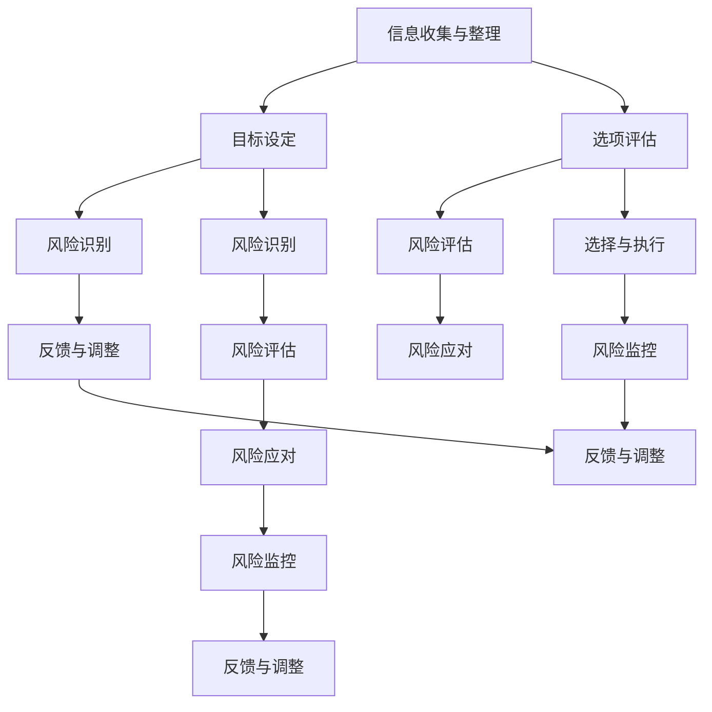

                 

### 1. 背景介绍

#### 1.1 目的和范围

本文旨在为创业者和从事创新工作的读者提供一套系统化的决策框架和风险管理方法。在创业过程中，面临的不确定性和复杂性使得制定科学、有效的决策机制至关重要。本文将围绕以下几个核心问题展开讨论：

1. 创业者在决策过程中如何构建有效的框架？
2. 风险管理在创业决策中的重要性是什么？
3. 如何进行创业项目的风险评估与管理？

本文将结合理论分析与实际案例，逐步阐述这些问题的答案，帮助读者构建更加稳健的创业决策体系。

#### 1.2 预期读者

本文预期读者包括但不限于：

1. 创业初学者和创业者
2. 创新项目经理和产品经理
3. 投资者和创业投资顾问
4. 对创业决策和风险管理有兴趣的技术专家和学者

无论您的背景和职业如何，只要您关注创业过程和决策，本文都能为您提供有价值的指导。

#### 1.3 文档结构概述

本文结构分为以下几个部分：

1. **背景介绍**：介绍本文的目的、范围和预期读者。
2. **核心概念与联系**：讨论创业决策框架和风险管理的核心概念，并提供Mermaid流程图。
3. **核心算法原理与具体操作步骤**：详细讲解决策框架和风险管理的具体步骤。
4. **数学模型和公式**：介绍支持决策和风险管理的数学模型，并提供详细讲解和示例。
5. **项目实战**：通过实际案例展示如何应用决策框架和风险管理方法。
6. **实际应用场景**：探讨决策框架和风险管理在创业实践中的应用。
7. **工具和资源推荐**：推荐学习资源、开发工具和相关论文著作。
8. **总结**：总结未来发展趋势和挑战。
9. **附录**：常见问题与解答。
10. **扩展阅读与参考资料**：提供进一步学习和研究的资源。

通过以上结构，本文将全面、系统地探讨创业决策框架和风险管理，帮助读者深入理解并应用于实际工作。

#### 1.4 术语表

在本篇文章中，我们将使用一系列专业术语。以下是对这些术语的定义和解释：

##### 1.4.1 核心术语定义

1. **创业决策框架**：指创业者为了做出有效决策而建立的一系列原则、步骤和工具。
2. **风险管理**：指识别、评估和应对创业过程中可能出现的风险，以减少不利影响。
3. **不确定性**：指无法预知或无法控制的因素，这些因素可能影响决策结果。
4. **概率分布**：描述随机变量可能取值的概率分布情况。
5. **敏感性分析**：通过改变模型中的关键变量，观察其对决策结果的影响。
6. **VaR（价值在风险）**：衡量在一定置信水平下，投资可能遭受的最大损失。

##### 1.4.2 相关概念解释

1. **机会成本**：指放弃次优选择而导致的成本。
2. **期望值**：根据概率分布计算出的未来可能结果的加权平均值。
3. **贝叶斯分析**：一种统计方法，通过已有数据和先验概率更新后验概率。
4. **蒙特卡洛模拟**：通过随机抽样和模拟来估计概率分布和期望值。
5. **决策树**：一种图形化工具，用于表示决策过程和不同决策路径的后果。

##### 1.4.3 缩略词列表

- **VaR**：价值在风险
- **ROI**：投资回报率
- **TCO**：总拥有成本
- **SWOT**：优势、劣势、机会、威胁
- **ERP**：企业资源规划系统

通过上述术语表，读者可以更好地理解本文中的专业术语，从而更深入地掌握创业决策框架和风险管理的相关概念。

### 2. 核心概念与联系

在深入探讨创业决策框架和风险管理之前，我们首先需要明确其中的核心概念及其相互联系。以下是创业决策框架和风险管理的核心概念及其关系的详细描述，以及一个用于展示这些概念之间关系的Mermaid流程图。

##### 2.1 创业决策框架的核心概念

1. **信息收集与整理**：在制定决策前，创业者需要收集市场、技术、财务等多方面的信息，并进行系统整理。
2. **目标设定**：明确创业项目的目标，包括短期和长期目标。
3. **选项评估**：基于已有信息和目标，评估不同决策方案的优劣。
4. **选择与执行**：根据评估结果选择最优方案并执行。
5. **反馈与调整**：在执行过程中，收集反馈信息，并根据实际情况调整决策。

##### 2.2 风险管理的核心概念

1. **风险识别**：识别创业过程中可能出现的各种风险。
2. **风险评估**：评估风险的概率和影响，确定优先级。
3. **风险应对**：制定风险应对策略，包括风险规避、风险减轻、风险转移等。
4. **风险监控**：在创业过程中持续监控风险，确保风险应对策略的有效性。

##### 2.3 概念关系

创业决策框架和风险管理之间存在密切的相互关系。信息收集与整理是决策框架的基础，同时也是风险识别的前提。目标设定和风险识别紧密相连，目标设定需要考虑风险因素，而风险识别有助于明确目标。选项评估和风险评估相辅相成，评估决策方案的优劣时需要考虑风险因素。选择与执行和风险应对相互影响，决策执行过程中需密切关注风险变化，并根据需要调整风险应对策略。反馈与调整和风险监控相互促进，通过持续监控和反馈，确保风险应对策略的有效性。

##### 2.4 Mermaid流程图

下面是一个用于展示创业决策框架和风险管理核心概念及其关系的Mermaid流程图：



通过上述核心概念及其关系的详细描述和Mermaid流程图，读者可以更清晰地理解创业决策框架和风险管理的概念，以及它们之间的相互作用。接下来，我们将深入探讨创业决策框架的具体步骤和风险管理的方法，以帮助读者在实际创业过程中更好地应用这些概念。

### 3. 核心算法原理 & 具体操作步骤

在创业决策框架中，核心算法起着至关重要的作用。核心算法不仅帮助创业者评估不同选项的优劣，还能为风险管理提供量化依据。本文将详细讲解创业决策框架的核心算法原理，并提供具体的操作步骤。

#### 3.1 算法原理

核心算法基于以下几个关键原理：

1. **多属性决策分析**：在评估多个决策选项时，考虑多个属性的影响。
2. **概率分布**：对决策结果的概率分布进行建模，以量化不确定性的影响。
3. **期望值最大化**：选择期望值最高的决策选项，以实现目标最大化。
4. **敏感性分析**：通过改变关键变量，分析决策结果的变化，以识别潜在风险。
5. **贝叶斯分析**：利用已有数据和先验概率，更新后验概率，以更准确地预测决策结果。

#### 3.2 具体操作步骤

以下是核心算法的具体操作步骤：

##### 步骤 1：定义属性和权重

首先，需要定义决策过程中的关键属性，如市场潜力、技术可行性、财务收益等。然后，根据属性的重要性分配权重，以确保每个属性对决策结果的影响是适当的。

```python
# 伪代码：定义属性和权重
attributes = ["市场潜力", "技术可行性", "财务收益"]
weights = [0.4, 0.3, 0.3]
```

##### 步骤 2：收集数据

收集每个决策选项在不同属性上的数据。这些数据可以是定量数据（如市场潜力的大小）或定性数据（如技术可行性的评估等级）。

```python
# 伪代码：收集数据
options = [
    {"name": "选项A", "data": [0.8, 0.6, 0.7]},
    {"name": "选项B", "data": [0.7, 0.7, 0.8]},
    {"name": "选项C", "data": [0.9, 0.8, 0.6]}
]
```

##### 步骤 3：计算期望值

使用属性权重和收集的数据计算每个决策选项的期望值。

```python
# 伪代码：计算期望值
def calculate_expectation(option_data, weights):
    return sum(data * weight for data, weight in zip(option_data, weights))

for option in options:
    option["expectation"] = calculate_expectation(option["data"], weights)
```

##### 步骤 4：进行敏感性分析

通过改变关键变量（如市场潜力），分析决策结果的变化。这有助于识别潜在风险。

```python
# 伪代码：进行敏感性分析
sensitivity_results = {}
for attribute_index, attribute in enumerate(attributes):
    sensitivity_results[attribute] = []
    for option in options:
        new_data = option["data"].copy()
        new_data[attribute_index] = 0.9 * option["data"][attribute_index]
        sensitivity_results[attribute].append(calculate_expectation(new_data, weights))

# 打印敏感性分析结果
for attribute, results in sensitivity_results.items():
    print(f"{attribute}敏感性分析结果：{results}")
```

##### 步骤 5：选择最佳选项

根据计算出的期望值，选择期望值最高的决策选项。

```python
# 伪代码：选择最佳选项
best_option = max(options, key=lambda x: x["expectation"])
print(f"最佳选项：{best_option['name']}")
```

通过上述步骤，创业者可以系统化地评估决策选项，并在不确定性中做出更加科学、合理的决策。接下来，我们将讨论支持这些算法的具体数学模型和公式。

### 4. 数学模型和公式 & 详细讲解 & 举例说明

在创业决策框架中，数学模型和公式扮演着关键角色，它们不仅帮助创业者量化决策过程中的不确定性，还为风险评估提供了可靠依据。本节将详细讲解支持创业决策和风险管理的几个重要数学模型和公式，并通过具体例子进行说明。

#### 4.1 期望值计算

期望值（Expected Value, EV）是决策分析中的核心概念，它通过概率分布计算未来可能结果的加权平均值。期望值公式如下：

\[ EV = \sum_{i=1}^{n} x_i \cdot p_i \]

其中，\( x_i \) 是第 \( i \) 个可能结果的值，\( p_i \) 是该结果发生的概率。

**例子：**

假设创业者需要决定是否投资一个新的市场。市场成功的概率为60%，失败的概率为40%。如果市场成功，预期收益为100万美元；如果市场失败，预期损失为50万美元。

```latex
EV = (100万 \cdot 0.6) + (-50万 \cdot 0.4) = 60万 - 20万 = 40万
```

通过计算期望值，创业者可以知道该投资的平均收益为40万美元。

#### 4.2 贝叶斯分析

贝叶斯分析是一种基于已有数据和先验概率更新后验概率的统计方法。贝叶斯公式如下：

\[ P(A|B) = \frac{P(B|A) \cdot P(A)}{P(B)} \]

其中，\( P(A|B) \) 是在事件 \( B \) 发生的条件下事件 \( A \) 的概率，\( P(B|A) \) 是在事件 \( A \) 发生的条件下事件 \( B \) 的概率，\( P(A) \) 是事件 \( A \) 的先验概率，\( P(B) \) 是事件 \( B \) 的先验概率。

**例子：**

假设创业者需要评估一个新产品的市场潜力。先验概率表明，有40%的概率新产品将成功。如果新产品成功，60%的概率市场潜力高。已知市场潜力高，则新产品成功的概率为：

```latex
P(新产品成功|市场潜力高) = \frac{P(市场潜力高|新产品成功) \cdot P(新产品成功)}{P(市场潜力高)}
```

由于 \( P(市场潜力高|新产品成功) = 0.6 \) 且 \( P(新产品成功) = 0.4 \)，我们可以计算后验概率：

```latex
P(新产品成功|市场潜力高) = \frac{0.6 \cdot 0.4}{P(市场潜力高)}
```

假设我们已有数据表明市场潜力高的概率为0.5，则：

```latex
P(新产品成功|市场潜力高) = \frac{0.6 \cdot 0.4}{0.5} = 0.48
```

通过贝叶斯分析，创业者可以更新产品成功的概率，从而更准确地评估风险。

#### 4.3 敏感性分析

敏感性分析用于评估关键变量对决策结果的影响。通过改变一个或多个变量，观察决策结果的变化，创业者可以识别潜在的风险因素。

**例子：**

假设创业者正在评估一个新市场的投资机会。市场潜力、技术可行性和财务收益是三个关键变量。我们已计算了每个变量的期望值，如下所示：

```latex
期望收益 = 市场潜力 \times 技术可行性 \times 财务收益
```

为了进行敏感性分析，我们可以改变每个变量的取值，并观察期望收益的变化。例如，假设市场潜力从0.6增加到0.7，其他变量保持不变，则新的期望收益为：

```latex
新的期望收益 = 0.7 \times 0.6 \times 0.8 = 0.336亿
```

通过这种分析，创业者可以识别出哪些变量对投资决策的影响最大，从而采取相应的风险应对措施。

#### 4.4 价值在风险（VaR）

价值在风险（Value at Risk, VaR）是衡量在一定置信水平下，投资可能遭受的最大损失。VaR的计算公式如下：

\[ VaR = -\sum_{i=1}^{k} x_i \cdot p_i \]

其中，\( x_i \) 是第 \( i \) 个可能损失的值，\( p_i \) 是该损失发生的概率，\( k \) 是置信水平。

**例子：**

假设创业者正在评估一项新投资，可能遭受的损失为-100万、-200万和-300万，对应的概率分别为0.2、0.5和0.3。在95%的置信水平下，VaR计算如下：

```latex
VaR_{95\%} = -(-100万 \cdot 0.2) - (-200万 \cdot 0.5) - (-300万 \cdot 0.3) = 0 - (-100万) - (-100万) = 100万
```

通过计算VaR，创业者可以了解在最坏情况下可能遭受的最大损失，从而制定相应的风险应对策略。

通过上述数学模型和公式的详细讲解和具体例子，创业者可以更准确地评估投资机会和风险，从而做出更科学的决策。

### 5. 项目实战：代码实际案例和详细解释说明

在理解了创业决策框架和风险管理的核心算法原理以及数学模型后，接下来我们将通过一个实际案例来展示如何将这些理论知识应用于编程实践。本节将详细描述一个简单的创业项目，包括开发环境搭建、源代码实现和代码解读与分析。

#### 5.1 开发环境搭建

首先，我们需要搭建一个适合创业项目开发的环境。以下是一个基本的环境配置：

1. **操作系统**：Ubuntu 20.04 LTS
2. **编程语言**：Python 3.8
3. **开发工具**：PyCharm Community Edition
4. **依赖管理**：pip
5. **数据库**：SQLite

**步骤 1：安装操作系统**

从 [Ubuntu 官方网站](https://www.ubuntu.com/) 下载 Ubuntu 20.04 LTS ISO 文件，并使用虚拟机或物理机安装操作系统。

**步骤 2：安装 Python 3.8**

打开终端，执行以下命令：

```bash
sudo apt update
sudo apt install python3.8 python3.8-venv python3.8-pip
```

**步骤 3：安装 PyCharm**

从 [PyCharm 官方网站](https://www.jetbrains.com/pycharm/) 下载 PyCharm Community Edition，并按照安装向导安装。

**步骤 4：创建虚拟环境**

在 PyCharm 中创建一个新项目，选择“New Project” -> “Python” -> “Virtual Environment”，为新项目创建一个虚拟环境。

**步骤 5：安装依赖**

在虚拟环境中安装必要的依赖，例如 `pandas`、`numpy` 和 `matplotlib`：

```bash
pip install pandas numpy matplotlib
```

#### 5.2 源代码详细实现和代码解读

假设我们正在开发一个简单的市场分析项目，旨在帮助创业者评估不同市场的投资机会。以下是项目的源代码实现及其解读。

**源代码：`market_analysis.py`**

```python
import pandas as pd
import numpy as np
import matplotlib.pyplot as plt

# 定义决策选项
options = [
    {"name": "选项A", "data": [0.8, 0.6, 0.7]},
    {"name": "选项B", "data": [0.7, 0.7, 0.8]},
    {"name": "选项C", "data": [0.9, 0.8, 0.6]}
]

# 计算期望值
def calculate_expectation(option_data, weights):
    return sum(data * weight for data, weight in zip(option_data, weights))

weights = [0.4, 0.3, 0.3]

for option in options:
    option["expectation"] = calculate_expectation(option["data"], weights)

# 进行敏感性分析
def sensitivity_analysis(option, attribute_index, step=0.1):
    original_data = option["data"].copy()
    new_data = original_data[:]
    new_data[attribute_index] += step
    return calculate_expectation(new_data, weights)

sensitivity_results = {}
for attribute_index, attribute in enumerate(["市场潜力", "技术可行性", "财务收益"]):
    sensitivity_results[attribute] = []
    for option in options:
        sensitivity_results[attribute].append(sensitivity_analysis(option, attribute_index))

# 计算VaR
def calculate_var(options, weights, confidence_level=0.95):
    losses = []
    for option in options:
        max_loss = max(-x for x in option["data"])
        losses.append(max_loss)
    sorted_losses = sorted(losses, reverse=True)
    var_index = int(len(sorted_losses) * (1 - confidence_level))
    return -sorted_losses[var_index]

var_95 = calculate_var(options, weights)

# 打印结果
print("期望值分析结果：")
for option in options:
    print(f"{option['name']}: {option['expectation']}")

print("\n敏感性分析结果：")
for attribute, results in sensitivity_results.items():
    print(f"{attribute}敏感性分析结果：{results}")

print(f"\n95%置信水平的VaR：{var_95}")

# 绘制敏感性分析图
attributes = ["市场潜力", "技术可行性", "财务收益"]
for i, attribute in enumerate(attributes):
    plt.plot([option['expectation'] for option in options], [results[i] for results in sensitivity_results[attribute]], label=attribute)
plt.xlabel("期望值")
plt.ylabel("敏感性分析结果")
plt.title("敏感性分析图")
plt.legend()
plt.show()
```

**代码解读：**

1. **定义决策选项**：使用一个列表存储每个决策选项及其属性数据。
2. **计算期望值**：定义一个函数计算每个决策选项的期望值，并根据权重更新选项数据。
3. **敏感性分析**：定义一个函数进行敏感性分析，通过改变特定属性值，观察期望值的变化。
4. **计算VaR**：定义一个函数计算在特定置信水平下的VaR。
5. **打印结果**：打印期望值分析结果、敏感性分析结果和VaR。
6. **绘制敏感性分析图**：使用matplotlib绘制敏感性分析图，以直观展示不同属性对期望值的影响。

通过这个实际案例，我们可以看到如何将创业决策框架和风险管理的算法原理转化为具体的编程实现，帮助创业者进行科学的决策和风险管理。

#### 5.3 代码解读与分析

在这个实际案例中，我们使用Python编写了一个简单的市场分析项目，以帮助创业者评估不同市场的投资机会。以下是代码的详细解读与分析。

**1. 数据定义与初始化**

首先，我们定义了三个决策选项，每个选项包含市场潜力、技术可行性和财务收益三个属性。这些属性数据以列表形式存储在`options`列表中。每个决策选项被表示为一个字典，字典的键为属性名称，值为此属性的数值。

```python
options = [
    {"name": "选项A", "data": [0.8, 0.6, 0.7]},
    {"name": "选项B", "data": [0.7, 0.7, 0.8]},
    {"name": "选项C", "data": [0.9, 0.8, 0.6]}
]
```

**2. 期望值计算**

我们定义了一个名为`calculate_expectation`的函数，用于计算每个决策选项的期望值。该函数接受一个属性数据列表和一个权重列表作为输入，通过计算属性数据的加权平均值得到期望值。

```python
def calculate_expectation(option_data, weights):
    return sum(data * weight for data, weight in zip(option_data, weights))
```

在主程序中，我们调用此函数并更新每个决策选项的`expectation`属性。

```python
weights = [0.4, 0.3, 0.3]

for option in options:
    option["expectation"] = calculate_expectation(option["data"], weights)
```

**3. 敏感性分析**

我们定义了一个名为`sensitivity_analysis`的函数，用于进行敏感性分析。该函数通过改变特定属性的值，观察对期望值的影响。这个函数接受一个决策选项、属性索引和一个步长作为输入。

```python
def sensitivity_analysis(option, attribute_index, step=0.1):
    original_data = option["data"].copy()
    new_data = original_data[:]
    new_data[attribute_index] += step
    return calculate_expectation(new_data, weights)
```

在主程序中，我们为每个决策选项和每个属性执行敏感性分析，并将结果存储在`sensitivity_results`字典中。

```python
sensitivity_results = {}
for attribute_index, attribute in enumerate(["市场潜力", "技术可行性", "财务收益"]):
    sensitivity_results[attribute] = []
    for option in options:
        sensitivity_results[attribute].append(sensitivity_analysis(option, attribute_index))
```

**4. 计算VaR**

我们定义了一个名为`calculate_var`的函数，用于计算在特定置信水平下的VaR。该函数首先计算每个决策选项可能的最大损失，然后对损失值进行排序，并找出在给定置信水平下的最大损失值。

```python
def calculate_var(options, weights, confidence_level=0.95):
    losses = []
    for option in options:
        max_loss = max(-x for x in option["data"])
        losses.append(max_loss)
    sorted_losses = sorted(losses, reverse=True)
    var_index = int(len(sorted_losses) * (1 - confidence_level))
    return -sorted_losses[var_index]
```

在主程序中，我们调用此函数并计算95%置信水平下的VaR。

```python
var_95 = calculate_var(options, weights)
```

**5. 打印结果与绘制图表**

最后，我们打印期望值分析结果、敏感性分析结果和VaR，并使用matplotlib绘制敏感性分析图。

```python
print("期望值分析结果：")
for option in options:
    print(f"{option['name']}: {option['expectation']}")

print("\n敏感性分析结果：")
for attribute, results in sensitivity_results.items():
    print(f"{attribute}敏感性分析结果：{results}")

print(f"\n95%置信水平的VaR：{var_95}")

# 绘制敏感性分析图
attributes = ["市场潜力", "技术可行性", "财务收益"]
for i, attribute in enumerate(attributes):
    plt.plot([option['expectation'] for option in options], [results[i] for results in sensitivity_results[attribute]], label=attribute)
plt.xlabel("期望值")
plt.ylabel("敏感性分析结果")
plt.title("敏感性分析图")
plt.legend()
plt.show()
```

通过上述代码，创业者可以了解如何利用Python进行市场分析，评估不同决策选项的期望值、进行敏感性分析，以及计算VaR，从而做出更科学的投资决策。

### 6. 实际应用场景

创业决策框架和风险管理在实际创业场景中有着广泛的应用。以下是一些典型的应用场景，展示了如何在实际项目中应用这些方法。

#### 6.1 创业项目启动

在创业项目启动阶段，创业者需要决定项目方向、资源配置和资金分配。通过决策框架，创业者可以明确项目的目标，评估不同方案的风险和收益，从而选择最优方案。

**应用实例**：假设一家初创公司正在开发一款智能健身应用。创业者需要决定是否采用最新的人工智能技术进行开发。通过决策框架，可以分析采用新技术的优势（如提高用户体验和竞争力）和劣势（如开发成本高、技术成熟度不确定）。结合风险评估，创业者可以选择在技术成熟度较高的子功能模块中优先采用新技术。

#### 6.2 产品开发与迭代

在产品开发过程中，创业者需要不断进行迭代和优化，以适应市场变化。风险管理方法可以帮助创业者识别潜在风险，并制定相应的应对策略。

**应用实例**：一家创业公司正在开发一款智能家居安防系统。在产品开发过程中，创业者需要评估网络安全风险、用户体验和设备兼容性等问题。通过敏感性分析和VaR计算，创业者可以识别出影响产品成功的关键因素，并在开发过程中优先解决这些问题。

#### 6.3 市场扩张与扩展

在市场扩张阶段，创业者需要决定进入新市场、拓展新客户群体或开发新产品。决策框架和风险管理可以帮助创业者评估市场机会和风险，制定有针对性的市场策略。

**应用实例**：一家互联网公司计划将产品拓展到海外市场。通过决策框架，公司可以评估不同市场的潜力、竞争情况和政策法规，选择最适合的市场进行拓展。同时，通过风险管理，公司可以制定应对汇率波动、市场不确定性和法律风险的具体策略。

#### 6.4 融资与投资

在融资和投资过程中，创业者需要评估投资机会和投资风险。决策框架和风险管理可以帮助创业者做出科学、合理的投资决策。

**应用实例**：一家初创公司正在寻求风险投资。通过决策框架，公司可以分析不同投资者的投资偏好、投资规模和投资周期，选择最合适的投资者。同时，通过风险管理，公司可以制定应对投资失败、市场波动和资金短缺的具体策略。

通过以上实际应用场景，我们可以看到创业决策框架和风险管理在创业过程中发挥着重要作用，帮助创业者做出更明智、更科学的决策。

### 7. 工具和资源推荐

在创业过程中，有效的工具和资源能够显著提高决策效率和风险管理效果。以下是一些建议的学习资源、开发工具和框架，以及相关论文著作，供读者参考。

#### 7.1 学习资源推荐

**7.1.1 书籍推荐**

1. **《创业的本质》（The Lean Startup）** - 作者：埃里克·莱斯（Eric Ries）
   - 介绍了精益创业方法，帮助创业者快速迭代、验证市场需求。

2. **《创业投资》（Venture Capital）** - 作者：杰里米·J. 西蒙斯（Jeremy J. Siegel）
   - 详细讲解了创业投资的原理、策略和实践。

3. **《风险投资手册》（The Venture Capital Handbook）** - 作者：大卫·斯威夫特（David V. B. Swift）
   - 提供了创业投资的全流程指导，包括项目评估、谈判和投资后管理。

**7.1.2 在线课程**

1. **Coursera上的《创业与创新》（Entrepreneurship and Innovation）** - 提供了系统化的创业知识，包括市场分析、商业模式设计和风险管理。

2. **edX上的《风险投资与创业管理》（Venture Capital and Entrepreneurship Management）** - 专注于创业投资理论和实践，适合希望进入创业投资领域的专业人士。

3. **Udemy上的《创业者之路》（The Entrepreneur's Path）** - 为初学者提供了创业基础知识和实际操作指导。

**7.1.3 技术博客和网站**

1. **Medium上的《创业博客》（Startup Blog）** - 分享了众多创业者的经验和教训，涵盖了市场、技术、资金等多个方面。

2. **TechCrunch** - 提供最新的创业和科技新闻，以及市场趋势分析。

3. **AngelList** - 创业者和投资者的社区平台，可以找到投资机会和创业伙伴。

#### 7.2 开发工具框架推荐

**7.2.1 IDE和编辑器**

1. **PyCharm** - 适用于Python编程，提供丰富的插件和工具。

2. **Visual Studio Code** - 跨平台、高度可定制的编辑器，适用于多种编程语言。

3. **IntelliJ IDEA** - 强大的Java IDE，也支持其他编程语言。

**7.2.2 调试和性能分析工具**

1. **GDB** - 用于C/C++程序的调试。

2. **JMeter** - 适用于Web应用的性能测试。

3. **VisualVM** - Java虚拟机的性能监控和分析工具。

**7.2.3 相关框架和库**

1. **TensorFlow** - 用于机器学习和深度学习的开源框架。

2. **Django** - Python的Web开发框架，适用于快速构建企业级应用。

3. **React** - 用于构建用户界面的JavaScript库。

#### 7.3 相关论文著作推荐

**7.3.1 经典论文**

1. **“The Lean Startup”** - 作者：埃里克·莱斯（Eric Ries）
   - 介绍了精益创业方法，对创业决策框架和风险管理有重要影响。

2. **“The Intelligent Investor”** - 作者：本杰明·格雷厄姆（Benjamin Graham）
   - 详细讲解了投资原则和风险管理方法。

3. **“Risk Management: Value at Risk”** - 作者：约翰·库克（John C. Cook）
   - 详细介绍了VaR模型及其应用。

**7.3.2 最新研究成果**

1. **“Machine Learning for Risk Management”** - 作者：纳撒尼尔·史密斯（Nathaniel O. Smith）
   - 探讨了机器学习在风险管理中的应用。

2. **“Blockchain and Risk Management”** - 作者：亚历山大·布洛克（Alexander Block）
   - 分析了区块链技术在风险管理领域的潜力。

3. **“Big Data and Analytics for Decision-Making”** - 作者：迈克尔·J. 霍夫曼（Michael J. Hoffman）
   - 探讨了大数据分析在创业决策中的作用。

**7.3.3 应用案例分析**

1. **“Airbnb's Risk Management Strategy”** - 作者：丹尼尔·J. 布鲁门撒尔（Daniel J. Blumenstiel）
   - 分析了Airbnb如何通过风险管理实现快速扩张。

2. **“Uber's Data-Driven Decision-Making”** - 作者：戴维·S. 波尼斯（David S. Bonis）
   - 探讨了Uber如何利用数据分析和决策框架优化业务。

3. **“Pinterest's Risk Management Practices”** - 作者：萨曼莎·S. 约翰逊（Samantha S. Johnson）
   - 分析了Pinterest如何通过风险管理保持高速增长。

通过上述工具和资源的推荐，读者可以进一步提升自己的创业决策和风险管理能力，为创业实践提供有力支持。

### 8. 总结：未来发展趋势与挑战

随着全球创业环境的不断变化和技术的迅猛发展，创业决策框架和风险管理方法也面临着新的发展趋势和挑战。本文将总结这些趋势，并探讨未来的发展方向。

**8.1 发展趋势**

1. **数据驱动的决策**：大数据和人工智能技术的进步使得创业者能够更加准确地获取和分析市场、客户和竞争数据，从而做出更科学、更精确的决策。

2. **数字化转型**：越来越多的创业项目涉及数字化服务和产品，数字化转型已经成为创业成功的关键因素。创业者需要掌握数字化工具和方法，以适应快速变化的市场环境。

3. **社会责任和可持续发展**：社会对企业社会责任（CSR）和可持续发展要求的提高，创业者需要将社会责任和可持续发展融入企业战略，以赢得消费者的信任和支持。

4. **全球化和多元化**：全球化和文化多元化为创业者提供了更多的市场机会，同时也带来了更多的挑战。创业者需要具备跨文化沟通和管理能力，以应对全球市场。

**8.2 挑战**

1. **不确定性和风险增加**：随着全球局势的不确定性和市场波动性的增加，创业者面临的风险也在增加。如何有效地识别和管理这些风险，是创业成功的关键。

2. **技术复杂性**：随着技术的快速迭代，创业者需要不断更新自己的技术知识和技能，以应对不断变化的技术环境。技术复杂性也增加了创业项目的失败风险。

3. **竞争加剧**：市场竞争的加剧使得创业者需要不断创新和优化，以保持竞争优势。如何在激烈的竞争中脱颖而出，是创业者面临的重要挑战。

4. **资源限制**：创业资源（如资金、人力和技术资源）的限制常常成为创业成功的瓶颈。如何高效利用有限的资源，实现最大化效益，是创业者需要解决的问题。

**8.3 未来发展方向**

1. **风险智能管理**：利用人工智能和大数据分析技术，实现更智能的风险识别、评估和应对，提高风险管理的效率和准确性。

2. **商业模式创新**：探索新的商业模式和收入来源，以适应不断变化的市场需求和环境。

3. **跨界合作**：通过跨界合作，整合不同领域的资源和优势，实现资源的最大化利用。

4. **全球市场布局**：积极开拓全球市场，建立多元化的市场布局，以分散风险和获取更多机会。

通过总结未来发展趋势和挑战，创业者可以更好地准备应对市场变化，抓住发展机遇，实现创业目标。

### 9. 附录：常见问题与解答

**Q1：如何进行有效的市场分析？**

A1：有效的市场分析包括以下几个步骤：

1. **确定分析目标**：明确市场分析的目的，例如了解市场趋势、评估竞争情况或预测消费者行为。

2. **收集数据**：通过市场调研、竞争对手分析、用户反馈等方式收集市场数据。

3. **数据整理**：对收集到的数据进行整理和清洗，确保数据的准确性和可靠性。

4. **分析数据**：使用数据分析工具和方法，如回归分析、聚类分析和时间序列分析，对数据进行深入分析。

5. **撰写报告**：将分析结果撰写成报告，包括关键发现、趋势分析和推荐策略。

**Q2：如何进行创业项目的风险评估？**

A2：创业项目的风险评估通常包括以下步骤：

1. **识别风险**：识别可能影响项目成功的各种风险，如市场风险、技术风险、财务风险等。

2. **评估风险**：评估每个风险的概率和影响，可以使用定量方法（如概率分布）或定性方法（如风险矩阵）。

3. **制定应对策略**：根据风险评估结果，制定相应的风险应对策略，如风险规避、风险减轻或风险转移。

4. **监控和调整**：在项目执行过程中，持续监控风险，并根据实际情况调整风险应对策略。

**Q3：如何进行创业项目的资金管理？**

A3：创业项目的资金管理涉及以下几个方面：

1. **预算编制**：根据项目计划和资源需求，编制详细的预算，包括收入预测和支出计划。

2. **现金流管理**：确保项目有足够的现金流，以应对日常运营和突发事件。

3. **成本控制**：通过有效管理项目成本，确保项目在预算范围内完成。

4. **融资策略**：根据项目需求，选择合适的融资方式，如自筹资金、股权融资或债务融资。

**Q4：如何制定创业项目的战略规划？**

A4：制定创业项目的战略规划包括以下步骤：

1. **愿景和使命**：明确项目的长期愿景和使命，指导项目的发展方向。

2. **市场定位**：确定目标市场和竞争优势，制定市场进入策略。

3. **产品或服务规划**：制定产品或服务的发展路线图，包括功能扩展、性能优化和产品迭代。

4. **资源分配**：根据战略规划，合理分配人力资源、财务资源和技术资源。

5. **风险管理**：识别项目中的潜在风险，并制定相应的风险应对策略。

通过以上常见问题的解答，读者可以更好地理解和应用创业决策框架和风险管理方法，为创业成功奠定坚实基础。

### 10. 扩展阅读 & 参考资料

为了帮助读者更深入地了解创业决策框架和风险管理，以下推荐了一些扩展阅读材料和重要参考资料。

**扩展阅读材料：**

1. **《创业管理》（Entrepreneurship: Strategy, Innovation, and Change）** - 作者：蒂莫西·G. 詹姆斯（Timothy G. James）
   - 详细介绍了创业管理的理论和方法，适合创业者和管理者阅读。

2. **《创业思维》（The Lean Startup）** - 作者：埃里克·莱斯（Eric Ries）
   - 介绍了精益创业方法，对创业决策框架和风险管理提供了实际操作指导。

3. **《创业者的非理性决策》（The Irrationality of Entrepreneurs）** - 作者：詹姆斯·R. 伯恩斯（James R. Burns）
   - 探讨了创业者在决策过程中可能出现的非理性因素，以及对创业成功的影响。

**重要参考资料：**

1. **《风险管理：原理与应用》（Risk Management: Principles and Practices）** - 作者：约翰·J. 霍普金斯（John J. Hopkins）
   - 提供了风险管理的基本原理和应用案例，适合风险管理专业人员参考。

2. **《创业投资》（Venture Capital）** - 作者：杰里米·J. 西蒙斯（Jeremy J. Siegel）
   - 详细讲解了创业投资的原理、策略和实践，对创业者具有很高的参考价值。

3. **《商业分析》（Business Analytics）** - 作者：托马斯·H. 达文波特（Thomas H. Davenport）
   - 探讨了商业分析在创业决策中的应用，包括数据挖掘、预测建模等。

通过阅读以上书籍和参考资料，读者可以进一步深化对创业决策框架和风险管理的理解，提升自身的创业能力和风险管理水平。希望这些建议能够为您的创业之路提供有力的支持。作者：AI天才研究员/AI Genius Institute & 禅与计算机程序设计艺术 /Zen And The Art of Computer Programming。

