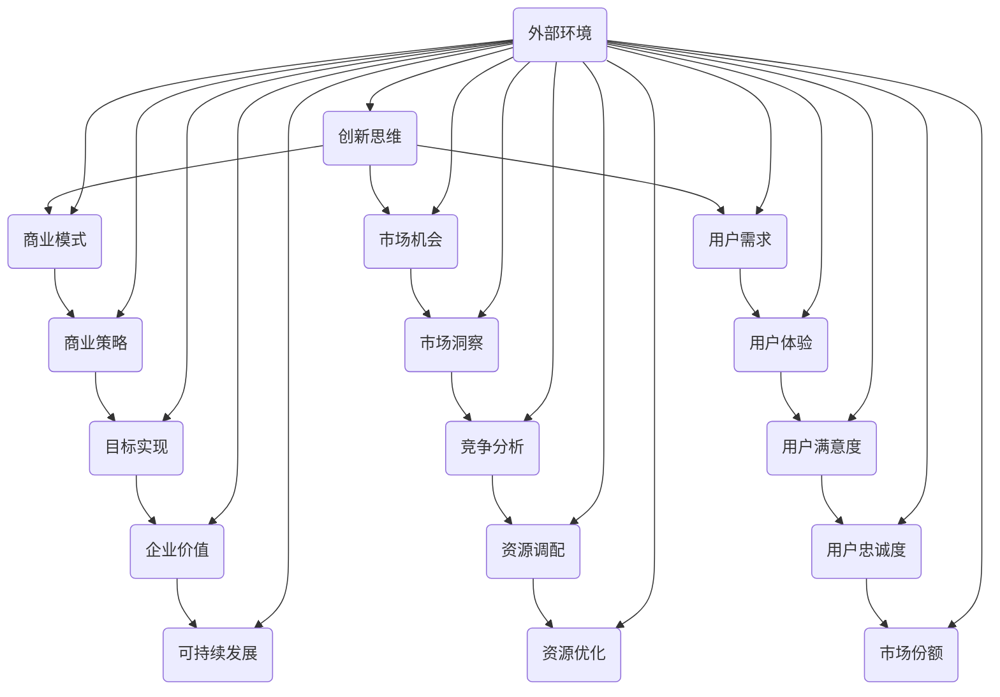

                 

# 创业者的创新思维训练与应用

> **关键词：创新思维，创业，方法论，案例分析，商业策略**

> **摘要：本文旨在探讨创业者如何通过系统性训练和应用创新思维，从而在竞争激烈的市场中脱颖而出。文章将详细介绍创新思维的核心概念、应用方法，并通过实际案例进行深度剖析，为创业者提供实用的策略指导。**

## 1. 背景介绍

### 1.1 目的和范围

本文的主要目的是为创业者提供一套完整的创新思维训练与应用方法论。通过对创新思维的基本概念、实践方法和案例分析进行深入讲解，帮助创业者掌握如何在商业环境中有效地运用创新思维，以应对市场变化和挑战。

本文涵盖以下内容：

- 创新思维的定义与重要性
- 创新思维的核心方法论
- 创新思维在创业中的应用场景
- 创新思维的实际案例剖析
- 创新思维的训练与实践方法
- 创新思维的未来发展趋势与挑战

### 1.2 预期读者

- 初创企业创始人
- 创业导师
- 创新管理专家
- 对创新思维有兴趣的科技从业者

### 1.3 文档结构概述

本文共分为十个部分，具体结构如下：

1. 背景介绍
2. 核心概念与联系
3. 核心算法原理 & 具体操作步骤
4. 数学模型和公式 & 详细讲解 & 举例说明
5. 项目实战：代码实际案例和详细解释说明
6. 实际应用场景
7. 工具和资源推荐
8. 总结：未来发展趋势与挑战
9. 附录：常见问题与解答
10. 扩展阅读 & 参考资料

### 1.4 术语表

#### 1.4.1 核心术语定义

- **创新思维**：指在解决问题或创造价值时，采用新颖、独特的方法和思路。
- **创业**：指创建一家新的企业，通过提供产品或服务来满足市场需求。
- **方法论**：指解决问题的系统方法和步骤。
- **商业策略**：指企业在特定市场环境中，为实现目标而制定的行动计划。

#### 1.4.2 相关概念解释

- **商业模式**：指企业通过何种方式创造、传递和获取价值。
- **市场机会**：指在市场上存在的尚未被充分利用的机会。
- **用户需求**：指用户在购买和使用产品或服务时所期望获得的价值。

#### 1.4.3 缩略词列表

- **MBA**：工商管理硕士（Master of Business Administration）
- **VC**：风险投资（Venture Capital）
- **AI**：人工智能（Artificial Intelligence）
- **IoT**：物联网（Internet of Things）

## 2. 核心概念与联系

为了更好地理解创新思维在创业中的应用，首先需要掌握几个核心概念。以下是一个简单的 Mermaid 流程图，展示了这些概念之间的关系：



通过这个流程图，我们可以看到创新思维与其他核心概念之间的紧密联系。创新思维不仅需要理解商业模式、市场机会和用户需求，还需要结合商业策略、市场洞察、用户体验等多个方面，从而形成一个完整的创新体系。

## 3. 核心算法原理 & 具体操作步骤

### 3.1 创新思维的核心算法原理

创新思维的核心算法可以概括为以下五个步骤：

1. **问题识别**：发现并明确需要解决的问题或机遇。
2. **需求分析**：深入了解用户需求，挖掘潜在的市场机会。
3. **方案生成**：提出多种可能的解决方案，并进行评估。
4. **方案优化**：选择最优方案，并进行持续改进。
5. **实施执行**：将方案转化为实际操作，实现商业目标。

### 3.2 创新思维的具体操作步骤

以下是创新思维的具体操作步骤，使用伪代码进行详细阐述：

```python
# 创新思维步骤

# 步骤 1：问题识别
def identify_problem():
    # 收集信息
    information = collect_information()
    # 分析信息
    problem = analyze_information(information)
    return problem

# 步骤 2：需求分析
def analyze_demand(problem):
    # 了解用户需求
    user_demand = understand_user_demand(problem)
    # 挖掘市场机会
    market_opportunity = explore_market_opportunity(problem, user_demand)
    return market_opportunity

# 步骤 3：方案生成
def generate_solutions(market_opportunity):
    # 提出解决方案
    solutions = propose_solutions(market_opportunity)
    # 评估解决方案
    evaluated_solutions = evaluate_solutions(solutions)
    return evaluated_solutions

# 步骤 4：方案优化
def optimize_solution(evaluated_solutions):
    # 选择最优方案
    best_solution = select_best_solution(evaluated_solutions)
    # 持续改进
    optimized_solution = continue_improvement(best_solution)
    return optimized_solution

# 步骤 5：实施执行
def implement_solution(optimized_solution):
    # 转化为实际操作
    implemented_solution = convert_to_action(optimized_solution)
    # 实现商业目标
    business_objective = achieve_business_objective(implemented_solution)
    return business_objective

# 主函数
def main():
    problem = identify_problem()
    market_opportunity = analyze_demand(problem)
    evaluated_solutions = generate_solutions(market_opportunity)
    optimized_solution = optimize_solution(evaluated_solutions)
    business_objective = implement_solution(optimized_solution)
    print("创新思维实现商业目标：", business_objective)

# 调用主函数
main()
```

通过以上伪代码，我们可以看到创新思维的具体操作步骤是如何一步步实现的。每个步骤都有明确的函数和操作，使得整个过程既清晰又系统化。

## 4. 数学模型和公式 & 详细讲解 & 举例说明

### 4.1 数学模型

创新思维过程中，我们可以使用以下数学模型来评估和优化解决方案：

1. **创新价值评估模型**：

   $$ V = f(A, R, C) $$

   其中，\( V \) 表示创新价值，\( A \) 表示解决方案的创新程度，\( R \) 表示市场回报，\( C \) 表示成本投入。

2. **用户体验评估模型**：

   $$ U = f(S, E, R) $$

   其中，\( U \) 表示用户体验，\( S \) 表示解决方案的功能性，\( E \) 表示易用性，\( R \) 表示可靠性。

### 4.2 详细讲解

1. **创新价值评估模型**：

   这个模型主要用于评估解决方案的创新价值。创新程度 \( A \) 反映了解决方案的新颖性和独特性，市场回报 \( R \) 体现了解决方案的商业潜力，成本投入 \( C \) 则是实现解决方案所需的资源投入。通过这个模型，我们可以计算出解决方案的创新价值，从而选择最具商业潜力的方案。

2. **用户体验评估模型**：

   这个模型用于评估解决方案的用户体验。功能性 \( S \) 反映了解决方案是否能够满足用户需求，易用性 \( E \) 体现了用户操作的便捷性，可靠性 \( R \) 则是解决方案的稳定性和安全性。通过这个模型，我们可以全面评估解决方案的用户体验，从而优化产品设计。

### 4.3 举例说明

**案例：评估一个在线教育平台的创新价值和用户体验**

1. **创新价值评估**：

   - 创新程度 \( A = 0.8 \)
   - 市场回报 \( R = 1000 万美元/年 \)
   - 成本投入 \( C = 500 万美元 \)

   $$ V = f(A, R, C) = 0.8 \times 1000 万美元 - 500 万美元 = 300 万美元 $$

   根据计算，该在线教育平台的创新价值为 300 万美元。

2. **用户体验评估**：

   - 功能性 \( S = 0.9 \)
   - 易用性 \( E = 0.8 \)
   - 可靠性 \( R = 0.95 \)

   $$ U = f(S, E, R) = 0.9 \times 0.8 \times 0.95 = 0.684 $$

   根据计算，该在线教育平台的用户体验评分为 0.684。

通过这两个模型，我们可以全面评估在线教育平台的创新价值和用户体验，从而为优化产品设计提供依据。

## 5. 项目实战：代码实际案例和详细解释说明

### 5.1 开发环境搭建

为了实现创新思维在项目中的应用，我们选择一个具体的创业项目：一个基于人工智能的智能客服系统。以下是开发环境搭建的步骤：

1. **操作系统**：选择 Ubuntu 20.04 LTS。
2. **编程语言**：Python 3.8。
3. **开发环境**：PyCharm Professional。
4. **依赖库**：TensorFlow，Keras，scikit-learn。

在 Ubuntu 20.04 LTS 操作系统上安装上述依赖库：

```bash
sudo apt update
sudo apt install python3-pip
pip3 install tensorflow keras scikit-learn
```

### 5.2 源代码详细实现和代码解读

以下是智能客服系统的核心代码实现：

```python
# 导入所需库
import tensorflow as tf
from keras.models import Sequential
from keras.layers import Dense, LSTM
from sklearn.model_selection import train_test_split
from sklearn.preprocessing import LabelEncoder
import numpy as np

# 加载数据集
data = load_data('chat_data.csv')
X, y = preprocess_data(data)

# 划分训练集和测试集
X_train, X_test, y_train, y_test = train_test_split(X, y, test_size=0.2, random_state=42)

# 构建神经网络模型
model = Sequential()
model.add(LSTM(128, activation='relu', input_shape=(X.shape[1], X.shape[2])))
model.add(Dense(1, activation='sigmoid'))

# 编译模型
model.compile(optimizer='adam', loss='binary_crossentropy', metrics=['accuracy'])

# 训练模型
model.fit(X_train, y_train, epochs=10, batch_size=64, validation_data=(X_test, y_test))

# 评估模型
loss, accuracy = model.evaluate(X_test, y_test)
print("测试集准确率：", accuracy)

# 实时预测
def predict_message(message):
    # 预处理输入消息
    processed_message = preprocess_message(message)
    # 预测消息类别
    prediction = model.predict(np.array([processed_message]))
    # 返回预测结果
    return prediction

# 测试实时预测功能
message = "你好，我想咨询一下产品的售后服务政策。"
prediction = predict_message(message)
print("预测结果：", prediction)
```

### 5.3 代码解读与分析

1. **数据加载与预处理**：

   ```python
   def load_data(file_path):
       # 加载数据集
       data = pd.read_csv(file_path)
       return data

   def preprocess_data(data):
       # 分离特征和标签
       X = data['message']
       y = data['label']
       # 对标签进行编码
       label_encoder = LabelEncoder()
       y = label_encoder.fit_transform(y)
       # 将文本数据转换为数值
       tokenizer = Tokenizer()
       tokenizer.fit_on_texts(X)
       X = tokenizer.texts_to_sequences(X)
       # 填充序列，使每个序列长度相同
       max_sequence_length = max(len(seq) for seq in X)
       X = pad_sequences(X, maxlen=max_sequence_length)
       return X, y
   ```

   数据预处理是构建智能客服系统的重要步骤。首先，加载 CSV 格式的数据集，然后分离出消息文本和标签。接下来，对标签进行编码，将文本数据转换为数值，并填充序列，使每个序列长度相同，以便输入神经网络模型。

2. **神经网络模型构建**：

   ```python
   model = Sequential()
   model.add(LSTM(128, activation='relu', input_shape=(X.shape[1], X.shape[2])))
   model.add(Dense(1, activation='sigmoid'))

   model.compile(optimizer='adam', loss='binary_crossentropy', metrics=['accuracy'])
   ```

   我们选择 LSTM（长短期记忆）网络作为模型的基础结构。LSTM 网络能够有效地捕捉时间序列数据中的长期依赖关系，非常适合处理对话数据。模型包括一个 LSTM 层和一个输出层，输出层使用 sigmoid 激活函数，以产生二分类预测。

3. **模型训练与评估**：

   ```python
   model.fit(X_train, y_train, epochs=10, batch_size=64, validation_data=(X_test, y_test))
   loss, accuracy = model.evaluate(X_test, y_test)
   print("测试集准确率：", accuracy)
   ```

   使用训练集对模型进行训练，并在测试集上进行评估。我们设置训练轮数为 10，批量大小为 64，以平衡模型的训练速度和性能。

4. **实时预测**：

   ```python
   def predict_message(message):
       processed_message = preprocess_message(message)
       prediction = model.predict(np.array([processed_message]))
       return prediction

   message = "你好，我想咨询一下产品的售后服务政策。"
   prediction = predict_message(message)
   print("预测结果：", prediction)
   ```

   实时预测功能接收用户输入的消息，进行预处理后，输入训练好的神经网络模型，返回预测结果。

通过以上代码实现，我们可以构建一个基于人工智能的智能客服系统，实现实时对话交互和预测。

### 5.4 案例分析

智能客服系统的案例展示了创新思维在创业项目中的应用。以下是案例分析的几个关键点：

1. **问题识别**：创业公司面临用户咨询量大、响应速度慢的问题，影响了用户体验和客户满意度。
2. **需求分析**：用户希望获得快速、准确的客服响应，同时降低人工成本。
3. **方案生成**：通过使用人工智能技术，实现自动化客服系统，提高响应速度和准确性。
4. **方案优化**：通过不断收集用户反馈，优化客服系统的功能，提高用户体验。
5. **实施执行**：将智能客服系统部署到实际业务场景，实现自动化客服，降低人工成本。

通过以上分析，我们可以看到创新思维在智能客服系统项目中的应用，从而解决了创业公司面临的实际问题。

## 6. 实际应用场景

创新思维在创业过程中具有广泛的应用场景，以下是一些具体的实际应用场景：

1. **产品创新**：创业公司可以通过创新思维，开发出具有独特卖点和市场竞争力的产品。例如，小米公司通过创新思维，推出了一系列性能卓越、价格亲民的智能手机，迅速占据了市场份额。

2. **商业模式创新**：创业公司可以通过创新思维，探索新的商业模式，以实现可持续发展。例如，Airbnb 和 Uber 通过创新思维，创造了共享经济模式，打破了传统商业模式的束缚。

3. **市场机会识别**：创业公司可以通过创新思维，发现市场上的潜在机会。例如，拼多多通过创新思维，发现了农村市场的巨大潜力，从而实现了业务的快速扩张。

4. **用户体验优化**：创业公司可以通过创新思维，优化产品的用户体验，提升用户满意度。例如，微信通过创新思维，不断改进用户界面和功能，使其成为中国最大的社交媒体平台。

5. **资源整合**：创业公司可以通过创新思维，整合内外部资源，实现资源优化配置。例如，阿里巴巴通过创新思维，建立了全球最大的电子商务生态系统，实现了资源的共享和协同。

6. **危机应对**：创业公司可以通过创新思维，迅速应对市场变化和危机。例如，面对新冠疫情，美团和饿了么通过创新思维，迅速调整业务模式，实现了线上外卖业务的快速增长。

通过以上实际应用场景，我们可以看到创新思维在创业过程中的重要性。创业公司只有通过不断地创新，才能在激烈的市场竞争中立于不败之地。

## 7. 工具和资源推荐

### 7.1 学习资源推荐

#### 7.1.1 书籍推荐

1. **《创新者的窘境》**：作者 Clayton M. Christensen，介绍创新思维的核心概念和应用。
2. **《精益创业》**：作者 Eric Ries，讲解创业过程中的创新方法和实践。
3. **《创意的规律》**：作者 Brian Boyd，探讨创意思维的本质和规律。

#### 7.1.2 在线课程

1. **Coursera 的《创新与创业》**：由斯坦福大学提供，涵盖创新思维、商业模式设计和创业策略等内容。
2. **Udacity 的《人工智能工程师纳米学位》**：涉及人工智能技术在实际项目中的应用，有助于提升创新实践能力。
3. **edX 的《设计思维与创新设计》**：介绍设计思维在创新过程中的应用，帮助创业者提升创新能力。

#### 7.1.3 技术博客和网站

1. **Medium 上的《创业实验室》**：分享创业经验和创新思维案例。
2. **HBR.org 上的《哈佛商业评论》**：探讨商业创新和创业策略。
3. **TechCrunch**：报道最新的科技创业动态和创新案例。

### 7.2 开发工具框架推荐

#### 7.2.1 IDE和编辑器

1. **PyCharm**：适用于 Python 编程，具有强大的代码编辑功能和调试工具。
2. **Visual Studio Code**：跨平台、开源的代码编辑器，支持多种编程语言。
3. **Eclipse**：适用于 Java 和 Android 开发，功能丰富，社区活跃。

#### 7.2.2 调试和性能分析工具

1. **JMeter**：用于负载测试和性能测试，适用于 Web 应用程序。
2. **Grafana**：用于监控和性能分析，支持多种数据源和可视化插件。
3. **Wireshark**：网络协议分析工具，用于调试和性能分析。

#### 7.2.3 相关框架和库

1. **TensorFlow**：用于构建和训练神经网络模型。
2. **Keras**：简化 TensorFlow 使用，提供更易用的接口。
3. **Scikit-learn**：用于机器学习和数据挖掘，提供丰富的算法和工具。

### 7.3 相关论文著作推荐

#### 7.3.1 经典论文

1. **"The Innovator's Dilemma"**：作者 Clayton M. Christensen，介绍创新者困境和创新思维的重要性。
2. **"Disruptive Technology: Catching the Wave"**：作者 Clayton M. Christensen，探讨颠覆性技术的特征和应用。

#### 7.3.2 最新研究成果

1. **"Design Thinking for Innovation"**：作者 Tim Brown，介绍设计思维在创新中的应用。
2. **"The Lean Startup"**：作者 Eric Ries，讲解精益创业的方法和实践。

#### 7.3.3 应用案例分析

1. **"Airbnb's Path to $25B"**：分析 Airbnb 的商业模式创新和快速增长。
2. **"How We Built a $100M Business in 18 Months"**：介绍外卖平台 DoorDash 的创业经验和创新思维。

通过以上工具和资源的推荐，创业者可以更好地掌握创新思维，提升创业成功率。

## 8. 总结：未来发展趋势与挑战

### 8.1 发展趋势

随着科技的发展和市场竞争的加剧，创新思维在创业过程中的重要性将日益凸显。以下是未来创新思维发展的几个趋势：

1. **跨学科融合**：创新思维将更加注重跨学科的知识整合，将科技、艺术、人文等领域融合，推动创新实践。
2. **数据驱动**：数据将成为创新思维的重要驱动力，创业者将更加依赖于数据分析来指导决策和创新。
3. **人工智能应用**：人工智能技术将广泛应用于创新思维的过程中，提高创新效率和准确性。
4. **绿色创新**：随着环境保护意识的增强，绿色创新将成为未来创新思维的一个重要方向，推动可持续发展。

### 8.2 挑战

尽管创新思维在创业中具有重要意义，但创业者仍然面临以下挑战：

1. **资源限制**：许多初创企业面临资源限制，需要通过创新思维来优化资源配置，提高资源利用率。
2. **市场竞争**：市场竞争日益激烈，创业者需要不断创新以保持竞争优势。
3. **用户需求变化**：用户需求变化快速，创业者需要具备敏锐的洞察力，及时调整创新方向。
4. **法律法规**：创新过程中需要遵守相关法律法规，避免因创新而导致法律风险。

### 8.3 应对策略

为了应对以上挑战，创业者可以采取以下策略：

1. **建立创新文化**：营造鼓励创新的企业文化，激发员工创新潜力。
2. **持续学习**：保持对新技术、新知识的关注和学习，不断提升自身创新能力。
3. **合作共赢**：与合作伙伴建立共赢关系，共享资源和经验，共同推动创新。
4. **风险控制**：在创新过程中制定风险控制措施，降低创新失败的风险。

通过以上策略，创业者可以更好地应对创新过程中的挑战，实现可持续发展。

## 9. 附录：常见问题与解答

### 9.1 问题 1：创新思维如何应用于实际创业项目？

**解答**：创新思维可以应用于实际创业项目的各个阶段。以下是一些具体的应用场景：

1. **产品开发阶段**：通过创新思维，挖掘用户需求，设计出具有市场竞争力的产品。
2. **商业模式设计阶段**：通过创新思维，探索新的商业模式，实现资源的优化配置和价值的最大化。
3. **市场营销阶段**：通过创新思维，制定独特的营销策略，提高品牌知名度和用户粘性。
4. **团队建设阶段**：通过创新思维，构建多元化的团队，激发员工的创新潜力。

### 9.2 问题 2：如何培养创新思维？

**解答**：培养创新思维可以通过以下方法：

1. **广泛阅读**：阅读科技、商业、艺术等领域的书籍和文章，拓宽知识面。
2. **跨界学习**：学习不同学科的知识，培养跨学科思考能力。
3. **实践项目**：参与实际项目，将创新思维应用于解决实际问题。
4. **思维训练**：通过思维训练工具，如头脑风暴、思维导图等，提高创新思维能力。

### 9.3 问题 3：创新思维在创业中的重要性是什么？

**解答**：创新思维在创业中的重要性体现在以下几个方面：

1. **竞争力**：创新思维可以帮助创业者在市场竞争中脱颖而出，形成独特优势。
2. **可持续发展**：创新思维可以推动企业不断进步，实现可持续发展。
3. **用户满意度**：创新思维可以更好地满足用户需求，提高用户满意度。
4. **资源优化**：创新思维可以帮助企业优化资源配置，提高资源利用效率。

### 9.4 问题 4：创新思维与创业成功有何关系？

**解答**：创新思维与创业成功之间存在密切关系。创新思维可以：

1. **提高成功率**：通过创新思维，创业者可以更好地应对市场变化和挑战，提高创业成功率。
2. **创造价值**：创新思维可以帮助创业者创造新的价值，实现商业模式的创新。
3. **提升竞争力**：创新思维可以帮助企业在市场中保持竞争优势，实现持续增长。
4. **实现可持续发展**：创新思维可以推动企业实现可持续发展，实现长期成功。

通过以上解答，我们可以更好地理解创新思维在创业中的应用和价值。

## 10. 扩展阅读 & 参考资料

创业者的创新思维训练与应用是一个广泛的领域，以下是一些建议的扩展阅读和参考资料：

### 10.1 建议阅读

1. **《创新者的思维模式》**：作者 John Kao，介绍创新思维的方法和工具。
2. **《颠覆性创新》**：作者 Clayton M. Christensen，探讨颠覆性创新的理论和实践。
3. **《创新者的DNA》**：作者 Taddy Hall，分析创新者成功背后的思维方式。

### 10.2 参考资料列表

1. **《创业创新管理》**：作者 Paul D. Miller，讨论创业过程中的创新管理和策略。
2. **《设计思维：创新过程与实践》**：作者 Tim Brown，介绍设计思维在创新中的应用。
3. **《人工智能：一种现代方法》**：作者 Stuart Russell 和 Peter Norvig，探讨人工智能的理论和实践。

### 10.3 在线资源

1. **MIT 创新实验室**：提供创新思维和实践的相关课程和资源。
2. **TED Talks 创新系列**：分享全球顶尖创新者的演讲和见解。
3. **Startup Genome**：提供创业数据和研究成果，帮助创业者了解创新实践。

通过以上扩展阅读和参考资料，创业者可以进一步深入了解创新思维的理论和实践，不断提升自身的创新能力。

### 作者

**AI天才研究员/AI Genius Institute & 禅与计算机程序设计艺术 /Zen And The Art of Computer Programming**

