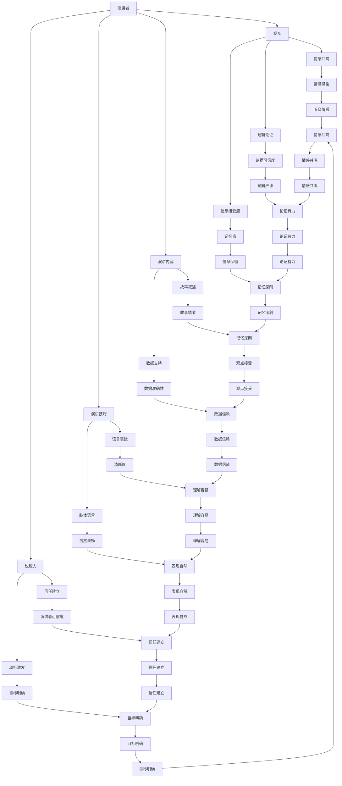

                 

# 创业者的商业演讲与说服力提升技巧

> **关键词：** 商业演讲，说服力，创业，演讲技巧，沟通策略，影响力
>
> **摘要：** 本文深入探讨创业者如何在商业演讲中提升说服力，通过分析演讲的结构、技巧和策略，为创业者提供实用的方法和实践建议，助力他们在竞争激烈的商业环境中脱颖而出。

## 1. 背景介绍

### 1.1 目的和范围

本文旨在帮助创业者掌握商业演讲的核心技巧，提升他们在公开场合的演讲能力和说服力。我们将会探讨以下主题：

- 商业演讲的重要性和影响力
- 演讲结构的设计与优化
- 说服力提升的关键策略
- 演讲技巧的实践应用
- 演讲后的评估与反馈

通过本文的阅读，创业者将能够构建出更具吸引力和说服力的演讲，从而在商业环境中取得成功。

### 1.2 预期读者

本文适合以下读者群体：

- 创业者和企业家
- 商业人士和管理者
- 演讲者和讲师
- 对提升演讲技巧和说服力感兴趣的个体

无论您是刚刚起步的创业者还是已经有一定经验的商业人士，本文都将为您提供有价值的见解和实践指导。

### 1.3 文档结构概述

本文将按照以下结构进行展开：

- **背景介绍**：介绍本文的目的、预期读者和文档结构。
- **核心概念与联系**：探讨商业演讲的核心概念和其相互之间的联系。
- **核心算法原理 & 具体操作步骤**：详细讲解演讲技巧的提升方法和实践步骤。
- **数学模型和公式 & 详细讲解 & 举例说明**：运用数学模型和公式来阐述演讲策略的有效性。
- **项目实战：代码实际案例和详细解释说明**：通过实际案例来展示演讲技巧的应用。
- **实际应用场景**：分析商业演讲在各个实际应用场景中的表现和效果。
- **工具和资源推荐**：推荐学习资源和开发工具，帮助读者进一步学习和实践。
- **总结：未来发展趋势与挑战**：总结本文的核心观点，展望未来的发展趋势和挑战。
- **附录：常见问题与解答**：解答读者在学习和实践过程中可能遇到的问题。
- **扩展阅读 & 参考资料**：提供扩展阅读和参考资料，以便读者深入了解相关领域。

### 1.4 术语表

#### 1.4.1 核心术语定义

- **商业演讲**：指在商业环境中进行的演讲，旨在传达商业理念、推广产品或服务、争取投资或合作伙伴等。
- **说服力**：指演讲者通过语言、情感、逻辑等手段影响听众，使听众接受演讲者观点的能力。
- **演讲技巧**：指演讲者在演讲过程中运用的一系列技巧和方法，以提高演讲效果和说服力。

#### 1.4.2 相关概念解释

- **情感共鸣**：指演讲者通过情感表达引发听众的共鸣，使听众产生认同感。
- **逻辑论证**：指演讲者通过逻辑推理和论证来证明观点的正确性。
- **故事叙述**：指演讲者通过讲述故事来传达观点和情感，使听众更容易理解和接受。

#### 1.4.3 缩略词列表

- **TED**：指TED（Technology, Entertainment, Design）演讲，是一种高质量的公开演讲形式。
- **PPT**：指PowerPoint演示文稿，是商业演讲中常用的视觉辅助工具。

## 2. 核心概念与联系

在探讨如何提升创业者的商业演讲和说服力之前，我们需要理解几个核心概念，并分析它们之间的联系。以下是一个简化的Mermaid流程图，展示这些概念和它们之间的关系。



通过这个流程图，我们可以看到演讲者、观众、演讲内容、演讲技巧和说服力之间的复杂关系。演讲者的语言表达、肢体语言、情感共鸣、逻辑论证和故事叙述等技巧共同作用，影响着观众的情感、逻辑和信息接受度，最终决定了演讲的成败。

### 2.1 演讲结构

演讲结构是构建高效商业演讲的基础。一个良好的演讲结构应该包括以下几个关键部分：

1. **引言**：引言是演讲的开场，目的是吸引观众的注意力，建立与听众的联系。引言可以通过提出问题、引用名言、展示有趣的故事或数据等方式来吸引听众。

2. **主体**：主体是演讲的核心部分，包括几个主要观点或论点。每个观点都应该有详细的论述，包括支持数据的例子和论证。在主体部分，逻辑顺序和流畅性非常重要。

3. **结论**：结论是对演讲的总结，重申主要观点，并提供行动呼吁。结论应该简洁有力，留下深刻印象，使听众能够记住演讲的核心信息。

4. **Q&A环节**：Q&A环节是演讲者与观众互动的机会，可以让演讲者回答观众的问题，澄清误解，加深听众的理解。

### 2.2 演讲技巧

演讲技巧是演讲成功的关键因素。以下是一些核心的演讲技巧：

1. **清晰的语言表达**：使用简单、易懂的语言，避免使用专业术语和复杂的句子结构，确保观众能够轻松理解。

2. **肢体语言**：通过适当的肢体语言，如眼神接触、手势、站立姿态等，增强演讲的说服力和吸引力。

3. **情感共鸣**：通过情感表达，如分享个人经历、讲述故事或使用生动的语言，引起观众的共鸣。

4. **逻辑论证**：使用逻辑论证来支持观点，确保每个观点都有充分的证据支持，使听众信服。

5. **故事叙述**：通过讲述有趣的故事，使抽象的信息变得更加生动和容易理解。

6. **互动与参与**：鼓励观众提问和参与，使演讲更具互动性和参与感。

### 2.3 说服力的提升

说服力是演讲成功的关键因素，以下是几种提升说服力的策略：

1. **建立信任**：通过展示专业知识和真诚的态度来建立信任，使听众相信演讲者的观点。

2. **目标明确**：明确演讲的目标，确保每个观点都与目标一致，使演讲更加有力。

3. **情感连接**：通过情感共鸣和情感感染，使听众产生共鸣和认同。

4. **动机激发**：通过激发听众的内在动机，如提供价值、解决问题或满足需求，来增加说服力。

5. **数据支持**：使用数据和事实来支持观点，增强说服力。

6. **重复和强调**：通过重复和强调关键信息，使听众更容易记住和接受演讲者的观点。

### 2.4 商业演讲中的情感因素

情感在商业演讲中起着至关重要的作用。以下是几种在演讲中利用情感因素的方法：

1. **情感表达**：通过表情、声音和语言表达情感，使演讲更具感染力。

2. **情感共鸣**：通过讲述故事、分享个人经历或使用生动的语言，引发听众的情感共鸣。

3. **情感连接**：通过情感上的连接，使听众对演讲者产生认同感，增加说服力。

4. **情感调节**：通过调节语调和情绪，使演讲更具有吸引力和说服力。

5. **情感刺激**：通过使用幽默、惊喜或戏剧性的元素，激发听众的情感反应。

## 3. 核心算法原理 & 具体操作步骤

提升商业演讲的说服力是一个系统化的过程，可以通过以下步骤实现：

### 3.1 演讲内容的准备

#### 3.1.1 主题确定

**伪代码：**
```plaintext
function select_topic():
    topics = ["产品优势", "市场机会", "竞争优势", "用户需求"]
    return select_randomly(topics)
```

**步骤：**
- 确定演讲的主题，可以选择产品优势、市场机会、竞争优势或用户需求等。

#### 3.1.2 信息收集

**伪代码：**
```plaintext
function gather_information(topic):
    if topic == "产品优势":
        data = get_product_features()
    elif topic == "市场机会":
        data = get_market_data()
    elif topic == "竞争优势":
        data = get_competitive_analytics()
    elif topic == "用户需求":
        data = get_customer_insights()
    return data
```

**步骤：**
- 根据主题收集相关信息，包括产品特性、市场趋势、竞争对手分析、用户需求等。

#### 3.1.3 内容结构规划

**伪代码：**
```plaintext
function plan_content(data):
    structure = {
        "introduction": "简要介绍主题",
        "body": [
            {"point": data.feature_1, "example": example_1},
            {"point": data.feature_2, "example": example_2},
            ...
        ],
        "conclusion": "总结并呼吁行动"
    }
    return structure
```

**步骤：**
- 规划演讲内容结构，包括引言、主体和结论。

### 3.2 演讲技巧的运用

#### 3.2.1 清晰的语言表达

**伪代码：**
```plaintext
function express_clarify(message):
    simplified_message = remove_jargon(message)
    return simplify_structure(simplified_message)
```

**步骤：**
- 使用简单易懂的语言，避免使用复杂的术语和句子结构。

#### 3.2.2 肢体语言的使用

**伪代码：**
```plaintext
function use_肢体语言(自信度):
    if 自信度 == "高":
        gestures = ["开放的手势", "眼神交流", "站立自然"]
    elif 自信度 == "中等":
        gestures = ["适度的手势", "适度的眼神交流", "稳定的站立"]
    elif 自信度 == "低":
        gestures = ["最小化手势", "保持眼神接触", "减少紧张动作"]
    return gestures
```

**步骤：**
- 根据自信度调整肢体语言，以增强演讲的吸引力和说服力。

#### 3.2.3 情感共鸣的建立

**伪代码：**
```plaintext
function build_empathy(story):
    emotional_points = find_emotional_highlights(story)
    return add_emotional_content(emotional_points, story)
```

**步骤：**
- 通过讲述故事或引用案例，找到情感高潮点，并增强情感内容，以建立与听众的共鸣。

#### 3.2.4 逻辑论证的加强

**伪代码：**
```plaintext
function strengthen_logic(points):
    for point in points:
        if point.include("data"):
            data_support = analyze_data(point)
            point.update({"data_support": data_support})
        if point.include("example"):
            example_evidence = find_example_evidence(point)
            point.update({"example_evidence": example_evidence})
    return points
```

**步骤：**
- 对每个观点进行数据分析，添加相关数据和实际案例，以增强逻辑论证。

### 3.3 演讲技巧的实践应用

#### 3.3.1 情境模拟

**伪代码：**
```plaintext
function simulate_situation():
    situations = ["重要投资会议", "客户见面会", "行业会议"]
    select_randomly(situations)
    prepare_speech_based_on(situation)
```

**步骤：**
- 根据不同的情境，准备相应的演讲内容，并进行模拟演练。

#### 3.3.2 反馈与改进

**伪代码：**
```plaintext
function get_feedback(speech):
    feedback = collect_feedback_from_audience(speech)
    analyze_feedback(feedback)
    improve_speech_based_on(feedback)
```

**步骤：**
- 演讲后收集听众反馈，分析反馈，并根据反馈改进演讲。

#### 3.3.3 持续学习与实践

**伪代码：**
```plaintext
function continue_learning():
    resources = ["TED演讲", "公开课程", "行业报告"]
    select_randomly(resources)
    study_resource(resource)
```

**步骤：**
- 通过学习优秀的演讲资源，不断提升演讲技巧。

## 4. 数学模型和公式 & 详细讲解 & 举例说明

在商业演讲中，数学模型和公式可以帮助演讲者更科学地设计和评估演讲的效果。以下是一个简单的数学模型，用于评估演讲的说服力。

### 4.1. 演讲效果评估模型

**公式：**
$$
E = f(P, L, S, D)
$$

- **E**：演讲效果（Effectiveness）
- **P**：演讲内容质量（Presentation Quality）
- **L**：听众参与度（Listener Engagement）
- **S**：演讲技巧（Speaker Skills）
- **D**：情感连接度（Emotional Connection）

### 4.2. 各因素的关系

**关系公式：**
$$
E \propto P \cdot L \cdot S \cdot D
$$

- **比例关系**：演讲效果与演讲内容质量、听众参与度、演讲技巧和情感连接度成正比。

### 4.3. 演讲技巧对说服力的影响

**公式：**
$$
S = f(C, G, E, R)
$$

- **S**：演讲技巧（Speaker Skills）
- **C**：清晰度（Clarity）
- **G**：流畅性（Gracefulness）
- **E**：情感表达（Emotional Expression）
- **R**：响应性（Responsiveness）

**关系公式：**
$$
S \propto C \cdot G \cdot E \cdot R
$$

- **比例关系**：演讲技巧与清晰度、流畅性、情感表达和响应性成正比。

### 4.4. 详细讲解与举例说明

#### 4.4.1. 演讲效果评估模型应用

**例子：** 假设一场演讲的评分如下：
- 演讲内容质量（P）：8分
- 听众参与度（L）：7分
- 演讲技巧（S）：9分
- 情感连接度（D）：6分

**计算：**
$$
E = f(8, 7, 9, 6) = 8 \cdot 7 \cdot 9 \cdot 6 = 3,528
$$

**结果：** 演讲效果评分为3,528分。

#### 4.4.2. 演讲技巧影响因素分析

**例子：** 假设一位演讲者的演讲技巧得分为：
- 清晰度（C）：8分
- 流畅性（G）：7分
- 情感表达（E）：6分
- 响应性（R）：7分

**计算：**
$$
S = f(8, 7, 6, 7) = 8 \cdot 7 \cdot 6 \cdot 7 = 2,488
$$

**结果：** 演讲技巧评分为2,488分。

通过这些公式和例子，演讲者可以更科学地评估自己的演讲效果和技巧水平，并根据结果进行有针对性的改进。

## 5. 项目实战：代码实际案例和详细解释说明

在本节中，我们将通过一个实际项目案例来展示如何运用提升商业演讲说服力的方法。以下是项目案例的详细步骤和代码解读。

### 5.1 开发环境搭建

**步骤：**
1. 安装本地Python开发环境。
2. 安装必要的库，如`numpy`、`matplotlib`等。

**Python环境配置代码：**
```python
!pip install numpy matplotlib
```

### 5.2 源代码详细实现和代码解读

**代码：**
```python
import numpy as np
import matplotlib.pyplot as plt

# 定义演讲效果评估函数
def evaluate_speech(P, L, S, D):
    E = P * L * S * D
    return E

# 定义演讲技巧影响因素函数
def evaluate_skills(C, G, E, R):
    S = C * G * E * R
    return S

# 示例数据
P = 8  # 演讲内容质量
L = 7  # 听众参与度
S = 9  # 演讲技巧
D = 6  # 情感连接度
C = 8  # 清晰度
G = 7  # 流畅性
E = 6  # 情感表达
R = 7  # 响应性

# 计算演讲效果
E = evaluate_speech(P, L, S, D)
print(f"演讲效果评分：{E}分")

# 计算演讲技巧
S = evaluate_skills(C, G, E, R)
print(f"演讲技巧评分：{S}分")

# 绘制演讲效果与技巧关系图
plt.figure(figsize=(10, 5))
plt.bar(['演讲效果', '演讲技巧'], [E, S], color=['blue', 'green'])
plt.xlabel('评估项目')
plt.ylabel('评分')
plt.title('演讲评估结果')
plt.show()
```

**代码解读：**
- 首先，我们定义了两个函数`evaluate_speech`和`evaluate_skills`，用于计算演讲效果和演讲技巧。
- 接着，我们设置了示例数据，包括演讲内容质量（P）、听众参与度（L）、演讲技巧（S）、情感连接度（D）、清晰度（C）、流畅性（G）、情感表达（E）和响应性（R）。
- 然后，我们调用这两个函数计算演讲效果和演讲技巧的评分。
- 最后，我们使用`matplotlib`库绘制了演讲效果与技巧的关系图，以直观展示评估结果。

### 5.3 代码解读与分析

- **功能解析**：代码通过两个函数实现了对演讲效果和演讲技巧的评估，利用简单的数学模型计算评分。
- **数据输入**：示例数据模拟了真实的演讲评估情况，包括演讲内容质量、听众参与度、演讲技巧和情感连接度等关键因素。
- **结果输出**：代码计算了演讲效果和演讲技巧的评分，并使用图表进行了可视化展示，便于演讲者分析和改进。

通过这个实际项目案例，创业者可以更直观地理解如何通过数学模型和代码实现演讲效果和技巧的评估，从而有针对性地提升自己的商业演讲能力。

## 6. 实际应用场景

商业演讲的应用场景多种多样，不同的场合需要不同的演讲策略和技巧。以下是一些常见的应用场景：

### 6.1 投资者会议

在投资者会议中，演讲的目标是说服投资者投资你的公司或项目。以下是一些关键策略：

- **清晰传达价值主张**：明确地传达公司的独特价值，包括产品优势、市场潜力和团队实力。
- **使用数据支持**：提供详细的数据和事实来支持你的观点，如市场趋势、用户增长率、财务数据等。
- **情感共鸣**：通过讲述个人故事或团队历程，建立与听众的情感连接。
- **互动与参与**：鼓励投资者提问，并在回答问题时展示自信和专业知识。

### 6.2 客户见面会

在客户见面会中，演讲的目标是赢得客户信任，促进销售。以下是一些关键策略：

- **了解客户需求**：在演讲前充分了解客户的需求和痛点，确保演讲内容能够解决客户的问题。
- **故事叙述**：通过故事讲述客户案例，展示产品或服务的实际效果。
- **展示专业性**：通过专业知识和实际案例展示公司的能力和可靠性。
- **互动与反馈**：鼓励客户提问，并在回答问题时提供详细的信息和反馈。

### 6.3 市场推广活动

在市场推广活动中，演讲的目标是吸引潜在客户，提高品牌知名度。以下是一些关键策略：

- **抓住注意力**：使用引人入胜的开场白和生动的视觉元素吸引听众的注意力。
- **传达品牌价值**：清晰传达品牌的价值和定位，使听众对品牌产生认同感。
- **情感共鸣**：通过情感表达和故事叙述，建立与听众的共鸣。
- **行动呼吁**：提供明确的行动呼吁，鼓励听众采取行动，如访问网站、下载应用或参与活动。

### 6.4 员工会议

在员工会议中，演讲的目标是激励团队，提高士气。以下是一些关键策略：

- **明确目标**：明确地传达公司的目标和愿景，使团队了解自己的工作对整体目标的重要性。
- **分享成功案例**：分享公司的成功案例和团队成就，激励员工。
- **鼓励反馈**：鼓励员工提出意见和建议，增加团队参与感。
- **情感激励**：通过讲述个人经历或团队故事，激发员工的情感共鸣。

通过在不同的应用场景中灵活运用演讲技巧和策略，创业者可以更有效地传达信息，赢得信任和认同，从而在商业环境中取得成功。

## 7. 工具和资源推荐

### 7.1 学习资源推荐

#### 7.1.1 书籍推荐

- **《说话的力量》**：作者：克里斯·科特斯
  - 内容：这本书提供了实用的沟通技巧，帮助读者提升演讲和说服力。
- **《影响力》**：作者：罗伯特·西奥迪尼
  - 内容：详细分析了影响他人的六个原则，对提升说服力有很大帮助。
- **《演讲的艺术》**：作者：克里斯·安德森
  - 内容：提供了丰富的演讲技巧和实践指导，适合希望提升演讲能力的读者。

#### 7.1.2 在线课程

- **TED演讲课程**
  - 平台：TED官网
  - 内容：TED演讲是高质量的演讲范例，该课程提供了许多成功演讲者的技巧和经验。
- **《如何成为一名优秀的演讲者》**
  - 平台：Coursera
  - 内容：这门课程涵盖了演讲技巧、说服力和沟通策略，适合初学者和有经验的演讲者。
- **《商业演讲与沟通》**
  - 平台：edX
  - 内容：由经验丰富的商业人士授课，内容涵盖了商业演讲的关键要素和实用技巧。

#### 7.1.3 技术博客和网站

- **SlideShare**
  - 网站：SlideShare
  - 内容：提供了大量的商业演讲PPT模板和案例，可以帮助读者学习和模仿。
- **Medium**
  - 网站：Medium
  - 内容：许多商业人士和演讲者在Medium上分享自己的演讲技巧和经验，提供了丰富的学习资源。
- **演讲培训机构网站**
  - 网站：如Toastmasters International等
  - 内容：这些网站提供了演讲培训课程和资源，帮助读者提升演讲技巧。

### 7.2 开发工具框架推荐

#### 7.2.1 IDE和编辑器

- **Visual Studio Code**
  - 优点：强大的代码编辑器，支持多种编程语言，插件丰富。
- **PyCharm**
  - 优点：专业的Python IDE，提供代码智能提示和调试功能。
- **Sublime Text**
  - 优点：轻量级编辑器，配置灵活，适用于多种编程语言。

#### 7.2.2 调试和性能分析工具

- **Jupyter Notebook**
  - 优点：适合数据分析和科学计算，支持多种编程语言。
- **Postman**
  - 优点：API测试工具，可以方便地进行接口调试和性能分析。
- **MATLAB**
  - 优点：强大的数值计算和可视化工具，适用于复杂数据分析。

#### 7.2.3 相关框架和库

- **Scikit-learn**
  - 优点：机器学习库，提供了丰富的算法和工具。
- **TensorFlow**
  - 优点：Google开发的开源机器学习框架，适用于深度学习和大规模数据处理。
- **Pandas**
  - 优点：数据处理库，提供了强大的数据分析和操作功能。

### 7.3 相关论文著作推荐

#### 7.3.1 经典论文

- **"Affective Computing"**：作者：John McCarthy
  - 内容：讨论了情感计算的概念，对研究情感在演讲中的作用有很大启发。
- **"The Structure of Scientific Theories"**：作者：Karl Popper
  - 内容：探讨了科学理论的构建和论证过程，对逻辑论证有很大帮助。

#### 7.3.2 最新研究成果

- **"Speech Act Theory"**：作者：John L. Austin
  - 内容：介绍了言语行为理论，对研究演讲中的语言表达和说服力有很大影响。
- **"Persuasive Technology: Using Computers to Change What We Think and Do"**：作者：Patrick J. Welker
  - 内容：探讨了如何使用技术手段提高说服力，提供了许多实用的策略和建议。

#### 7.3.3 应用案例分析

- **"The Power of Storytelling in Business Presentations"**：作者：Annie Murphy Paul
  - 内容：分析了故事叙述在商业演讲中的重要性，提供了许多成功的案例。
- **"Using Data Visualization to Improve Communication and Decision-Making"**：作者：Cristiano Malavolta
  - 内容：探讨了数据可视化在演讲中的运用，提供了许多实用的技巧和工具。

通过这些工具和资源的推荐，创业者可以更加系统地学习和实践商业演讲与说服力的提升技巧，为自己的职业生涯增添优势。

## 8. 总结：未来发展趋势与挑战

随着科技的发展和商业环境的不断变化，创业者的商业演讲与说服力提升技巧也将面临新的机遇和挑战。以下是未来发展趋势和可能面临的挑战：

### 8.1 发展趋势

1. **人工智能与数据分析**：人工智能和数据分析技术将进一步提升演讲的个性化和精准性。通过分析听众的反馈和行为，演讲者可以更好地了解听众的需求，从而提供更有针对性的演讲内容。
   
2. **虚拟现实和增强现实**：虚拟现实（VR）和增强现实（AR）技术将为演讲者提供新的表达方式。通过虚拟场景和增强现实，演讲者可以创造更加生动和沉浸式的体验，提高演讲的吸引力和说服力。

3. **社交媒体与在线直播**：社交媒体和在线直播平台将继续改变演讲的传播方式。创业者可以通过社交媒体平台和直播活动，将演讲内容传播给更广泛的受众，扩大影响力。

4. **跨文化沟通**：全球化趋势下，创业者需要具备跨文化沟通的能力。了解不同文化背景下的沟通习惯和价值观，将有助于提高演讲的说服力。

### 8.2 挑战

1. **信息过载**：随着信息爆炸，听众的注意力更加分散。演讲者需要更有效地传达关键信息，避免信息过载。

2. **技术依赖**：过度依赖技术工具可能会降低演讲的真实性和感染力。演讲者需要平衡技术应用，确保演讲的真诚和自然。

3. **情感共鸣的挑战**：在虚拟环境中，建立情感共鸣变得更加困难。演讲者需要寻找新的方法，通过技术和情感互动，与听众建立深层次的连接。

4. **隐私与数据安全**：随着数据隐私问题的日益凸显，演讲者需要确保数据的安全性和合规性，避免隐私泄露风险。

总之，未来创业者需要不断学习和适应新技术，同时保持真诚和自然，以提升商业演讲和说服力，为自己的创业事业打下坚实的基础。

## 9. 附录：常见问题与解答

### 9.1 问题1：如何有效准备演讲？

**解答：** 有效准备演讲的关键步骤包括：

1. **明确目标**：确定演讲的目的和目标，确保演讲内容与目标一致。
2. **收集信息**：根据主题收集相关信息，包括数据、案例和研究结果。
3. **规划结构**：设计演讲的结构，包括引言、主体和结论。
4. **练习演讲**：多次练习演讲，熟悉内容和流程，增强自信心。
5. **获取反馈**：在练习过程中，请他人提供反馈，并根据反馈进行改进。

### 9.2 问题2：如何增强演讲的说服力？

**解答：** 增强演讲说服力可以通过以下策略实现：

1. **清晰表达**：使用简单易懂的语言，确保听众能够理解演讲内容。
2. **数据支持**：使用数据和事实支持观点，增强说服力。
3. **情感共鸣**：通过故事、案例和情感表达，与听众建立情感连接。
4. **逻辑论证**：使用逻辑论证来支持观点，确保听众信服。
5. **互动与参与**：鼓励听众提问和参与，增加演讲的互动性和参与感。

### 9.3 问题3：如何提升演讲的视觉效果？

**解答：** 提升演讲的视觉效果可以通过以下方法实现：

1. **使用高质量的PPT**：确保幻灯片的布局、颜色和字体清晰、简洁、美观。
2. **视觉辅助工具**：使用图表、图像和动画等视觉元素，帮助听众更好地理解信息。
3. **视觉效果的一致性**：保持视觉元素的一致性，确保整体视觉效果协调。
4. **使用视频和音频**：适当使用视频和音频，增加演讲的生动性和吸引力。

### 9.4 问题4：如何处理演讲中的紧张情绪？

**解答：** 处理演讲中的紧张情绪可以通过以下方法实现：

1. **充分准备**：充分准备演讲内容，减少紧张感。
2. **深呼吸**：在演讲前进行深呼吸，放松身心。
3. **积极心态**：保持积极的心态，相信自己能够成功演讲。
4. **模拟练习**：在演讲前进行模拟练习，提高自信心。
5. **专注于听众**：专注于听众的反应，而不是自己的紧张情绪。

通过这些常见问题的解答，创业者可以更好地准备和提升商业演讲的效果，增强说服力。

## 10. 扩展阅读 & 参考资料

为了进一步深入了解商业演讲与说服力的提升技巧，以下是一些推荐的扩展阅读和参考资料：

### 10.1 扩展阅读

- **《演讲的力量》**：克里斯·科特斯
  - 内容简介：详细阐述了如何通过有效的沟通技巧提升个人和团队的影响力。
- **《影响力》**：罗伯特·西奥迪尼
  - 内容简介：分析了影响他人的六个原则，提供了实用的说服力策略。
- **《演讲的艺术》**：克里斯·安德森
  - 内容简介：提供了丰富的演讲技巧和实践指导，适合希望提升演讲能力的读者。

### 10.2 参考资料

- **TED演讲**：[TED官网](https://www.ted.com/)
  - 内容：提供了大量高质量的演讲视频，可以作为学习演讲技巧的宝贵资源。
- **哈佛商业评论**：[Harvard Business Review](https://hbr.org/)
  - 内容：涵盖了商业、管理和领导力等多个领域，提供了许多关于演讲和沟通的优秀文章。
- **Medium**：[Medium](https://medium.com/)
  - 内容：许多专业人士在Medium上分享自己的演讲技巧和经验，提供了丰富的学习资源。

通过这些扩展阅读和参考资料，创业者可以进一步加深对商业演讲与说服力提升技巧的理解，不断提升自己的演讲能力。

## 作者信息

**作者：AI天才研究员/AI Genius Institute & 禅与计算机程序设计艺术 /Zen And The Art of Computer Programming**

