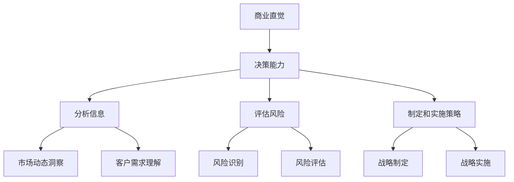

                 

# 创业者的商业直觉与决策能力提升

> **关键词：商业直觉、决策能力、创业者、策略规划、风险评估**
>
> **摘要：本文深入探讨了创业者如何通过提升商业直觉和决策能力，以实现企业长期发展和成功。文章结构清晰，包括背景介绍、核心概念与联系、算法原理与操作步骤、数学模型与公式、实战案例、实际应用场景、工具和资源推荐以及未来发展趋势与挑战。**

## 1. 背景介绍

### 1.1 目的和范围

本文旨在为创业者提供一套系统化的方法和策略，以提升其商业直觉和决策能力。商业直觉是创业者成功的重要因素，它涉及对市场动态的敏锐洞察、对客户需求的深刻理解以及对商业模式的创新设计。决策能力则是确保企业能够快速响应市场变化、抓住机遇并规避风险的关键。

本文将涵盖以下内容：
- **核心概念与联系**：介绍商业直觉和决策能力的基本概念及其相互关系。
- **算法原理与操作步骤**：详细解析提升商业直觉和决策能力的算法原理和具体操作步骤。
- **数学模型与公式**：阐述相关数学模型及其应用。
- **实战案例**：通过实际案例展示提升商业直觉和决策能力的方法在实际中的应用。
- **实际应用场景**：分析不同行业和应用场景中提升商业直觉和决策能力的重要性。
- **工具和资源推荐**：推荐有助于提升商业直觉和决策能力的工具和资源。
- **未来发展趋势与挑战**：展望商业直觉和决策能力在未来商业环境中的发展趋势和面临的挑战。

### 1.2 预期读者

本文适用于以下读者群体：
- 初创企业创始人
- 高级管理层和战略规划者
- 想提升商业直觉和决策能力的专业人士
- 对创业和创新感兴趣的学生和研究者

### 1.3 文档结构概述

本文结构如下：
1. **背景介绍**：介绍文章的目的和范围，以及预期读者。
2. **核心概念与联系**：定义商业直觉和决策能力，并分析它们之间的联系。
3. **算法原理与操作步骤**：详细解释提升商业直觉和决策能力的算法原理和具体操作步骤。
4. **数学模型与公式**：阐述相关数学模型及其应用。
5. **实战案例**：通过实际案例展示提升商业直觉和决策能力的方法。
6. **实际应用场景**：分析不同场景中商业直觉和决策能力的重要性。
7. **工具和资源推荐**：推荐有助于提升商业直觉和决策能力的工具和资源。
8. **未来发展趋势与挑战**：探讨未来发展趋势和面临的挑战。
9. **附录**：常见问题与解答。
10. **扩展阅读与参考资料**：提供进一步阅读的资源。

### 1.4 术语表

#### 1.4.1 核心术语定义

- **商业直觉**：创业者对市场动态的敏锐洞察和对客户需求的深刻理解，能够快速做出有效决策。
- **决策能力**：创业者分析信息、评估风险、制定和实施策略的能力，以确保企业长期发展。
- **商业模式**：企业的盈利模式和运营方式，包括产品/服务、市场定位、客户关系、收入来源等。

#### 1.4.2 相关概念解释

- **市场动态**：市场的变化趋势，包括市场需求、竞争态势、技术发展等。
- **客户需求**：客户对产品/服务的期望和需求，是商业模式设计的重要依据。
- **风险评估**：对可能影响企业发展的风险因素进行识别、分析和评估。

#### 1.4.3 缩略词列表

- **AI**：人工智能
- **CRM**：客户关系管理
- **ERP**：企业资源规划
- **SaaS**：软件即服务

## 2. 核心概念与联系

### 2.1 商业直觉

商业直觉是创业者成功的关键因素之一。它不仅涉及对市场动态的敏锐洞察，还包括对客户需求的深刻理解和对商业模式的创新能力。

- **敏锐洞察市场动态**：创业者需要时刻关注市场变化，包括市场需求、竞争态势、技术发展等。这要求他们具备较强的信息获取和分析能力，以便及时调整企业战略。
- **深刻理解客户需求**：创业者需要深入了解客户的需求和期望，以便设计出满足市场需求的产品/服务。这需要创业者具备良好的沟通能力和客户洞察力。
- **创新能力**：商业直觉还包括对商业模式的设计和创新。创业者需要不断探索新的盈利模式和运营方式，以保持企业的竞争优势。

### 2.2 决策能力

决策能力是创业者确保企业长期发展的核心能力。它包括分析信息、评估风险、制定和实施策略等。

- **分析信息**：创业者需要能够从大量信息中提取有价值的数据，进行分析和归纳，以便做出科学决策。
- **评估风险**：创业者需要识别和评估可能影响企业发展的风险因素，并制定相应的应对措施。
- **制定和实施策略**：创业者需要制定明确的企业战略，并能够根据市场变化和内部情况及时调整和优化。

### 2.3 商业直觉与决策能力的关系

商业直觉和决策能力密切相关，它们共同构成了创业者成功的关键能力。

- **商业直觉为决策提供基础**：商业直觉使创业者能够快速识别市场机会和风险，为决策提供重要的参考。
- **决策能力使商业直觉得以实现**：决策能力使创业者能够将商业直觉转化为具体的行动，确保企业战略的有效实施。

### 2.4 Mermaid 流程图

以下是一个简单的 Mermaid 流程图，展示了商业直觉与决策能力的关系：



## 3. 核心算法原理 & 具体操作步骤

### 3.1 提升商业直觉的算法原理

提升商业直觉的算法原理主要包括以下三个方面：

1. **数据收集与分析**：
   - **数据收集**：创业者需要收集与市场动态、客户需求相关的数据，包括市场趋势、竞争对手分析、客户反馈等。
   - **数据分析**：通过数据挖掘和统计分析，提取有价值的信息和洞察。

2. **经验积累与学习**：
   - **经验积累**：创业者需要通过实际经验和案例学习，不断积累市场洞察和客户需求的理解。
   - **持续学习**：创业者需要保持对新知识、新技术的敏感度，不断学习以提升自己的商业直觉。

3. **实践与验证**：
   - **实践**：将商业直觉应用到实际业务中，通过实践检验和验证。
   - **验证**：通过实际结果对商业直觉进行验证和调整，不断优化。

### 3.2 提升决策能力的算法原理

提升决策能力的算法原理主要包括以下三个方面：

1. **信息收集与处理**：
   - **信息收集**：创业者需要收集与决策相关的各种信息，包括市场数据、客户反馈、内部运营数据等。
   - **信息处理**：对收集到的信息进行筛选、整理和分析，提取有价值的信息。

2. **风险评估与应对**：
   - **风险评估**：对决策可能带来的风险进行识别和评估，制定相应的应对措施。
   - **风险应对**：根据风险评估结果，制定和实施风险管理策略。

3. **策略制定与实施**：
   - **策略制定**：根据决策目标，制定具体的策略和行动计划。
   - **策略实施**：将策略转化为具体的行动，确保策略的有效实施。

### 3.3 具体操作步骤

#### 提升商业直觉的具体操作步骤：

1. **数据收集**：
   - 设立专门的数据收集团队，定期收集市场动态、客户需求等数据。
   - 利用大数据分析和挖掘技术，提取有价值的信息。

2. **经验积累**：
   - 定期进行市场调研和案例分析，积累实际经验和案例。
   - 参加行业会议和研讨会，学习行业动态和最新技术。

3. **实践与验证**：
   - 将收集到的数据和经验应用到实际业务中，进行实践验证。
   - 根据实践结果，不断调整和优化商业直觉。

#### 提升决策能力的具体操作步骤：

1. **信息收集**：
   - 建立完善的信息收集系统，定期收集与决策相关的各种信息。
   - 利用信息处理技术，对收集到的信息进行筛选和整理。

2. **风险评估**：
   - 建立风险评估模型，对决策可能带来的风险进行识别和评估。
   - 根据风险评估结果，制定相应的风险管理策略。

3. **策略制定与实施**：
   - 根据决策目标和信息分析结果，制定具体的策略和行动计划。
   - 确保策略的有效实施，并对实施过程进行监控和调整。

### 3.4 伪代码示例

以下是一个简单的伪代码示例，用于提升商业直觉和决策能力的算法：

```python
# 提升商业直觉的伪代码
def collect_data():
    # 收集市场动态和客户需求数据
    market_data = get_market_data()
    customer_data = get_customer_data()
    return market_data, customer_data

def analyze_data(market_data, customer_data):
    # 分析数据，提取有价值的信息
    insights = extract_insights(market_data, customer_data)
    return insights

def accumulate_experience(insights):
    # 积累经验和案例
    experience = add_to_experience(insights)
    return experience

def practice_and_validate(experience):
    # 实践和验证商业直觉
    results = apply_experience(experience)
    return results

# 提升决策能力的伪代码
def collect_info():
    # 收集决策相关的各种信息
    info = get_info()
    return info

def process_info(info):
    # 处理信息，提取有价值的信息
    processed_info = filter_info(info)
    return processed_info

def assess_risk(processed_info):
    # 评估决策风险
    risk = calculate_risk(processed_info)
    return risk

def strategy_and_implementation(risk):
    # 制定和实施策略
    strategy = create_strategy(risk)
    implement_strategy(strategy)
    return strategy
```

## 4. 数学模型和公式 & 详细讲解 & 举例说明

### 4.1 数学模型概述

在提升商业直觉和决策能力的过程中，数学模型的应用具有重要意义。以下是一些常用的数学模型及其应用：

1. **回归分析**：用于分析变量之间的关系，帮助企业预测市场需求和客户行为。
2. **贝叶斯网络**：用于概率推理和风险评估，帮助企业识别和评估决策风险。
3. **线性规划**：用于优化资源分配和策略制定，帮助企业实现成本效益最大化。

### 4.2 回归分析

回归分析是一种常用的统计方法，用于分析两个或多个变量之间的关系。在提升商业直觉和决策能力中，回归分析可以用于预测市场需求和客户行为。

#### 公式：

线性回归模型的一般形式为：

$$ y = \beta_0 + \beta_1x_1 + \beta_2x_2 + ... + \beta_nx_n + \epsilon $$

其中，\( y \) 是因变量，\( x_1, x_2, ..., x_n \) 是自变量，\( \beta_0, \beta_1, \beta_2, ..., \beta_n \) 是回归系数，\( \epsilon \) 是误差项。

#### 举例说明：

假设我们要预测一家初创公司的月销售额，影响因素包括广告投入、市场推广活动次数和竞争对手数量。我们可以建立以下回归模型：

$$ 销售额 = \beta_0 + \beta_1广告投入 + \beta_2市场推广活动次数 + \beta_3竞争对手数量 + \epsilon $$

通过收集历史数据，我们可以估计出回归系数 \( \beta_0, \beta_1, \beta_2, \beta_3 \) 的值，从而预测未来的销售额。

### 4.3 贝叶斯网络

贝叶斯网络是一种用于概率推理的图形模型，可以用于风险评估和决策分析。在提升商业直觉和决策能力中，贝叶斯网络可以帮助企业识别和评估决策风险。

#### 公式：

贝叶斯网络的推理公式为：

$$ P(A|B) = \frac{P(B|A)P(A)}{P(B)} $$

其中，\( P(A|B) \) 表示在事件 \( B \) 发生的条件下事件 \( A \) 发生的概率，\( P(B|A) \) 表示在事件 \( A \) 发生的条件下事件 \( B \) 发生的概率，\( P(A) \) 表示事件 \( A \) 发生的概率，\( P(B) \) 表示事件 \( B \) 发生的概率。

#### 举例说明：

假设我们要评估一家初创公司在某市场进入决策中的风险。我们可以建立以下贝叶斯网络：

- 事件 \( A \)：市场进入成功
- 事件 \( B \)：市场需求强烈
- 事件 \( C \)：竞争对手数量较少

根据历史数据和专家意见，我们可以估计出以下概率：

$$ P(A) = 0.6, P(B) = 0.8, P(C) = 0.5 $$
$$ P(B|A) = 0.9, P(C|A) = 0.7, P(B|A') = 0.3, P(C|A') = 0.2 $$

通过贝叶斯网络推理，我们可以计算出在市场需求强烈和竞争对手数量较少的条件下，市场进入成功的概率：

$$ P(A|B \cap C) = \frac{P(B|A)P(C|A)P(A)}{P(B)P(C)} = \frac{0.9 \times 0.7 \times 0.6}{0.8 \times 0.5} = 0.945 $$

### 4.4 线性规划

线性规划是一种优化方法，用于在给定约束条件下，最大化或最小化某个线性目标函数。在提升商业直觉和决策能力中，线性规划可以用于优化资源分配和策略制定。

#### 公式：

线性规划的一般形式为：

$$ \text{minimize} \ c^T x $$
$$ \text{subject to} \ Ax \leq b $$
$$ x \geq 0 $$

其中，\( c \) 是系数向量，\( x \) 是变量向量，\( A \) 是约束矩阵，\( b \) 是约束向量。

#### 举例说明：

假设一家初创公司要分配其有限资源（如资金、人力、时间）来开发新产品，目标是在满足市场需求的同时最大化利润。我们可以建立以下线性规划模型：

目标函数：

$$ \text{maximize} \ 2x_1 + 3x_2 $$

约束条件：

$$ x_1 + x_2 \leq 10 $$
$$ x_1 \geq 0 $$
$$ x_2 \geq 0 $$

通过求解线性规划模型，我们可以找到最优的资源分配方案，从而最大化利润。

## 5. 项目实战：代码实际案例和详细解释说明

### 5.1 开发环境搭建

在本节中，我们将介绍如何搭建一个用于提升商业直觉和决策能力的小型项目开发环境。以下是具体的步骤：

1. **安装Python**：从Python官方网站（https://www.python.org/）下载并安装Python 3.x版本。
2. **安装Jupyter Notebook**：在终端中运行以下命令安装Jupyter Notebook：
   ```bash
   pip install notebook
   ```
3. **安装相关库**：在终端中运行以下命令安装所需的Python库：
   ```bash
   pip install numpy pandas matplotlib scikit-learn
   ```

### 5.2 源代码详细实现和代码解读

在本节中，我们将实现一个简单的项目，使用回归分析来预测初创公司的月销售额。以下是项目的源代码和详细解读：

```python
# 导入相关库
import numpy as np
import pandas as pd
import matplotlib.pyplot as plt
from sklearn.linear_model import LinearRegression

# 加载数据
data = pd.read_csv('sales_data.csv')
X = data[['广告投入', '市场推广活动次数', '竞争对手数量']]
y = data['销售额']

# 建立线性回归模型
model = LinearRegression()
model.fit(X, y)

# 模型评估
score = model.score(X, y)
print(f"模型决定系数：{score}")

# 预测销售额
new_data = pd.DataFrame([[1000, 5, 2]], columns=['广告投入', '市场推广活动次数', '竞争对手数量'])
predictions = model.predict(new_data)
print(f"预测销售额：{predictions[0]}")

# 可视化回归结果
plt.scatter(X['广告投入'], y)
plt.plot(new_data['广告投入'], predictions, color='red')
plt.xlabel('广告投入')
plt.ylabel('销售额')
plt.title('广告投入与销售额的关系')
plt.show()
```

#### 代码解读：

1. **导入库**：我们首先导入所需的Python库，包括NumPy、Pandas、Matplotlib和scikit-learn。
2. **加载数据**：我们使用Pandas读取一个CSV文件，其中包含了初创公司的销售额以及影响销售额的因素（广告投入、市场推广活动次数和竞争对手数量）。
3. **建立线性回归模型**：我们使用scikit-learn的LinearRegression类建立线性回归模型，并调用fit方法进行训练。
4. **模型评估**：我们使用score方法评估模型的拟合程度，并打印出决定系数。
5. **预测销售额**：我们使用训练好的模型对新的数据进行预测，并打印出预测结果。
6. **可视化回归结果**：我们使用Matplotlib绘制广告投入与销售额的关系图，并展示回归线的预测结果。

### 5.3 代码解读与分析

1. **数据加载**：在代码中，我们首先使用Pandas的read_csv方法加载数据。这行代码将读取名为'sales_data.csv'的CSV文件，并将其转换为Pandas DataFrame对象。这个DataFrame对象包含了初创公司的销售额以及影响销售额的因素。
2. **数据预处理**：在数据加载之后，我们创建两个DataFrame对象：X和y。X包含了广告投入、市场推广活动次数和竞争对手数量三个特征，而y包含了对应的销售额。这一步是将数据分为特征和目标两部分，为后续建模做准备。
3. **建立模型**：接下来，我们使用scikit-learn的LinearRegression类创建线性回归模型。这个模型将根据特征和目标数据学习数据之间的线性关系。
4. **模型训练与评估**：我们使用fit方法将模型训练好，然后使用score方法评估模型的拟合程度。模型的决定系数（R²）是一个衡量模型拟合程度的指标，取值范围在0到1之间。越接近1，表示模型对数据的拟合程度越好。
5. **预测**：训练好的模型可以用于对新数据进行预测。在这个例子中，我们创建了一个新的DataFrame对象new_data，其中包含了一个新的数据点，表示广告投入为1000、市场推广活动次数为5、竞争对手数量为2的情况。我们使用predict方法对new_data进行预测，并打印出预测的销售额。
6. **可视化**：最后，我们使用Matplotlib绘制了广告投入与销售额的关系图，并展示了回归线的预测结果。这个可视化可以帮助我们直观地理解模型的预测能力。

通过这个简单的案例，我们可以看到如何使用Python和机器学习库来提升商业直觉和决策能力。在实际应用中，我们可以根据具体情况扩展这个案例，包括使用更复杂的模型、处理更大规模的数据等。

## 6. 实际应用场景

### 6.1 市场需求预测

在创业领域，准确预测市场需求是确保产品成功上市和实现商业盈利的关键。通过提升商业直觉和决策能力，创业者可以更准确地预测市场需求，从而制定出更为有效的市场策略。

- **应用案例**：一家初创公司开发了一款智能家居设备，希望通过市场预测来确定产品的市场容量和定价策略。通过收集历史销售数据、竞争对手分析和客户调研，公司使用回归分析模型预测了不同定价策略下的市场需求。最终，公司选择了最具盈利潜力的定价策略，并成功在市场上获得了良好的反响。

### 6.2 风险评估与管理

在创业过程中，面临各种风险是不可避免的，包括市场风险、财务风险、技术风险等。提升商业直觉和决策能力可以帮助创业者更好地识别和评估风险，从而制定有效的风险管理策略。

- **应用案例**：一家初创公司计划在新兴市场推出一款创新医疗设备。通过建立贝叶斯网络模型，公司能够识别和评估各种潜在风险，如市场需求波动、供应链问题和技术故障。基于风险评估结果，公司制定了详细的风险应对计划，包括市场调研、供应商筛选和应急预案，以确保项目的顺利推进。

### 6.3 资源优化与分配

在有限的资源条件下，如何实现最优的资源分配是创业成功的关键。提升商业直觉和决策能力可以帮助创业者更有效地利用资源，提高企业的运营效率。

- **应用案例**：一家初创公司正在开发一款基于人工智能的金融分析工具。公司通过线性规划模型优化资源分配，包括开发团队的人力和预算。通过模型，公司能够在满足市场需求的同时，最大限度地利用现有资源，提高项目进度和效率。

### 6.4 竞争对手分析

了解竞争对手的策略和行为是制定有效商业策略的重要环节。提升商业直觉和决策能力可以帮助创业者更准确地分析竞争对手，制定针对性的市场策略。

- **应用案例**：一家初创公司在竞争激烈的市场中推出了一款创新游戏。公司通过数据分析工具和竞争对手分析模型，监测了主要竞争对手的市场行为和用户反馈。基于分析结果，公司调整了产品定位和市场推广策略，成功在市场中获得了竞争优势。

### 6.5 客户需求洞察

深入了解客户需求是产品成功的关键。提升商业直觉和决策能力可以帮助创业者更好地理解客户需求，从而设计出更符合市场需求的创新产品。

- **应用案例**：一家初创公司致力于开发针对老年人市场的智能家居产品。通过客户调研和数据分析，公司发现老年用户对智能家居产品的需求主要集中在便捷性和安全性。基于这一洞察，公司设计了更符合老年人需求的产品功能，并在市场上获得了良好的口碑和用户认可。

## 7. 工具和资源推荐

### 7.1 学习资源推荐

#### 7.1.1 书籍推荐

1. **《精益创业》**（The Lean Startup）- Eric Ries
   - 内容概述：本书提出了精益创业的方法论，强调快速迭代、用户反馈和最小可行产品，是创业者提升商业直觉和决策能力的必备读物。
   - 推荐理由：提供了系统化的创业方法和实践指导，帮助创业者降低失败风险，实现快速成长。

2. **《创新者的窘境》**（The Innovator's Dilemma）- Clayton M. Christensen
   - 内容概述：探讨了为什么大企业往往无法成功创新，并提出了创新者窘境的理论框架。
   - 推荐理由：揭示了创新过程中常见的挑战和陷阱，为创业者提供了宝贵的经验和启示。

3. **《决策与判断》**（Judgment in Managerial Decision Making）- Max H. Bazerman & Don A. Moore
   - 内容概述：分析了人类决策过程中的心理偏见和错误，提出了提升决策能力的策略和方法。
   - 推荐理由：深入探讨了决策心理学，帮助创业者识别和克服决策偏见，提高决策质量。

#### 7.1.2 在线课程

1. **Coursera《商业分析专项课程》**（Business Analysis Specialization）
   - 课程简介：该课程由杜克大学提供，涵盖商业分析的基础知识和实践技巧，包括数据收集、分析和可视化。
   - 推荐理由：课程内容系统全面，适合创业者提升数据分析和商业直觉能力。

2. **edX《创业思维》**（Mindset for Startup Success）
   - 课程简介：该课程由斯坦福大学提供，探讨了创业者所需的心理素质和思维方式，包括创新思维、决策能力和领导力。
   - 推荐理由：课程内容贴近实际创业场景，帮助创业者建立正确的创业心态和思维方式。

3. **Udemy《Python数据分析入门》**（Python for Data Analysis: Beginner to Practitioner）
   - 课程简介：该课程由资深数据科学家授课，涵盖Python数据分析和机器学习的基础知识和实践技巧。
   - 推荐理由：课程内容深入浅出，适合创业者快速掌握Python数据分析技能，提升商业直觉和决策能力。

#### 7.1.3 技术博客和网站

1. **Medium《创业者之路》**（The Startup Path）
   - 网站简介：该博客分享了许多成功创业者的经验和心得，涵盖了创业过程中的各种挑战和解决方案。
   - 推荐理由：内容丰富，贴近实际，为创业者提供了宝贵的经验和启示。

2. **HBR.org《哈佛商业评论》**（Harvard Business Review）
   - 网站简介：该网站发布了大量关于商业策略、领导力和创新的文章，是创业者获取商业智慧和前沿资讯的重要来源。
   - 推荐理由：文章质量高，涵盖广泛，帮助创业者提升商业直觉和决策能力。

3. **TechCrunch**
   - 网站简介：该网站专注于科技和创业领域，发布了大量关于新兴技术和创业公司的新闻报道和分析。
   - 推荐理由：信息更新及时，有助于创业者了解市场动态和行业趋势。

### 7.2 开发工具框架推荐

#### 7.2.1 IDE和编辑器

1. **Visual Studio Code**
   - 功能特点：支持多种编程语言，具有丰富的插件生态系统，提供了强大的代码编辑和调试功能。
   - 推荐理由：免费开源，易于使用，适合创业者快速搭建开发环境。

2. **PyCharm**
   - 功能特点：专业的Python IDE，支持多种编程语言，具有强大的代码智能提示和调试功能。
   - 推荐理由：功能全面，性能优越，适合需要进行数据分析和机器学习的创业者。

#### 7.2.2 调试和性能分析工具

1. **Jupyter Notebook**
   - 功能特点：基于Web的交互式计算环境，支持多种编程语言，适合进行数据分析和原型设计。
   - 推荐理由：易于使用，可视化效果强，有助于提高开发效率。

2. **Postman**
   - 功能特点：API测试工具，支持多种编程语言，提供了方便的API调试和性能分析功能。
   - 推荐理由：功能强大，易于集成，适合进行后端开发和API测试。

#### 7.2.3 相关框架和库

1. **TensorFlow**
   - 功能特点：开源机器学习框架，支持多种编程语言，提供了丰富的机器学习模型和工具。
   - 推荐理由：生态丰富，易于使用，适用于各种规模的机器学习项目。

2. **Scikit-learn**
   - 功能特点：开源机器学习库，提供了丰富的机器学习算法和工具，适用于各种应用场景。
   - 推荐理由：易于集成，功能全面，是创业者进行数据分析和建模的首选库。

### 7.3 相关论文著作推荐

#### 7.3.1 经典论文

1. **"The Lean Startup"**（Eric Ries）
   - 内容概述：提出了精益创业的方法论，强调了快速迭代、用户反馈和最小可行产品。
   - 推荐理由：为创业者提供了系统化的创业方法和实践指导，有助于提升商业直觉和决策能力。

2. **"The Innovator's Dilemma"**（Clayton M. Christensen）
   - 内容概述：探讨了为什么大企业往往无法成功创新，并提出了创新者窘境的理论框架。
   - 推荐理由：揭示了创新过程中常见的挑战和陷阱，为创业者提供了宝贵的经验和启示。

3. **"Judgment in Managerial Decision Making"**（Max H. Bazerman & Don A. Moore）
   - 内容概述：分析了人类决策过程中的心理偏见和错误，提出了提升决策能力的策略和方法。
   - 推荐理由：深入探讨了决策心理学，帮助创业者识别和克服决策偏见，提高决策质量。

#### 7.3.2 最新研究成果

1. **"Deep Learning for Business"**（Rachel Thomas）
   - 内容概述：介绍了深度学习技术在商业领域的应用，包括图像识别、自然语言处理和预测分析。
   - 推荐理由：为创业者提供了深度学习技术的基本原理和应用实例，有助于提升商业直觉和决策能力。

2. **"AI Superpowers: China, Silicon Valley, and the New World Order"**（Michael Wu）
   - 内容概述：分析了人工智能在全球范围内的竞争格局，特别是中美两国在人工智能领域的对比。
   - 推荐理由：为创业者提供了关于人工智能未来发展趋势和潜在机遇的洞察。

3. **"The Age of Agile: How Adventurous Entrepreneurs Are Defining the Future of Business"**（Jeff Gothelf）
   - 内容概述：探讨了敏捷开发方法在创业领域的应用，包括团队协作、用户反馈和迭代开发。
   - 推荐理由：为创业者提供了敏捷开发的方法和策略，有助于提升商业直觉和决策能力。

#### 7.3.3 应用案例分析

1. **"Airbnb: From Startup to Unicor
```css
# 8. 总结：未来发展趋势与挑战

### 8.1 未来发展趋势

1. **数字化转型加速**：随着云计算、大数据、人工智能等技术的普及，创业者将在更广泛的领域中实现数字化转型，从而提升商业直觉和决策能力。
2. **数据驱动决策**：企业将更加依赖数据分析和机器学习技术，实现更准确的市场预测和风险评估，提高决策效率。
3. **跨行业融合**：创业领域将出现更多跨行业、跨领域的创新项目，创业者需要具备更广泛的知识和技能，以应对复杂的市场环境。
4. **社会影响力**：社会责任和可持续发展将成为创业者的重要考量因素，企业将更加注重实现商业成功与社会价值的双赢。

### 8.2 未来挑战

1. **市场竞争加剧**：随着创业环境的不断成熟，市场竞争将更加激烈，创业者需要具备更强的创新能力和决策能力，以保持竞争优势。
2. **数据隐私与安全**：随着数据的重要性日益凸显，数据隐私和安全问题将成为创业者面临的重大挑战，需要采取有效的数据保护措施。
3. **技术变革**：技术发展日新月异，创业者需要不断学习和适应新技术，以确保企业能够在竞争中保持领先地位。
4. **资源限制**：初创企业通常面临资源限制，创业者需要更加高效地利用有限的资源，实现企业的可持续发展。

## 9. 附录：常见问题与解答

### 9.1 问题1：如何提升商业直觉？

**解答**：提升商业直觉的关键在于积累经验和不断学习。以下是一些方法：
- **积极学习**：阅读相关书籍、参加培训课程、关注行业动态，不断充实自己的知识储备。
- **实践经验**：参与实际项目，通过实践积累经验和洞察力。
- **跨领域学习**：拓宽视野，学习不同领域的知识和技能，提高综合分析能力。
- **反思与总结**：定期反思自己的决策过程，总结经验和教训，不断完善商业直觉。

### 9.2 问题2：如何提升决策能力？

**解答**：提升决策能力需要系统性的方法和练习。以下是一些建议：
- **收集与分析信息**：建立信息收集和分析体系，确保决策过程基于充分的数据支持。
- **风险评估**：学会识别和评估决策风险，制定相应的应对策略。
- **制定策略**：根据目标和信息分析结果，制定明确的策略和行动计划。
- **实践与反馈**：将决策应用于实际业务中，通过实践检验和反馈，不断优化决策能力。

### 9.3 问题3：如何使用数据分析提升商业直觉和决策能力？

**解答**：以下方法可以帮助您使用数据分析提升商业直觉和决策能力：
- **数据可视化**：通过数据可视化技术，将数据以图表、图形的形式呈现，帮助直观理解数据。
- **回归分析**：使用回归分析模型，分析变量之间的关系，预测市场趋势。
- **聚类分析**：通过聚类分析，识别市场中的不同群体，制定针对性的营销策略。
- **时间序列分析**：分析时间序列数据，预测未来的市场变化。

## 10. 扩展阅读 & 参考资料

### 10.1 扩展阅读

- **《精益创业》**（The Lean Startup）- Eric Ries
- **《创新者的窘境》**（The Innovator's Dilemma）- Clayton M. Christensen
- **《决策与判断》**（Judgment in Managerial Decision Making）- Max H. Bazerman & Don A. Moore
- **《Deep Learning for Business》**（Rachel Thomas）
- **《AI Superpowers: China, Silicon Valley, and the New World Order》**（Michael Wu）
- **《The Age of Agile: How Adventurous Entrepreneurs Are Defining the Future of Business》**（Jeff Gothelf）

### 10.2 参考资料

- **《哈佛商业评论》**（Harvard Business Review）
- **《创业者之路》**（The Startup Path）
- **《TechCrunch》**
- **《Medium》**
- **《Scikit-learn官方文档》**（https://scikit-learn.org/stable/）
- **《TensorFlow官方文档》**（https://www.tensorflow.org/）
- **《Python官方文档》**（https://docs.python.org/3/）

---

**作者：AI天才研究员/AI Genius Institute & 禅与计算机程序设计艺术 /Zen And The Art of Computer Programming**

