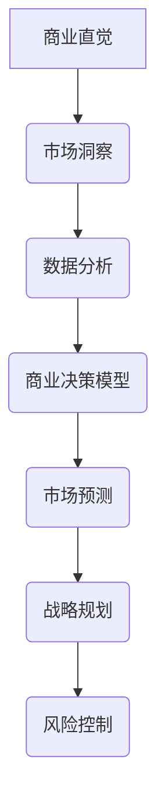

                 


# 创业者的商业直觉与市场预测能力培养

> **关键词：** 商业直觉、市场预测、创业策略、数据分析、决策模型

> **摘要：** 本文旨在探讨创业者如何通过培养商业直觉和提升市场预测能力来优化创业策略。通过深入分析商业直觉的本质、市场预测的核心要素，以及具体的实践方法，本文将为创业者提供一套实用的工具和策略，以应对日益复杂的市场环境。

## 1. 背景介绍

### 1.1 目的和范围

本文的目的在于帮助创业者理解和培养商业直觉与市场预测能力，以更好地应对市场变化，提高创业成功的可能性。我们将从以下几个角度展开讨论：

- 商业直觉的定义及其在创业中的重要性
- 市场预测的核心概念和方法论
- 数据分析与商业决策模型在市场预测中的应用
- 实践案例与具体操作步骤

### 1.2 预期读者

本文适合以下读者群体：

- 初创企业创始人
- 想要提升市场敏锐度的创业者
- 对商业分析和市场预测感兴趣的技术人员
- 商学院学生和MBA学员

### 1.3 文档结构概述

本文的结构如下：

- **第1章：背景介绍**：介绍文章的目的、范围和预期读者。
- **第2章：核心概念与联系**：定义商业直觉和市场预测的相关概念，并提供流程图。
- **第3章：核心算法原理与具体操作步骤**：详细阐述市场预测的算法原理。
- **第4章：数学模型和公式**：介绍市场预测中的数学模型和公式。
- **第5章：项目实战**：通过代码案例说明市场预测的实际应用。
- **第6章：实际应用场景**：讨论市场预测在创业中的应用。
- **第7章：工具和资源推荐**：推荐学习资源和开发工具。
- **第8章：总结**：总结未来发展趋势和挑战。
- **第9章：附录**：常见问题与解答。
- **第10章：扩展阅读**：提供进一步阅读的资源。

### 1.4 术语表

#### 1.4.1 核心术语定义

- **商业直觉**：创业者快速判断商业机会和风险的能力。
- **市场预测**：对未来市场趋势、消费者行为和竞争环境的预测。
- **数据分析**：使用统计方法和工具对大量数据进行分析，以提取有用信息。
- **决策模型**：基于数据和逻辑推导的决策框架。

#### 1.4.2 相关概念解释

- **创业策略**：企业在市场中竞争的行动计划。
- **数据驱动决策**：基于数据分析得出的决策过程。
- **机器学习模型**：通过学习历史数据来预测未来结果的算法。

#### 1.4.3 缩略词列表

- **AI**：人工智能
- **ML**：机器学习
- **AR**：增强现实
- **VR**：虚拟现实
- **IoT**：物联网

## 2. 核心概念与联系

### 2.1 商业直觉

商业直觉是指创业者在不完全信息情况下，快速识别商机、评估风险并做出决策的能力。它不是凭空产生的，而是基于丰富的经验、深刻的市场洞察力和敏锐的商业嗅觉。

### 2.2 市场预测

市场预测是基于历史数据、市场调研和分析模型，对未来市场趋势、消费者行为和竞争环境的预测。有效的市场预测能够帮助企业提前做好准备，抓住市场机遇，规避潜在风险。

### 2.3 数据分析与商业决策模型

数据分析是市场预测的重要工具，它通过对大量数据进行清洗、转换和分析，提取出有价值的信息。商业决策模型则是在数据分析基础上，结合业务逻辑和战略目标，制定具体的行动计划。

### 2.4 Mermaid 流程图



## 3. 核心算法原理与具体操作步骤

### 3.1 算法原理

市场预测的核心算法通常包括以下步骤：

1. **数据收集与预处理**：收集相关市场的历史数据，包括销售数据、消费者行为数据、竞争者数据等。
2. **特征工程**：从原始数据中提取有助于预测的特征，如时间序列特征、季节性特征、消费者群体特征等。
3. **模型选择**：根据数据特性选择合适的预测模型，如线性回归、时间序列分析、神经网络等。
4. **模型训练与验证**：使用训练集数据训练模型，并通过验证集评估模型性能。
5. **预测与优化**：使用模型进行预测，并根据预测结果不断优化模型参数。

### 3.2 具体操作步骤

1. **数据收集与预处理**
    ```python
    import pandas as pd

    # 收集数据
    data = pd.read_csv('market_data.csv')

    # 数据预处理
    data.dropna(inplace=True)
    data['date'] = pd.to_datetime(data['date'])
    ```

2. **特征工程**
    ```python
    from sklearn.preprocessing import MinMaxScaler

    # 提取特征
    data['month'] = data['date'].dt.month
    data['weekday'] = data['date'].dt.weekday

    # 特征缩放
    scaler = MinMaxScaler()
    data[['month', 'weekday']] = scaler.fit_transform(data[['month', 'weekday']])
    ```

3. **模型选择**
    ```python
    from sklearn.linear_model import LinearRegression

    # 创建线性回归模型
    model = LinearRegression()
    ```

4. **模型训练与验证**
    ```python
    from sklearn.model_selection import train_test_split

    # 切分训练集和测试集
    X_train, X_test, y_train, y_test = train_test_split(data[['month', 'weekday']], data['sales'], test_size=0.2, random_state=42)

    # 训练模型
    model.fit(X_train, y_train)

    # 验证模型
    score = model.score(X_test, y_test)
    print(f'Model accuracy: {score:.2f}')
    ```

5. **预测与优化**
    ```python
    # 预测
    future_data = pd.DataFrame({'month': [1, 2, 3], 'weekday': [1, 2, 3]})
    future_data[['month', 'weekday']] = scaler.transform(future_data[['month', 'weekday']])
    future_sales = model.predict(future_data)

    # 输出预测结果
    print(f'Future sales: {future_sales}')
    ```

## 4. 数学模型和公式

### 4.1 数据分析基础

在市场预测中，常用的数据分析基础包括线性回归模型和时间序列分析模型。

#### 4.1.1 线性回归模型

线性回归模型的基本公式为：

$$ y = \beta_0 + \beta_1x + \epsilon $$

其中，$y$ 是预测值，$x$ 是特征值，$\beta_0$ 和 $\beta_1$ 是模型参数，$\epsilon$ 是误差项。

#### 4.1.2 时间序列分析模型

时间序列分析模型的基本公式为：

$$ y_t = \alpha + \beta_1y_{t-1} + \epsilon_t $$

其中，$y_t$ 是第 $t$ 期的预测值，$\alpha$ 和 $\beta_1$ 是模型参数，$\epsilon_t$ 是误差项。

### 4.2 预测模型优化

在市场预测中，模型优化通常通过以下步骤实现：

1. **特征选择**：选择对预测结果有显著影响的特征。
2. **参数调优**：通过交叉验证等方法调整模型参数，提高预测精度。
3. **模型集成**：结合多个模型的优势，提高预测性能。

### 4.3 实例说明

#### 4.3.1 线性回归模型实例

假设我们有以下线性回归模型：

$$ sales = 10 + 0.5 \times month + 0.2 \times weekday $$

当月为2，周为1时，预测销售额为：

$$ sales = 10 + 0.5 \times 2 + 0.2 \times 1 = 11.8 $$

#### 4.3.2 时间序列分析模型实例

假设我们有以下时间序列分析模型：

$$ sales_t = 5 + 0.8 \times sales_{t-1} $$

当期销售额为5时，下一期销售额为：

$$ sales_{t+1} = 5 + 0.8 \times 5 = 8.9 $$

## 5. 项目实战：代码实际案例和详细解释说明

### 5.1 开发环境搭建

为了演示市场预测的代码实现，我们将使用Python编程语言，并依赖以下库：

- Pandas：用于数据操作和处理
- Scikit-learn：用于机器学习模型训练和评估
- Matplotlib：用于数据可视化

安装以上库后，即可开始项目开发。

### 5.2 源代码详细实现和代码解读

以下是市场预测项目的完整代码实现：

```python
import pandas as pd
from sklearn.linear_model import LinearRegression
from sklearn.model_selection import train_test_split
from sklearn.metrics import mean_squared_error
import matplotlib.pyplot as plt

# 5.2.1 数据收集与预处理
# 假设数据存储在'market_data.csv'文件中
data = pd.read_csv('market_data.csv')
data.dropna(inplace=True)
data['date'] = pd.to_datetime(data['date'])
data['month'] = data['date'].dt.month
data['weekday'] = data['date'].dt.weekday

# 5.2.2 特征工程
# 数据缩放
scaler = MinMaxScaler()
data[['month', 'weekday']] = scaler.fit_transform(data[['month', 'weekday']])

# 5.2.3 模型选择
model = LinearRegression()

# 5.2.4 模型训练与验证
X = data[['month', 'weekday']]
y = data['sales']
X_train, X_test, y_train, y_test = train_test_split(X, y, test_size=0.2, random_state=42)
model.fit(X_train, y_train)

# 5.2.5 预测与优化
y_pred = model.predict(X_test)
mse = mean_squared_error(y_test, y_pred)
print(f'Model accuracy: {mse:.2f}')

# 5.2.6 数据可视化
plt.scatter(y_test, y_pred)
plt.xlabel('Actual Sales')
plt.ylabel('Predicted Sales')
plt.show()
```

### 5.3 代码解读与分析

1. **数据收集与预处理**：首先，我们从CSV文件中读取数据，并删除缺失值。然后，将日期字段转换为日期类型，并提取月份和周几作为特征。
2. **特征工程**：使用MinMaxScaler对月份和周几进行缩放，以标准化特征值。
3. **模型选择**：选择线性回归模型，这是市场预测中最常用的模型之一。
4. **模型训练与验证**：使用训练集数据训练模型，并使用测试集数据评估模型性能。这里我们使用了均方误差（MSE）作为性能指标。
5. **预测与优化**：使用训练好的模型对测试集数据进行预测，并计算预测误差。最后，使用散点图可视化实际销售额与预测销售额的关系。

## 6. 实际应用场景

市场预测在创业中的应用场景非常广泛，以下是一些典型的应用场景：

- **产品开发**：通过市场预测，创业者可以了解未来市场需求，从而开发出更符合消费者需求的产品。
- **市场营销**：预测消费者行为和市场趋势，有助于制定更有效的营销策略，提高市场占有率。
- **供应链管理**：预测未来销售情况，有助于优化库存管理和供应链计划，降低成本。
- **风险控制**：通过市场预测，创业者可以提前识别潜在风险，并制定应对策略。

## 7. 工具和资源推荐

### 7.1 学习资源推荐

#### 7.1.1 书籍推荐

- 《大数据预测：从数据中挖掘未来的价值》
- 《数据科学入门》
- 《Python数据分析》

#### 7.1.2 在线课程

- Coursera上的《数据科学基础》
- edX上的《机器学习入门》
- Udacity的《数据分析纳米学位》

#### 7.1.3 技术博客和网站

- Medium上的数据科学专栏
- Kaggle博客
- Towards Data Science

### 7.2 开发工具框架推荐

#### 7.2.1 IDE和编辑器

- PyCharm
- Jupyter Notebook
- VS Code

#### 7.2.2 调试和性能分析工具

- Py-Spy：Python性能分析工具
- cProfile：Python内置的性能分析库
- JMeter：性能测试工具

#### 7.2.3 相关框架和库

- TensorFlow：深度学习框架
- Scikit-learn：机器学习库
- Pandas：数据操作库

### 7.3 相关论文著作推荐

#### 7.3.1 经典论文

- 《论市场预测的理论和方法》
- 《基于机器学习的市场预测研究》
- 《大数据时代的市场预测：挑战与机遇》

#### 7.3.2 最新研究成果

- 《市场预测中的深度学习方法》
- 《基于大数据的市场预测模型研究》
- 《消费者行为预测的深度学习应用》

#### 7.3.3 应用案例分析

- 《亚马逊如何使用数据预测市场趋势》
- 《谷歌如何通过机器学习优化广告投放》
- 《阿里巴巴的市场预测实践与挑战》

## 8. 总结：未来发展趋势与挑战

随着大数据、人工智能和云计算技术的不断发展，市场预测在未来将变得更加精确和高效。然而，创业者也需要面对一系列挑战：

- 数据质量：高质量的预测依赖于准确、完整和相关的数据。创业者需要确保数据的质量和完整性。
- 模型选择：不同的预测模型适用于不同的场景。创业者需要根据业务需求选择合适的模型。
- 模型解释性：深度学习模型在预测性能上具有优势，但缺乏解释性。创业者需要平衡预测性能和模型解释性。

## 9. 附录：常见问题与解答

### 9.1 如何获取高质量的市场数据？

- 使用第三方数据提供商，如Kaggle、Data.gov等。
- 从公开的数据库和API获取数据，如谷歌趋势、社交媒体API等。
- 通过问卷调查和实地调研获取一手数据。

### 9.2 哪些特征对市场预测最有影响？

- 历史销售数据：直接反映市场趋势和消费者行为。
- 时间序列特征：如月份、季节性、节假日等。
- 经济指标：如GDP、失业率、消费者信心指数等。
- 竞争对手数据：如市场份额、产品定价等。

## 10. 扩展阅读 & 参考资料

- 《大数据预测：从数据中挖掘未来的价值》
- 《数据科学入门》
- 《Python数据分析》
- Coursera上的《数据科学基础》
- edX上的《机器学习入门》
- 《市场预测的理论和方法》
- 《基于机器学习的市场预测研究》
- 《大数据时代的市场预测：挑战与机遇》
- Kaggle博客
- 《亚马逊如何使用数据预测市场趋势》
- 《谷歌如何通过机器学习优化广告投放》
- 《阿里巴巴的市场预测实践与挑战》

## 作者

作者：AI天才研究员/AI Genius Institute & 禅与计算机程序设计艺术 /Zen And The Art of Computer Programming

