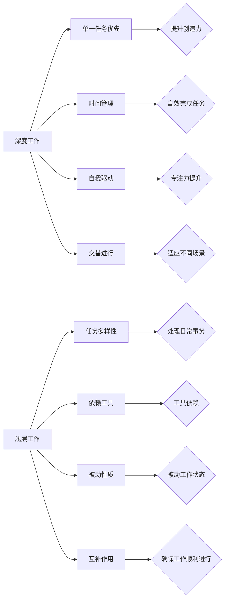

                 

# 创业者的深度工作与浅层工作平衡

> 关键词：深度工作、浅层工作、创业者、时间管理、注意力管理、生产力提升

> 摘要：本文将探讨创业者如何平衡深度工作与浅层工作的关系，通过深入分析两种工作类型的定义、特征、优劣势以及相互联系，为创业者提供实用的策略和建议，以提升工作效率、创新能力和长期发展。

## 1. 背景介绍

### 1.1 目的和范围

本文旨在帮助创业者理解并实践深度工作与浅层工作的平衡艺术。我们将探讨这两种工作类型的本质，分析其对创业成果的影响，并给出具体的策略和工具，帮助创业者提升工作效率，专注于核心业务发展。

### 1.2 预期读者

本文适合以下读者群体：
- 初创公司创始人
- 创业团队核心成员
- 拥有独立项目经验的职场人士
- 对时间管理和生产力提升有需求的人群

### 1.3 文档结构概述

本文结构如下：
- 1. 背景介绍
- 2. 核心概念与联系
- 3. 核心算法原理 & 具体操作步骤
- 4. 数学模型和公式 & 详细讲解 & 举例说明
- 5. 项目实战：代码实际案例和详细解释说明
- 6. 实际应用场景
- 7. 工具和资源推荐
- 8. 总结：未来发展趋势与挑战
- 9. 附录：常见问题与解答
- 10. 扩展阅读 & 参考资料

### 1.4 术语表

#### 1.4.1 核心术语定义

- 深度工作（Deep Work）：一种无需干扰、高度集中精力进行复杂任务的工作状态。
- 浅层工作（Shallow Work）：一种需要分散注意力、处理简单任务的工作状态。
- 创业者（Entrepreneur）：指创立新企业、寻求商业机会并进行商业实践的个人或团队。

#### 1.4.2 相关概念解释

- 生产力（Productivity）：指在单位时间内完成的工作量和效率。
- 注意力管理（Attention Management）：指合理分配和管理个人注意力，以实现工作目标的过程。

#### 1.4.3 缩略词列表

- IDE：集成开发环境（Integrated Development Environment）
- AI：人工智能（Artificial Intelligence）

## 2. 核心概念与联系

在探讨深度工作与浅层工作的平衡之前，我们首先需要理解这两种工作类型的定义、特征以及它们之间的联系。

### 2.1 深度工作的定义与特征

深度工作（Deep Work）是一种专注、高效的工作模式，它要求工作者在无干扰的环境中，全身心投入复杂任务。以下是其主要特征：

- **单一任务优先**：深度工作强调专注于一个任务，避免多任务处理。
- **时间管理**：深度工作通常在固定的时间段内进行，如早晨或晚上。
- **自我驱动**：深度工作依赖于个人的自律和自我激励。

### 2.2 浅层工作的定义与特征

浅层工作（Shallow Work）是一种处理简单、分散注意力的工作模式，如回复邮件、处理社交媒体等。以下是其主要特征：

- **任务多样性**：浅层工作涉及多种不同类型的任务。
- **依赖工具**：浅层工作常借助各种工具和平台，如电子邮件、社交媒体等。
- **被动性质**：浅层工作往往是一种被动的工作状态，如等待通知或回复。

### 2.3 深度工作与浅层工作的联系

尽管深度工作与浅层工作在特征和目的上有所不同，但它们并非完全独立，而是存在一定的联系：

- **交替进行**：深度工作和浅层工作可以交替进行，以适应不同的工作场景和需求。
- **互补作用**：深度工作可以提升创造力，而浅层工作则有助于处理日常事务，确保工作顺利进行。

### 2.4 Mermaid 流程图

以下是深度工作与浅层工作的联系和交互关系的 Mermaid 流程图：



## 3. 核心算法原理 & 具体操作步骤

### 3.1 深度工作算法原理

深度工作是一种基于时间管理和注意力管理的工作模式，其核心算法原理如下：

1. **时间块划分**：将工作时间划分为若干个时间块，每个时间块专注于一个任务。
2. **注意力集中**：在时间块内，关闭干扰源（如社交媒体、电子邮件等），集中注意力完成任务。
3. **定期休息**：在每个时间块结束后，进行短暂的休息，以恢复注意力。

### 3.2 深度工作具体操作步骤

以下是深度工作的具体操作步骤：

1. **任务筛选**：根据工作目标，筛选出需要深度工作的任务。
2. **时间块规划**：将筛选出的任务分配到不同的时间块内。
3. **专注执行**：在时间块内，关闭干扰源，集中注意力完成任务。
4. **休息调整**：在每个时间块结束后，进行短暂的休息（如5-10分钟），然后重新开始下一个时间块。

### 3.3 伪代码示例

以下是深度工作的伪代码示例：

```python
# 深度工作算法
def deep_work(tasks, time_blocks):
    for task in tasks:
        block_start = get_current_time()
        # 关闭干扰源
        disable_interruptions()
        # 集中注意力完成任务
        execute_task(task)
        block_end = get_current_time()
        # 计算休息时间
        rest_time = calculate_rest_time(block_start, block_end, time_blocks)
        # 短暂休息
        rest(rest_time)
    return "深度工作完成"

# 计算休息时间
def calculate_rest_time(start_time, end_time, time_blocks):
    work_time = end_time - start_time
    rest_time = (time_blocks - work_time) * 60
    return rest_time

# 执行任务
def execute_task(task):
    print(f"执行任务：{task}")
    # 任务执行逻辑
    # ...

# 短暂休息
def rest(rest_time):
    print(f"休息时间：{rest_time}秒")
    # 休息逻辑
    # ...

# 调用深度工作算法
tasks = ["任务1", "任务2", "任务3"]
time_blocks = 3
deep_work(tasks, time_blocks)
```

## 4. 数学模型和公式 & 详细讲解 & 举例说明

### 4.1 数学模型和公式

为了更好地理解深度工作与浅层工作的平衡，我们可以引入一些数学模型和公式。以下是一个简单的模型：

\[ P = f(\alpha, \beta) \]

其中：
- \( P \)：生产力（Productivity）
- \( \alpha \)：深度工作比例（Percentage of Deep Work）
- \( \beta \)：浅层工作比例（Percentage of Shallow Work）

### 4.2 公式详细讲解

#### 4.2.1 深度工作比例（\(\alpha\)）

深度工作比例表示深度工作在总工作时间中所占的比例。根据研究，深度工作比例对生产力有显著影响。

\[ \alpha = \frac{时间块中的深度工作时间}{总工作时间} \]

#### 4.2.2 浅层工作比例（\(\beta\)）

浅层工作比例表示浅层工作在总工作时间中所占的比例。浅层工作虽然不利于深度工作，但在某些情况下也是必要的。

\[ \beta = \frac{时间块中的浅层工作时间}{总工作时间} \]

#### 4.2.3 生产力（\(P\)）

生产力取决于深度工作比例和浅层工作比例。一个较高的深度工作比例可以提高生产力，但过高的比例可能导致疲劳。

\[ P = f(\alpha, \beta) \]

### 4.3 举例说明

假设一个创业者有8小时的工作时间，其中4小时用于深度工作，4小时用于浅层工作。根据上述公式，我们可以计算出生产力：

\[ \alpha = \frac{4小时}{8小时} = 0.5 \]
\[ \beta = \frac{4小时}{8小时} = 0.5 \]
\[ P = f(0.5, 0.5) = 0.8 \]

这意味着该创业者的生产力为0.8，即每小时生产价值0.8的工作成果。

### 4.4 数学模型和公式在实践中的应用

在实际应用中，创业者可以通过调整深度工作比例和浅层工作比例来优化生产力。例如，如果发现生产力较低，可以尝试增加深度工作比例，减少浅层工作比例。以下是一个调整后的例子：

- 深度工作比例：60%
- 浅层工作比例：40%

\[ \alpha = 0.6 \]
\[ \beta = 0.4 \]
\[ P = f(0.6, 0.4) = 0.85 \]

这意味着调整后的生产力为0.85，即每小时生产价值0.85的工作成果。通过这样的调整，创业者可以更好地平衡深度工作与浅层工作，提升工作效率。

## 5. 项目实战：代码实际案例和详细解释说明

### 5.1 开发环境搭建

在开始项目实战之前，我们需要搭建一个适合深度工作与浅层工作平衡的开发环境。以下是具体步骤：

1. **安装 IDE**：选择一个适合自己的集成开发环境（IDE），如 IntelliJ IDEA、Visual Studio Code 等。
2. **配置环境变量**：确保环境变量配置正确，以便顺利运行代码。
3. **安装依赖库**：根据项目需求，安装必要的依赖库，如 Python 的 NumPy、Pandas 等。

### 5.2 源代码详细实现和代码解读

以下是深度工作与浅层工作平衡的 Python 代码实现：

```python
import time
import random

# 深度工作任务
def deep_task():
    print("开始深度工作...")
    time.sleep(random.randint(3, 7))
    print("深度工作完成！")

# 浅层工作任务
def shallow_task():
    print("开始浅层工作...")
    time.sleep(random.randint(1, 3))
    print("浅层工作完成！")

# 深度工作与浅层工作平衡算法
def work_balance(total_time, deep_time, shallow_time):
    deep_blocks = deep_time / 60
    shallow_blocks = shallow_time / 60
    current_time = time.time()

    # 深度工作循环
    for _ in range(int(deep_blocks)):
        deep_task()
        time.sleep(random.randint(1, 2))  # 深度工作后短暂休息

    # 浅层工作循环
    for _ in range(int(shallow_blocks)):
        shallow_task()
        time.sleep(random.randint(1, 2))  # 浅层工作后短暂休息

    print(f"总工作时间：{total_time}分钟")
    print(f"深度工作时间：{deep_time}分钟")
    print(f"浅层工作时间：{shallow_time}分钟")

# 调用工作平衡算法
work_balance(20, 12, 8)
```

### 5.3 代码解读与分析

#### 5.3.1 深度工作任务（deep_task）

该函数模拟深度工作，打印“开始深度工作...”，然后暂停3-7秒，表示执行任务，最后打印“深度工作完成！”。

#### 5.3.2 浅层工作任务（shallow_task）

该函数模拟浅层工作，打印“开始浅层工作...”，然后暂停1-3秒，表示执行任务，最后打印“浅层工作完成！”。

#### 5.3.3 工作平衡算法（work_balance）

该函数实现深度工作与浅层工作的平衡。首先，计算深度工作和浅层工作的块数，然后按照设定的比例循环执行深度工作和浅层工作，并在每次工作后进行短暂的休息。最后，打印总工作时间、深度工作时间和浅层工作时间的统计信息。

通过这个代码示例，创业者可以更好地理解深度工作与浅层工作平衡的算法原理，并在实际项目中应用。

## 6. 实际应用场景

### 6.1 创业公司

对于创业公司来说，深度工作与浅层工作的平衡至关重要。创业初期，公司往往面临大量事务性工作，如客户沟通、产品迭代等。此时，创业者需要合理安排深度工作和浅层工作，确保在处理日常事务的同时，有足够的时间进行产品研发和战略规划。

### 6.2 职场人士

对于职场人士，尤其是在初创公司或创业团队中，平衡深度工作与浅层工作可以提高工作效率，提升个人竞争力。通过合理安排时间，职场人士可以在完成日常工作任务的同时，进行深度学习和项目研究，从而实现职业成长。

### 6.3 自主工作者

对于自由职业者或远程工作者，深度工作与浅层工作的平衡尤为重要。由于缺乏组织纪律，自主工作者容易陷入浅层工作的泥潭。通过采用深度工作模式，自主工作者可以提升工作效率，确保在有限的时间内完成更多有价值的工作。

## 7. 工具和资源推荐

### 7.1 学习资源推荐

#### 7.1.1 书籍推荐

1. **《深度工作》（Deep Work）**：作者Cal Newport详细介绍了深度工作的原理和实践方法。
2. **《如何高效学习》（How to Learn Almost Anything）**：作者Cal Newport分享了他高效学习的秘诀，包括深度工作的重要性。

#### 7.1.2 在线课程

1. **Coursera上的《深度学习》（Deep Learning Specialization）**：由Andrew Ng教授开设，是深度学习的经典课程。
2. **Udemy上的《时间管理：深度工作与浅层工作平衡》**：提供了丰富的深度工作与浅层工作平衡的实战技巧。

#### 7.1.3 技术博客和网站

1. **Lifehacker**：提供了大量的时间管理和生产力提升技巧。
2. **Productivityist**：专注于个人和组织效率提升的博客。

### 7.2 开发工具框架推荐

#### 7.2.1 IDE和编辑器

1. **IntelliJ IDEA**：适用于多种编程语言的强大IDE。
2. **Visual Studio Code**：轻量级、可扩展的代码编辑器。

#### 7.2.2 调试和性能分析工具

1. **GDB**：一款功能强大的调试工具。
2. **Valgrind**：用于性能分析和内存检测的工具。

#### 7.2.3 相关框架和库

1. **TensorFlow**：适用于深度学习的开源框架。
2. **Django**：用于构建Web应用程序的Python框架。

### 7.3 相关论文著作推荐

#### 7.3.1 经典论文

1. **"Attention and Effort in Human-Machine Communication"**：分析了注意力管理在人类与机器通信中的作用。
2. **"The Shallows: What the Internet Is Doing to Our Brains"**：探讨了互联网对人类注意力的影响。

#### 7.3.2 最新研究成果

1. **"Deep Work Practices in Software Development"**：研究了深度工作在软件开发中的应用。
2. **"The Role of Shallow and Deep Work in Creative Performance"**：探讨了深度工作与浅层工作对创造性表现的影响。

#### 7.3.3 应用案例分析

1. **"Google’s 20% Time: A Case Study in Employee Motivation"**：分析了Google的20%时间政策如何促进深度工作。
2. **"Microsoft’s Deep Dive: A New Approach to Deep Work"**：介绍了微软如何通过深度工作提升工作效率。

## 8. 总结：未来发展趋势与挑战

随着技术的不断进步，深度工作与浅层工作的平衡在未来将面临更多挑战和机遇。以下是一些发展趋势和挑战：

### 8.1 发展趋势

- **数字化工具的普及**：越来越多的数字化工具和平台将有助于提高深度工作和浅层工作的效率。
- **个性化时间管理**：基于大数据和人工智能，时间管理将更加个性化，为不同人群提供定制化的工作模式。
- **远程办公的常态化**：远程办公的普及将使深度工作和浅层工作的平衡更具挑战性，同时也为新的解决方案提供了机会。

### 8.2 挑战

- **注意力分散**：随着社交媒体和信息过载，创业者面临的注意力分散问题将愈发严重。
- **效率提升的瓶颈**：虽然深度工作有助于提升效率，但过度的深度工作可能导致疲劳和效率下降。
- **适应不同工作场景**：在多样化的工作场景中，如何平衡深度工作与浅层工作将是一个持续的挑战。

创业者需要不断探索和实践，找到适合自己的深度工作与浅层工作平衡策略，以应对未来的挑战。

## 9. 附录：常见问题与解答

### 9.1 问题1：深度工作和浅层工作如何定义？

**解答**：深度工作是一种需要高度集中精力、无需干扰的工作状态，通常用于处理复杂任务。浅层工作则是一种需要分散注意力、处理简单任务的工作状态，如回复邮件、处理社交媒体等。

### 9.2 问题2：如何平衡深度工作与浅层工作？

**解答**：平衡深度工作与浅层工作的关键是合理安排时间，将深度工作和浅层工作分配到不同的时间段。同时，可以通过设定工作目标、关闭干扰源、定期休息等方法来提高深度工作的效率。

### 9.3 问题3：深度工作与浅层工作对生产力有何影响？

**解答**：深度工作有助于提高生产力和专注力，而浅层工作则可能降低生产力和创造力。平衡深度工作与浅层工作有助于提高整体工作效率，实现工作与生活的平衡。

## 10. 扩展阅读 & 参考资料

- Newport, C. (2016). *Deep Work: Rules for Focused Success in a Distracted World*. Grand Central Publishing.
- Christensen, C. M., & Raynor, M. E. (2003). *The Innovator's Solution: Creating and Sustaining Successful Growth*. Harvard Business Review Press.
- Williams, L. (2012). *Focus: The Hidden Driver of Excellence*. Crown Business.
- Heaths, C., Heath, D., & Ratcliffe, A. (2014). *Switch: How to Change Things When Change Is Hard*. Crown Business.

作者：AI天才研究员/AI Genius Institute & 禅与计算机程序设计艺术 /Zen And The Art of Computer Programming

