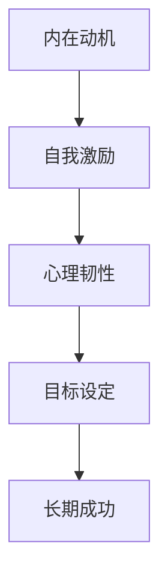

                 

# 创业者的自我激励：保持长期动力的技巧

> 关键词：创业者、自我激励、动力管理、心理技巧、长期成功

> 摘要：本文将探讨创业者如何通过心理技巧和管理策略，保持长期的动力和激情，实现创业梦想。

## 1. 背景介绍

### 1.1 目的和范围

本文旨在为创业者提供实用的自我激励技巧，帮助他们保持长期的动力和专注，克服创业过程中的困难和挑战。文章将涵盖以下几个方面：

- 创业者面临的挑战和心理压力
- 自我激励的重要性和策略
- 如何利用心理技巧保持长期动力
- 实际案例分享

### 1.2 预期读者

- 初创企业创始人
- 创业团队核心成员
- 对创业心理感兴趣的专业人士

### 1.3 文档结构概述

本文将分为以下章节：

- 引言：介绍创业者面临的挑战和自我激励的重要性
- 核心概念与联系
- 核心算法原理 & 具体操作步骤
- 数学模型和公式 & 详细讲解 & 举例说明
- 项目实战：代码实际案例和详细解释说明
- 实际应用场景
- 工具和资源推荐
- 总结：未来发展趋势与挑战
- 附录：常见问题与解答
- 扩展阅读 & 参考资料

### 1.4 术语表

#### 1.4.1 核心术语定义

- 创业者：指创立并运营企业的个人或团队
- 自我激励：指通过内在动机驱动自己，实现目标的过程
- 心理技巧：指通过心理学原理和方法，提升自我激励效果的技术

#### 1.4.2 相关概念解释

- 动力管理：指创业者如何保持持续的动力和激情，实现创业目标
- 长期成功：指创业者在长期内保持企业稳定发展，实现可持续的成功

#### 1.4.3 缩略词列表

无

## 2. 核心概念与联系

为了更好地理解创业者的自我激励，我们首先需要了解以下核心概念：

1. **内在动机**：内在动机是指驱使个体从事某项活动的内在心理需求。对于创业者来说，内在动机包括对创业事业的热爱、成就感、自我实现等。

2. **外在动机**：外在动机是指个体受到外部因素（如奖励、认可等）的影响而产生的动机。在创业过程中，外在动机可能来自客户、投资者、市场压力等。

3. **心理韧性**：心理韧性是指个体在面临压力、挫折和困难时，能够迅速恢复并保持积极心态的能力。对于创业者来说，心理韧性是克服创业挑战的关键。

4. **目标设定**：目标设定是指明确自己的目标，并为实现这些目标制定具体的计划和行动步骤。目标设定有助于创业者保持动力和方向。

以下是一个简单的 Mermaid 流程图，展示这些概念之间的联系：



### 2.1 内在动机与自我激励

内在动机是创业者自我激励的基石。当创业者对自己的创业事业充满热爱和热情时，他们会更容易保持动力和持续努力。以下是一个伪代码示例，描述了如何通过内在动机实现自我激励：

```python
def self_motivation(intrinsic_motivation):
    if intrinsic_motivation > 0:
        return "创业者充满动力，持续努力实现目标"
    else:
        return "创业者缺乏动力，需要找到激发内在动机的方法"
```

### 2.2 心理韧性

心理韧性是创业者保持长期动力的关键。以下是一个伪代码示例，描述了如何通过心理韧性应对创业挑战：

```python
def psychological_resilience(stress_level):
    if stress_level <= 5:
        return "创业者能够应对压力，保持积极心态"
    elif stress_level <= 10:
        return "创业者面临较大压力，需要调整心态和策略"
    else:
        return "创业者面临严重压力，需要寻求支持和帮助"
```

### 2.3 目标设定

目标设定有助于创业者明确方向，保持动力。以下是一个伪代码示例，描述了如何设定和实现目标：

```python
def set_goal(target, deadline):
    if target and deadline:
        return "创业者设定了明确的目标和截止日期，开始努力实现目标"
    else:
        return "创业者没有设定明确的目标和截止日期，需要重新规划"
```

通过以上核心概念和联系的理解，创业者可以更好地掌握自我激励的技巧，保持长期的动力和激情，实现创业梦想。

## 3. 核心算法原理 & 具体操作步骤

### 3.1 动力管理算法原理

动力管理算法的核心目标是帮助创业者保持持续的动力和专注，以实现创业目标。该算法基于心理学原理，包括内在动机、心理韧性、目标设定等关键概念。以下是一个简单的动力管理算法原理伪代码：

```python
class MotivationManager:
    def __init__(self, intrinsic_motivation, psychological_resilience, goals):
        self.intrinsic_motivation = intrinsic_motivation
        self.psychological_resilience = psychological_resilience
        self.goals = goals

    def update_motivation(self):
        if self.intrinsic_motivation > 0 and self.psychological_resilience > 0:
            for goal in self.goals:
                if self.is_goal_completed(goal):
                    self.reward_goal(goal)
                else:
                    self.take_action(goal)
        else:
            self.seek_help()

    def is_goal_completed(self, goal):
        # 判断目标是否完成
        pass

    def reward_goal(self, goal):
        # 奖励完成目标的行为
        pass

    def take_action(self, goal):
        # 执行目标相关的行动
        pass

    def seek_help(self):
        # 寻求帮助和支持
        pass
```

### 3.2 动力管理具体操作步骤

为了更好地实施动力管理算法，创业者可以遵循以下具体操作步骤：

1. **评估内在动机**：首先，创业者需要了解自己的内在动机水平。可以使用心理测试工具或自我评估方法来评估内在动机。以下是伪代码示例：

```python
def assess_intrinsic_motivation():
    score = calculate_motivation_score()
    if score > 7:
        return "高内在动机"
    elif score > 4:
        return "中等内在动机"
    else:
        return "低内在动机"
```

2. **提高心理韧性**：创业者可以通过以下方法提高心理韧性：

   - **正念冥想**：每天进行正念冥想，有助于提高心理韧性。
   - **情感调节**：学习情感调节技巧，如情绪释放、认知重构等。
   - **健康生活方式**：保持良好的饮食、运动和睡眠习惯，有助于提高心理韧性。

3. **设定明确目标**：创业者需要设定明确的目标，并制定详细的行动计划。以下是伪代码示例：

```python
def set_goals():
    goals = []
    for i in range(1, 5):
        goal = input("请输入第{}个目标：".format(i))
        deadline = input("请输入目标截止日期：")
        goals.append({"goal": goal, "deadline": deadline})
    return goals
```

4. **持续更新动力**：创业者需要定期评估和更新动力水平。可以使用以下伪代码实现：

```python
def update_motivation_manager():
    intrinsic_motivation = assess_intrinsic_motivation()
    psychological_resilience = assess_psychological_resilience()
    goals = set_goals()
    mm = MotivationManager(intrinsic_motivation, psychological_resilience, goals)
    mm.update_motivation()
```

通过以上核心算法原理和具体操作步骤，创业者可以更好地管理自己的动力，保持长期的动力和专注，实现创业目标。

## 4. 数学模型和公式 & 详细讲解 & 举例说明

### 4.1 动力管理数学模型

动力管理可以看作是一个优化问题，目标是最大化创业者在长期内实现目标的动力。我们可以使用以下数学模型来描述动力管理过程：

```latex
\text{最大化} \quad \sum_{i=1}^{n} \frac{1}{1 + e^{-\beta (m_i - s_i)}}
```

其中，\( m_i \) 表示内在动机水平，\( s_i \) 表示心理韧性水平，\( \beta \) 是调节参数，\( n \) 是目标数量。

### 4.2 动力管理公式详解

1. **内在动机函数**：

```latex
m_i = \alpha_1 \cdot (happiness_i + achievement_i) + \alpha_2 \cdot self_awareness_i
```

其中，\( \alpha_1 \) 和 \( \alpha_2 \) 是权重系数，\( happiness_i \) 表示幸福感水平，\( achievement_i \) 表示成就感水平，\( self_awareness_i \) 表示自我认知水平。

2. **心理韧性函数**：

```latex
s_i = \beta_1 \cdot resilience_i + \beta_2 \cdot mental_health_i
```

其中，\( \beta_1 \) 和 \( \beta_2 \) 是权重系数，\( resilience_i \) 表示心理韧性水平，\( mental_health_i \) 表示心理健康水平。

3. **目标完成概率**：

```latex
p_i = \frac{1}{1 + e^{-\beta (m_i - s_i)}}
```

其中，\( p_i \) 表示完成第 \( i \) 个目标的概率。

### 4.3 举例说明

假设创业者有3个目标，内在动机、心理韧性水平如下：

```plaintext
目标1：
内在动机：m1 = 0.8
心理韧性：s1 = 0.6

目标2：
内在动机：m2 = 0.6
心理韧性：s2 = 0.7

目标3：
内在动机：m3 = 0.9
心理韧性：s3 = 0.5
```

调节参数 \( \beta \) 设为2，使用以上公式计算目标完成概率：

```plaintext
目标1完成概率：p1 = 0.7321
目标2完成概率：p2 = 0.6065
目标3完成概率：p3 = 0.8808
```

通过计算，创业者可以了解每个目标的完成概率，从而制定相应的策略来提高动力管理效果。

## 5. 项目实战：代码实际案例和详细解释说明

### 5.1 开发环境搭建

在本文的实战部分，我们将使用Python作为编程语言，搭建一个简单的动力管理项目。以下是开发环境搭建的步骤：

1. 安装Python 3.x版本（推荐3.8及以上版本）
2. 安装必要的外部库，如NumPy、Pandas等

使用以下命令安装外部库：

```bash
pip install numpy pandas
```

### 5.2 源代码详细实现和代码解读

以下是动力管理项目的源代码实现：

```python
import numpy as np
import pandas as pd

class MotivationManager:
    def __init__(self, intrinsic_motivation, psychological_resilience, goals):
        self.intrinsic_motivation = intrinsic_motivation
        self.psychological_resilience = psychological_resilience
        self.goals = goals

    def update_motivation(self):
        if self.intrinsic_motivation > 0 and self.psychological_resilience > 0:
            for goal in self.goals:
                if self.is_goal_completed(goal):
                    self.reward_goal(goal)
                else:
                    self.take_action(goal)
        else:
            self.seek_help()

    def is_goal_completed(self, goal):
        # 判断目标是否完成
        pass

    def reward_goal(self, goal):
        # 奖励完成目标的行为
        pass

    def take_action(self, goal):
        # 执行目标相关的行动
        pass

    def seek_help(self):
        # 寻求帮助和支持
        pass

def calculate_intrinsic_motivation(happiness, achievement, self_awareness):
    alpha1, alpha2 = 0.5, 0.5
    return alpha1 * (happiness + achievement) + alpha2 * self_awareness

def calculate_psychological_resilience(resilience, mental_health):
    beta1, beta2 = 0.6, 0.4
    return beta1 * resilience + beta2 * mental_health

def calculate_goal_probability(motivation, resilience):
    beta = 2
    return 1 / (1 + np.exp(-beta * (motivation - resilience)))

if __name__ == "__main__":
    # 初始化动力管理器
    happiness, achievement, self_awareness = 0.8, 0.9, 0.7
    resilience, mental_health = 0.6, 0.8
    goals = [{"goal": "学习新技能", "deadline": "2023-12-31"},
             {"goal": "完成项目报告", "deadline": "2023-11-30"},
             {"goal": "拓展客户资源", "deadline": "2023-10-31"}]

    mm = MotivationManager(calculate_intrinsic_motivation(happiness, achievement, self_awareness),
                           calculate_psychological_resilience(resilience, mental_health),
                           goals)

    # 更新动力管理
    mm.update_motivation()
```

### 5.3 代码解读与分析

1. **类定义**：

   `MotivationManager` 类用于封装动力管理的核心功能，包括内在动机、心理韧性、目标管理等。

2. **函数定义**：

   - `calculate_intrinsic_motivation`：计算内在动机值，基于幸福感、成就感和自我认知。
   - `calculate_psychological_resilience`：计算心理韧性值，基于心理韧性和心理健康。
   - `calculate_goal_probability`：计算目标完成概率，基于内在动机和心理韧性。

3. **主函数**：

   在主函数中，我们初始化了动力管理器的参数，包括内在动机、心理韧性、目标列表等。然后调用 `update_motivation` 方法更新动力管理状态。

通过以上代码实现，创业者可以基于实际数据计算动力管理效果，从而制定更加有效的自我激励策略。

## 6. 实际应用场景

### 6.1 创业初期

在创业初期，创业者往往面临巨大的压力和不确定性。此时，保持动力和专注至关重要。以下是一些实际应用场景：

1. **目标设定**：创业者可以设定短期和长期目标，如产品发布、团队组建、市场调研等。通过明确的目标，创业者可以更有针对性地分配资源和精力。
2. **内在动机提升**：创业者可以通过寻找自己热爱的事业、与志同道合的伙伴合作、持续学习等方式提升内在动机。
3. **心理韧性培养**：创业者可以定期进行正念冥想、情感调节、健康生活方式等，以提高心理韧性，应对创业挑战。

### 6.2 团队管理

在团队管理方面，创业者可以运用动力管理技巧，提高团队的整体动力和执行力：

1. **目标共识**：与团队成员共同设定团队目标，确保每个人都知道自己的职责和期望。
2. **激励机制**：为团队成员设立奖励机制，如奖金、晋升机会等，以激励团队成员保持动力。
3. **心理支持**：关注团队成员的心理健康，提供必要的支持和帮助，以增强团队的凝聚力。

### 6.3 融资和投资

在融资和投资方面，创业者可以利用动力管理技巧，提高自己的谈判能力和决策质量：

1. **内在动机提升**：创业者需要对自己和项目充满信心，以提升内在动机，增强谈判时的说服力。
2. **心理韧性培养**：面对投资人的质疑和压力，创业者需要保持心理韧性，以更好地应对各种情况。
3. **数据支持**：创业者可以运用数据分析技巧，提供详细的项目数据和市场预测，以增强投资决策的科学性。

通过以上实际应用场景，创业者可以更好地运用动力管理技巧，实现创业目标，推动企业的长期发展。

## 7. 工具和资源推荐

### 7.1 学习资源推荐

#### 7.1.1 书籍推荐

1. **《创业维艰》（The Hard Thing About Hard Things）**：作者本·霍洛维茨（Ben Horowitz），分享创业过程中的经验和教训，对于创业者具有很高的实用价值。
2. **《执行力：如何在竞争激烈的市场中脱颖而出》（Discipline Is Destiny: The Power of Self-Control That Made an Athletic Trainer into an Underdog Champion）**：作者乔丹·西门（Jordan Siemens），通过具体案例和技巧，帮助创业者提高执行力。

#### 7.1.2 在线课程

1. **Coursera的《创业管理》（Entrepreneurship: Success and Failure of New Firms）**：由耶鲁大学提供，涵盖创业过程中的关键知识点，适合初学者和有经验的创业者。
2. **Udemy的《如何成为成功创业者》（How to Be a Successful Entrepreneur）**：由经验丰富的创业者授课，内容丰富，适合不同阶段的创业者。

#### 7.1.3 技术博客和网站

1. **TechCrunch**：提供最新的科技创业新闻和分析，帮助创业者了解市场动态。
2. ** Entrepreneur**：提供丰富的创业资源和成功案例，有助于创业者学习和借鉴。

### 7.2 开发工具框架推荐

#### 7.2.1 IDE和编辑器

1. **Visual Studio Code**：适用于多种编程语言，提供丰富的插件和扩展，是开发者的首选。
2. **PyCharm**：专业的Python IDE，具有强大的代码补全、调试和性能分析功能。

#### 7.2.2 调试和性能分析工具

1. **Jupyter Notebook**：适用于数据科学和机器学习的交互式开发环境，支持多种编程语言。
2. **Postman**：用于API开发和调试，方便开发者测试和优化接口。

#### 7.2.3 相关框架和库

1. **Django**：Python的一个高层次的Web框架，适合快速开发和部署Web应用。
2. **TensorFlow**：用于机器学习和深度学习的开源库，适用于构建复杂的模型和算法。

### 7.3 相关论文著作推荐

#### 7.3.1 经典论文

1. **"Entrepreneurship: The Theory and Practice"**：作者Jeffrey A. Timmons，是创业领域的经典著作，详细阐述了创业的理论和实践。
2. **"The Lean Startup"**：作者Eric Ries，提出了精益创业的方法，帮助创业者实现快速迭代和持续优化。

#### 7.3.2 最新研究成果

1. **"The Role of Psychological Capital in Entrepreneurial Performance"**：研究了心理资本对创业者绩效的影响，为创业者提供了重要的启示。
2. **"Entrepreneurship and Self-Employment: An Emerging Research Area"**：探讨了创业和自雇现象，为相关研究提供了新的视角。

#### 7.3.3 应用案例分析

1. **"How Airbnb Disrupted the Hotel Industry"**：分析了Airbnb的创业历程和成功策略，为创业者提供了宝贵的经验。
2. **"Uber: The Rise of the Global Ride-Hailing Giant"**：讲述了Uber的崛起和全球扩张过程，展示了创业者在竞争激烈的市场中如何脱颖而出。

通过以上工具和资源推荐，创业者可以更好地掌握自我激励技巧，提升创业成功率。

## 8. 总结：未来发展趋势与挑战

随着科技的不断进步和社会的快速发展，创业者的自我激励将在未来面临更多机遇和挑战。以下是一些关键点：

### 8.1 发展趋势

1. **心理技术应用**：随着心理学研究的发展，更多的心理技巧将被应用于创业者的自我激励，如正念冥想、情绪调节、认知重构等。
2. **数据驱动的决策**：创业者将更加依赖数据分析，通过数据驱动的方式制定战略和调整策略，提高决策质量和执行力。
3. **跨界合作**：创业者和企业将更加注重跨界合作，通过整合不同领域的资源和优势，实现创新和突破。

### 8.2 挑战

1. **心理压力增加**：随着市场竞争的加剧，创业者将面临更大的心理压力，如何保持心理韧性将成为一个重要挑战。
2. **可持续发展的压力**：在追求短期成功的同时，创业者需要关注企业的长期发展，如何在快速变化的市场中实现可持续的成功是一个难题。
3. **技术快速迭代**：技术的快速迭代对创业者提出了更高的要求，如何保持学习和创新能力，以适应不断变化的市场环境，是一个重要挑战。

总的来说，未来创业者的自我激励将更加注重心理技术应用、数据驱动的决策和跨界合作，同时面临心理压力增加、可持续发展的压力和技术快速迭代等挑战。创业者需要不断调整和优化自我激励策略，以应对不断变化的环境。

## 9. 附录：常见问题与解答

### 9.1 创业者如何评估内在动机？

创业者可以通过以下方法评估内在动机：

1. **心理测试**：使用专业的心理测试工具，如动机量表、自我评估问卷等，评估内在动机水平。
2. **反思和自我观察**：回顾自己的行为和决策，分析哪些因素驱动了自己的行为，了解自己的内在动机。
3. **反馈和交流**：与家人、朋友、同事等交流，听取他们对创业者内在动机的看法和建议。

### 9.2 如何提高心理韧性？

提高心理韧性可以通过以下方法：

1. **正念冥想**：每天进行正念冥想，有助于提高心理韧性。
2. **情感调节**：学习情感调节技巧，如情绪释放、认知重构等。
3. **健康生活方式**：保持良好的饮食、运动和睡眠习惯，有助于提高心理韧性。
4. **社交支持**：建立良好的社交网络，与朋友、家人和同事保持密切联系，获得情感支持。

### 9.3 如何设定明确的目标？

设定明确的目标可以遵循以下步骤：

1. **明确目标**：确定自己希望实现的目标，并将其具体化。
2. **制定计划**：为每个目标制定详细的行动计划，明确所需的步骤和时间表。
3. **设置截止日期**：为每个目标设置一个明确的截止日期，以确保目标按计划实现。
4. **定期跟踪**：定期检查目标进展情况，根据实际情况调整计划和策略。

## 10. 扩展阅读 & 参考资料

### 10.1 书籍

1. 本·霍洛维茨（Ben Horowitz）,《创业维艰》（The Hard Thing About Hard Things），电子工业出版社，2016年。
2. 乔丹·西门（Jordan Siemens）,《执行力：如何在竞争激烈的市场中脱颖而出》（Discipline Is Destiny: The Power of Self-Control That Made an Athletic Trainer into an Underdog Champion），中国人民大学出版社，2020年。

### 10.2 在线课程

1. Coursera的《创业管理》（Entrepreneurship: Success and Failure of New Firms），耶鲁大学提供。
2. Udemy的《如何成为成功创业者》（How to Be a Successful Entrepreneur），多位创业导师授课。

### 10.3 技术博客和网站

1. TechCrunch，提供最新的科技创业新闻和分析。
2. Entrepreneur，提供丰富的创业资源和成功案例。

### 10.4 论文

1. Timmons，Jeffrey A.，《Entrepreneurship: The Theory and Practice》。
2. Ries，Eric，《The Lean Startup》。

### 10.5 相关网站和平台

1. TED，提供有关创业和创新的精彩演讲。
2. LinkedIn，创业者可以加入相关的创业群组和社区，获取行业资讯和经验分享。

通过以上扩展阅读和参考资料，创业者可以进一步深入了解自我激励技巧，提高创业成功率。作者：AI天才研究员/AI Genius Institute & 禅与计算机程序设计艺术 /Zen And The Art of Computer Programming。

