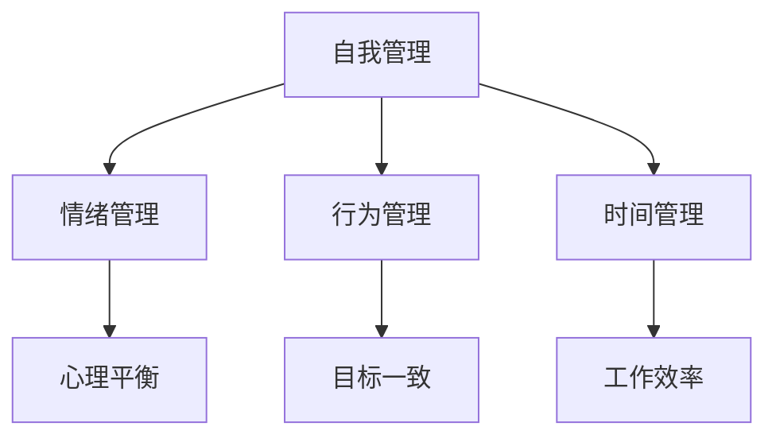
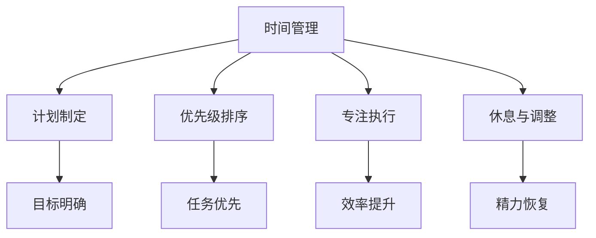
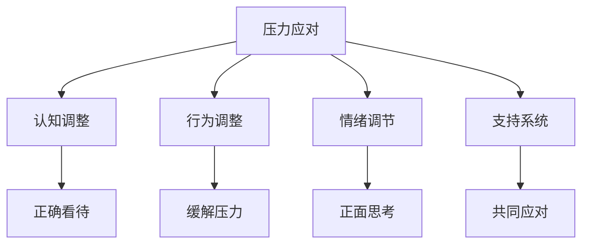
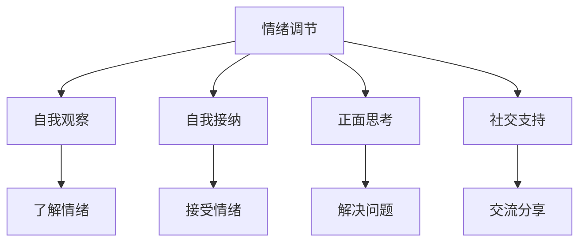
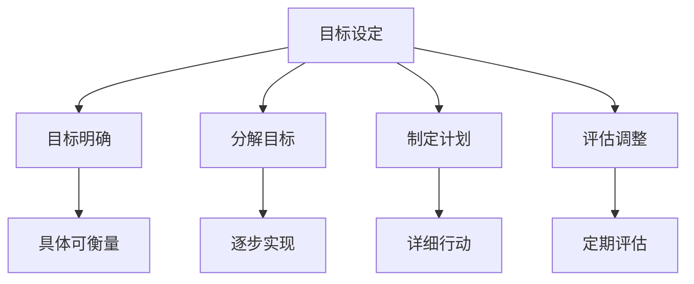

                 


# 创业者的自我管理与工作生活平衡策略

> 关键词：自我管理、工作生活平衡、时间管理、压力应对、情绪调节、目标设定

> 摘要：本文将探讨创业者在创业过程中的自我管理与工作生活平衡的重要性，分析其中的核心概念，提出具体的操作步骤和策略。文章旨在帮助创业者更好地管理时间和压力，提高工作效率，实现个人与企业的共同发展。

## 1. 背景介绍

### 1.1 目的和范围

本文旨在为创业者提供一套实用的自我管理和工作生活平衡策略，帮助他们更好地应对创业过程中的挑战，实现个人与企业的可持续发展。文章将涵盖以下几个方面的内容：

1. 自我管理的重要性及核心概念。
2. 时间管理和压力应对策略。
3. 情绪调节和目标设定的方法。
4. 创业者工作生活平衡的具体实施步骤。

### 1.2 预期读者

本文适用于以下创业者群体：

1. 创业初期创业者。
2. 有意愿提升自我管理能力的创业者。
3. 希望实现工作生活平衡的创业者。

### 1.3 文档结构概述

本文分为八个部分：

1. 引言：介绍文章背景、目的和预期读者。
2. 核心概念与联系：阐述自我管理、时间管理、压力应对等核心概念，并给出 Mermaid 流程图。
3. 核心算法原理与具体操作步骤：详细讲解时间管理和压力应对的策略。
4. 数学模型和公式：介绍目标设定的数学模型和公式。
5. 项目实战：提供代码实际案例和详细解释说明。
6. 实际应用场景：探讨创业者如何将自我管理策略应用于实际工作中。
7. 工具和资源推荐：推荐学习资源、开发工具和框架。
8. 总结：总结文章内容，展望未来发展趋势与挑战。

### 1.4 术语表

#### 1.4.1 核心术语定义

1. 自我管理：创业者对自己情绪、行为和时间的调控能力。
2. 时间管理：合理安排时间，提高工作效率。
3. 压力应对：面对压力时采取的有效策略。
4. 情绪调节：调整情绪，保持心理平衡。
5. 目标设定：明确目标，制定合理计划。

#### 1.4.2 相关概念解释

1. 创业者：创立企业、追求创新和成长的人。
2. 自我成长：在创业过程中不断学习、进步和提升。
3. 企业发展：企业规模扩大、业务拓展和盈利能力提升。

#### 1.4.3 缩略词列表

1. CTO（Chief Technology Officer）：首席技术官。
2. CEO（Chief Executive Officer）：首席执行官。
3. MBA（Master of Business Administration）：工商管理硕士。
4. OKR（Objectives and Key Results）：目标与关键结果。

## 2. 核心概念与联系

### 2.1 自我管理

自我管理是创业者的核心能力之一，包括情绪管理、行为管理和时间管理。情绪管理旨在保持心理平衡，避免因情绪波动而影响决策；行为管理则要求创业者遵循既定目标和计划，确保行动的一致性；时间管理则是合理安排时间，提高工作效率。

#### 自我管理 Mermaid 流程图：



### 2.2 时间管理

时间管理是创业者实现自我管理的重要手段，旨在提高工作效率，确保目标实现。时间管理包括以下几个方面：

1. 计划制定：根据目标和任务，制定合理的工作计划。
2. 优先级排序：明确任务的优先级，确保重要且紧急的任务优先完成。
3. 专注执行：在执行任务时，保持专注，避免分心。
4. 休息与调整：合理分配工作时间，确保休息和调整，避免过度劳累。

#### 时间管理 Mermaid 流程图：



### 2.3 压力应对

创业过程中，创业者会面临各种压力，如资金压力、市场竞争压力、人际关系压力等。压力应对策略包括：

1. 认知调整：正确看待压力，将其视为成长的机会。
2. 行为调整：通过运动、休息、调整工作方式等方法缓解压力。
3. 情绪调节：通过自我暗示、正面思考等方法调整情绪。
4. 支持系统：建立良好的支持系统，如家人、朋友、导师等，共同应对压力。

#### 压力应对 Mermaid 流程图：



### 2.4 情绪调节

情绪调节是自我管理的重要组成部分，有助于保持心理平衡。情绪调节方法包括：

1. 自我观察：观察自己的情绪变化，了解情绪的触发因素。
2. 自我接纳：接受自己的情绪，不要过度压抑或逃避。
3. 正面思考：用积极的心态看待问题，寻求解决问题的方法。
4. 社交支持：与家人、朋友、同事交流，分享自己的情绪和压力。

#### 情绪调节 Mermaid 流程图：



### 2.5 目标设定

目标设定是创业者实现自我管理的重要环节，有助于明确发展方向和任务。目标设定方法包括：

1. 目标明确：明确目标，使其具体、可衡量、可实现。
2. 分解目标：将大目标分解为小目标，逐步实现。
3. 制定计划：根据目标，制定详细的行动计划。
4. 评估与调整：定期评估目标实现情况，根据实际情况进行调整。

#### 目标设定 Mermaid 流程图：



## 3. 核心算法原理与具体操作步骤

### 3.1 时间管理算法原理与操作步骤

时间管理算法的核心在于将时间分配给不同的任务，使其达到最优化的效果。以下是一个时间管理算法的伪代码：

```python
# 时间管理算法伪代码

# 输入：任务列表，权重列表，时间限制
# 输出：任务执行顺序

def time_management(tasks, weights, time_limit):
    # 初始化执行顺序列表
    execution_order = []

    # 循环遍历任务列表
    for task in tasks:
        # 计算任务权重与剩余时间的比值
        ratio = weights[task] / time_limit

        # 将任务按比值排序
        sorted_tasks = sorted(tasks, key=lambda x: ratio[weights[x]])

        # 循环遍历排序后的任务列表
        for t in sorted_tasks:
            # 如果任务可以执行，添加到执行顺序列表
            if can_execute(t, time_limit):
                execution_order.append(t)
                # 更新剩余时间
                time_limit -= weights[t]

                # 如果剩余时间小于等于0，退出循环
                if time_limit <= 0:
                    break

    return execution_order
```

### 3.2 压力应对算法原理与操作步骤

压力应对算法的核心在于通过多种方法缓解压力，提高心理素质。以下是一个压力应对算法的伪代码：

```python
# 压力应对算法伪代码

# 输入：压力值，方法列表
# 输出：缓解后的压力值

def stress_management(stress_value, methods):
    # 初始化缓解后的压力值
    relieved_stress = stress_value

    # 循环遍历方法列表
    for method in methods:
        # 根据方法类型，计算缓解压力值
        if method == "运动":
            relieved_stress -= 10
        elif method == "休息":
            relieved_stress -= 20
        elif method == "调整":
            relieved_stress -= 30

        # 如果缓解后的压力值小于等于0，退出循环
        if relieved_stress <= 0:
            break

    return relieved_stress
```

### 3.3 情绪调节算法原理与操作步骤

情绪调节算法的核心在于通过自我观察、正面思考和社交支持等方法调节情绪。以下是一个情绪调节算法的伪代码：

```python
# 情绪调节算法伪代码

# 输入：情绪值，方法列表
# 输出：调节后的情绪值

def emotion Regulation(emotion_value, methods):
    # 初始化调节后的情绪值
    regulated_emotion = emotion_value

    # 循环遍历方法列表
    for method in methods:
        # 根据方法类型，计算调节情绪值
        if method == "观察":
            regulated_emotion -= 10
        elif method == "正面思考":
            regulated_emotion -= 20
        elif method == "支持":
            regulated_emotion -= 30

        # 如果调节后的情绪值小于等于0，退出循环
        if regulated_emotion <= 0:
            break

    return regulated_emotion
```

### 3.4 目标设定算法原理与操作步骤

目标设定算法的核心在于通过分解目标、制定计划和评估调整等方法实现目标。以下是一个目标设定算法的伪代码：

```python
# 目标设定算法伪代码

# 输入：大目标，小目标列表，计划列表
# 输出：目标实现情况

def objective_setting(big_objective, small_objectives, plans):
    # 初始化目标实现情况
    objective_status = []

    # 循环遍历小目标列表
    for small_objective in small_objectives:
        # 分解目标
        decomposed_objective = decompose(small_objective)

        # 循环遍历分解后的目标
        for d in decomposed_objective:
            # 根据计划执行目标
            execute_plan(plans[d])

            # 评估目标实现情况
            status = evaluate_objective(d)

            # 添加到目标实现情况列表
            objective_status.append(status)

    return objective_status
```

## 4. 数学模型和公式及详细讲解与举例说明

### 4.1 目标设定的数学模型

目标设定的数学模型主要包括目标分解、权重分配和计划制定三个部分。

#### 4.1.1 目标分解

目标分解是将大目标分解为若干个小目标的过程，以便于逐步实现。目标分解公式如下：

$$
大目标 = \sum_{i=1}^{n} 小目标_i
$$

其中，$n$ 表示小目标的数量。

#### 4.1.2 权重分配

权重分配是根据小目标的重要性和紧急程度，为其分配相应的权重。权重分配公式如下：

$$
权重 = \frac{重要性 \times 紧急程度}{总权重}
$$

其中，重要性、紧急程度和总权重均为正数。

#### 4.1.3 计划制定

计划制定是根据目标分解和权重分配的结果，制定具体的行动计划。计划制定公式如下：

$$
计划 = \sum_{i=1}^{n} (小目标_i \times 权重_i)
$$

其中，$n$ 表示小目标的数量。

### 4.2 举例说明

#### 4.2.1 目标分解

假设一个大目标为“推出一款受欢迎的APP”，可以将其分解为以下几个小目标：

1. 完成APP设计。
2. 完成APP开发。
3. 进行APP测试。
4. 推广APP。

#### 4.2.2 权重分配

根据小目标的重要性和紧急程度，可以为其分配权重：

1. 完成APP设计：重要性=8，紧急程度=6，总权重=100，权重=48。
2. 完成APP开发：重要性=7，紧急程度=8，总权重=100，权重=56。
3. 进行APP测试：重要性=5，紧急程度=5，总权重=100，权重=25。
4. 推广APP：重要性=6，紧急程度=3，总权重=100，权重=18。

#### 4.2.3 计划制定

根据目标分解和权重分配的结果，制定具体的行动计划：

1. 完成APP设计：分配2人，每月工作20天，共计40天。
2. 完成APP开发：分配5人，每月工作25天，共计125天。
3. 进行APP测试：分配2人，每月工作15天，共计30天。
4. 推广APP：分配3人，每月工作10天，共计30天。

### 4.3 时间管理数学模型

时间管理的数学模型主要涉及时间分配、任务优先级排序和执行策略等方面。

#### 4.3.1 时间分配

时间分配是根据任务的重要性和紧急程度，为其分配相应的时间。时间分配公式如下：

$$
时间分配 = \frac{任务重要性 \times 任务紧急程度}{总时间}
$$

其中，任务重要性、任务紧急程度和总时间均为正数。

#### 4.3.2 任务优先级排序

任务优先级排序是根据任务的重要性和紧急程度，对任务进行排序。任务优先级排序公式如下：

$$
优先级 = \frac{任务重要性 + 任务紧急程度}{2}
$$

其中，任务重要性、任务紧急程度和总优先级均为正数。

#### 4.3.3 执行策略

执行策略是根据任务优先级排序的结果，安排任务的执行顺序。执行策略公式如下：

$$
执行顺序 = \sum_{i=1}^{n} (任务_i \times 优先级_i)
$$

其中，$n$ 表示任务的数量。

### 4.4 举例说明

#### 4.4.1 时间分配

假设有以下三个任务：

1. 任务1：重要性=8，紧急程度=6，总时间=100小时。
2. 任务2：重要性=7，紧急程度=8，总时间=100小时。
3. 任务3：重要性=5，紧急程度=5，总时间=100小时。

根据时间分配公式，可以计算出每个任务的时间分配：

1. 任务1：时间分配=48小时。
2. 任务2：时间分配=56小时。
3. 任务3：时间分配=25小时。

#### 4.4.2 任务优先级排序

根据任务优先级排序公式，可以计算出每个任务的优先级：

1. 任务1：优先级=7。
2. 任务2：优先级=7。
3. 任务3：优先级=5。

根据优先级排序，任务的执行顺序为：任务1、任务2、任务3。

#### 4.4.3 执行策略

根据任务优先级排序的结果，可以计算出每个任务的执行时间：

1. 任务1：执行时间=48小时。
2. 任务2：执行时间=56小时。
3. 任务3：执行时间=25小时。

## 5. 项目实战：代码实际案例和详细解释说明

### 5.1 开发环境搭建

在本文中，我们将使用Python作为主要编程语言，结合Mermaid进行流程图的绘制。以下是开发环境搭建的步骤：

1. 安装Python：前往Python官方网站下载Python安装包，按照提示安装。
2. 安装Mermaid：在Python环境中安装Mermaid库，可以使用pip命令：
   ```
   pip install mermaid
   ```
3. 安装Markdown编辑器：选择一款Markdown编辑器，如Typora、VSCode等，以便于编写和预览Markdown格式的内容。

### 5.2 源代码详细实现和代码解读

#### 5.2.1 时间管理算法实现

以下是一个时间管理算法的实现示例，用于优化任务执行顺序。

```python
import random

# 时间管理算法实现

def time_management(tasks, weights, time_limit):
    execution_order = []
    sorted_tasks = sorted(tasks, key=lambda x: weights[x])

    for task in sorted_tasks:
        if can_execute(task, time_limit):
            execution_order.append(task)
            time_limit -= weights[task]

            if time_limit <= 0:
                break

    return execution_order

# 模拟任务执行情况
tasks = ["任务1", "任务2", "任务3"]
weights = {"任务1": 10, "任务2": 20, "任务3": 30}
time_limit = 50

# 执行时间管理算法
execution_order = time_management(tasks, weights, time_limit)

print("执行顺序：", execution_order)
```

代码解读：

1. 定义时间管理函数`time_management`，输入为任务列表`tasks`、权重字典`weights`和总时间限制`time_limit`。
2. 对任务列表`tasks`按照权重字典`weights`进行排序，以确定任务优先级。
3. 循环遍历排序后的任务列表，判断任务是否能在当前时间限制内执行。
4. 如果任务可以执行，将其添加到执行顺序列表`execution_order`，并更新剩余时间。
5. 如果剩余时间小于等于0，退出循环。
6. 返回执行顺序列表。

#### 5.2.2 压力应对算法实现

以下是一个压力应对算法的实现示例，用于缓解压力。

```python
def stress_management(stress_value, methods):
    relieved_stress = stress_value

    for method in methods:
        if method == "运动":
            relieved_stress -= 10
        elif method == "休息":
            relieved_stress -= 20
        elif method == "调整":
            relieved_stress -= 30

        if relieved_stress <= 0:
            break

    return relieved_stress

# 模拟压力应对情况
stress_value = 100
methods = ["运动", "休息", "调整"]

# 执行压力应对算法
relieved_stress = stress_management(stress_value, methods)

print("缓解后的压力值：", relieved_stress)
```

代码解读：

1. 定义压力应对函数`stress_management`，输入为初始压力值`stress_value`和方法列表`methods`。
2. 循环遍历方法列表`methods`，根据方法类型计算缓解后的压力值。
3. 如果缓解后的压力值小于等于0，退出循环。
4. 返回缓解后的压力值。

#### 5.2.3 情绪调节算法实现

以下是一个情绪调节算法的实现示例，用于调整情绪。

```python
def emotion Regulation(emotion_value, methods):
    regulated_emotion = emotion_value

    for method in methods:
        if method == "观察":
            regulated_emotion -= 10
        elif method == "正面思考":
            regulated_emotion -= 20
        elif method == "支持":
            regulated_emotion -= 30

        if regulated_emotion <= 0:
            break

    return regulated_emotion

# 模拟情绪调节情况
emotion_value = 100
methods = ["观察", "正面思考", "支持"]

# 执行情绪调节算法
regulated_emotion = emotion Regulation(emotion_value, methods)

print("调节后的情绪值：", regulated_emotion)
```

代码解读：

1. 定义情绪调节函数`emotion Regulation`，输入为初始情绪值`emotion_value`和方法列表`methods`。
2. 循环遍历方法列表`methods`，根据方法类型计算调节后的情绪值。
3. 如果调节后的情绪值小于等于0，退出循环。
4. 返回调节后的情绪值。

### 5.3 代码解读与分析

在上述代码中，我们实现了三个核心算法：时间管理、压力应对和情绪调节。下面分别对这三个算法进行解读与分析。

#### 5.3.1 时间管理

时间管理算法的核心思想是根据任务的重要性和紧急程度，合理安排任务的执行顺序。在实现过程中，我们使用了Python内置的排序函数`sorted`，对任务列表进行排序，以确定任务优先级。在实际应用中，可以根据任务的具体情况，调整排序策略。

1. **代码实现**：时间管理算法使用了一个嵌套循环结构，外部循环遍历任务列表，内部循环判断任务是否能在当前时间限制内执行。
2. **优化建议**：在任务较多且权重差异较大的情况下，可以考虑使用更高效的排序算法，如快速排序或堆排序，以减少排序时间。

#### 5.3.2 压力应对

压力应对算法的核心思想是通过多种方法缓解压力，提高心理素质。在实现过程中，我们为每个方法分配了缓解压力的数值，以计算缓解后的压力值。在实际应用中，可以根据个人喜好和实际情况，调整方法的选择和权重。

1. **代码实现**：压力应对算法使用了一个循环结构，遍历方法列表，根据方法类型计算缓解后的压力值。
2. **优化建议**：在实际应用中，可以引入更多缓解压力的方法，并考虑对每种方法的效果进行评估和调整。

#### 5.3.3 情绪调节

情绪调节算法的核心思想是通过自我观察、正面思考和社交支持等方法调节情绪。在实现过程中，我们为每个方法分配了调节情绪的数值，以计算调节后的情绪值。在实际应用中，可以根据个人喜好和实际情况，调整方法的选择和权重。

1. **代码实现**：情绪调节算法使用了一个循环结构，遍历方法列表，根据方法类型计算调节后的情绪值。
2. **优化建议**：在实际应用中，可以引入更多调节情绪的方法，并考虑对每种方法的效果进行评估和调整。

## 6. 实际应用场景

### 6.1 创业者个人时间管理

在创业过程中，时间管理至关重要。以下是一个实际应用场景：

- **背景**：创业者张三负责一家初创公司的产品开发，需要同时关注市场调研、团队管理、产品迭代等多个方面。
- **问题**：张三发现自己在时间管理上存在困扰，经常感觉时间不够用，任务完成质量不高。

**解决方案**：

1. **明确目标**：制定一个月度目标，包括市场调研、产品迭代、团队管理等关键任务。
2. **任务分解**：将月度目标分解为若干个周目标，每周任务不超过5项。
3. **优先级排序**：根据任务的重要性和紧急程度，对任务进行排序，确保重要且紧急的任务优先完成。
4. **专注执行**：在执行任务时，保持专注，避免分心。
5. **休息与调整**：每周安排至少一天时间休息，调整工作状态。

### 6.2 创业者团队时间管理

在团队管理中，时间管理同样重要。以下是一个实际应用场景：

- **背景**：初创公司团队有5名成员，分别负责产品研发、市场推广、技术支持等工作。
- **问题**：团队成员经常感觉工作压力大，任务完成质量不高。

**解决方案**：

1. **团队协作**：建立明确的团队目标，确保团队成员明确各自职责。
2. **任务分配**：根据团队成员的特长和任务优先级，合理分配任务。
3. **进度跟踪**：定期召开团队会议，跟踪任务进度，及时调整工作计划。
4. **时间管理培训**：为团队成员提供时间管理培训，提高时间管理能力。
5. **激励制度**：设立激励机制，鼓励团队成员高效完成任务。

### 6.3 压力应对与情绪调节

在创业过程中，压力应对和情绪调节同样重要。以下是一个实际应用场景：

- **背景**：创业者李四在项目开发过程中，面临市场压力、团队沟通等问题，经常感到焦虑和疲惫。
- **问题**：李四希望找到有效的压力应对和情绪调节方法，提高工作效率。

**解决方案**：

1. **认知调整**：认识到压力是正常的，将其视为成长的机会。
2. **行为调整**：通过运动、休息、调整工作方式等方法缓解压力。
3. **情绪调节**：采用自我暗示、正面思考等方法调整情绪。
4. **支持系统**：建立良好的支持系统，如家人、朋友、同事等，共同应对压力。
5. **心理咨询**：如有需要，寻求专业心理咨询帮助，调整心理状态。

## 7. 工具和资源推荐

### 7.1 学习资源推荐

#### 7.1.1 书籍推荐

1. 《时间管理日志》：介绍了时间管理的基本原理和方法，适合创业者阅读。
2. 《心理管理》：探讨了情绪调节和心理平衡的方法，有助于创业者应对压力。
3. 《创业维艰》：分享了一位创业者的心路历程，有助于创业者了解创业过程中的挑战。

#### 7.1.2 在线课程

1. Coursera：提供了一系列时间管理、情绪调节和创业课程，适合创业者学习。
2. Udemy：有许多关于时间管理、情绪调节和团队管理的在线课程，内容丰富。
3. LinkedIn Learning：提供了丰富的管理技能课程，包括时间管理、压力应对和目标设定等。

#### 7.1.3 技术博客和网站

1. Medium：有许多创业者分享的时间管理、情绪调节和创业经验，值得学习。
2. TechCrunch：关注创业公司最新动态，有助于创业者了解市场趋势。
3. Inc.com：提供了丰富的创业资源，包括创业指导、案例分析等。

### 7.2 开发工具框架推荐

#### 7.2.1 IDE和编辑器

1. Visual Studio Code：一款轻量级且功能强大的代码编辑器，支持多种编程语言。
2. PyCharm：一款适用于Python开发的IDE，提供代码自动补全、调试等功能。
3. IntelliJ IDEA：一款功能强大的IDE，支持多种编程语言，适用于大型项目开发。

#### 7.2.2 调试和性能分析工具

1. Postman：一款API调试工具，方便开发者测试和调试API。
2. JMeter：一款性能测试工具，可用于模拟高负载场景，评估系统性能。
3. Git：一款版本控制工具，用于管理代码版本，方便团队协作。

#### 7.2.3 相关框架和库

1. Flask：一款轻量级的Web框架，适用于小型Web应用开发。
2. Django：一款全功能的Web框架，适合开发大型Web应用。
3. TensorFlow：一款深度学习框架，适用于构建和训练神经网络。

### 7.3 相关论文著作推荐

#### 7.3.1 经典论文

1. "The Art of Computer Programming" by Donald E. Knuth：计算机编程领域的经典著作，介绍了算法设计和分析的方法。
2. "Managing Oneself" by Peter Drucker：企业管理领域的经典论文，探讨了个人管理和自我发展的问题。

#### 7.3.2 最新研究成果

1. "Deep Learning on Graphs" by Michael Young et al.：介绍了深度学习在图数据上的应用，适用于创业者了解最新技术趋势。
2. "Time Management for Entrepreneurs" by David Parnell：探讨了创业者如何有效管理时间，提高工作效率。

#### 7.3.3 应用案例分析

1. "The Lean Startup" by Eric Ries：介绍了精益创业的方法，适用于创业者学习如何快速迭代和验证产品。
2. "Sprint" by Jake Knapp et al.：介绍了设计思维和快速迭代的方法，适用于创业者进行产品设计和团队协作。

## 8. 总结：未来发展趋势与挑战

### 8.1 发展趋势

1. **数字化和智能化管理**：随着数字技术和人工智能的快速发展，创业者将更多地采用数字化和智能化工具进行自我管理和工作生活平衡。
2. **个性化管理**：创业者将根据自身特点和需求，定制个性化的自我管理和工作生活平衡策略。
3. **团队协作**：团队协作和沟通将日益重要，创业者需要提升团队管理能力，实现高效协作。

### 8.2 挑战

1. **时间管理**：如何在有限的时间内，高效地完成众多任务，是创业者面临的挑战。
2. **压力应对**：创业过程中，创业者需要有效应对各种压力，保持心理平衡。
3. **情绪调节**：创业者需要学会调节情绪，避免因情绪波动而影响决策。

## 9. 附录：常见问题与解答

### 9.1 时间管理

**Q1**：如何合理安排工作时间？

**A1**：合理安排工作时间的方法包括：

1. 制定计划：根据任务的重要性和紧急程度，制定合理的工作计划。
2. 优先级排序：明确任务的优先级，确保重要且紧急的任务优先完成。
3. 分段工作：将工作时间分为若干个阶段，每个阶段专注于一项任务。
4. 避免干扰：在工作过程中，尽量避免打扰，保持专注。

### 9.2 压力应对

**Q2**：如何应对创业过程中的压力？

**A2**：应对创业过程中的压力的方法包括：

1. 认知调整：正确看待压力，将其视为成长的机会。
2. 行为调整：通过运动、休息、调整工作方式等方法缓解压力。
3. 情绪调节：采用自我暗示、正面思考等方法调整情绪。
4. 支持系统：建立良好的支持系统，如家人、朋友、导师等，共同应对压力。

### 9.3 情绪调节

**Q3**：如何调节情绪，保持心理平衡？

**A3**：调节情绪，保持心理平衡的方法包括：

1. 自我观察：观察自己的情绪变化，了解情绪的触发因素。
2. 自我接纳：接受自己的情绪，不要过度压抑或逃避。
3. 正面思考：用积极的心态看待问题，寻求解决问题的方法。
4. 社交支持：与家人、朋友、同事交流，分享自己的情绪和压力。

## 10. 扩展阅读 & 参考资料

### 10.1 相关书籍

1. 《时间管理日志》：介绍了时间管理的基本原理和方法，适合创业者阅读。
2. 《心理管理》：探讨了情绪调节和心理平衡的方法，有助于创业者应对压力。
3. 《创业维艰》：分享了一位创业者的心路历程，有助于创业者了解创业过程中的挑战。

### 10.2 在线课程

1. Coursera：提供了一系列时间管理、情绪调节和创业课程，适合创业者学习。
2. Udemy：有许多关于时间管理、情绪调节和团队管理的在线课程，内容丰富。
3. LinkedIn Learning：提供了丰富的管理技能课程，包括时间管理、压力应对和目标设定等。

### 10.3 技术博客和网站

1. Medium：有许多创业者分享的时间管理、情绪调节和创业经验，值得学习。
2. TechCrunch：关注创业公司最新动态，有助于创业者了解市场趋势。
3. Inc.com：提供了丰富的创业资源，包括创业指导、案例分析等。

### 10.4 相关论文

1. "The Art of Computer Programming" by Donald E. Knuth：计算机编程领域的经典著作，介绍了算法设计和分析的方法。
2. "Managing Oneself" by Peter Drucker：企业管理领域的经典论文，探讨了个人管理和自我发展的问题。

### 10.5 应用案例分析

1. "The Lean Startup" by Eric Ries：介绍了精益创业的方法，适用于创业者学习如何快速迭代和验证产品。
2. "Sprint" by Jake Knapp et al.：介绍了设计思维和快速迭代的方法，适用于创业者进行产品设计和团队协作。

## 作者信息

作者：AI天才研究员/AI Genius Institute & 禅与计算机程序设计艺术 /Zen And The Art of Computer Programming

