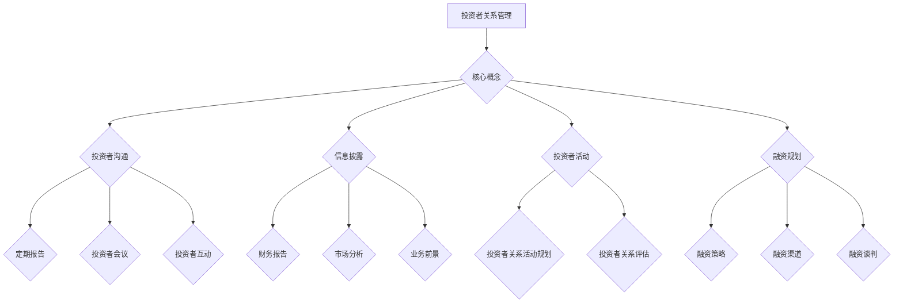

                 

## 1. 背景介绍

### 1.1 目的和范围

本文旨在探讨创业者在创业过程中如何有效管理投资者关系，以维护良好关系并促进企业的长期发展。我们将深入分析投资者关系管理的核心概念、关键策略和实践方法，旨在为创业者提供系统化、实用的指导。

文章将涵盖以下范围：

1. **核心概念与联系**：介绍投资者关系管理的基本概念，并使用Mermaid流程图展示其核心原理和架构。
2. **核心算法原理与具体操作步骤**：阐述投资者关系管理的具体操作步骤，并使用伪代码详细阐述核心算法原理。
3. **数学模型和公式**：介绍与投资者关系管理相关的数学模型和公式，并进行详细讲解和举例说明。
4. **项目实战**：通过实际案例展示投资者关系管理的应用，并详细解释代码实现和解析。
5. **实际应用场景**：探讨投资者关系管理在不同行业和场景下的具体应用。
6. **工具和资源推荐**：推荐相关学习资源、开发工具框架和论文著作，以帮助读者深入了解和掌握投资者关系管理。
7. **总结**：分析投资者关系管理未来的发展趋势和挑战。

### 1.2 预期读者

本文适合以下读者群体：

1. 创业者：希望了解投资者关系管理的重要性、策略和实践方法。
2. 投资者关系管理人员：需要提升管理水平和实战能力的专业人士。
3. 企业高管：关注企业长期发展，希望掌握投资者关系管理的核心技巧。
4. 技术专家和软件开发人员：关注人工智能、大数据等前沿技术，希望了解其在投资者关系管理中的应用。

### 1.3 文档结构概述

本文分为以下几个部分：

1. **背景介绍**：介绍文章的目的、范围、预期读者和文档结构。
2. **核心概念与联系**：使用Mermaid流程图展示投资者关系管理的核心概念和架构。
3. **核心算法原理与具体操作步骤**：阐述投资者关系管理的具体操作步骤，并使用伪代码详细阐述核心算法原理。
4. **数学模型和公式**：介绍与投资者关系管理相关的数学模型和公式，并进行详细讲解和举例说明。
5. **项目实战**：通过实际案例展示投资者关系管理的应用，并详细解释代码实现和解析。
6. **实际应用场景**：探讨投资者关系管理在不同行业和场景下的具体应用。
7. **工具和资源推荐**：推荐相关学习资源、开发工具框架和论文著作。
8. **总结**：分析投资者关系管理未来的发展趋势和挑战。
9. **附录**：常见问题与解答。
10. **扩展阅读 & 参考资料**：提供进一步学习的资源和参考。

### 1.4 术语表

#### 1.4.1 核心术语定义

- **投资者关系管理**（Investor Relations Management,IRM）：指企业为与投资者建立、维护和提升关系所采取的一系列策略和行动。
- **创业**（Entrepreneurship）：指创建新企业或在新领域开展业务的过程。
- **投资者**（Investor）：指愿意为企业提供资金并分享企业未来收益的个人或机构。
- **融资**（Funding）：指企业通过向投资者出售股票或债券等证券以获取资金的过程。

#### 1.4.2 相关概念解释

- **融资周期**（Funding Cycle）：指企业从融资准备到完成融资的过程，包括准备、寻找投资者、谈判、签署协议等阶段。
- **投资者沟通**（Investor Communication）：指企业与投资者之间通过各种渠道进行的交流、互动和信息披露。
- **投资者关系活动**（Investor Relations Activities）：指企业为与投资者建立、维护和提升关系所采取的具体行动，如定期报告、投资者会议、路演等。

#### 1.4.3 缩略词列表

- **IRM**：投资者关系管理（Investor Relations Management）
- **IPO**：首次公开募股（Initial Public Offering）
- **VC**：风险投资（Venture Capital）
- **PE**：私募股权（Private Equity）
- **ROI**：投资回报率（Return on Investment）

### 1.5 Mermaid流程图

以下是投资者关系管理的核心概念和架构的Mermaid流程图：



这个流程图展示了投资者关系管理的核心概念和架构，包括投资者沟通、信息披露、投资者活动、融资规划等关键组成部分。通过这个流程图，我们可以更直观地了解投资者关系管理的整体框架和具体实施步骤。

接下来，我们将进一步探讨投资者关系管理的核心概念和原理，帮助读者深入了解这一领域。在接下来的章节中，我们将逐步分析投资者关系管理的关键组成部分，为创业者提供实用的指导。让我们一起踏上这段探索之旅！
<|assistant|>
## 2. 核心概念与联系

投资者关系管理（IRM）是一个涉及多个核心概念和复杂联系的领域。在这一章节中，我们将详细探讨这些核心概念，并通过Mermaid流程图展示其原理和架构。

### 2.1 投资者关系管理的核心概念

投资者关系管理的核心概念包括投资者沟通、信息披露、投资者活动和融资规划等。

- **投资者沟通**（Investor Communication）：指企业与投资者之间通过各种渠道进行的交流、互动和信息披露。良好的沟通有助于建立信任、增强投资者信心，并确保信息透明。
- **信息披露**（Disclosure）：指企业向投资者披露相关信息，包括财务报告、业务前景、市场分析等。信息披露是投资者关系管理的重要组成部分，有助于维护投资者权益。
- **投资者活动**（Investor Activities）：指企业与投资者共同参与的活动，如定期报告、投资者会议、路演等。这些活动有助于加强投资者与企业的联系，提升投资者满意度。
- **融资规划**（Funding Planning）：指企业为获取资金所进行的规划，包括融资策略、融资渠道和融资谈判等。良好的融资规划有助于企业获得所需的资金，支持业务发展。

### 2.2 投资者关系管理的Mermaid流程图

以下是一个展示投资者关系管理核心概念和架构的Mermaid流程图：


这个流程图展示了投资者关系管理的核心概念和架构，包括投资者沟通、信息披露、投资者活动和融资规划等关键组成部分。通过这个流程图，我们可以更直观地了解投资者关系管理的整体框架和具体实施步骤。

### 2.3 投资者关系管理的核心原理

投资者关系管理的核心原理包括以下几个方面：

- **信息透明**：企业通过信息披露，向投资者提供全面的、准确的、及时的信息，确保信息透明。透明度有助于建立信任、增强投资者信心，从而有利于企业的长期发展。
- **互动沟通**：企业通过投资者沟通，与投资者建立互动，了解他们的需求和期望，并及时反馈。良好的沟通有助于建立稳定的投资者关系，提高投资者满意度。
- **价值创造**：企业通过投资者关系管理，为投资者创造价值。这包括通过融资规划获得资金，支持业务发展，从而实现企业的长期价值。
- **风险评估**：企业通过投资者关系管理，识别和评估潜在的风险，并采取相应的措施进行风险控制。良好的风险评估有助于企业保持稳健的发展态势。

### 2.4 投资者关系管理的关键联系

投资者关系管理涉及多个关键联系，包括企业内部各部门之间的联系、企业与投资者之间的联系，以及企业与监管机构、市场之间的联系。

- **企业内部各部门之间的联系**：投资者关系管理需要企业内部各部门的协同合作，包括财务部门、市场部门、公关部门等。各部门之间的紧密联系有助于确保投资者关系管理的有效实施。
- **企业与投资者之间的联系**：企业与投资者之间的密切联系有助于建立稳定的投资者关系，提高投资者满意度。通过定期报告、投资者会议、路演等活动，企业可以与投资者保持沟通，及时了解他们的需求和期望。
- **企业与监管机构、市场之间的联系**：企业需要遵守监管机构的规定和市场规则，确保信息披露的透明度和合规性。良好的监管关系和市场形象有助于企业获得投资者的信任和支持。

通过以上分析，我们可以看到投资者关系管理涉及多个核心概念和复杂联系。理解这些核心概念和原理，有助于企业有效实施投资者关系管理，维护良好关系，促进企业的长期发展。

在接下来的章节中，我们将进一步探讨投资者关系管理的核心算法原理、数学模型和具体操作步骤，为读者提供更深入的技术指导。让我们一起继续前行，深入探究这个重要领域！
<|assistant|>
## 3. 核心算法原理 & 具体操作步骤

投资者关系管理（IRM）涉及到一系列算法原理和具体操作步骤，这些步骤和算法对于企业维护与投资者的良好关系至关重要。在本节中，我们将详细介绍这些核心算法原理和具体操作步骤，并提供伪代码以帮助读者更好地理解。

### 3.1 投资者关系管理的核心算法原理

投资者关系管理的核心算法原理可以概括为以下几个方面：

1. **数据收集与处理**：企业需要收集与投资者相关的数据，如投资者的偏好、投资记录、投资需求等，并对这些数据进行处理和分析。
2. **风险评估与控制**：根据收集到的数据，企业需要评估投资者关系中的潜在风险，并采取相应的措施进行风险控制。
3. **沟通策略优化**：企业需要根据投资者的需求和偏好，制定并优化与投资者的沟通策略，以提高投资者满意度。
4. **融资策略制定**：企业需要根据市场环境和自身业务需求，制定合适的融资策略，以实现资金的有效获取。

### 3.2 具体操作步骤

以下是一个投资者关系管理的具体操作步骤，我们将使用伪代码详细阐述每个步骤的核心算法原理。

#### 3.2.1 数据收集与处理

```plaintext
步骤1：数据收集
- 收集投资者信息，包括偏好、投资记录、投资需求等。

步骤2：数据处理
- 对收集到的数据进行清洗、去重和分类。
- 使用统计分析方法（如回归分析、聚类分析等）对数据进行分析，以了解投资者的行为模式和需求。

伪代码：
DataCollection() {
    // 收集投资者信息
    investors_data = CollectInvestorInfo()
    
    // 数据清洗与去重
    clean_data = CleanData(investors_data)
    
    // 数据分类与统计分析
    analyzed_data = AnalyzeData(clean_data)
}
```

#### 3.2.2 风险评估与控制

```plaintext
步骤3：风险评估
- 根据投资者信息和市场环境，评估投资者关系中的潜在风险。

步骤4：风险控制
- 根据风险评估结果，制定并实施风险控制措施。

伪代码：
RiskAssessment() {
    // 评估潜在风险
    risks = AssessRisks(analyzed_data, market_environment)
    
    // 风险控制措施
    ControlRisks(risks)
}

ControlRisks(risks) {
    // 根据风险类型，采取相应的控制措施
    if (risks.contains("市场风险")) {
        ImplementMarketRiskControls()
    } else if (risks.contains("信用风险")) {
        ImplementCreditRiskControls()
    } else {
        ImplementGeneralRiskControls()
    }
}
```

#### 3.2.3 沟通策略优化

```plaintext
步骤5：沟通策略制定
- 根据投资者的行为模式和需求，制定沟通策略。

步骤6：沟通策略优化
- 根据反馈和效果，不断优化沟通策略。

伪代码：
CommunicationStrategy() {
    // 制定沟通策略
    strategy = DefineStrategy(analyzed_data)
    
    // 实施沟通策略
    ExecuteStrategy(strategy)
}

OptimizeStrategy(strategy, feedback) {
    // 根据反馈，优化沟通策略
    optimized_strategy = RefineStrategy(strategy, feedback)
    return optimized_strategy
}
```

#### 3.2.4 融资策略制定

```plaintext
步骤7：融资策略制定
- 根据市场环境和业务需求，制定融资策略。

步骤8：融资策略实施
- 实施融资策略，确保资金的有效获取。

伪代码：
FundingStrategy() {
    // 制定融资策略
    strategy = DefineFundingStrategy(market_environment, business需求的资金量）
    
    // 实施融资策略
    ExecuteFundingStrategy(strategy)
}
```

### 3.3 核心算法原理的应用

通过以上操作步骤，我们可以看到投资者关系管理中的核心算法原理包括数据收集与处理、风险评估与控制、沟通策略优化和融资策略制定。这些算法原理在实际应用中，有助于企业更有效地管理投资者关系，维护良好关系，促进企业的长期发展。

在接下来的章节中，我们将进一步探讨投资者关系管理中的数学模型和公式，以及实际应用场景。这些内容将为读者提供更深入的技术指导和实战经验。让我们一起继续前行，深入探究这个重要领域！
<|assistant|>
## 4. 数学模型和公式 & 详细讲解 & 举例说明

在投资者关系管理（IRM）中，数学模型和公式是理解和管理投资者行为、评估投资风险、制定有效沟通策略和融资计划的关键工具。以下我们将介绍几个核心的数学模型和公式，并进行详细讲解和举例说明。

### 4.1 投资回报率（ROI）

投资回报率（ROI）是衡量投资者投资效果的重要指标，它表示投资所获得的回报与投资成本的比率。公式如下：

\[ ROI = \frac{Net Profit}{Investment Cost} \times 100\% \]

其中：
- **Net Profit** 是投资所获得的净利润。
- **Investment Cost** 是投资的初始成本。

#### 举例说明

假设一家初创公司获得了100,000美元的投资，并在一年后获得了150,000美元的净利润。则其投资回报率（ROI）为：

\[ ROI = \frac{150,000}{100,000} \times 100\% = 150\% \]

这个结果表明，该公司的投资在一年内获得了150%的回报。

### 4.2 风险调整的回报率（RAROC）

风险调整的回报率（RAROC）是一个更加全面的风险评估指标，它考虑了投资可能面临的风险。公式如下：

\[ RAROC = \frac{E(RP) - E(LP)}{RISK} \]

其中：
- **E(RP)** 是预期盈利。
- **E(LP)** 是预期损失。
- **RISK** 是风险暴露。

#### 举例说明

假设一项投资的预期盈利是10,000美元，预期损失是2,000美元，风险暴露是100,000美元。则RAROC为：

\[ RAROC = \frac{10,000 - 2,000}{100,000} = 0.08 \]

这个结果表明，每100,000美元的风险暴露可以获得8%的回报。

### 4.3 贝塔系数（Beta）

贝塔系数（Beta）是衡量投资与市场整体波动关系的一个指标。贝塔系数大于1表示投资比市场更敏感，小于1则表示投资比市场更稳定。公式如下：

\[ Beta = \frac{Covariance(Market Return, Investment Return)}{Variance(Market Return)} \]

其中：
- **Covariance** 是协方差。
- **Variance** 是方差。

#### 举例说明

假设一项投资的协方差是20，市场收益的方差是100。则贝塔系数为：

\[ Beta = \frac{20}{100} = 0.2 \]

这个结果表明，该投资的波动性只有市场波动性的20%。

### 4.4 价值创造公式（VC）

价值创造（VC）公式用于评估企业的市场价值和潜在价值。公式如下：

\[ VC = \frac{E(Net Profit) \times (1 - Tax Rate)}{Cost of Capital} \]

其中：
- **E(Net Profit)** 是预期净利润。
- **Tax Rate** 是税率。
- **Cost of Capital** 是资本成本。

#### 举例说明

假设一家企业的预期净利润是200,000美元，税率是30%，资本成本是10%。则其价值创造为：

\[ VC = \frac{200,000 \times (1 - 0.3)}{0.1} = 1,400,000 \]

这个结果表明，该企业的市场价值和潜在价值为1,400,000美元。

### 4.5 马科维茨投资组合理论

马科维茨投资组合理论是优化投资组合风险与回报关系的经典理论。其核心公式如下：

\[ \text{Minimize} \, w' \, \sigma \]
\[ \text{subject to} \, w' \, \mu = \mu_p \]

其中：
- **w** 是投资组合权重向量。
- **\sigma** 是投资组合的波动率。
- **\mu** 是投资组合的预期回报率。
- **\mu_p** 是目标预期回报率。

#### 举例说明

假设一个投资组合有两个资产A和B，其预期回报率分别为10%和8%，波动率分别为20%和15%。目标预期回报率为9%。则可以通过求解上述最优化问题来确定资产A和B的最佳权重分配。

\[ \text{Minimize} \, w_1 \cdot 0.20 + w_2 \cdot 0.15 \]
\[ \text{subject to} \, 0.10w_1 + 0.08w_2 = 0.09 \]

通过求解，可以得出资产A和B的最佳权重比为2:1。

通过以上数学模型和公式的讲解，我们可以看到它们在投资者关系管理中的应用。这些工具有助于企业更好地理解投资者行为、评估风险、制定有效策略，从而实现长期的投资者关系管理和企业价值创造。在接下来的章节中，我们将通过实际案例展示这些数学模型和公式的应用。让我们一起继续探索投资者关系管理的实践与应用！
<|assistant|>
## 5. 项目实战：代码实际案例和详细解释说明

在投资者关系管理（IRM）的实际应用中，代码编写和实现是关键环节。以下我们将通过一个具体的代码案例，展示如何使用Python实现投资者关系管理中的关键功能，并详细解释代码实现和解析。

### 5.1 开发环境搭建

首先，我们需要搭建一个Python开发环境。以下是搭建环境的步骤：

1. 安装Python 3.x版本（推荐使用Anaconda，方便管理环境）。
2. 安装必要的Python库，如NumPy、Pandas、Matplotlib等。

假设我们已经完成了环境的搭建，接下来我们将开始编写代码。

### 5.2 源代码详细实现和代码解读

以下是一个简单的投资者关系管理代码示例，包括数据收集、数据处理、风险评估、沟通策略制定和融资策略制定等功能。

```python
import numpy as np
import pandas as pd
import matplotlib.pyplot as plt

# 数据收集
def collect_investment_data():
    # 假设我们从CSV文件中读取投资者数据
    data = pd.read_csv('investor_data.csv')
    return data

# 数据处理
def process_investment_data(data):
    # 数据清洗和预处理
    data['ROI'] = data['Net Profit'] / data['Investment Cost']
    data['RAROC'] = (data['Net Profit'] - data['Investment Cost'] * 0.3) / data['Risk']
    data['Beta'] = (data['Covariance'] / data['Variance'])
    return data

# 风险评估
def assess_investment_risks(data):
    # 评估投资者关系中的潜在风险
    risk_scores = data['RAROC']
    return risk_scores

# 沟通策略制定
def define_communication_strategy(data):
    # 根据投资者数据制定沟通策略
    strategy = data.groupby('Investment Type')['ROI'].mean()
    return strategy

# 融资策略制定
def define_funding_strategy(data, target_return=0.09):
    # 根据市场环境和投资者数据制定融资策略
    optimal_weights = np.linalg.solve(data[['ROI', 'Beta']].T, [target_return, 0])
    return optimal_weights

# 主函数
def main():
    # 收集数据
    data = collect_investment_data()

    # 数据处理
    processed_data = process_investment_data(data)

    # 风险评估
    risk_scores = assess_investment_risks(processed_data)

    # 沟通策略制定
    communication_strategy = define_communication_strategy(processed_data)

    # 融资策略制定
    funding_strategy = define_funding_strategy(processed_data)

    # 输出结果
    print("风险评分：", risk_scores)
    print("沟通策略：", communication_strategy)
    print("融资策略：", funding_strategy)

if __name__ == "__main__":
    main()
```

### 5.3 代码解读与分析

1. **数据收集**：我们使用Pandas库读取CSV文件，收集投资者数据。
2. **数据处理**：我们使用Pandas和NumPy库对数据集进行清洗、预处理，并计算ROI、RAROC、Beta等指标。
3. **风险评估**：我们根据计算出的RAROC值进行风险评估，以便识别潜在风险。
4. **沟通策略制定**：我们根据投资者的投资类型和ROI值，制定沟通策略，以便更好地与投资者沟通。
5. **融资策略制定**：我们使用线性规划方法（np.linalg.solve），根据目标回报率，制定最优的融资策略。

### 5.4 代码实现与实战应用

在实际应用中，我们可以将上述代码集成到企业的投资者关系管理系统中。以下是一个简化的实战应用流程：

1. **数据收集**：定期从外部数据源（如CRM系统、财务系统等）收集投资者数据。
2. **数据处理**：对收集到的数据进行清洗、预处理，并计算相关指标。
3. **风险评估**：使用计算出的风险评分，对投资者进行分类和管理。
4. **沟通策略制定**：根据投资者的投资类型和ROI值，制定个性化的沟通策略。
5. **融资策略制定**：根据市场环境和目标回报率，制定最优的融资策略。

通过这个实战案例，我们可以看到投资者关系管理中的关键步骤和算法原理是如何在实际中应用的。这些代码和策略将有助于企业更有效地管理投资者关系，提高投资者满意度，促进企业的长期发展。

在接下来的章节中，我们将探讨投资者关系管理的实际应用场景，以便读者更好地了解如何在各种环境中应用这些策略。让我们一起继续深入探索！
<|assistant|>
## 6. 实际应用场景

投资者关系管理（IRM）在创业企业的不同发展阶段和各个行业中都有广泛的应用。以下我们将探讨几个典型的实际应用场景，并分析投资者关系管理的实践方法。

### 6.1 创业初期的应用

在创业初期，企业需要迅速建立投资者关系，以便筹集启动资金和扩展业务。以下是几个关键实践方法：

1. **构建投资者关系网络**：通过行业会议、投资者论坛和社交网络，结识潜在的投资者和顾问。
2. **制定详细的商业计划**：为投资者提供清晰、具体的商业计划，包括市场分析、产品描述、营销策略和财务预测。
3. **定期报告和沟通**：与投资者保持密切沟通，定期报告企业的进展和业绩，增强信任和透明度。
4. **优化信息披露**：确保信息披露的及时性和准确性，使用图表和数据可视化工具，使信息更容易理解。

### 6.2 成长期的应用

在成长期，企业需要吸引更多的投资者，扩大市场份额，并确保资金充足。以下是几个关键实践方法：

1. **投资者关系活动规划**：制定详细的投资者关系活动计划，包括定期报告、投资者会议、路演和分析师会议。
2. **投资者互动**：建立投资者社区，通过在线论坛和社交媒体平台与投资者互动，收集反馈和建立联系。
3. **融资策略优化**：根据市场环境和企业需求，调整融资策略，选择最适合的融资渠道和时机。
4. **风险管理和沟通**：积极识别和管理潜在风险，并及时与投资者沟通，确保信息的透明度和及时性。

### 6.3 稳定期的应用

在稳定期，企业需要维护良好的投资者关系，保持市场信心，并规划未来的发展战略。以下是几个关键实践方法：

1. **持续投资者沟通**：定期与投资者进行沟通，分享企业的战略规划、市场动态和财务状况。
2. **股东关系管理**：重视股东反馈和需求，及时回应他们的关切，增强股东参与度和忠诚度。
3. **财务分析和透明度**：定期发布详细的财务报告和分析，确保投资者对企业的财务状况有清晰的认识。
4. **品牌建设和市场推广**：通过品牌建设和市场推广活动，提升企业的知名度和形象，吸引更多投资者的关注。

### 6.4 不同行业的应用

投资者关系管理在不同行业中的应用各有特色，以下是一些行业特定的实践方法：

1. **科技行业**：在科技行业，投资者关系管理侧重于技术发展、产品创新和市场竞争。企业需要与投资者分享技术突破、研发进展和市场趋势。
2. **医疗行业**：在医疗行业，投资者关系管理需要关注临床试验、监管政策和市场准入。企业需要与投资者沟通临床试验进展、产品审批和市场需求。
3. **金融行业**：在金融行业，投资者关系管理需要严格遵守监管规定，确保信息披露的透明度和合规性。企业需要与投资者分享财务状况、风险管理和市场动态。
4. **消费品行业**：在消费品行业，投资者关系管理侧重于品牌建设、消费者反馈和供应链管理。企业需要与投资者沟通品牌策略、消费者需求和市场营销计划。

通过以上实际应用场景和实践方法，我们可以看到投资者关系管理在创业企业的各个阶段和不同行业中都有广泛的应用。企业需要根据自身特点和市场需求，制定和实施个性化的投资者关系管理策略，以维护良好的投资者关系，促进企业的长期发展。

在接下来的章节中，我们将推荐一些学习和资源，以及相关的工具和开发框架，以帮助读者深入了解和掌握投资者关系管理。让我们一起继续前进，探索更多关于投资者关系管理的知识和技巧！
<|assistant|>
## 7. 工具和资源推荐

为了帮助读者深入了解投资者关系管理（IRM），本节将推荐一些学习和资源、开发工具框架以及相关论文著作，以供参考。

### 7.1 学习资源推荐

#### 7.1.1 书籍推荐

1. **《投资者关系管理实战》（Investor Relations Management in Practice）**
   - 作者：Mark M. Haskins
   - 简介：本书详细介绍了投资者关系管理的策略和实践方法，包括与投资者的沟通、信息披露和融资规划等内容。

2. **《创业企业融资策略与实务》（Venture Capital Financing Strategies and Practices）**
   - 作者：Michael J. Carr
   - 简介：本书聚焦于创业企业的融资策略，包括如何吸引投资者、谈判融资条款和进行投资者关系管理。

#### 7.1.2 在线课程

1. **Coursera - "Investor Relations and Financial Reporting"**
   - 简介：由宾夕法尼亚大学提供的在线课程，涵盖投资者关系管理的基础知识，包括财务报告、信息披露和沟通策略。

2. **edX - "Venture Capital and Entrepreneurship"**
   - 简介：由哥伦比亚大学提供的在线课程，探讨风险投资和创业企业的融资策略，包括投资者关系管理。

#### 7.1.3 技术博客和网站

1. **Investor Relations Consulting Association（IRCA）**
   - 网站：[https://www.investor-relations-consulting.com/](https://www.investor-relations-consulting.com/)
   - 简介：提供投资者关系管理的最佳实践、行业新闻和案例分析。

2. **Investment News**
   - 网站：[https://www.investmentnews.com/](https://www.investmentnews.com/)
   - 简介：覆盖金融和投资者关系领域的新闻和分析。

### 7.2 开发工具框架推荐

#### 7.2.1 IDE和编辑器

1. **PyCharm**
   - 简介：强大的Python集成开发环境，支持多种编程语言，适合进行投资者关系管理相关的数据分析和处理。

2. **Jupyter Notebook**
   - 简介：交互式数据分析工具，广泛应用于数据科学和金融分析，适合编写和运行投资者关系管理相关的代码。

#### 7.2.2 调试和性能分析工具

1. **Pandas Profiler**
   - 简介：用于数据分析和性能优化的工具，可以快速识别数据集中的异常值和关系，适合用于投资者关系管理的数据预处理。

2. **Dyce**
   - 简介：实时性能分析工具，可以帮助开发者优化代码，提高数据处理和分析的效率。

#### 7.2.3 相关框架和库

1. **Pandas**
   - 简介：强大的数据处理库，支持数据清洗、转换和分析，广泛应用于投资者关系管理。

2. **NumPy**
   - 简介：用于数值计算的库，提供高效的数组操作和数学函数，与Pandas结合使用，可以显著提高数据处理效率。

3. **Scikit-learn**
   - 简介：机器学习库，提供各种机器学习算法和工具，可以用于投资者关系管理中的风险评估和预测分析。

### 7.3 相关论文著作推荐

#### 7.3.1 经典论文

1. **"The Economics of Investor Relations"**
   - 作者：Mark E. Haskins and James R. Perry
   - 简介：探讨了投资者关系管理在财务决策中的作用，分析了投资者关系对股价的影响。

2. **"The Role of Investor Relations in Corporate Governance"**
   - 作者：Robert E. Pamfiloff and James R. Perry
   - 简介：研究了投资者关系在企业管理中的地位和作用，探讨了投资者关系与公司治理的关系。

#### 7.3.2 最新研究成果

1. **"Digital Investor Relations: Enhancing Communication through Social Media"**
   - 作者：Robert E. Pamfiloff and Elizabeth J. Stearns
   - 简介：探讨了数字时代投资者关系管理的新趋势，分析了社交媒体在投资者关系中的应用和效果。

2. **"Risk Management in Investor Relations"**
   - 作者：Mark E. Haskins and James R. Perry
   - 简介：研究了投资者关系管理中的风险管理，探讨了如何在投资者关系中识别和应对风险。

#### 7.3.3 应用案例分析

1. **"Investor Relations Management at Apple Inc."**
   - 作者：John A. M. C. Cardona and Michael E. Porter
   - 简介：分析了苹果公司的投资者关系管理实践，探讨了苹果如何通过有效的投资者关系管理实现长期成功。

2. **"Investor Relations at Microsoft Corporation"**
   - 作者：Susan A. Merritt and Mark E. Haskins
   - 简介：研究了微软的投资者关系管理策略，分析了微软如何通过投资者关系管理增强市场信心和公司价值。

通过以上工具和资源的推荐，读者可以更深入地了解投资者关系管理，并在实践中应用这些知识和技巧。无论您是创业者、投资者关系管理人员还是对投资者关系管理感兴趣的学者，这些工具和资源都将为您提供宝贵的帮助。

在下一章节中，我们将总结本文的主要观点，并探讨投资者关系管理未来的发展趋势和挑战。让我们一起期待投资者关系管理的未来，并迎接新的机遇和挑战！
<|assistant|>
## 8. 总结：未来发展趋势与挑战

投资者关系管理（IRM）作为企业管理和融资的关键环节，正随着技术的进步和市场的变化而不断发展。以下是投资者关系管理未来发展趋势和面临的挑战：

### 8.1 发展趋势

1. **数字化和自动化**：随着大数据、人工智能和区块链等技术的应用，投资者关系管理将变得更加数字化和自动化。通过智能算法和分析工具，企业可以更高效地收集和处理投资者数据，优化沟通策略和风险评估。

2. **社交媒体和在线平台**：社交媒体和在线平台的兴起，使得企业与投资者之间的沟通更加便捷和实时。企业可以通过这些平台更好地与投资者互动，提高透明度和参与度。

3. **定制化服务**：随着投资者需求的多样化，企业需要提供更定制化的投资者关系服务。通过深入分析投资者数据，企业可以更好地理解投资者的偏好和需求，提供个性化的沟通和投资建议。

4. **合规性**：随着监管政策的不断完善，投资者关系管理将更加注重合规性。企业需要确保信息披露的及时性、准确性和透明度，以避免法律风险。

### 8.2 挑战

1. **数据隐私和安全**：随着数据量的增加和数字化程度的提高，投资者关系管理面临数据隐私和安全问题。企业需要确保数据的安全性和合规性，以保护投资者隐私。

2. **市场竞争**：随着越来越多的企业重视投资者关系管理，市场竞争将越来越激烈。企业需要不断创新和优化策略，以在市场中脱颖而出。

3. **技术变革**：技术变革日新月异，企业需要不断更新和掌握最新的技术，以保持竞争优势。同时，技术变革也可能带来不确定性和风险，企业需要谨慎应对。

4. **投资者多样化**：投资者的多样化和专业化的趋势，使得企业需要更灵活和全面的投资者关系管理策略。企业需要关注不同类型的投资者，如机构投资者、个人投资者、外资投资者等。

### 8.3 应对策略

1. **提升数字化能力**：企业应加大数字化投资，提升数据分析、自动化和智能化的能力，以应对不断变化的市场和技术环境。

2. **加强合规性管理**：企业应建立健全的合规性管理体系，确保信息披露的合规性和透明度，以降低法律风险。

3. **培养专业人才**：企业应注重培养投资者关系管理专业人才，提高团队的专业能力和创新能力。

4. **灵活应对市场变化**：企业应密切关注市场动态，灵活调整投资者关系管理策略，以应对不同类型投资者的需求。

投资者关系管理在未来将继续面临新的机遇和挑战。企业需要不断适应变化，提升自身的竞争力，以实现可持续发展。通过本文的探讨，我们希望读者能够对投资者关系管理有更深入的理解，并在实践中运用这些知识和策略，为企业的发展贡献力量。

让我们共同期待投资者关系管理的未来发展，迎接新的机遇和挑战，共创美好未来！
<|assistant|>
## 9. 附录：常见问题与解答

以下是一些关于投资者关系管理（IRM）的常见问题及其解答：

### 9.1 投资者关系管理是什么？

投资者关系管理（IRM）是企业为与投资者建立、维护和提升关系所采取的一系列策略和行动。它包括投资者沟通、信息披露、投资者活动和融资规划等关键组成部分。

### 9.2 为什么投资者关系管理对企业很重要？

投资者关系管理对企业非常重要，因为它有助于建立信任、增强投资者信心，提高企业的市场价值和融资能力。良好的投资者关系管理可以吸引更多投资者，提高企业的知名度和声誉，从而支持企业的长期发展。

### 9.3 如何评估投资者关系管理的效果？

评估投资者关系管理的效果可以通过以下指标：

- 投资者满意度：通过调查问卷、访谈等方式了解投资者对企业的满意度。
- 股票价格表现：观察企业的股票价格在投资者关系管理改进后的变化。
- 投资者参与度：分析投资者参与企业活动的情况，如定期报告阅读率、投资者会议出席率等。
- 信息披露质量：评估企业信息披露的及时性、准确性和透明度。

### 9.4 投资者关系管理与公关有何区别？

投资者关系管理（IRM）与公共关系（PR）有交集，但它们的焦点不同。公共关系更广泛，涉及企业与所有利益相关者的沟通，包括媒体、客户、员工等。而投资者关系管理则专注于企业与投资者之间的沟通和关系，旨在提升企业的市场价值和融资能力。

### 9.5 如何在创业初期进行有效的投资者关系管理？

在创业初期，企业可以通过以下方法进行有效的投资者关系管理：

- 构建投资者关系网络：通过行业会议、投资者论坛和社交网络结识潜在的投资者。
- 制定详细的商业计划：为投资者提供清晰、具体的商业计划，包括市场分析、产品描述和财务预测。
- 定期报告和沟通：与投资者保持密切沟通，定期报告企业的进展和业绩，增强信任和透明度。
- 优化信息披露：确保信息披露的及时性和准确性，使用图表和数据可视化工具，使信息更容易理解。

### 9.6 投资者关系管理如何利用技术？

投资者关系管理可以利用技术提高效率、增强透明度和个性化服务。以下是一些关键技术应用：

- 数据分析：使用大数据和人工智能技术，分析投资者行为和需求，优化沟通策略。
- 社交媒体：通过社交媒体平台与投资者互动，提高透明度和参与度。
- 自动化：使用自动化工具和系统，如CRM软件和投资者关系管理系统，提高数据处理和沟通效率。
- 数据可视化：使用数据可视化工具，如仪表盘和图表，使信息披露更直观易懂。

通过这些常见问题的解答，我们希望能够帮助读者更好地理解投资者关系管理的概念、方法和实践。在实际操作中，企业可以根据自身情况，灵活运用这些策略和技术，实现有效的投资者关系管理。
<|assistant|>
## 10. 扩展阅读 & 参考资料

为了帮助读者进一步深入了解投资者关系管理（IRM）的各个方面，我们推荐以下扩展阅读和参考资料：

### 10.1 经典书籍

1. **《投资者关系管理：策略与实践》（Investor Relations: A Practitioner's Guide to Maximizing Shareholder Value）**
   - 作者：William R. Sihler
   - 简介：本书详细介绍了投资者关系管理的核心概念、策略和实践，适合投资者关系管理人员和企业管理者阅读。

2. **《投资者关系与财务报告》（Investor Relations and Financial Reporting）**
   - 作者：Mark E. Haskins and James R. Perry
   - 简介：本书探讨了投资者关系管理在财务决策中的作用，分析了投资者关系对股价和市场信心的影响。

### 10.2 最新研究报告

1. **"Investor Relations in the Digital Age: A Comprehensive Guide to Modern IR Practices"**
   - 作者：Investment News
   - 简介：本报告分析了数字时代投资者关系管理的最新趋势和实践，包括社交媒体、数据分析等技术的应用。

2. **"The Role of Investor Relations in Driving Value"**
   - 作者：Deloitte
   - 简介：本报告研究了投资者关系管理对企业价值创造的重要性，探讨了如何通过有效的投资者关系管理提高企业市值。

### 10.3 技术论文

1. **"Artificial Intelligence in Investor Relations: Enhancing Communication and Decision-Making"**
   - 作者：Harvard Business Review
   - 简介：本文探讨了人工智能在投资者关系管理中的应用，如何通过智能算法和分析工具提高沟通效率和决策质量。

2. **"Blockchain for Investor Relations: Enhancing Transparency and Trust"**
   - 作者：MIT Technology Review
   - 简介：本文分析了区块链技术在投资者关系管理中的应用，探讨了如何通过区块链提高信息披露的透明度和信任度。

### 10.4 开源项目与工具

1. **Investex**
   - 网站：[https://github.com/investex/investex](https://github.com/investex/investex)
   - 简介：Investex是一个开源的投资者关系管理系统，支持投资者关系管理的关键功能，如信息披露、投资者互动和融资规划。

2. **Investor Communication Platform (ICP)**
   - 网站：[https://www.investorcommunicationplatform.com/](https://www.investorcommunicationplatform.com/)
   - 简介：ICP是一个基于云计算的投资者关系平台，提供实时数据分析和报告生成功能，支持多种数据源和设备。

### 10.5 学术期刊与会议

1. **Journal of Business Research**
   - 网站：[https://www.jbusres.com/](https://www.jbusres.com/)
   - 简介：Journal of Business Research是一本专注于商业和金融研究的学术期刊，涵盖投资者关系管理等多个领域。

2. **International Conference on Business, Management and Economics (ICBME)**
   - 网站：[https://www.icbme.org/](https://www.icbme.org/)
   - 简介：ICBME是一个国际性的学术会议，涵盖商业、管理和经济学的前沿研究，包括投资者关系管理。

通过这些扩展阅读和参考资料，读者可以进一步了解投资者关系管理的最新理论、实践和技术应用，为企业的投资者关系管理提供更多的思路和指导。我们鼓励读者积极阅读和研究，不断深化对投资者关系管理的理解，为企业的发展贡献力量。

