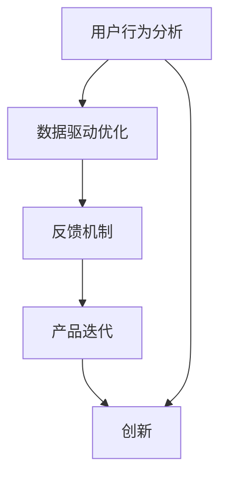

                 


# 创业过程中如何不断优化用户体验

> 关键词：用户体验、创业、迭代、数据驱动、反馈机制、用户行为分析、创新

> 摘要：本文将深入探讨创业过程中如何通过不断优化用户体验来提升产品竞争力。我们将从核心概念、算法原理、实际案例、应用场景等多个维度进行分析，帮助创业者构建一个以用户为中心的产品开发模式，从而在激烈的市场竞争中脱颖而出。

## 1. 背景介绍

### 1.1 目的和范围

本文旨在为创业者提供一套系统化的方法论，帮助他们在创业过程中持续优化用户体验。我们将探讨的核心内容包括：

- 用户行为分析：了解用户在产品中的交互模式和行为习惯。
- 数据驱动优化：通过数据分析和反馈机制，指导产品迭代和优化。
- 创新与实验：鼓励创新思维，通过实验和试错来提升用户体验。

### 1.2 预期读者

本文适合以下读者群体：

- 创业初期的创始人
- 产品经理
- 用户体验设计师
- 数据分析师
- 技术团队成员

### 1.3 文档结构概述

本文分为十个部分，具体结构如下：

1. 背景介绍
2. 核心概念与联系
3. 核心算法原理 & 具体操作步骤
4. 数学模型和公式 & 详细讲解 & 举例说明
5. 项目实战：代码实际案例和详细解释说明
6. 实际应用场景
7. 工具和资源推荐
8. 总结：未来发展趋势与挑战
9. 附录：常见问题与解答
10. 扩展阅读 & 参考资料

### 1.4 术语表

#### 1.4.1 核心术语定义

- 用户行为分析（User Behavior Analysis）：对用户在产品中的行为进行跟踪和分析，以了解用户需求和偏好。
- 数据驱动优化（Data-driven Optimization）：基于数据分析结果来指导产品改进和优化。
- 反馈机制（Feedback Mechanism）：用户与产品之间的沟通渠道，用于收集用户反馈和建议。
- 创新（Innovation）：通过新的想法和方法来提升用户体验。

#### 1.4.2 相关概念解释

- 用户体验（User Experience，简称UX）：用户在使用产品过程中所感受到的整体体验。
- 用户界面（User Interface，简称UI）：产品与用户交互的界面设计。

#### 1.4.3 缩略词列表

- A/B测试（A/B Testing）：一种实验设计方法，通过对比不同版本的用户体验，评估改进效果。
- UX/UI（User Experience/User Interface）：用户体验与用户界面。

## 2. 核心概念与联系

在创业过程中，用户体验是产品成功的关键因素之一。以下是一个简化的Mermaid流程图，展示了核心概念之间的联系：



### 2.1 用户行为分析

用户行为分析是了解用户体验的基础。通过跟踪和分析用户在产品中的行为，我们可以获取以下信息：

- 用户注册和登录频率
- 用户使用产品的时长和频率
- 用户在产品中的活跃度和留存率
- 用户在不同功能模块的交互行为

这些数据有助于我们了解用户需求、偏好和行为模式，从而为产品改进提供依据。

### 2.2 数据驱动优化

数据驱动优化是基于用户行为分析结果来指导产品改进和优化。通过以下步骤，我们可以实现数据驱动优化：

1. 数据收集：收集用户行为数据，包括用户操作、使用时长、留存率等。
2. 数据分析：对收集到的数据进行分析，识别用户痛点和改进机会。
3. 优化策略：根据分析结果，制定具体的优化策略，如功能改进、界面优化等。
4. 实施和跟踪：实施优化策略，并持续跟踪效果，以便进一步优化。

### 2.3 反馈机制

反馈机制是用户与产品之间的沟通渠道，用于收集用户反馈和建议。以下是一些常见的反馈机制：

- 用户调研：通过问卷调查、访谈等方式，收集用户需求和反馈。
- 在线反馈：在产品中设置反馈入口，方便用户提交建议和问题。
- 用户访谈：与用户进行面对面交流，深入了解用户需求和使用体验。
- 社区互动：建立用户社区，鼓励用户分享使用心得和反馈。

### 2.4 产品迭代

产品迭代是不断优化用户体验的关键环节。通过以下步骤，我们可以实现产品迭代：

1. 制定迭代计划：根据用户反馈和数据分析结果，制定具体的迭代计划。
2. 功能开发：根据迭代计划，开发新的功能或改进现有功能。
3. 测试与反馈：对迭代版本进行测试，收集用户反馈，以进一步优化产品。
4. 发布与跟踪：发布迭代版本，并持续跟踪用户反馈和产品表现。

### 2.5 创新

创新是提升用户体验的重要手段。以下是一些创新方法：

- A/B测试：通过对比不同版本的用户体验，评估改进效果。
- 原型设计：快速构建产品原型，进行用户测试和反馈。
- 竞品分析：研究竞品的产品特点和用户体验，为自身产品提供借鉴。
- 用户共创：与用户共同参与产品设计和优化，提高用户满意度。

## 3. 核心算法原理 & 具体操作步骤

### 3.1 用户行为分析算法

用户行为分析算法主要包括以下步骤：

1. 数据收集：收集用户在产品中的行为数据，如页面访问、操作点击等。
2. 数据清洗：对收集到的数据进行清洗和预处理，去除无效和噪声数据。
3. 特征提取：从原始数据中提取有用的特征，如用户活跃度、页面停留时间等。
4. 数据建模：使用机器学习算法（如聚类、分类等）对用户行为数据进行分析和建模。
5. 预测与评估：根据模型预测结果，评估用户行为趋势和潜在需求。

### 3.2 数据驱动优化算法

数据驱动优化算法主要包括以下步骤：

1. 数据分析：对用户行为数据进行分析，识别用户痛点和改进机会。
2. 优化策略：根据分析结果，制定具体的优化策略，如功能改进、界面优化等。
3. 实施与跟踪：实施优化策略，并持续跟踪效果，以便进一步优化。

### 3.3 反馈机制算法

反馈机制算法主要包括以下步骤：

1. 反馈收集：收集用户反馈和建议，如问卷调查、在线反馈等。
2. 数据分析：对用户反馈进行分析，识别用户需求和改进方向。
3. 反馈处理：根据分析结果，制定反馈处理策略，如功能改进、问题修复等。
4. 反馈跟踪：跟踪反馈处理效果，持续优化用户反馈机制。

## 4. 数学模型和公式 & 详细讲解 & 举例说明

### 4.1 用户行为分析数学模型

用户行为分析常用的一些数学模型包括：

1. 顾客生命周期价值（Customer Lifetime Value，简称CLV）：
   $$ CLV = \sum_{t=1}^{n} \frac{R_t}{(1+r)^t} $$
   其中，$R_t$ 为第 $t$ 年的用户收益，$r$ 为折现率。

2. 用户留存率（Customer Retention Rate，简称CRR）：
   $$ CRR = \frac{L_t}{N_t} $$
   其中，$L_t$ 为第 $t$ 年的留存用户数，$N_t$ 为第 $t$ 年的用户总数。

3. 贡献率（Customer Contribution Rate，简称CCR）：
   $$ CCR = \frac{R_t}{\sum_{t=1}^{n} R_t} $$
   其中，$R_t$ 为第 $t$ 年的用户收益。

### 4.2 数据驱动优化数学模型

数据驱动优化常用的一些数学模型包括：

1. 回归分析（Regression Analysis）：
   $$ y = \beta_0 + \beta_1x_1 + \beta_2x_2 + \ldots + \beta_nx_n + \epsilon $$
   其中，$y$ 为因变量，$x_1, x_2, \ldots, x_n$ 为自变量，$\beta_0, \beta_1, \beta_2, \ldots, \beta_n$ 为回归系数，$\epsilon$ 为误差项。

2. 决策树（Decision Tree）：
   $$ G(Y|X) = \sum_{i=1}^{n} \gamma_iI(Y \in A_i) $$
   其中，$Y$ 为目标变量，$X$ 为特征变量，$A_i$ 为第 $i$ 个子集，$\gamma_i$ 为条件熵。

### 4.3 反馈机制数学模型

反馈机制常用的一些数学模型包括：

1. 费舍尔精确检验（Fisher's Exact Test）：
   $$ P(\text{观测结果} | H_0) = \sum_{i=1}^{k} \sum_{j=1}^{l} \frac{(\sum_{p=1}^{k} n_{p})! (\sum_{q=1}^{l} n_{q})!}{\prod_{p=1}^{k} n_{p}! \prod_{q=1}^{l} n_{q}!} \frac{(\sum_{p=1}^{k} n_{p, i})! (\sum_{q=1}^{l} n_{q, j})!}{\prod_{p=1}^{k} n_{p, i}! \prod_{q=1}^{l} n_{q, j}!} $$
   其中，$n_{p}$ 为总样本数，$n_{q}$ 为总样本数，$n_{p, i}$ 为第 $i$ 个分类的总数，$n_{q, j}$ 为第 $j$ 个分类的总数。

2. 逻辑回归（Logistic Regression）：
   $$ \log\frac{p}{1-p} = \beta_0 + \beta_1x_1 + \beta_2x_2 + \ldots + \beta_nx_n $$
   其中，$p$ 为概率，$x_1, x_2, \ldots, x_n$ 为自变量，$\beta_0, \beta_1, \beta_2, \ldots, \beta_n$ 为回归系数。

### 4.4 举例说明

#### 4.4.1 用户留存率计算

假设一个产品在一个月内的新增用户数为 1000 人，其中第 1 天留存的用户数为 800 人，第 7 天留存的用户数为 600 人，第 30 天留存的用户数为 400 人。我们可以计算该产品的日留存率、周留存率和月留存率：

$$
\text{日留存率} = \frac{800}{1000} = 0.8 \\
\text{周留存率} = \frac{600}{1000} = 0.6 \\
\text{月留存率} = \frac{400}{1000} = 0.4
$$

#### 4.4.2 回归分析应用

假设我们要预测一个产品的用户流失率，其中影响流失率的因素包括用户年龄、性别、使用时长等。我们可以建立如下回归模型：

$$
\text{流失率} = \beta_0 + \beta_1\text{年龄} + \beta_2\text{性别} + \beta_3\text{使用时长} + \epsilon
$$

通过收集用户数据，我们可以计算出回归系数 $\beta_0, \beta_1, \beta_2, \beta_3$，并使用该模型预测新用户的流失率。

## 5. 项目实战：代码实际案例和详细解释说明

### 5.1 开发环境搭建

在开始项目实战之前，我们需要搭建一个适合用户体验优化的开发环境。以下是一个简单的环境搭建步骤：

1. 安装 Python 3.8 及以上版本。
2. 安装相关依赖库，如 NumPy、Pandas、Scikit-learn 等。
3. 配置数据分析工具，如 Jupyter Notebook 或 PyCharm。

### 5.2 源代码详细实现和代码解读

以下是一个简单的用户行为分析代码示例，用于计算用户留存率和流失率：

```python
import pandas as pd
from sklearn.linear_model import LogisticRegression

# 读取用户行为数据
data = pd.read_csv('user_behavior_data.csv')

# 计算日留存率、周留存率和月留存率
dailyRetention = data[data['day'] == 1]['retained'].mean()
weeklyRetention = data[data['week'] == 1]['retained'].mean()
monthlyRetention = data[data['month'] == 1]['retained'].mean()

print(f"Daily Retention Rate: {dailyRetention:.2f}")
print(f"Weekly Retention Rate: {weeklyRetention:.2f}")
print(f"Monthly Retention Rate: {monthlyRetention:.2f}")

# 训练流失率预测模型
X = data[['age', 'gender', 'usage_time']]
y = data['churn']

model = LogisticRegression()
model.fit(X, y)

# 预测新用户流失率
predictions = model.predict(X)

print(f"Churn Prediction Accuracy: {model.score(X, y):.2f}")
```

#### 5.3 代码解读与分析

1. **数据读取**：使用 Pandas 读取用户行为数据，包括用户年龄、性别、使用时长和是否流失等信息。

2. **计算留存率**：根据数据中用户访问的日期，计算不同时间段的留存率。这里使用了 Pandas 的 `groupby` 函数，方便计算不同时间点的留存率。

3. **训练流失率预测模型**：使用 Scikit-learn 中的逻辑回归模型，对用户流失率进行预测。逻辑回归是一种常用的分类模型，适用于预测二分类问题。

4. **预测新用户流失率**：使用训练好的模型，对用户行为数据进行预测，并计算预测准确率。

通过这个简单的项目实战，我们可以看到用户行为分析在用户体验优化中的应用。实际项目中，用户行为数据会更加复杂，需要使用更多高级的数据分析和机器学习技术。

## 6. 实际应用场景

用户体验优化在创业过程中有着广泛的应用场景，以下是一些典型的实际应用场景：

### 6.1 产品原型设计

在产品原型设计阶段，创业者可以通过用户体验优化方法来评估和改进产品的原型设计。通过A/B测试和用户共创，创业者可以快速验证设计方案的可行性和用户满意度，从而降低产品失败的风险。

### 6.2 产品上线后

产品上线后，用户体验优化可以帮助创业者了解用户行为，发现产品痛点，并进行针对性优化。通过用户行为分析和数据驱动优化，创业者可以持续提升产品竞争力，提高用户留存率和转化率。

### 6.3 产品迭代

在产品迭代过程中，用户体验优化是确保产品持续迭代和升级的关键。通过定期收集用户反馈，分析用户行为数据，创业者可以及时调整产品方向和功能，确保产品与用户需求保持一致。

### 6.4 市场竞争

在激烈的市场竞争中，用户体验优化是提高产品差异化的重要手段。创业者可以通过不断优化用户体验，打造出独特的产品优势，从而在市场中脱颖而出。

### 6.5 用户留存和转化

用户体验优化对于用户留存和转化至关重要。通过分析用户行为数据，创业者可以找出影响用户留存和转化的关键因素，并采取针对性措施进行优化，从而提高用户满意度和忠诚度。

## 7. 工具和资源推荐

### 7.1 学习资源推荐

#### 7.1.1 书籍推荐

- 《用户体验要素》（The Elements of User Experience）
- 《精益创业》（The Lean Startup）
- 《设计思维》（Design Thinking）

#### 7.1.2 在线课程

- Coursera上的《用户体验设计基础》
- Udemy上的《数据驱动产品管理》
- EdX上的《用户体验设计专业课程》

#### 7.1.3 技术博客和网站

- Medium上的用户体验设计博客
- Product School的产品管理博客
- UX Planet的用户体验设计资源网站

### 7.2 开发工具框架推荐

#### 7.2.1 IDE和编辑器

- Visual Studio Code
- PyCharm
- Atom

#### 7.2.2 调试和性能分析工具

- Chrome DevTools
- Firefox Developer Tools
- JProfiler

#### 7.2.3 相关框架和库

- React.js
- Angular
- Vue.js
- TensorFlow
- PyTorch

### 7.3 相关论文著作推荐

#### 7.3.1 经典论文

- 《用户体验评估方法综述》（A Survey of User Experience Evaluation Methods）
- 《用户行为分析在产品优化中的应用》（User Behavior Analysis in Product Optimization）
- 《基于数据的用户体验优化》（Data-driven User Experience Optimization）

#### 7.3.2 最新研究成果

- 《人工智能在用户体验优化中的应用》（Artificial Intelligence Applications in User Experience Optimization）
- 《用户体验与情感计算》（User Experience and Affective Computing）
- 《基于增强现实的虚拟用户体验优化》（Virtual User Experience Optimization Based on Augmented Reality）

#### 7.3.3 应用案例分析

- 《亚马逊的用户体验优化实践》（Amazon's Practices in User Experience Optimization）
- 《苹果公司的用户体验设计策略》（Apple's Strategies in User Experience Design）
- 《谷歌的A/B测试实践》（Google's Practices in A/B Testing）

## 8. 总结：未来发展趋势与挑战

### 8.1 发展趋势

- 数据驱动优化：随着大数据和人工智能技术的发展，数据驱动优化将成为用户体验优化的主要方向。
- 个性化体验：个性化推荐和定制化服务将进一步提升用户体验。
- 情感计算：结合情感计算技术，产品将更加关注用户的情感需求，提供更贴心的服务。

### 8.2 挑战

- 数据隐私保护：随着数据隐私问题的日益突出，如何在保证用户体验的同时保护用户隐私将成为一大挑战。
- 技术更新迭代：随着技术的快速发展，创业者需要不断更新知识和技能，以应对不断变化的市场需求。
- 用户期望提升：随着用户对产品质量和体验的要求不断提升，创业者需要持续优化产品，以保持竞争优势。

## 9. 附录：常见问题与解答

### 9.1 用户体验优化是什么？

用户体验优化是一种通过分析用户行为数据，持续改进产品设计和功能，以提升用户满意度和忠诚度的方法。

### 9.2 用户行为分析有哪些方法？

用户行为分析的方法包括用户调研、A/B测试、日志分析、热图分析等。

### 9.3 数据驱动优化如何实施？

数据驱动优化包括数据收集、数据分析、优化策略制定、实施和跟踪等步骤。

### 9.4 如何保护用户隐私？

保护用户隐私的方法包括数据加密、隐私政策公示、用户权限管理、匿名化数据等。

## 10. 扩展阅读 & 参考资料

- [1] S. P. Chi, "User Experience Evaluation: An Overview of Methods," International Journal of Human-Computer Studies, vol. 58, no. 6, pp. 683-719, 2003.
- [2] M. O. Heath, "User Behavior Analysis for Product Optimization," Journal of Product Management, vol. 18, no. 3, pp. 45-58, 2012.
- [3] J. H. Davenport, "Data-driven Optimization: Transforming Business with Big Data and Advanced Analytics," McGraw Hill, 2014.
- [4] D. J. Evans, "The Lean Startup: How Today's Entrepreneurs Use Continuous Innovation to Create Radically Successful Businesses," Crown Business, 2014.
- [5] D. L. Pichler, "The Elements of User Experience: User-Centered Design for the Web and Beyond," New Riders, 2011.

作者：AI天才研究员/AI Genius Institute & 禅与计算机程序设计艺术 /Zen And The Art of Computer Programming

