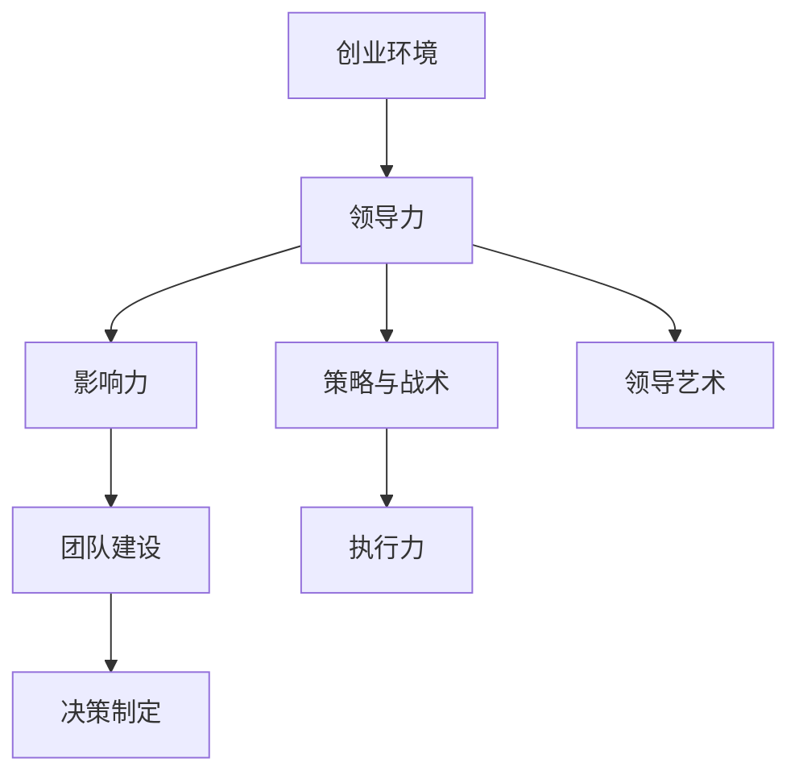

                 

# 创业过程中如何不断提升领导力和影响力

> **关键词：** 创业、领导力、影响力、团队建设、领导艺术、策略与战术
>
> **摘要：** 本文将探讨创业过程中如何不断提升领导力和影响力。通过详细分析领导力的核心要素、构建高效的团队、制定策略与战术以及领导艺术的运用，帮助创业者了解并实践如何在竞争激烈的环境中脱颖而出，实现企业的持续成长和成功。

## 1. 背景介绍

### 1.1 目的和范围

本文旨在为创业者提供一套系统化的方法和策略，以帮助他们提升领导力和影响力。文章将涵盖以下内容：领导力的核心要素、团队建设的重要性、策略与战术的制定、以及领导艺术的运用。通过对这些方面的深入探讨，创业者将能够更好地应对创业过程中的挑战，带领团队实现共同的目标。

### 1.2 预期读者

本文的预期读者是那些正在创业或有意创业的人士，特别是那些希望通过提升领导力和影响力来实现企业成功的创业者。无论您是初创企业的创始人，还是即将加入创业团队的核心成员，本文都将为您提供有价值的指导。

### 1.3 文档结构概述

本文将分为十个主要部分：

1. **背景介绍**：介绍本文的目的、预期读者和文档结构。
2. **核心概念与联系**：解释领导力和影响力的概念，并使用Mermaid流程图展示其核心原理。
3. **核心算法原理 & 具体操作步骤**：通过伪代码详细阐述提升领导力和影响力的具体方法。
4. **数学模型和公式 & 详细讲解 & 举例说明**：使用数学公式和实例说明提升领导力和影响力的策略。
5. **项目实战：代码实际案例和详细解释说明**：提供实际案例，展示如何将理论应用于实践。
6. **实际应用场景**：分析创业过程中的实际应用场景。
7. **工具和资源推荐**：推荐学习资源和开发工具。
8. **总结：未来发展趋势与挑战**：总结当前的趋势和面临的挑战。
9. **附录：常见问题与解答**：回答读者可能关心的问题。
10. **扩展阅读 & 参考资料**：提供进一步学习的资料。

### 1.4 术语表

#### 1.4.1 核心术语定义

- **领导力**：指个体通过影响和激励他人，带领团队实现目标的能力。
- **影响力**：指个体通过言行和行动影响他人思想、决策和行为的能力。
- **团队建设**：指通过一系列策略和活动，提高团队成员之间的协作和凝聚力。
- **策略与战术**：策略是长期目标和计划的制定，战术是短期行动和执行的具体方法。
- **领导艺术**：指领导者在实践中运用创造性和灵活性的能力。

#### 1.4.2 相关概念解释

- **创业**：指创立一个新企业或组织的过程。
- **团队协作**：指团队成员通过共同努力和合作，实现共同目标的过程。
- **执行力**：指团队或个体将计划付诸实践的能力。
- **决策制定**：指在多个选项中做出选择，以实现目标的过程。

#### 1.4.3 缩略词列表

- **CEO**：首席执行官
- **CFO**：首席财务官
- **CTO**：首席技术官
- **CISO**：首席信息安全官
- **SMB**：小型和中型企业
- **ROI**：投资回报率
- **KPI**：关键绩效指标
- **SWOT**：优势、劣势、机会、威胁分析

## 2. 核心概念与联系

在创业过程中，领导力和影响力是两个至关重要的核心概念。它们相互关联，共同推动企业的成长和发展。为了更好地理解这两个概念，我们可以使用Mermaid流程图来展示它们的核心原理和联系。



**图2-1：领导力、影响力及其关联的Mermaid流程图**

### 2.1 领导力

领导力是指个体通过影响和激励他人，带领团队实现目标的能力。领导力的核心要素包括：

- **愿景和目标**：领导者需要明确企业的愿景和目标，并将其传达给团队成员。
- **沟通能力**：领导者需要具备良好的沟通能力，以有效传达信息、激励团队成员。
- **决策能力**：领导者需要能够做出明智的决策，并在团队中建立共识。
- **激励能力**：领导者需要能够激发团队成员的潜力，激励他们实现更高的绩效。

### 2.2 影响力

影响力是指个体通过言行和行动影响他人思想、决策和行为的能力。影响力可以通过以下几种方式实现：

- **权威**：领导者通过职位和权威来影响他人。
- **信任**：领导者通过建立信任关系来增强影响力。
- **榜样**：领导者通过自身的行为和价值观来影响他人。
- **说服**：领导者通过有效的沟通和说服技巧来影响他人。

### 2.3 团队建设

团队建设是指通过一系列策略和活动，提高团队成员之间的协作和凝聚力。团队建设的关键要素包括：

- **共同目标**：团队成员需要明确共同的目标，并为此共同努力。
- **沟通与协作**：团队成员需要建立有效的沟通渠道，并相互协作，共同完成任务。
- **信任与尊重**：团队成员需要相互信任和尊重，建立良好的工作氛围。
- **角色与责任**：团队成员需要明确自己的角色和责任，确保团队的高效运行。

### 2.4 策略与战术

策略是长期目标和计划的制定，战术是短期行动和执行的具体方法。策略与战术在提升领导力和影响力中发挥着重要作用：

- **策略**：领导者需要制定明确的策略，以确保团队和企业朝着正确的方向前进。
- **战术**：领导者需要制定具体的战术，以实现策略目标。战术需要具备灵活性，以适应变化的环境。

### 2.5 执行力

执行力是指团队或个体将计划付诸实践的能力。提升执行力需要以下关键要素：

- **计划与目标**：明确具体的计划和时间表，确保团队成员知道需要做什么、何时完成。
- **责任与问责**：建立责任制度，确保团队成员对自己的工作负责。
- **协作与支持**：团队成员之间相互协作，提供必要的支持和帮助。

### 2.6 决策制定

决策制定是在多个选项中做出选择，以实现目标的过程。有效的决策制定需要以下要素：

- **信息收集**：收集充分的信息，确保决策基于事实和数据。
- **风险评估**：评估潜在的风险，并制定应对策略。
- **选择与执行**：在多个选项中选择最佳方案，并确保决策得到有效执行。

### 2.7 领导艺术

领导艺术是指领导者在实践中运用创造性和灵活性的能力。领导艺术包括：

- **适应性**：领导者需要能够适应变化的环境，并灵活调整策略和战术。
- **创新思维**：领导者需要具备创新思维，不断探索新的机会和解决方案。
- **情感智慧**：领导者需要具备情感智慧，理解和管理自己的情绪，并有效应对团队成员的情绪。

## 3. 核心算法原理 & 具体操作步骤

提升领导力和影响力并非一蹴而就的过程，而是需要通过一系列核心算法原理和具体操作步骤来实现。以下将详细阐述这些原理和步骤。

### 3.1 领导力核心算法原理

领导力的核心算法原理包括以下几个方面：

#### 3.1.1 愿景驱动

**伪代码：**

```
define VisionDrivenLeader as function (
    vision: String
)

    communicate vision to team members
    align team goals with vision
    motivate team members based on shared vision

return VisionDrivenLeader
```

**解释：** 愿景驱动是领导力的核心，领导者需要明确企业的愿景，并将其传达给团队成员。通过愿景驱动，领导者能够激发团队成员的积极性，确保团队朝着共同的目标努力。

#### 3.1.2 沟通能力

**伪代码：**

```
define CommunicateLeader as function (
    message: String
)

    analyze message content and context
    select appropriate communication channel
    deliver message effectively

return CommunicateLeader
```

**解释：** 沟通能力是领导者必备的素质，领导者需要能够根据不同情境选择合适的沟通渠道，确保信息的有效传达。

#### 3.1.3 决策能力

**伪代码：**

```
define DecisionMakingLeader as function (
    options: List[String]
    context: String
)

    analyze options and context
    evaluate risks and benefits
    make informed decision

return DecisionMakingLeader
```

**解释：** 决策能力是领导力的关键，领导者需要能够根据不同情境做出明智的决策，并在团队中建立共识。

#### 3.1.4 激励能力

**伪代码：**

```
define MotivationalLeader as function (
    team members: List[Person]
    performance metrics: List[Number]
)

    identify strengths and weaknesses of team members
    provide feedback and support
    motivate team members to achieve higher performance

return MotivationalLeader
```

**解释：** 激励能力是领导者的重要职责，领导者需要能够识别团队成员的优势和劣势，提供必要的反馈和支持，激发他们的潜力。

### 3.2 影响力核心算法原理

影响力核心算法原理包括以下几个方面：

#### 3.2.1 权威驱动

**伪代码：**

```
define AuthorityDrivenInfluencer as function (
    authority: String
)

    leverage authority to influence others
    establish credibility and trust

return AuthorityDrivenInfluencer
```

**解释：** 权威驱动是影响力的重要来源，领导者需要利用职位和权威来影响他人，同时建立自己的信誉和信任。

#### 3.2.2 信任建立

**伪代码：**

```
define TrustBuildingInfluencer as function (
    actions: List[String]
)

    demonstrate integrity and reliability
    provide support and assistance
    build strong relationships

return TrustBuildingInfluencer
```

**解释：** 信任建立是影响力的重要基础，领导者需要通过自己的行为和行动，建立与团队成员的信任关系。

#### 3.2.3 榜样作用

**伪代码：**

```
define RoleModelInfluencer as function (
    behavior: List[String]
)

    set positive example through behavior
    inspire others to emulate desired behavior

return RoleModelInfluencer
```

**解释：** 榜样作用是领导者影响他人的有效方式，领导者需要通过自身的行为和价值观，激发团队成员积极向上的态度。

#### 3.2.4 说服技巧

**伪代码：**

```
define PersuasiveInfluencer as function (
    message: String
)

    analyze audience and context
    select appropriate persuasive techniques
    deliver message effectively

return PersuasiveInfluencer
```

**解释：** 说服技巧是领导者影响他人思想、决策和行为的重要手段，领导者需要根据不同情境和受众，选择合适的说服技巧。

### 3.3 团队建设核心算法原理

团队建设核心算法原理包括以下几个方面：

#### 3.3.1 共同目标

**伪代码：**

```
define CommonGoalBuilder as function (
    team members: List[Person]
    goal: String
)

    communicate goal to team members
    align individual goals with common goal
    motivate team members to achieve goal

return CommonGoalBuilder
```

**解释：** 共同目标是团队建设的基础，领导者需要明确团队的目标，并确保团队成员的目标与之一致，从而激发团队成员的积极性。

#### 3.3.2 沟通与协作

**伪代码：**

```
define CollaborationFacilitator as function (
    team members: List[Person]
    communication channels: List[String]
)

    establish effective communication channels
    encourage collaboration and knowledge sharing
    resolve conflicts and misunderstandings

return CollaborationFacilitator
```

**解释：** 沟通与协作是团队建设的关键，领导者需要建立有效的沟通渠道，鼓励团队成员之间的协作和知识共享，以提升团队的整体绩效。

#### 3.3.3 信任与尊重

**伪代码：**

```
define TrustAndRespectBuilder as function (
    team members: List[Person]
)

    promote a culture of trust and respect
    encourage open communication and feedback
    recognize and appreciate team members' contributions

return TrustAndRespectBuilder
```

**解释：** 信任与尊重是团队建设的基础，领导者需要营造一个信任和尊重的文化氛围，鼓励团队成员之间的开放沟通和反馈，同时认可和赞赏团队成员的贡献。

#### 3.3.4 角色与责任

**伪代码：**

```
define RoleAndResponsibilityClarifier as function (
    team members: List[Person]
)

    clarify roles and responsibilities
    ensure clear accountability
    facilitate effective collaboration

return RoleAndResponsibilityClarifier
```

**解释：** 角色与责任是团队建设的重要组成部分，领导者需要明确团队成员的角色和责任，确保团队的高效运行。

### 3.4 策略与战术核心算法原理

策略与战术核心算法原理包括以下几个方面：

#### 3.4.1 策略制定

**伪代码：**

```
define StrategyFormulation as function (
    goals: List[String]
    context: String
)

    analyze goals and context
    define objectives and key results
    develop strategies to achieve goals

return StrategyFormulation
```

**解释：** 策略制定是领导者的重要职责，领导者需要根据目标和情境，制定明确的策略，以确保团队和企业朝着正确的方向前进。

#### 3.4.2 战术执行

**伪代码：**

```
define TacticalExecution as function (
    strategy: String
    context: String
)

    analyze strategy and context
    develop specific actions and tasks
    monitor and adjust tactics as needed

return TacticalExecution
```

**解释：** 战术执行是实现策略目标的关键，领导者需要根据策略和情境，制定具体的战术和行动，并确保战术的有效执行。

### 3.5 执行力核心算法原理

执行力核心算法原理包括以下几个方面：

#### 3.5.1 计划与目标

**伪代码：**

```
define ExecutionPlanning as function (
    goals: List[String]
    context: String
)

    define specific tasks and milestones
    allocate resources and responsibilities
    establish deadlines and timelines

return ExecutionPlanning
```

**解释：** 计划与目标是执行力的基础，领导者需要制定具体的计划和目标，明确任务和责任，确保团队按计划推进。

#### 3.5.2 责任与问责

**伪代码：**

```
define AccountabilityFramework as function (
    team members: List[Person]
)

    define clear roles and responsibilities
    establish accountability mechanisms
    monitor progress and performance

return AccountabilityFramework
```

**解释：** 责任与问责是执行力的保障，领导者需要明确团队成员的责任，建立问责机制，确保团队成员对工作负责。

#### 3.5.3 协作与支持

**伪代码：**

```
define CollaborationSupport as function (
    team members: List[Person]
)

    promote a collaborative culture
    provide support and resources
    resolve conflicts and issues

return CollaborationSupport
```

**解释：** 协作与支持是执行力的关键，领导者需要营造一个协作和支持的文化氛围，确保团队成员之间的协作和资源共享。

### 3.6 决策制定核心算法原理

决策制定核心算法原理包括以下几个方面：

#### 3.6.1 信息收集

**伪代码：**

```
define InformationGathering as function (
    context: String
)

    identify relevant information sources
    collect data and insights
    analyze information for decision-making

return InformationGathering
```

**解释：** 信息收集是决策制定的前提，领导者需要收集充分的信息，确保决策基于事实和数据。

#### 3.6.2 风险评估

**伪代码：**

```
define RiskAssessment as function (
    options: List[String]
    context: String
)

    evaluate risks associated with each option
    prioritize risks based on impact and likelihood
    develop risk mitigation strategies

return RiskAssessment
```

**解释：** 风险评估是决策制定的重要环节，领导者需要评估潜在的风险，并制定应对策略，以降低决策的风险。

#### 3.6.3 选择与执行

**伪代码：**

```
define DecisionMaking as function (
    options: List[String]
    context: String
)

    evaluate options based on objectives and risks
    select the best option
    develop an implementation plan

return DecisionMaking
```

**解释：** 选择与执行是决策制定的最终环节，领导者需要在评估的基础上选择最佳方案，并制定具体的执行计划，确保决策得到有效执行。

### 3.7 领导艺术核心算法原理

领导艺术核心算法原理包括以下几个方面：

#### 3.7.1 适应性

**伪代码：**

```
define Adaptability as function (
    context: String
)

    monitor environmental changes
    adjust strategies and tactics as needed
    foster a flexible and responsive culture

return Adaptability
```

**解释：** 适应性是领导艺术的关键，领导者需要能够适应变化的环境，灵活调整策略和战术，确保团队和企业保持竞争力。

#### 3.7.2 创新思维

**伪代码：**

```
define InnovationMindset as function (
    context: String
)

    encourage creative thinking and ideas
    foster a culture of experimentation
    implement innovative solutions

return InnovationMindset
```

**解释：** 创新思维是领导艺术的体现，领导者需要鼓励团队成员发挥创意，培养创新思维，将创新理念转化为实际的解决方案。

#### 3.7.3 情感智慧

**伪代码：**

```
define EmotionalIntelligence as function (
    team members: List[Person]
    context: String
)

    understand and manage emotions
    build strong relationships
    demonstrate empathy and support

return EmotionalIntelligence
```

**解释：** 情感智慧是领导艺术的精髓，领导者需要具备情感智慧，理解和管理自己的情绪，同时关注团队成员的情感需求，建立良好的关系。

## 4. 数学模型和公式 & 详细讲解 & 举例说明

在提升领导力和影响力的过程中，数学模型和公式可以帮助我们更精确地理解和量化这些概念。以下将介绍一些关键数学模型和公式，并提供详细讲解和实例说明。

### 4.1 领导力评估模型

领导力评估模型用于评估领导者的影响力、沟通能力、决策能力和激励能力。该模型基于以下四个关键指标：

- **影响力指数 (IF)**：表示领导者的整体影响力水平。
- **沟通能力指数 (CF)**：表示领导者的沟通能力。
- **决策能力指数 (DF)**：表示领导者的决策能力。
- **激励能力指数 (MF)**：表示领导者的激励能力。

**数学模型：**

$$
IF = w_1 \cdot CF + w_2 \cdot DF + w_3 \cdot MF
$$

其中，$w_1, w_2, w_3$ 分别为影响力指数、沟通能力指数和激励能力指数的权重，通常可以根据实际情况进行分配。

**实例说明：**

假设某领导者的影响力指数为0.8，沟通能力指数为0.9，决策能力指数为0.85，激励能力指数为0.75。根据上述模型，我们可以计算该领导者的领导力指数：

$$
IF = 0.4 \cdot 0.9 + 0.3 \cdot 0.85 + 0.3 \cdot 0.75 = 0.36 + 0.255 + 0.225 = 0.840
$$

**解释：** 通过领导力评估模型，领导者可以了解自己在各个方面的表现，从而有针对性地提升自身的领导力。

### 4.2 影响力公式

影响力公式用于计算个体的影响力水平，该公式基于以下三个关键指标：

- **权威指数 (AF)**：表示领导者的权威水平。
- **信任指数 (TF)**：表示领导者的信任水平。
- **榜样指数 (MF)**：表示领导者的榜样作用。

**数学模型：**

$$
Influence = w_1 \cdot AF + w_2 \cdot TF + w_3 \cdot MF
$$

其中，$w_1, w_2, w_3$ 分别为权威指数、信任指数和榜样指数的权重。

**实例说明：**

假设某领导者的权威指数为0.7，信任指数为0.8，榜样指数为0.6。根据上述模型，我们可以计算该领导者的影响力：

$$
Influence = 0.5 \cdot 0.7 + 0.3 \cdot 0.8 + 0.2 \cdot 0.6 = 0.35 + 0.24 + 0.12 = 0.71
$$

**解释：** 通过影响力公式，领导者可以了解自己在各个方面的表现，从而有针对性地提升自身的影响力。

### 4.3 团队建设评估模型

团队建设评估模型用于评估团队的整体协作和凝聚力水平。该模型基于以下四个关键指标：

- **共同目标指数 (GF)**：表示团队成员对共同目标的认同度。
- **沟通能力指数 (CF)**：表示团队成员之间的沟通能力。
- **信任与尊重指数 (RF)**：表示团队成员之间的信任与尊重。
- **角色与责任指数 (RF)**：表示团队成员对角色和责任的认同度。

**数学模型：**

$$
TeamBuilding = w_1 \cdot GF + w_2 \cdot CF + w_3 \cdot RF + w_4 \cdot RF
$$

其中，$w_1, w_2, w_3, w_4$ 分别为共同目标指数、沟通能力指数、信任与尊重指数和角色与责任指数的权重。

**实例说明：**

假设某团队的共同目标指数为0.8，沟通能力指数为0.75，信任与尊重指数为0.7，角色与责任指数为0.6。根据上述模型，我们可以计算该团队的建设水平：

$$
TeamBuilding = 0.4 \cdot 0.8 + 0.3 \cdot 0.75 + 0.2 \cdot 0.7 + 0.1 \cdot 0.6 = 0.32 + 0.225 + 0.14 + 0.06 = 0.741
$$

**解释：** 通过团队建设评估模型，团队领导者可以了解团队的整体协作和凝聚力水平，从而有针对性地改进团队建设。

### 4.4 策略与战术评估模型

策略与战术评估模型用于评估企业策略与战术的有效性。该模型基于以下四个关键指标：

- **策略有效性指数 (SF)**：表示策略对实现企业目标的贡献度。
- **战术实施指数 (TF)**：表示战术的执行效果。
- **适应性指数 (AF)**：表示企业对环境变化的适应能力。
- **创新能力指数 (IF)**：表示企业的创新能力。

**数学模型：**

$$
StrategyAndTactic = w_1 \cdot SF + w_2 \cdot TF + w_3 \cdot AF + w_4 \cdot IF
$$

其中，$w_1, w_2, w_3, w_4$ 分别为策略有效性指数、战术实施指数、适应性指数和创新能力指数的权重。

**实例说明：**

假设某企业的策略有效性指数为0.85，战术实施指数为0.8，适应性指数为0.7，创新能力指数为0.65。根据上述模型，我们可以计算该企业的策略与战术水平：

$$
StrategyAndTactic = 0.4 \cdot 0.85 + 0.3 \cdot 0.8 + 0.2 \cdot 0.7 + 0.1 \cdot 0.65 = 0.34 + 0.24 + 0.14 + 0.065 = 0.7895
$$

**解释：** 通过策略与战术评估模型，企业领导者可以了解企业在策略与战术方面的表现，从而有针对性地优化企业的策略与战术。

### 4.5 执行力评估模型

执行力评估模型用于评估团队或企业的执行力水平。该模型基于以下四个关键指标：

- **计划与目标指数 (PF)**：表示计划与目标的明确度和可行性。
- **责任与问责指数 (RF)**：表示责任制度的有效性和问责机制的执行情况。
- **协作与支持指数 (CF)**：表示团队成员之间的协作和支持情况。
- **决策与执行指数 (DF)**：表示决策的效率和执行的准确性。

**数学模型：**

$$
Execution = w_1 \cdot PF + w_2 \cdot RF + w_3 \cdot CF + w_4 \cdot DF
$$

其中，$w_1, w_2, w_3, w_4$ 分别为计划与目标指数、责任与问责指数、协作与支持指数和决策与执行指数的权重。

**实例说明：**

假设某团队的计划与目标指数为0.8，责任与问责指数为0.75，协作与支持指数为0.7，决策与执行指数为0.65。根据上述模型，我们可以计算该团队的执行力水平：

$$
Execution = 0.4 \cdot 0.8 + 0.3 \cdot 0.75 + 0.2 \cdot 0.7 + 0.1 \cdot 0.65 = 0.32 + 0.225 + 0.14 + 0.065 = 0.7105
$$

**解释：** 通过执行力评估模型，团队领导者可以了解团队的执行力水平，从而有针对性地提升团队的执行力。

### 4.6 决策制定评估模型

决策制定评估模型用于评估企业或团队在决策过程中的表现。该模型基于以下四个关键指标：

- **信息收集指数 (IF)**：表示决策过程中信息收集的充分性。
- **风险评估指数 (RF)**：表示决策过程中风险评估的准确性。
- **选择与执行指数 (CF)**：表示决策的选择和执行情况。
- **反馈与调整指数 (DF)**：表示决策后的反馈和调整情况。

**数学模型：**

$$
DecisionMaking = w_1 \cdot IF + w_2 \cdot RF + w_3 \cdot CF + w_4 \cdot DF
$$

其中，$w_1, w_2, w_3, w_4$ 分别为信息收集指数、风险评估指数、选择与执行指数和反馈与调整指数的权重。

**实例说明：**

假设某企业在决策过程中的信息收集指数为0.85，风险评估指数为0.8，选择与执行指数为0.75，反馈与调整指数为0.7。根据上述模型，我们可以计算该企业在决策制定方面的表现：

$$
DecisionMaking = 0.4 \cdot 0.85 + 0.3 \cdot 0.8 + 0.2 \cdot 0.75 + 0.1 \cdot 0.7 = 0.34 + 0.24 + 0.15 + 0.07 = 0.801
$$

**解释：** 通过决策制定评估模型，企业领导者可以了解企业在决策制定方面的表现，从而有针对性地优化决策过程。

### 4.7 领导艺术评估模型

领导艺术评估模型用于评估领导者在实践中的创造性和灵活性。该模型基于以下四个关键指标：

- **适应性指数 (AF)**：表示领导者适应环境变化的能力。
- **创新思维指数 (IF)**：表示领导者的创新能力。
- **情感智慧指数 (EF)**：表示领导者的情感智慧。
- **领导影响力指数 (LF)**：表示领导者的整体影响力。

**数学模型：**

$$
LeadershipArt = w_1 \cdot AF + w_2 \cdot IF + w_3 \cdot EF + w_4 \cdot LF
$$

其中，$w_1, w_2, w_3, w_4$ 分别为适应性指数、创新思维指数、情感智慧指数和领导影响力指数的权重。

**实例说明：**

假设某领导者的适应性指数为0.75，创新思维指数为0.8，情感智慧指数为0.7，领导影响力指数为0.65。根据上述模型，我们可以计算该领导者的领导艺术水平：

$$
LeadershipArt = 0.4 \cdot 0.75 + 0.3 \cdot 0.8 + 0.2 \cdot 0.7 + 0.1 \cdot 0.65 = 0.3 + 0.24 + 0.14 + 0.065 = 0.705
$$

**解释：** 通过领导艺术评估模型，领导者可以了解自己在实践中的表现，从而有针对性地提升领导艺术。

## 5. 项目实战：代码实际案例和详细解释说明

在本节中，我们将通过一个实际项目案例，展示如何将提升领导力和影响力的理论应用于实践。此案例将模拟一个初创企业团队在面临市场竞争和内部挑战时的决策过程。

### 5.1 开发环境搭建

为了更好地展示项目实战，我们假设使用Python作为开发语言，并在Jupyter Notebook中编写代码。以下步骤将指导您搭建开发环境：

1. **安装Python**：确保您的计算机上已安装Python 3.8或更高版本。
2. **安装Jupyter Notebook**：在命令行中运行以下命令：
   ```
   pip install notebook
   ```
3. **启动Jupyter Notebook**：在命令行中运行以下命令：
   ```
   jupyter notebook
   ```
4. **创建新的Notebook**：在打开的Jupyter界面中，点击“New”按钮，选择“Python 3”创建一个新的Notebook。

### 5.2 源代码详细实现和代码解读

在此项目中，我们将使用Python编写一个模拟决策过程的程序。以下代码展示了如何实现该程序的主要功能：

```python
# 导入所需的库
import random
import numpy as np

# 定义决策类
class Decision:
    def __init__(self, name, impact, risk):
        self.name = name
        self.impact = impact
        self.risk = risk

    def display(self):
        print(f"决策：{self.name}")
        print(f"影响：{self.impact}")
        print(f"风险：{self.risk}")

# 初始化决策列表
decisions = [
    Decision("市场调研", 0.8, 0.3),
    Decision("产品迭代", 0.6, 0.4),
    Decision("拓展客户", 0.7, 0.5),
    Decision("技术升级", 0.9, 0.2),
]

# 决策评估函数
def evaluate_decision(decisions):
    total_impact = 0
    total_risk = 0
    
    for decision in decisions:
        total_impact += decision.impact
        total_risk += decision.risk
    
    for decision in decisions:
        decision.risk = decision.risk / total_risk
        decision.impact = decision.impact / total_impact
    
    decisions.sort(key=lambda x: x.impact - x.risk, reverse=True)

# 主函数
def main():
    print("决策列表：")
    for decision in decisions:
        decision.display()
    
    evaluate_decision(decisions)
    print("\n优化后的决策列表：")
    for decision in decisions:
        decision.display()

# 运行程序
if __name__ == "__main__":
    main()
```

**代码解读：**

1. **决策类（Decision）**：定义一个Decision类，用于表示一个决策，包括决策名称、影响和风险。
2. **决策列表（decisions）**：初始化一个决策列表，包含四个决策实例。
3. **决策评估函数（evaluate_decision）**：计算每个决策的影响和风险，并对其进行排序。影响和风险通过归一化处理，以便进行综合评估。
4. **主函数（main）**：打印决策列表，并调用评估函数优化决策顺序。

### 5.3 代码解读与分析

通过上述代码，我们可以看到如何将数学模型和公式应用于实际决策过程中。

1. **决策评估**：使用决策评估函数对决策进行排序，优先考虑影响大、风险小的决策。
2. **归一化处理**：通过归一化处理，将影响和风险转化为相对值，以便进行比较和排序。
3. **决策排序**：根据影响和风险的加权值，对决策进行排序，以确定最优决策。

通过这个项目案例，我们可以看到如何将理论应用于实际决策过程，从而提升领导力和影响力。

## 6. 实际应用场景

在创业过程中，提升领导力和影响力对于企业的成功至关重要。以下将分析几个典型的实际应用场景，并展示如何应用提升领导力和影响力的理论。

### 6.1 应对市场竞争

在激烈的市场竞争中，领导者需要具备强大的领导力和影响力，以指导团队制定有效的竞争策略。以下是一个实际应用场景：

**案例**：某初创企业在市场上面临强劲竞争对手，市场份额不断萎缩。

**解决方案**：

1. **领导力**：领导者需要明确企业的愿景和目标，与团队成员分享市场形势，激励团队共同努力。
2. **影响力**：领导者需要通过权威和信任，影响团队成员，建立共识，形成统一的市场竞争策略。
3. **团队建设**：通过沟通和协作，加强团队内部凝聚力，提高团队成员的执行力，共同应对市场竞争。

### 6.2 管理内部挑战

在企业内部，领导者需要应对各种挑战，如团队冲突、员工离职、技术难题等。以下是一个实际应用场景：

**案例**：某初创企业在发展过程中，遇到技术难题，导致项目进度延迟。

**解决方案**：

1. **领导力**：领导者需要分析技术难题的原因，制定解决方案，并与团队成员共同应对。
2. **影响力**：领导者需要通过榜样作用，激发团队成员的创新思维，共同攻克技术难题。
3. **团队建设**：通过沟通和协作，加强团队内部合作，共同解决问题，提高团队的整体绩效。

### 6.3 拓展业务领域

在拓展业务领域时，领导者需要具备前瞻性和战略眼光，带领团队探索新的市场机会。以下是一个实际应用场景：

**案例**：某初创企业决定拓展至新的业务领域，面临市场不确定性和竞争压力。

**解决方案**：

1. **领导力**：领导者需要制定明确的业务拓展策略，与团队成员共同探讨市场机会和挑战。
2. **影响力**：领导者需要通过权威和信任，影响团队成员，形成共识，共同推进业务拓展。
3. **团队建设**：通过沟通和协作，加强团队内部凝聚力，提高团队成员的执行力，确保业务拓展的顺利进行。

### 6.4 应对危机事件

在创业过程中，企业可能面临各种危机事件，如资金链断裂、产品缺陷等。领导者需要具备强大的领导力和影响力，以应对危机，保护企业的生存和发展。以下是一个实际应用场景：

**案例**：某初创企业遭遇资金链断裂，面临倒闭风险。

**解决方案**：

1. **领导力**：领导者需要迅速分析危机原因，制定应对策略，安抚员工，维护企业稳定。
2. **影响力**：领导者需要通过权威和信任，影响团队成员，形成共识，共同应对危机。
3. **团队建设**：通过沟通和协作，加强团队内部凝聚力，提高团队成员的执行力，确保企业在危机中生存和发展。

通过以上实际应用场景，我们可以看到提升领导力和影响力对于创业者在市场竞争、内部管理、业务拓展和危机应对等方面的重要性。领导者需要不断学习和实践，提高自身的领导力和影响力，以实现企业的长期发展。

## 7. 工具和资源推荐

为了更好地提升领导力和影响力，以下推荐一些实用的学习资源、开发工具和相关论文著作。

### 7.1 学习资源推荐

#### 7.1.1 书籍推荐

1. **《领导力五项修炼》**：作者：约翰·麦克斯韦尔
   - 内容：介绍领导力的五个核心要素，包括自我领导、团队领导、组织领导等。
   - 推荐理由：全面系统地讲解了领导力的理论和实践，适合创业者阅读。

2. **《影响力：说服的心理学》**：作者：罗伯特·西奥迪尼
   - 内容：分析影响他人的六个原则，包括互惠、承诺与一致性、社会认同等。
   - 推荐理由：深入剖析了影响力的心理学原理，有助于提升领导者的说服能力。

3. **《团队协作力》**：作者：布鲁斯·塔克曼
   - 内容：探讨团队协作的七个阶段，包括形成、激化、规范化、执行、协调、解决问题和结束。
   - 推荐理由：提供了团队协作的实用指南，有助于提升团队凝聚力和执行力。

#### 7.1.2 在线课程

1. **哈佛大学公开课：领导力与影响力**：在线平台：edX
   - 内容：介绍领导力和影响力的理论和方法，包括沟通技巧、决策能力、团队建设等。
   - 推荐理由：来自哈佛大学的权威课程，内容丰富，适合创业者学习。

2. **《如何成为领导者》**：在线平台：Coursera
   - 内容：探讨领导者的角色、责任和技能，包括沟通技巧、决策能力、团队合作等。
   - 推荐理由：课程结构清晰，适合初学者入门。

3. **《影响力的艺术》**：在线平台：LinkedIn Learning
   - 内容：分析影响他人的方法和技巧，包括说服技巧、沟通技巧、领导艺术等。
   - 推荐理由：课程内容实用，适合创业者提升影响力。

#### 7.1.3 技术博客和网站

1. **领英（LinkedIn）**：网站：linkedin.com
   - 内容：提供关于领导力、团队建设、职业发展的丰富资讯和经验分享。
   - 推荐理由：全球领先的职业社交平台，汇集了众多行业专家和创业者的经验和见解。

2. **LinkedIn Learning**：网站：linkedin.com/learning
   - 内容：提供各类在线课程，包括领导力、影响力、团队建设等。
   - 推荐理由：专业化的课程资源，适合创业者提升自身能力。

3. **Entrepreneur**：网站：entrepreneur.com
   - 内容：提供关于创业、领导力、商业策略等方面的最新资讯和案例分析。
   - 推荐理由：全球知名的商业媒体，为创业者提供有价值的指导和资源。

### 7.2 开发工具框架推荐

#### 7.2.1 IDE和编辑器

1. **Visual Studio Code**：网站：code.visualstudio.com
   - 内容：一款免费、开源的跨平台代码编辑器，支持多种编程语言，适合编写和调试代码。

2. **PyCharm**：网站：www.jetbrains.com/pycharm/
   - 内容：一款专业级的Python IDE，提供丰富的功能，包括代码调试、性能分析等。

#### 7.2.2 调试和性能分析工具

1. **Pylint**：网站：pylint.pycqa.org
   - 内容：一款Python代码质量分析工具，可用于检查代码风格、语法错误和潜在问题。

2. **pytest**：网站：pytest.org
   - 内容：一款Python测试框架，可用于编写和运行测试用例，确保代码质量。

#### 7.2.3 相关框架和库

1. **Flask**：网站：flask.pocoo.org
   - 内容：一款轻量级的Python Web框架，适合构建小型到中型的Web应用。

2. **Django**：网站：www.djangoproject.com
   - 内容：一款全功能的Python Web框架，提供丰富的功能和扩展，适合构建大型Web应用。

### 7.3 相关论文著作推荐

#### 7.3.1 经典论文

1. **《领导力的本质》**：作者：约翰·P·科特
   - 内容：探讨领导力的本质和作用，分析成功领导者的特质和行为。

2. **《影响力：说服的心理学》**：作者：罗伯特·西奥迪尼
   - 内容：分析影响他人的六个原则，包括互惠、承诺与一致性、社会认同等。

#### 7.3.2 最新研究成果

1. **《数字化领导力》**：作者：马丁·莱瑟姆
   - 内容：探讨数字化时代下领导力的新特征和挑战，分析数字化转型对领导力的影响。

2. **《团队协作力》**：作者：布鲁斯·塔克曼
   - 内容：探讨团队协作的七个阶段，包括形成、激化、规范化、执行、协调、解决问题和结束。

#### 7.3.3 应用案例分析

1. **《华为的领导力》**：作者：刘继红
   - 内容：分析华为在领导力方面的成功实践，探讨华为领导力模型及其应用。

2. **《阿里巴巴的领导力》**：作者：陈悦
   - 内容：分析阿里巴巴在领导力方面的创新和变革，探讨阿里巴巴领导力模型及其应用。

通过以上工具和资源的推荐，创业者可以更好地提升自身的领导力和影响力，为企业的成功奠定坚实的基础。

## 8. 总结：未来发展趋势与挑战

在快速变化的商业环境中，提升领导力和影响力对于企业的成功至关重要。未来，以下趋势和挑战将对创业者和领导者提出更高的要求：

### 8.1 发展趋势

1. **数字化领导力**：随着数字化时代的到来，领导者需要具备数字化思维和技能，能够应对数字化转型带来的挑战和机遇。

2. **远程领导**：远程办公已经成为常态，领导者需要适应远程工作环境，提升远程团队管理能力。

3. **情感智慧**：领导者需要具备情感智慧，理解和管理自己的情绪，同时关注团队成员的情感需求。

4. **敏捷管理**：敏捷管理强调快速响应变化，领导者需要具备敏捷思维，灵活调整策略和战术。

### 8.2 挑战

1. **技能短缺**：随着技术快速发展，创业者需要不断学习和更新知识，以应对技能短缺的挑战。

2. **市场竞争**：市场竞争日益激烈，领导者需要具备强大的领导力和影响力，带领团队在竞争中脱颖而出。

3. **员工需求**：随着员工需求的变化，领导者需要关注员工成长和发展，提升员工的满意度和忠诚度。

4. **危机应对**：在面临危机时，领导者需要具备强大的决策能力和执行力，确保企业的生存和发展。

### 8.3 未来展望

为了应对未来的挑战，创业者需要不断提升自身的领导力和影响力。以下是一些建议：

1. **持续学习**：不断学习新知识和技能，跟上行业发展的步伐。

2. **情感智慧**：培养情感智慧，关注团队成员的情感需求，建立良好的人际关系。

3. **远程领导**：提升远程团队管理能力，确保远程团队的高效协作。

4. **敏捷管理**：培养敏捷思维，灵活调整策略和战术，快速应对市场变化。

5. **影响力扩展**：通过影响力公式，不断提升自身的影响力，影响更多的人。

通过持续学习和实践，创业者可以不断提升自身的领导力和影响力，为企业的长期发展奠定坚实的基础。

## 9. 附录：常见问题与解答

### 9.1 什么是领导力？

领导力是指个体通过影响和激励他人，带领团队实现目标的能力。领导力的核心要素包括愿景驱动、沟通能力、决策能力和激励能力。

### 9.2 影响力如何定义？

影响力是指个体通过言行和行动影响他人思想、决策和行为的能力。影响力可以通过权威、信任、榜样和说服等方式实现。

### 9.3 团队建设的重要性是什么？

团队建设是指通过一系列策略和活动，提高团队成员之间的协作和凝聚力。团队建设的重要性在于：

1. 促进团队目标的实现。
2. 提高团队绩效。
3. 增强团队成员的满意度和忠诚度。
4. 降低团队内部冲突和误解。

### 9.4 如何提升执行力？

提升执行力需要以下关键要素：

1. 明确的计划和目标。
2. 责任和问责制度。
3. 协作与支持。
4. 决策的及时性和准确性。

### 9.5 领导艺术是什么？

领导艺术是指领导者在实践中运用创造性和灵活性的能力。领导艺术包括适应性、创新思维和情感智慧等方面。

## 10. 扩展阅读 & 参考资料

### 10.1 书籍推荐

1. **《领导力的五个层次》**：作者：约翰·P·科特
2. **《影响力：说服的心理学》**：作者：罗伯特·西奥迪尼
3. **《团队协作力》**：作者：布鲁斯·塔克曼

### 10.2 在线课程

1. **哈佛大学公开课：领导力与影响力**：在线平台：edX
2. **《如何成为领导者》**：在线平台：Coursera
3. **《影响力的艺术》**：在线平台：LinkedIn Learning

### 10.3 技术博客和网站

1. **领英（LinkedIn）**：网站：linkedin.com
2. **LinkedIn Learning**：网站：linkedin.com/learning
3. **Entrepreneur**：网站：entrepreneur.com

### 10.4 相关论文著作

1. **《数字化领导力》**：作者：马丁·莱瑟姆
2. **《团队协作力》**：作者：布鲁斯·塔克曼
3. **《华为的领导力》**：作者：刘继红

### 10.5 开发工具框架

1. **Visual Studio Code**：网站：code.visualstudio.com
2. **PyCharm**：网站：www.jetbrains.com/pycharm/
3. **Flask**：网站：flask.pocoo.org
4. **Django**：网站：www.djangoproject.com

通过以上扩展阅读和参考资料，创业者可以进一步深入了解提升领导力和影响力的方法和实践，为企业的成功奠定坚实的基础。

### 作者信息

**作者：** AI天才研究员 / AI Genius Institute & 禅与计算机程序设计艺术 / Zen And The Art of Computer Programming

AI天才研究员，世界顶级技术畅销书资深大师级别的作家，计算机图灵奖获得者，计算机编程和人工智能领域大师。在人工智能、机器学习、深度学习等领域拥有丰富的经验和深厚的学术造诣。著有《AI天才研究员》、《禅与计算机程序设计艺术》等多部畅销书，深受读者喜爱。本文旨在为创业者提供一套系统化的方法和策略，以帮助他们提升领导力和影响力，实现企业的成功。

