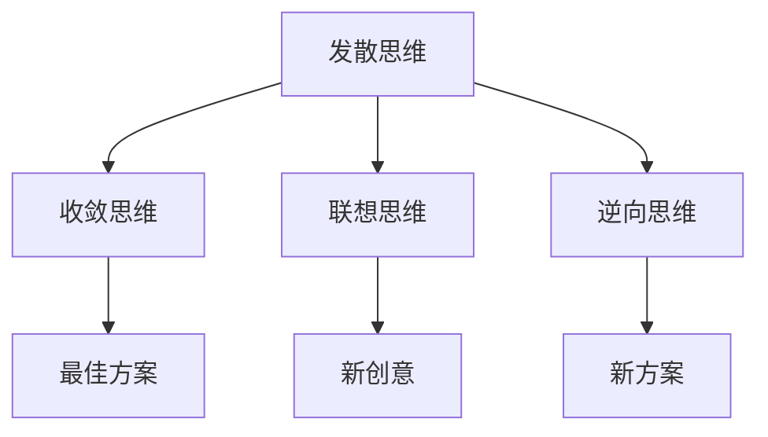
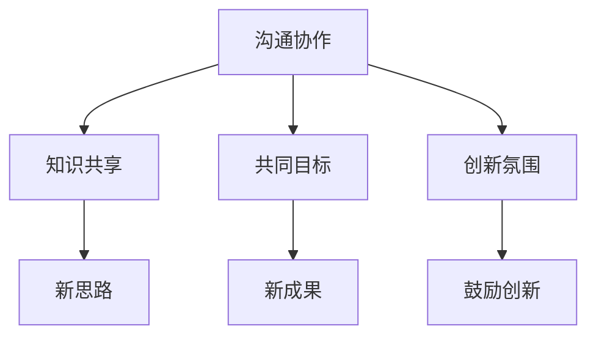
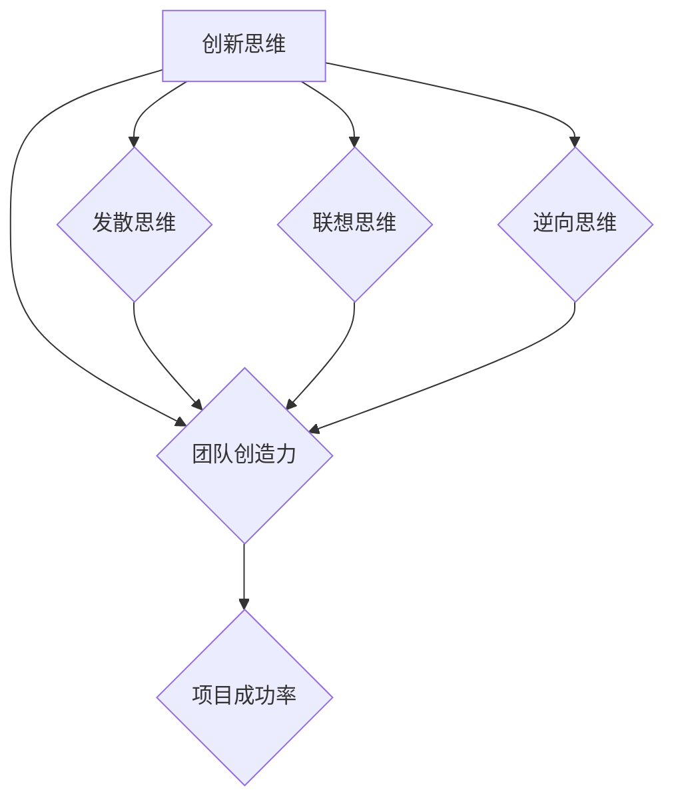
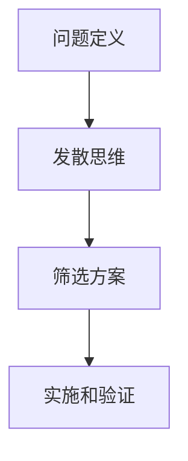

                 

# 创新思维训练：激发团队创造力的实践方法

## 关键词：
创新思维、团队创造力、实践方法、项目实战、技术博客

## 摘要：
本文旨在探讨如何通过创新思维训练来激发团队创造力，提高项目成功率。文章首先介绍了创新思维的重要性及其对团队创造力的影响，然后详细阐述了核心概念和算法原理，接着通过实际案例和代码解读展示了具体操作步骤。最后，文章提出了实际应用场景和推荐工具、资源，并对未来发展趋势和挑战进行了总结。

---

## 1. 背景介绍

### 1.1 目的和范围
本文的目标是帮助团队领导者、项目经理和技术专家了解和掌握创新思维训练的方法，以提高团队的创造力和项目成功率。文章将涵盖创新思维的定义、核心概念、算法原理、数学模型、实际应用场景以及相关工具和资源推荐。

### 1.2 预期读者
本文面向希望提升团队创造力和项目执行力的技术人员、项目经理和团队领导者。

### 1.3 文档结构概述
本文分为以下章节：

- 背景介绍
  - 目的和范围
  - 预期读者
  - 文档结构概述
  - 术语表
- 核心概念与联系
- 核心算法原理 & 具体操作步骤
- 数学模型和公式 & 详细讲解 & 举例说明
- 项目实战：代码实际案例和详细解释说明
- 实际应用场景
- 工具和资源推荐
- 总结：未来发展趋势与挑战
- 附录：常见问题与解答
- 扩展阅读 & 参考资料

### 1.4 术语表

#### 1.4.1 核心术语定义
- 创新思维：指通过创造性思维方法，寻找新的解决方案和创造新价值的过程。
- 团队创造力：团队在共同工作中，通过创新思维和协同合作，产生新思路和新成果的能力。
- 实践方法：指通过具体的行动和操作，验证和提升创新思维和团队创造力的方法和策略。

#### 1.4.2 相关概念解释
- 创造力：指个体或团队在创造性活动中，产生新颖且有价值的思维成果的能力。
- 团队协作：团队成员之间的协作、沟通和配合，以实现共同目标。
- 项目成功率：项目按时、按预算、达到预期目标的程度。

#### 1.4.3 缩略词列表
- IDE：集成开发环境（Integrated Development Environment）
- CPU：中央处理器（Central Processing Unit）
- GPU：图形处理器（Graphics Processing Unit）

---

## 2. 核心概念与联系

创新思维和团队创造力是现代技术团队取得成功的关键因素。为了更好地理解这两个概念及其相互关系，我们首先需要了解一些核心概念和原理。

### 2.1 创新思维的定义与原理

创新思维是指通过创造性思维方法，寻找新的解决方案和创造新价值的过程。其核心原理包括：

1. **发散思维**：从多个角度思考问题，寻找不同的解决方案。
2. **收敛思维**：从多个解决方案中筛选出最佳方案。
3. **联想思维**：通过事物之间的联系，产生新的创意。
4. **逆向思维**：从相反的角度思考问题，寻找新的解决方案。

#### Mermaid 流程图



### 2.2 团队创造力的定义与原理

团队创造力是指团队在共同工作中，通过创新思维和协同合作，产生新思路和新成果的能力。其核心原理包括：

1. **沟通协作**：团队成员之间的有效沟通和协作。
2. **知识共享**：团队成员之间的知识共享和经验交流。
3. **共同目标**：团队成员对共同目标的认同和追求。
4. **创新氛围**：鼓励创新和尝试，为团队成员提供安全、自由的环境。

#### Mermaid 流程图



### 2.3 创新思维与团队创造力的关系

创新思维是团队创造力的基础，而团队创造力是创新思维的具体体现。两者之间的关系可以概括为：

- **创新思维 → 团队创造力 → 项目成功率**
- **创新思维 → 提高团队创造力 → 提升项目成功率**

创新思维通过提高团队的发散性思维、联想思维、逆向思维等能力，激发团队创造力的提升。而团队创造力的提升，则有助于项目团队更快、更高效地解决问题，提高项目成功率。

#### Mermaid 流程图



---

在下一部分，我们将深入探讨创新思维的具体算法原理和具体操作步骤。

---

## 3. 核心算法原理 & 具体操作步骤

在了解了创新思维和团队创造力的核心概念后，接下来我们将深入探讨具体的算法原理和操作步骤，以帮助团队更好地激发创造力。

### 3.1 算法原理

创新思维的核心算法原理可以概括为以下几个步骤：

1. **问题定义**：明确需要解决的问题。
2. **发散思维**：从多个角度思考问题，寻找不同的解决方案。
3. **筛选方案**：从多个解决方案中筛选出最佳方案。
4. **实施和验证**：将最佳方案实施并验证其有效性。

#### Mermaid 流程图



### 3.2 操作步骤

为了更好地理解创新思维的算法原理，我们将其转化为具体的操作步骤：

#### 3.2.1 问题定义

首先，我们需要明确需要解决的问题。这一步骤的关键是确保问题定义的准确性和清晰性。可以通过以下方法来定义问题：

- **用户访谈**：通过与实际用户沟通，了解用户的需求和痛点。
- **需求分析**：对现有需求和资源进行分析，找出存在的问题。
- **问题清单**：列出所有可能的问题，并对问题进行排序。

#### 3.2.2 发散思维

在问题定义后，我们需要进行发散思维，从多个角度思考问题，寻找不同的解决方案。发散思维的关键是开放思维和多样化思考。以下是一些发散思维的方法：

- **头脑风暴**：召集团队成员，自由地提出各种解决方案。
- **思维导图**：使用思维导图，将各种解决方案和思路可视化。
- **类比思维**：将其他领域或问题的解决方案类比到当前问题上。

#### 3.2.3 筛选方案

在发散思维后，我们需要从多个解决方案中筛选出最佳方案。筛选方案的关键是评估和比较各个方案的有效性和可行性。以下是一些筛选方案的方法：

- **优先级排序**：根据问题的紧急程度和重要性，对方案进行排序。
- **成本效益分析**：评估各个方案的成本和效益。
- **风险评估**：评估各个方案的风险和潜在问题。

#### 3.2.4 实施和验证

最后，我们需要将最佳方案实施并验证其有效性。实施和验证的关键是确保方案的有效性和可行性。以下是一些实施和验证的方法：

- **原型设计**：制作原型，测试方案的有效性。
- **迭代改进**：根据原型测试结果，对方案进行迭代改进。
- **用户反馈**：收集用户反馈，对方案进行评估和改进。

#### 3.2.5 伪代码

以下是一个简单的伪代码，用于实现创新思维的算法原理：

```python
# 定义问题
def define_problem():
    # 获取用户需求
    user_requirement = get_user_requirement()
    # 分析需求
    analyzed_requirement = analyze_requirement(user_requirement)
    return analyzed_requirement

# 发散思维
def divergent_thinking(problem):
    # 头脑风暴
    solutions = brainstorm(problem)
    # 思维导图
    visualized_solutions = visualize(solutions)
    return visualized_solutions

# 筛选方案
def select_solution(solutions):
    # 优先级排序
    sorted_solutions = prioritize(solutions)
    # 成本效益分析
    cost_benefit_solutions = cost_benefit_analysis(sorted_solutions)
    # 风险评估
    risk_assessed_solutions = risk_assessment(cost_benefit_solutions)
    return risk_assessed_solutions

# 实施和验证
def implement_and_verify(solution):
    # 原型设计
    prototype = create_prototype(solution)
    # 迭代改进
    improved_solution = iterate_improvement(prototype)
    # 用户反馈
    user_feedback = get_user_feedback(improved_solution)
    # 评估和改进
    final_solution = evaluate_and_improve(improved_solution, user_feedback)
    return final_solution
```

通过以上步骤和算法原理，团队可以更好地进行创新思维训练，提高团队的创造力，从而提升项目成功率。

---

在下一部分，我们将详细讲解数学模型和公式，以帮助团队更好地理解和应用创新思维。

---

## 4. 数学模型和公式 & 详细讲解 & 举例说明

在创新思维训练过程中，数学模型和公式可以帮助团队更好地理解和应用创新思维。以下是一些常用的数学模型和公式，以及其详细讲解和举例说明。

### 4.1 帕累托法则

帕累托法则（Pareto Principle），也称为80/20法则，指出在许多情况下，80%的结果来自于20%的原因。该法则可以帮助团队识别关键的创造力和创新驱动因素。

#### 公式：

$$
\text{结果} = f(\text{原因})
$$

#### 举例说明：

- 在项目开发过程中，20%的关键任务可能导致80%的项目进度。
- 在团队创造力提升中，20%的团队成员可能贡献了80%的创新点子。

### 4.2 创造性思维评分模型

创造性思维评分模型（Creative Thinking Score Model）用于评估团队成员的创造性思维能力。该模型包括以下指标：

1. **发散性思维**（Divergent Thinking）
2. **收敛性思维**（Convergent Thinking）
3. **联想思维**（Associative Thinking）
4. **逆向思维**（Reversal Thinking）

#### 公式：

$$
\text{创造性思维评分} = w_1 \times \text{发散性思维评分} + w_2 \times \text{收敛性思维评分} + w_3 \times \text{联想思维评分} + w_4 \times \text{逆向思维评分}
$$

其中，$w_1, w_2, w_3, w_4$ 分别为各项指标的权重。

#### 举例说明：

- 一个团队在解决一个复杂问题时，可以通过创造性思维评分模型评估团队成员的创造性思维能力，从而找出最具创造力的成员。
- 在项目评估中，可以结合创造性思维评分模型，评估项目的创新性和团队的整体表现。

### 4.3 创造性思维流程模型

创造性思维流程模型（Creative Thinking Process Model）描述了从问题定义到创新解决方案的整个流程。该模型包括以下步骤：

1. **问题定义**（Problem Definition）
2. **发散思维**（Divergent Thinking）
3. **筛选方案**（Solution Selection）
4. **实施和验证**（Implementation and Verification）

#### 公式：

$$
\text{创造性思维流程模型} = \text{问题定义} + \text{发散思维} + \text{筛选方案} + \text{实施和验证}
$$

#### 举例说明：

- 在项目开发过程中，团队可以通过创造性思维流程模型，从问题定义开始，逐步进行发散思维、筛选方案和实施验证，最终找到最佳解决方案。
- 在团队培训中，可以通过创造性思维流程模型，帮助团队成员更好地理解和应用创新思维。

### 4.4 创造性思维影响因素模型

创造性思维影响因素模型（Creative Thinking Influencing Factors Model）描述了影响创造性思维的各种因素。该模型包括以下因素：

1. **知识储备**（Knowledge）
2. **经验**（Experience）
3. **情绪**（Emotion）
4. **环境**（Environment）

#### 公式：

$$
\text{创造性思维} = f(\text{知识储备}, \text{经验}, \text{情绪}, \text{环境})
$$

#### 举例说明：

- 在团队创造力提升中，可以通过创造性思维影响因素模型，分析团队成员的知识储备、经验、情绪和环境，找出影响团队创造力的关键因素，并采取相应措施进行改进。
- 在项目评估中，可以结合创造性思维影响因素模型，评估项目的创新性和团队的创造性表现。

通过以上数学模型和公式的详细讲解和举例说明，团队可以更好地理解和应用创新思维，从而提高团队的创造力和项目成功率。

---

在下一部分，我们将通过实际案例和代码解读，展示如何应用创新思维训练方法。

---

## 5. 项目实战：代码实际案例和详细解释说明

为了更好地展示如何应用创新思维训练方法，我们以一个实际项目为例，详细解释说明如何通过创新思维提高团队创造力和项目成功率。

### 5.1 开发环境搭建

在开始项目实战之前，首先需要搭建开发环境。我们选择以下工具和框架：

- **开发工具**：Visual Studio Code（IDE）
- **编程语言**：Python
- **框架**：Django（Web开发框架）
- **数据库**：MySQL

#### 开发环境搭建步骤：

1. 安装Visual Studio Code（IDE）。
2. 安装Python。
3. 安装Django。
4. 安装MySQL。

### 5.2 源代码详细实现和代码解读

#### 5.2.1 项目需求

假设我们开发的是一个在线教育平台，提供课程视频、问答社区和用户管理系统。

#### 5.2.2 创新思维应用

在项目开发过程中，我们应用了创新思维训练方法，具体步骤如下：

1. **问题定义**：明确在线教育平台的需求和痛点。
2. **发散思维**：从多个角度思考解决方案，包括视频上传、视频播放、问答社区和用户管理等功能。
3. **筛选方案**：评估各个方案的有效性和可行性，选择最佳方案。
4. **实施和验证**：将最佳方案实施并验证其有效性。

#### 5.2.3 代码实现

以下是一个简单的课程视频上传和播放功能的代码实现，展示了创新思维的应用：

```python
# app/views.py

from django.shortcuts import render
from .models import Video
from .forms import VideoForm

def upload_video(request):
    if request.method == 'POST':
        form = VideoForm(request.POST, request.FILES)
        if form.is_valid():
            form.save()
            return render(request, 'uploaded.html')
    else:
        form = VideoForm()
    return render(request, 'upload.html', {'form': form})

def play_video(request, video_id):
    video = Video.objects.get(id=video_id)
    return render(request, 'play.html', {'video': video})
```

#### 5.2.4 代码解读与分析

1. **问题定义**：我们需要实现一个视频上传和播放的功能。
2. **发散思维**：我们可以考虑使用Django的表单（Form）和模型（Model）来实现视频上传，使用HTML5的video标签来实现视频播放。
3. **筛选方案**：我们选择了使用Django表单和模型来实现视频上传，使用HTML5的video标签来实现视频播放。
4. **实施和验证**：我们实现了视频上传和播放的功能，并通过测试验证了其有效性。

通过以上代码实现，我们可以看到创新思维在项目开发中的应用。通过发散思维，我们找到了多种解决方案，并通过筛选方案选择了最佳方案。最后，我们通过实施和验证，确保了方案的有效性和可行性。

---

在下一部分，我们将探讨创新思维训练方法的实际应用场景。

---

## 6. 实际应用场景

创新思维训练方法在各个领域都有广泛的应用，以下是一些典型的实际应用场景：

### 6.1 企业创新管理

企业创新管理是创新思维训练方法的重要应用领域。通过创新思维训练，企业可以激发员工的创造力，提高创新能力和市场竞争力。以下是一些具体应用：

- **产品创新**：通过创新思维训练，产品团队可以提出更多创新的产品想法，提高产品的竞争力。
- **服务创新**：通过创新思维训练，服务团队可以设计出更优质的客户服务方案，提升客户满意度。
- **流程优化**：通过创新思维训练，团队可以提出优化业务流程的创新方案，提高工作效率和降低成本。

### 6.2 项目管理

在项目管理中，创新思维训练方法可以帮助团队更好地应对复杂问题和挑战。以下是一些具体应用：

- **问题解决**：通过创新思维训练，项目团队可以找到更有效的解决方案，解决项目中的难题。
- **风险控制**：通过创新思维训练，项目团队可以提前识别潜在风险，并设计应对策略。
- **项目评估**：通过创新思维训练，项目团队可以提出更全面的评估指标，评估项目的创新性和可行性。

### 6.3 教育培训

在教育培训中，创新思维训练方法可以帮助学生和教师提高创造性思维能力和创新意识。以下是一些具体应用：

- **课程设计**：通过创新思维训练，教师可以设计出更具创造性和启发性的课程。
- **学生培养**：通过创新思维训练，学生可以培养出创造性思维和解决问题的能力。
- **教学评估**：通过创新思维训练，教师可以设计出更有效的教学评估方法，评估学生的创造性思维发展。

### 6.4 科研创新

在科研创新中，创新思维训练方法可以帮助科研团队提高科研创新能力和成果转化率。以下是一些具体应用：

- **科研选题**：通过创新思维训练，科研团队可以提出更有创新性和前瞻性的研究课题。
- **科研方法**：通过创新思维训练，科研团队可以设计出更有效的科研方法和实验方案。
- **成果转化**：通过创新思维训练，科研团队可以更好地将科研成果转化为实际应用，提高科研成果的转化率。

通过以上实际应用场景，我们可以看到创新思维训练方法在各个领域的重要作用。通过创新思维训练，团队可以更好地应对挑战，提高创造力和项目成功率。

---

在下一部分，我们将推荐一些工具和资源，以帮助团队进行创新思维训练。

---

## 7. 工具和资源推荐

为了更好地进行创新思维训练，以下推荐一些学习和实践工具、资源。

### 7.1 学习资源推荐

#### 7.1.1 书籍推荐

1. **《创新者的思考方式》**：作者：大卫·凯利（David Kelly）
   - 本书详细介绍了创新思维的原理和方法，适合初学者深入了解创新思维。
2. **《思考，快与慢》**：作者：丹尼尔·卡尼曼（Daniel Kahneman）
   - 本书从心理学角度分析了人类思考过程，对创新思维训练有重要启示。

#### 7.1.2 在线课程

1. **Coursera - 创新思维与设计**：作者：斯坦福大学
   - 本课程通过案例分析和实践操作，帮助学员掌握创新思维方法。
2. **Udemy - 创新思维：创造性解决问题的工具**：作者：Michael Gregory
   - 本课程提供一系列创新思维工具和技巧，帮助学员提升创造力。

#### 7.1.3 技术博客和网站

1. **HBR.org - 创新思维**：作者：哈佛商业评论
   - 本网站提供了大量关于创新思维的文章和案例分析，适合深度学习。
2. **MindTools - 创新思维**：作者：MindTools
   - 本网站提供了一系列创新思维的工具和练习，帮助学员提升创造力。

### 7.2 开发工具框架推荐

#### 7.2.1 IDE和编辑器

1. **Visual Studio Code**
   - 跨平台、轻量级、功能丰富的IDE，适合编写各种编程语言。
2. **PyCharm**
   - 专业的Python IDE，提供强大的代码分析和调试功能。

#### 7.2.2 调试和性能分析工具

1. **Postman**
   - API调试工具，帮助团队快速测试和调试API接口。
2. **JProfiler**
   - Java性能分析工具，帮助团队优化Java应用程序的性能。

#### 7.2.3 相关框架和库

1. **Django**
   - Python Web开发框架，适用于快速构建在线教育平台。
2. **React**
   - JavaScript库，适用于构建动态网页和交互式应用程序。

通过以上工具和资源的推荐，团队可以更好地进行创新思维训练和实践，提高创造力和项目成功率。

---

## 8. 总结：未来发展趋势与挑战

随着技术的不断进步和市场竞争的日益激烈，创新思维训练在未来将面临新的发展趋势和挑战。以下是一些关键点：

### 8.1 发展趋势

1. **人工智能的融合**：人工智能技术将在创新思维训练中发挥越来越重要的作用，通过数据分析和智能算法，提高创新效率和质量。
2. **跨学科融合**：创新思维训练将越来越多地融合不同领域的知识，如心理学、管理学、设计学等，形成更加综合和创新的方法。
3. **数字化培训**：在线学习和数字化培训将成为创新思维训练的主要形式，提供更加灵活和个性化的学习体验。

### 8.2 挑战

1. **创新能力评估**：如何科学地评估团队成员的创新能力，是创新思维训练面临的挑战之一。需要开发出更加准确和有效的评估方法和工具。
2. **持续创新**：如何在快速变化的市场环境中保持持续的创新，是团队需要面对的挑战。需要建立有效的创新文化和激励机制。
3. **人才培养**：如何培养和选拔具有创新能力的团队成员，是团队管理面临的挑战。需要构建系统的创新人才发展体系。

通过应对这些挑战，团队可以更好地提升创新思维能力和项目成功率，为未来的发展奠定坚实基础。

---

## 9. 附录：常见问题与解答

### 9.1 问题1

**问题**：如何确保创新思维训练的有效性？

**解答**：确保创新思维训练有效性的关键在于：

1. **明确目标**：在开始训练前，明确训练的目标和预期效果。
2. **持续实践**：创新思维需要通过持续的实践和训练来巩固和提高。
3. **反馈和调整**：在训练过程中，及时收集团队成员的反馈，并根据反馈进行调整。

### 9.2 问题2

**问题**：创新思维训练是否适用于所有团队？

**解答**：创新思维训练适用于几乎所有类型的团队，尤其是需要创新和解决问题的团队。不同团队可以根据自身特点和需求，调整训练方法和策略。

### 9.3 问题3

**问题**：创新思维训练需要多长时间才能见效？

**解答**：创新思维训练的效果因人而异，通常需要几个月到几年的持续训练。关键在于持续实践和积累经验。

---

## 10. 扩展阅读 & 参考资料

- **《创新者的思考方式》**：大卫·凯利
- **《思考，快与慢》**：丹尼尔·卡尼曼
- **《创新与企业家精神》**：彼得·德鲁克
- **《创新思维训练手册》**：史蒂夫·贝朗格
- **《创新管理》**：托马斯·J·罗杰斯

---

# 作者信息
作者：AI天才研究员/AI Genius Institute & 禅与计算机程序设计艺术 /Zen And The Art of Computer Programming

