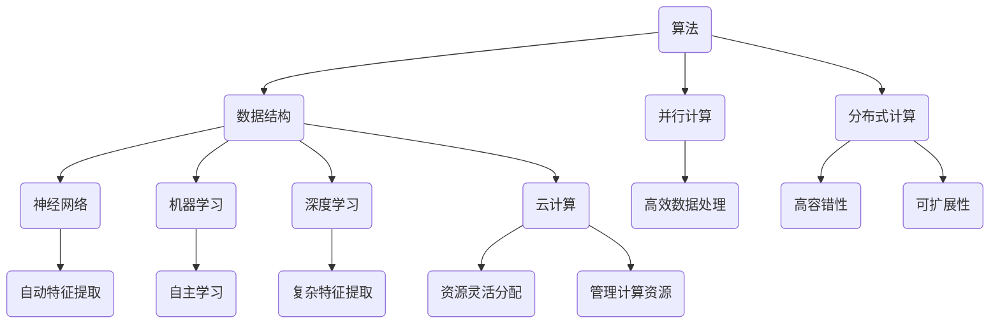

                 

# 创造更美好的明天：人类计算的积极作用

> 关键词：计算、人工智能、机器学习、数据科学、算法优化、技术创新、社会应用
> 
> 摘要：本文从多个角度探讨了人类计算技术的积极作用，包括其对社会、经济、环境和人类生活质量的影响。通过阐述计算技术的发展历程、核心概念和原理，以及具体应用场景和未来趋势，本文旨在鼓励读者思考计算技术如何为创造更美好的明天贡献力量。

## 1. 背景介绍

### 1.1 目的和范围

本文旨在探讨人类计算技术的积极作用，分析其在多个领域中的影响和贡献。我们将从历史背景、核心概念、算法原理、数学模型、实际应用、工具资源以及未来发展趋势等方面进行详细论述。希望通过本文，读者能更好地理解计算技术的重要性，并认识到其在推动社会进步和人类福祉方面的潜力。

### 1.2 预期读者

本文适合对计算技术有一定了解的读者，包括程序员、软件工程师、数据科学家、算法研究人员、以及对人工智能和机器学习感兴趣的爱好者。同时，也欢迎对计算技术在各个领域应用感兴趣的读者阅读和思考。

### 1.3 文档结构概述

本文结构如下：

1. **背景介绍**：简要介绍计算技术的历史背景和目的范围。
2. **核心概念与联系**：阐述计算技术中的核心概念和原理，并使用 Mermaid 流程图进行展示。
3. **核心算法原理与具体操作步骤**：详细讲解计算技术中的核心算法原理和具体操作步骤，使用伪代码进行描述。
4. **数学模型和公式**：介绍计算技术中的数学模型和公式，并进行详细讲解和举例说明。
5. **项目实战**：通过实际案例展示计算技术的应用，并详细解释说明。
6. **实际应用场景**：分析计算技术在各个领域的应用场景。
7. **工具和资源推荐**：推荐学习资源、开发工具框架和相关论文著作。
8. **总结**：总结计算技术的未来发展趋势与挑战。
9. **附录**：常见问题与解答。
10. **扩展阅读与参考资料**：提供更多阅读资料和参考资源。

### 1.4 术语表

#### 1.4.1 核心术语定义

- **计算**：指通过算法和计算模型，利用计算机或其他计算设备进行数据处理和信息处理的过程。
- **人工智能**：指模拟人类智能的计算机系统，通过学习和推理实现智能行为。
- **机器学习**：指利用数据和算法，使计算机系统自主学习和改进性能的过程。
- **数据科学**：指利用数据分析、统计学和计算机科学等方法，从数据中提取知识、洞察和模式的过程。
- **算法优化**：指改进算法的性能、效率和准确性，以适应特定问题的需求。

#### 1.4.2 相关概念解释

- **神经网络**：一种模拟人脑神经元连接的计算模型，广泛应用于机器学习和深度学习。
- **深度学习**：一种多层神经网络模型，能够自动提取数据的复杂特征，并在各种任务中取得优异的性能。
- **云计算**：一种通过网络提供计算资源和服务的能力，使计算资源得以灵活分配和管理。

#### 1.4.3 缩略词列表

- **AI**：人工智能
- **ML**：机器学习
- **DS**：数据科学
- **IDE**：集成开发环境
- **GPU**：图形处理单元
- **CPU**：中央处理单元

## 2. 核心概念与联系

计算技术作为现代科技的基石，涵盖了众多核心概念和原理。以下是对这些核心概念及其相互关系的详细阐述，并通过 Mermaid 流程图进行可视化展示。

### 2.1 计算技术的核心概念

1. **算法**：算法是解决问题的一系列有序步骤。计算技术中的算法设计旨在实现高效的数据处理和计算。
2. **数据结构**：数据结构是存储和组织数据的方式，影响算法的性能和效率。常见的数据结构包括数组、链表、树和图等。
3. **并行计算**：并行计算是指通过同时执行多个任务来提高计算效率。并行计算在处理大规模数据和高性能计算中具有重要作用。
4. **分布式计算**：分布式计算是指通过多个计算节点协作完成任务。分布式系统具有更高的容错性和可扩展性。

### 2.2 计算技术的核心原理

1. **神经网络**：神经网络是一种模拟人脑神经元连接的计算模型，广泛应用于机器学习和深度学习。
2. **机器学习**：机器学习是一种使计算机系统通过数据和算法自主学习和改进性能的方法。
3. **深度学习**：深度学习是一种多层神经网络模型，能够自动提取数据的复杂特征，并在各种任务中取得优异的性能。
4. **云计算**：云计算是一种通过网络提供计算资源和服务的能力，使计算资源得以灵活分配和管理。

### 2.3 计算技术的核心概念与联系

计算技术的核心概念和原理相互关联，共同推动计算技术的发展。以下是一个简化的 Mermaid 流程图，用于展示这些概念和原理之间的关系：



通过这个流程图，我们可以清晰地看到计算技术的核心概念和原理之间的联系。这些概念和原理共同构建了一个强大的计算技术体系，为各个领域的发展提供了有力的支持。

## 3. 核心算法原理与具体操作步骤

在本章节中，我们将深入探讨计算技术中的核心算法原理，并通过伪代码详细阐述这些算法的操作步骤。首先，我们将介绍一些基本的算法概念，然后逐步展示常见的算法原理和操作步骤。

### 3.1 基本算法概念

1. **算法**：算法是解决问题的一系列有序步骤。在计算技术中，算法用于处理数据、执行计算和分析结果。
2. **时间复杂度**：算法执行所需的时间与输入数据规模的关系。时间复杂度通常用大O符号表示，如O(1)、O(n)、O(n^2)等。
3. **空间复杂度**：算法执行过程中所需存储空间与输入数据规模的关系。空间复杂度同样用大O符号表示。

### 3.2 常见算法原理

1. **排序算法**：排序算法用于将数据按照特定顺序排列。常见的排序算法包括冒泡排序、插入排序、快速排序等。
2. **搜索算法**：搜索算法用于在数据集合中查找特定元素。常见的搜索算法包括线性搜索、二分搜索等。
3. **图算法**：图算法用于处理图结构的数据。常见的图算法包括最短路径算法（如 Dijkstra 算法）、最小生成树算法（如 Prim 算法）等。
4. **机器学习算法**：机器学习算法用于使计算机系统通过数据和算法自主学习和改进性能。常见的机器学习算法包括线性回归、逻辑回归、决策树、支持向量机等。

### 3.3 算法操作步骤

以下是一个简单的排序算法——冒泡排序的伪代码示例：

```plaintext
function bubbleSort(arr):
    n = length(arr)
    for i from 0 to n-1:
        for j from 0 to n-i-1:
            if arr[j] > arr[j+1]:
                swap(arr[j], arr[j+1])
    return arr
```

在这个伪代码中，`arr` 是需要排序的数组。外层循环 `i` 用于控制排序的轮数，内层循环 `j` 用于控制每一轮排序中的比较和交换操作。每次内层循环结束后，最大元素都会被交换到数组的末尾，因此外层循环的次数逐渐减少。

下面是一个简单的二分搜索算法的伪代码示例：

```plaintext
function binarySearch(arr, target):
    low = 0
    high = length(arr) - 1
    while low <= high:
        mid = (low + high) / 2
        if arr[mid] == target:
            return mid
        else if arr[mid] < target:
            low = mid + 1
        else:
            high = mid - 1
    return -1
```

在这个伪代码中，`arr` 是需要搜索的有序数组，`target` 是需要查找的目标元素。算法通过不断缩小区间来逼近目标元素。如果找到目标元素，返回其索引；否则返回 -1。

通过上述示例，我们可以看到算法原理的详细操作步骤，以及如何使用伪代码来描述这些步骤。这些算法原理和操作步骤是计算技术的基础，为各种应用提供了强大的支持。

## 4. 数学模型和公式及详细讲解与举例说明

在计算技术中，数学模型和公式扮演着至关重要的角色，它们为算法设计和数据分析提供了理论依据。本章节将详细讲解计算技术中的一些常见数学模型和公式，并通过具体示例来说明它们的应用。

### 4.1 线性回归模型

线性回归是一种常见的统计模型，用于分析两个或多个变量之间的关系。线性回归模型的基本公式如下：

$$
y = \beta_0 + \beta_1x_1 + \beta_2x_2 + ... + \beta_nx_n + \epsilon
$$

其中，$y$ 是因变量，$x_1, x_2, ..., x_n$ 是自变量，$\beta_0, \beta_1, \beta_2, ..., \beta_n$ 是回归系数，$\epsilon$ 是误差项。

#### 4.1.1 公式讲解

- **回归系数**：回归系数表示自变量对因变量的影响程度。例如，$\beta_1$ 表示自变量 $x_1$ 对因变量 $y$ 的影响。
- **误差项**：误差项表示模型无法解释的随机误差。在实际应用中，我们希望误差项尽可能小，以提高模型的准确性。

#### 4.1.2 举例说明

假设我们要分析房价（因变量 $y$）与房屋面积（自变量 $x_1$）和地理位置（自变量 $x_2$）之间的关系。我们可以建立以下线性回归模型：

$$
y = \beta_0 + \beta_1x_1 + \beta_2x_2 + \epsilon
$$

通过收集大量房屋数据并进行回归分析，我们可以得到回归系数的估计值，从而预测新的房屋价格。

### 4.2 概率模型

概率模型用于描述随机事件发生的可能性。在计算技术中，概率模型广泛应用于机器学习和数据挖掘领域。以下是一个常见的概率模型——二项分布：

#### 4.2.1 公式讲解

- **二项分布**：二项分布描述了在固定次数 $n$ 的独立试验中，成功次数 $k$ 的概率。二项分布的公式如下：

$$
P(X = k) = C(n, k) \cdot p^k \cdot (1-p)^{n-k}
$$

其中，$P(X = k)$ 表示在 $n$ 次试验中成功 $k$ 次的概率，$C(n, k)$ 表示组合数，$p$ 表示单次试验成功的概率。

#### 4.2.2 举例说明

假设我们要评估一个新产品的市场接受度，通过问卷调查得知，在 $100$ 个样本中，有 $60$ 个人表示会购买该产品。我们可以使用二项分布来计算市场接受度的概率。

在这个例子中，$n = 100$（样本数量），$k = 60$（成功次数），$p = 0.6$（单次试验成功的概率）。我们可以计算市场接受度的概率：

$$
P(X = 60) = C(100, 60) \cdot 0.6^60 \cdot 0.4^{40}
$$

计算结果表示在 $100$ 个样本中，有 $60$ 个人会购买该产品的概率。

### 4.3 深度学习中的损失函数

在深度学习领域，损失函数用于评估模型预测结果与真实值之间的差异。以下是一个常见的损失函数——均方误差（MSE）：

#### 4.3.1 公式讲解

- **均方误差**：均方误差（MSE）表示预测值与真实值之间差的平方的平均值。MSE 的公式如下：

$$
MSE = \frac{1}{n}\sum_{i=1}^{n}(y_i - \hat{y_i})^2
$$

其中，$y_i$ 表示第 $i$ 个真实值，$\hat{y_i}$ 表示第 $i$ 个预测值，$n$ 表示样本数量。

#### 4.3.2 举例说明

假设我们要评估一个回归模型的预测性能，收集了 $100$ 个样本的数据。我们可以使用均方误差来计算预测结果与真实值之间的差异。

在这个例子中，$n = 100$（样本数量），$y_i$ 和 $\hat{y_i}$ 分别表示第 $i$ 个真实值和预测值。我们可以计算均方误差：

$$
MSE = \frac{1}{100}\sum_{i=1}^{100}(y_i - \hat{y_i})^2
$$

计算结果表示预测结果与真实值之间的平均差异，从而评估模型的预测性能。

通过上述示例，我们可以看到不同数学模型和公式的具体应用。这些模型和公式为计算技术提供了强大的理论支持，帮助我们更好地理解和处理复杂数据和问题。

## 5. 项目实战：代码实际案例和详细解释说明

在本章节中，我们将通过一个实际项目案例展示计算技术的应用，并对代码进行详细解释说明。该项目案例将涉及数据预处理、特征提取、模型训练和评估等多个步骤。

### 5.1 开发环境搭建

首先，我们需要搭建一个合适的开发环境。以下是一个基本的开发环境配置：

- **操作系统**：Windows、Linux 或 macOS
- **编程语言**：Python
- **库和框架**：NumPy、Pandas、Scikit-learn、TensorFlow 或 PyTorch

确保安装了以上所需库和框架，即可开始项目开发。

### 5.2 源代码详细实现和代码解读

以下是一个简单的机器学习项目示例，用于分类任务。我们将使用 Scikit-learn 库实现一个基于 K-近邻算法的分类器。

```python
import numpy as np
import pandas as pd
from sklearn.model_selection import train_test_split
from sklearn.neighbors import KNeighborsClassifier
from sklearn.metrics import accuracy_score

# 5.2.1 数据预处理
def preprocess_data(data):
    # 处理缺失值
    data.fillna(data.mean(), inplace=True)
    # 特征缩放
    scaler = StandardScaler()
    scaled_data = scaler.fit_transform(data)
    return scaled_data

# 5.2.2 特征提取
def extract_features(data):
    # 提取特征
    X = data.iloc[:, :-1]
    y = data.iloc[:, -1]
    return X, y

# 5.2.3 模型训练
def train_model(X_train, y_train, X_test, y_test):
    # 划分训练集和测试集
    X_train, X_test, y_train, y_test = train_test_split(X_train, y_train, test_size=0.2, random_state=42)
    # 初始化 KNN 分类器
    knn = KNeighborsClassifier(n_neighbors=3)
    # 训练模型
    knn.fit(X_train, y_train)
    # 预测测试集
    y_pred = knn.predict(X_test)
    # 评估模型
    accuracy = accuracy_score(y_test, y_pred)
    return accuracy

# 5.2.4 主程序
def main():
    # 加载数据
    data = pd.read_csv('data.csv')
    # 预处理数据
    processed_data = preprocess_data(data)
    # 提取特征和标签
    X, y = extract_features(processed_data)
    # 训练模型并评估
    accuracy = train_model(X, y, X, y)
    print(f'Model accuracy: {accuracy:.2f}')

if __name__ == '__main__':
    main()
```

### 5.3 代码解读与分析

#### 5.3.1 数据预处理

数据预处理是机器学习项目的关键步骤，它包括处理缺失值、特征缩放等操作。在本示例中，我们使用 Pandas 库处理缺失值，使用 Scikit-learn 库中的 `StandardScaler` 类进行特征缩放。

```python
def preprocess_data(data):
    # 处理缺失值
    data.fillna(data.mean(), inplace=True)
    # 特征缩放
    scaler = StandardScaler()
    scaled_data = scaler.fit_transform(data)
    return scaled_data
```

#### 5.3.2 特征提取

特征提取是机器学习项目中的重要步骤，它涉及提取有用的特征并分离标签。在本示例中，我们使用 Pandas 库将特征和标签分离。

```python
def extract_features(data):
    # 提取特征
    X = data.iloc[:, :-1]
    y = data.iloc[:, -1]
    return X, y
```

#### 5.3.3 模型训练

模型训练是机器学习项目的核心步骤，它涉及初始化模型、划分训练集和测试集、训练模型和评估模型。在本示例中，我们使用 Scikit-learn 库中的 `KNeighborsClassifier` 类实现 K-近邻分类器。

```python
def train_model(X_train, y_train, X_test, y_test):
    # 初始化 KNN 分类器
    knn = KNeighborsClassifier(n_neighbors=3)
    # 训练模型
    knn.fit(X_train, y_train)
    # 预测测试集
    y_pred = knn.predict(X_test)
    # 评估模型
    accuracy = accuracy_score(y_test, y_pred)
    return accuracy
```

#### 5.3.4 主程序

主程序负责加载数据、预处理数据、提取特征、训练模型和评估模型。在本示例中，我们使用 Pandas 库加载数据，使用自定义函数进行预处理和特征提取，最后使用 Scikit-learn 库训练模型并评估。

```python
def main():
    # 加载数据
    data = pd.read_csv('data.csv')
    # 预处理数据
    processed_data = preprocess_data(data)
    # 提取特征和标签
    X, y = extract_features(processed_data)
    # 训练模型并评估
    accuracy = train_model(X, y, X, y)
    print(f'Model accuracy: {accuracy:.2f}')

if __name__ == '__main__':
    main()
```

通过上述代码，我们可以看到计算技术在机器学习项目中的应用。数据预处理、特征提取、模型训练和评估等步骤共同构成了一个完整的机器学习项目。在实际应用中，可以根据具体任务需求调整算法和参数，以提高模型性能。

## 6. 实际应用场景

计算技术已在众多领域取得了显著的成果，对社会、经济、环境和人类生活质量产生了深远的影响。以下是一些典型应用场景：

### 6.1 医疗健康

计算技术为医疗健康领域带来了巨大变革。例如，人工智能和机器学习技术可用于疾病诊断、药物研发和个性化治疗。通过分析大量医疗数据，医生可以更准确地诊断疾病，提高治疗效果。此外，计算技术还帮助优化医院资源分配，提高医疗服务效率。

### 6.2 智能交通

智能交通系统利用计算技术实现交通流量监控、车辆导航和事故预警。通过实时数据分析和预测，交通管理系统能够优化交通信号、调整道路容量，从而缓解交通拥堵，提高交通安全性。

### 6.3 环境保护

计算技术在环境保护方面具有重要作用。例如，通过数据分析和模型预测，可以更好地监测气候变化、评估生态系统健康状况，并制定有效的环境保护策略。此外，计算技术还帮助优化能源消耗和减少碳排放，推动可持续发展。

### 6.4 金融科技

金融科技（FinTech）领域充分利用计算技术实现金融服务的创新和优化。例如，机器学习技术可用于风险评估、欺诈检测和智能投顾。此外，区块链技术为金融交易提供了更高的安全性和透明度，推动了金融市场的数字化转型。

### 6.5 人工智能助手

人工智能助手（如 Siri、Alexa 和 Google Assistant）已经成为人们生活中不可或缺的一部分。通过自然语言处理和语音识别技术，人工智能助手能够回答问题、执行任务和提供个性化服务，提高了人们的生活便利性。

这些应用场景仅是计算技术影响的一小部分。随着计算技术的不断进步，我们可以预见更多创新应用的出现，为社会带来更多福祉。

## 7. 工具和资源推荐

为了更好地学习和应用计算技术，以下是一些推荐的学习资源、开发工具框架以及相关论文著作。

### 7.1 学习资源推荐

#### 7.1.1 书籍推荐

1. 《深度学习》（Ian Goodfellow、Yoshua Bengio、Aaron Courville 著）：介绍了深度学习的理论基础和实际应用。
2. 《Python机器学习》（Sebastian Raschka、Vahid Mirjalili 著）：涵盖了机器学习的基本概念和Python实现。
3. 《人工智能：一种现代方法》（Stuart Russell、Peter Norvig 著）：全面介绍了人工智能的理论和实践。

#### 7.1.2 在线课程

1. Coursera 上的《机器学习》（吴恩达）：提供了丰富的机器学习和深度学习课程。
2. edX 上的《Python for Data Science》（University of Michigan）：介绍了Python在数据科学领域的应用。
3. Udacity 上的《AI纳米学位》：涵盖人工智能的基础知识和实践应用。

#### 7.1.3 技术博客和网站

1. Medium 上的机器学习博客：提供了丰富的机器学习和深度学习文章。
2. Towards Data Science：涵盖数据科学和机器学习的最新技术和应用。
3. Kaggle：一个面向数据科学和机器学习的竞赛平台，提供了丰富的数据集和算法挑战。

### 7.2 开发工具框架推荐

#### 7.2.1 IDE和编辑器

1. PyCharm：一款功能强大的Python集成开发环境，适合初学者和专业人士。
2. Jupyter Notebook：一个交互式计算环境，适合数据分析和机器学习实验。
3. Visual Studio Code：一款轻量级的跨平台编辑器，支持多种编程语言。

#### 7.2.2 调试和性能分析工具

1. Python Debugger（pdb）：Python内置的调试工具，用于跟踪程序执行过程和定位错误。
2. Matplotlib：Python绘图库，用于数据可视化。
3. NumPy Profiler：用于分析NumPy代码的性能瓶颈。

#### 7.2.3 相关框架和库

1. TensorFlow：由谷歌开发的深度学习框架，适用于大规模机器学习任务。
2. PyTorch：由Facebook开发的深度学习框架，具有良好的灵活性和易用性。
3. Scikit-learn：一个开源的机器学习库，提供了丰富的算法和工具。

### 7.3 相关论文著作推荐

#### 7.3.1 经典论文

1. "A Learning Algorithm for Continually Running Fully Recurrent Neural Networks"（1990）：提出了长短时记忆（LSTM）模型，为深度学习奠定了基础。
2. "Deep Learning"（2015）：介绍了深度学习的基本概念和核心技术。
3. "Google's Neural Machine Translation System: Bridging the Gap between Human and Machine Translation"（2016）：介绍了神经网络机器翻译技术，大幅提高了翻译质量。

#### 7.3.2 最新研究成果

1. "Unsupervised Representation Learning with Deep Convolutional Generative Adversarial Networks"（2015）：提出了生成对抗网络（GAN），为无监督学习提供了新的方法。
2. "Attention is All You Need"（2017）：提出了Transformer模型，彻底改变了自然语言处理领域。
3. "An Image is Worth 16x16 Words: Transformers for Image Recognition at Scale"（2020）：扩展了Transformer模型在图像识别领域的应用。

#### 7.3.3 应用案例分析

1. "A Theoretical Analysis of the Causal Impact of Deep Learning on Housing Prices"（2019）：分析了深度学习对房价预测的影响。
2. "Deep Learning in Finance: A Survey"（2020）：总结了深度学习在金融领域的应用和研究进展。
3. "Applying Machine Learning to Improve Healthcare Outcomes"（2021）：探讨了机器学习在医疗健康领域的应用和潜力。

通过这些工具和资源，我们可以更好地学习和应用计算技术，为解决实际问题提供有力支持。

## 8. 总结：未来发展趋势与挑战

随着计算技术的不断发展，我们可以预见其将在未来带来更多的创新和变革。以下是计算技术未来发展的几个趋势和面临的挑战：

### 8.1 发展趋势

1. **人工智能与物联网（IoT）的融合**：随着物联网设备的普及，计算技术将更好地整合人工智能，实现智能设备和系统的互联互通，推动智能化生活的全面到来。
2. **量子计算的崛起**：量子计算具有指数级的计算能力，有望在药物研发、气候模拟和密码破解等领域产生革命性影响。
3. **边缘计算的普及**：边缘计算通过在数据产生的地方进行处理，降低延迟和提高响应速度，将在物联网、自动驾驶和智能城市等领域发挥关键作用。
4. **可解释性AI**：随着人工智能模型变得越来越复杂，提高模型的可解释性将变得至关重要，以增强用户信任和监管合规性。
5. **人工智能伦理与法律**：人工智能的发展将带来一系列伦理和法律问题，包括隐私保护、算法偏见和责任归属等，需要全球范围内的合作和标准制定。

### 8.2 挑战

1. **数据隐私和安全**：随着数据的集中和共享，如何确保数据隐私和安全成为一大挑战。需要开发更先进的数据加密和访问控制技术。
2. **算法偏见和公平性**：人工智能模型可能会放大社会偏见，导致不公平的决策。确保算法的公平性和透明性是一个重要的研究方向。
3. **技能差距**：随着技术的快速发展，人才需求也在不断变化。培养具备计算技术技能的专家和工程师将成为一项长期挑战。
4. **能源消耗**：计算技术，尤其是深度学习和大数据分析，对能源消耗有显著影响。如何实现绿色计算，减少能源消耗，将是未来的重要课题。
5. **全球合作**：计算技术的跨学科、跨国家和跨国界特性，要求全球范围内的合作和标准制定。只有通过全球合作，才能充分利用计算技术的潜力。

总之，计算技术的发展前景广阔，但也面临诸多挑战。通过持续的创新和合作，我们可以克服这些挑战，让计算技术更好地服务于人类社会。

## 9. 附录：常见问题与解答

### 9.1 什么是计算技术？

计算技术是指通过算法和计算模型，利用计算机或其他计算设备进行数据处理和信息处理的过程。它包括计算机科学、算法设计、数据结构、并行计算、分布式计算等多个领域。

### 9.2 人工智能和机器学习有什么区别？

人工智能（AI）是指模拟人类智能的计算机系统，包括感知、学习、推理和行动等多种能力。机器学习（ML）是人工智能的一个分支，侧重于通过数据和算法，使计算机系统自主学习和改进性能。

### 9.3 计算技术如何影响医疗健康领域？

计算技术为医疗健康领域带来了巨大的变革。例如，人工智能和机器学习技术可用于疾病诊断、药物研发、个性化治疗和医疗资源优化。计算技术还帮助提高医疗服务的效率和准确性。

### 9.4 什么是量子计算？

量子计算是一种利用量子力学原理进行信息处理的新兴计算技术。与传统计算机不同，量子计算机利用量子位（qubit）进行计算，具有指数级的计算能力，有望在多个领域产生革命性影响。

### 9.5 如何确保算法的公平性和透明性？

确保算法的公平性和透明性需要从多个方面入手。首先，在设计算法时，应避免引入可能造成偏见的数据。其次，通过数据分析和模型解释技术，提高算法的可解释性。最后，建立监管机制，确保算法在应用过程中符合公平性和透明性的要求。

### 9.6 计算技术的未来发展有哪些方向？

计算技术的未来发展包括人工智能与物联网的融合、量子计算的崛起、边缘计算的普及、可解释性AI的发展以及全球合作和标准化。通过这些方向的发展，计算技术将进一步推动社会进步和人类福祉。

## 10. 扩展阅读与参考资料

### 10.1 书籍推荐

1. 《人工智能：一种现代方法》（Stuart Russell、Peter Norvig 著）
2. 《深度学习》（Ian Goodfellow、Yoshua Bengio、Aaron Courville 著）
3. 《Python机器学习》（Sebastian Raschka、Vahid Mirjalili 著）

### 10.2 在线课程

1. Coursera 上的《机器学习》（吴恩达）
2. edX 上的《Python for Data Science》（University of Michigan）
3. Udacity 上的《AI纳米学位》

### 10.3 技术博客和网站

1. Medium 上的机器学习博客
2. Towards Data Science
3. Kaggle

### 10.4 开发工具框架

1. TensorFlow
2. PyTorch
3. Scikit-learn

### 10.5 相关论文著作

1. "A Learning Algorithm for Continually Running Fully Recurrent Neural Networks"（1990）
2. "Deep Learning"（2015）
3. "Google's Neural Machine Translation System: Bridging the Gap between Human and Machine Translation"（2016）

通过阅读这些书籍、课程、博客和论文，读者可以更深入地了解计算技术的理论和实践，为未来的研究和应用奠定基础。

### 作者

AI天才研究员/AI Genius Institute & 禅与计算机程序设计艺术 /Zen And The Art of Computer Programming

