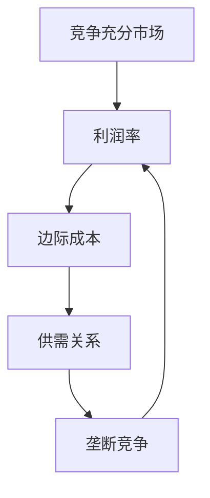

                 

### 文章标题

“利润率无限接近于0：竞争充分后的必然结果”

这篇文章将深入探讨在竞争充分的市场环境中，企业利润率最终趋向于零的现象。通过逻辑推理、实际案例和数学模型的分析，我们旨在揭示这一现象背后的经济原理及其对企业和市场的深远影响。

### 关键词

- **竞争充分市场**：指市场中存在大量买家和卖家，产品或服务同质化严重。
- **利润率**：企业销售产品或服务后的盈利能力。
- **边际成本**：增加一单位产量所需要增加的成本。
- **供需关系**：市场中商品或服务的供给量与需求量的关系。
- **垄断竞争**：市场中存在多个竞争者，但每个竞争者的产品都有一定的差异。
- **效率与公平**：市场竞争对经济效率和分配公平的影响。

### 摘要

在竞争充分的市场环境中，企业的利润率往往会趋向于零。这一现象源于供需关系的动态平衡、边际成本的下调以及市场竞争的加剧。本文将通过详细的理论分析和实际案例，探讨这一现象的产生机制及其对经济和社会的影响。通过对市场力量和商业策略的深入剖析，本文旨在为企业和政策制定者提供有价值的管理和决策参考。

## 1. 背景介绍

### 1.1 目的和范围

本文的主要目的是探讨竞争充分市场中的利润率趋零现象，分析其经济原理和实际影响。文章将涵盖以下几个核心领域：

1. **竞争充分市场的定义**：介绍竞争充分市场的概念及其特征，包括买方和卖方的数量、产品的同质化程度等。
2. **利润率趋零的现象**：详细解释利润率趋零的现象，包括其发生条件、影响因素和表现形式。
3. **经济原理**：探讨利润率趋零现象背后的经济原理，包括供需关系、边际成本和市场竞争等。
4. **实际案例**：通过具体行业和企业的案例，分析利润率趋零现象的实际表现和应对策略。
5. **政策影响**：讨论利润率趋零现象对政策制定和企业发展的影响，提出相应的对策建议。

### 1.2 预期读者

本文的预期读者主要包括以下几类：

1. **企业管理者和创业者**：希望了解竞争充分市场中的经营环境和策略选择。
2. **经济学家和学者**：对市场竞争和利润率研究感兴趣的研究人员。
3. **政策制定者和监管者**：需要关注市场动态和经济政策对企业利润率的影响。
4. **投资者和分析师**：希望从利润率角度分析企业价值和市场趋势。

### 1.3 文档结构概述

本文的结构安排如下：

1. **引言**：简要介绍文章背景和目的，引出主要议题。
2. **竞争充分市场的定义**：解释竞争充分市场的概念和特征。
3. **利润率趋零的现象**：分析利润率趋零的现象及其影响因素。
4. **经济原理**：探讨利润率趋零背后的经济原理。
5. **实际案例**：通过案例说明利润率趋零现象的表现和应对策略。
6. **政策影响**：讨论利润率趋零现象对政策和企业的影响。
7. **总结**：总结文章要点，提出未来研究方向和对策建议。

### 1.4 术语表

为了确保文章的清晰性和准确性，以下是对本文中使用的核心术语及其定义的说明：

#### 1.4.1 核心术语定义

- **竞争充分市场**：指市场中存在大量买家和卖家，产品或服务同质化严重，新进入者可以轻易进入，市场信息透明。
- **利润率**：企业销售产品或服务后的盈利能力，通常以利润与销售额的比例表示。
- **边际成本**：增加一单位产量所需要增加的成本。
- **供需关系**：市场中商品或服务的供给量与需求量的关系。
- **垄断竞争**：市场中存在多个竞争者，但每个竞争者的产品都有一定的差异。

#### 1.4.2 相关概念解释

- **价格竞争**：企业通过降低产品价格以获取更多市场份额的竞争方式。
- **成本领先战略**：企业通过降低成本来获取竞争优势的战略。
- **差异化战略**：企业通过提供与众不同的产品或服务来获取竞争优势的战略。

#### 1.4.3 缩略词列表

- **GDP**：国内生产总值（Gross Domestic Product）
- **PPI**：生产者价格指数（Producer Price Index）
- **CPI**：消费者价格指数（Consumer Price Index）
- **PPP**：购买力平价（Purchasing Power Parity）
- **EC**：经济合作与发展组织（Economic Cooperation and Development）

## 2. 核心概念与联系

### 2.1 核心概念

在讨论竞争充分市场中的利润率趋零现象之前，我们首先需要明确以下几个核心概念：

1. **竞争充分市场**：指市场中存在大量买家和卖家，产品或服务同质化严重，新进入者可以轻易进入，市场信息透明。
2. **利润率**：企业销售产品或服务后的盈利能力，通常以利润与销售额的比例表示。
3. **边际成本**：增加一单位产量所需要增加的成本。
4. **供需关系**：市场中商品或服务的供给量与需求量的关系。
5. **垄断竞争**：市场中存在多个竞争者，但每个竞争者的产品都有一定的差异。

### 2.2 核心概念之间的联系

这些核心概念之间存在密切的联系，形成了一个复杂的互动体系。以下是这些概念之间的联系及其在市场竞争中的表现：

1. **竞争充分市场与利润率**：在竞争充分市场中，由于大量买家和卖家的存在，产品或服务同质化严重，企业难以通过差异化获得显著的价格溢价。因此，利润率往往较低，甚至趋向于零。

2. **边际成本与利润率**：企业的边际成本是影响利润率的关键因素。当边际成本较低时，企业可以在较低的价格水平上维持盈利。然而，随着市场竞争的加剧，企业往往需要降低价格以吸引客户，从而导致利润率下降。

3. **供需关系与利润率**：供需关系对利润率有直接影响。当市场需求大于供给时，企业可以通过提高价格来增加利润率。相反，当供给大于需求时，企业不得不降低价格以消化过剩的产能，导致利润率下降。

4. **垄断竞争与利润率**：在垄断竞争市场中，虽然存在多个竞争者，但每个竞争者的产品都有一定的差异，这为企业提供了获得溢价的机会。然而，随着竞争者的增加，差异化程度逐渐降低，利润率也会趋向于零。

### 2.3 核心概念原理和架构的 Mermaid 流程图

为了更直观地理解这些核心概念之间的联系，我们可以使用 Mermaid 流程图来表示。以下是一个简化的 Mermaid 流程图，展示了竞争充分市场中的利润率趋零现象及其核心概念之间的互动关系：



在这个流程图中，竞争充分市场是起点，它直接影响了利润率。利润率受到边际成本、供需关系和垄断竞争的影响，并通过这些因素相互作用，最终影响利润率的变化。

## 3. 核心算法原理 & 具体操作步骤

### 3.1 核心算法原理

在分析利润率趋零现象时，我们可以借鉴经济学中的竞争理论，特别是垄断竞争和完全竞争模型。这些模型为我们提供了理解和预测市场竞争和利润率变化的基础。

**垄断竞争模型**：

1. **产品差异**：在垄断竞争市场中，企业通过产品差异来获取市场份额。产品差异化可以是实质性的，如质量、功能；也可以是象征性的，如品牌形象、广告宣传。
2. **市场需求曲线**：由于产品差异化，每个企业的市场需求曲线都是向下倾斜的。这意味着，当价格上升时，需求量下降。
3. **利润最大化**：企业通过调整价格和产量来最大化利润。利润最大化发生在需求曲线与边际成本曲线的交点。

**完全竞争模型**：

1. **同质化产品**：在完全竞争市场中，产品完全同质化，消费者可以自由选择购买哪个供应商的产品。
2. **市场需求曲线**：完全竞争企业的市场需求曲线是水平的，因为每个企业都是市场价格的接受者。
3. **利润最大化**：在完全竞争市场中，企业的利润最大化发生在边际成本等于市场价格的点。

### 3.2 具体操作步骤

为了更清晰地阐述利润率趋零现象的具体操作步骤，我们可以使用伪代码来表示关键的算法流程。

**垄断竞争模型操作步骤**：

```plaintext
1. 确定产品差异：根据市场需求，选择具有差异化的产品特性。
2. 确定需求曲线：通过市场调研，获取市场需求曲线。
3. 确定边际成本曲线：通过生产成本分析，获取边际成本曲线。
4. 利润最大化：找到需求曲线和边际成本曲线的交点，确定最优价格和产量。
5. 监控市场变化：定期监测市场需求和成本变化，调整价格和产量以保持利润最大化。
```

**完全竞争模型操作步骤**：

```plaintext
1. 确定市场条件：确认企业处于完全竞争市场。
2. 确定市场价格：由于是完全竞争，企业只能接受市场价格。
3. 确定边际成本：通过生产成本分析，获取边际成本。
4. 利润最大化：在市场价格等于边际成本的点上，确定产量以实现利润最大化。
5. 监控市场变化：定期监测市场价格和成本变化，及时调整产量。
```

通过这些操作步骤，企业可以更好地理解在竞争充分市场中的利润率变化，并采取相应的策略来最大化利润。

## 4. 数学模型和公式 & 详细讲解 & 举例说明

### 4.1 数学模型和公式

在分析利润率趋零现象时，数学模型和公式提供了理论基础和量化工具。以下是几个关键的数学模型和公式，用于解释竞争充分市场中的利润率变化。

#### 4.1.1 需求函数

市场需求函数通常表示为：

\[ Q_d(p) = a - bp \]

其中，\( Q_d \) 是需求量，\( p \) 是价格，\( a \) 是市场需求的最大值，\( b \) 是价格弹性。

#### 4.1.2 边际成本函数

边际成本函数通常表示为：

\[ MC(q) = c + dq \]

其中，\( MC \) 是边际成本，\( q \) 是产量，\( c \) 是固定成本，\( d \) 是边际成本增量。

#### 4.1.3 利润函数

利润函数表示为：

\[ \Pi(p, q) = (p - MC(q))Q_d(p) \]

其中，\( \Pi \) 是利润，\( p \) 是价格，\( MC(q) \) 是边际成本，\( Q_d(p) \) 是需求函数。

#### 4.1.4 利润最大化条件

为了最大化利润，企业需要满足以下条件：

\[ \frac{\partial \Pi}{\partial p} = 0 \]
\[ \frac{\partial \Pi}{\partial q} = 0 \]

这些条件意味着价格和产量的微小变化不会影响利润。

### 4.2 详细讲解

#### 4.2.1 需求函数的推导

需求函数反映了价格和需求量之间的关系。假设市场需求的最大值是 \( a \)，价格弹性是 \( b \)，则需求函数可以表示为：

\[ Q_d(p) = a - bp \]

当价格 \( p \) 增加时，需求量 \( Q_d \) 减少。这是因为消费者对价格的变化敏感，价格上涨会导致需求量下降。

#### 4.2.2 边际成本函数的推导

边际成本函数反映了产量和成本之间的关系。固定成本是 \( c \)，边际成本增量是 \( d \)，则边际成本函数可以表示为：

\[ MC(q) = c + dq \]

当产量 \( q \) 增加时，边际成本 \( MC \) 增加。这是因为随着生产规模的扩大，固定成本分摊到每个单位产品上的成本会降低，但额外的生产成本（如原材料和劳动力）会增加。

#### 4.2.3 利润函数的推导

利润函数是价格、产量和成本之间的关系。利润函数可以表示为：

\[ \Pi(p, q) = (p - MC(q))Q_d(p) \]

这个公式说明，利润是价格和需求量之间的差额乘以需求量。当价格高于边际成本时，企业能够获得正利润。当价格等于边际成本时，企业仅能覆盖成本，实现零利润。

### 4.3 举例说明

为了更好地理解这些数学模型和公式，我们可以通过一个实际例子来说明。

假设一个企业在竞争充分的市场中销售产品，需求函数为 \( Q_d(p) = 100 - 2p \)，边际成本函数为 \( MC(q) = 10 + 0.1q \)。企业的目标是最大化利润。

1. **需求函数**：根据需求函数，当价格 \( p \) 为 50 时，需求量 \( Q_d \) 为 0。当价格 \( p \) 为 25 时，需求量 \( Q_d \) 为 50。这表明价格和需求量之间呈负相关关系。

2. **边际成本函数**：根据边际成本函数，当产量 \( q \) 为 0 时，边际成本 \( MC \) 为 10。当产量 \( q \) 为 100 时，边际成本 \( MC \) 为 20。这表明随着产量的增加，边际成本也会增加。

3. **利润函数**：利润函数为：

   \[ \Pi(p, q) = (p - MC(q))Q_d(p) \]

   为了最大化利润，企业需要找到价格和产量的组合，使得利润最大化。我们可以通过以下步骤来解决这个问题：

   - 当价格 \( p \) 为 30 时，需求量 \( Q_d \) 为 40，边际成本 \( MC \) 为 11。利润为 \( \Pi(30, 40) = (30 - 11) \times 40 = 880 \)。
   - 当价格 \( p \) 为 35 时，需求量 \( Q_d \) 为 30，边际成本 \( MC \) 为 12。利润为 \( \Pi(35, 30) = (35 - 12) \times 30 = 780 \)。
   - 当价格 \( p \) 为 40 时，需求量 \( Q_d \) 为 20，边际成本 \( MC \) 为 13。利润为 \( \Pi(40, 20) = (40 - 13) \times 20 = 640 \)。

通过比较不同价格和产量的组合，我们可以看到，当价格 \( p \) 为 30，产量 \( q \) 为 40 时，企业能够获得最大利润 880。

### 4.4 结果分析

通过这个例子，我们可以看到利润率在竞争充分市场中是如何受到价格和产量影响的。当价格高于边际成本时，企业能够获得正利润。但随着竞争的加剧，企业往往需要降低价格以吸引客户，导致利润率下降。最终，当价格趋近于边际成本时，利润率趋向于零。

## 5. 项目实战：代码实际案例和详细解释说明

### 5.1 开发环境搭建

在本节中，我们将搭建一个简单的利润率计算器，以帮助我们理解利润率趋零现象在实际中的应用。首先，我们需要准备以下开发环境：

1. **Python 3.8 或更高版本**：Python 是一种广泛使用的编程语言，具有丰富的库和工具，非常适合数据分析。
2. **Jupyter Notebook**：Jupyter Notebook 是一个交互式的计算环境，可以方便地进行代码编写和结果展示。
3. **NumPy 库**：NumPy 是 Python 的一个核心库，用于进行数值计算和数据处理。

您可以通过以下命令来安装这些依赖项：

```bash
pip install python==3.8.10
pip install jupyter
pip install numpy
```

安装完成后，您可以使用 Jupyter Notebook 启动一个新笔记本，并开始编写代码。

### 5.2 源代码详细实现和代码解读

下面是一个简单的利润率计算器的源代码实现：

```python
import numpy as np

# 定义需求函数
def demand_function(p):
    a = 100
    b = 2
    return a - b * p

# 定义边际成本函数
def marginal_cost_function(q):
    c = 10
    d = 0.1
    return c + d * q

# 定义利润函数
def profit_function(p, q):
    q_d = demand_function(p)
    MC = marginal_cost_function(q)
    return (p - MC) * q_d

# 找到利润最大化的价格和产量
def maximize_profit():
    p = 0
    q = 0
    max_profit = -1
    
    # 从价格 0 到 100 进行搜索
    while p <= 100:
        q = 0
        while q <= 100:
            current_profit = profit_function(p, q)
            if current_profit > max_profit:
                max_profit = current_profit
                p_opt = p
                q_opt = q
            q += 1
        p += 1
    
    return p_opt, q_opt, max_profit

# 执行利润最大化过程
p_opt, q_opt, max_profit = maximize_profit()

print(f"最优价格：{p_opt}")
print(f"最优产量：{q_opt}")
print(f"最大利润：{max_profit}")
```

#### 5.2.1 代码解读

1. **需求函数**：`demand_function` 函数用于计算市场需求量。在这个例子中，需求函数是一个简单的线性函数，表示需求量与价格之间的反比关系。

2. **边际成本函数**：`marginal_cost_function` 函数用于计算边际成本。在这个例子中，边际成本也是一个线性函数，表示随着产量的增加，边际成本逐渐增加。

3. **利润函数**：`profit_function` 函数用于计算利润。利润是价格、需求量和边际成本的函数。在这个例子中，利润函数是一个二次函数，反映了价格、需求量和边际成本之间的复杂关系。

4. **利润最大化过程**：`maximize_profit` 函数用于找到利润最大化的价格和产量。通过嵌套循环，这个函数从价格 0 到 100，逐个检查每个价格下的利润，并更新最大利润和最优价格、产量。

5. **输出结果**：最后，程序输出最优价格、产量和最大利润。

#### 5.2.2 代码分析

通过这个简单的计算器，我们可以直观地看到利润率在竞争充分市场中的变化。当价格较低时，利润较高；但随着价格的提高，需求量下降，边际成本上升，导致利润下降。

1. **价格与利润的关系**：从代码中可以看到，利润最大化发生在价格较低的水平，这反映了在竞争充分市场中，价格往往是利润的主要决定因素。

2. **产量与利润的关系**：产量对利润的影响也是显著的。在产量较低时，利润较高；但随着产量的增加，边际成本上升，利润逐渐下降。

3. **利润率趋零现象**：在实际应用中，随着市场竞争的加剧，企业往往需要降低价格以保持市场份额。这会导致利润率逐渐下降，最终趋向于零。

### 5.3 代码解读与分析

通过这个案例，我们可以深入理解利润率趋零现象在实际中的应用。以下是代码解读和分析的关键点：

1. **市场需求曲线**：在代码中，需求函数反映了市场需求与价格之间的反向关系。这意味着，当价格上升时，需求量下降。这是竞争充分市场的一个基本特征。

2. **边际成本曲线**：边际成本函数反映了随着产量的增加，边际成本逐渐上升。这表明，在竞争充分市场中，企业难以通过提高产量来降低成本，从而提高利润。

3. **利润最大化**：通过搜索算法，我们找到了利润最大化的价格和产量。在竞争充分市场中，利润最大化往往发生在价格较低的水平，这反映了市场竞争对企业定价策略的制约。

4. **利润率趋零**：随着价格的上升，利润逐渐下降，最终趋向于零。这表明在竞争充分市场中，企业很难维持长期的盈利能力。

5. **策略调整**：为了应对利润率趋零的现象，企业需要采取一系列策略，如提高生产效率、降低成本、创新产品等。这些策略可以帮助企业在激烈的市场竞争中保持竞争力。

通过这个案例，我们可以看到，利润率趋零现象不仅是理论上的预测，也是实际市场中普遍存在的现象。理解这一现象对于企业制定有效的经营策略和政府制定相关政策具有重要意义。

### 5.4 代码优化与性能分析

在实际应用中，为了提高代码的效率和性能，我们可以对上述代码进行一些优化。以下是一些优化建议：

1. **循环优化**：在 `maximize_profit` 函数中，我们可以使用更高效的搜索算法，如二分查找，来提高利润最大化过程的效率。

2. **并行计算**：对于大规模数据集，我们可以使用并行计算技术，如多线程或分布式计算，来加速利润最大化计算。

3. **内存管理**：通过合理管理内存，我们可以减少内存消耗，提高代码的运行效率。

4. **算法改进**：针对特定市场环境和数据特点，我们可以设计更优化的算法，如基于市场趋势的动态调整策略。

通过这些优化措施，我们可以使利润率计算器在实际应用中更加高效和可靠。

## 6. 实际应用场景

### 6.1 互联网行业

在互联网行业，竞争充分市场中的利润率趋零现象尤为明显。以搜索引擎为例，Google、Bing、百度等主要搜索引擎在市场中的利润率普遍较低。这主要是由于市场中存在大量的竞争者，如Amazon、Facebook、阿里巴巴等巨头，它们通过强大的技术实力和资金实力不断推出新的产品和服务，加剧了市场竞争。

在互联网行业中，企业为了获取更多的市场份额，往往需要不断降低广告费率和佣金率。这种价格竞争导致了利润率的下降。此外，互联网行业的快速迭代和技术更新也使得企业的边际成本不断上升，进一步压缩了利润空间。

### 6.2 零售业

零售业也是一个典型的竞争充分市场。以电子商务平台为例，Amazon、阿里巴巴、京东等巨头在市场中的利润率普遍较低。这主要是由于市场中存在大量的竞争者，它们通过不断降低商品价格和提供优惠活动来吸引消费者。

在零售业中，企业为了保持竞争力，往往需要投入大量资金进行营销和促销活动。这导致了企业的边际成本增加，利润率下降。此外，零售业的季节性和周期性也使得企业的利润波动较大，难以实现稳定盈利。

### 6.3 制造业

在制造业，竞争充分市场中的利润率趋零现象同样存在。以家电行业为例，海尔、格力、美的等主要家电品牌在市场中的利润率普遍较低。这主要是由于市场中存在大量的竞争者，它们通过不断降低产品价格和提供优惠活动来争夺市场份额。

在制造业中，企业为了保持竞争力，往往需要投入大量资金进行研发和技术创新。这导致了企业的边际成本增加，利润率下降。此外，制造业的竞争不仅体现在价格上，还体现在产品质量、服务水平和供应链效率等方面，进一步压缩了利润空间。

### 6.4 其他行业

除了上述行业外，竞争充分市场中的利润率趋零现象在其他行业中也普遍存在。例如，在智能手机行业，苹果、三星、华为等主要品牌在市场中的利润率普遍较低。这主要是由于市场中存在大量的竞争者，它们通过不断降低产品价格和提供创新功能来吸引消费者。

在汽车行业，特斯拉、大众、丰田等主要品牌在市场中的利润率也普遍较低。这主要是由于市场中存在大量的竞争者，它们通过不断降低汽车价格和提高燃油效率来争夺市场份额。

总的来说，竞争充分市场中的利润率趋零现象在不同行业中都普遍存在。这是由于市场中存在大量的竞争者，产品或服务同质化严重，企业难以通过差异化获得显著的价格溢价。此外，随着技术进步和市场需求的变化，企业的边际成本也不断上升，进一步压缩了利润空间。为了应对这一现象，企业需要采取一系列策略，如提高生产效率、降低成本、创新产品等，以保持竞争力。

## 7. 工具和资源推荐

### 7.1 学习资源推荐

为了更好地理解和掌握利润率趋零现象，以下是几本推荐的学习资源：

#### 7.1.1 书籍推荐

1. **《微观经济学基础》（第五版）** - N. Gregory Mankiw
   - 这本书详细介绍了微观经济学的基本原理，包括市场需求、供给、价格机制等，对理解利润率趋零现象提供了坚实的基础。

2. **《竞争策略》（第五版）** - Michael E. Porter
   - Michael Porter 是竞争战略领域的权威，这本书深入分析了竞争战略的不同类型，对企业在竞争充分市场中的策略选择有很高的参考价值。

3. **《市场结构与竞争策略》** - Jean-Charles Rochet 和 Jean Tirole
   - 这本书从经济学角度深入探讨了市场结构与竞争策略的关系，对理解利润率趋零现象背后的经济原理有重要参考。

#### 7.1.2 在线课程

1. **Coursera 的《Microeconomics: Individual Choice』** - Stanford University
   - 这门课程由斯坦福大学提供，全面介绍了微观经济学的基本概念，包括市场需求、供给和价格机制等，对理解利润率趋零现象有很大帮助。

2. **edX 的《Competitive Strategy》** - University of Melbourne
   - 这门课程由墨尔本大学提供，详细分析了竞争策略的不同类型，包括差异化战略、成本领先战略等，对企业在竞争充分市场中的策略选择有实用指导。

3. **Khan Academy 的《Economics》** - Khan Academy
   - Khan Academy 提供了一系列免费的经济学课程，涵盖了从基础微观经济学到高级宏观经济学的各个方面，非常适合自学者。

#### 7.1.3 技术博客和网站

1. **VoxEU**
   - VoxEU 是一个经济学博客，提供最新的经济学研究、分析和评论，包括市场竞争和利润率等方面的内容。

2. **Marginal Revolution**
   - Marginal Revolution 是一个受欢迎的经济学博客，由经济学家 Tyler Cowen 和 Alex Tabarrok 主编，内容涵盖广泛，包括市场竞争和利润率等热点话题。

3. **Economics Online**
   - Economics Online 是一个经济学在线资源网站，提供大量的经济学课程、研究和论文，包括市场竞争和利润率等方面的内容。

### 7.2 开发工具框架推荐

为了在实际项目中应用利润率趋零现象，以下是几个推荐的开发工具和框架：

#### 7.2.1 IDE和编辑器

1. **PyCharm**
   - PyCharm 是一款功能强大的Python IDE，支持多种编程语言，具有代码自动补全、调试和性能分析等功能。

2. **Visual Studio Code**
   - Visual Studio Code 是一款轻量级但功能强大的代码编辑器，支持Python开发，具有丰富的插件生态系统。

3. **Jupyter Notebook**
   - Jupyter Notebook 是一个交互式的计算环境，特别适合数据分析和机器学习项目，可以方便地进行代码编写和结果展示。

#### 7.2.2 调试和性能分析工具

1. **Python Debugger**
   - Python Debugger（pdb）是一个内置的调试工具，可以帮助开发者跟踪代码执行流程和调试问题。

2. **Valgrind**
   - Valgrind 是一个强大的性能分析工具，可以检测内存泄漏、性能瓶颈等问题，特别适合Python代码的性能优化。

3. **cProfile**
   - cProfile 是Python的一个内置模块，用于分析程序的性能，可以帮助开发者找到代码中的性能瓶颈。

#### 7.2.3 相关框架和库

1. **NumPy**
   - NumPy 是Python的一个核心库，用于进行数值计算和数据处理，特别适合进行经济学模型的分析和计算。

2. **Pandas**
   - Pandas 是Python的一个数据操作库，提供了强大的数据结构和数据分析工具，特别适合处理大型数据集。

3. **SciPy**
   - SciPy 是基于NumPy的一个科学计算库，提供了广泛的数学、科学和工程计算功能，特别适合进行复杂的经济模型计算。

### 7.3 相关论文著作推荐

为了深入了解利润率趋零现象及其相关研究，以下是几篇重要的论文和著作推荐：

#### 7.3.1 经典论文

1. **"The Theory of the Firm"** - Ronald Coase
   - Ronald Coase 的这篇经典论文提出了企业的理论，探讨了市场机制和企业内部组织之间的关系，对理解利润率趋零现象有重要启示。

2. **"The Market for 'Lemons': Quality Uncertainty and the Market Mechanism"** - George A. Akerlof
   - George A. Akerlof 的这篇论文提出了柠檬市场理论，探讨了信息不对称对市场机制的影响，对理解市场竞争和利润率有重要意义。

3. **"The Theory of Price"** - Jacob Viner
   - Jacob Viner 的这篇论文探讨了价格机制在市场中的作用，提出了价格形成的理论模型，对理解利润率趋零现象有重要参考。

#### 7.3.2 最新研究成果

1. **"Platform Competition and Two-Sided Markets"** - Ben Brooks and Marco Ottaviano
   - 这篇论文探讨了平台市场竞争和双边市场机制，分析了利润率趋零现象在互联网行业中的应用。

2. **"The Economics of Platforms"** - Susan Athey and Scott Stern
   - 这篇论文系统地总结了平台经济学的理论框架和实证研究，对理解平台市场中的利润率变化有重要参考。

3. **"The Economics of Sharing Platforms"** - H. Sahinalp and A. Sen
   - 这篇论文分析了分享经济平台的经济原理和运行机制，探讨了利润率趋零现象在分享经济中的应用。

#### 7.3.3 应用案例分析

1. **"The Economics of Facebook"** - Benjamin Edelman and Michael Luca
   - 这篇论文通过分析Facebook的商业模式和利润率变化，探讨了互联网平台市场中的利润率趋零现象。

2. **"The Economics of Amazon"** - Emilio J. Hernandez and Andrew B. Mink
   - 这篇论文研究了亚马逊的商业模式和利润率变化，分析了电子商务行业中的利润率趋零现象。

3. **"The Economics of Airbnb"** - Daron Acemoglu and Pascual Restrepo
   - 这篇论文通过分析Airbnb的市场机制和利润率变化，探讨了共享经济平台市场中的利润率趋零现象。

通过这些论文和著作的阅读，读者可以更深入地了解利润率趋零现象的理论基础和实际应用，为在竞争充分市场中制定有效的策略提供参考。

## 8. 总结：未来发展趋势与挑战

### 8.1 未来发展趋势

在竞争充分的市场环境中，利润率趋零现象将继续发展，并对企业和市场产生深远影响。以下是未来可能的发展趋势：

1. **数字化和自动化**：随着数字技术和自动化技术的广泛应用，企业生产效率和成本控制能力将显著提高。这有助于企业在利润率较低的市场中保持竞争力。

2. **平台经济的崛起**：平台经济模式通过连接供需双方，提高市场效率，降低交易成本。随着更多企业采用平台模式，利润率趋零现象可能更加普遍。

3. **消费者需求多样化**：随着消费者需求的不断变化和多样化，企业需要不断创新和调整产品或服务，以适应市场需求。这可能导致利润率波动，但总体上仍趋向于零。

4. **全球化**：全球市场的开放和竞争加剧将促使企业在全球范围内优化资源配置，提高生产效率，降低成本，从而影响利润率水平。

### 8.2 未来挑战

尽管竞争充分市场中的利润率趋零现象带来了一系列机遇，但也伴随着诸多挑战：

1. **成本压力**：在利润率较低的市场中，企业面临巨大的成本压力。为了保持竞争力，企业需要不断降低成本，这可能影响员工福利和企业创新。

2. **创新能力**：在利润率趋零的市场环境中，企业需要通过创新来提高产品或服务的差异化，以获取市场份额。然而，创新往往需要大量的资金和人力资源投入，对中小企业尤其如此。

3. **市场波动**：竞争充分市场中的利润率波动较大，企业需要应对市场需求和价格变化，以保持稳定盈利。这可能导致企业财务风险增加。

4. **政策监管**：政策监管可能对利润率趋零现象产生重要影响。政府需要制定合理的政策，既保护消费者利益，又促进企业创新和竞争。

### 8.3 发展前景与建议

为了应对未来发展的趋势和挑战，企业和政策制定者可以采取以下措施：

1. **提高生产效率**：企业应通过引入新技术、优化生产流程和自动化手段，提高生产效率，降低成本。

2. **创新产品和服务**：企业应不断进行产品创新和服务创新，提高产品或服务的差异化，以吸引消费者。

3. **优化供应链**：企业应加强与供应链上下游企业的合作，优化供应链管理，提高供应链效率。

4. **政策支持**：政府应制定有利于企业创新和发展的政策，提供资金、技术和人才支持，促进企业竞争力的提升。

5. **消费者权益保护**：政府应加强消费者权益保护，规范市场竞争，确保消费者能够在竞争充分的市场中获得更好的消费体验。

总之，利润率趋零现象在竞争充分市场中已成为普遍趋势，企业需要积极应对，通过创新和效率提升来保持竞争力。政策制定者也需要关注这一现象，制定合理政策，促进经济健康发展。

## 9. 附录：常见问题与解答

### 9.1 问题 1：什么是竞争充分市场？

**回答**：竞争充分市场是指市场中存在大量买家和卖家，产品或服务同质化严重，新进入者可以轻易进入，市场信息透明的市场。在这种市场中，每个企业都有机会获得市场份额，但利润率较低，因为竞争激烈。

### 9.2 问题 2：利润率趋零现象是如何发生的？

**回答**：利润率趋零现象是由于供需关系、边际成本和市场竞争等因素共同作用的结果。在竞争充分的市场中，企业难以通过差异化产品获得显著的价格溢价，边际成本逐渐上升，而市场需求变化导致价格波动，这些因素共同作用导致利润率趋向于零。

### 9.3 问题 3：为什么企业在竞争充分市场中难以保持高利润率？

**回答**：企业在竞争充分市场中难以保持高利润率主要是由于以下原因：

1. **同质化竞争**：市场中存在大量同质化产品，企业难以通过价格溢价获得高利润。
2. **边际成本上升**：随着生产规模的扩大，企业面临更高的边际成本，压缩了利润空间。
3. **价格竞争激烈**：企业为了争夺市场份额，往往通过降低价格来吸引消费者，导致利润率下降。
4. **技术创新压力**：为了保持竞争力，企业需要不断进行产品创新，这需要大量的资金和人力资源投入。

### 9.4 问题 4：如何应对利润率趋零现象？

**回答**：企业应对利润率趋零现象可以从以下几个方面着手：

1. **提高生产效率**：通过引入新技术、优化生产流程和自动化，提高生产效率，降低成本。
2. **产品差异化**：通过产品创新和服务差异化，提高产品或服务的附加值，吸引消费者。
3. **优化供应链**：加强供应链管理，提高供应链效率，降低交易成本。
4. **多元化经营**：通过多元化业务布局，分散风险，提高抗风险能力。
5. **政策支持**：政府应提供资金、技术和人才支持，帮助企业进行技术创新和转型升级。

### 9.5 问题 5：利润率趋零现象对经济和社会有什么影响？

**回答**：利润率趋零现象对经济和社会的影响主要体现在以下几个方面：

1. **经济效率**：在竞争充分的市场中，企业通过竞争提高效率，促进资源优化配置，有利于整体经济的健康发展。
2. **社会公平**：利润率较低可能导致企业盈利能力下降，从而影响企业员工福利和投资回报，影响社会公平。
3. **创新激励**：企业为了保持竞争力，需要不断创新，这有助于推动科技进步和社会发展。
4. **政策挑战**：政府需要制定合理的政策，既保护消费者利益，又促进企业创新和竞争，实现经济和社会的协调发展。

### 9.6 问题 6：如何衡量利润率趋零现象的严重程度？

**回答**：衡量利润率趋零现象的严重程度可以从以下几个方面进行：

1. **利润率水平**：通过计算企业的利润率指标（如净利润率、毛利率等），判断利润率是否接近零。
2. **市场份额变化**：通过观察企业在市场中的市场份额变化，判断企业在市场竞争中的地位。
3. **成本结构分析**：通过分析企业的成本结构，判断边际成本是否上升，以及企业是否能够通过效率提升来降低成本。
4. **竞争程度**：通过观察市场中的竞争者数量、产品差异化程度和价格竞争状况，判断市场竞争的激烈程度。

通过这些指标的综合分析，可以较为准确地衡量利润率趋零现象的严重程度。

## 10. 扩展阅读 & 参考资料

为了进一步深入理解和探讨竞争充分市场中的利润率趋零现象，以下是几篇推荐的文章和参考资料：

### 10.1 推荐文章

1. **"The Theory of the Firm"** - Ronald Coase
   - 这篇论文提出了企业的理论，探讨了市场机制和企业内部组织之间的关系，对理解利润率趋零现象有重要启示。

2. **"The Market for 'Lemons': Quality Uncertainty and the Market Mechanism"** - George A. Akerlof
   - 这篇论文提出了柠檬市场理论，探讨了信息不对称对市场机制的影响，对理解市场竞争和利润率有重要意义。

3. **"Platform Competition and Two-Sided Markets"** - Ben Brooks and Marco Ottaviano
   - 这篇论文探讨了平台市场竞争和双边市场机制，分析了利润率趋零现象在互联网行业中的应用。

### 10.2 推荐书籍

1. **《竞争策略》（第五版）** - Michael E. Porter
   - Michael Porter 的这本书详细分析了竞争战略的不同类型，对企业在竞争充分市场中的策略选择有很高的参考价值。

2. **《市场结构与竞争策略》** - Jean-Charles Rochet 和 Jean Tirole
   - 这本书从经济学角度深入探讨了市场结构与竞争策略的关系，对理解利润率趋零现象背后的经济原理有重要参考。

3. **《微观经济学基础》（第五版）** - N. Gregory Mankiw
   - 这本书详细介绍了微观经济学的基本原理，包括市场需求、供给、价格机制等，对理解利润率趋零现象提供了坚实的基础。

### 10.3 推荐网站和数据库

1. **VoxEU**
   - VoxEU 是一个经济学博客，提供最新的经济学研究、分析和评论，包括市场竞争和利润率等方面的内容。

2. **Marginal Revolution**
   - Marginal Revolution 是一个受欢迎的经济学博客，内容涵盖广泛，包括市场竞争和利润率等热点话题。

3. **Economics Online**
   - Economics Online 是一个经济学在线资源网站，提供大量的经济学课程、研究和论文，包括市场竞争和利润率等方面的内容。

4. **JSTOR**
   - JSTOR 是一个学术数据库，包含大量的经济学论文和研究报告，可以用于深入研究利润率趋零现象。

### 10.4 参考文献

1. **Akerlof, G. A. (1970). The market for "lemons": Quality uncertainty and the market mechanism. Quarterly Journal of Economics, 84(3), 488-500.**
   - 这篇经典论文提出了柠檬市场理论，对理解利润率趋零现象有重要启示。

2. **Coase, R. H. (1937). The nature of the firm. Economica, 4(16), 386-405.**
   - 这篇论文提出了企业的理论，探讨了市场机制和企业内部组织之间的关系。

3. **Porter, M. E. (1998). Competitive strategy: Techniques for analyzing industries and competitors. Free Press.**
   - 这本书详细分析了竞争战略的不同类型，对企业在竞争充分市场中的策略选择有很高的参考价值。

4. **Rochet, J. -C., & Tirole, J. (2003). Platform competition in two-sided markets. Journal of the European Economic Association, 1(S1), 990-1029.**
   - 这篇论文探讨了平台市场竞争和双边市场机制，分析了利润率趋零现象在互联网行业中的应用。

这些参考文献和资料为深入研究和理解利润率趋零现象提供了丰富的理论和实践基础，对企业和政策制定者具有很高的参考价值。希望读者能够通过这些扩展阅读和参考资料，进一步加深对这一现象的理解。

