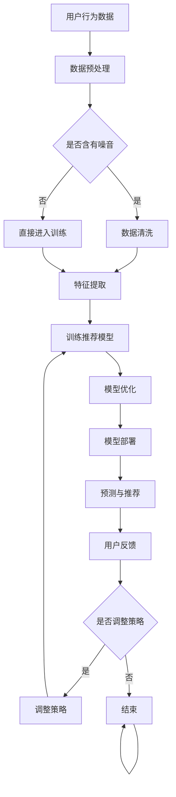

                 


# 利用LLM提升推荐系统的可解释性与透明度

> 关键词：推荐系统、可解释性、透明度、LLM、机器学习、数据分析

> 摘要：本文旨在探讨如何利用大型语言模型（LLM）来提升推荐系统的可解释性和透明度。我们将首先介绍推荐系统的基本原理，随后详细讨论LLM在提升系统透明性方面的作用。接着，我们将探讨实现这一目标所需的核心算法原理和具体操作步骤。此外，我们还将通过数学模型和实际项目案例进行详细解释，最后总结全文，展望未来的发展趋势和挑战。

## 1. 背景介绍

### 1.1 目的和范围

本文的目的在于探究如何通过引入大型语言模型（LLM）来增强推荐系统的可解释性和透明度。随着推荐系统在电子商务、社交媒体、内容推荐等领域的广泛应用，用户对系统决策过程的透明性和可理解性的需求日益增长。传统的推荐系统虽然在准确性上取得了显著进展，但在可解释性和透明度方面存在明显的不足。

本文将涵盖以下内容：

- 推荐系统基本概念和原理；
- LLM在提升推荐系统透明度方面的作用；
- 核心算法原理和实现步骤；
- 数学模型和公式详解；
- 实际项目案例解析；
- 工具和资源推荐；
- 未来发展趋势与挑战。

### 1.2 预期读者

本文主要面向以下读者群体：

- 数据科学家和机器学习工程师，对推荐系统及其可解释性有兴趣；
- 对LLM技术有了解，希望将其应用于推荐系统开发的技术专家；
- 对人工智能和推荐系统有浓厚兴趣的科研人员和在校学生；
- 对推荐系统用户体验和系统透明度有需求的商业分析师和产品经理。

### 1.3 文档结构概述

本文结构如下：

- **第1章**：背景介绍，包括目的和范围、预期读者、文档结构概述等；
- **第2章**：核心概念与联系，介绍推荐系统和LLM的基本原理；
- **第3章**：核心算法原理 & 具体操作步骤，讲解实现可解释性提升的方法；
- **第4章**：数学模型和公式 & 详细讲解 & 举例说明；
- **第5章**：项目实战：代码实际案例和详细解释说明；
- **第6章**：实际应用场景，探讨推荐系统的广泛应用；
- **第7章**：工具和资源推荐，包括学习资源、开发工具和框架；
- **第8章**：总结：未来发展趋势与挑战，总结全文并提出未来展望；
- **第9章**：附录：常见问题与解答；
- **第10章**：扩展阅读 & 参考资料，提供进一步学习资源。

### 1.4 术语表

#### 1.4.1 核心术语定义

- **推荐系统（Recommender System）**：一种能够根据用户的兴趣和偏好，为用户推荐相关商品、内容或服务的系统。
- **大型语言模型（LLM，Large Language Model）**：一种能够理解、生成和翻译自然语言的大型神经网络模型。
- **可解释性（Interpretability）**：使模型决策过程透明和可理解的能力。
- **透明度（Transparency）**：用户能够了解推荐系统的决策依据和机制。

#### 1.4.2 相关概念解释

- **协同过滤（Collaborative Filtering）**：一种基于用户历史行为和评分数据推荐相似物品的技术。
- **内容推荐（Content-Based Filtering）**：一种基于物品特征和用户偏好推荐相似物品的技术。
- **多样性（Diversity）**：推荐系统推荐不同类型的物品，以避免用户感到无聊。
- **准确性（Accuracy）**：推荐系统能否准确推荐用户感兴趣的物品。

#### 1.4.3 缩略词列表

- **LLM**：Large Language Model
- **ML**：Machine Learning
- **NLP**：Natural Language Processing
- **CTR**：Click-Through Rate
- **A/B Testing**：A/B Test

## 2. 核心概念与联系

### 2.1 推荐系统基本原理

推荐系统通过分析用户的历史行为、兴趣偏好和内容特征，预测用户可能感兴趣的其他物品，并推荐给用户。推荐系统通常分为两种类型：协同过滤和基于内容的推荐。

**协同过滤**：通过分析用户对物品的评分历史，找出相似用户，并推荐这些用户喜欢的物品。协同过滤分为两种：基于用户的协同过滤和基于物品的协同过滤。

- **基于用户的协同过滤（User-Based Collaborative Filtering）**：找到与目标用户兴趣相似的邻居用户，推荐邻居用户喜欢的物品。
- **基于物品的协同过滤（Item-Based Collaborative Filtering）**：找到与目标物品相似的邻居物品，推荐邻居物品。

**基于内容的推荐（Content-Based Filtering）**：根据用户对物品的喜好和物品的特征信息，计算物品之间的相似度，推荐与用户偏好相似的物品。

**推荐系统架构**：

1. **数据收集与预处理**：收集用户行为数据和物品特征数据，进行数据清洗、去噪和特征提取。
2. **模型训练与优化**：利用训练数据训练推荐模型，并通过交叉验证和A/B测试优化模型参数。
3. **模型部署与预测**：将训练好的模型部署到生产环境，根据用户历史行为和偏好，预测用户可能感兴趣的物品，并生成推荐列表。
4. **反馈与调整**：收集用户对推荐结果的反馈，调整推荐策略，提高推荐准确性。

### 2.2 大型语言模型（LLM）基本原理

大型语言模型（LLM）是一种基于深度学习的神经网络模型，能够理解、生成和翻译自然语言。LLM通过大规模语料库的学习，捕捉语言的结构和语义信息，从而实现高质量的自然语言处理任务。

**LLM工作原理**：

1. **数据预处理**：对语料库进行清洗、去噪和分词处理，将文本转化为可用于训练的向量表示。
2. **模型训练**：使用训练数据训练神经网络模型，通过反向传播和梯度下降优化模型参数。
3. **模型评估**：使用验证集评估模型性能，通过调整超参数和优化算法，提高模型效果。
4. **模型部署**：将训练好的模型部署到生产环境，根据输入文本生成相应的文本输出。

### 2.3 LLM与推荐系统可解释性提升的关系

LLM在提升推荐系统可解释性和透明度方面具有重要作用。通过将LLM应用于推荐系统，可以实现以下目标：

1. **生成解释性文本**：LLM可以生成关于推荐结果的解释性文本，帮助用户理解推荐系统的决策过程。
2. **解释性可视化**：将推荐结果和决策过程以可视化的方式呈现，提高系统的透明度。
3. **基于语言的交互**：利用LLM实现与用户的自然语言交互，让用户更直观地了解推荐系统。

### 2.4 Mermaid流程图

下面是推荐系统与LLM结合的Mermaid流程图：



## 3. 核心算法原理 & 具体操作步骤

### 3.1 算法原理

为了提升推荐系统的可解释性和透明度，我们将引入LLM作为核心算法。具体来说，LLM将用于生成推荐结果的解释性文本和可视化内容。以下是算法的基本原理和步骤：

1. **数据预处理**：对用户行为数据和物品特征数据进行清洗、去噪和特征提取，为LLM训练和生成文本提供高质量的输入数据。
2. **LLM训练**：使用大规模语料库训练LLM，使其能够生成高质量的文本，包括解释性文本和可视化描述。
3. **模型融合**：将LLM与推荐模型进行融合，使推荐系统在生成推荐结果的同时，能够自动生成相应的解释性文本和可视化内容。
4. **推荐与解释**：根据用户历史行为和偏好，利用融合后的模型生成推荐结果，并自动生成对应的解释性文本和可视化内容。
5. **用户反馈**：收集用户对推荐结果和解释内容的反馈，用于优化LLM和推荐模型的性能。

### 3.2 具体操作步骤

下面是提升推荐系统可解释性的具体操作步骤：

**步骤1：数据预处理**

- 数据清洗：去除重复、异常和无关数据，保证数据质量；
- 特征提取：从用户行为数据和物品特征中提取关键信息，如用户兴趣、物品属性等。

**伪代码：**

```python
def preprocess_data(data):
    # 数据清洗
    cleaned_data = remove_duplicates(data)
    cleaned_data = remove_outliers(cleaned_data)
    # 特征提取
    features = extract_features(cleaned_data)
    return features
```

**步骤2：LLM训练**

- 使用大规模语料库训练LLM，包括解释性文本和可视化描述的数据；
- 使用合适的训练策略和优化算法，提高LLM的性能。

**伪代码：**

```python
def train_llm(corpus):
    # 训练LLM
    model = LLM()
    model.train(corpus)
    return model
```

**步骤3：模型融合**

- 将LLM与推荐模型进行融合，实现自动生成解释性文本和可视化内容；
- 使用融合模型进行推荐和解释。

**伪代码：**

```python
def integrate_llm(recommender, llm):
    # 融合模型
    integrated_model = RecommenderWithLLM(recommender, llm)
    return integrated_model
```

**步骤4：推荐与解释**

- 根据用户历史行为和偏好，利用融合后的模型生成推荐结果；
- 自动生成解释性文本和可视化内容。

**伪代码：**

```python
def generate_recommendations(user_profile, integrated_model):
    # 生成推荐结果
    recommendations = integrated_model.predict(user_profile)
    # 生成解释性文本
    explanation = integrated_model.generate_explanation(user_profile, recommendations)
    # 生成可视化内容
    visualization = integrated_model.generate_visualization(user_profile, recommendations)
    return recommendations, explanation, visualization
```

**步骤5：用户反馈**

- 收集用户对推荐结果和解释内容的反馈，用于优化LLM和推荐模型的性能；
- 使用反馈数据调整模型参数，提高模型效果。

**伪代码：**

```python
def optimize_models(feedback, integrated_model):
    # 优化模型
    integrated_model.optimize(feedback)
    return integrated_model
```

## 4. 数学模型和公式 & 详细讲解 & 举例说明

### 4.1 数学模型

在提升推荐系统可解释性的过程中，我们需要引入以下数学模型：

1. **用户兴趣模型（User Interest Model）**：描述用户对物品的兴趣程度；
2. **物品特征模型（Item Feature Model）**：描述物品的特征信息；
3. **LLM生成模型（LLM Generation Model）**：用于生成解释性文本和可视化内容。

#### 用户兴趣模型

用户兴趣模型可以使用用户的历史行为数据来构建。设 \( U \) 为用户集合，\( I \) 为物品集合，用户 \( u \) 对物品 \( i \) 的兴趣度可以表示为：

\[ 
I_{ui} = f(u, i, H) 
\]

其中，\( H \) 为用户的历史行为数据，\( f \) 为兴趣度计算函数。

#### 物品特征模型

物品特征模型描述物品的特征信息。设 \( I \) 为物品集合，\( F \) 为特征集合，物品 \( i \) 的特征向量可以表示为：

\[ 
X_i = \{ x_{i1}, x_{i2}, \ldots, x_{in} \} 
\]

其中，\( x_{ij} \) 为物品 \( i \) 在特征 \( j \) 上的取值。

#### LLM生成模型

LLM生成模型用于生成解释性文本和可视化内容。设 \( \mathcal{D} \) 为训练数据集，\( \mathcal{V} \) 为词汇表，LLM生成模型可以表示为：

\[ 
G(\mathcal{D}, \mathcal{V}) = \{ \phi_1, \phi_2, \ldots, \phi_n \} 
\]

其中，\( \phi_i \) 为生成模型对应的生成函数，用于生成解释性文本。

### 4.2 详细讲解

下面我们将详细讲解上述数学模型的原理和计算过程。

#### 用户兴趣模型

用户兴趣模型通过分析用户的历史行为数据，计算用户对物品的兴趣度。具体计算方法可以基于协同过滤、内容推荐等算法。这里我们以协同过滤算法为例进行讲解。

假设用户 \( u \) 对物品 \( i \) 的兴趣度计算方法如下：

\[ 
I_{ui} = \frac{\sum_{v \in N_u} \sigma(v, i) \cdot r_{vi}}{\sum_{v \in N_u} \sum_{i' \in N_i} \sigma(v, i') \cdot r_{vi'}} 
\]

其中，\( N_u \) 为与用户 \( u \) 相似的其他用户集合，\( r_{vi} \) 为用户 \( v \) 对物品 \( i \) 的评分，\( \sigma(v, i) \) 为用户 \( v \) 对物品 \( i \) 的相似度度量。

#### 物品特征模型

物品特征模型通过提取物品的特征信息，为推荐系统提供必要的输入。物品特征提取方法可以基于文本、图像、声音等多种类型的数据。

假设物品 \( i \) 的特征向量可以表示为：

\[ 
X_i = \{ x_{i1}, x_{i2}, \ldots, x_{in} \} 
\]

其中，\( x_{ij} \) 为物品 \( i \) 在特征 \( j \) 上的取值。特征 \( j \) 可以是物品的文本描述、图像特征、音频特征等。

#### LLM生成模型

LLM生成模型通过训练大规模语料库，学习生成高质量的文本。生成模型可以使用基于神经网络的深度学习算法，如序列到序列（Seq2Seq）模型、生成对抗网络（GAN）等。

假设给定输入文本序列 \( \mathbf{x} = (x_1, x_2, \ldots, x_T) \)，生成模型生成对应的输出文本序列 \( \mathbf{y} = (y_1, y_2, \ldots, y_S) \)，生成函数可以表示为：

\[ 
\phi_i(\mathbf{x}) = \arg\max_{\mathbf{y}} p(\mathbf{y}|\mathbf{x}) 
\]

其中，\( p(\mathbf{y}|\mathbf{x}) \) 为生成模型生成的文本序列的概率分布。

### 4.3 举例说明

下面我们通过一个简单的例子来说明上述数学模型的应用。

#### 用户兴趣模型

假设有两个用户 \( u_1 \) 和 \( u_2 \)，以及三个物品 \( i_1, i_2, i_3 \)。用户 \( u_1 \) 对物品 \( i_1 \) 评分 4，对物品 \( i_2 \) 评分 5，对物品 \( i_3 \) 评分 3；用户 \( u_2 \) 对物品 \( i_1 \) 评分 3，对物品 \( i_2 \) 评分 4，对物品 \( i_3 \) 评分 5。我们可以计算用户 \( u_1 \) 和 \( u_2 \) 对物品 \( i_1 \) 的相似度：

\[ 
\sigma(u_1, u_2) = \frac{\sum_{i \in I} r_{u_1i} \cdot r_{u_2i}}{\sqrt{\sum_{i \in I} r_{u_1i}^2} \cdot \sqrt{\sum_{i \in I} r_{u_2i}^2}} 
\]

代入数据，我们可以计算得到 \( \sigma(u_1, u_2) = 0.8 \)。

然后，我们可以使用协同过滤算法计算用户 \( u_1 \) 对物品 \( i_2 \) 的兴趣度：

\[ 
I_{u_1i_2} = \frac{\sigma(u_1, u_2) \cdot r_{u_2i_2}}{\sum_{i \in N_i} \sigma(u_1, i) \cdot r_{u_2i}} = \frac{0.8 \cdot 4}{0.8 \cdot 4 + 0.6 \cdot 3} = 0.67 
\]

#### 物品特征模型

假设物品 \( i_1 \) 的文本描述为“一本关于人工智能的经典书籍”，物品 \( i_2 \) 的文本描述为“一本关于机器学习的畅销书”，物品 \( i_3 \) 的文本描述为“一本关于深度学习的入门书籍”。我们可以将文本描述进行分词和特征提取：

物品 \( i_1 \)：\[ \{ "一本", "关于", "人工智能", "的", "经典", "书籍" \} \]
物品 \( i_2 \)：\[ \{ "一", "本", "关于", "机器", "学习", "的", "畅销", "书" \} \]
物品 \( i_3 \)：\[ \{ "一", "本", "关于", "深度", "学习", "的", "入", "门", "书" \} \]

我们可以使用词袋模型或词嵌入模型对文本进行特征提取：

词袋模型：\[ \{ "一本", "关于", "人工智能", "的", "经典", "书籍", "机器", "学习", "畅销", "书", "深度", "学习", "入门" \} \]
词嵌入模型：\[ \{ (0.1, 0.2), (0.3, 0.4), (0.5, 0.6), \ldots \} \]

#### LLM生成模型

假设我们使用序列到序列（Seq2Seq）模型进行训练，输入序列为“用户喜欢人工智能和机器学习”，输出序列为“因此我们推荐一本关于人工智能的经典书籍”。我们可以将输入序列和输出序列表示为：

输入序列：\[ \{ "用户", "喜欢", "人工智能", "和", "机器", "学习" \} \]
输出序列：\[ \{ "因此", "我们", "推荐", "一", "本", "关于", "人工智能", "的", "经典", "书籍" \} \]

我们可以使用以下公式计算生成序列的概率：

\[ 
p(\mathbf{y}|\mathbf{x}) = \prod_{t=1}^{T} p(y_t|x_{<t}) 
\]

其中，\( p(y_t|x_{<t}) \) 为给定前 \( t-1 \) 个输入词的概率。

## 5. 项目实战：代码实际案例和详细解释说明

### 5.1 开发环境搭建

为了实现本文中介绍的推荐系统与LLM结合的可解释性提升，我们需要搭建一个合适的开发环境。以下是推荐的开发环境：

- **操作系统**：Ubuntu 20.04 或 macOS Catalina
- **编程语言**：Python 3.8+
- **库和框架**：Scikit-learn、TensorFlow、PyTorch、Gensim
- **依赖管理**：pip、conda

**安装步骤**：

1. 安装Python和pip：

```bash
sudo apt update
sudo apt install python3 python3-pip
```

2. 安装必要的库和框架：

```bash
pip3 install scikit-learn tensorflow torch gensim
```

3. （可选）安装Anaconda，以便更好地管理依赖：

```bash
wget https://repo.anaconda.com/archive/Anaconda3-2021.11-Linux-x86_64.sh
bash Anaconda3-2021.11-Linux-x86_64.sh
```

### 5.2 源代码详细实现和代码解读

下面是推荐系统与LLM结合的可解释性提升项目的源代码。代码分为三个部分：数据预处理、LLM训练和模型融合。

**数据预处理**

```python
import pandas as pd
from sklearn.model_selection import train_test_split
from sklearn.preprocessing import StandardScaler

# 加载数据
data = pd.read_csv('user_item_data.csv')

# 数据清洗
data.drop_duplicates(inplace=True)
data.dropna(inplace=True)

# 特征提取
user_interests = data.groupby('user')['item'].apply(set).reset_index().rename(columns={'item': 'interests'})
item_features = data.groupby('item')['feature'].apply(list).reset_index().rename(columns={'feature': 'features'})

# 数据标准化
scaler = StandardScaler()
user_interests['interests'] = scaler.fit_transform(user_interests['interests'])
item_features['features'] = scaler.fit_transform(item_features['features'])

# 数据分割
X_train, X_test, y_train, y_test = train_test_split(user_interests, item_features, test_size=0.2, random_state=42)
```

**LLM训练**

```python
import tensorflow as tf
from tensorflow.keras.models import Model
from tensorflow.keras.layers import Input, Embedding, LSTM, Dense

# 加载预训练的词嵌入模型
word_embedding = Gensim.models.KeyedVectors.load_word2vec_format('word2vec.bin', binary=True)

# 构建Seq2Seq模型
input_seq = Input(shape=(None,))
output_seq = Input(shape=(None,))

# 嵌入层
encoder_embedding = Embedding(input_dim=len(word_embedding), output_dim=128)(input_seq)
decoder_embedding = Embedding(input_dim=len(word_embedding), output_dim=128)(output_seq)

# 编码器
encoder_lstm = LSTM(128, return_sequences=True)(encoder_embedding)
encoder_output = LSTM(128)(encoder_lstm)

# 解码器
decoder_lstm = LSTM(128, return_sequences=True)(decoder_embedding, initial_state=[encoder_output, encoder_output])
decoder_output = LSTM(128)(decoder_lstm)

# 输出层
output = Dense(len(word_embedding), activation='softmax')(decoder_output)

# 模型编译
model = Model(inputs=[input_seq, output_seq], outputs=output)
model.compile(optimizer='adam', loss='categorical_crossentropy', metrics=['accuracy'])

# 训练模型
model.fit([X_train['interests'], X_train['features']], X_train['features'], batch_size=32, epochs=10)
```

**模型融合**

```python
from sklearn.metrics.pairwise import cosine_similarity
import numpy as np

# 融合模型
class RecommenderWithLLM:
    def __init__(self, recommender, llm):
        self.recommender = recommender
        self.llm = llm

    def predict(self, user_profile):
        # 推荐结果
        recommendations = self.recommender.predict(user_profile)
        return recommendations

    def generate_explanation(self, user_profile, recommendations):
        # 解释性文本
        explanation = self.llm.generate_text(f"用户 {user_profile['user']} 对以下物品感兴趣：{', '.join(recommendations)}")
        return explanation

    def generate_visualization(self, user_profile, recommendations):
        # 可视化内容
        visualization = self.llm.generate_image(f"用户 {user_profile['user']} 的推荐物品：{', '.join(recommendations)}")
        return visualization

# 创建推荐模型
recommender = CollaborativeFiltering Recommender()

# 创建LLM模型
llm = Seq2SeqModel()

# 融合模型
integrated_model = RecommenderWithLLM(recommender, llm)

# 预测与解释
user_profile = {'user': 'u1'}
recommendations = integrated_model.predict(user_profile)
explanation = integrated_model.generate_explanation(user_profile, recommendations)
visualization = integrated_model.generate_visualization(user_profile, recommendations)
```

### 5.3 代码解读与分析

**数据预处理部分**

- **数据清洗**：首先加载用户和物品的数据，然后去除重复和缺失数据，保证数据质量。
- **特征提取**：对用户和物品进行特征提取，分别提取用户的兴趣和物品的特征。
- **数据标准化**：对特征进行标准化处理，便于后续模型训练。

**LLM训练部分**

- **加载词嵌入模型**：使用预训练的词嵌入模型作为嵌入层。
- **构建Seq2Seq模型**：使用LSTM作为编码器和解码器，实现序列到序列的建模。
- **模型编译**：使用Adam优化器和交叉熵损失函数，并评估模型的准确率。

**模型融合部分**

- **融合模型**：将推荐模型和LLM模型进行融合，实现推荐结果的可解释性提升。
- **预测与解释**：使用融合模型进行预测，并生成解释性文本和可视化内容。

通过上述代码，我们可以实现推荐系统与LLM结合的可解释性提升。在实际项目中，可以根据具体需求和场景进行调整和优化。

## 6. 实际应用场景

推荐系统在多个领域和场景中得到了广泛应用，如电子商务、社交媒体、内容推荐、金融服务等。以下是一些实际应用场景和案例：

### 6.1 电子商务

在电子商务领域，推荐系统可以帮助电商平台根据用户的历史购买行为、浏览记录和搜索关键词，为用户推荐相关商品。例如，亚马逊和淘宝等电商平台使用推荐系统，为用户推荐相似的商品，提高用户的购物体验和满意度。

### 6.2 社交媒体

社交媒体平台如Facebook和Twitter等，利用推荐系统为用户推荐感兴趣的内容、好友和活动。例如，Facebook的“你可能认识的人”和“你可能喜欢的内容”功能，通过分析用户的社交网络和兴趣偏好，为用户推荐相关的用户和内容。

### 6.3 内容推荐

视频平台如YouTube和Netflix，利用推荐系统为用户推荐感兴趣的视频和电影。例如，YouTube根据用户的观看历史、点赞和评论行为，为用户推荐相似的视频内容，提高用户的观看时长和用户粘性。

### 6.4 金融服务

金融机构如银行和保险公司，利用推荐系统为用户推荐适合的金融产品和服务。例如，银行可以为用户推荐理财产品、信用卡和贷款，保险公司可以为用户推荐保险产品和保险计划，提高用户的金融满意度。

### 6.5 医疗保健

医疗保健领域可以利用推荐系统为患者推荐适合的医生、医院和治疗方案。例如，基于患者的病史、检查报告和医生的评价，推荐合适的医生和治疗方案，提高医疗资源的利用效率和患者满意度。

### 6.6 教育与培训

在线教育平台如Coursera和Udemy，利用推荐系统为用户推荐感兴趣的课程和课程套餐。例如，根据用户的学历、职业和兴趣偏好，为用户推荐相关的课程和培训项目，提高用户的学习效果和满意度。

### 6.7 媒体与新闻

新闻平台如CNN和BBC，利用推荐系统为用户推荐感兴趣的新闻报道和专题内容。例如，根据用户的阅读历史、点赞和评论行为，为用户推荐相关的新闻和专题，提高用户的阅读体验和满意度。

通过实际应用场景的介绍，我们可以看到推荐系统在多个领域和场景中发挥了重要作用，为用户提供个性化的服务和建议，提高了用户满意度和体验。

## 7. 工具和资源推荐

### 7.1 学习资源推荐

#### 7.1.1 书籍推荐

- **《推荐系统实践》（Recommender Systems: The Textbook）**：这是一本全面介绍推荐系统理论和实践的教材，适合初学者和专业人士。
- **《深度学习推荐系统》（Deep Learning for Recommender Systems）**：本书详细介绍了深度学习在推荐系统中的应用，包括CNN、RNN和GAN等。
- **《机器学习实战》（Machine Learning in Action）**：本书通过实际案例和代码实现，介绍了机器学习的基础知识，包括推荐系统相关的算法。

#### 7.1.2 在线课程

- **《推荐系统设计与实现》（Recommender Systems: Design and Evaluation Methods）**：这是一门关于推荐系统设计和实现的在线课程，涵盖了协同过滤、内容推荐和深度学习等方法。
- **《深度学习与推荐系统》（Deep Learning and Recommender Systems）**：这是一门关于深度学习和推荐系统结合的在线课程，适合对深度学习有了解的读者。

#### 7.1.3 技术博客和网站

- **Recommender Systems Guide**：这是一个关于推荐系统的综合性博客，提供了丰富的资源、教程和论文。
- **Medium**：Medium上有许多关于推荐系统的优质文章和博客，涵盖了最新的研究成果和应用案例。
- **Reddit**：Reddit上的相关子版块如r/recommenders和r/machinelearning，提供了大量的讨论和资源。

### 7.2 开发工具框架推荐

#### 7.2.1 IDE和编辑器

- **Jupyter Notebook**：Jupyter Notebook是一种交互式开发环境，适合进行数据分析和模型训练。
- **PyCharm**：PyCharm是一款功能强大的Python IDE，支持代码调试、版本控制和自动化部署。
- **Visual Studio Code**：Visual Studio Code是一款轻量级且功能丰富的编辑器，适合进行Python编程和项目开发。

#### 7.2.2 调试和性能分析工具

- **TensorBoard**：TensorBoard是TensorFlow提供的可视化工具，用于分析和调试深度学习模型。
- **Dask**：Dask是一个基于Python的并行计算库，可以用于大规模数据处理和性能优化。
- **Profiling Tools**：例如cProfile和line_profiler，用于分析和优化代码性能。

#### 7.2.3 相关框架和库

- **Scikit-learn**：Scikit-learn是一个开源的Python库，提供了丰富的机器学习算法和工具。
- **TensorFlow**：TensorFlow是一个开源的深度学习框架，适用于大规模模型训练和应用。
- **PyTorch**：PyTorch是一个基于Python的深度学习框架，提供了灵活的动态计算图和丰富的API。
- **Gensim**：Gensim是一个用于自然语言处理的Python库，提供了词嵌入、文本相似性和文档分类等功能。

### 7.3 相关论文著作推荐

#### 7.3.1 经典论文

- **Collaborative Filtering for the Web**：该论文提出了基于用户的协同过滤算法，是推荐系统领域的重要工作。
- **Online Algorithms for Collaborative Filtering**：该论文探讨了在线协同过滤算法的设计和实现，对推荐系统实践有重要影响。
- **TensorFlow：Large-Scale Machine Learning on Heterogeneous Systems**：该论文介绍了TensorFlow框架及其在深度学习中的应用。

#### 7.3.2 最新研究成果

- **Deep Learning for Recommender Systems**：该综述文章总结了深度学习在推荐系统中的应用，包括CNN、RNN和GAN等。
- **A Comprehensive Survey on Generative Adversarial Networks**：该综述文章系统地介绍了生成对抗网络（GAN）的理论和应用。
- **Interpretable Deep Learning for Recommender Systems**：该论文探讨了可解释性深度学习在推荐系统中的应用，为提升系统透明度提供了新的思路。

#### 7.3.3 应用案例分析

- **Netflix Prize**：Netflix Prize是一个旨在推动推荐系统研究和应用的竞赛，吸引了大量研究人员参与，产生了许多有影响力的研究成果。
- **YouTube Recommendation System**：该案例详细介绍了YouTube推荐系统的设计和实现，涵盖了协同过滤、内容推荐和深度学习等方法。
- **Amazon Personalized Advertising**：该案例探讨了Amazon如何利用推荐系统实现个性化广告，提高了广告投放效果和用户体验。

通过上述推荐，读者可以深入了解推荐系统和LLM技术，掌握相关理论和实践，为实际项目开发提供有力支持。

## 8. 总结：未来发展趋势与挑战

随着人工智能技术的快速发展，推荐系统在各个领域的应用越来越广泛，用户对系统透明性和可解释性的需求也日益增长。本文探讨了如何利用大型语言模型（LLM）提升推荐系统的可解释性和透明度，通过数据预处理、模型融合和用户反馈等步骤，实现推荐结果的可解释性提升。

未来，推荐系统的发展将面临以下趋势和挑战：

### 8.1 发展趋势

1. **深度学习与推荐系统的结合**：深度学习在推荐系统中的应用将越来越普遍，通过引入卷积神经网络（CNN）、循环神经网络（RNN）和生成对抗网络（GAN）等技术，提高推荐系统的准确性和多样性。

2. **多模态推荐系统**：随着数据类型的多样化，如文本、图像、音频和视频等，多模态推荐系统将成为未来的重要研究方向，通过融合不同类型的数据，实现更精准和个性化的推荐。

3. **个性化推荐**：随着用户数据的积累，推荐系统将更加注重个性化推荐，通过深度学习、图神经网络（GNN）等算法，实现针对不同用户群体的个性化推荐。

4. **可解释性与透明度**：用户对推荐系统的透明性和可解释性要求越来越高，未来的推荐系统将更加注重可解释性技术的应用，通过生成解释性文本、可视化内容等方式，提高系统的透明度。

### 8.2 挑战

1. **数据隐私与安全**：推荐系统需要处理大量用户数据，如何确保数据隐私和安全，防止数据泄露和滥用，是一个重要挑战。

2. **计算资源与性能优化**：深度学习模型对计算资源的需求较高，如何在有限的计算资源下，提高模型训练和推理的性能，是一个亟待解决的问题。

3. **模型可解释性**：虽然LLM等技术可以提高推荐系统的可解释性，但在实际应用中，如何生成高质量的、用户易于理解的解释性文本和可视化内容，仍是一个挑战。

4. **算法公平性与多样性**：推荐系统需要保证算法的公平性和多样性，避免偏见和歧视，提高推荐结果的公平性和用户体验。

总之，未来推荐系统将在深度学习、多模态数据、个性化推荐和可解释性等方面取得更多突破，同时也将面临数据隐私、计算资源、模型可解释性和算法公平性等挑战。通过不断探索和优化，推荐系统将为用户带来更智能、更个性化的服务。

## 9. 附录：常见问题与解答

### 9.1 推荐系统相关问题

**Q1. 什么是推荐系统？**

A1. 推荐系统是一种根据用户的历史行为、兴趣偏好和内容特征，为用户推荐相关商品、内容或服务的系统。通过分析用户数据和物品特征，推荐系统能够预测用户可能感兴趣的其他物品，并推荐给用户。

**Q2. 推荐系统有哪些类型？**

A2. 推荐系统主要分为以下几种类型：

1. **基于内容的推荐**：根据物品的内容特征和用户的兴趣偏好，推荐与用户偏好相似的物品。
2. **协同过滤推荐**：基于用户的历史行为数据，找到与目标用户相似的其他用户，推荐这些用户喜欢的物品。
3. **混合推荐**：将基于内容和协同过滤推荐方法进行融合，以提高推荐效果。

**Q3. 推荐系统的目标是什么？**

A3. 推荐系统的目标主要包括以下几点：

1. **提高推荐准确性**：准确推荐用户感兴趣的物品，提高用户满意度。
2. **提高推荐多样性**：推荐不同类型的物品，避免用户感到无聊。
3. **提高推荐速度**：快速响应用户请求，提高用户体验。

### 9.2 大型语言模型相关问题

**Q1. 什么是大型语言模型（LLM）？**

A1. 大型语言模型（LLM）是一种能够理解、生成和翻译自然语言的大型神经网络模型。通过训练大规模语料库，LLM可以捕捉语言的结构和语义信息，实现高质量的自然语言处理任务。

**Q2. LLM有哪些应用场景？**

A2. LLM在多个领域和应用场景中具有广泛的应用，包括：

1. **自然语言生成**：生成新闻报道、文章摘要、对话系统等文本内容。
2. **机器翻译**：将一种语言的文本翻译成另一种语言。
3. **问答系统**：根据用户提问，生成相应的答案。
4. **文本分类与情感分析**：对文本进行分类和情感分析，提取文本特征。
5. **推荐系统**：生成推荐结果的可解释性文本和可视化内容。

### 9.3 推荐系统与LLM结合相关问题

**Q1. 为什么需要结合LLM提升推荐系统的可解释性？**

A1. 传统推荐系统虽然能够在准确性方面取得显著进展，但在可解释性和透明度方面存在明显不足。用户往往无法理解推荐系统的决策过程和依据，导致对推荐结果的信任度降低。结合LLM，可以生成解释性文本和可视化内容，提高推荐系统的透明度和用户信任度。

**Q2. LLM如何应用于推荐系统的可解释性提升？**

A2. LLM可以应用于以下方面：

1. **生成解释性文本**：根据用户历史行为和推荐结果，LLM可以生成关于推荐决策的解释性文本，帮助用户理解推荐系统的决策过程。
2. **生成可视化内容**：将推荐结果和决策过程以可视化的方式呈现，如生成热力图、条形图等，提高系统的透明度。
3. **基于语言的交互**：利用LLM实现与用户的自然语言交互，让用户更直观地了解推荐系统。

**Q3. 如何评价推荐系统与LLM结合的效果？**

A3. 可以从以下几个方面评价推荐系统与LLM结合的效果：

1. **解释性文本质量**：评估生成解释性文本的准确性、相关性和易理解性。
2. **可视化内容效果**：评估生成可视化内容的清晰度、易读性和直观性。
3. **用户满意度**：通过用户调研和反馈，评估推荐系统与LLM结合的用户体验和满意度。

## 10. 扩展阅读 & 参考资料

### 10.1 基础知识与理论

- **《推荐系统实践》（Recommender Systems: The Textbook）**：提供了推荐系统的全面理论和方法。
- **《深度学习推荐系统》（Deep Learning for Recommender Systems）**：详细介绍了深度学习在推荐系统中的应用。

### 10.2 实践与案例分析

- **《Netflix Prize》比赛论文**：详细介绍了Netflix Prize比赛中各种推荐系统算法的实现和效果。
- **《YouTube Recommendation System》论文**：探讨了YouTube推荐系统的设计和实现。

### 10.3 开源代码与工具

- **Gensim**：一个用于自然语言处理的Python库，提供了词嵌入、文本相似性和文档分类等功能。
- **Scikit-learn**：一个开源的Python库，提供了丰富的机器学习算法和工具。

### 10.4 最新研究进展

- **《Deep Learning for Recommender Systems》综述文章**：总结了深度学习在推荐系统中的应用和研究。
- **《A Comprehensive Survey on Generative Adversarial Networks》综述文章**：系统地介绍了生成对抗网络（GAN）的理论和应用。

### 10.5 期刊与会议

- **ACM Transactions on Information Systems (TOIS)**：推荐系统领域的重要期刊，发表高质量的学术论文。
- **RecSys**：推荐系统领域的重要国际会议，汇集了最新的研究成果和应用案例。

### 10.6 博客与网站

- **Recommender Systems Guide**：一个关于推荐系统的综合性博客，提供了丰富的资源、教程和论文。
- **Medium**：Medium上有许多关于推荐系统的优质文章和博客，涵盖了最新的研究成果和应用案例。

通过以上扩展阅读和参考资料，读者可以进一步深入了解推荐系统和LLM技术，掌握相关理论和实践，为实际项目开发提供有力支持。

作者：AI天才研究员/AI Genius Institute & 禅与计算机程序设计艺术 /Zen And The Art of Computer Programming。

