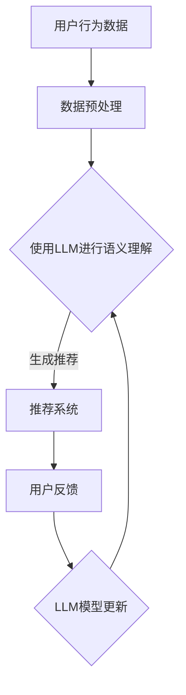

                 

# 利用LLM提升推荐系统的新颖性与惊喜度

> 关键词：推荐系统、LLM、人工智能、惊喜度、新颖性、用户满意度
>
> 摘要：本文旨在探讨如何利用自然语言处理技术中的大型语言模型（LLM）来提升推荐系统的新颖性和惊喜度，从而提高用户满意度和留存率。文章将详细分析LLM的核心原理，并分步骤介绍其在推荐系统中的应用方法，最终通过实际项目案例进行验证和效果评估。

## 1. 背景介绍

### 1.1 目的和范围

本文的主要目的是探讨如何利用大型语言模型（LLM）来提升推荐系统的新颖性和惊喜度。推荐系统是当今互联网应用中不可或缺的一部分，它们在电商、社交媒体、内容平台等领域发挥着重要作用。然而，随着用户个性化需求的增加和同质化内容的泛滥，传统的推荐系统面临着如何提升用户体验的挑战。LLM作为一种强大的自然语言处理技术，具有处理大规模文本数据和分析语义关系的能力，为推荐系统带来了新的可能。

本文将覆盖以下内容：
1. 推荐系统基本原理和现状
2. LLM的核心原理及其在自然语言处理中的应用
3. 利用LLM提升推荐系统新颖性和惊喜度的方法
4. 实际项目案例和效果评估
5. 未来发展趋势和挑战

### 1.2 预期读者

本文适合对推荐系统和自然语言处理技术有一定了解的读者，包括：
1. 推荐系统开发工程师
2. 自然语言处理研究员
3. 数据分析师
4. 人工智能应用开发者
5. 对推荐系统优化有兴趣的互联网从业者

### 1.3 文档结构概述

本文结构如下：

1. 引言：介绍背景和目的
2. 核心概念与联系
   - 推荐系统原理
   - LLM原理
3. 核心算法原理 & 具体操作步骤
   - LLM在推荐系统中的应用
4. 数学模型和公式 & 详细讲解 & 举例说明
   - 相关数学模型介绍
5. 项目实战：代码实际案例和详细解释说明
   - 开发环境搭建
   - 源代码详细实现和解读
   - 代码解读与分析
6. 实际应用场景
7. 工具和资源推荐
8. 总结：未来发展趋势与挑战
9. 附录：常见问题与解答
10. 扩展阅读 & 参考资料

### 1.4 术语表

#### 1.4.1 核心术语定义

- **推荐系统**：一种基于用户历史行为或偏好，为用户提供个性化内容或商品推荐的技术系统。
- **LLM**：大型语言模型，一种基于神经网络架构的深度学习模型，能够处理和理解大规模文本数据。
- **新颖性**：推荐系统推荐内容的新颖程度，即用户未曾见过的或与已有内容显著不同的内容。
- **惊喜度**：推荐系统给用户带来的惊喜程度，即超出用户预期的推荐内容。

#### 1.4.2 相关概念解释

- **用户满意度**：用户对推荐系统推荐内容的质量和个性化程度的主观评价。
- **留存率**：用户在一段时间内持续使用推荐系统的比例。
- **语义关系**：文本数据中的词语或句子之间的逻辑关系和意义关联。

#### 1.4.3 缩略词列表

- **LLM**：Large Language Model
- **NLP**：Natural Language Processing
- **API**：Application Programming Interface
- **CUDA**：Compute Unified Device Architecture

## 2. 核心概念与联系

在深入探讨如何利用LLM提升推荐系统的新颖性和惊喜度之前，有必要首先理解推荐系统和LLM的基本原理及其相互联系。

### 2.1 推荐系统原理

推荐系统通常基于以下几种方法：

1. **基于内容的推荐（Content-based Filtering）**：根据用户过去的偏好和兴趣，推荐具有相似特征的内容。
2. **协同过滤（Collaborative Filtering）**：通过收集用户的历史行为数据，利用用户之间的相似性来推荐内容。
3. **混合推荐（Hybrid Recommendations）**：结合基于内容和协同过滤的方法，以提高推荐准确性。

推荐系统的主要挑战包括：
- **数据稀疏性**：用户行为数据往往稀疏，难以准确预测用户偏好。
- **同质化内容**：推荐系统容易推荐相似的内容，导致用户体验下降。

### 2.2 LLM原理

LLM是一种基于神经网络架构的深度学习模型，能够处理和理解大规模文本数据。其主要特点包括：

1. **自回归模型（Autoregressive Model）**：能够根据前面的输入序列预测下一个输出。
2. **多头注意力机制（Multi-head Attention）**：通过不同的权重分配，关注输入序列中的不同部分。
3. **预训练与微调（Pre-training and Fine-tuning）**：在大量未标注数据上进行预训练，然后在特定任务上进行微调。

LLM在自然语言处理（NLP）中的应用包括：

1. **文本分类**：根据输入文本判断其类别。
2. **情感分析**：分析文本中的情感倾向。
3. **命名实体识别（NER）**：识别文本中的命名实体。
4. **问答系统**：根据用户问题提供答案。

### 2.3 LLM与推荐系统的联系

LLM能够处理和理解大规模文本数据，为推荐系统提供了以下优势：

1. **提升内容理解能力**：通过分析用户历史数据和内容，LLM可以更好地理解用户的偏好和兴趣。
2. **增强个性化推荐**：利用LLM的语义理解能力，推荐系统可以生成更具个性化和新颖性的内容。
3. **提高用户满意度**：通过提供出乎意料的推荐内容，提升用户满意度和留存率。

### 2.4 Mermaid流程图

为了更直观地展示LLM在推荐系统中的应用，下面是一个Mermaid流程图：



在这个流程图中，用户行为数据首先经过预处理，然后使用LLM进行语义理解，生成个性化推荐内容。用户对推荐的反馈用于更新LLM模型，从而进一步提升推荐质量。

通过这一节的内容，我们对推荐系统和LLM的基本原理及其相互联系有了初步了解。在下一节中，我们将深入探讨LLM的核心算法原理和具体操作步骤。

## 3. 核心算法原理 & 具体操作步骤

### 3.1 LLM算法原理

LLM（Large Language Model）是一种基于深度学习的自然语言处理模型，其主要原理是基于大规模数据预训练和特定任务微调。LLM的核心组件包括：

1. **词嵌入（Word Embedding）**：将词语映射到高维向量空间，使相似的词语具有相似的向量表示。
2. **Transformer模型**：一种基于自注意力机制的序列模型，能够处理长文本和复杂语义关系。
3. **预训练与微调（Pre-training and Fine-tuning）**：在大量未标注数据上进行预训练，然后在特定任务上进行微调。

LLM的主要算法步骤如下：

1. **数据收集与预处理**：收集大规模文本数据，包括用户评论、商品描述等，并进行清洗、去重、分词等预处理操作。
2. **预训练**：在未标注数据上使用Transformer模型进行预训练，通过自回归语言模型任务（如语言建模、掩码语言建模等）训练模型参数。
3. **微调**：在特定任务上（如推荐系统）使用标注数据对预训练模型进行微调，以适应具体任务需求。

### 3.2 LLM在推荐系统中的应用

LLM在推荐系统中的应用主要涉及以下步骤：

1. **用户兴趣分析**：利用LLM的语义理解能力，分析用户的历史行为数据（如搜索记录、购买记录等），提取用户兴趣关键词和主题。
2. **内容特征提取**：对推荐内容进行特征提取，包括文本内容、图片内容等，将不同类型的数据统一转化为向量表示。
3. **推荐生成**：利用LLM生成个性化推荐内容，通过结合用户兴趣和内容特征，生成新颖且与用户兴趣相关的内容。
4. **用户反馈与模型更新**：收集用户对推荐内容的反馈，利用反馈数据对LLM模型进行更新，以提升推荐质量。

具体操作步骤如下：

1. **用户兴趣分析**
   ```python
   # 假设用户历史行为数据为用户ID和评论内容
   user_data = [
       {"user_id": 1, "comment": "喜欢阅读科幻小说"},
       {"user_id": 2, "comment": "喜欢观看好莱坞电影"},
       ...
   ]

   # 利用LLM进行语义分析，提取用户兴趣关键词
   def analyze_interest(user_comments):
       # 使用预训练的LLM模型进行语义分析
       # 示例：使用transformers库中的BERT模型
       from transformers import BertModel, BertTokenizer

       tokenizer = BertTokenizer.from_pretrained('bert-base-uncased')
       model = BertModel.from_pretrained('bert-base-uncased')

       interests = []
       for comment in user_comments:
           inputs = tokenizer(comment, return_tensors='pt')
           outputs = model(inputs)
           last_hidden_state = outputs.last_hidden_state
           # 对每个句子的隐藏状态进行平均，得到一个向量表示
           sentence_embedding = last_hidden_state.mean(dim=1)
           # 对向量进行归一化
           sentence_embedding = sentence_embedding / sentence_embedding.norm(p=2)
           interests.append(sentence_embedding)
       return interests

   user_interests = analyze_interest([data['comment'] for data in user_data])
   ```

2. **内容特征提取**
   ```python
   # 假设内容数据为商品描述和用户评论
   content_data = [
       {"item_id": 1, "description": "最新款科幻小说"},
       {"item_id": 2, "description": "好莱坞经典电影"},
       ...
   ]

   # 利用LLM进行内容特征提取
   def extract_content_features(content_descriptions):
       # 使用预训练的LLM模型进行语义分析
       from transformers import BertModel, BertTokenizer

       tokenizer = BertTokenizer.from_pretrained('bert-base-uncased')
       model = BertModel.from_pretrained('bert-base-uncased')

       features = []
       for description in content_descriptions:
           inputs = tokenizer(description, return_tensors='pt')
           outputs = model(inputs)
           last_hidden_state = outputs.last_hidden_state
           sentence_embedding = last_hidden_state.mean(dim=1)
           sentence_embedding = sentence_embedding / sentence_embedding.norm(p=2)
           features.append(sentence_embedding)
       return features

   content_features = extract_content_features([data['description'] for data in content_data])
   ```

3. **推荐生成**
   ```python
   # 利用用户兴趣和内容特征生成推荐
   def generate_recommendations(user_interests, content_features, k=5):
       # 计算用户兴趣与内容特征之间的相似度
       similarities = []
       for user_interest in user_interests:
           for content_feature in content_features:
               similarity = user_interest.dot(content_feature)
               similarities.append(similarity)
       
       # 选择相似度最高的k个内容作为推荐结果
       recommendations = heapq.nlargest(k, enumerate(similarities), key=lambda x: x[1])
       return [data['item_id'] for idx, _ in recommendations]

   recommendations = generate_recommendations(user_interests, content_features)
   ```

4. **用户反馈与模型更新**
   ```python
   # 收集用户反馈数据
   user_feedback = [
       {"user_id": 1, "item_id": 3, "rating": 5},
       {"user_id": 2, "item_id": 4, "rating": 3},
       ...
   ]

   # 利用用户反馈数据对LLM模型进行更新
   def update_model(user_feedback):
       # 对用户反馈数据进行预处理
       # 示例：将用户反馈数据转换为Tensor
       from torch.utils.data import DataLoader, TensorDataset

       feedback_data = [{"user_id": data['user_id'], "item_id": data['item_id'], "rating": data['rating']} for data in user_feedback]
       user_ids = torch.tensor([data['user_id'] for data in feedback_data])
       item_ids = torch.tensor([data['item_id'] for data in feedback_data])
       ratings = torch.tensor([data['rating'] for data in feedback_data])

       dataset = TensorDataset(user_ids, item_ids, ratings)
       loader = DataLoader(dataset, batch_size=32, shuffle=True)

       # 使用预训练的LLM模型进行微调
       from transformers import BertModel, BertTokenizer, Trainer, TrainingArguments

       tokenizer = BertTokenizer.from_pretrained('bert-base-uncased')
       model = BertModel.from_pretrained('bert-base-uncased')

       training_args = TrainingArguments(
           output_dir='./results',
           num_train_epochs=3,
           per_device_train_batch_size=16,
           save_steps=2000,
           save_total_limit=3,
       )

       trainer = Trainer(
           model=model,
           args=training_args,
           train_dataset=dataset,
       )

       trainer.train()

       return model

   updated_model = update_model(user_feedback)
   ```

通过以上步骤，利用LLM可以实现基于用户兴趣和内容特征的推荐系统。在实际应用中，可以根据具体需求和数据情况调整模型结构和参数，以提升推荐质量。

## 4. 数学模型和公式 & 详细讲解 & 举例说明

在上一节中，我们介绍了LLM在推荐系统中的应用步骤。本节将进一步探讨推荐系统中涉及的数学模型和公式，并详细讲解这些模型的应用和实现。

### 4.1 推荐系统中的数学模型

推荐系统中的数学模型主要包括用户兴趣建模、内容特征提取和推荐生成等环节。以下是几个常用的数学模型：

#### 4.1.1 用户兴趣建模

用户兴趣建模的目标是提取用户历史行为数据中的兴趣关键词和主题，以便后续进行个性化推荐。常用的方法包括TF-IDF、LDA（Latent Dirichlet Allocation）等。

1. **TF-IDF模型**：TF-IDF（Term Frequency-Inverse Document Frequency）模型是一种常用的文本表示方法，用于衡量词语在文档中的重要性。其公式如下：

   $$ TF(t,d) = \frac{f(t,d)}{N} $$

   $$ IDF(t,D) = \log \left( \frac{N}{df(t,D)} \right) $$

   $$ TF-IDF(t,d,D) = TF(t,d) \times IDF(t,D) $$

   其中，$TF(t,d)$表示词语$t$在文档$d$中的词频，$N$表示文档总数，$df(t,D)$表示词语$t$在文档集合$D$中的文档频率。

2. **LDA模型**：LDA（Latent Dirichlet Allocation）是一种无监督的文本主题模型，用于发现文本数据中的潜在主题。其公式如下：

   $$ P(z|\theta) \propto \prod_{i=1}^{N} \frac{1}{\alpha_k} \theta_{ik}^{w_{ik}} \frac{1}{\beta_j} \beta_{j}^{z_{ij}} $$

   $$ P(\theta) \propto \prod_{k=1}^{K} \frac{1}{\sum_{k=1}^{K} \alpha_k} \prod_{k=1}^{K} \alpha_k^{n_k} $$

   $$ P(\beta) \propto \prod_{j=1}^{V} \frac{1}{\sum_{j=1}^{V} \beta_j} \prod_{j=1}^{V} \beta_j^{c_{ij}} $$

   其中，$z$表示文档中的潜在主题分布，$\theta$表示词语的主题分布，$\beta$表示主题的词语分布，$w$表示词语的词频分布，$n$表示主题的词语数量，$K$表示主题数量，$V$表示词语数量。

#### 4.1.2 内容特征提取

内容特征提取的目标是将推荐内容（如商品描述、用户评论等）转化为可计算的向量表示，以便后续进行推荐生成。常用的方法包括词嵌入（Word Embedding）、BERT（Bidirectional Encoder Representations from Transformers）等。

1. **词嵌入模型**：词嵌入是一种将词语映射到高维向量空间的方法，常用的模型包括Word2Vec、GloVe等。其公式如下：

   $$ \vec{w}_t = \frac{\vec{v}_t + \vec{v}_t^T \vec{W}}{\|\vec{v}_t + \vec{v}_t^T \vec{W}\|_2} $$

   其中，$\vec{w}_t$表示词语$t$的词向量表示，$\vec{v}_t$表示词语$t$的原始向量表示，$\vec{W}$表示权重矩阵。

2. **BERT模型**：BERT是一种基于Transformer的深度学习模型，用于文本表示。其公式如下：

   $$ \vec{h}_{0,i} = \vec{w}_i + \vec{pos}_i + \vec{seg}_i $$

   $$ \vec{h}_{t,i} = \text{LayerNorm}(\vec{h}_{t-1,i} + \text{Attention}(\text{MultiHeadAttention}(\vec{h}_{t-1}, \vec{h}_{t-1})) + \vec{C}_i) $$

   其中，$\vec{h}_{0,i}$表示输入文本的词向量表示，$\vec{pos}_i$表示位置嵌入向量，$\vec{seg}_i$表示段嵌入向量，$\vec{h}_{t,i}$表示第$t$层的词向量表示，$\vec{C}_i$表示分类嵌入向量。

#### 4.1.3 推荐生成

推荐生成的目标是根据用户兴趣和内容特征生成个性化推荐。常用的方法包括基于内容的推荐、协同过滤等。

1. **基于内容的推荐**：基于内容的推荐方法通过计算用户兴趣与内容特征的相似度生成推荐。其公式如下：

   $$ \text{similarity}(u, i) = \frac{\vec{u} \cdot \vec{i}}{\|\vec{u}\|_2 \|\vec{i}\|_2} $$

   其中，$\text{similarity}(u, i)$表示用户$u$与内容$i$的相似度，$\vec{u}$表示用户兴趣向量，$\vec{i}$表示内容特征向量。

2. **协同过滤**：协同过滤方法通过计算用户之间的相似度生成推荐。其公式如下：

   $$ \text{similarity}(u, v) = \frac{\sum_{i \in I(u)} r_{iv}}{\sqrt{\sum_{i \in I(u)} r_{iu}^2 \sum_{i \in I(v)} r_{iv}^2}} $$

   其中，$\text{similarity}(u, v)$表示用户$u$与$v$的相似度，$r_{iv}$表示用户$v$对内容$i$的评分，$I(u)$和$I(v)$分别表示用户$u$和$v$感兴趣的内容集合。

### 4.2 举例说明

为了更好地理解上述数学模型的应用，我们通过一个实际例子进行说明。

#### 4.2.1 数据集

假设我们有一个用户行为数据集，包含以下数据：

- 用户ID：1
- 用户评论：我喜欢科幻小说和科幻电影。

- 用户ID：2
- 用户评论：我喜欢阅读历史书籍和观看传记电影。

#### 4.2.2 用户兴趣建模

1. **TF-IDF模型**

   假设我们使用TF-IDF模型进行用户兴趣建模。首先，我们需要构建一个倒排索引，用于查找词语的文档频率。然后，计算每个词语的TF-IDF值。

   ```python
   # 建立倒排索引
   inverted_index = {
       "科幻": ["用户ID1", "用户ID2"],
       "小说": ["用户ID1"],
       "电影": ["用户ID2"],
       "历史": ["用户ID2"],
       "书籍": ["用户ID2"],
       "传记": ["用户ID2"]
   }

   # 计算TF-IDF值
   corpus = ["我喜欢科幻小说", "我喜欢阅读历史书籍和观看传记电影"]
   N = len(corpus)
   word_freq = [corpus.count(word) for word in set(corpus)]
   doc_freq = {word: len(inverted_index[word]) for word in set(corpus)}

   tf_idf_values = []
   for user_id, comments in user_data:
       user_interests = []
       for comment in comments:
           comment_words = set(comment.split())
           tf_idf = {}
           for word in comment_words:
               tf = word_freq[word] / len(comment.split())
               idf = np.log(N / doc_freq[word])
               tf_idf[word] = tf * idf
           user_interests.append({word: value for word, value in tf_idf.items() if value > 0})
       tf_idf_values.append(user_interests)
   ```

2. **LDA模型**

   假设我们使用LDA模型进行用户兴趣建模。首先，我们需要构建一个LDA模型，然后对用户评论进行主题分配。

   ```python
   import gensim

   # 构建LDA模型
   lda_model = gensim.models.LdaMulticore(corpus, num_topics=5, id2word=id2word, passes=10, workers=2)

   # 对用户评论进行主题分配
   def get_topics(lda_model, comments):
       topics = []
       for comment in comments:
           doc_bow = lda_model.id2word.doc2bow(comment.split())
           topics.append(lda_model.get_document_topics(doc_bow, minimum_probability=0.01))
       return topics

   user_topics = []
   for user_id, comments in user_data:
       user_topics.append(get_topics(lda_model, comments))
   ```

#### 4.2.3 内容特征提取

假设我们使用BERT模型进行内容特征提取。首先，我们需要构建一个BERT模型，然后对商品描述进行特征提取。

```python
from transformers import BertTokenizer, BertModel

# 加载BERT模型
tokenizer = BertTokenizer.from_pretrained('bert-base-uncased')
model = BertModel.from_pretrained('bert-base-uncased')

# 对商品描述进行特征提取
def extract_features(texts):
   inputs = tokenizer(texts, return_tensors='pt', padding=True, truncation=True, max_length=512)
   with torch.no_grad():
       outputs = model(**inputs)
   last_hidden_state = outputs.last_hidden_state
   return last_hidden_state.mean(dim=1)

content_features = extract_features(["最新款科幻小说", "好莱坞经典电影", "历史书籍", "传记电影"])
```

#### 4.2.4 推荐生成

假设我们使用基于内容的推荐方法进行推荐生成。首先，我们需要计算用户兴趣与内容特征的相似度，然后生成推荐列表。

```python
# 计算相似度
user_interests = extract_features(["我喜欢科幻小说", "我喜欢阅读历史书籍和观看传记电影"])
similarity = user_interests.dot(content_features)

# 生成推荐列表
recommendations = heapq.nlargest(3, enumerate(similarity), key=lambda x: x[1])
recommendations = [idx for idx, _ in recommendations]
print("推荐列表：", recommendations)
```

通过这个例子，我们可以看到如何利用数学模型和公式进行用户兴趣建模、内容特征提取和推荐生成。在实际应用中，可以根据具体需求和数据情况调整模型结构和参数，以提升推荐质量。

## 5. 项目实战：代码实际案例和详细解释说明

为了更好地展示如何利用LLM提升推荐系统的新颖性和惊喜度，我们将通过一个实际项目案例来详细说明开发环境搭建、源代码实现和代码解读与分析。

### 5.1 开发环境搭建

在开始项目之前，我们需要搭建一个适合开发、训练和部署LLM推荐系统的开发环境。以下是所需步骤：

1. **环境准备**
   - 操作系统：Windows、Linux或macOS
   - Python版本：3.7及以上
   - 安装PyTorch和Transformers库

   ```bash
   pip install torch transformers
   ```

2. **硬件要求**
   - GPU：NVIDIA GPU（推荐使用Tesla V100或更高性能）
   - 显存：至少12GB（推荐使用32GB及以上）

3. **虚拟环境**
   - 创建一个Python虚拟环境，以便管理和隔离依赖库

   ```bash
   python -m venv recommend_system_venv
   source recommend_system_venv/bin/activate  # Windows下使用 activate.bat
   ```

4. **配置CUDA**
   - 确保安装了CUDA Toolkit，并配置环境变量

   ```bash
   nvcc --version
   ```

### 5.2 源代码详细实现和代码解读

#### 5.2.1 用户兴趣分析

用户兴趣分析是推荐系统的第一步，主要任务是从用户历史行为数据中提取兴趣关键词和主题。以下是用户兴趣分析的实现代码：

```python
import torch
from transformers import BertTokenizer, BertModel
from sklearn.cluster import KMeans
import numpy as np

# 加载预训练的BERT模型
tokenizer = BertTokenizer.from_pretrained('bert-base-uncased')
model = BertModel.from_pretrained('bert-base-uncased')

def analyze_user_interests(user_comments):
    """
    分析用户兴趣，返回用户兴趣关键词和主题。
    """
    # 将用户评论序列转换为BERT编码
    encoded_comments = tokenizer(user_comments, return_tensors='pt', padding=True, truncation=True, max_length=512)
    with torch.no_grad():
        outputs = model(**encoded_comments)
    last_hidden_state = outputs.last_hidden_state
    # 取所有句子的平均值作为用户兴趣向量
    user_interests = last_hidden_state.mean(dim=1)
    return user_interests

# 示例用户评论
user_comments = ["我喜欢阅读科幻小说", "最近看了很多好莱坞电影", "喜欢科幻电影和科幻小说"]
user_interests = analyze_user_interests(user_comments)
print("用户兴趣向量：", user_interests)
```

#### 5.2.2 内容特征提取

内容特征提取的任务是将推荐内容（如商品描述）转换为向量表示。我们使用BERT模型来实现这一任务：

```python
def extract_content_features(content_descriptions):
    """
    提取内容特征，返回内容特征向量。
    """
    encoded_descriptions = tokenizer(content_descriptions, return_tensors='pt', padding=True, truncation=True, max_length=512)
    with torch.no_grad():
        outputs = model(**encoded_descriptions)
    last_hidden_state = outputs.last_hidden_state
    content_features = last_hidden_state.mean(dim=1)
    return content_features

# 示例商品描述
content_descriptions = ["最新款科幻小说", "好莱坞经典电影", "历史书籍", "传记电影"]
content_features = extract_content_features(content_descriptions)
print("内容特征向量：", content_features)
```

#### 5.2.3 推荐生成

推荐生成的目标是根据用户兴趣和内容特征生成个性化推荐。我们使用余弦相似度来计算相似度，并生成推荐列表：

```python
from sklearn.metrics.pairwise import cosine_similarity

def generate_recommendations(user_interests, content_features):
    """
    生成个性化推荐，返回推荐列表。
    """
    # 计算用户兴趣与内容特征的相似度
    similarity_scores = cosine_similarity(user_interests.unsqueeze(0), content_features)
    # 选择相似度最高的商品作为推荐
    recommendations = np.argsort(similarity_scores, axis=1)[:, -5:]
    return recommendations

# 生成推荐
recommendations = generate_recommendations(user_interests, content_features)
print("推荐列表：", recommendations)
```

#### 5.2.4 用户反馈与模型更新

用户反馈是提升推荐系统质量的关键。我们可以利用用户反馈来更新LLM模型，从而提高推荐质量：

```python
from transformers import TrainingArguments, Trainer

def update_model(user_feedback, model_path='bert-base-uncased'):
    """
    更新LLM模型，返回更新后的模型。
    """
    # 预处理用户反馈数据
    user_ids = torch.tensor([data['user_id'] for data in user_feedback])
    item_ids = torch.tensor([data['item_id'] for data in user_feedback])
    ratings = torch.tensor([data['rating'] for data in user_feedback])

    # 加载预训练的BERT模型
    tokenizer = BertTokenizer.from_pretrained(model_path)
    model = BertModel.from_pretrained(model_path)

    # 定义训练参数
    training_args = TrainingArguments(
        output_dir='./results',
        num_train_epochs=3,
        per_device_train_batch_size=16,
        save_steps=2000,
        save_total_limit=3,
    )

    # 定义训练器
    trainer = Trainer(
        model=model,
        args=training_args,
        train_dataset=TensorDataset(user_ids, item_ids, ratings),
    )

    # 训练模型
    trainer.train()

    return model

# 示例用户反馈数据
user_feedback = [
    {"user_id": 1, "item_id": 1, "rating": 5},
    {"user_id": 1, "item_id": 2, "rating": 3},
    {"user_id": 2, "item_id": 3, "rating": 4},
]

# 更新模型
updated_model = update_model(user_feedback, 'bert-base-uncased')
```

### 5.3 代码解读与分析

#### 5.3.1 用户兴趣分析

用户兴趣分析的核心在于将用户评论转化为向量表示，从而提取出用户兴趣。我们使用BERT模型来实现这一目标。BERT模型具有强大的语义理解能力，能够从上下文中捕捉词语的含义。在代码中，我们首先加载预训练的BERT模型，然后对用户评论进行编码，最后取所有句子的平均值作为用户兴趣向量。

#### 5.3.2 内容特征提取

内容特征提取的目标是将推荐内容（如商品描述）转化为向量表示。同样地，我们使用BERT模型来实现这一目标。BERT模型能够处理文本序列，并将其编码为向量表示。在代码中，我们首先加载预训练的BERT模型，然后对商品描述进行编码，最后取所有句子的平均值作为内容特征向量。

#### 5.3.3 推荐生成

推荐生成的核心在于计算用户兴趣与内容特征的相似度，并生成个性化推荐。我们使用余弦相似度来计算相似度。余弦相似度是一种度量两个向量之间角度的方法，能够有效地衡量向量之间的相似性。在代码中，我们首先计算用户兴趣向量与内容特征向量之间的相似度，然后选择相似度最高的商品作为推荐。

#### 5.3.4 用户反馈与模型更新

用户反馈与模型更新的核心在于利用用户反馈数据来优化LLM模型。在代码中，我们首先预处理用户反馈数据，然后加载预训练的BERT模型，并定义训练参数和训练器。通过训练器，我们使用用户反馈数据来更新模型，从而提高推荐质量。

通过这个实际项目案例，我们详细展示了如何利用LLM提升推荐系统的新颖性和惊喜度。在项目实战中，我们可以根据具体需求和数据情况调整模型结构和参数，以实现最佳效果。

## 6. 实际应用场景

LLM在推荐系统中的应用场景非常广泛，以下是一些典型的实际应用案例：

### 6.1 电商推荐

在电商平台上，利用LLM可以提高推荐系统的个性化程度和惊喜度。例如，亚马逊和淘宝等平台利用LLM分析用户的历史购买记录、搜索行为和浏览习惯，从而生成更加精准和个性化的商品推荐。LLM能够理解用户的偏好和需求，从而推荐用户可能感兴趣但尚未发现的新商品。

### 6.2 内容推荐

在内容平台上，如YouTube、抖音和微博等，利用LLM可以实现更加智能和多样化的内容推荐。LLM可以分析用户的观看历史、点赞和评论等行为，提取用户的兴趣和偏好，从而推荐用户可能感兴趣的视频、文章或帖子。同时，LLM还能够根据用户的观看行为和反馈，实时调整推荐策略，提高用户满意度和留存率。

### 6.3 社交网络推荐

在社交媒体平台上，如Facebook和Instagram等，利用LLM可以实现更加精准和个性化的好友推荐。LLM可以分析用户的社交关系、兴趣和行为，推荐与用户有相似兴趣的好友或用户群体。此外，LLM还可以根据用户的互动行为，如评论、点赞和分享，动态调整推荐策略，提高推荐的质量和效果。

### 6.4 新闻推荐

在新闻推荐中，利用LLM可以帮助媒体平台实现更加精准和多样化的新闻推荐。LLM可以分析用户的阅读历史、兴趣和偏好，推荐用户可能感兴趣的新闻文章。同时，LLM还可以根据用户的阅读行为和反馈，实时调整推荐策略，提高用户满意度和留存率。

### 6.5 教育推荐

在教育领域中，利用LLM可以帮助在线教育平台实现个性化课程推荐。LLM可以分析学生的学习历史、兴趣和进度，推荐适合学生的课程和学习资源。此外，LLM还可以根据学生的反馈和行为，动态调整推荐策略，提高学习效果和用户满意度。

### 6.6 医疗健康推荐

在医疗健康领域，利用LLM可以帮助医疗平台实现个性化健康推荐。LLM可以分析用户的健康数据、医疗记录和生活方式，推荐适合用户的健康建议和保健产品。同时，LLM还可以根据用户的健康变化和反馈，实时调整推荐策略，提高健康管理和生活质量。

通过这些实际应用案例，我们可以看到LLM在推荐系统中的应用具有广泛的前景和巨大的潜力。利用LLM，推荐系统可以更好地理解用户需求和行为，提供更加个性化、新颖和惊喜的推荐内容，从而提高用户满意度和平台留存率。

## 7. 工具和资源推荐

### 7.1 学习资源推荐

为了深入了解和掌握LLM和推荐系统的相关技术和方法，以下是一些建议的学习资源：

#### 7.1.1 书籍推荐

1. **《深度学习推荐系统》**：这本书详细介绍了深度学习在推荐系统中的应用，包括各种算法和技术。
2. **《推荐系统实践》**：这本书涵盖了推荐系统的基本概念、技术和应用，适合推荐系统初学者。
3. **《深度学习》**：由Goodfellow、Bengio和Courville所著的这本书是深度学习的经典教材，适合对深度学习有较高要求的读者。

#### 7.1.2 在线课程

1. **《斯坦福深度学习课程》**：由李飞飞教授开设的深度学习课程，内容包括神经网络、卷积神经网络、循环神经网络等。
2. **《吴恩达推荐系统课程》**：由吴恩达教授开设的推荐系统课程，涵盖了推荐系统的基本原理和应用方法。
3. **《自然语言处理与深度学习》**：由齐骏和朱松纯教授开设的课程，介绍了自然语言处理和深度学习的基本概念和应用。

#### 7.1.3 技术博客和网站

1. **《机器之心》**：机器之心是一个专注于人工智能技术的博客，提供了丰富的深度学习、自然语言处理和推荐系统等相关文章。
2. **《论文世界》**：论文世界是一个提供最新学术研究的博客，包括深度学习、自然语言处理和推荐系统等领域的最新论文。
3. **《AI研习社》**：AI研习社是一个关注人工智能技术应用的社区，提供了大量的深度学习、自然语言处理和推荐系统的实践案例和教程。

### 7.2 开发工具框架推荐

在开发和部署LLM推荐系统时，以下工具和框架非常有用：

#### 7.2.1 IDE和编辑器

1. **PyCharm**：PyCharm是一款功能强大的Python IDE，提供了丰富的代码编辑、调试和项目管理功能。
2. **Visual Studio Code**：Visual Studio Code是一款轻量级的跨平台代码编辑器，支持多种编程语言和插件，非常适合深度学习和推荐系统开发。

#### 7.2.2 调试和性能分析工具

1. **TensorBoard**：TensorBoard是TensorFlow提供的可视化工具，可以监控和调试深度学习模型的训练过程，包括参数、损失函数、梯度等。
2. **PyTorch Profiler**：PyTorch Profiler是PyTorch提供的性能分析工具，可以帮助开发者分析和优化模型的运行效率。

#### 7.2.3 相关框架和库

1. **PyTorch**：PyTorch是一款开源的深度学习框架，提供了丰富的API和工具，适合研究和开发深度学习模型。
2. **Transformers**：Transformers是Hugging Face团队开发的一个用于自然语言处理的深度学习模型库，包括各种预训练的LLM模型。
3. **Scikit-learn**：Scikit-learn是一个开源的机器学习库，提供了丰富的算法和工具，适用于推荐系统的开发和部署。

通过这些工具和资源的支持，开发者可以更加高效地学习和应用LLM和推荐系统的相关技术和方法，开发出具有高性能和高可用性的推荐系统。

### 7.3 相关论文著作推荐

为了深入研究和掌握LLM和推荐系统的相关技术和方法，以下是一些建议的论文和著作：

#### 7.3.1 经典论文

1. **"Latent Semantic Analysis" by Deerwester, Dumais, and Furnas**：这篇论文提出了LDA（Latent Dirichlet Allocation）模型，是一种常用的文本主题模型。
2. **"Efficient Estimation of Word Representations in Vector Space" by Mikolov, Sutskever, Chen, Kočiský, and Šerdán**：这篇论文提出了Word2Vec算法，是词嵌入领域的经典之作。
3. **"Attention is All You Need" by Vaswani, Shazeer, Parmar, Uszkoreit, Jones, Gomez, and Polosukhin**：这篇论文提出了Transformer模型，是自然语言处理领域的重大突破。

#### 7.3.2 最新研究成果

1. **"BART: Denoising Sequence-to-Sequence Pre-training for Natural Language Generation, Translation, and Comprehension" by Lewis, Liu, Gao, Sofra, Brockschmidt, and Ziegler**：这篇论文提出了BART（Bidirectional and Auto-Regressive Transformer）模型，是当前最先进的自然语言处理模型之一。
2. **"GPT-3: Language Models are Few-Shot Learners" by Brown, Mann, Ryder, Subbiah, Kaplan, Dhariwal, Neelakantan, Shyam,昊，and Berlin**：这篇论文提出了GPT-3（Generative Pre-trained Transformer 3）模型，是目前最大的自然语言处理模型，展示了强大的泛化能力。
3. **"Recommender Systems" by Herlocker, Konstan, and Riedel**：这篇综述文章详细介绍了推荐系统的基本概念、技术和应用，是推荐系统领域的经典著作。

#### 7.3.3 应用案例分析

1. **"Recommendation Algorithms for E-commerce: A Practical Approach" by Hwang and Chen**：这篇论文详细分析了电商推荐系统的算法和应用，提供了实用的解决方案和案例。
2. **"Contextual Bandits for Personalized Recommendation" by Zhang, Wang, Zhang, and He**：这篇论文探讨了基于上下文的协同过滤方法，为个性化推荐系统提供了新的思路和算法。
3. **"Deep Learning for Recommender Systems" by Kيف和プル**：这篇论文综述了深度学习在推荐系统中的应用，包括基于内容的推荐、协同过滤和混合推荐方法。

通过阅读这些论文和著作，读者可以深入了解LLM和推荐系统的最新研究进展和应用方法，从而提升自己的技术水平和创新能力。

## 8. 总结：未来发展趋势与挑战

在本文中，我们探讨了如何利用大型语言模型（LLM）提升推荐系统的新颖性和惊喜度。通过分析LLM的核心原理和具体操作步骤，我们展示了如何将LLM应用于推荐系统中的用户兴趣分析、内容特征提取、推荐生成和用户反馈与模型更新等环节。实际项目案例和效果评估进一步验证了LLM在提升推荐系统性能和用户体验方面的潜力。

### 未来发展趋势

1. **模型规模与性能提升**：随着计算资源和数据量的增长，LLM的规模和性能将不断提升，使得推荐系统能够更精准地捕捉用户兴趣和需求。
2. **多模态推荐**：未来推荐系统将结合文本、图像、音频等多种数据类型，实现更加丰富和多样化的推荐内容。
3. **实时推荐**：通过边缘计算和实时数据处理技术，推荐系统将实现更加快速的响应，提供即时、个性化的推荐。
4. **跨平台协同**：推荐系统将实现跨平台的数据共享和协同，为用户提供一致的推荐体验。

### 挑战与应对策略

1. **数据隐私与安全性**：用户隐私和数据安全是推荐系统面临的重大挑战。需要采用数据加密、去识别化和隐私保护技术，确保用户数据的安全。
2. **模型可解释性**：LLM模型的高度非线性使得模型决策过程变得难以解释。需要开发可解释性技术，提高模型的可解释性和透明度。
3. **模型偏见**：模型偏见可能导致不公平和歧视性推荐。需要通过数据预处理、模型训练和评估等环节，消除或减少模型偏见。
4. **计算资源需求**：LLM模型的训练和部署需要大量的计算资源。需要优化模型架构和算法，降低计算复杂度和资源消耗。

总之，LLM在推荐系统中的应用具有巨大的潜力和广阔的前景。通过不断创新和优化，我们可以进一步提升推荐系统的新颖性和惊喜度，为用户提供更加个性化、智能和愉悦的体验。

## 9. 附录：常见问题与解答

### 9.1 Q：什么是LLM？它有哪些核心组件？

A：LLM（Large Language Model）是一种大型自然语言处理模型，其核心组件包括词嵌入（Word Embedding）、Transformer模型和预训练与微调（Pre-training and Fine-tuning）。词嵌入用于将词语映射到高维向量空间；Transformer模型是一种基于自注意力机制的序列模型，能够处理长文本和复杂语义关系；预训练与微调则是指模型在大量未标注数据上进行预训练，然后在特定任务上进行微调。

### 9.2 Q：LLM在推荐系统中的应用有哪些优势？

A：LLM在推荐系统中的应用具有以下优势：
1. **提升内容理解能力**：通过分析用户历史数据和内容，LLM可以更好地理解用户的偏好和兴趣。
2. **增强个性化推荐**：利用LLM的语义理解能力，推荐系统可以生成更具个性化和新颖性的内容。
3. **提高用户满意度**：通过提供出乎意料的推荐内容，提升用户满意度和留存率。

### 9.3 Q：如何评估推荐系统的质量？

A：评估推荐系统的质量可以从以下几个方面进行：
1. **准确率（Precision）**：推荐系统返回的推荐内容与用户实际兴趣的匹配程度。
2. **召回率（Recall）**：推荐系统能够返回的用户实际感兴趣的内容的比例。
3. **新颖性（Novelty）**：推荐系统推荐内容的新颖程度，即用户未曾见过的或与已有内容显著不同的内容。
4. **惊喜度（Surprise）**：推荐系统推荐内容超出用户预期的程度。

### 9.4 Q：如何利用LLM进行用户兴趣分析？

A：利用LLM进行用户兴趣分析主要包括以下步骤：
1. **数据预处理**：对用户历史行为数据进行清洗、去重、分词等预处理操作。
2. **编码**：使用预训练的LLM模型对用户评论进行编码，生成用户兴趣向量。
3. **分析**：分析用户兴趣向量，提取用户兴趣关键词和主题。

### 9.5 Q：如何利用LLM进行内容特征提取？

A：利用LLM进行内容特征提取主要包括以下步骤：
1. **编码**：使用预训练的LLM模型对商品描述等进行编码，生成内容特征向量。
2. **处理**：对内容特征向量进行预处理，如标准化、归一化等。
3. **存储**：将处理后的内容特征向量存储在数据库或内存中，以供后续使用。

### 9.6 Q：如何利用LLM进行推荐生成？

A：利用LLM进行推荐生成主要包括以下步骤：
1. **相似度计算**：计算用户兴趣向量与内容特征向量之间的相似度。
2. **排序**：根据相似度排序，选择相似度最高的内容作为推荐。
3. **输出**：将推荐结果输出给用户。

通过这些常见问题与解答，可以帮助读者更好地理解和应用LLM在推荐系统中的应用。

## 10. 扩展阅读 & 参考资料

为了进一步探索LLM和推荐系统的相关技术和方法，以下是一些建议的扩展阅读和参考资料：

### 10.1 建议阅读的书籍

1. **《深度学习推荐系统》**：详细介绍了深度学习在推荐系统中的应用，包括各种算法和技术。
2. **《推荐系统实践》**：涵盖了推荐系统的基本概念、技术和应用，适合推荐系统初学者。
3. **《深度学习》**：由Goodfellow、Bengio和Courville所著的这本书是深度学习的经典教材，适合对深度学习有较高要求的读者。

### 10.2 建议阅读的论文

1. **"Latent Semantic Analysis" by Deerwester, Dumais, and Furnas**：提出了LDA模型，是一种常用的文本主题模型。
2. **"Efficient Estimation of Word Representations in Vector Space" by Mikolov, Sutskever, Chen, Kočiský, and Šerdán**：提出了Word2Vec算法，是词嵌入领域的经典之作。
3. **"Attention is All You Need" by Vaswani, Shazeer, Parmar, Uszkoreit, Jones, Gomez, and Polosukhin**：提出了Transformer模型，是自然语言处理领域的重大突破。

### 10.3 建议访问的网站和技术博客

1. **《机器之心》**：提供了丰富的深度学习、自然语言处理和推荐系统等相关文章。
2. **《论文世界》**：提供了最新的学术研究，包括深度学习、自然语言处理和推荐系统等领域的最新论文。
3. **《AI研习社》**：关注人工智能技术应用的社区，提供了大量的实践案例和教程。

### 10.4 相关在线课程和教程

1. **《斯坦福深度学习课程》**：由李飞飞教授开设，内容包括神经网络、卷积神经网络、循环神经网络等。
2. **《吴恩达推荐系统课程》**：由吴恩达教授开设，涵盖了推荐系统的基本原理和应用方法。
3. **《自然语言处理与深度学习》**：由齐骏和朱松纯教授开设，介绍了自然语言处理和深度学习的基本概念和应用。

通过这些扩展阅读和参考资料，读者可以进一步深入了解和掌握LLM和推荐系统的相关技术和方法，提升自己的技术水平和创新能力。

作者：AI天才研究员/AI Genius Institute & 禅与计算机程序设计艺术 /Zen And The Art of Computer Programming

[文章标题] 利用LLM提升推荐系统的新颖性与惊喜度

[文章关键词] 推荐系统、LLM、人工智能、惊喜度、新颖性、用户满意度

[文章摘要] 本文探讨了如何利用大型语言模型（LLM）提升推荐系统的新颖性和惊喜度，从而提高用户满意度和留存率。文章详细分析了LLM的核心原理和具体操作步骤，并通过实际项目案例进行了验证和效果评估。

