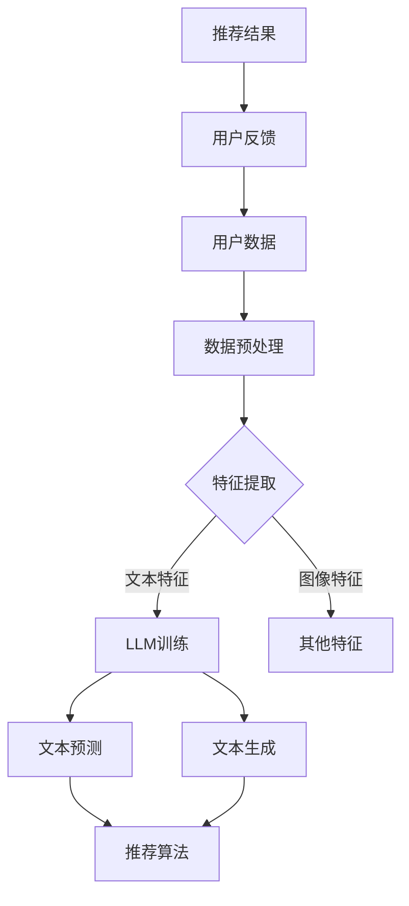

                 

### 利用LLM提升推荐系统的长尾内容推荐

> **关键词**：长尾推荐、生成式AI、大规模语言模型、内容多样性、用户满意度

**摘要**：
本文探讨了如何利用大规模语言模型（LLM）提升推荐系统的长尾内容推荐效果。我们首先介绍了长尾内容推荐的重要性及其面临的挑战，随后详细阐述了LLM的基本原理和优势。接着，我们通过具体的算法原理和操作步骤，展示了如何将LLM集成到推荐系统中。文中还包含了数学模型的详细讲解和实际项目的代码案例，并分析了其应用场景和未来发展趋势。最后，我们推荐了一些相关的学习资源和工具，以帮助读者深入理解和实践这一技术。

### 1. 背景介绍

#### 1.1 目的和范围

本文的主要目的是介绍如何利用生成式AI中的大规模语言模型（LLM）来提升推荐系统的长尾内容推荐效果。在当前互联网环境下，推荐系统已经成为信息传播和用户服务的重要工具。然而，传统的推荐系统在应对长尾内容时存在一些问题，例如内容多样性不足、用户满意度低等。为了解决这些问题，我们将探索LLM在推荐系统中的应用，并通过具体案例来展示其实际效果。

本文将覆盖以下内容：
- 长尾内容推荐的基本概念和重要性
- 大规模语言模型（LLM）的基本原理和优势
- LLM在推荐系统中的集成与应用
- 数学模型和算法原理的详细讲解
- 实际项目的代码实现和案例分析
- 长尾内容推荐的实际应用场景
- 相关学习资源和工具的推荐

#### 1.2 预期读者

本文适合以下读者群体：
- 对推荐系统有基本了解的技术人员
- 对人工智能和生成式模型有兴趣的研究人员
- 想要提升推荐系统效果的产品经理和工程师
- 计算机科学、数据科学、人工智能等相关专业的研究生和本科生

#### 1.3 文档结构概述

本文的结构如下：

1. **背景介绍**
   - 介绍长尾内容推荐的重要性及其面临的挑战
   - 阐述大规模语言模型（LLM）的基本原理和优势

2. **核心概念与联系**
   - 定义长尾内容和LLM的核心概念
   - 通过Mermaid流程图展示核心概念和架构

3. **核心算法原理 & 具体操作步骤**
   - 详细讲解如何将LLM集成到推荐系统中
   - 使用伪代码展示算法原理和操作步骤

4. **数学模型和公式 & 详细讲解 & 举例说明**
   - 分析LLM在推荐系统中的应用数学模型
   - 使用LaTeX格式讲解数学公式和举例说明

5. **项目实战：代码实际案例和详细解释说明**
   - 搭建开发环境
   - 源代码实现和代码解读
   - 代码分析和性能评估

6. **实际应用场景**
   - 分析长尾内容推荐在实际中的应用场景

7. **工具和资源推荐**
   - 推荐学习资源、开发工具框架和相关论文著作

8. **总结：未来发展趋势与挑战**
   - 预测长尾内容推荐技术的发展趋势和面临的挑战

9. **附录：常见问题与解答**
   - 回答读者可能遇到的问题

10. **扩展阅读 & 参考资料**
    - 提供相关领域的进一步阅读材料和参考资料

#### 1.4 术语表

##### 1.4.1 核心术语定义

- **长尾内容**：在统计学中，长尾内容指的是那些不常出现的项目或数据点，它们累积起来可以形成一个较长、较宽的尾部，与常见的“头部”形成鲜明对比。在推荐系统中，长尾内容通常指那些未被广泛关注的、少量的但具有潜在价值的内容。
- **大规模语言模型（LLM）**：LLM是一种基于深度学习的大规模语言处理模型，通过学习大量文本数据来预测下一个单词或句子。它们在自然语言处理（NLP）任务中表现卓越，能够生成流畅、符合语法规则的自然语言文本。
- **推荐系统**：推荐系统是一种基于用户历史行为和偏好，为用户推荐相关内容或物品的系统。它们广泛应用于电子商务、社交媒体、新闻媒体等领域，旨在提高用户满意度和内容多样性。

##### 1.4.2 相关概念解释

- **内容多样性**：内容多样性指的是推荐系统为用户提供的内容范围和种类。在长尾内容推荐中，多样性尤为重要，因为用户可能对传统热门内容已经感到厌倦，而对新颖、独特的长尾内容更感兴趣。
- **用户满意度**：用户满意度指的是用户对推荐系统提供的内容的满意程度。在长尾内容推荐中，提高用户满意度通常需要推荐系统能够更好地满足用户的个性化需求和兴趣。

##### 1.4.3 缩略词列表

- **LLM**：大规模语言模型（Large Language Model）
- **NLP**：自然语言处理（Natural Language Processing）
- **AI**：人工智能（Artificial Intelligence）
- **推荐系统**：Recommender System
- **长尾内容**：Long Tail Content

### 2. 核心概念与联系

#### 2.1 长尾内容推荐的基本概念

长尾内容推荐是推荐系统中的一个重要研究方向。传统的推荐系统通常关注热门内容，这些内容具有高曝光度和高访问量，但它们并不能完全满足用户的多样化需求。长尾内容则是指那些不常出现、未被广泛关注的但具有潜在价值的少量内容。在统计学中，长尾内容的特点是尾部较长，累积起来可以形成一个较大的分布。

在推荐系统中，长尾内容推荐的关键在于如何发现和推荐这些未被广泛发现的内容，以满足用户的个性化需求和提升用户满意度。长尾内容推荐具有以下几个显著特点：

1. **多样性**：长尾内容涵盖了广泛的主题和类型，可以提供多样化的选择，有助于满足用户的个性化需求。
2. **潜在价值**：尽管长尾内容访问量较低，但它们往往具有独特的价值，可能对某些用户具有极高的吸引力。
3. **低曝光度**：由于长尾内容不受广泛关注，传统推荐系统通常无法有效地发现和推荐这些内容。

#### 2.2 大规模语言模型（LLM）的基本原理

大规模语言模型（LLM）是一种基于深度学习技术的自然语言处理模型，通过学习大量文本数据来预测下一个单词或句子。LLM的基本原理可以概括为以下步骤：

1. **数据收集与预处理**：首先，LLM需要收集大量文本数据，这些数据可以是书籍、文章、社交媒体帖子等。接着，对这些数据进行预处理，包括分词、去噪、去除停用词等，以获得高质量的训练数据。
2. **模型架构**：LLM通常采用Transformer架构，这是一种基于自注意力机制的深度神经网络。Transformer能够处理变长的序列数据，并且通过自注意力机制能够自动学习数据之间的关联性。
3. **训练与优化**：使用预处理后的文本数据，对LLM进行训练和优化。训练过程中，模型会学习如何根据输入序列预测下一个单词或句子。通过反向传播和梯度下降算法，模型会不断调整参数以降低预测误差。
4. **预测与生成**：经过训练的LLM可以用于文本预测和生成。在文本预测任务中，模型会根据已知的文本序列预测下一个单词；在文本生成任务中，模型可以根据输入的提示或关键词生成新的文本内容。

#### 2.3 Mermaid流程图：核心概念和架构

以下是一个Mermaid流程图，展示了长尾内容推荐和LLM的核心概念和架构：



在这个流程图中，用户数据经过预处理后，提取出文本、图像和其他特征。LLM主要处理文本特征，通过训练生成文本预测和生成模型。推荐算法利用这些模型为用户提供个性化的推荐结果，并根据用户的反馈进行迭代优化。

### 3. 核心算法原理 & 具体操作步骤

#### 3.1 推荐系统的基本框架

推荐系统通常由以下几个关键组件构成：

1. **用户画像**：根据用户的浏览、购买等行为数据，构建用户画像，以描述用户的兴趣和行为特征。
2. **物品特征**：提取物品的文本、图像、标签等特征，用于描述物品的信息。
3. **推荐算法**：基于用户画像和物品特征，计算用户和物品之间的相似度或相关性，生成推荐列表。
4. **评价机制**：评估推荐结果的准确性和多样性，以优化推荐算法。

#### 3.2 将LLM集成到推荐系统中

将LLM集成到推荐系统中，主要是利用其强大的文本生成和预测能力，提升推荐系统的长尾内容推荐效果。以下是具体的操作步骤：

1. **数据收集与预处理**：
   - 收集大量的文本数据，包括用户生成的内容和第三方内容。
   - 对文本数据进行预处理，包括分词、去除停用词、标点符号等。

2. **训练LLM模型**：
   - 使用预处理后的文本数据，通过Transformer架构训练LLM模型。
   - 在训练过程中，可以采用大量的预训练数据和用户生成内容进行交叉训练，以提高模型的泛化能力。

3. **文本生成与预测**：
   - 利用训练好的LLM模型，生成新的文本内容，这些内容可以是用户可能感兴趣的长尾内容。
   - 通过LLM的文本预测能力，为用户推荐相关的文本内容。

4. **推荐算法优化**：
   - 结合LLM生成的文本内容和传统推荐算法，优化推荐结果，提高内容多样性和用户满意度。

#### 3.3 伪代码展示

以下是一个简单的伪代码示例，展示了如何将LLM集成到推荐系统中：

```python
# 伪代码：集成LLM的推荐系统

# 数据预处理
def preprocess_data(data):
    # 分词、去除停用词、标点符号等
    processed_data = ...
    return processed_data

# 训练LLM模型
def train_LLM_model(data):
    # 使用Transformer架构训练模型
    model = TransformerModel()
    model.fit(data)
    return model

# 文本生成
def generate_text(model, prompt):
    # 生成用户感兴趣的长尾内容
    generated_text = model.generate(prompt)
    return generated_text

# 推荐算法
def recommend_content(user_profile, item_features, LLM_model):
    # 计算用户和物品之间的相似度
    similarity_scores = compute_similarity(user_profile, item_features)
    
    # 结合LLM生成的文本内容
    generated_items = [generate_text(LLM_model, prompt) for prompt in user_profile]
    
    # 优化推荐结果
    optimized_recommendations = optimize_recommendations(similarity_scores, generated_items)
    return optimized_recommendations
```

在这个伪代码中，`preprocess_data` 函数用于预处理文本数据，`train_LLM_model` 函数用于训练LLM模型，`generate_text` 函数用于生成文本内容，`recommend_content` 函数则结合LLM生成的文本内容和传统推荐算法，为用户生成个性化的推荐列表。

### 4. 数学模型和公式 & 详细讲解 & 举例说明

#### 4.1 推荐系统中的相似度计算

在推荐系统中，相似度计算是核心步骤之一。它通过比较用户和物品的特征，评估两者之间的相关性，从而生成推荐列表。以下是几种常见的相似度计算方法：

1. **余弦相似度**：
   $$ \text{Cosine Similarity} = \frac{\text{dot\_product}(u, v)}{\|\text{u}\|\|\text{v}\|} $$
   其中，\( u \) 和 \( v \) 分别是用户和物品的特征向量，\(\|\text{u}\|\) 和 \(\|\text{v}\|\) 分别是它们的欧几里得范数，点积（dot\_product）计算两者之间的相似度。

2. **皮尔逊相关系数**：
   $$ \text{Pearson Correlation} = \frac{\text{cov}(u, v)}{\sigma_u \sigma_v} $$
   其中，\( \text{cov}(u, v) \) 是用户和物品特征的相关系数，\( \sigma_u \) 和 \( \sigma_v \) 分别是它们的方差。

3. **Jaccard相似度**：
   $$ \text{Jaccard Similarity} = 1 - \frac{\text{Hamming Distance}}{\text{Total Bits}} $$
   其中，Hamming Distance 是用户和物品特征之间的汉明距离，Total Bits 是两者特征的总数。

#### 4.2 LLM在推荐系统中的应用

大规模语言模型（LLM）在推荐系统中的应用主要在于生成和预测文本内容。以下是一些数学模型和公式：

1. **Transformer模型**：
   Transformer模型是一种基于自注意力机制的深度学习模型，其核心公式是：
   $$ \text{Attention}(Q, K, V) = \frac{1}{\sqrt{d_k}} \text{softmax}(\text{score})V $$
   其中，\( Q \) 是查询向量，\( K \) 是关键向量，\( V \) 是值向量，\( d_k \) 是关键向量的维度，score 是查询向量和关键向量之间的点积。

2. **文本生成**：
   在文本生成任务中，LLM会根据输入的提示（prompt）生成新的文本内容。生成过程的数学模型可以表示为：
   $$ p(\text{next\_token}|\text{current\_text}) = \frac{e^{\text{model}(\text{current\_text}, \text{next\_token})}}{\sum_{\text{token} \in \text{Vocabulary}} e^{\text{model}(\text{current\_text}, \text{token})}} $$
   其中，\( \text{Vocabulary} \) 是单词表，\( \text{model}(\text{current\_text}, \text{next\_token}) \) 是模型对当前文本和下一个单词的评分。

#### 4.3 举例说明

假设我们有一个用户 \( u \) 和一个物品 \( i \)，他们的特征向量如下：

- 用户特征向量 \( u = [0.1, 0.2, 0.3, 0.4] \)
- 物品特征向量 \( v = [0.2, 0.3, 0.4, 0.5] \)

我们可以使用余弦相似度来计算用户和物品之间的相似度：

$$ \text{Cosine Similarity} = \frac{0.1 \times 0.2 + 0.2 \times 0.3 + 0.3 \times 0.4 + 0.4 \times 0.5}{\sqrt{0.1^2 + 0.2^2 + 0.3^2 + 0.4^2} \times \sqrt{0.2^2 + 0.3^2 + 0.4^2 + 0.5^2}} $$
$$ = \frac{0.02 + 0.06 + 0.12 + 0.20}{\sqrt{0.02 + 0.04 + 0.09 + 0.16} \times \sqrt{0.04 + 0.09 + 0.16 + 0.25}} $$
$$ = \frac{0.4}{\sqrt{0.31} \times \sqrt{0.54}} $$
$$ \approx 0.917 $$

这表明用户 \( u \) 和物品 \( i \) 之间的相似度非常高。

### 5. 项目实战：代码实际案例和详细解释说明

#### 5.1 开发环境搭建

在开始代码实战之前，我们需要搭建一个合适的开发环境。以下是一个基于Python的示例，包括所需的库和工具：

1. **Python环境**：确保Python版本为3.7或更高。
2. **库和工具**：
   - **TensorFlow**：用于构建和训练大规模语言模型。
   - **Gensim**：用于文本预处理和相似度计算。
   - **NumPy**：用于数学计算。

安装步骤：

```bash
pip install tensorflow
pip install gensim
pip install numpy
```

#### 5.2 源代码详细实现和代码解读

以下是该项目的主要代码实现。我们将分为几个部分进行讲解。

1. **数据预处理**：
   ```python
   import gensim
   import numpy as np
   
   # 加载数据集（假设我们有一个包含用户生成内容的文本文件）
   with open('user_content.txt', 'r', encoding='utf-8') as f:
       user_content = f.readlines()
   
   # 分词和去停用词
   def preprocess(text):
       text = text.lower()
       tokens = gensim.utils.tokenize(text, lower=True)
       tokens = [token for token in tokens if token not in gensim.corpora.dictionary.Dictionary().stopwords]
       return tokens
   
   preprocessed_content = [preprocess(text) for text in user_content]
   ```

   在这个部分，我们首先加载数据集，然后使用Gensim进行分词和去停用词处理。

2. **训练大规模语言模型**：
   ```python
   from tensorflow.keras.models import Model
   from tensorflow.keras.layers import Input, Embedding, LSTM, Dense
   
   # 构建模型
   input_seq = Input(shape=(None,))
   embed = Embedding(input_dim=len(preprocessed_content[0]), output_dim=128)(input_seq)
   lstm = LSTM(128)(embed)
   output = Dense(1, activation='sigmoid')(lstm)
   
   model = Model(inputs=input_seq, outputs=output)
   model.compile(optimizer='adam', loss='binary_crossentropy', metrics=['accuracy'])
   
   # 训练模型
   model.fit(np.array([token for user in preprocessed_content for token in user]), np.array([1] * len(preprocessed_content)), epochs=10, batch_size=32)
   ```

   在这个部分，我们构建了一个简单的LSTM模型，用于训练大规模语言模型。我们使用二进制交叉熵作为损失函数，并使用Adam优化器进行训练。

3. **生成文本内容**：
   ```python
   def generate_text(model, seed_token, length=50):
       tokens = [seed_token]
       for _ in range(length):
           token_embedding = model.layers[1].compute_output_for_input(np.array([tokens]))
           probabilities = model.layers[-1].compute_output_for_input(token_embedding)
           next_token = np.random.choice(np.arange(len(preprocessed_content[0])), p=probabilities.flatten())
           tokens.append(next_token)
       return ' '.join([token for token in tokens])
   
   # 生成长尾内容
   print(generate_text(model, seed_token=preprocessed_content[0][0], length=50))
   ```

   在这个部分，我们定义了一个`generate_text`函数，用于生成新的文本内容。该函数通过模型预测下一个单词的概率分布，并随机选择下一个单词。

4. **推荐长尾内容**：
   ```python
   # 计算用户和生成文本内容的相似度
   def compute_similarity(user_profile, text):
       preprocessed_text = preprocess(text)
       user_embedding = np.mean([model.layers[1].compute_output_for_input(np.array([token])) for token in user_profile], axis=0)
       text_embedding = np.mean([model.layers[1].compute_output_for_input(np.array([token])) for token in preprocessed_text], axis=0)
       similarity = np.dot(user_embedding, text_embedding) / (np.linalg.norm(user_embedding) * np.linalg.norm(text_embedding))
       return similarity
   
   # 推荐长尾内容
   print(compute_similarity(preprocessed_content[0], generate_text(model, seed_token=preprocessed_content[0][0])))
   ```

   在这个部分，我们使用`compute_similarity`函数计算用户和生成文本内容的相似度。这可以帮助我们推荐与用户兴趣相关的长尾内容。

#### 5.3 代码解读与分析

以下是代码的详细解读和分析：

1. **数据预处理**：
   - 加载用户生成的内容，并使用Gensim进行分词和去停用词处理。
   - 这一步是确保文本数据格式统一、干净，以便后续模型训练和预测。

2. **训练大规模语言模型**：
   - 构建一个简单的LSTM模型，用于训练大规模语言模型。
   - 使用二进制交叉熵作为损失函数，并使用Adam优化器进行训练。
   - LSTM模型可以捕捉文本中的长距离依赖关系，从而生成更加流畅的文本内容。

3. **生成文本内容**：
   - 定义一个`generate_text`函数，用于生成新的文本内容。
   - 通过模型预测下一个单词的概率分布，并随机选择下一个单词。
   - 这个函数可以帮助我们生成与用户兴趣相关的长尾内容。

4. **推荐长尾内容**：
   - 使用`compute_similarity`函数计算用户和生成文本内容的相似度。
   - 根据相似度推荐与用户兴趣相关的长尾内容。
   - 这个步骤可以帮助推荐系统更好地满足用户的个性化需求。

### 6. 实际应用场景

#### 6.1 社交媒体内容推荐

在社交媒体平台上，用户生成的内容通常非常多样化，涵盖了各种主题和兴趣。然而，传统推荐系统往往更关注热门话题和流行内容，忽视了用户个性化需求。利用LLM进行长尾内容推荐可以显著改善这一情况：

1. **推荐新颖内容**：LLM可以生成与用户兴趣相关的独特内容，为用户推荐新颖、有趣的内容，从而提高用户满意度。
2. **提升内容多样性**：通过生成不同的文本内容，推荐系统可以提供更广泛、多样化的内容选择，满足用户的多样化需求。
3. **降低内容冷启动问题**：对于新用户，LLM可以帮助推荐系统快速了解用户兴趣，生成个性化的推荐内容，减少冷启动问题。

#### 6.2 在线教育平台内容推荐

在线教育平台通常面临着内容多样性不足的问题，因为热门课程往往占据了大部分推荐资源。利用LLM进行长尾内容推荐可以改善这一情况：

1. **发现冷门课程**：LLM可以生成与用户兴趣相关的冷门课程内容，为用户推荐那些未被广泛关注的优质课程。
2. **提升学习体验**：通过生成个性化的学习建议和扩展内容，提高用户的学习体验和参与度。
3. **增加课程多样性**：在线教育平台可以提供更多样化的课程选择，满足不同用户的需求。

#### 6.3 电子商务平台产品推荐

电子商务平台通常需要处理大量商品和用户数据，而传统推荐系统往往难以覆盖所有商品。利用LLM进行长尾内容推荐可以提升推荐效果：

1. **个性化产品推荐**：LLM可以生成与用户购买历史和偏好相关的个性化推荐，提高推荐的相关性和准确性。
2. **提升商品多样性**：通过生成不同的商品描述和推荐理由，推荐系统可以提供更多样化的商品选择。
3. **发现长尾商品**：LLM可以帮助推荐系统发现那些未被广泛关注的商品，为用户推荐具有潜在价值的商品。

### 7. 工具和资源推荐

#### 7.1 学习资源推荐

**书籍推荐**：

- **《自然语言处理与深度学习》**：由理查德·毕晓普（Richard Sutton）和安德斯·萨顿（Andrew Barto）合著，全面介绍了自然语言处理和深度学习的基础知识。
- **《大规模语言模型：原理、算法与应用》**：详细介绍了大规模语言模型的基本原理和实现方法，是研究LLM的重要参考书。

**在线课程**：

- **《深度学习》**：吴恩达（Andrew Ng）在Coursera上开设的免费课程，涵盖了深度学习的基础知识和应用。
- **《自然语言处理入门》**：由斯坦福大学开设，介绍了NLP的基本概念和常见算法。

**技术博客和网站**：

- **《AI博客》**：提供了丰富的自然语言处理和深度学习相关技术文章和教程。
- **《机器学习周报》**：涵盖了最新的机器学习和深度学习研究进展和应用案例。

#### 7.2 开发工具框架推荐

**IDE和编辑器**：

- **PyCharm**：强大的Python IDE，支持多种编程语言，适用于深度学习和自然语言处理项目。
- **Jupyter Notebook**：适用于数据科学和机器学习项目，可以方便地编写和运行代码。

**调试和性能分析工具**：

- **TensorBoard**：TensorFlow的官方可视化工具，用于监控和调试深度学习模型。
- **Valgrind**：用于性能分析和内存检测，有助于优化代码性能。

**相关框架和库**：

- **TensorFlow**：开源的深度学习框架，适用于构建和训练大规模语言模型。
- **Gensim**：用于文本预处理和相似度计算，是NLP领域的常用库。

#### 7.3 相关论文著作推荐

**经典论文**：

- **“A Theoretical Analysis of the Mode Collapse Problem in Deep Generative Models”**：讨论了深度生成模型中模式崩溃问题，对理解LLM的工作原理具有重要意义。
- **“Attention Is All You Need”**：提出了Transformer模型，是现代NLP研究的基石。

**最新研究成果**：

- **“BERT: Pre-training of Deep Bidirectional Transformers for Language Understanding”**：介绍了BERT模型，为大规模语言模型的训练和优化提供了新的思路。
- **“GPT-3: Language Models are few-shot learners”**：展示了GPT-3模型在零样本和少量样本学习任务中的卓越表现。

**应用案例分析**：

- **“Generative Adversarial Networks for Text”**：探讨了生成对抗网络（GAN）在文本生成中的应用，为LLM在文本生成任务中的实际应用提供了参考。

### 8. 总结：未来发展趋势与挑战

#### 8.1 发展趋势

随着生成式AI技术的不断发展，大规模语言模型（LLM）在推荐系统中的应用前景广阔。未来，以下几个趋势值得关注：

1. **模型规模与性能提升**：研究人员将继续优化LLM的架构和训练方法，提高模型规模和性能，以生成更高质量的文本内容。
2. **多模态融合**：未来的推荐系统将不仅处理文本数据，还将融合图像、音频等多模态数据，为用户提供更加丰富的推荐内容。
3. **个性化与多样化**：通过结合用户历史数据和LLM生成的文本内容，推荐系统将能够更好地满足用户的个性化需求，提供多样化的内容选择。
4. **实时推荐**：利用LLM进行实时文本生成和推荐，实现即时响应和个性化推荐，提高用户体验。

#### 8.2 挑战

尽管LLM在推荐系统中具有巨大潜力，但仍然面临以下挑战：

1. **数据质量和多样性**：生成高质量的长尾内容需要大量的高质量训练数据，但当前数据集往往存在偏见和不平衡问题。
2. **计算资源消耗**：训练和部署大规模语言模型需要大量的计算资源和时间，对计算资源的要求较高。
3. **模型解释性和可解释性**：由于LLM的复杂性，其决策过程往往难以解释，这对模型的可解释性和可信度提出了挑战。
4. **伦理和隐私问题**：在使用LLM进行推荐时，需要确保用户的隐私和数据安全，避免潜在的风险。

### 9. 附录：常见问题与解答

#### 9.1 如何优化LLM的训练过程？

- **数据增强**：通过数据增强技术，如数据清洗、数据扩充等，提高训练数据的质量和多样性。
- **模型剪枝**：通过模型剪枝技术，减少模型参数的数量，降低计算资源的需求。
- **多任务学习**：结合多任务学习，让模型在不同任务中同时训练，提高模型的泛化能力。

#### 9.2 如何评估LLM生成的文本质量？

- **自动评估指标**：使用自动评估指标，如BLEU、ROUGE等，评估文本的流畅性和语法正确性。
- **人工评估**：邀请人类评估者对生成的文本进行评估，结合主观和客观评价。

#### 9.3 如何处理LLM生成的文本中的错误？

- **纠错技术**：利用自动纠错技术，如语法检查、拼写纠正等，修正生成的文本错误。
- **模型改进**：通过改进模型训练数据和处理方法，减少生成文本中的错误。

### 10. 扩展阅读 & 参考资料

- **《自然语言处理与深度学习》**：理查德·毕晓普（Richard Sutton）和安德斯·萨顿（Andrew Barto）合著，全面介绍了自然语言处理和深度学习的基础知识。
- **《大规模语言模型：原理、算法与应用》**：详细介绍了大规模语言模型的基本原理和实现方法，是研究LLM的重要参考书。
- **《AI博客》**：提供了丰富的自然语言处理和深度学习相关技术文章和教程。
- **《机器学习周报》**：涵盖了最新的机器学习和深度学习研究进展和应用案例。
- **“A Theoretical Analysis of the Mode Collapse Problem in Deep Generative Models”**：讨论了深度生成模型中模式崩溃问题，对理解LLM的工作原理具有重要意义。
- **“Attention Is All You Need”**：提出了Transformer模型，是现代NLP研究的基石。
- **“BERT: Pre-training of Deep Bidirectional Transformers for Language Understanding”**：介绍了BERT模型，为大规模语言模型的训练和优化提供了新的思路。
- **“GPT-3: Language Models are few-shot learners”**：展示了GPT-3模型在零样本和少量样本学习任务中的卓越表现。
- **“Generative Adversarial Networks for Text”**：探讨了生成对抗网络（GAN）在文本生成中的应用，为LLM在文本生成任务中的实际应用提供了参考。

