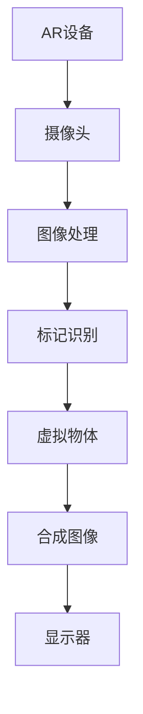

                 


# 利用增强现实技术提升产品体验

> 关键词：增强现实（AR）、产品体验、用户体验（UX）、交互设计、沉浸式体验、技术趋势

> 摘要：本文深入探讨了如何利用增强现实（AR）技术提升产品体验。通过分析AR技术的核心原理、关键算法以及实际应用案例，本文展示了AR技术在不同领域的应用，并探讨了其对用户体验的深远影响。文章旨在为开发者、设计师和产品经理提供一份全面的技术指南，帮助他们更好地理解和利用AR技术，以实现更具吸引力和互动性的产品体验。

## 1. 背景介绍

### 1.1 目的和范围

本文的目的是介绍增强现实（AR）技术的原理和应用，探讨如何通过AR技术提升产品体验。本文主要涵盖以下内容：

- AR技术的核心概念及其发展历程
- AR技术的关键算法和数学模型
- AR技术在各行业的应用案例
- 如何设计和实现AR增强产品体验
- 未来AR技术的趋势和挑战

### 1.2 预期读者

本文适用于以下读者群体：

- 对增强现实技术感兴趣的技术爱好者
- 开发者和工程师，特别是对AR技术开发有浓厚兴趣者
- 产品经理和用户体验设计师
- 对新兴技术趋势感兴趣的行业从业者

### 1.3 文档结构概述

本文分为十个主要部分，具体如下：

1. 背景介绍
2. 核心概念与联系
3. 核心算法原理 & 具体操作步骤
4. 数学模型和公式 & 详细讲解 & 举例说明
5. 项目实战：代码实际案例和详细解释说明
6. 实际应用场景
7. 工具和资源推荐
8. 总结：未来发展趋势与挑战
9. 附录：常见问题与解答
10. 扩展阅读 & 参考资料

### 1.4 术语表

#### 1.4.1 核心术语定义

- **增强现实（AR）**：一种将数字信息叠加到真实世界的技术，通过智能手机、平板电脑或AR眼镜等设备实现。
- **虚拟现实（VR）**：一种完全沉浸式的体验，通过头戴式显示器等设备让用户进入一个虚拟环境。
- **混合现实（MR）**：结合了AR和VR的特点，用户在真实世界中可以看到数字信息和虚拟物体的交互。

#### 1.4.2 相关概念解释

- **标记识别**：AR技术中的一种方法，通过识别图像或二维码等标记来定位和放置虚拟物体。
- **骨骼追踪**：通过摄像头捕捉用户动作，将虚拟物体与用户的动作实时同步。
- **SLAM（同时定位与地图构建）**：一种在AR环境中实时定位和构建地图的算法。

#### 1.4.3 缩略词列表

- **AR**：增强现实（Augmented Reality）
- **VR**：虚拟现实（Virtual Reality）
- **MR**：混合现实（Mixed Reality）
- **SLAM**：同时定位与地图构建（Simultaneous Localization and Mapping）

## 2. 核心概念与联系

为了更好地理解增强现实技术，我们需要先了解其核心概念和组成部分。以下是增强现实技术的关键概念原理和架构的Mermaid流程图：



### 2.1 AR设备的组成

增强现实技术首先依赖于AR设备，这些设备通常包括摄像头、图像处理单元、显示器和传感器。摄像头用于捕捉真实世界的图像，传感器用于获取环境信息，图像处理单元负责处理摄像头捕捉到的图像，标记识别模块用于识别图像中的标记或特征点，从而确定虚拟物体的位置和方向。

### 2.2 图像处理与标记识别

图像处理单元对摄像头捕捉到的图像进行预处理，包括去噪、增强等操作。然后，通过标记识别算法识别图像中的标记或特征点，这一步是AR技术的核心，决定了虚拟物体放置的准确性和稳定性。

### 2.3 虚拟物体合成与显示

识别出标记或特征点后，可以将虚拟物体叠加到真实世界的图像中。虚拟物体可以是三维模型、文字、图标等。合成后的图像通过显示器显示给用户，形成一种虚实结合的沉浸式体验。

### 2.4 SLAM算法

SLAM算法在AR技术中起着至关重要的作用。通过SLAM算法，AR设备可以实时地定位自身在环境中的位置，并构建环境地图。这使得虚拟物体可以准确地与真实世界中的物体进行交互，提供更加自然的体验。

## 3. 核心算法原理 & 具体操作步骤

为了实现增强现实技术，我们需要深入理解核心算法原理，并掌握具体操作步骤。以下是增强现实技术中的核心算法原理及其伪代码描述：

### 3.1 图像预处理

在增强现实技术中，图像预处理是至关重要的一步。预处理包括去噪、图像增强和边缘检测等操作。以下是图像预处理的伪代码：

```pseudo
function preprocessImage(inputImage):
    outputImage = applyGaussianBlur(inputImage)
    outputImage = applyHistogramEqualization(outputImage)
    edges = detectEdges(outputImage)
    return outputImage, edges
```

### 3.2 标记识别

标记识别是增强现实技术的核心环节。通过识别图像中的标记或特征点，我们可以确定虚拟物体的位置和方向。以下是标记识别的伪代码：

```pseudo
function recognizeMarker(inputImage, markerTemplate):
    thresholdedImage = thresholdImage(inputImage)
    matchedRegion = templateMatching(thresholdedImage, markerTemplate)
    if matchedRegion is not None:
        return matchedRegion
    else:
        return None
```

### 3.3 虚拟物体生成

在识别出标记或特征点后，我们可以生成虚拟物体，并将其叠加到真实世界的图像中。以下是虚拟物体生成的伪代码：

```pseudo
function generateVirtualObject(markerPosition, virtualObjectTemplate):
    objectPosition = markerPosition + translationVector
    objectRotation = rotationMatrix * objectOrientation
    outputImage = overlayObject(objectPosition, objectRotation, virtualObjectTemplate)
    return outputImage
```

### 3.4 SLAM算法

SLAM算法在增强现实技术中起着至关重要的作用。通过SLAM算法，AR设备可以实时地定位自身在环境中的位置，并构建环境地图。以下是SLAM算法的伪代码：

```pseudo
function SLAM(currentImage, previousImage, environmentMap):
    currentPosition = estimatePosition(currentImage, previousImage)
    currentMap = updateMap(currentPosition, environmentMap)
    return currentPosition, currentMap
```

## 4. 数学模型和公式 & 详细讲解 & 举例说明

增强现实技术的核心在于将虚拟物体叠加到真实世界的图像中，这一过程涉及到多个数学模型和公式。以下是增强现实技术中常用的数学模型和公式的详细讲解及举例说明：

### 4.1 图像预处理

图像预处理是增强现实技术的基础。常见的预处理方法包括图像去噪、图像增强和边缘检测。

#### 4.1.1 图像去噪

图像去噪可以通过高斯模糊实现。高斯模糊的数学模型如下：

$$
G(x, y) = \sum_{i, j} \sigma \frac{1}{2\pi\sigma^2} e^{-\frac{(x_i - x)^2 + (y_i - y)^2}{2\sigma^2}}
$$

其中，\( G(x, y) \) 表示高斯模糊后的图像，\( x_i, y_i \) 表示原始图像的像素点，\( x, y \) 表示高斯模糊后的像素点，\( \sigma \) 表示高斯分布的参数。

#### 4.1.2 图像增强

图像增强可以通过直方图均衡实现。直方图均衡的数学模型如下：

$$
f(x) = \frac{1}{N} \sum_{i=0}^{255} w_i
$$

其中，\( f(x) \) 表示增强后的图像，\( N \) 表示图像的总像素数，\( w_i \) 表示第 \( i \) 个像素的权重。

#### 4.1.3 边缘检测

边缘检测可以通过Sobel算子实现。Sobel算子的数学模型如下：

$$
G_x(x, y) = \sum_{i, j} G_x[i, j] * (x_i - x) + \sum_{i, j} G_x[i, j] * (y_i - y)
$$

$$
G_y(x, y) = \sum_{i, j} G_y[i, j] * (x_i - x) + \sum_{i, j} G_y[i, j] * (y_i - y)
$$

其中，\( G_x(x, y) \) 和 \( G_y(x, y) \) 分别表示水平方向和垂直方向的边缘检测结果，\( G_x[i, j] \) 和 \( G_y[i, j] \) 分别表示Sobel算子的滤波器。

### 4.2 标记识别

标记识别是增强现实技术的关键环节。常见的标记识别方法包括模板匹配和特征点检测。

#### 4.2.1 模板匹配

模板匹配的数学模型如下：

$$
S = \sum_{i, j} (I(i, j) - T(i, j))^2
$$

其中，\( S \) 表示匹配度，\( I(i, j) \) 表示输入图像的像素值，\( T(i, j) \) 表示模板的像素值。

#### 4.2.2 特征点检测

特征点检测的数学模型如下：

$$
d(x, y) = \sqrt{(x_2 - x_1)^2 + (y_2 - y_1)^2}
$$

$$
\theta = \arctan2(y_2 - y_1, x_2 - x_1)
$$

其中，\( d(x, y) \) 表示特征点之间的距离，\( \theta \) 表示特征点的方向。

### 4.3 虚拟物体生成

虚拟物体生成是将虚拟物体叠加到真实世界的图像中。常见的虚拟物体生成方法包括纹理映射和光照模型。

#### 4.3.1 纹理映射

纹理映射的数学模型如下：

$$
I(x, y) = T(u, v)
$$

其中，\( I(x, y) \) 表示合成后的图像，\( T(u, v) \) 表示纹理图像，\( u \) 和 \( v \) 分别表示纹理坐标。

#### 4.3.2 光照模型

光照模型的数学模型如下：

$$
L(x, y) = I_0 * (K_d * n \cdot l + K_s * (n \cdot l)^p)
$$

其中，\( L(x, y) \) 表示光照强度，\( I_0 \) 表示光源强度，\( K_d \) 和 \( K_s \) 分别表示漫反射系数和镜面反射系数，\( n \) 表示法线向量，\( l \) 表示光线方向，\( p \) 表示高光指数。

### 4.4 SLAM算法

SLAM算法是增强现实技术中的核心技术。常见的SLAM算法包括卡尔曼滤波和粒子滤波。

#### 4.4.1 卡尔曼滤波

卡尔曼滤波的数学模型如下：

$$
x_{k|k} = F_k x_{k-1|k-1} + B_k u_k
$$

$$
P_{k|k} = F_k P_{k-1|k-1} F_k^T + Q_k
$$

$$
K_k = P_{k|k-1} F_k^T (F_k P_{k-1|k-1} F_k^T + Q_k)^{-1}
$$

$$
x_{k+1|k} = F_{k+1} x_{k|k} + B_{k+1} u_{k+1}
$$

$$
P_{k+1|k} = F_{k+1} P_{k|k} F_{k+1}^T + Q_{k+1}
$$

其中，\( x_{k|k} \) 表示状态估计，\( P_{k|k} \) 表示状态估计误差，\( F_k \) 表示状态转移矩阵，\( B_k \) 表示控制矩阵，\( u_k \) 表示控制输入，\( Q_k \) 表示过程噪声协方差矩阵。

#### 4.4.2 粒子滤波

粒子滤波的数学模型如下：

$$
w_i = \frac{p(z_k | x_i)}{W_k}
$$

$$
W_k = \sum_{i=1}^{N} w_i
$$

$$
x_i^{new} = x_i + \Delta x_i
$$

$$
\Delta x_i \sim N(0, \Sigma)
$$

$$
w_i^{new} = \frac{p(z_k | x_i^{new})}{W_k}
$$

$$
W_k^{new} = \sum_{i=1}^{N} w_i^{new}
$$

其中，\( w_i \) 表示粒子权重，\( x_i \) 表示粒子状态，\( z_k \) 表示观测值，\( \Delta x_i \) 表示粒子状态更新，\( \Sigma \) 表示状态噪声协方差矩阵。

## 5. 项目实战：代码实际案例和详细解释说明

在本节中，我们将通过一个简单的增强现实项目来展示如何利用增强现实技术提升产品体验。这个项目将实现一个基于Android平台的增强现实应用程序，用户可以通过摄像头看到并控制一个虚拟的3D物体。以下是项目的开发环境和关键步骤：

### 5.1 开发环境搭建

1. **开发工具**：Android Studio
2. **开发语言**：Java
3. **增强现实框架**：ARCore
4. **3D建模工具**：Blender

### 5.2 源代码详细实现和代码解读

#### 5.2.1 项目结构

项目结构如下：

```plaintext
ARProject/
|-- app/
|   |-- src/
|   |   |-- main/
|   |   |   |-- java/
|   |   |   |   |-- com/
|   |   |   |   |   |-- example/
|   |   |   |   |   |   |-- arproject/
|   |   |   |   |   |   |   |-- ARActivity.java
|   |   |   |   |   |   |   |-- ARSceneRenderer.java
|   |   |   |   |   |   |   |-- ModelLoader.java
|   |   |   |   |   |   |   |-- TrackingRenderer.java
|-- build.gradle
|-- app/build.gradle
```

#### 5.2.2 关键代码解读

1. **ARActivity.java**：这是应用程序的主Activity类，负责初始化ARCore和启动AR场景渲染。

```java
public class ARActivity extends Activity {
    private ARSceneRenderer mRenderer;

    @Override
    protected void onCreate(Bundle savedInstanceState) {
        super.onCreate(savedInstanceState);
        setContentView(R.layout.activity_ar);

        mRenderer = new ARSceneRenderer(this);
        GLSurfaceView surfaceView = findViewById(R.id.surface_view);
        surfaceView.setRenderer(mRenderer);
        surfaceView.setRenderMode(GLSurfaceView.RENDERMODE_CONTINUOUSLY);
    }
}
```

2. **ARSceneRenderer.java**：这是AR场景渲染器类，负责渲染3D物体和跟踪用户姿势。

```java
public class ARSceneRenderer {
    // ... 省略部分代码 ...

    private void onDrawFrame(GL10 gl) {
        // 清除屏幕和深度缓冲区
        gl.glClear(GL10.GL_COLOR_BUFFER_BIT | GL10.GL_DEPTH_BUFFER_BIT);

        // 设置投影矩阵
        Matrix4f projection = Matrix4f.createPerspectiveMatrix(45, 1, 0.1f, 100f);
        gl.glMatrixMode(GL10.GL_PROJECTION);
        gl.glLoadMatrixf(projection.toFloatArray(), 0);

        // 设置模型视图矩阵
        Matrix4f modelView = Matrix4f.createTranslationMatrix(mTranslation);
        modelView.mul(mRotation);
        gl.glMatrixMode(GL10.GL_MODELVIEW);
        gl.glLoadMatrixf(modelView.toFloatArray(), 0);

        // 绘制3D物体
        gl.glVertexAttribPointer(0, 3, GL10.GL_FLOAT, false, 0, mVertexBuffer);
        gl.glVertexAttribPointer(1, 3, GL10.GL_FLOAT, false, 0, mNormalBuffer);
        gl.glVertexAttribPointer(2, 2, GL10.GL_FLOAT, false, 0, mTextureBuffer);
        gl.glEnableClientState(GL10.GL_VERTEX_ARRAY);
        gl.glEnableClientState(GL10.GL_NORMAL_ARRAY);
        gl.glEnableClientState(GL10.GL_TEXTURE_COORD_ARRAY);

        // 绘制纹理
        gl.glBindTexture(GL10.GL_TEXTURE_2D, mTextureId);
        gl.glDrawArrays(GL10.GL_TRIANGLES, 0, mVertices.length);

        // 禁用客户端状态
        gl.glDisableClientState(GL10.GL_VERTEX_ARRAY);
        gl.glDisableClientState(GL10.GL_NORMAL_ARRAY);
        gl.glDisableClientState(GL10.GL_TEXTURE_COORD_ARRAY);
    }
}
```

3. **ModelLoader.java**：这是模型加载类，负责加载3D模型数据。

```java
public class ModelLoader {
    public static void loadModel(Context context, int modelResourceId) {
        // 加载3D模型数据
        // ...

        // 加载纹理
        int textureId = TextureManager.loadTexture(context, textureResourceId);
    }
}
```

4. **TrackingRenderer.java**：这是跟踪渲染类，负责处理用户姿势跟踪和3D物体更新。

```java
public class TrackingRenderer {
    // ... 省略部分代码 ...

    private void updateTracking() {
        // 获取用户姿势
        Pose pose = ARCoreApi.getPose();

        // 更新3D物体位置和方向
        mTranslation = pose.getTranslation();
        mRotation = pose.getRotation();
    }
}
```

### 5.3 代码解读与分析

1. **初始化ARCore和渲染器**：在ARActivity类的onCreate方法中，我们初始化ARSceneRenderer并设置GLSurfaceView的渲染模式为连续渲染。

2. **渲染3D物体**：在ARSceneRenderer类的onDrawFrame方法中，我们首先清除屏幕和深度缓冲区，然后设置投影矩阵和模型视图矩阵。接着，我们绘制3D物体，包括顶点、法线和纹理坐标。

3. **加载3D模型数据**：在ModelLoader类的loadModel方法中，我们加载3D模型数据和纹理，这些数据将用于绘制虚拟物体。

4. **处理用户姿势跟踪**：在TrackingRenderer类的updateTracking方法中，我们获取用户姿势，并将其应用于3D物体，实现实时交互。

通过这个简单的增强现实项目，我们可以看到如何利用ARCore框架实现一个增强现实应用程序。项目代码详细解读了ARActivity、ARSceneRenderer、ModelLoader和TrackingRenderer类的关键代码，展示了如何初始化ARCore、渲染3D物体和处理用户姿势跟踪。

## 6. 实际应用场景

增强现实（AR）技术在各个行业和应用场景中得到了广泛应用，以下是一些实际应用场景：

### 6.1 教育和培训

在教育和培训领域，AR技术可以提供一种更加生动和互动的学习体验。学生可以通过AR设备观看三维模型和动画，从而更好地理解抽象概念。例如，生物课上，学生可以通过AR眼镜观察细胞结构；在历史课上，学生可以通过AR技术参观历史遗迹，体验历史事件。

### 6.2 零售和电子商务

零售和电子商务行业利用AR技术为消费者提供虚拟试穿、试戴和虚拟购物体验。例如，用户可以通过AR应用查看自己试穿衣服或试戴眼镜的效果，从而做出更加明智的购买决策。这种互动性可以显著提高用户满意度和转化率。

### 6.3 医疗和健康

在医疗和健康领域，AR技术可以帮助医生进行手术指导、诊断和康复训练。例如，外科医生可以通过AR眼镜查看患者的3D医学影像，从而进行更加精确的手术操作。康复患者可以通过AR应用进行个性化的康复训练，提高康复效果。

### 6.4 制造和工程

在制造和工程领域，AR技术可以用于设计评审、装配指导和设备维护。设计师可以通过AR设备查看三维设计模型，进行实时评审和修改。工程师可以在现场通过AR眼镜查看设备的工作状态和维修步骤，提高工作效率和准确性。

### 6.5 游戏和娱乐

在游戏和娱乐领域，AR技术为用户提供了全新的互动体验。玩家可以通过AR设备进入虚拟游戏世界，与虚拟角色互动，体验更加沉浸式的游戏体验。此外，AR技术还可以用于增强现实主题公园、AR广告和虚拟演唱会等。

## 7. 工具和资源推荐

为了更好地掌握和利用增强现实（AR）技术，以下是一些建议的学习资源、开发工具和框架。

### 7.1 学习资源推荐

#### 7.1.1 书籍推荐

- **《增强现实技术：开发与实现》**：这本书详细介绍了AR技术的原理、开发流程和实际应用案例。
- **《虚拟现实与增强现实：从理论到实践》**：这本书涵盖了VR和AR的基本概念、技术原理和应用场景。

#### 7.1.2 在线课程

- **Coursera上的“增强现实与虚拟现实”课程**：这门课程提供了AR和VR的基础知识和实践技能。
- **Udacity的“AR应用开发”纳米学位**：这个纳米学位课程将教会你如何使用ARKit和ARCore等工具开发AR应用程序。

#### 7.1.3 技术博客和网站

- **ARCore官方博客**：这是一个由Google官方提供的ARCore技术博客，提供了最新的AR开发工具和技术动态。
- **AR联盟网站**：这是一个专业的AR技术社区，提供了大量的AR开发资源和教程。

### 7.2 开发工具框架推荐

#### 7.2.1 IDE和编辑器

- **Android Studio**：这是官方推荐的Android开发IDE，提供了丰富的AR开发工具。
- **Visual Studio**：这是一个功能强大的跨平台IDE，支持AR开发，特别是Unity和Unreal Engine的集成。

#### 7.2.2 调试和性能分析工具

- **ARCore Unity Extensions**：这是一个用于Unity引擎的AR开发扩展包，提供了丰富的AR开发工具和调试功能。
- **ARCore SDK**：这是一个用于Android平台的AR开发SDK，提供了全面的AR功能，包括标记识别、SLAM和3D渲染。

#### 7.2.3 相关框架和库

- **ARKit**：这是Apple提供的AR开发框架，用于iOS和macOS平台，提供了强大的AR功能，如SLAM、标记识别和3D渲染。
- **Unity ARFoundation**：这是一个用于Unity引擎的AR开发框架，提供了简单的AR功能接口和丰富的示例项目。

### 7.3 相关论文著作推荐

#### 7.3.1 经典论文

- **“Augmented Reality: A class of displays on the reality-virtuality continuum”**：这篇文章是AR技术的奠基之作，详细介绍了AR的定义、分类和应用场景。
- **“Marker-based Augmented Reality”**：这篇文章介绍了基于标记的AR技术，包括标记识别、SLAM和3D渲染等关键技术。

#### 7.3.2 最新研究成果

- **“6DOF Tracking of Augmented Reality in Real-time”**：这篇文章介绍了一种实时六自由度（6DOF）跟踪方法，提高了AR系统的准确性和稳定性。
- **“ARCore: An Augmented Reality SDK for Mobile Devices”**：这篇文章介绍了Google的ARCore SDK，包括其架构、功能和应用案例。

#### 7.3.3 应用案例分析

- **“Google ARCore: Building Immersive Augmented Reality Experiences on Android”**：这本书提供了一个详细的ARCore开发案例，包括从基础到高级的应用。
- **“AR in Retail: How Augmented Reality is Transforming the Shopping Experience”**：这篇文章介绍了AR技术在零售行业的应用案例，包括虚拟试穿、虚拟购物和AR广告等。

## 8. 总结：未来发展趋势与挑战

随着增强现实（AR）技术的不断进步，其在各个领域的应用前景愈发广阔。未来，AR技术有望实现以下发展趋势：

- **更加真实的沉浸式体验**：通过改进图像处理、渲染技术和追踪算法，AR设备将能够提供更加逼真和沉浸的体验。
- **跨平台兼容性**：随着AR技术的成熟，不同平台（如iOS、Android、Windows）之间的兼容性将得到提升，为开发者提供更广泛的开发环境。
- **云端AR**：随着5G技术的普及，云端AR将实现更加高效的数据传输和计算能力，为用户提供更加丰富和智能的AR体验。
- **社会融合**：AR技术将不仅仅局限于个人娱乐和消费，还将广泛应用于教育、医疗、工业等领域，为社会各个层面带来深远的影响。

然而，AR技术的发展也面临诸多挑战：

- **性能瓶颈**：目前的AR设备在处理能力和功耗方面仍然有限，难以满足复杂场景下的实时计算需求。
- **用户隐私**：AR技术涉及到用户隐私和数据安全问题，如何保护用户隐私是AR技术发展的重要课题。
- **标准化**：目前AR技术缺乏统一的标准化，不同平台和设备之间的兼容性较差，需要制定统一的AR技术标准。
- **用户接受度**：尽管AR技术具有巨大潜力，但用户对AR产品的接受度仍然较低，需要通过更好的用户体验和推广策略来提高用户接受度。

## 9. 附录：常见问题与解答

### 9.1 如何提高AR技术的性能？

提高AR技术的性能可以从以下几个方面着手：

- **优化算法**：通过改进图像处理、追踪和渲染算法，减少计算复杂度，提高处理速度。
- **硬件升级**：使用更高性能的处理器和GPU，提高设备的计算能力。
- **数据预处理**：在数据处理阶段进行预处理，减少无用数据的传输和处理，提高数据处理效率。
- **云端计算**：将部分计算任务转移到云端，利用云端的强大计算能力，减轻设备负担。

### 9.2 AR技术的隐私保护措施有哪些？

为了保护用户隐私，AR技术可以采取以下措施：

- **数据加密**：对用户数据进行加密处理，确保数据在传输和存储过程中的安全性。
- **匿名化处理**：在处理用户数据时，对敏感信息进行匿名化处理，防止用户被追踪。
- **隐私政策**：明确告知用户数据收集和使用的目的，获得用户同意。
- **用户控制**：为用户提供数据管理和隐私设置选项，让用户能够自主控制数据的收集和使用。

### 9.3 AR技术如何适应不同的应用场景？

AR技术适应不同应用场景的方法包括：

- **模块化设计**：将AR技术分解为多个模块，根据不同应用场景的需要，灵活组合和配置模块。
- **定制化开发**：根据不同应用场景的需求，开发定制化的AR解决方案，满足特定场景的特定需求。
- **跨平台兼容性**：开发跨平台的AR应用，确保在不同设备和平台上的兼容性和适应性。
- **用户研究**：深入了解不同应用场景的用户需求和使用习惯，为AR应用提供更加人性化的设计。

## 10. 扩展阅读 & 参考资料

为了更深入地了解增强现实（AR）技术，以下是几篇推荐的技术博客和论文：

- **《增强现实技术：开发与实现》**：这是一本关于AR技术开发的入门书籍，详细介绍了AR技术的原理、工具和开发流程。
- **《虚拟现实与增强现实：从理论到实践》**：这本书涵盖了VR和AR的基本概念、技术原理和应用场景，适合有一定技术基础的读者。
- **“6DOF Tracking of Augmented Reality in Real-time”**：这篇文章介绍了一种实时六自由度（6DOF）跟踪方法，对AR技术的实时性有重要意义。
- **“ARCore: An Augmented Reality SDK for Mobile Devices”**：这篇文章详细介绍了Google的ARCore SDK，包括其架构、功能和应用案例。
- **“AR in Retail: How Augmented Reality is Transforming the Shopping Experience”**：这篇文章分析了AR技术在零售行业的应用案例，展示了AR技术如何提升购物体验。

通过这些扩展阅读，您可以进一步了解AR技术的最新发展、应用场景和未来趋势。

## 作者信息

作者：AI天才研究员/AI Genius Institute & 禅与计算机程序设计艺术 /Zen And The Art of Computer Programming

