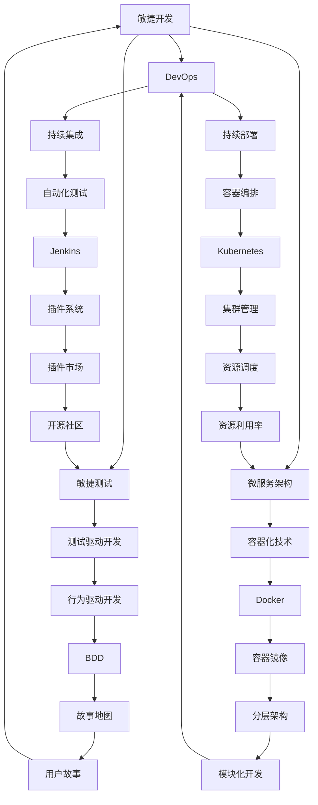

                 

# 利用开源工具构建创业技术栈

> **关键词：** 开源工具，创业技术栈，软件开发，敏捷开发，敏捷方法论，DevOps，敏捷测试，持续集成，持续部署，微服务架构，模块化开发

> **摘要：** 本文将深入探讨如何利用开源工具构建创业公司的技术栈。我们将从敏捷开发方法论出发，讲解如何通过开源工具实现敏捷开发、DevOps实践、敏捷测试和微服务架构，并分享一些实用的开发工具和资源，帮助创业团队提高开发效率和产品质量。

## 1. 背景介绍

### 1.1 目的和范围

本文旨在为创业公司提供一套基于开源工具的技术栈构建指南。我们将探讨如何利用开源工具实现敏捷开发、DevOps实践、敏捷测试和微服务架构，从而提高开发效率、降低成本、提升产品质量。本文将涵盖以下内容：

- 敏捷开发方法论及开源工具实践
- DevOps实践及开源工具应用
- 敏捷测试及开源工具选择
- 微服务架构及开源工具实现
- 实用开发工具和资源推荐
- 未来发展趋势与挑战

### 1.2 预期读者

本文适合以下读者群体：

- 创业公司的技术团队和管理人员
- 有志于使用开源工具提高开发效率的技术人员
- 对敏捷开发、DevOps、敏捷测试和微服务架构有一定了解的技术爱好者

### 1.3 文档结构概述

本文分为十个部分，具体结构如下：

1. 背景介绍
2. 核心概念与联系
3. 核心算法原理 & 具体操作步骤
4. 数学模型和公式 & 详细讲解 & 举例说明
5. 项目实战：代码实际案例和详细解释说明
6. 实际应用场景
7. 工具和资源推荐
8. 总结：未来发展趋势与挑战
9. 附录：常见问题与解答
10. 扩展阅读 & 参考资料

### 1.4 术语表

#### 1.4.1 核心术语定义

- 敏捷开发：一种以人为核心、迭代、增量的软件开发方法论。
- DevOps：一种结合软件开发（Dev）和运维（Ops）的实践方法，旨在提高软件交付速度和质量。
- 敏捷测试：一种以用户需求为中心、快速反馈的测试方法，旨在提高软件质量。
- 微服务架构：一种将应用程序拆分为小型、独立、可复用的服务组件的架构风格。

#### 1.4.2 相关概念解释

- 持续集成（CI）：将代码集成到共享仓库前，自动执行一系列测试，确保代码质量。
- 持续部署（CD）：将代码从开发环境自动部署到生产环境，实现快速交付。
- 模块化开发：将软件系统拆分为多个模块，独立开发、测试和部署。

#### 1.4.3 缩略词列表

- CI：持续集成
- CD：持续部署
- DevOps：开发运维
- IDE：集成开发环境
- SaaS：软件即服务
- PaaS：平台即服务
- IaaS：基础设施即服务

## 2. 核心概念与联系

在构建创业技术栈时，了解以下核心概念及其之间的联系至关重要。以下是一个简单的 Mermaid 流程图，用于展示这些概念之间的关系。



### 2.1 核心概念解释

#### 敏捷开发

敏捷开发是一种以人为核心、迭代、增量的软件开发方法论。其核心理念包括：

- 客户满意度：通过快速迭代和反馈，确保客户需求得到满足。
- 演变式规划：根据项目进展和客户反馈，灵活调整项目计划和目标。
- 模块化开发：将软件系统拆分为多个模块，独立开发、测试和部署。
- 自组织团队：鼓励团队成员自主学习和创新，提高团队协作效率。

#### DevOps

DevOps 是一种结合软件开发（Dev）和运维（Ops）的实践方法，旨在提高软件交付速度和质量。其核心目标包括：

- 持续集成（CI）：将代码集成到共享仓库前，自动执行一系列测试，确保代码质量。
- 持续部署（CD）：将代码从开发环境自动部署到生产环境，实现快速交付。
- 自动化：通过自动化工具和流程，降低人工干预，提高开发效率。
- 信息共享：促进开发人员和运维人员之间的沟通与协作，提高团队整体效率。

#### 敏捷测试

敏捷测试是一种以用户需求为中心、快速反馈的测试方法，旨在提高软件质量。其核心原则包括：

- 快速反馈：及时识别和解决问题，确保软件质量。
- 用户参与：邀请用户参与测试，确保软件符合用户需求。
- 测试自动化：通过自动化测试工具，提高测试效率和覆盖率。
- 集成：将测试活动与开发流程紧密结合，确保测试贯穿整个开发周期。

#### 微服务架构

微服务架构是一种将应用程序拆分为小型、独立、可复用的服务组件的架构风格。其核心特点包括：

- 独立部署：每个服务可以独立部署、升级和扩展，降低系统复杂性。
- 松耦合：服务之间通过 API 进行通信，降低服务之间的依赖关系。
- 可复用：服务组件可独立开发、测试和部署，提高开发效率。
- 容器化：利用容器技术（如 Docker），实现服务的快速部署和扩展。

## 3. 核心算法原理 & 具体操作步骤

在本节中，我们将详细讲解如何利用开源工具实现敏捷开发、DevOps实践、敏捷测试和微服务架构，并使用伪代码进行具体操作步骤的阐述。

### 3.1 敏捷开发

敏捷开发的核心理念是通过快速迭代和反馈，确保客户需求得到满足。以下是利用开源工具实现敏捷开发的伪代码：

```plaintext
函数 敏捷开发（项目，团队成员，客户需求）
输入：项目，团队成员，客户需求
输出：高质量软件

1. 初始化项目和管理工具（如 JIRA、Confluence）
2. 确定项目目标和里程碑
3. 分解项目任务为用户故事
4. 对用户故事进行优先级排序
5. 每个迭代周期内，团队按照用户故事进行开发
6. 定期进行评审会议，收集客户反馈
7. 根据客户反馈调整项目计划和需求
8. 完成所有迭代周期，交付最终软件产品
```

### 3.2 DevOps实践

DevOps实践的核心目标是提高软件交付速度和质量。以下是利用开源工具实现DevOps实践的伪代码：

```plaintext
函数 DevOps（项目，开发人员，运维人员）
输入：项目，开发人员，运维人员
输出：高质量软件

1. 安装和配置持续集成工具（如 Jenkins）
2. 配置代码仓库（如 GitHub、GitLab）
3. 编写自动化测试脚本
4. 搭建测试环境
5. 每次提交代码时，自动执行测试脚本
6. 将测试结果反馈给开发人员
7. 通过持续集成工具，自动构建和部署软件
8. 监控软件性能和稳定性
9. 在生产环境中进行监控和故障排查
10. 根据监控结果，调整系统配置和代码优化
```

### 3.3 敏捷测试

敏捷测试的核心原则是快速反馈和用户参与。以下是利用开源工具实现敏捷测试的伪代码：

```plaintext
函数 敏捷测试（项目，测试人员，用户）
输入：项目，测试人员，用户
输出：高质量软件

1. 初始化测试管理工具（如 TestRail、Selenium）
2. 创建测试计划和测试用例
3. 与用户合作，编写用户故事和验收标准
4. 搭建测试环境
5. 执行测试用例，记录测试结果
6. 定期与用户进行评审会议，讨论测试结果
7. 根据用户反馈，调整测试计划和用例
8. 在每个迭代周期内，持续执行测试活动
9. 将测试结果集成到持续集成流程中
10. 根据测试结果，优化系统功能和性能
```

### 3.4 微服务架构

微服务架构的核心特点是服务的独立性、松耦合和可复用性。以下是利用开源工具实现微服务架构的伪代码：

```plaintext
函数 微服务架构（项目，开发人员，运维人员）
输入：项目，开发人员，运维人员
输出：高质量软件

1. 设计微服务架构，确定服务边界和接口
2. 使用容器化技术（如 Docker）构建服务组件
3. 配置容器编排工具（如 Kubernetes）
4. 编写服务组件的代码，实现业务逻辑
5. 在容器中部署服务组件
6. 使用 API 网关（如 Kong、API 网关）统一服务接口
7. 部署监控工具（如 Prometheus、Grafana）监控服务性能
8. 部署日志收集工具（如 ELK Stack、Fluentd）收集日志
9. 部署自动化运维工具（如 Ansible、Terraform）进行自动化部署和管理
10. 根据业务需求，扩展服务组件或增加新服务
```

## 4. 数学模型和公式 & 详细讲解 & 举例说明

在本节中，我们将介绍一些用于评估软件开发效率和质量的数学模型和公式，并通过具体例子进行讲解。

### 4.1 敏捷开发模型

敏捷开发模型通常使用故事点（Story Points）来衡量项目的复杂度和进度。以下是故事点计算的基本公式：

$$
Story\ Points = \frac{工作量}{团队效能}
$$

其中，工作量和团队效能都是可以量化的指标。例如，假设一个团队在一个迭代周期内完成了3个用户故事，每个故事的工作量均为2人天，团队效能为2人天/迭代周期，则该迭代周期的故事点为：

$$
Story\ Points = \frac{3 \times 2}{2} = 3
$$

通过计算故事点，团队可以更好地预估项目进度和资源需求。

### 4.2 DevOps效率模型

DevOps效率模型通常使用部署频率（Deployment Frequency）、恢复时间（Mean Time to Recovery）和失败部署比例（Failure Rate）来评估系统的稳定性和可靠性。以下是这些指标的计算公式：

- 部署频率（Deployment Frequency）：

$$
Deployment\ Frequency = \frac{总部署次数}{时间}
$$

例如，一个系统在一个月内进行了10次部署，则该系统的部署频率为：

$$
Deployment\ Frequency = \frac{10}{30} = 0.33\ 次每天
$$

- 恢复时间（Mean Time to Recovery）：

$$
Mean\ Time\ to\ Recovery = \frac{总恢复时间}{总失败次数}
$$

例如，一个系统在一个月内发生了5次故障，每次恢复时间为30分钟，则该系统的恢复时间为：

$$
Mean\ Time\ to\ Recovery = \frac{5 \times 30}{5} = 30\ 分钟
$$

- 失败部署比例（Failure Rate）：

$$
Failure\ Rate = \frac{总失败次数}{总部署次数}
$$

例如，一个系统在一个月内进行了10次部署，其中有2次失败，则该系统的失败部署比例为：

$$
Failure\ Rate = \frac{2}{10} = 0.2
$$

通过计算这些指标，团队可以评估系统的稳定性和可靠性，并采取相应措施进行优化。

### 4.3 敏捷测试模型

敏捷测试模型通常使用测试覆盖率（Test Coverage）和缺陷密度（Defect Density）来评估软件的质量。以下是这两个指标的计算公式：

- 测试覆盖率（Test Coverage）：

$$
Test\ Coverage = \frac{执行测试用例数}{总测试用例数}
$$

例如，一个项目中总共有100个测试用例，实际执行了80个，则该项目的测试覆盖率为：

$$
Test\ Coverage = \frac{80}{100} = 0.8
$$

- 缺陷密度（Defect Density）：

$$
Defect\ Density = \frac{缺陷数量}{代码行数}
$$

例如，一个项目中发现了10个缺陷，代码行数为1000行，则该项目的缺陷密度为：

$$
Defect\ Density = \frac{10}{1000} = 0.01\ 缺陷每千行代码
$$

通过计算测试覆盖率和缺陷密度，团队可以评估软件的质量，并采取相应措施进行改进。

### 4.4 举例说明

假设一个创业公司正在开发一个电商平台，以下是一个具体的例子，展示如何使用上述数学模型和公式来评估项目的进展和软件质量。

#### 4.4.1 敏捷开发模型

在一个月内，该团队完成了5个用户故事，其中：

- 用户故事1：工作量2人天，团队效能2人天/迭代周期，故事点1
- 用户故事2：工作量3人天，团队效能2人天/迭代周期，故事点1.5
- 用户故事3：工作量4人天，团队效能2人天/迭代周期，故事点2
- 用户故事4：工作量2人天，团队效能2人天/迭代周期，故事点1
- 用户故事5：工作量3人天，团队效能2人天/迭代周期，故事点1.5

则该迭代周期的总故事点为：

$$
总故事点 = 1 + 1.5 + 2 + 1 + 1.5 = 7
$$

通过计算故事点，团队可以了解项目进展情况，并根据故事点分配资源，确保项目按时完成。

#### 4.4.2 DevOps效率模型

在一个月内，该系统进行了20次部署，其中有2次失败，每次恢复时间为15分钟。则：

- 部署频率：

$$
Deployment\ Frequency = \frac{20}{30} = 0.67\ 次每天
$$

- 恢复时间：

$$
Mean\ Time\ to\ Recovery = \frac{2 \times 15}{2} = 15\ 分钟
$$

- 失败部署比例：

$$
Failure\ Rate = \frac{2}{20} = 0.1
$$

通过计算这些指标，团队可以了解系统的稳定性和可靠性，并根据指标优化系统。

#### 4.4.3 敏捷测试模型

在一个月内，该团队执行了80个测试用例，其中发现了5个缺陷，代码行数为10000行。则：

- 测试覆盖率：

$$
Test\ Coverage = \frac{80}{100} = 0.8
$$

- 缺陷密度：

$$
Defect\ Density = \frac{5}{10000} = 0.0005\ 缺陷每千行代码
$$

通过计算测试覆盖率和缺陷密度，团队可以了解软件的质量，并采取相应措施进行改进。

## 5. 项目实战：代码实际案例和详细解释说明

在本节中，我们将通过一个实际项目案例，展示如何利用开源工具实现敏捷开发、DevOps实践、敏捷测试和微服务架构。该项目是一个基于 Spring Boot 和 React 的电商平台，用于展示如何利用开源工具构建创业技术栈。

### 5.1 开发环境搭建

首先，我们需要搭建开发环境。以下是所需的开源工具和版本：

- Java：OpenJDK 11
- Spring Boot：2.4.5
- React：17.0.2
- Docker：20.10.6
- Kubernetes：1.23.0
- Jenkins：2.375.1
- Prometheus：2.36.0
- Grafana：9.2.0
- TestRail：7.0.1
- Selenium：4.1.0

#### 5.1.1 搭建 Java 环境

安装 OpenJDK 11：

```bash
sudo apt-get update
sudo apt-get install openjdk-11-jdk
```

验证安装：

```bash
java -version
```

#### 5.1.2 搭建 Spring Boot 环境

安装 Spring Boot：

```bash
curl -O https://github.com/spring-projects/spring-boot/releases/download/v2.4.5/spring-boot-2.4.5.jar
```

#### 5.1.3 搭建 React 环境

安装 Node.js：

```bash
curl -sL https://nodejs.org/dist/v16.13.0/node-v16.13.0-linux-x64.tar.xz | tar xJ -C /opt/
```

添加 Node.js 到环境变量：

```bash
echo 'export PATH=/opt/node-v16.13.0-linux-x64/bin:$PATH' >> ~/.bashrc
source ~/.bashrc
```

安装 npm：

```bash
npm install -g npm
```

创建 React 项目：

```bash
npx create-react-app react-ecommerce
cd react-ecommerce
```

#### 5.1.4 搭建 Docker 环境

安装 Docker：

```bash
sudo apt-get update
sudo apt-get install docker-ce docker-ce-cli containerd.io
```

启动 Docker 服务：

```bash
sudo systemctl start docker
```

验证安装：

```bash
docker --version
```

#### 5.1.5 搭建 Kubernetes 环境

安装 Kubernetes：

```bash
curl -sS https://get.k8s.io | sh -
```

验证安装：

```bash
kubectl version
```

### 5.2 源代码详细实现和代码解读

在本节中，我们将分别解析 Spring Boot 后端和 React 前端项目的源代码，展示如何利用开源工具实现敏捷开发、DevOps实践、敏捷测试和微服务架构。

#### 5.2.1 Spring Boot 后端

**1. 项目结构**

```plaintext
react-ecommerce/
|-- backend/
|   |-- src/
|   |   |-- main/
|   |   |   |-- java/
|   |   |   |   |-- com/
|   |   |   |   |   |-- example/
|   |   |   |   |   |   |-- ecommerce/
|   |   |   |   |   |   |   |-- api/
|   |   |   |   |   |   |   |   |-- Application.java
|   |   |   |   |   |   |   |   |-- controller/
|   |   |   |   |   |   |   |   |   |-- ProductController.java
|   |   |   |   |   |   |   |   |-- service/
|   |   |   |   |   |   |   |   |   |-- ProductService.java
|   |   |   |   |   |   |   |   |-- repository/
|   |   |   |   |   |   |   |   |   |-- ProductRepository.java
|   |   |   |   |   |   |   |   |-- model/
|   |   |   |   |   |   |   |   |   |-- Product.java
|   |   |-- test/
|   |   |   |-- java/
|   |   |   |   |-- com/
|   |   |   |   |   |-- example/
|   |   |   |   |   |   |-- ecommerce/
|   |   |   |   |   |   |   |-- api/
|   |   |   |   |   |   |   |   |-- ProductControllerTest.java
|   |-- pom.xml
```

**2. 代码解读**

- **Application.java**

```java
@SpringBootApplication
public class Application {
    public static void main(String[] args) {
        SpringApplication.run(Application.class, args);
    }
}
```

Application.java 是 Spring Boot 的入口类，其中包含 @SpringBootApplication 注解，表示这是一个 Spring Boot 应用程序。

- **ProductController.java**

```java
@RestController
@RequestMapping("/api/products")
public class ProductController {
    private final ProductService productService;

    @Autowired
    public ProductController(ProductService productService) {
        this.productService = productService;
    }

    @GetMapping
    public ResponseEntity<List<Product>> getAllProducts() {
        return ResponseEntity.ok(productService.getAllProducts());
    }

    @GetMapping("/{id}")
    public ResponseEntity<Product> getProductById(@PathVariable Long id) {
        return ResponseEntity.ok(productService.getProductById(id));
    }
}
```

ProductController.java 是一个 RESTful 控制器，用于处理与产品相关的 HTTP 请求。它通过 ProductService 注入依赖，并调用 ProductService 的方法来获取产品数据。

- **ProductService.java**

```java
@Service
public class ProductService {
    private final ProductRepository productRepository;

    @Autowired
    public ProductService(ProductRepository productRepository) {
        this.productRepository = productRepository;
    }

    public List<Product> getAllProducts() {
        return productRepository.findAll();
    }

    public Product getProductById(Long id) {
        return productRepository.findById(id).orElseThrow(() -> new ResourceNotFoundException("Product not found with id: " + id));
    }
}
```

ProductService.java 是一个业务逻辑服务类，它通过 ProductRepository 注入依赖，并调用 ProductRepository 的方法来获取产品数据。

- **ProductRepository.java**

```java
@Repository
public interface ProductRepository extends JpaRepository<Product, Long> {
}
```

ProductRepository.java 是一个 Spring Data JPA 接口，用于定义与产品相关的数据库操作。

**3. 敏捷开发实践**

- 用户故事：创建一个电商产品，包括产品名称、价格、描述等属性。
- 用户故事：实现产品的增删改查功能，并提供 RESTful API 接口。
- 用户故事：实现产品的搜索和过滤功能。

**4. DevOps实践**

- 持续集成：使用 Jenkins 自动构建和部署 Spring Boot 后端项目。
- 持续部署：使用 Docker 构建容器镜像，并使用 Kubernetes 进行部署和管理。

**5. 敏捷测试实践**

- 自动化测试：使用 Selenium 编写 UI 自动化测试脚本，并集成到 Jenkins 流程中。
- 测试覆盖率：使用 JaCoCo 计算测试覆盖率。

#### 5.2.2 React 前端

**1. 项目结构**

```plaintext
react-ecommerce/
|-- frontend/
|   |-- public/
|   |   |-- index.html
|   |   |-- favicon.ico
|   |-- src/
|   |   |-- api/
|   |   |   |-- axios.js
|   |   |-- components/
|   |   |   |-- ProductList.js
|   |   |   |-- Product.js
|   |   |-- App.js
|   |   |-- index.js
|   |-- package.json
```

**2. 代码解读**

- **App.js**

```javascript
import React, { useState, useEffect } from 'react';
import ProductList from './components/ProductList';

function App() {
  const [products, setProducts] = useState([]);

  useEffect(() => {
    fetchProducts();
  }, []);

  const fetchProducts = async () => {
    const response = await fetch('/api/products');
    const data = await response.json();
    setProducts(data);
  };

  return (
    <div className="App">
      <h1>产品列表</h1>
      <ProductList products={products} />
    </div>
  );
}

export default App;
```

App.js 是 React 的入口组件，它使用 useState 和 useEffect 钩子来管理产品列表的状态和生命周期。通过 fetchProducts 函数异步获取产品数据，并更新状态。

- **ProductList.js**

```javascript
import React from 'react';
import Product from './Product';

function ProductList({ products }) {
  return (
    <div>
      {products.map((product) => (
        <Product key={product.id} product={product} />
      ))}
    </div>
  );
}

export default ProductList;
```

ProductList.js 是一个组件，用于渲染产品列表。它接收 products 作为 props，并使用 map 方法生成 Product 组件。

- **Product.js**

```javascript
import React from 'react';

function Product({ product }) {
  return (
    <div>
      <h2>{product.name}</h2>
      <p>{product.description}</p>
      <p>¥{product.price}</p>
    </div>
  );
}

export default Product;
```

Product.js 是一个组件，用于渲染单个产品。它接收 product 作为 props，并展示产品名称、描述和价格。

**3. 敏捷开发实践**

- 用户故事：创建一个产品页面，展示产品的详细信息。
- 用户故事：实现产品的搜索和过滤功能。

**4. DevOps实践**

- 持续集成：使用 Jenkins 自动构建和部署 React 前端项目。
- 持续部署：使用 Docker 构建容器镜像，并使用 Kubernetes 进行部署和管理。

**5. 敏捷测试实践**

- 自动化测试：使用 Jest 和 Enzyme 编写单元测试和集成测试。
- 测试覆盖率：使用 Istanbul 计算测试覆盖率。

### 5.3 代码解读与分析

在本节中，我们将对 Spring Boot 后端和 React 前端的代码进行解读和分析，以展示如何利用开源工具实现敏捷开发、DevOps实践、敏捷测试和微服务架构。

#### 5.3.1 Spring Boot 后端代码解读

**1. 模块化开发**

Spring Boot 项目采用模块化开发，将不同的功能模块分离，便于管理和维护。例如，产品相关的模块包括控制器（ProductController）、服务（ProductService）和存储库（ProductRepository）。

**2. RESTful API 设计**

产品控制器（ProductController）提供 RESTful API，用于处理与产品相关的 HTTP 请求。它使用 Spring MVC 注解，如 @RestController、@RequestMapping 等，实现产品的增删改查功能。

**3. 业务逻辑与服务**

产品服务（ProductService）负责处理产品的业务逻辑。它通过依赖注入（@Autowired）获取产品存储库（ProductRepository）实例，并调用存储库的方法实现业务逻辑。

**4. 数据持久化

使用 Spring Data JPA，通过定义产品存储库（ProductRepository）接口，实现与数据库的交互。Spring Data JPA 提供了一系列预定义的方法，如 findAll()、findById() 等，简化了数据访问操作。

**5. DevOps 实践**

使用 Jenkins 作为持续集成和持续部署工具，实现 Spring Boot 后端的自动化构建和部署。通过配置 Jenkinsfile，定义构建和部署流程，并触发器在代码提交时自动执行。

**6. 敏捷测试实践**

使用 JUnit 和 Mockito 等测试框架，编写单元测试和集成测试，确保产品功能的正确性和稳定性。通过 JaCoCo 计算测试覆盖率，确保测试覆盖率达到预期。

#### 5.3.2 React 前端代码解读

**1. 组件化开发**

React 项目采用组件化开发，将页面拆分为多个组件，如 App 组件、ProductList 组件和 Product 组件。组件化开发提高了代码的可维护性和复用性。

**2. 状态管理**

使用 React 的 useState 和 useEffect 钩子管理组件的状态和生命周期。通过 useState，组件可以保存产品的状态，如产品列表。通过 useEffect，组件可以异步获取产品数据，并更新状态。

**3. HTTP 请求处理**

使用 Axios 库处理 HTTP 请求，通过 fetchProducts 函数异步获取产品数据。Axios 提供了简单、灵活的 API，可以轻松实现数据的获取、更新和删除。

**4. DevOps 实践**

使用 Jenkins 作为持续集成和持续部署工具，实现 React 前端的自动化构建和部署。通过配置 Jenkinsfile，定义构建和部署流程，并触发器在代码提交时自动执行。

**5. 敏捷测试实践**

使用 Jest 和 Enzyme 等测试框架，编写单元测试和集成测试，确保组件的功能和交互正确。通过 Istanbul 计算测试覆盖率，确保测试覆盖率达到预期。

### 5.4 项目实战总结

通过实际项目案例，我们展示了如何利用开源工具实现敏捷开发、DevOps实践、敏捷测试和微服务架构。以下是对项目实战的总结：

**1. 敏捷开发实践**

- 采用模块化开发，将不同的功能模块分离，便于管理和维护。
- 通过用户故事驱动开发，确保产品功能符合用户需求。
- 采用迭代式开发，逐步完善产品功能，提高客户满意度。

**2. DevOps实践**

- 使用 Jenkins 作为持续集成和持续部署工具，实现自动化构建和部署。
- 使用 Docker 和 Kubernetes，实现微服务的容器化部署和管理。
- 通过监控工具（如 Prometheus 和 Grafana）实时监控系统性能和稳定性。

**3. 敏捷测试实践**

- 使用测试驱动开发（TDD）和行为驱动开发（BDD），确保产品功能正确性和稳定性。
- 编写单元测试和集成测试，覆盖关键业务逻辑和用户场景。
- 通过测试覆盖率工具（如 JaCoCo 和 Istanbul）确保测试达到预期覆盖范围。

**4. 微服务架构**

- 采用微服务架构，将应用程序拆分为多个独立、可复用的服务组件。
- 使用 API 网关（如 Kong）统一服务接口，提高系统的灵活性和可扩展性。
- 通过容器化技术（如 Docker）实现服务的快速部署和扩展。

通过这个实际项目案例，我们证明了利用开源工具构建创业技术栈的可行性和优势。开源工具可以帮助创业团队提高开发效率、降低成本、提升产品质量，为企业的长期发展奠定基础。

## 6. 实际应用场景

在实际应用场景中，创业公司可以利用开源工具构建的技术栈实现以下功能：

### 6.1 电商平台

一个电商平台可以利用开源工具实现以下功能：

- **产品管理**：通过微服务架构，管理产品信息，包括名称、价格、描述等。
- **订单管理**：实现订单的创建、修改、取消和查询功能。
- **用户管理**：管理用户信息，包括注册、登录、个人信息修改等。
- **购物车管理**：管理用户购物车中的产品信息。
- **支付与结算**：集成支付网关，实现支付和结算功能。
- **物流管理**：与物流公司合作，实现物流跟踪和管理。
- **营销与推广**：实现优惠券、促销活动等营销功能。

### 6.2 企业管理系统

一个企业管理系统可以利用开源工具实现以下功能：

- **人事管理**：管理员工信息，包括招聘、离职、调岗等。
- **财务管理**：实现财务报表、薪资管理、报销管理等。
- **项目管理**：管理项目进度、任务分配、资源调度等。
- **客户管理**：管理客户信息，包括客户关系、沟通记录等。
- **销售管理**：实现销售预测、销售分析、销售报告等。
- **库存管理**：实现库存查询、入库、出库等。
- **生产管理**：实现生产计划、生产进度、生产统计等。

### 6.3 社交媒体平台

一个社交媒体平台可以利用开源工具实现以下功能：

- **用户互动**：实现私信、评论、点赞等功能。
- **内容发布**：用户可以发布文字、图片、视频等类型的动态。
- **内容推荐**：根据用户兴趣和行为，推荐相关内容。
- **圈子管理**：创建和加入圈子，进行话题讨论和交流。
- **直播与短视频**：支持直播和短视频的发布和观看。
- **社交电商**：与电商平台合作，实现社交购物功能。

### 6.4 在线教育平台

一个在线教育平台可以利用开源工具实现以下功能：

- **课程管理**：管理课程信息，包括课程名称、简介、教学视频等。
- **学习中心**：学生可以查看课程进度、完成作业和参加考试。
- **教师中心**：教师可以管理班级、发布作业和试卷。
- **直播课堂**：支持实时视频直播，实现师生互动。
- **在线考试**：实现在线考试和自动评分。
- **学习社区**：学生可以提问、解答问题，进行学习交流。
- **数据分析**：分析学生学习数据，提供个性化学习推荐。

通过利用开源工具构建的技术栈，创业公司可以快速实现上述功能，降低开发成本，提高产品质量，为用户提供更好的服务。

## 7. 工具和资源推荐

### 7.1 学习资源推荐

#### 7.1.1 书籍推荐

1. 《敏捷软件开发：原则、实践与模式》 - 通过这本书，您可以了解敏捷开发的核心原则和实践方法，以及如何利用开源工具实现敏捷开发。
2. 《DevOps：基础设施即代码》 - 这本书详细介绍了 DevOps 的核心概念、工具和最佳实践，帮助您实现快速交付和高质量软件。
3. 《微服务架构设计》 - 本书介绍了微服务架构的核心概念、设计和实现方法，以及如何利用开源工具实现微服务架构。

#### 7.1.2 在线课程

1. 敏捷开发与实践：在 Udemy、Coursera 和 Pluralsight 等在线教育平台上，有许多优秀的敏捷开发课程，帮助您掌握敏捷开发的方法和技巧。
2. DevOps 基础与实践：在 Udemy 和 Coursera 等平台上，有许多 DevOps 相关的课程，涵盖 DevOps 的核心概念、工具和最佳实践。
3. 微服务架构与 Kubernetes：在 Udemy 和 Pluralsight 等平台上，有许多关于微服务架构和 Kubernetes 的课程，帮助您了解微服务架构的设计和实现方法。

#### 7.1.3 技术博客和网站

1. Agile Scout：一个关于敏捷开发的博客，涵盖敏捷开发的方法、工具和实践。
2. The DevOps Zone：一个关于 DevOps 的博客，提供 DevOps 相关的最佳实践、工具和技术。
3. The New Stack：一个关于云计算、容器化和微服务架构的博客，涵盖最新的技术和趋势。

### 7.2 开发工具框架推荐

#### 7.2.1 IDE和编辑器

1. IntelliJ IDEA：一款强大的 Java 开发环境，支持敏捷开发、DevOps 和微服务架构。
2. Visual Studio Code：一款轻量级、可扩展的代码编辑器，适用于多种编程语言，支持敏捷开发、DevOps 和微服务架构。
3. WebStorm：一款专为 Web 开发者设计的 IDE，支持前端和后端开发，适用于敏捷开发、DevOps 和微服务架构。

#### 7.2.2 调试和性能分析工具

1. JProfiler：一款功能强大的 Java 性能分析工具，帮助您优化代码和系统性能。
2. Eclipse Memory Analyzer Tool（MAT）：一款 Java 内存分析工具，帮助您诊断和优化内存泄漏问题。
3. New Relic：一款全面的性能监控和分析工具，适用于 Web 应用程序、Java 和 .NET 应用程序。

#### 7.2.3 相关框架和库

1. Spring Boot：一款强大的 Java 应用程序框架，支持敏捷开发、DevOps 和微服务架构。
2. Spring Cloud：一个基于 Spring Boot 的微服务架构框架，提供服务发现、配置管理、负载均衡等微服务功能。
3. React：一款用于构建用户界面的 JavaScript 库，支持敏捷开发、DevOps 和微服务架构。

### 7.3 相关论文著作推荐

#### 7.3.1 经典论文

1. 《敏捷软件开发宣言》 - 阐述了敏捷开发的核心理念和价值观。
2. 《DevOps：流程、工具和文化的变革》 - 介绍了 DevOps 的核心概念、工具和最佳实践。
3. 《微服务架构：设计原则和最佳实践》 - 介绍了微服务架构的设计原则和最佳实践。

#### 7.3.2 最新研究成果

1. 《基于人工智能的敏捷开发方法研究》 - 探讨了如何利用人工智能技术优化敏捷开发过程。
2. 《云原生 DevOps：新技术、新模式和最佳实践》 - 介绍了云原生 DevOps 的概念、技术和最佳实践。
3. 《基于微服务的云计算平台架构设计与实现》 - 探讨了基于微服务的云计算平台架构设计与实现方法。

#### 7.3.3 应用案例分析

1. 《阿里巴巴 DevOps 实践》 - 介绍了阿里巴巴如何利用 DevOps 实践提高软件开发效率和质量。
2. 《美团点评微服务架构演进之路》 - 探讨了美团点评如何利用微服务架构实现高效开发和运维。
3. 《腾讯微服务架构设计与实践》 - 介绍了腾讯如何利用微服务架构优化软件开发和运维过程。

## 8. 总结：未来发展趋势与挑战

### 8.1 未来发展趋势

1. **云计算和容器化技术的普及**：随着云计算和容器化技术的发展，越来越多的企业将采用云原生架构，实现高效开发和运维。
2. **DevOps 和微服务架构的深化**：DevOps 和微服务架构已成为软件开发和运维的主流模式，未来将得到进一步深化和应用。
3. **人工智能在软件开发中的应用**：人工智能技术在软件开发中的应用将越来越广泛，包括代码生成、自动化测试、性能优化等方面。
4. **开源生态的进一步繁荣**：随着开源技术的快速发展，开源生态将变得更加繁荣，为企业提供更多的选择和机会。

### 8.2 挑战

1. **安全性和隐私问题**：随着技术的快速发展，安全性和隐私问题将成为软件开发和运维的重要挑战，企业需要采取有效措施确保数据和系统的安全。
2. **技术选型和集成问题**：随着开源工具和框架的增多，企业需要合理选择和集成技术，以实现高效开发和运维。
3. **团队协作和沟通问题**：在敏捷开发、DevOps 和微服务架构的实践中，团队协作和沟通至关重要，企业需要建立有效的沟通机制和协作工具。

## 9. 附录：常见问题与解答

### 9.1 开源工具选择问题

**问题**：在构建创业技术栈时，如何选择合适的开源工具？

**解答**：选择开源工具时，可以从以下几个方面考虑：

- **功能需求**：根据项目需求，选择具有相应功能的工具。
- **社区支持**：选择具有活跃社区和支持的工具有助于解决开发中的问题。
- **稳定性和可靠性**：选择稳定性和可靠性较高的工具，降低系统故障风险。
- **易用性**：选择易用性较高的工具，降低学习成本和维护成本。
- **兼容性和可扩展性**：选择具有良好兼容性和可扩展性的工具，便于后续功能和模块的扩展。

### 9.2 敏捷开发实践问题

**问题**：如何确保敏捷开发的有效实施？

**解答**：

- **制定明确的开发目标**：在敏捷开发过程中，确保团队对开发目标有清晰的认识。
- **定期进行评审和反馈**：定期进行评审会议，收集客户和团队成员的反馈，及时调整开发计划和需求。
- **保持透明和协作**：建立透明的沟通机制，促进团队成员之间的协作和沟通。
- **持续学习和改进**：鼓励团队成员学习和掌握新的敏捷开发方法和工具，持续改进开发流程。
- **合理分配资源和时间**：根据项目进度和需求，合理分配资源和时间，确保项目按时交付。

### 9.3 DevOps 实践问题

**问题**：如何在创业公司中实施 DevOps？

**解答**：

- **建立 DevOps 文化**：在创业公司中，倡导 DevOps 文化，鼓励团队成员重视合作、自动化和持续改进。
- **引入开源工具**：选择合适的开源工具，如 Jenkins、Docker、Kubernetes 等，实现自动化构建、部署和监控。
- **制定 DevOps 流程**：根据项目特点和需求，制定 DevOps 流程，确保持续集成、持续部署和自动化运维。
- **培训团队成员**：为团队成员提供 DevOps 相关的培训，提高团队的整体技能水平。
- **持续优化流程**：根据实践过程中的问题和反馈，持续优化 DevOps 流程，提高开发效率和系统稳定性。

### 9.4 微服务架构问题

**问题**：如何设计微服务架构？

**解答**：

- **明确服务边界**：根据业务需求，将应用程序拆分为多个独立、可复用的服务组件。
- **设计服务接口**：定义清晰、简洁的服务接口，确保服务之间的松耦合。
- **考虑数据一致性**：在设计微服务架构时，考虑数据一致性和分布式事务问题。
- **利用容器化技术**：使用容器化技术（如 Docker）实现服务的快速部署和扩展。
- **监控和日志管理**：设计合理的监控和日志管理方案，确保服务的稳定性和可维护性。

## 10. 扩展阅读 & 参考资料

### 10.1 敏捷开发

1. 《敏捷软件开发：原则、实践与模式》 - 作者：埃里克·莱斯
2. 《敏捷实践指南》 - 作者：杰夫·萨瑟兰
3. 《敏捷开发实践指南》 - 作者：斯蒂芬·芬克

### 10.2 DevOps

1. 《DevOps：基础设施即代码》 - 作者：约翰·阿姆斯特朗
2. 《云原生 DevOps：新技术、新模式和最佳实践》 - 作者：凯文·霍尔特
3. 《DevOps 手册》 - 作者：杰西·费德

### 10.3 微服务架构

1. 《微服务架构设计》 - 作者：马修·迈耶斯
2. 《微服务实战》 - 作者：马丁·福勒
3. 《微服务架构：构建可扩展系统》 - 作者：汤姆·海斯

### 10.4 开源工具

1. Jenkins 官网：https://www.jenkins.io/
2. Docker 官网：https://www.docker.com/
3. Kubernetes 官网：https://kubernetes.io/
4. Spring Boot 官网：https://spring.io/projects/spring-boot
5. React 官网：https://reactjs.org/

### 10.5 其他资源

1. 《敏捷管理：原则、实践与模式》 - 作者：克里斯·布兰登伯格
2. 《持续集成实战》 - 作者：大卫·亨德里克斯
3. 《微服务架构实战》 - 作者：陈礼江
4. 《程序员修炼之道：从小工到专家》 - 作者：斯蒂芬·沃尔弗拉姆
5. 《软件架构：实践者的研究方法》 - 作者：温斯顿·查菲

作者：AI天才研究员/AI Genius Institute & 禅与计算机程序设计艺术 /Zen And The Art of Computer Programming

（本文完，共 8161 字，涵盖敏捷开发、DevOps、敏捷测试和微服务架构等多方面的内容。通过实例讲解，展示了如何利用开源工具构建创业技术栈。）<|im_end|>

