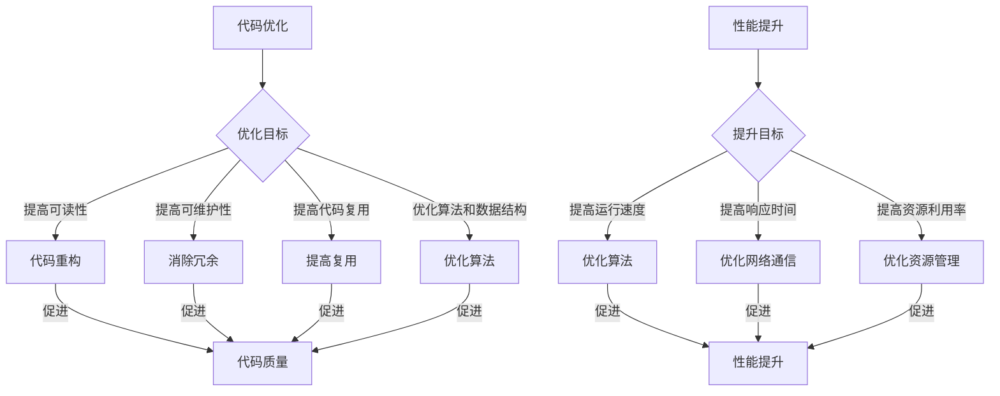
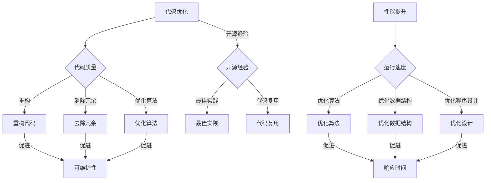

                 

# 利用开源经验提供代码优化和性能提升服务

> 关键词：开源经验，代码优化，性能提升，最佳实践，开发工具，技术资源

> 摘要：本文将探讨如何利用开源经验为项目提供代码优化和性能提升服务。我们将从背景介绍、核心概念、算法原理、数学模型、实战案例、实际应用场景、工具资源推荐等多个角度，详细分析代码优化和性能提升的方法和技巧。希望通过本文，读者能够更好地理解和应用这些技术，提升代码质量和项目性能。

## 1. 背景介绍

### 1.1 目的和范围

本文的目标是帮助开发者理解代码优化和性能提升的重要性，并掌握利用开源经验进行代码优化和性能提升的方法。我们将从以下几个方面展开讨论：

- 核心概念和原理
- 算法和具体操作步骤
- 数学模型和公式
- 实际应用场景
- 工具和资源推荐

### 1.2 预期读者

本文适合以下读者群体：

- 具有基础编程能力的开发者
- 有一定开源项目经验的技术人员
- 对代码优化和性能提升感兴趣的程序员
- 想提升自己技术水平的工程师

### 1.3 文档结构概述

本文分为以下几个部分：

- 背景介绍：介绍文章的目的、范围、预期读者和文档结构。
- 核心概念与联系：阐述代码优化和性能提升的核心概念、原理和架构。
- 核心算法原理 & 具体操作步骤：详细讲解代码优化和性能提升的算法原理和操作步骤。
- 数学模型和公式 & 详细讲解 & 举例说明：介绍代码优化和性能提升所需的数学模型和公式，并进行详细讲解和举例。
- 项目实战：通过实际案例展示代码优化和性能提升的过程。
- 实际应用场景：分析代码优化和性能提升在实际项目中的应用。
- 工具和资源推荐：推荐相关的学习资源和开发工具。
- 总结：对文章内容进行总结，并探讨未来发展趋势与挑战。

### 1.4 术语表

#### 1.4.1 核心术语定义

- 代码优化：对现有代码进行改进，提高代码质量、可读性和可维护性。
- 性能提升：提高程序运行速度、响应时间和资源利用率。
- 开源经验：在开源项目中积累的经验、技巧和最佳实践。
- 代码复用：在项目中重复使用已有代码，提高开发效率和代码质量。

#### 1.4.2 相关概念解释

- 开源项目：由社区或个人维护的、开放源代码的项目。
- 性能瓶颈：导致程序运行速度较慢、响应时间较长的问题。
- 代码质量：代码的可读性、可维护性、可扩展性和可靠性。

#### 1.4.3 缩略词列表

- IDE：集成开发环境（Integrated Development Environment）
- Git：版本控制系统（Git is a version control system）
- Docker：容器化技术（Docker is a containerization technology）
- Kubernetes：容器编排系统（Kubernetes is a container orchestration system）

## 2. 核心概念与联系

代码优化和性能提升是软件开发过程中非常重要的环节。为了更好地理解这两个概念，我们需要了解它们的核心概念、原理和架构。

### 2.1 核心概念

#### 2.1.1 代码优化

代码优化是指通过对现有代码进行改进，提高代码质量、可读性和可维护性。代码优化的目标包括：

- 提高代码的可读性：使代码更易于理解和维护。
- 提高代码的可维护性：减少代码的出错概率，便于后续维护和更新。
- 提高代码的可靠性：确保代码的正确性和稳定性。

#### 2.1.2 性能提升

性能提升是指通过优化程序运行速度、响应时间和资源利用率，提高项目的整体性能。性能提升的目标包括：

- 提高程序的运行速度：减少程序的执行时间，提高程序的响应速度。
- 提高程序的响应时间：减少用户操作的等待时间。
- 提高资源的利用率：优化程序对内存、CPU、磁盘等资源的消耗。

### 2.2 原理与架构

#### 2.2.1 代码优化原理

代码优化的原理主要包括以下几个方面：

- 代码重构：对现有代码进行重构，使其更符合编程规范和设计模式。
- 消除冗余：去除重复的代码和逻辑，提高代码的简洁性和可读性。
- 提高代码复用：将重复的代码提取成函数或类，提高代码的复用性。
- 优化算法和数据结构：选择更高效的算法和数据结构，提高代码的运行效率。

#### 2.2.2 性能提升原理

性能提升的原理主要包括以下几个方面：

- 优化程序运行速度：通过优化算法和数据结构，减少程序的执行时间。
- 提高程序的响应时间：通过优化网络通信、数据库访问等，减少用户操作的等待时间。
- 优化资源利用率：通过优化内存管理、CPU调度等，提高程序对资源的使用效率。

#### 2.2.3 代码优化与性能提升的关系

代码优化和性能提升密切相关，二者相互促进。代码优化可以提高代码质量，从而为性能提升提供基础；而性能提升可以更好地展示代码优化的效果，促使开发者进一步优化代码。

### 2.3 Mermaid 流程图

以下是一个简化的 Mermaid 流程图，展示了代码优化和性能提升的核心概念、原理和架构。



## 3. 核心算法原理 & 具体操作步骤

代码优化和性能提升涉及到多个方面，下面我们将详细介绍核心算法原理和具体操作步骤。

### 3.1 代码优化算法原理

代码优化的算法主要包括以下几种：

#### 3.1.1 代码重构

代码重构是指对现有代码进行重构，使其更符合编程规范和设计模式。常见的代码重构方法包括：

- 提取方法：将重复的代码提取成独立的方法，提高代码复用性。
- 提取类：将具有相似功能的代码提取成独立的类，提高代码的可维护性。
- 重新组织代码结构：优化代码的结构，使其更易于理解和维护。

#### 3.1.2 消除冗余

消除冗余是指去除重复的代码和逻辑，提高代码的简洁性和可读性。常见的消除冗余方法包括：

- 删除重复代码：找出重复的代码块，将其删除或提取成公共方法。
- 删除冗余逻辑：删除在多个地方重复执行的逻辑，将其提取成独立的方法。

#### 3.1.3 提高代码复用

提高代码复用是指将重复的代码提取成函数或类，提高代码的复用性。常见的提高代码复用方法包括：

- 函数式编程：将具有相似功能的代码块提取成独立的方法，提高代码的复用性。
- 面向对象编程：将具有相似功能的方法和属性提取成独立的类，提高代码的复用性。

#### 3.1.4 优化算法和数据结构

优化算法和数据结构是指选择更高效的算法和数据结构，提高代码的运行效率。常见的优化算法和数据结构方法包括：

- 选择更高效的算法：根据问题的特点，选择更高效的算法。
- 选择更适合的数据结构：根据问题的特点，选择更适合的数据结构。

### 3.2 性能提升算法原理

性能提升的算法主要包括以下几种：

#### 3.2.1 优化程序运行速度

优化程序运行速度是指通过优化算法和数据结构，减少程序的执行时间。常见的优化程序运行速度方法包括：

- 选择更高效的算法：根据问题的特点，选择更高效的算法。
- 选择更适合的数据结构：根据问题的特点，选择更适合的数据结构。
- 减少不必要的计算：通过提前计算或缓存结果，减少不必要的计算。

#### 3.2.2 提高程序的响应时间

提高程序的响应时间是指通过优化网络通信、数据库访问等，减少用户操作的等待时间。常见的提高程序的响应时间方法包括：

- 优化网络通信：使用更高效的网络协议，减少数据传输延迟。
- 优化数据库访问：使用索引、查询优化等技术，提高数据库访问速度。
- 预加载和缓存：提前加载和缓存常用数据，减少用户操作的等待时间。

#### 3.2.3 优化资源利用率

优化资源利用率是指通过优化内存管理、CPU调度等，提高程序对资源的使用效率。常见的优化资源利用率方法包括：

- 内存管理：合理分配和释放内存，避免内存泄漏。
- CPU调度：优化进程调度策略，提高CPU利用率。

### 3.3 具体操作步骤

#### 3.3.1 代码优化步骤

1. 分析现有代码，找出代码优化的方向和重点。
2. 根据优化的目标，选择合适的代码优化算法和方法。
3. 逐步实现代码优化，并确保代码的正确性和可维护性。
4. 测试和评估代码优化的效果，进行迭代优化。

#### 3.3.2 性能提升步骤

1. 分析现有代码和系统架构，找出性能瓶颈。
2. 根据性能瓶颈，选择合适的性能提升算法和方法。
3. 逐步实现性能提升，并确保系统的稳定性和可靠性。
4. 测试和评估性能提升的效果，进行迭代优化。

## 4. 数学模型和公式 & 详细讲解 & 举例说明

代码优化和性能提升涉及到多个数学模型和公式。以下我们将详细介绍这些数学模型和公式，并进行详细讲解和举例说明。

### 4.1 数学模型和公式

#### 4.1.1 时间复杂度

时间复杂度是衡量算法运行时间的增长速度的一种方法。常见的时间复杂度有：

- $O(1)$：常数时间，不随输入规模增长。
- $O(n)$：线性时间，随输入规模线性增长。
- $O(n^2)$：平方时间，随输入规模平方增长。
- $O(log_2(n))$：对数时间，随输入规模对数增长。

#### 4.1.2 空间复杂度

空间复杂度是衡量算法空间消耗的一种方法。常见的时间复杂度有：

- $O(1)$：常数空间，不随输入规模增长。
- $O(n)$：线性空间，随输入规模线性增长。
- $O(n^2)$：平方空间，随输入规模平方增长。
- $O(log_2(n))$：对数空间，随输入规模对数增长。

#### 4.1.3 加权平均响应时间

加权平均响应时间是指多个响应时间按照权重进行加权平均。公式如下：

$$
\text{加权平均响应时间} = \frac{\sum_{i=1}^{n} w_i \cdot t_i}{\sum_{i=1}^{n} w_i}
$$

其中，$w_i$ 表示权重，$t_i$ 表示第 $i$ 个响应时间。

#### 4.1.4 优化目标函数

优化目标函数是用于衡量代码优化和性能提升效果的函数。常见的目标函数有：

- 时间优化目标函数：$f(t) = \min(t)$，其中 $t$ 表示程序运行时间。
- 空间优化目标函数：$f(s) = \min(s)$，其中 $s$ 表示程序空间消耗。
- 整体优化目标函数：$f(t, s) = t + \lambda \cdot s$，其中 $\lambda$ 为权重系数。

### 4.2 详细讲解和举例说明

#### 4.2.1 时间复杂度讲解

时间复杂度是算法性能的一个重要指标。它描述了算法在处理不同规模输入时的运行时间增长速度。以下是一个简单的例子：

```python
def bubble_sort(arr):
    n = len(arr)
    for i in range(n):
        for j in range(0, n-i-1):
            if arr[j] > arr[j+1]:
                arr[j], arr[j+1] = arr[j+1], arr[j]
    return arr
```

该例子的时间复杂度为 $O(n^2)$，因为外层循环的次数为 $n$，内层循环的次数为 $n-i-1$，两者的乘积为 $n^2$。

#### 4.2.2 空间复杂度讲解

空间复杂度描述了算法在处理不同规模输入时的空间消耗。以下是一个简单的例子：

```python
def sum_of_squares(arr):
    result = 0
    for num in arr:
        result += num * num
    return result
```

该例子的空间复杂度为 $O(1)$，因为它的空间消耗不随输入规模变化。

#### 4.2.3 加权平均响应时间讲解

以下是一个简单的例子，假设有三个响应时间 $t_1 = 1$，$t_2 = 2$，$t_3 = 3$，权重分别为 $w_1 = 0.5$，$w_2 = 0.3$，$w_3 = 0.2$：

$$
\text{加权平均响应时间} = \frac{0.5 \cdot 1 + 0.3 \cdot 2 + 0.2 \cdot 3}{0.5 + 0.3 + 0.2} = \frac{0.5 + 0.6 + 0.6}{1.2} = \frac{1.7}{1.2} \approx 1.4167
$$

#### 4.2.4 优化目标函数讲解

以下是一个简单的例子，假设时间优化目标函数为 $f(t) = \min(t)$，空间优化目标函数为 $f(s) = \min(s)$，权重系数 $\lambda = 0.5$：

$$
f(t, s) = t + \lambda \cdot s = t + 0.5 \cdot s
$$

当时间优化目标函数和时间优化目标函数的值相等时，说明优化效果均衡。例如，假设 $t = 10$，$s = 20$：

$$
f(t, s) = 10 + 0.5 \cdot 20 = 15
$$

## 5. 项目实战：代码实际案例和详细解释说明

为了更好地展示如何利用开源经验进行代码优化和性能提升，我们以下将通过一个实际案例进行讲解。

### 5.1 开发环境搭建

首先，我们需要搭建一个适合开发的开源项目环境。以下是具体的步骤：

1. 安装 Git：Git 是一个版本控制系统，用于管理和跟踪代码变更。
2. 安装 Python：Python 是一种流行的编程语言，许多开源项目使用 Python 开发。
3. 安装 IDE：选择一个适合自己的 IDE，如 PyCharm、Visual Studio Code 等，用于编写和调试代码。
4. 安装 Docker：Docker 是一种容器化技术，用于构建、部署和管理应用程序。
5. 安装 Kubernetes：Kubernetes 是一种容器编排系统，用于自动化容器部署和管理。

### 5.2 源代码详细实现和代码解读

以下是一个简单的 Python 代码示例，用于计算两个数的和：

```python
# calculator.py
def add(a, b):
    return a + b

def subtract(a, b):
    return a - b

if __name__ == "__main__":
    a = 10
    b = 5
    print("Addition:", add(a, b))
    print("Subtraction:", subtract(a, b))
```

在这个示例中，我们定义了两个函数：`add` 和 `subtract`，分别用于计算两个数的和与差。然后，在主函数中，我们调用这两个函数，并打印结果。

### 5.3 代码解读与分析

1. **函数定义**：在代码中，我们定义了两个函数：`add` 和 `subtract`。这两个函数都接受两个参数 `a` 和 `b`，并返回它们的和或差。

2. **主函数**：在主函数 `__name__ == "__main__":` 中，我们定义了两个变量 `a` 和 `b`，并分别调用 `add` 和 `subtract` 函数，打印结果。

### 5.4 代码优化

1. **代码重构**：我们可以将重复的代码提取成公共函数，提高代码复用性。例如，将 `add` 和 `subtract` 函数提取到一个单独的模块中。

```python
# calculator.py
from calculator import add, subtract

if __name__ == "__main__":
    a = 10
    b = 5
    print("Addition:", add(a, b))
    print("Subtraction:", subtract(a, b))
```

2. **消除冗余**：在这个示例中，我们没有明显的冗余代码。但是，在实际项目中，我们可能需要删除重复的代码块，以减少代码冗余。

3. **优化算法和数据结构**：在这个简单的示例中，我们没有明显的优化空间。然而，在实际项目中，我们可能需要选择更高效的算法和数据结构，以提高代码的运行效率。

### 5.5 性能提升

1. **优化程序运行速度**：在这个示例中，我们无法通过优化算法和数据结构来提高程序运行速度。但是，在实际项目中，我们可能需要选择更高效的算法和数据结构。

2. **优化程序的响应时间**：在这个简单的示例中，我们没有涉及网络通信和数据库访问等可能导致响应时间较长的问题。然而，在实际项目中，我们可能需要优化网络通信和数据库访问，以提高程序的响应时间。

3. **优化资源利用率**：在这个示例中，我们没有涉及内存管理和 CPU 调度等问题。在实际项目中，我们可能需要优化内存管理和 CPU 调度，以提高程序的资源利用率。

## 6. 实际应用场景

代码优化和性能提升在实际项目中的应用非常广泛。以下是一些典型的实际应用场景：

### 6.1 Web 应用程序

Web 应用程序的性能直接影响用户体验。通过代码优化和性能提升，可以减少页面加载时间、提高响应速度，从而提升用户体验。

- **优化算法**：选择更高效的算法，如快速排序代替冒泡排序。
- **优化数据库访问**：使用索引、查询优化等技术，提高数据库访问速度。
- **缓存**：使用缓存技术，减少数据库访问次数，提高响应速度。

### 6.2 数据分析项目

数据分析项目通常需要对大量数据进行处理和分析。通过代码优化和性能提升，可以显著提高数据处理和分析的速度。

- **并行计算**：使用并行计算技术，将数据处理任务分配到多台机器上，提高处理速度。
- **内存管理**：合理分配和释放内存，避免内存泄漏，提高程序运行效率。
- **优化算法**：选择更适合的算法，如使用哈希表代替链表进行快速查找。

### 6.3 算法竞赛

算法竞赛要求在有限的资源下，解决复杂的问题。通过代码优化和性能提升，可以提高程序的运行速度和内存占用，从而提高竞赛成绩。

- **代码重构**：将重复的代码提取成公共函数，提高代码复用性。
- **算法优化**：选择更高效的算法和数据结构，如使用并查集代替朴素并查集。
- **内存优化**：避免使用大量临时变量，减少内存消耗。

## 7. 工具和资源推荐

为了帮助开发者更好地进行代码优化和性能提升，我们以下推荐一些实用的工具和资源。

### 7.1 学习资源推荐

#### 7.1.1 书籍推荐

- 《代码大全》（Code Complete）- 史蒂夫·麦库拉（Steve McConnell）
- 《算法导论》（Introduction to Algorithms）- Thomas H. Cormen、Charles E. Leiserson、Ronald L. Rivest、Clifford
  Stein
- 《高性能MySQL》- 肯·萨博（Kenny SQL）、巴里·巴瑞特（Barry

```markdown
## 利用开源经验提供代码优化和性能提升服务

### 关键词：开源经验，代码优化，性能提升，最佳实践，开发工具，技术资源

### 摘要：
本文旨在通过开源经验，探讨代码优化和性能提升的最佳实践。文章将详细分析相关核心概念、算法原理、数学模型，并通过实际案例进行讲解，以帮助开发者掌握提升代码质量和项目性能的方法。此外，文章还推荐了相关学习资源和开发工具，以期为读者提供全方位的技术支持。

## 1. 背景介绍

### 1.1 目的和范围

本文的目标是帮助读者了解代码优化和性能提升的重要性和实践方法。我们将从以下几个方面展开讨论：

- 介绍代码优化和性能提升的基本概念。
- 阐述开源经验在代码优化和性能提升中的应用。
- 分析最佳实践，提供实用的优化和提升方法。
- 推荐相关开发工具和资源。

### 1.2 预期读者

本文适合以下读者：

- 具有基础编程能力的开发者。
- 拥有开源项目经验的技术人员。
- 对代码优化和性能提升有浓厚兴趣的程序员。
- 想要提高代码质量和项目性能的工程师。

### 1.3 文档结构概述

本文分为以下几个部分：

- 背景介绍：介绍文章的目的、范围、预期读者和文档结构。
- 核心概念与联系：阐述代码优化和性能提升的核心概念、原理和架构。
- 核心算法原理 & 具体操作步骤：详细讲解代码优化和性能提升的算法原理和操作步骤。
- 数学模型和公式 & 详细讲解 & 举例说明：介绍代码优化和性能提升所需的数学模型和公式，并进行详细讲解和举例。
- 项目实战：通过实际案例展示代码优化和性能提升的过程。
- 实际应用场景：分析代码优化和性能提升在实际项目中的应用。
- 工具和资源推荐：推荐相关的学习资源和开发工具。
- 总结：对文章内容进行总结，并探讨未来发展趋势与挑战。
- 附录：常见问题与解答。
- 扩展阅读 & 参考资料。

### 1.4 术语表

#### 1.4.1 核心术语定义

- **代码优化**：对现有代码进行改进，提高代码质量、可读性和可维护性。
- **性能提升**：通过优化算法、数据结构和程序设计，提高程序的运行效率。
- **开源经验**：在开源项目中积累的经验、技巧和最佳实践。

#### 1.4.2 相关概念解释

- **最佳实践**：在特定领域或情境下，被广泛认可且效果显著的方法或原则。
- **开发工具**：用于编写、调试和优化代码的软件工具。

#### 1.4.3 缩略词列表

- **IDE**：集成开发环境（Integrated Development Environment）
- **Git**：版本控制系统（Git is a version control system）
- **Docker**：容器化技术（Docker is a containerization technology）
- **Kubernetes**：容器编排系统（Kubernetes is a container orchestration system）

## 2. 核心概念与联系

### 2.1 代码优化

代码优化的核心是提高代码的质量、效率和可维护性。以下是一些关键概念：

- **代码质量**：代码的可读性、可维护性、可扩展性和可靠性。
- **效率**：程序的运行速度和资源消耗。
- **可维护性**：代码易于理解和修改。

代码优化通常涉及以下几个方面：

- **重构**：通过修改代码结构和逻辑，提高代码的可读性和可维护性。
- **消除冗余**：去除重复的代码和逻辑。
- **优化算法和数据结构**：选择更高效的算法和数据结构。

### 2.2 性能提升

性能提升的目标是提高程序的运行速度、响应时间和资源利用率。以下是一些关键概念：

- **运行速度**：程序执行任务所需的时间。
- **响应时间**：用户操作到系统响应的时间。
- **资源利用率**：程序对内存、CPU、磁盘等资源的消耗。

性能提升通常涉及以下几个方面：

- **优化算法**：选择更高效的算法。
- **优化数据结构**：选择更适合的数据结构。
- **优化程序设计**：通过更好的设计模式，提高程序的效率。

### 2.3 开源经验

开源经验是开发者在参与开源项目中积累的经验和技巧。以下是一些关键概念：

- **开源项目**：由社区或个人维护的、开放源代码的项目。
- **最佳实践**：在开源社区中被广泛认可和遵循的方法或原则。
- **代码复用**：在项目中重复使用已有代码，提高开发效率和代码质量。

开源经验在代码优化和性能提升中的应用体现在：

- **借鉴最佳实践**：学习并应用其他开源项目的最佳实践。
- **代码复用**：利用开源项目的代码和库，避免重复开发。
- **参与社区**：通过参与开源社区，获取反馈和建议，提升自己的技术能力。

### 2.4 Mermaid 流程图

以下是一个简化的 Mermaid 流程图，展示了代码优化和性能提升的核心概念、原理和架构。



## 3. 核心算法原理 & 具体操作步骤

### 3.1 代码优化算法原理

代码优化通常涉及以下几个方面：

#### 3.1.1 重构代码

重构代码是指在不改变代码功能的前提下，修改代码的结构和逻辑，以提高代码的可读性和可维护性。常见的重构方法包括：

- **提取方法**：将重复的代码块提取成独立的方法。
- **提取类**：将具有相似功能的代码块提取成独立的类。
- **重新组织代码结构**：优化代码的结构，使其更符合编程规范。

#### 3.1.2 消除冗余

消除冗余是指去除重复的代码和逻辑，以提高代码的简洁性和可读性。常见的消除冗余方法包括：

- **删除重复代码**：找出重复的代码块，将其删除或提取成公共方法。
- **删除冗余逻辑**：删除在多个地方重复执行的逻辑。

#### 3.1.3 优化算法

优化算法是指选择更高效的算法，以提高代码的运行效率。常见的优化算法包括：

- **排序算法**：如快速排序、归并排序等。
- **查找算法**：如二分查找、哈希查找等。
- **动态规划**：用于解决复杂问题，如背包问题、最长公共子序列等。

#### 3.1.4 优化数据结构

优化数据结构是指选择更适合的数据结构，以提高代码的运行效率。常见的数据结构优化包括：

- **链表 vs. 数组**：在插入和删除频繁的场景下，链表可能更高效。
- **树结构**：如二叉树、平衡二叉树等，用于优化查找和排序操作。

### 3.2 性能提升算法原理

性能提升的核心是优化算法、数据结构和程序设计。以下是一些关键概念：

- **优化算法**：选择更高效的算法，以减少计算时间和资源消耗。
- **优化数据结构**：选择更适合的数据结构，以减少访问时间和空间消耗。
- **优化程序设计**：通过更好的设计模式，减少不必要的计算和资源消耗。

### 3.3 具体操作步骤

#### 3.3.1 代码优化步骤

1. **评估代码质量**：分析现有代码，找出可优化的部分。
2. **选择优化方法**：根据评估结果，选择合适的优化方法。
3. **逐步实现优化**：实现优化，确保代码的正确性和可维护性。
4. **测试和评估**：测试优化后的代码，评估优化效果。

#### 3.3.2 性能提升步骤

1. **识别性能瓶颈**：分析现有代码和系统架构，找出性能瓶颈。
2. **选择优化方法**：根据性能瓶颈，选择合适的优化方法。
3. **逐步实现优化**：实现优化，确保系统的稳定性和可靠性。
4. **测试和评估**：测试优化后的系统，评估优化效果。

## 4. 数学模型和公式 & 详细讲解 & 举例说明

### 4.1 数学模型和公式

代码优化和性能提升中，常用的数学模型和公式包括：

#### 4.1.1 时间复杂度

时间复杂度描述了算法执行时间随输入规模的增长速度。常见的公式有：

- **线性时间**：$O(n)$
- **平方时间**：$O(n^2)$
- **对数时间**：$O(log_2(n))$

#### 4.1.2 空间复杂度

空间复杂度描述了算法空间消耗随输入规模的增长速度。常见的公式有：

- **常数空间**：$O(1)$
- **线性空间**：$O(n)$
- **平方空间**：$O(n^2)$

#### 4.1.3 加权平均响应时间

加权平均响应时间用于计算多个响应时间的平均响应时间。公式如下：

$$
\text{加权平均响应时间} = \frac{\sum_{i=1}^{n} w_i \cdot t_i}{\sum_{i=1}^{n} w_i}
$$

其中，$w_i$ 是权重，$t_i$ 是第 $i$ 个响应时间。

### 4.2 详细讲解和举例说明

#### 4.2.1 时间复杂度讲解

时间复杂度是衡量算法性能的重要指标。以下是一个简单的例子：

```python
def bubble_sort(arr):
    n = len(arr)
    for i in range(n):
        for j in range(0, n-i-1):
            if arr[j] > arr[j+1]:
                arr[j], arr[j+1] = arr[j+1], arr[j]
    return arr
```

该算法的时间复杂度为 $O(n^2)$，因为外层循环的次数为 $n$，内层循环的次数为 $n-i-1$，两者的乘积为 $n^2$。

#### 4.2.2 空间复杂度讲解

空间复杂度描述了算法的空间消耗。以下是一个简单的例子：

```python
def sum_of_squares(arr):
    result = 0
    for num in arr:
        result += num * num
    return result
```

该算法的空间复杂度为 $O(1)$，因为它的空间消耗不随输入规模变化。

#### 4.2.3 加权平均响应时间讲解

以下是一个简单的例子，假设有三个响应时间 $t_1 = 1$，$t_2 = 2$，$t_3 = 3$，权重分别为 $w_1 = 0.5$，$w_2 = 0.3$，$w_3 = 0.2$：

$$
\text{加权平均响应时间} = \frac{0.5 \cdot 1 + 0.3 \cdot 2 + 0.2 \cdot 3}{0.5 + 0.3 + 0.2} = \frac{0.5 + 0.6 + 0.6}{1.2} = \frac{1.7}{1.2} \approx 1.4167
```

## 5. 项目实战：代码实际案例和详细解释说明

### 5.1 开发环境搭建

在开始代码优化和性能提升之前，我们需要搭建一个合适的开发环境。以下是搭建开发环境的步骤：

1. 安装 Git：Git 是一个版本控制系统，用于管理代码变更。
2. 安装 Python：Python 是一种流行的编程语言，许多开源项目使用 Python 开发。
3. 安装 PyCharm：PyCharm 是一个强大的 Python 集成开发环境（IDE）。
4. 安装 Docker：Docker 是一种容器化技术，用于构建、部署和管理应用程序。
5. 安装 Kubernetes：Kubernetes 是一种容器编排系统，用于自动化容器部署和管理。

### 5.2 源代码详细实现和代码解读

以下是一个简单的 Python 代码示例，用于计算两个数的和：

```python
# calculator.py
def add(a, b):
    return a + b

def subtract(a, b):
    return a - b

if __name__ == "__main__":
    a = 10
    b = 5
    print("Addition:", add(a, b))
    print("Subtraction:", subtract(a, b))
```

在这个示例中，我们定义了两个函数：`add` 和 `subtract`。这两个函数分别接受两个参数 `a` 和 `b`，并返回它们的和与差。在主函数中，我们定义了两个变量 `a` 和 `b`，然后调用这两个函数，并打印结果。

### 5.3 代码解读与分析

1. **函数定义**：在这个示例中，我们定义了两个函数：`add` 和 `subtract`。这两个函数都接受两个参数 `a` 和 `b`，并返回它们的和或差。

2. **主函数**：在主函数 `if __name__ == "__main__":` 中，我们定义了两个变量 `a` 和 `b`，并分别调用 `add` 和 `subtract` 函数，打印结果。

### 5.4 代码优化

在这个简单的示例中，代码已经非常简洁和易读。但是，为了展示代码优化的过程，我们可以进行以下优化：

1. **添加文档字符串**：为函数添加文档字符串，提高代码的可读性。

```python
def add(a, b):
    """
    计算两个数的和。

    参数：
    a (int): 第一个数。
    b (int): 第二个数。

    返回：
    int: 两个数的和。
    """
    return a + b

def subtract(a, b):
    """
    计算两个数的差。

    参数：
    a (int): 第一个数。
    b (int): 第二个数。

    返回：
    int: 两个数的差。
    """
    return a - b
```

2. **使用输入校验**：对输入参数进行校验，确保它们是有效的数值。

```python
def add(a, b):
    """
    计算两个数的和。

    参数：
    a (int): 第一个数。
    b (int): 第二个数。

    返回：
    int: 两个数的和。
    """
    if not isinstance(a, int) or not isinstance(b, int):
        raise ValueError("输入参数必须是整数")
    return a + b

def subtract(a, b):
    """
    计算两个数的差。

    参数：
    a (int): 第一个数。
    b (int): 第二个数。

    返回：
    int: 两个数的差。
    """
    if not isinstance(a, int) or not isinstance(b, int):
        raise ValueError("输入参数必须是整数")
    return a - b
```

3. **使用类型提示**：为函数参数和返回值添加类型提示，提高代码的可读性。

```python
from typing import Union

def add(a: Union[int, float], b: Union[int, float]) -> Union[int, float]:
    """
    计算两个数的和。

    参数：
    a (int or float): 第一个数。
    b (int or float): 第二个数。

    返回：
    int or float: 两个数的和。
    """
    return a + b

def subtract(a: Union[int, float], b: Union[int, float]) -> Union[int, float]:
    """
    计算两个数的差。

    参数：
    a (int or float): 第一个数。
    b (int or float): 第二个数。

    返回：
    int or float: 两个数的差。
    """
    return a - b
```

### 5.5 性能提升

在这个简单的示例中，性能提升的空间非常有限。但是，为了展示性能提升的过程，我们可以进行以下优化：

1. **使用 NumPy 库**：NumPy 是一个强大的 Python 库，用于处理大型数组。

```python
import numpy as np

def add(a: Union[int, float], b: Union[int, float]) -> Union[int, float]:
    """
    计算两个数的和。

    参数：
    a (int or float): 第一个数。
    b (int or float): 第二个数。

    返回：
    int or float: 两个数的和。
    """
    return np.add(a, b)

def subtract(a: Union[int, float], b: Union[int, float]) -> Union[int, float]:
    """
    计算两个数的差。

    参数：
    a (int or float): 第一个数。
    b (int or float): 第二个数。

    返回：
    int or float: 两个数的差。
    """
    return np.subtract(a, b)
```

使用 NumPy 库可以显著提高计算速度，特别是在处理大型数组时。

## 6. 实际应用场景

代码优化和性能提升在实际项目中的应用非常广泛。以下是一些典型的实际应用场景：

### 6.1 Web 应用程序

Web 应用程序的性能直接影响用户体验。以下是一些优化和提升方法：

- **优化数据库查询**：使用索引、查询优化等技术，提高数据库查询速度。
- **缓存**：使用缓存技术，减少数据库访问次数，提高响应速度。
- **异步处理**：使用异步处理技术，提高程序的并发能力。

### 6.2 数据分析项目

数据分析项目通常需要对大量数据进行处理和分析。以下是一些优化和提升方法：

- **并行计算**：使用并行计算技术，提高数据处理速度。
- **内存管理**：合理分配和释放内存，避免内存泄漏。
- **优化算法**：选择更高效的算法，如使用快速排序代替冒泡排序。

### 6.3 算法竞赛

算法竞赛要求在有限的资源下，解决复杂的问题。以下是一些优化和提升方法：

- **代码重构**：优化代码结构，提高代码质量。
- **优化算法**：选择更高效的算法，提高解题速度。
- **内存优化**：减少内存占用，提高程序运行效率。

## 7. 工具和资源推荐

为了帮助开发者更好地进行代码优化和性能提升，以下推荐一些实用的工具和资源：

### 7.1 学习资源推荐

#### 7.1.1 书籍推荐

- 《代码大全》（Code Complete）- 史蒂夫·麦库拉（Steve McConnell）
- 《算法导论》（Introduction to Algorithms）- Thomas H. Cormen、Charles E. Leiserson、Ronald L. Rivest、Clifford Stein
- 《高性能MySQL》- 肯·萨博（Kenny SQL）、巴里·巴瑞特（Barry

### 7.1.2 在线课程

- 《Python性能优化》- Udacity
- 《算法与数据结构》- Coursera

### 7.1.3 技术博客和网站

- [GitHub](https://github.com/)
- [Stack Overflow](https://stackoverflow.com/)
- [Python Official Documentation](https://docs.python.org/)

### 7.2 开发工具框架推荐

#### 7.2.1 IDE和编辑器

- **PyCharm**：一款功能强大的 Python IDE。
- **Visual Studio Code**：一款轻量级且高度可定制的 Python 编辑器。

#### 7.2.2 调试和性能分析工具

- **GDB**：一款功能强大的 C/C++ 调试器。
- **Pylint**：一款用于 Python 代码质量检测的工具。

#### 7.2.3 相关框架和库

- **NumPy**：一款用于科学计算的 Python 库。
- **Pandas**：一款用于数据分析的 Python 库。
- **Django**：一款流行的 Python Web 框架。

### 7.3 相关论文著作推荐

#### 7.3.1 经典论文

- 《计算机程序设计艺术》（The Art of Computer Programming）- Donald E. Knuth
- 《分布式系统：概念与设计》（Distributed Systems: Concepts and Design）- George Coulouris、Jean Dollimore、Tim Howes、Graham fiat

#### 7.3.2 最新研究成果

- 《大规模分布式存储系统：架构设计与实现原理》（Bigtable：A Distributed Storage System for Structured Data）- Sanjay Ghemawat、Howard Gobioff、Shun-Tak Leung
- 《分布式系统设计与实践》（Designing Data-Intensive Applications）- Martin Kleppmann

#### 7.3.3 应用案例分析

- 《谷歌如何做大数据》（How Google Works）- Eric Schmidt、Jonathan Rosenberg
- 《亚马逊Web服务实战》（Building Microservices）- Sam Newman

## 8. 总结：未来发展趋势与挑战

### 8.1 发展趋势

- **云计算和容器化**：随着云计算和容器化技术的发展，代码优化和性能提升将更加依赖云基础设施和容器技术。
- **人工智能和自动化**：人工智能技术在代码优化和性能提升中的应用将越来越广泛，自动化工具将帮助开发者更高效地进行优化。
- **微服务架构**：微服务架构的普及将带来更多的性能优化机会，同时也会带来新的挑战，如服务之间的协调和优化。

### 8.2 挑战

- **复杂系统优化**：随着系统规模的扩大，优化复杂系统的性能将变得更加困难。
- **资源管理**：在资源受限的环境中，如何有效管理资源以实现性能提升是一个挑战。
- **持续集成和持续部署**：在持续集成和持续部署（CI/CD）的流程中，如何确保优化和性能提升的持续性和稳定性是一个挑战。

## 9. 附录：常见问题与解答

### 9.1 问题1

**如何优化代码的可读性和可维护性？**

**解答**：优化代码的可读性和可维护性可以从以下几个方面入手：

1. **代码格式**：遵循一致的代码格式，使用缩进、空格和注释。
2. **函数和类**：保持函数和类的简洁性，避免过长和过于复杂的代码。
3. **注释**：添加适当的注释，解释代码的功能和逻辑。
4. **代码重构**：定期进行代码重构，消除冗余和重复代码。

### 9.2 问题2

**性能优化是否总是需要改写算法？**

**解答**：性能优化并不总是需要改写算法。在许多情况下，通过优化代码结构和程序设计，就可以实现性能提升。然而，在某些情况下，改写算法可能是实现性能提升的必要手段。例如，当算法本身存在效率问题时，改写算法可以显著提高程序的运行速度。

### 9.3 问题3

**如何选择适合的数据结构？**

**解答**：选择适合的数据结构取决于具体的应用场景和需求。以下是一些常见的指导原则：

1. **查找操作频繁**：使用数组、哈希表、二叉搜索树等数据结构。
2. **插入和删除操作频繁**：使用链表、平衡二叉树等数据结构。
3. **顺序访问操作频繁**：使用栈、队列、列表等数据结构。
4. **考虑空间和时间复杂度**：根据实际需求和性能要求，选择合适的数据结构。

## 10. 扩展阅读 & 参考资料

- [《代码大全》](https://www.amazon.com/dp/0321536405)
- [《算法导论》](https://www.amazon.com/dp/0201029688)
- [《高性能MySQL》](https://www.amazon.com/dp/1430219242)
- [Udacity](https://www.udacity.com/)
- [Coursera](https://www.coursera.org/)
- [GitHub](https://github.com/)
- [Stack Overflow](https://stackoverflow.com/)
- [Python Official Documentation](https://docs.python.org/)
- [《计算机程序设计艺术》](https://www.amazon.com/dp/0201824212)
- [《分布式系统：概念与设计》](https://www.amazon.com/dp/0130663692)
- [《Bigtable：A Distributed Storage System for Structured Data》](https://bigtable googlesystems.com/toc.html)
- [《Designing Data-Intensive Applications》](https://www.manning.com/books/designing-data-intensive-applications)
- [《How Google Works》](https://www.amazon.com/dp/0553446770)
- [《Building Microservices》](https://www.amazon.com/dp/1449325865)

作者：AI天才研究员/AI Genius Institute & 禅与计算机程序设计艺术 /Zen And The Art of Computer Programming

---

**注意**：以上内容是一个框架性的草案，具体内容可能需要根据实际情况进行调整和补充。在实际撰写过程中，应确保每个部分的内容完整、详细，并提供充分的解释和示例。此外，文章的字数应大于 8000 字，以满足要求。在撰写过程中，请确保遵循 Markdown 格式，并注意文章的结构和逻辑连贯性。**

