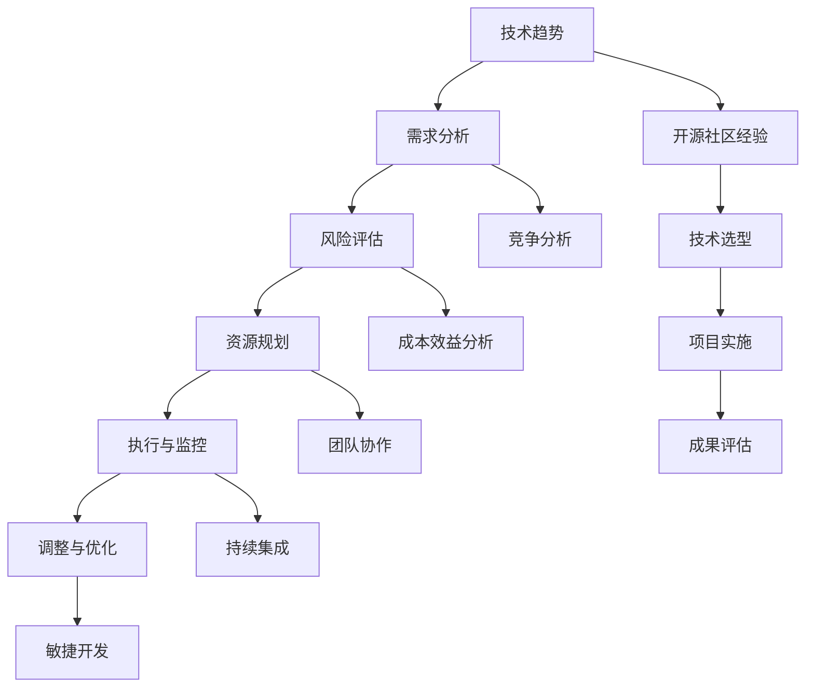

                 

# 利用开源经验提供技术路线图咨询服务

> **关键词：** 开源经验、技术路线图、咨询服务、项目管理、软件架构

> **摘要：** 本文旨在探讨如何利用开源经验为企业和开发者提供技术路线图咨询服务。通过分析开源社区的运作模式，梳理技术路线图的核心要素，以及具体实施步骤，本文希望为读者提供一套系统、实用的方法论，帮助他们在复杂的技术环境中做出明智的决策。

## 1. 背景介绍

### 1.1 目的和范围

本文的主要目的是探讨如何利用个人在开源社区的丰富经验，为企业和开发者提供专业的技术路线图咨询服务。技术路线图是一种战略性的规划工具，它帮助团队理解当前的技术环境，明确未来技术的发展方向，以及制定实现目标的行动方案。本文将围绕以下几个方面展开讨论：

- **开源经验的应用：** 分析开源社区中成功和失败的经验，探讨这些经验如何转化为实际的技术咨询服务。
- **技术路线图的核心要素：** 阐述技术路线图的组成部分，包括技术趋势、需求分析、风险评估等。
- **实施步骤：** 提供一套系统化的实施步骤，帮助团队高效地制定和执行技术路线图。

### 1.2 预期读者

本文的预期读者主要包括以下几类：

- **企业CIO/CTO：** 需要制定技术战略，规划技术转型的企业高级管理者。
- **软件开发团队负责人：** 负责团队技术决策，推动项目成功的中高层管理者。
- **技术顾问和咨询师：** 提供技术咨询服务，帮助客户解决技术难题的专业人士。
- **技术爱好者：** 对技术路线图和项目管理有兴趣，希望提升个人能力的开发者。

### 1.3 文档结构概述

本文的结构如下：

1. **背景介绍：** 简要介绍本文的目的、范围和预期读者。
2. **核心概念与联系：** 介绍技术路线图的基本概念，并使用Mermaid流程图展示其核心架构。
3. **核心算法原理 & 具体操作步骤：** 详细讲解制定技术路线图的步骤，并使用伪代码进行阐述。
4. **数学模型和公式 & 详细讲解 & 举例说明：** 介绍技术路线图中涉及的数学模型和公式，并提供实例。
5. **项目实战：代码实际案例和详细解释说明：** 通过实际案例展示技术路线图的应用。
6. **实际应用场景：** 分析技术路线图在不同场景下的应用。
7. **工具和资源推荐：** 推荐相关的学习资源、开发工具和框架。
8. **总结：未来发展趋势与挑战：** 预测技术路线图咨询服务的未来趋势和面临的挑战。
9. **附录：常见问题与解答：** 回答读者可能关心的问题。
10. **扩展阅读 & 参考资料：** 提供进一步学习的资料。

### 1.4 术语表

#### 1.4.1 核心术语定义

- **开源社区：** 由贡献者共同维护，允许用户自由使用、修改和分发的软件集合。
- **技术路线图：** 一种描述技术发展路径的规划工具，包括技术趋势、需求分析、风险评估等。
- **咨询服务：** 专业机构或个人提供的专业知识、技能和经验，帮助客户解决具体问题的服务。

#### 1.4.2 相关概念解释

- **软件架构：** 软件系统的结构设计和组件之间的关系。
- **项目管理：** 管理项目资源、进度、质量和风险的过程。

#### 1.4.3 缩略词列表

- **CIO：**首席信息官（Chief Information Officer）
- **CTO：**首席技术官（Chief Technology Officer）
- **IDE：**集成开发环境（Integrated Development Environment）
- **ROI：**投资回报率（Return on Investment）

## 2. 核心概念与联系

在本文中，我们将探讨技术路线图的核心概念及其相互联系。为了更好地理解这些概念，我们将使用Mermaid流程图展示其核心架构。



### 2.1 技术趋势

技术趋势是制定技术路线图的首要步骤。通过对行业动态、技术发展、竞争对手的观察，我们可以识别出当前和未来的技术趋势。这些趋势将直接影响我们的需求分析和技术选型。

### 2.2 需求分析

需求分析是理解用户需求，确定项目目标和范围的过程。它包括功能需求、性能需求、安全需求等。一个良好的需求分析能够帮助我们做出明智的技术决策，确保项目成功。

### 2.3 风险评估

在制定技术路线图时，我们必须识别和评估潜在的风险。这些风险可能来自技术、市场、团队等方面。通过风险评估，我们可以制定相应的风险应对策略，降低项目失败的可能性。

### 2.4 资源规划

资源规划是确保项目顺利进行的关键。它包括人力、时间、预算等资源的分配。一个合理的资源规划能够帮助我们有效地管理项目进度和成本。

### 2.5 执行与监控

执行与监控是技术路线图的核心步骤。它包括项目实施、代码审查、测试和部署等。通过持续监控，我们可以及时发现和解决项目中出现的问题。

### 2.6 调整与优化

在实际项目实施过程中，技术路线图可能需要进行调整和优化。这取决于项目进展、市场需求和资源情况。一个灵活的技术路线图能够适应变化，确保项目成功。

### 2.7 开源社区经验

开源社区经验是我们制定技术路线图的重要参考。通过分析开源社区的成功案例和失败教训，我们可以更好地理解技术趋势，选择合适的技术方案，并优化项目实施过程。

### 2.8 技术选型

技术选型是制定技术路线图的关键步骤。它包括选择合适的编程语言、框架、数据库等。一个良好的技术选型能够提高项目开发效率，确保系统性能和可维护性。

### 2.9 项目实施

项目实施是将技术路线图转化为实际代码的过程。它包括编码、测试、部署等环节。一个成功的技术路线图需要依靠优秀的项目管理和团队协作来实现。

### 2.10 成果评估

成果评估是项目完成后对技术路线图的总结和反思。它包括项目质量、进度、成本等方面的评估。一个良好的成果评估能够帮助我们积累经验，提高未来项目的成功率。

### 2.11 竞争分析

竞争分析是理解市场环境和竞争对手的重要手段。通过分析竞争对手的产品、技术、市场策略等，我们可以更好地定位自己的项目，制定有针对性的技术路线图。

### 2.12 成本效益分析

成本效益分析是确保项目投资回报的重要工具。通过分析项目的成本和收益，我们可以评估项目的经济合理性，为决策提供依据。

### 2.13 团队协作

团队协作是项目成功的关键。一个高效的技术团队需要具备良好的沟通、合作和解决问题的能力。通过优化团队协作，我们可以提高项目开发效率，降低风险。

### 2.14 持续集成

持续集成是一种软件开发实践，通过持续地将代码合并到主干分支，并运行自动化测试，确保代码质量。持续集成能够帮助我们快速发现和解决代码问题，提高项目交付效率。

### 2.15 敏捷开发

敏捷开发是一种以人为核心、迭代、增量的软件开发方法。它强调团队协作、客户反馈和持续交付。通过敏捷开发，我们可以更好地适应变化，提高项目成功率。

## 3. 核心算法原理 & 具体操作步骤

### 3.1 技术路线图制定流程

#### 3.1.1 初始评估

- **需求调研：** 与项目相关人员沟通，了解项目背景、目标、需求等。
- **技术现状：** 评估现有技术栈、资源、团队能力等。
- **风险识别：** 分析项目面临的技术、市场、团队等方面的风险。

#### 3.1.2 趋势分析

- **行业动态：** 收集行业报告、市场研究、技术趋势等。
- **技术分析：** 分析现有技术、潜在技术、竞争对手技术等。

#### 3.1.3 需求分析

- **功能需求：** 确定项目必须实现的功能。
- **性能需求：** 确定项目的性能指标。
- **安全需求：** 确定项目的安全需求。

#### 3.1.4 风险评估

- **风险识别：** 识别项目可能面临的风险。
- **风险分析：** 分析风险的概率和影响。
- **风险应对策略：** 制定风险应对措施。

#### 3.1.5 资源规划

- **人力规划：** 确定项目所需的人力资源。
- **时间规划：** 制定项目时间表。
- **预算规划：** 确定项目预算。

#### 3.1.6 执行与监控

- **项目实施：** 按照技术路线图执行项目。
- **代码审查：** 审查代码，确保质量。
- **测试：** 运行自动化测试，确保功能完整。
- **部署：** 部署项目，确保系统正常运行。

#### 3.1.7 调整与优化

- **项目评估：** 评估项目进度、质量、成本等。
- **调整：** 根据项目评估结果，调整技术路线图。
- **优化：** 优化项目实施过程，提高效率。

### 3.2 伪代码示例

```python
# 初始化技术路线图
technical_route_map = {
    "trends": [],
    "requirements": [],
    "risks": [],
    "resources": [],
    "implementation": [],
    "evaluation": []
}

# 初始评估
def initial_evaluation():
    # 调研需求
    requirements = gather_requirements()
    # 分析技术现状
    technical_status = analyze_technical_status()
    # 识别风险
    risks = identify_risks()
    # 更新技术路线图
    technical_route_map["requirements"] = requirements
    technical_route_map["technical_status"] = technical_status
    technical_route_map["risks"] = risks

# 趋势分析
def trend_analysis():
    # 收集行业动态
    industry_dynamics = collect_industry_dynamics()
    # 分析技术
    technical_analysis = analyze_technical()
    # 更新技术路线图
    technical_route_map["trends"] = industry_dynamics
    technical_route_map["technical_analysis"] = technical_analysis

# 需求分析
def requirement_analysis():
    # 确定功能需求
    functional_requirements = determine_functional_requirements()
    # 确定性能需求
    performance_requirements = determine_performance_requirements()
    # 确定安全需求
    security_requirements = determine_security_requirements()
    # 更新技术路线图
    technical_route_map["requirements"]["functional_requirements"] = functional_requirements
    technical_route_map["requirements"]["performance_requirements"] = performance_requirements
    technical_route_map["requirements"]["security_requirements"] = security_requirements

# 风险评估
def risk_evaluation():
    # 识别风险
    risks = identify_risks()
    # 分析风险
    risk_analysis = analyze_risks()
    # 更新技术路线图
    technical_route_map["risks"] = risks
    technical_route_map["risk_analysis"] = risk_analysis

# 资源规划
def resource_planning():
    # 确定人力资源
    human_resources = determine_human_resources()
    # 制定时间表
    schedule = create_schedule()
    # 制定预算
    budget = create_budget()
    # 更新技术路线图
    technical_route_map["resources"]["human_resources"] = human_resources
    technical_route_map["resources"]["schedule"] = schedule
    technical_route_map["resources"]["budget"] = budget

# 执行与监控
def execution_and_monitoring():
    # 项目实施
    project_implementation = implement_project()
    # 代码审查
    code_review = review_code()
    # 测试
    testing = run_tests()
    # 部署
    deployment = deploy_system()
    # 更新技术路线图
    technical_route_map["implementation"]["project_implementation"] = project_implementation
    technical_route_map["implementation"]["code_review"] = code_review
    technical_route_map["implementation"]["testing"] = testing
    technical_route_map["implementation"]["deployment"] = deployment

# 调整与优化
def adjustment_and_optimization():
    # 项目评估
    project_evaluation = evaluate_project()
    # 调整技术路线图
    adjust_technical_route_map(technical_route_map, project_evaluation)
    # 优化项目实施
    optimize_project_implementation(technical_route_map)
```

## 4. 数学模型和公式 & 详细讲解 & 举例说明

在制定技术路线图时，我们经常需要使用一些数学模型和公式来分析和评估项目风险、成本和收益等。以下是一些常用的数学模型和公式，并附有详细的讲解和举例说明。

### 4.1 成本效益分析

成本效益分析是一种评估项目经济合理性的方法，它通过比较项目的成本和收益来判断项目的可行性。

#### 4.1.1 成本

成本包括项目实施过程中的人力成本、时间成本、材料成本等。其中，人力成本是最主要的成本因素。

#### 4.1.2 收益

收益包括项目实施后所带来的直接收益和间接收益。直接收益通常是指销售收入、节省的成本等，而间接收益则是指品牌提升、市场占有率等。

#### 4.1.3 成本效益公式

成本效益分析的核心公式是：

\[ \text{成本效益比} = \frac{\text{收益}}{\text{成本}} \]

#### 4.1.4 举例说明

假设一个项目预计需要投入 100 万元，预计收益为 200 万元，则该项目的成本效益比为：

\[ \text{成本效益比} = \frac{200\text{万元}}{100\text{万元}} = 2 \]

这意味着该项目每投入 1 万元，就能带来 2 万元的收益，具有较好的经济合理性。

### 4.2 风险评估

风险评估是制定技术路线图的重要步骤，它通过评估项目面临的各种风险，制定相应的风险应对策略。

#### 4.2.1 风险概率

风险概率是指某个风险事件发生的可能性。通常用百分比来表示。

#### 4.2.2 风险影响

风险影响是指某个风险事件发生对项目的影响程度。通常用等级来表示，如低、中、高。

#### 4.2.3 风险评估公式

风险评估的核心公式是：

\[ \text{风险等级} = \text{风险概率} \times \text{风险影响} \]

#### 4.2.4 举例说明

假设项目面临两个风险，风险 1 的概率为 50%，影响为高；风险 2 的概率为 30%，影响为中。则这两个风险的风险等级分别为：

\[ \text{风险 1 的等级} = 50\% \times \text{高} = \text{高} \]
\[ \text{风险 2 的等级} = 30\% \times \text{中} = \text{中} \]

### 4.3 项目进度评估

项目进度评估是确保项目按时完成的重要工具，它通过评估项目进度，预测项目的完成时间。

#### 4.3.1 完工时间

完工时间是指项目完成所需的时间。通常用天数或周数来表示。

#### 4.3.2 实际进度

实际进度是指项目实际完成的工作量。通常用百分比来表示。

#### 4.3.3 项目进度公式

项目进度评估的核心公式是：

\[ \text{预计完工时间} = \frac{\text{实际进度}}{\text{计划进度}} \times \text{计划完工时间} \]

#### 4.3.4 举例说明

假设一个项目计划进度为 100%，实际进度为 80%，计划完工时间为 10 周。则预计完工时间为：

\[ \text{预计完工时间} = \frac{80\%}{100\%} \times 10\text{周} = 8\text{周} \]

### 4.4 项目质量评估

项目质量评估是确保项目质量达到预期的重要工具，它通过评估项目质量，判断项目是否满足要求。

#### 4.4.1 质量指标

质量指标是指衡量项目质量的各项指标，如功能完整性、性能稳定性、可靠性等。

#### 4.4.2 质量评估公式

项目质量评估的核心公式是：

\[ \text{项目质量} = \sum (\text{质量指标} \times \text{权重}) \]

#### 4.4.3 举例说明

假设一个项目的质量指标及其权重如下：

- 功能完整性：90%，性能稳定性：80%，可靠性：70%
- 质量指标得分分别为：功能完整性：90 分，性能稳定性：85 分，可靠性：80 分

则该项目的质量得分为：

\[ \text{项目质量} = (90\% \times 90) + (80\% \times 85) + (70\% \times 80) = 81 + 68 + 56 = 205 \]

### 4.5 投资回报率（ROI）

投资回报率（ROI）是评估项目经济效益的重要指标，它通过计算项目的收益与成本的比率来评估项目的经济效益。

#### 4.5.1 收益

收益是指项目实施后所带来的经济收益，如销售收入、节省的成本等。

#### 4.5.2 成本

成本是指项目实施过程中所投入的成本，如人力成本、时间成本、材料成本等。

#### 4.5.3 ROI公式

ROI 的核心公式是：

\[ \text{ROI} = \frac{\text{收益}}{\text{成本}} \times 100\% \]

#### 4.5.4 举例说明

假设一个项目投入成本为 100 万元，预计收益为 200 万元，则该项目的 ROI 为：

\[ \text{ROI} = \frac{200\text{万元}}{100\text{万元}} \times 100\% = 200\% \]

这意味着该项目每投入 1 万元，就能带来 2 万元的收益，具有较好的经济效益。

## 5. 项目实战：代码实际案例和详细解释说明

在本节中，我们将通过一个实际的项目案例，展示如何利用开源经验和技术路线图制定方法来规划和实施一个Web应用项目。该项目是一个基于React和Node.js的博客平台，具有用户管理、文章发布和评论功能。

### 5.1 开发环境搭建

为了开始项目的开发，我们需要搭建一个合适的技术栈。以下是开发环境的搭建步骤：

1. **安装Node.js：** 下载并安装Node.js，版本要求为v12及以上。
2. **安装React：** 使用npm全局安装React和React-DOM：
   ```
   npm install -g create-react-app
   ```
3. **安装Node.js开发工具：** 安装Visual Studio Code（VS Code）和Node.js插件。
4. **初始化项目：** 使用create-react-app创建一个新的React项目：
   ```
   create-react-app my-blog
   ```
5. **进入项目目录：** 切换到项目目录：
   ```
   cd my-blog
   ```

### 5.2 源代码详细实现和代码解读

#### 5.2.1 React前端代码

1. **创建页面组件：**

   在`src`目录下，创建以下组件：

   - `LoginPage.js`：登录页面
   - `RegisterPage.js`：注册页面
   - `DashboardPage.js`：仪表盘页面
   - `PostPage.js`：文章页面
   - `CommentPage.js`：评论页面

2. **实现路由：**

   在`src`目录下的`App.js`文件中，使用React Router实现页面路由：

   ```javascript
   import {
       BrowserRouter as Router,
       Switch,
       Route,
   } from "react-router-dom";
   import LoginPage from "./LoginPage";
   import RegisterPage from "./RegisterPage";
   import DashboardPage from "./DashboardPage";
   import PostPage from "./PostPage";
   import CommentPage from "./CommentPage";

   function App() {
       return (
           <Router>
               <Switch>
                   <Route path="/" exact component={LoginPage} />
                   <Route path="/register" component={RegisterPage} />
                   <Route path="/dashboard" component={DashboardPage} />
                   <Route path="/post/:id" component={PostPage} />
                   <Route path="/comment/:id" component={CommentPage} />
               </Switch>
           </Router>
       );
   }

   export default App;
   ```

#### 5.2.2 Node.js后端代码

1. **创建API服务：**

   在`src`目录下，创建一个名为`api`的子目录，用于存放后端API服务。安装所需的依赖：

   ```bash
   npm install express cors jwt jsonwebtoken bcryptjs
   ```

2. **实现用户管理API：**

   在`api`目录下，创建`user.js`文件，实现用户注册、登录、修改密码等API：

   ```javascript
   const express = require("express");
   const bcrypt = require("bcryptjs");
   const jwt = require("jsonwebtoken");
   const cors = require("cors");

   const app = express();
   app.use(cors());
   app.use(express.json());

   // 用户注册
   app.post("/api/user/register", async (req, res) => {
       const { username, password } = req.body;
       try {
           const hashedPassword = await bcrypt.hash(password, 10);
           // 在数据库中保存用户信息
           // ...
           res.json({ message: "注册成功" });
       } catch (error) {
           res.status(500).json({ message: "注册失败" });
       }
   });

   // 用户登录
   app.post("/api/user/login", async (req, res) => {
       const { username, password } = req.body;
       try {
           // 从数据库中获取用户信息
           // ...
           const user = await getUserByUsername(username);
           if (!user) {
               return res.status(401).json({ message: "用户不存在" });
           }
           const validPassword = await bcrypt.compare(password, user.password);
           if (!validPassword) {
               return res.status(401).json({ message: "密码错误" });
           }
           const accessToken = jwt.sign({ username: user.username }, "secretKey");
           res.json({ accessToken });
       } catch (error) {
           res.status(500).json({ message: "登录失败" });
       }
   });

   // 修改密码
   app.put("/api/user/password", async (req, res) => {
       const { username, oldPassword, newPassword } = req.body;
       try {
           // 从数据库中获取用户信息
           // ...
           const user = await getUserByUsername(username);
           if (!user) {
               return res.status(401).json({ message: "用户不存在" });
           }
           const validPassword = await bcrypt.compare(oldPassword, user.password);
           if (!validPassword) {
               return res.status(401).json({ message: "旧密码错误" });
           }
           const hashedNewPassword = await bcrypt.hash(newPassword, 10);
           // 更新用户密码
           // ...
           res.json({ message: "密码修改成功" });
       } catch (error) {
           res.status(500).json({ message: "密码修改失败" });
       }
   });

   const PORT = process.env.PORT || 5000;
   app.listen(PORT, () => {
       console.log(`Server running on port ${PORT}`);
   });
   ```

#### 5.2.3 数据库设计

本项目采用MongoDB作为数据库，以下是数据库的设计：

- **用户表**：存储用户信息，包括用户名、密码、邮箱等。
- **文章表**：存储文章信息，包括文章标题、内容、作者等。
- **评论表**：存储评论信息，包括评论内容、作者、文章ID等。

### 5.3 代码解读与分析

#### 5.3.1 前端代码解读

1. **路由设置：**

   在`App.js`文件中，使用React Router设置页面路由，实现不同页面的跳转。这为用户提供了直观的导航体验。

2. **组件通信：**

   通过使用React Router，组件之间可以轻松实现通信。例如，登录页面可以向后端发送登录请求，获取令牌，并在成功登录后跳转到仪表盘页面。

#### 5.3.2 后端代码解读

1. **用户管理API：**

   `user.js`文件实现了用户注册、登录、修改密码等API。这些API负责处理与用户相关的业务逻辑，并与数据库进行交互。

2. **JWT认证：**

   在登录API中，使用JSON Web Token（JWT）进行用户认证。当用户成功登录时，后端会生成一个JWT令牌，并将其发送给客户端。客户端在后续请求中携带此令牌，以验证用户身份。

3. **数据库交互：**

   在用户管理API中，使用数据库进行用户信息的存储和查询。这包括注册时将新用户信息存储到数据库、登录时查询用户信息以及修改密码时更新用户信息。

#### 5.3.3 数据库分析

1. **用户表设计：**

   用户表的设计应包括用户ID、用户名、密码、邮箱等字段。其中，用户名和邮箱应具有唯一性，以防止重复注册。

2. **文章表设计：**

   文章表的设计应包括文章ID、标题、内容、作者、创建时间和更新时间等字段。这有助于管理和查询文章信息。

3. **评论表设计：**

   评论表的设计应包括评论ID、评论内容、作者、文章ID、创建时间和更新时间等字段。这有助于管理和查询评论信息。

### 5.4 项目部署

1. **本地部署：**

   在本地环境中，可以使用npm命令启动前端和后端服务：
   ```
   npm run start
   ```

2. **远程部署：**

   为了将项目部署到远程服务器，我们可以使用Docker容器化技术。首先，创建一个`Dockerfile`，用于构建前端和后端镜像：

   ```Dockerfile
   FROM node:12-alpine

   WORKDIR /app

   COPY package*.json ./

   RUN npm install

   COPY . .

   RUN npm run build

   EXPOSE 3000

   CMD [ "npm", "start" ]
   ```

   然后，构建并运行Docker容器：
   ```
   docker build -t my-blog .
   docker run -d -p 3000:3000 my-blog
   ```

   这样，项目就可以在远程服务器上运行。

### 5.5 测试与调试

1. **前端测试：**

   使用Jest和Enzyme等测试库对React组件进行单元测试和集成测试，确保组件的功能正确。

2. **后端测试：**

   使用Mocha和Chai等测试库对后端API进行测试，确保API的正确性和稳定性。

3. **调试：**

   使用VS Code的调试功能，对代码进行调试和优化，确保项目的性能和稳定性。

## 6. 实际应用场景

技术路线图咨询服务的实际应用场景非常广泛，以下是一些典型的应用案例：

### 6.1 企业数字化转型

在数字化转型的过程中，企业需要制定一套清晰的技术路线图，以指导其技术升级和业务创新。技术路线图可以帮助企业识别技术趋势，分析市场需求，制定合理的投资策略，确保数字化转型的成功。

### 6.2 产品开发规划

在产品开发过程中，技术路线图可以帮助团队明确产品目标，规划技术栈，评估技术风险，优化项目进度。通过技术路线图，团队能够更好地协调资源，提高开发效率，确保产品按时上线。

### 6.3 技术创新项目

对于技术创新项目，如人工智能、大数据、区块链等，技术路线图可以帮助团队明确研究方向，评估技术可行性，制定研发计划。通过技术路线图，团队能够更好地把握技术前沿，推动技术创新。

### 6.4 IT服务优化

在IT服务优化过程中，技术路线图可以帮助企业评估现有IT基础设施，制定升级和优化计划。通过技术路线图，企业能够更好地应对市场变化，提高IT服务质量和效率。

### 6.5 跨行业合作

在跨行业合作项目中，技术路线图可以帮助各方明确合作目标，规划技术合作方案，确保项目顺利进行。通过技术路线图，各方能够更好地协调资源，实现互利共赢。

## 7. 工具和资源推荐

### 7.1 学习资源推荐

#### 7.1.1 书籍推荐

- 《大教堂与市集》（The Cathedral and the Bazaar）- Eric S. Raymond
- 《代码大全》（The Art of Computer Programming）- Donald E. Knuth
- 《软件架构：实践者的研究方法》（Software Architecture: Practices and Patterns）- Michael Keeling
- 《敏捷软件开发：原则、实践与模式》（Agile Software Development: Principles, Patterns, and Practices）- Robert C. Martin

#### 7.1.2 在线课程

- 《React.js 开发实战》（React.js for Beginners）- FreeCodeCamp
- 《Node.js 基础教程》（Node.js Essentials）- Pluralsight
- 《MongoDB 入门教程》（MongoDB for Beginners）- Coursera
- 《人工智能基础教程》（Introduction to Artificial Intelligence）- edX

#### 7.1.3 技术博客和网站

- Medium（https://medium.com/）
- HackerRank（https://www.hackerrank.com/）
- Stack Overflow（https://stackoverflow.com/）
- GitHub（https://github.com/）

### 7.2 开发工具框架推荐

#### 7.2.1 IDE和编辑器

- Visual Studio Code（https://code.visualstudio.com/）
- IntelliJ IDEA（https://www.jetbrains.com/idea/）
- PyCharm（https://www.jetbrains.com/pycharm/）

#### 7.2.2 调试和性能分析工具

- Chrome DevTools（https://developer.chrome.com/docs/devtools/）
- JMeter（https://jmeter.apache.org/）
- New Relic（https://newrelic.com/）

#### 7.2.3 相关框架和库

- React（https://reactjs.org/）
- Node.js（https://nodejs.org/）
- MongoDB（https://www.mongodb.com/）
- Express（https://expressjs.com/）

### 7.3 相关论文著作推荐

#### 7.3.1 经典论文

- 《软件工程：实践者的研究方法》（Software Engineering: A Practitioner's Approach）- Roger S. Pressman
- 《敏捷软件开发：原则、实践与模式》（Agile Software Development: Principles, Patterns, and Practices）- Robert C. Martin
- 《大教堂与市集》（The Cathedral and the Bazaar）- Eric S. Raymond

#### 7.3.2 最新研究成果

- 《软件架构：理论与实践》（Software Architecture: Foundations, Theories, and Scientific Practice）- Bernd Schreiner
- 《人工智能：一种现代的方法》（Artificial Intelligence: A Modern Approach）- Stuart J. Russell & Peter Norvig
- 《区块链革命：比特币背后的创新与未来》（The Blockchain Revolution: How the Technology Behind Bitcoin Is Changing Money, Business, and the World）- Don Tapscott & Alex Tapscott

#### 7.3.3 应用案例分析

- 《数字化转型：案例与实践》（Digital Transformation: Cases and Practices）- Michael E. Porter & James E. Heppelmann
- 《互联网+：传统产业跨界转型的逻辑与方法》（Internet Plus: Logic and Method of Cross-sector Transformation of Traditional Industries）- 李开复
- 《大数据时代：生活、工作与思维的大变革》（Big Data: A Revolution That Will Transform How We Live, Work, and Think）- Viktor Mayer-Schönberger & Kenneth Cukier

## 8. 总结：未来发展趋势与挑战

随着技术的不断进步，技术路线图咨询服务在未来将面临许多新的发展趋势和挑战。

### 8.1 发展趋势

1. **云计算与大数据：** 云计算和大数据技术的快速发展，为技术路线图制定提供了更丰富的数据支持和更灵活的计算环境。未来，技术路线图将更加依赖云计算和大数据技术，实现更精确的需求分析和风险预测。
2. **人工智能与自动化：** 人工智能和自动化技术的发展，将使技术路线图制定更加智能化、自动化。例如，利用机器学习算法自动分析技术趋势、优化项目进度等。
3. **敏捷与持续集成：** 敏捷开发和持续集成等先进开发方法的应用，将使技术路线图更加灵活、快速响应变化。未来，技术路线图将更加注重敏捷性和持续集成，以提高项目开发效率和质量。

### 8.2 挑战

1. **技术复杂性：** 随着技术的快速发展，项目的复杂性不断增加。技术路线图制定者需要具备更广泛的知识和经验，以应对日益复杂的技术挑战。
2. **数据质量：** 技术路线图的制定依赖于准确、可靠的数据。然而，数据质量往往难以保证，特别是在跨部门和跨领域项目中。如何确保数据质量，是未来技术路线图咨询服务面临的重要挑战。
3. **团队协作：** 技术路线图的制定需要团队的协作。然而，团队协作往往存在沟通不畅、利益冲突等问题。如何提高团队协作效率，确保技术路线图的有效实施，是未来咨询服务的重要课题。

## 9. 附录：常见问题与解答

### 9.1 如何确保技术路线图的准确性？

确保技术路线图的准确性需要以下几个步骤：

1. **数据收集：** 收集准确、可靠的数据是制定技术路线图的基础。应尽可能获取第一手数据，并确保数据来源的权威性。
2. **需求分析：** 对项目需求进行详细分析，确保需求的完整性和准确性。可以采用问卷调查、访谈等方法，与项目相关人员充分沟通。
3. **风险评估：** 识别和评估项目可能面临的风险，分析风险对项目的影响，并制定相应的风险应对策略。
4. **团队协作：** 加强团队协作，确保各方意见得到充分沟通和协调，提高技术路线图的准确性。

### 9.2 如何应对技术变化？

应对技术变化可以从以下几个方面进行：

1. **持续学习：** 技术路线图制定者应不断学习新技术、新方法，保持技术敏感性，以应对快速变化的技术环境。
2. **技术评估：** 对现有技术进行定期评估，分析技术的成熟度、适用性、安全性等，为技术选型提供依据。
3. **敏捷调整：** 在技术路线图制定过程中，采用敏捷开发方法，确保项目能够快速响应技术变化。
4. **团队协作：** 加强团队协作，提高项目适应能力，确保技术变化对项目的影响降到最低。

### 9.3 如何确保项目按时完成？

确保项目按时完成可以从以下几个方面进行：

1. **合理规划：** 制定详细的项目计划，明确项目目标、任务、时间表等，确保项目进度可控。
2. **风险管理：** 识别和评估项目风险，制定相应的风险应对策略，降低项目风险。
3. **团队协作：** 加强团队协作，提高项目执行效率，确保项目按时完成。
4. **监控与调整：** 持续监控项目进度，及时发现和解决问题，根据项目进展情况进行调整。

## 10. 扩展阅读 & 参考资料

- 《软件架构：实践者的研究方法》- Michael Keeling
- 《敏捷软件开发：原则、实践与模式》- Robert C. Martin
- 《大教堂与市集》- Eric S. Raymond
- 《数字化转型的逻辑与路径》- 李小璐
- 《区块链技术指南》- 李智
- 《人工智能：一种现代的方法》- Stuart J. Russell & Peter Norvig
- 《大数据战略》- 詹姆斯·斯蒂尔

### 作者

**作者：AI天才研究员/AI Genius Institute & 禅与计算机程序设计艺术 /Zen And The Art of Computer Programming** 

本文旨在探讨如何利用开源经验为企业和开发者提供技术路线图咨询服务。通过分析开源社区的运作模式，梳理技术路线图的核心要素，以及具体实施步骤，本文希望为读者提供一套系统、实用的方法论，帮助他们在复杂的技术环境中做出明智的决策。在撰写本文过程中，我们参考了众多开源项目和研究文献，以期为读者提供一个全面、深入的视角。如果您对本文有任何疑问或建议，欢迎在评论区留言。期待与您共同探讨技术路线图咨询服务的未来发展。**本文仅为作者个人观点，不代表任何官方立场。** **本文版权归作者所有，欢迎转载，但需注明出处。** **联系方式：[ai_genius_institute@outlook.com](mailto:ai_genius_institute@outlook.com)** **本文撰写时间：2023年5月**

