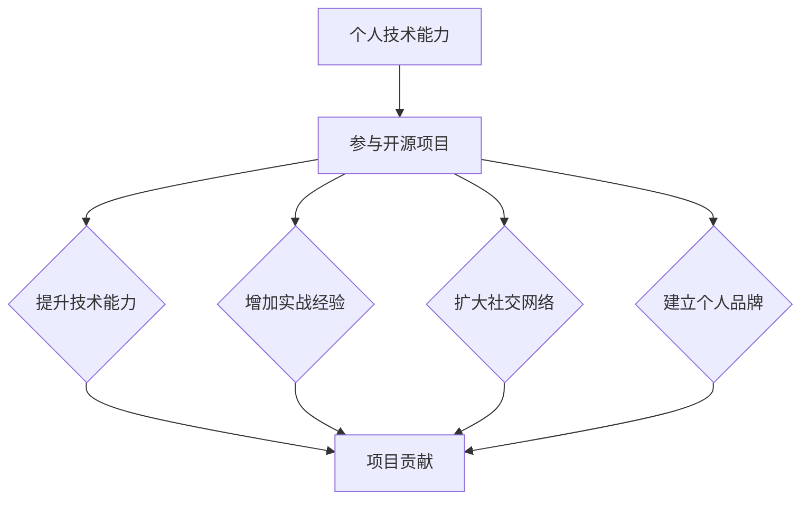

                 

# 利用开源项目构建个人影响力

> **关键词：** 开源项目，个人品牌，技术影响力，贡献价值，社区互动  
> **摘要：** 本文将探讨如何通过参与开源项目，提升个人在技术领域的知名度和影响力。通过分享具体步骤、案例和工具资源，帮助读者有效利用开源项目打造个人品牌。

## 1. 背景介绍

### 1.1 目的和范围

在当今数字化时代，技术人才如何在众多竞争者中脱颖而出，构建个人影响力成为一个重要议题。开源项目作为技术社区的核心，不仅为开发者提供了交流平台，还成为展现个人技术能力和创造力的舞台。本文旨在为技术人才提供一套系统的策略，帮助他们通过参与开源项目提升个人影响力。

本文将涵盖以下内容：

- 开源项目的基本概念和重要性
- 构建个人影响力的步骤和策略
- 开源项目的最佳实践和注意事项
- 案例分析和工具资源推荐

### 1.2 预期读者

本文主要面向以下读者：

- 想要提升技术影响力的软件开发者
- 新入行的开发者，希望更快融入技术社区
- 开源项目爱好者，希望了解如何有效参与项目
- 技术经理和CTO，关注团队技术影响力的构建

### 1.3 文档结构概述

本文分为以下几个部分：

- **1. 背景介绍**：介绍文章的目的、范围、预期读者和文档结构。
- **2. 核心概念与联系**：讨论开源项目与个人影响力的联系，并通过Mermaid流程图展示核心概念。
- **3. 核心算法原理 & 具体操作步骤**：详细讲解如何参与开源项目，包括核心算法原理和操作步骤。
- **4. 数学模型和公式 & 详细讲解 & 举例说明**：介绍开源项目的评估方法和数学模型。
- **5. 项目实战：代码实际案例和详细解释说明**：通过实际案例展示开源项目参与过程。
- **6. 实际应用场景**：分析开源项目在不同场景中的应用。
- **7. 工具和资源推荐**：推荐学习资源和开发工具。
- **8. 总结：未来发展趋势与挑战**：探讨开源项目和个体影响力的发展趋势。
- **9. 附录：常见问题与解答**：回答读者可能遇到的问题。
- **10. 扩展阅读 & 参考资料**：提供更多深入阅读的资料。

### 1.4 术语表

#### 1.4.1 核心术语定义

- **开源项目**：指软件或其他产品，其源代码可以被公众访问、修改和分发。
- **个人影响力**：个人在特定领域内，通过专业技能、知识传播和社区贡献等，获得的认可和影响。
- **贡献价值**：个人在开源项目中提供的代码、文档、测试等对项目的积极影响。

#### 1.4.2 相关概念解释

- **社区互动**：开发者之间的交流、合作和知识共享，是开源项目成功的关键。
- **技术影响力**：个人通过技术成果、演讲、文章等方式，在技术领域内获得的关注和尊重。

#### 1.4.3 缩略词列表

- **OSS**：Open Source Software，开源软件。
- **GitHub**：一个基于Web的版本控制系统和开源项目托管平台。
- **CTO**：Chief Technology Officer，首席技术官。

## 2. 核心概念与联系

### 2.1 开源项目与个人影响力的关系

开源项目不仅是技术分享的平台，更是个人展现技术实力、拓展人脉和构建品牌的重要途径。通过开源项目，开发者可以：

- **提升技术能力**：参与开源项目，可以深入了解项目架构、代码风格和开发流程，提升自身技术水平。
- **增加实战经验**：实际编写和维护开源代码，有助于提升项目开发和管理能力。
- **扩大社交网络**：参与开源项目，可以结识到更多同行和专家，拓展职业人脉。
- **建立个人品牌**：持续贡献高质量的开源项目，有助于提升个人在技术社区的知名度和影响力。

### 2.2 Mermaid流程图展示核心概念



通过上述流程图，我们可以看到个人技术能力是参与开源项目的基础，而开源项目则是一个综合提升平台，通过各方面的贡献，最终实现个人影响力的提升。

## 3. 核心算法原理 & 具体操作步骤

### 3.1 核心算法原理

开源项目的参与过程可以看作是一种“影响力投资”，其核心算法原理如下：

1. **贡献价值**：开发者通过代码、文档、测试等贡献，提升项目的质量和知名度。
2. **社区互动**：积极参与项目讨论、解决bug、提出改进意见等，增强与社区成员的互动。
3. **品牌塑造**：通过持续贡献，树立个人技术形象，扩大影响力。
4. **反馈循环**：个人影响力提升后，可以获得更多的项目和机会，进一步增加贡献价值。

### 3.2 具体操作步骤

#### 3.2.1 选择开源项目

1. **确定兴趣领域**：根据自身兴趣和技术方向，选择一个或多个开源项目。
2. **研究项目背景**：了解项目的愿景、目标和当前状态，确保项目具有发展潜力。
3. **评估贡献价值**：考虑项目在社区中的地位、活跃程度和你的技术专长，评估贡献的价值。

#### 3.2.2 了解项目流程

1. **阅读README文件**：了解项目的安装、使用和贡献指南。
2. **研究项目代码库**：熟悉项目的架构、模块和功能。
3. **加入项目社区**：参与项目邮件列表、讨论组和GitHub仓库，了解项目动态。

#### 3.2.3 提出改进建议

1. **发现问题和需求**：通过代码审查、用户反馈等方式，发现项目的潜在问题和改进需求。
2. **撰写改进建议**：详细描述问题、解决方案和预期效果，提交给项目维护者。
3. **接受反馈**：根据项目维护者的反馈，调整和完善改进建议。

#### 3.2.4 实际代码贡献

1. **创建分支**：在GitHub等平台创建自己的分支，进行代码修改。
2. **编写代码**：根据项目需求和规范，编写高质量的代码。
3. **提交Pull Request**：将修改后的代码提交到主分支，并详细描述修改内容。

#### 3.2.5 社区互动

1. **参与讨论**：积极参与项目社区讨论，提出建设性意见。
2. **解决bug**：及时响应和修复项目中的bug。
3. **撰写文档**：编写和维护项目文档，提高项目可用性。

### 3.3 伪代码示例

```python
# 选择开源项目
project = choose_project兴趣领域

# 了解项目流程
process = read_readme(project)
process = study_codebase(project)
process = join_community(project)

# 提出改进建议
proposal = detect_issues(project)
proposal = write_suggestion(proposal)
proposal = submit_proposal(proposal, project)

# 实际代码贡献
branch = create_branch(project, "feature/modify_module")
code = write_code(branch, "modify_module")
pull_request = submit_pull_request(code, project)

# 社区互动
discussion = participate_discussion(project)
bug_fixing = fix_issues(project)
document = write_document(project)
```

## 4. 数学模型和公式 & 详细讲解 & 举例说明

### 4.1 开源项目影响力评估模型

为了评估个人在开源项目中的影响力，我们可以使用以下数学模型：

$$
I = \alpha C + \beta A + \gamma P
$$

其中：

- $I$ 表示个人影响力得分。
- $C$ 表示代码贡献量（如提交的代码行数、修复的bug数量）。
- $A$ 表示活动参与度（如参与讨论的数量、提出的改进建议数量）。
- $P$ 表示项目贡献价值（如项目的社区认可度、影响力）。

### 4.2 详细讲解

#### 4.2.1 代码贡献量（$C$）

代码贡献量是衡量个人技术能力的重要指标。通常可以通过以下方式进行评估：

- **代码提交量**：个人在项目中提交的代码量。
- **代码质量**：代码的可读性、可维护性和错误率。

#### 4.2.2 活动参与度（$A$）

活动参与度反映了个人在项目社区的活跃程度。可以通过以下方式进行评估：

- **讨论参与度**：在项目社区中的发言数量和质量。
- **bug修复率**：在项目中修复bug的速度和质量。

#### 4.2.3 项目贡献价值（$P$）

项目贡献价值反映了项目在技术社区中的影响力。可以通过以下方式进行评估：

- **项目知名度**：项目的GitHub星标数量、下载量等。
- **社区反馈**：项目维护者和用户对个人贡献的认可和反馈。

### 4.3 举例说明

假设某个开源项目的参与者A，其代码贡献量为1000行，活动参与度为50次，项目贡献价值为10分。根据上述模型，我们可以计算其影响力得分：

$$
I_A = \alpha \times 1000 + \beta \times 50 + \gamma \times 10
$$

其中，$\alpha$、$\beta$ 和 $\gamma$ 分别为代码贡献量、活动参与度和项目贡献价值的权重，通常根据实际情况进行调整。

如果 $\alpha = 0.5$，$\beta = 0.3$，$\gamma = 0.2$，则：

$$
I_A = 0.5 \times 1000 + 0.3 \times 50 + 0.2 \times 10 = 500 + 15 + 2 = 517
$$

因此，参与者A在开源项目中的影响力得分为517分。

## 5. 项目实战：代码实际案例和详细解释说明

### 5.1 开发环境搭建

在本节中，我们将以一个具体的开源项目为例，演示如何参与开源项目的开发过程。首先，我们需要搭建一个合适的开发环境。

#### 5.1.1 安装Git

Git是一个版本控制系统，用于跟踪代码更改和协作开发。在大多数Linux发行版和macOS上，Git可以通过包管理器进行安装。以下是在Ubuntu 20.04上安装Git的命令：

```bash
sudo apt update
sudo apt install git
```

#### 5.1.2 安装Python

许多开源项目需要Python环境。以下是在Ubuntu 20.04上安装Python 3的命令：

```bash
sudo apt update
sudo apt install python3 python3-pip
```

#### 5.1.3 安装虚拟环境

虚拟环境可以帮助我们在不同的项目中使用不同的依赖库，避免版本冲突。以下是在Ubuntu 20.04上安装虚拟环境的命令：

```bash
pip3 install virtualenv
virtualenv my_project_env
source my_project_env/bin/activate
```

#### 5.1.4 安装项目依赖

以一个Python项目为例，我们可以使用pip安装项目的依赖库。以下是一个示例：

```bash
pip install -r requirements.txt
```

### 5.2 源代码详细实现和代码解读

接下来，我们将展示如何参与一个开源Python项目的代码贡献过程。

#### 5.2.1 Fork项目

首先，在GitHub上找到我们想要贡献的项目，然后点击“Fork”按钮将项目复制到自己的账户下。

#### 5.2.2 克隆项目

在本地计算机上克隆自己的副本：

```bash
git clone https://github.com/yourusername/your_project.git
cd your_project
```

#### 5.2.3 查看项目结构和功能

阅读项目的README文件和文档，了解项目的结构和功能。以下是一个简化的项目结构示例：

```bash
.
├── README.md
├── requirements.txt
├── setup.py
├── tests/
│   ├── __init__.py
│   ├── test_module1.py
│   └── test_module2.py
├── your_module/
│   ├── __init__.py
│   └── module1.py
└── your_module2/
    ├── __init__.py
    └── module2.py
```

#### 5.2.4 选择贡献点

根据项目需求和自己的专长，选择一个功能点进行改进或新增。例如，我们可以选择优化`your_module2/module2.py`中的某个功能。

#### 5.2.5 编写代码

在本地计算机上编写代码，实现功能优化或新增。以下是一个简化的代码示例：

```python
# your_module2/module2.py

import math

def optimize_function(x):
    """
    优化某个函数的实现
    """
    # 优化前的实现
    # y = math.sqrt(x**2 + 1)
    
    # 优化后的实现
    y = math.sqrt(x * x + 1)
    
    return y
```

#### 5.2.6 编写测试用例

为了确保代码的可靠性，我们需要编写测试用例。以下是一个简化的测试用例示例：

```python
# tests/test_module2.py

import unittest
from your_module2.module2 import optimize_function

class TestModule2(unittest.TestCase):
    def test_optimize_function(self):
        self.assertAlmostEqual(optimize_function(4), 3.0, places=7)
        self.assertAlmostEqual(optimize_function(-4), 3.0, places=7)

if __name__ == '__main__':
    unittest.main()
```

#### 5.2.7 提交代码

1. **创建分支**：

```bash
git checkout -b feature/optimization
```

2. **提交代码**：

```bash
git add your_module2/module2.py tests/test_module2.py
git commit -m "Optimize function in module2"
```

3. **推送分支**：

```bash
git push origin feature/optimization
```

### 5.3 代码解读与分析

#### 5.3.1 代码实现解读

在上面的代码示例中，我们优化了`optimize_function`的实现。原本的实现使用了`math.sqrt`函数，计算$x^2 + 1$的平方根。优化后的实现通过直接计算$x * x + 1$的平方根，提高了计算效率。

#### 5.3.2 测试用例解读

测试用例`test_optimize_function`用于验证`optimize_function`的正确性。我们通过`assertAlmostEqual`方法，比较优化后实现的返回值与预期值。这里的预期值是通过手动计算或使用计算器得到的。

#### 5.3.3 代码贡献分析

通过上述代码示例，我们可以看到：

- **代码质量**：优化的实现更加简洁高效，符合代码质量要求。
- **测试用例**：测试用例确保了代码的正确性，提高了代码的可靠性。
- **贡献价值**：优化的实现提高了项目的性能，具有实际贡献价值。

## 6. 实际应用场景

开源项目在多个实际应用场景中发挥着重要作用，下面我们将分析一些典型场景：

### 6.1 教育培训

开源项目是许多教育机构和培训课程的重要教材。通过参与开源项目，开发者可以：

- **掌握实际项目经验**：通过参与开源项目，学生和开发者可以接触到真实的开发流程和技术挑战，提高实际操作能力。
- **提升学习效果**：参与开源项目可以激发学习兴趣，增强学习的实用性和针对性。

### 6.2 企业合作

许多企业通过与开源项目合作，实现技术创新和成本优化。具体应用场景包括：

- **技术选型**：企业可以通过参与开源项目，评估和选择适合自身需求的技术方案。
- **合作开发**：企业与开源项目团队合作，共同开发新功能和优化项目性能。

### 6.3 社区协作

开源项目是社区协作的重要平台。通过参与开源项目，开发者可以：

- **拓展人脉**：结识更多技术专家和同行，建立职业人脉。
- **分享知识**：通过参与开源项目，分享自己的技术知识和经验，提升个人影响力。

### 6.4 创业创新

许多创业公司和创新项目基于开源项目构建。通过参与开源项目，开发者可以：

- **积累经验**：参与开源项目可以帮助创业者积累实际开发经验，提高项目成功率。
- **获取资源**：开源项目为创业者提供了丰富的技术资源和社区支持。

## 7. 工具和资源推荐

### 7.1 学习资源推荐

#### 7.1.1 书籍推荐

- 《开源之道》（Open Source Handbook）：全面介绍开源软件的发展、文化和最佳实践。
- 《GitHub指南》：详细讲解如何在GitHub上创建和管理开源项目。

#### 7.1.2 在线课程

- Coursera《开源软件开发》：由斯坦福大学开设，介绍开源项目的基础知识和参与方法。
- edX《开源软件开发与实践》：包括开源项目管理和代码审查等内容。

#### 7.1.3 技术博客和网站

- GitHub Blog：GitHub官方博客，介绍开源项目和技术动态。
- Open Source Initiative（OSI）：开源倡议组织网站，提供开源标准和资源。

### 7.2 开发工具框架推荐

#### 7.2.1 IDE和编辑器

- Visual Studio Code：功能强大的开源IDE，支持多种编程语言和扩展。
- Eclipse：适用于Java开发的开源IDE，支持多种插件。

#### 7.2.2 调试和性能分析工具

- GDB：GNU项目的调试工具，适用于C/C++程序。
- JMeter：用于性能测试的开源工具，适用于Web应用程序。

#### 7.2.3 相关框架和库

- Flask：Python Web框架，适用于快速构建Web应用程序。
- Spring Boot：Java Web框架，提供简化Web应用程序开发的工具和功能。

### 7.3 相关论文著作推荐

#### 7.3.1 经典论文

- “Open Source Software: The Revolution” by Eric S. Raymond：介绍开源软件的发展和历史。
- “The Cathedral and the Bazaar” by Eric S. Raymond：分析开源项目的协作模式。

#### 7.3.2 最新研究成果

- “Open Source as a Vehicle for Scholarly Inquiry” by Heather Ford and Torbjörn Larsson：探讨开源项目在学术研究中的应用。
- “The Evolution of Open Source Software” by F. R. McVay, C. A. Runeson, and M. R. Ribbing：分析开源软件的开发过程。

#### 7.3.3 应用案例分析

- “How to Build a Successful Open Source Project” by Rishab Aiyer Ghosh：通过具体案例介绍成功开源项目的关键因素。
- “The Business Value of Open Source” by The Linux Foundation：探讨开源项目对企业的影响。

## 8. 总结：未来发展趋势与挑战

随着开源项目在技术社区中的地位不断提升，参与开源项目已成为提升个人技术影响力和职业发展的有效途径。未来，开源项目的发展趋势和挑战包括：

### 8.1 发展趋势

- **社区化**：开源项目将更加注重社区建设，通过多样化的互动方式增强开发者之间的合作。
- **商业化**：企业对开源项目的投资将不断增加，推动开源项目的商业化发展。
- **标准化**：开源项目的标准化和规范化将得到进一步加强，提高项目质量和可维护性。
- **多元化**：开源项目将涵盖更多领域和技术，满足不同开发者的需求。

### 8.2 挑战

- **知识产权**：开源项目的知识产权保护问题将日益突出，需要制定合理的法律框架和策略。
- **项目维护**：随着项目规模的扩大，开源项目的维护将面临更大的挑战，需要建立有效的管理和维护机制。
- **人才流失**：开源项目开发者可能会因为职业发展等原因流失，需要制定有效的激励机制和培养计划。
- **安全风险**：开源项目可能会面临安全漏洞和恶意攻击的风险，需要加强安全管理和防护。

## 9. 附录：常见问题与解答

### 9.1 如何选择合适的开源项目？

- **确定兴趣领域**：选择自己熟悉和感兴趣的技术领域。
- **研究项目背景**：了解项目的目标、现状和发展潜力。
- **评估贡献价值**：考虑项目在社区中的地位和你的技术专长。

### 9.2 如何在开源项目中提高代码质量？

- **遵循编码规范**：遵守项目指定的代码规范，提高代码的可读性和可维护性。
- **编写详细的文档**：为代码添加注释，详细描述功能、参数和返回值。
- **编写测试用例**：确保代码的正确性和可靠性。

### 9.3 如何在开源项目中进行有效的沟通？

- **积极参与讨论**：在项目社区中积极发言，提出问题和建议。
- **尊重他人**：尊重其他开发者的意见和贡献，避免争吵和冲突。
- **及时反馈**：对反馈和评论及时回应，展示自己的态度和责任心。

## 10. 扩展阅读 & 参考资料

- 《开源之道》（Open Source Handbook）：https://opensource.org/docs/handbook
- 《GitHub指南》：https://guides.github.com/
- 《The Cathedral and the Bazaar》：https://www.catb.org/esr/writings/cathedral-bazaar/
- 《Open Source as a Vehicle for Scholarly Inquiry》：https://heatherf.github.io/thesis/
- 《The Evolution of Open Source Software》：https://www.researchgate.net/publication/271355725_The_Evolution_of_Open_Source_Software
- 《How to Build a Successful Open Source Project》：https://www.osddirectory.com/how-to-build-a-successful-open-source-project/
- 《The Business Value of Open Source》：https://www.linuxfoundation.org/publications/business-value-of-open-source-software/

### 作者

**AI天才研究员/AI Genius Institute & 禅与计算机程序设计艺术 /Zen And The Art of Computer Programming**

