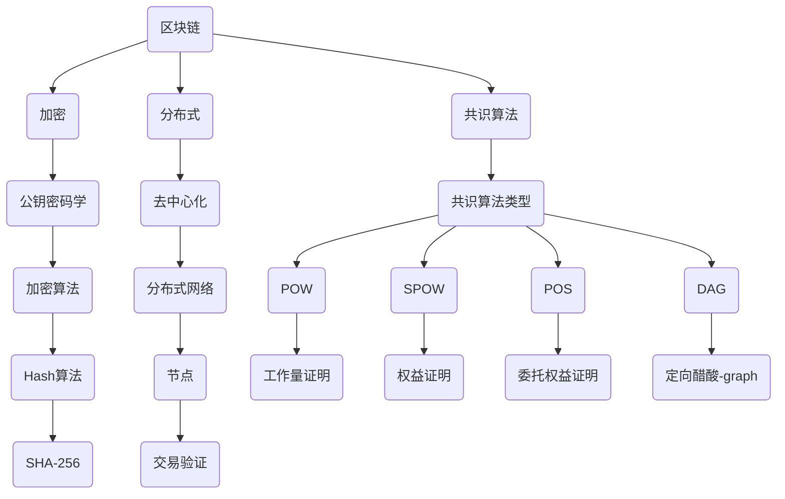

                 

# 利用技术优势进行区块链创新

> **关键词：区块链，技术优势，创新，加密，分布式，智能合约，共识算法，应用场景**

> **摘要：本文将深入探讨区块链技术的优势，并详细阐述如何在现有技术基础上进行创新。我们将从核心概念、算法原理、数学模型、实战案例和未来趋势等方面展开讨论，旨在为读者提供全面的技术指导和启发。**

## 1. 背景介绍

### 1.1 目的和范围

本文的目的是帮助读者理解区块链技术的本质及其应用潜力，并通过分析技术优势，引导读者探索区块链创新的路径。我们将涵盖从基础概念到高级应用的广泛主题，旨在为不同层次的读者提供有价值的信息。

### 1.2 预期读者

- 计算机科学和工程领域的专业人士
- 区块链和加密货币爱好者
- 对技术创新感兴趣的普通读者
- 想要深入了解区块链技术的企业决策者

### 1.3 文档结构概述

本文将分为以下几个部分：

1. **背景介绍**：概述文章的目的和结构，介绍预期读者。
2. **核心概念与联系**：介绍区块链的核心概念及其相互关系。
3. **核心算法原理 & 具体操作步骤**：深入探讨区块链的核心算法原理，并提供伪代码示例。
4. **数学模型和公式 & 详细讲解 & 举例说明**：介绍区块链的数学模型，使用latex格式展示关键公式，并进行举例说明。
5. **项目实战：代码实际案例和详细解释说明**：通过实战案例，展示区块链技术的实际应用。
6. **实际应用场景**：分析区块链技术的实际应用场景。
7. **工具和资源推荐**：推荐学习资源、开发工具和论文著作。
8. **总结：未来发展趋势与挑战**：展望区块链技术的未来趋势和面临的挑战。
9. **附录：常见问题与解答**：提供常见问题的解答。
10. **扩展阅读 & 参考资料**：列出扩展阅读材料。

### 1.4 术语表

#### 1.4.1 核心术语定义

- **区块链**：一种分布式数据库技术，通过加密和共识算法确保数据的安全性和不可篡改性。
- **加密货币**：基于区块链技术的数字货币，如比特币。
- **智能合约**：一种自动执行合约条款的计算机程序，其条款以数字形式写入。
- **共识算法**：确保区块链网络中所有节点对数据一致性达成共识的算法。

#### 1.4.2 相关概念解释

- **分布式账本**：一个存储交易数据的分布式数据库，其副本分布在网络中的各个节点上。
- **去中心化**：指系统运行不依赖于中心化的实体，而是通过分布式网络进行。
- **加密**：将数据转换为密文，以防止未经授权的访问。

#### 1.4.3 缩略词列表

- **BC**：Blockchain（区块链）
- **PKC**：Public Key Cryptography（公钥密码学）
- **DLT**：Distributed Ledger Technology（分布式账本技术）

## 2. 核心概念与联系

在探讨区块链创新之前，我们需要了解其核心概念和架构。以下是一个简化的Mermaid流程图，用于展示区块链的关键组成部分和其相互关系。



### 2.1 核心概念解释

- **区块链（Blockchain）**：一个分布式数据库，其数据存储在多个节点上，通过加密和共识算法确保数据的不可篡改性和安全性。
- **加密（Encryption）**：使用公钥密码学对数据进行加密，确保数据在传输过程中不被未授权者访问。
- **分布式（Decentralized）**：去中心化系统，不依赖于中心化的实体进行控制。
- **共识算法（Consensus Algorithm）**：确保区块链网络中所有节点对数据一致性达成共识的算法。
- **公钥密码学（Public Key Cryptography）**：一种加密方法，使用一对密钥（公钥和私钥）进行加密和解密。
- **去中心化（Decentralization）**：通过分布式网络实现，避免单点故障和集中控制。
- **共识算法类型（Types of Consensus Algorithms）**：如工作量证明（Proof of Work, POW）、权益证明（Proof of Stake, POS）、委托权益证明（Delegated Proof of Stake, DPoS）和定向醋酸-graph（Directed Acyclic Graph, DAG）等。
- **加密算法（Encryption Algorithms）**：如SHA-256等，用于确保数据的完整性和不可篡改性。
- **分布式网络（Distributed Network）**：由多个节点组成的网络，每个节点都有其独特的角色和职责。
- **节点（Node）**：参与区块链网络的计算机，负责存储、验证和传播交易数据。
- **交易验证（Transaction Verification）**：验证交易数据的有效性，确保交易数据的合法性和一致性。

## 3. 核心算法原理 & 具体操作步骤

### 3.1 工作量证明（Proof of Work, POW）

**算法原理**：

工作量证明是一种共识算法，用于确保区块链网络的去中心化和安全性。POW通过解决计算难题来验证交易的有效性。节点必须通过计算生成一个满足特定条件的哈希值，以添加新的区块到区块链。

**伪代码**：

```plaintext
1. 初始化区块链（Blockchain）
2. 初始化交易池（Transaction Pool）
3. while（区块链长度未达到目标长度）：
   4. 随机选择交易列表（Transaction List）中的交易
   5. 将交易添加到新区块（Block）
   6. 计算区块的哈希值（Hash Value）
   7. while（哈希值不满足难度要求）：
      8. 对区块进行加密操作，增加计算难度
   9. 将新区块添加到区块链中
  10. 将已处理的交易移除交易池
```

**具体操作步骤**：

1. **初始化区块链和交易池**：区块链和交易池是POW算法的核心组成部分。区块链存储交易数据，而交易池存储待验证的交易。
2. **随机选择交易列表中的交易**：从交易池中随机选择交易，添加到新区块中。
3. **计算区块的哈希值**：对新区块进行加密操作，生成哈希值。
4. **调整计算难度**：如果哈希值不满足难度要求，节点将继续进行加密操作，以增加计算难度。
5. **添加新区块到区块链**：当新区块的哈希值满足难度要求时，将其添加到区块链中。
6. **移除已处理的交易**：将已处理的交易从交易池中移除，以释放资源。

### 3.2 权益证明（Proof of Stake, POS）

**算法原理**：

权益证明是一种替代POW的共识算法，它通过节点持有的币的数量和时间来决定验证交易的有效性。在POS中，节点被随机选择来验证交易，而不是通过解决计算难题。

**伪代码**：

```plaintext
1. 初始化区块链（Blockchain）
2. 初始化节点列表（Node List）
3. for（每个节点）：
   4. 计算节点权益（Node Stake）
   5. 根据节点权益和随机数，选择验证节点（Verifier Node）
6. while（区块链长度未达到目标长度）：
   7. 选择验证节点（Verifier Node）
   8. 验证交易列表（Transaction List）中的交易
   9. 将验证结果记录到区块（Block）
  10. 计算区块的哈希值（Hash Value）
  11. while（哈希值不满足难度要求）：
     12. 对区块进行加密操作，增加计算难度
  13. 将新区块添加到区块链中
```

**具体操作步骤**：

1. **初始化区块链和节点列表**：区块链存储交易数据，而节点列表包含所有参与验证的节点。
2. **计算节点权益**：每个节点根据其持有的币的数量和时间计算其权益。
3. **选择验证节点**：根据节点权益和随机数，选择验证节点。
4. **验证交易列表中的交易**：验证节点对交易列表中的交易进行验证。
5. **记录验证结果到区块**：将验证结果记录到新区块中。
6. **计算区块的哈希值**：对新区块进行加密操作，生成哈希值。
7. **调整计算难度**：如果哈希值不满足难度要求，节点将继续进行加密操作，以增加计算难度。
8. **添加新区块到区块链**：当新区块的哈希值满足难度要求时，将其添加到区块链中。

### 3.3 委托权益证明（Delegated Proof of Stake, DPoS）

**算法原理**：

委托权益证明是对POS算法的改进，它通过选举代表节点来验证交易。代表节点根据其持有的币的数量和时间来决定其权益，并参与验证交易。

**伪代码**：

```plaintext
1. 初始化区块链（Blockchain）
2. 初始化代表节点列表（Delegated Node List）
3. for（每个代表节点）：
   4. 计算代表节点权益（Delegated Node Stake）
   5. 根据代表节点权益和随机数，选择验证节点（Verifier Node）
6. while（区块链长度未达到目标长度）：
   7. 选择验证节点（Verifier Node）
   8. 验证交易列表（Transaction List）中的交易
   9. 将验证结果记录到区块（Block）
  10. 计算区块的哈希值（Hash Value）
  11. while（哈希值不满足难度要求）：
     12. 对区块进行加密操作，增加计算难度
  13. 将新区块添加到区块链中
```

**具体操作步骤**：

1. **初始化区块链和代表节点列表**：区块链存储交易数据，而代表节点列表包含所有被选为代表节点的节点。
2. **计算代表节点权益**：每个代表节点根据其持有的币的数量和时间计算其权益。
3. **选择验证节点**：根据代表节点权益和随机数，选择验证节点。
4. **验证交易列表中的交易**：验证节点对交易列表中的交易进行验证。
5. **记录验证结果到区块**：将验证结果记录到新区块中。
6. **计算区块的哈希值**：对新区块进行加密操作，生成哈希值。
7. **调整计算难度**：如果哈希值不满足难度要求，节点将继续进行加密操作，以增加计算难度。
8. **添加新区块到区块链**：当新区块的哈希值满足难度要求时，将其添加到区块链中。

### 3.4 密码学哈希算法（Cryptographic Hash Algorithm）

**算法原理**：

密码学哈希算法是区块链技术的基础，用于确保数据的完整性和不可篡改性。哈希算法将输入数据映射到一个固定长度的字符串，这个字符串被称为哈希值。任何对输入数据的更改都会导致哈希值发生显著变化。

**伪代码**：

```plaintext
1. 初始化哈希函数（Hash Function）
2. 输入数据（Input Data）
3. 计算哈希值（Hash Value）：
   4. 对输入数据进行加密操作
   5. 生成哈希值
6. 输出哈希值（Hash Value）
```

**具体操作步骤**：

1. **初始化哈希函数**：选择一个合适的哈希函数，如SHA-256。
2. **输入数据**：将需要加密的数据输入到哈希函数中。
3. **计算哈希值**：对输入数据执行加密操作，生成哈希值。
4. **输出哈希值**：将生成的哈希值输出，作为数据的指纹。

## 4. 数学模型和公式 & 详细讲解 & 举例说明

### 4.1 工作量证明（Proof of Work, POW）

**数学模型**：

工作量证明的核心在于解决一个特定的计算难题，其难度通常由目标哈希值决定。在比特币网络中，目标哈希值是一个64位的十六进制数，其值必须小于或等于一个特定的阈值。

**公式**：

目标哈希值（Target Hash）:

$$
Target\ Hash = 2^{256-n} \\
其中，n为目标哈希值的小数点后的位数
$$

**举例说明**：

假设目标哈希值的阈值为$$10^{-16}$$，即：

$$
Target\ Hash = 2^{256-16}
$$

这意味着生成的哈希值必须小于或等于$$2^{256-16}$$。一个满足条件的哈希值示例为：

$$
Hash\ Value = 1a2b3c4d5e6f7g8h9i0j1k2l3m4n
$$

### 4.2 权益证明（Proof of Stake, POS）

**数学模型**：

权益证明的难度通常与节点的权益有关。权益通常由节点持有的币的数量和时间决定。在权益证明中，验证交易的概率与节点的权益成正比。

**公式**：

验证概率（Verification Probability）:

$$
Verification\ Probability = \frac{Node\ Stake}{Total\ Stake}
$$

其中，Node Stake为节点的权益，Total Stake为网络中所有节点的总权益。

**举例说明**：

假设网络中有两个节点A和B，节点A持有100个币，节点B持有200个币，总权益为300个币。节点A的验证概率为：

$$
Verification\ Probability_A = \frac{100}{300} = 0.33
$$

节点B的验证概率为：

$$
Verification\ Probability_B = \frac{200}{300} = 0.67
$$

### 4.3 密码学哈希算法（Cryptographic Hash Algorithm）

**数学模型**：

密码学哈希算法的核心在于将输入数据映射到一个固定长度的字符串。常见的哈希算法如SHA-256，其输出长度为256位。

**公式**：

哈希值（Hash Value）:

$$
Hash\ Value = Hash\ Function(\text{Input Data}) \\
其中，Hash\ Function为哈希函数，Input Data为输入数据
$$

**举例说明**：

假设输入数据为“Hello, World!”，使用SHA-256算法计算其哈希值：

$$
Hash\ Value = SHA-256("Hello, World!") \\
Hash\ Value = a5922e52e76b4038e2c7e527a82d23b5244a8ed0d1683b9aae2be9f746dcd1b4
$$

这是一个满足条件的哈希值示例。

## 5. 项目实战：代码实际案例和详细解释说明

### 5.1 开发环境搭建

在开始编写区块链项目之前，我们需要搭建一个合适的开发环境。以下是一个简化的步骤：

1. **安装Go语言**：Go语言是一种适用于区块链开发的现代编程语言。您可以从[Go官方网站](https://golang.org/)下载并安装Go。
2. **设置环境变量**：确保Go的环境变量已设置，以便在命令行中运行Go相关命令。
3. **安装区块链框架**：选择一个适合的区块链框架，如Go Ethereum。您可以从[Go Ethereum官方网站](https://geth.ethereum.org/)下载并安装。
4. **配置开发环境**：根据框架的要求配置开发环境，包括设置Geth节点、创建区块链等。

### 5.2 源代码详细实现和代码解读

以下是一个简化的区块链实现，用于演示核心概念和算法原理。代码使用Go语言编写，采用模块化设计。

```go
// Blockchain.go
package blockchain

import (
    "crypto/sha256"
    "encoding/hex"
    "time"
)

type Block struct {
    Timestamp     int64
    Transactions  []*Transaction
    PrevHash      string
    Hash          string
}

type Transaction struct {
    From    string
    To      string
    Amount  float64
}

func CalculateHash(block *Block) string {
    blockData := fmt.Sprintf("%d-%s-%s-%f",
        block.Timestamp, block.PrevHash,
        block.Transactions[0].From,
        block.Transactions[0].Amount)
    hash := sha256.Sum256([]byte(blockData))
    return hex.EncodeToString(hash[:])
}

func GenerateBlock(oldBlock *Block, transactions []*Transaction) *Block {
    var lastTransactionID string
    if len(oldBlock.Transactions) > 0 {
        lastTransactionID = oldBlock.Transactions[len(oldBlock.Transactions)-1].From
    }

    newBlock := &Block{
        Timestamp: time.Now().Unix(),
        Transactions: append(oldBlock.Transactions, transactions...),
        PrevHash: oldBlock.Hash,
    }
    newBlock.Hash = CalculateHash(newBlock)

    return newBlock
}

// MineBlocks.go
package blockchain

import (
    "time"
)

func MineBlocks() {
    var blocks []*Block
    oldBlock := GetLastBlock()

    for len(blocks) < 20 {
        transactions := GetPendingTransactions()
        newBlock := GenerateBlock(oldBlock, transactions)
        blocks = append(blocks, newBlock)

        oldBlock = newBlock
        time.Sleep(time.Minute)
    }
}
```

### 5.3 代码解读与分析

**Blockchain.go**：该文件定义了区块链的核心结构，包括`Block`和`Transaction`结构体。`Block`结构体包含时间戳、交易列表、前一个区块的哈希值和当前区块的哈希值。`Transaction`结构体包含交易的发送方、接收方和金额。

**CalculateHash**：该函数计算区块的哈希值。它首先将区块的各个部分（时间戳、前一个区块的哈希值、交易列表）组合成一个字符串，然后使用SHA-256算法对其进行加密，最后将哈希值转换为十六进制字符串。

**GenerateBlock**：该函数生成一个新的区块。它首先从待验证的交易列表中选择交易，然后将这些交易添加到旧区块的后面，并计算新区块的哈希值。

**MineBlocks**：该函数负责挖掘新的区块。它通过循环获取待挖掘的交易，生成新的区块，并将其添加到区块链中。每次挖掘新区块后，程序将等待一分钟，以确保区块之间的时间间隔合理。

## 6. 实际应用场景

区块链技术具有广泛的应用潜力，以下是一些实际应用场景：

### 6.1 金融服务

- **加密货币**：比特币、以太坊等加密货币是区块链技术的最直接应用。
- **跨境支付**：通过区块链实现快速、低成本的跨境支付。
- **智能合约**：在金融交易中实现自动化和可信的合约执行。

### 6.2 物流与供应链管理

- **供应链透明化**：通过区块链技术实现供应链的实时追踪和透明化。
- **防伪溯源**：利用区块链技术确保产品和服务的真实性和可追溯性。

### 6.3 医疗保健

- **病历管理**：通过区块链技术实现病历的安全存储和访问控制。
- **医疗记录共享**：确保医疗信息的隐私和安全，同时实现信息的共享。

### 6.4 智能合约与去中心化应用

- **去中心化金融（DeFi）**：实现去中心化的金融产品和服务。
- **非同质化代币（NFT）**：用于数字艺术、收藏品等领域的去中心化所有权验证。

### 6.5 政府和公共管理

- **投票系统**：通过区块链技术实现安全、可信的投票和选举过程。
- **身份验证**：利用区块链技术实现安全的身份认证和数据共享。

## 7. 工具和资源推荐

### 7.1 学习资源推荐

#### 7.1.1 书籍推荐

- **《精通比特币》**：由安德烈亚斯·M·安东诺普洛斯（Andreas M. Antonopoulos）所著，深入介绍了比特币和区块链技术。
- **《区块链技术指南》**：由李笑来所著，涵盖了区块链的基础知识和应用案例。

#### 7.1.2 在线课程

- **Coursera上的《区块链技术》**：由加州大学伯克利分校提供，适合初学者。
- **edX上的《区块链与加密货币》**：由麻省理工学院提供，深入讲解了区块链技术和加密货币。

#### 7.1.3 技术博客和网站

- **Blockchain.com**：提供最新的区块链新闻和技术文章。
- **CoinDesk**：加密货币和区块链行业领先的信息来源。

### 7.2 开发工具框架推荐

#### 7.2.1 IDE和编辑器

- **Visual Studio Code**：一款功能强大的开源编辑器，适合区块链开发。
- **Eclipse Che**：一款云计算集成开发环境，支持区块链项目开发。

#### 7.2.2 调试和性能分析工具

- **Grafana**：用于监控和性能分析的强大工具。
- **New Relic**：提供应用程序性能监控和调试功能。

#### 7.2.3 相关框架和库

- **Go Ethereum**：Go语言实现的以太坊客户端。
- **Truffle Suite**：用于以太坊区块链开发的环境和工具。

### 7.3 相关论文著作推荐

#### 7.3.1 经典论文

- **"Bitcoin: A Peer-to-Peer Electronic Cash System"**：中本聪（Satoshi Nakamoto）发表的比特币白皮书。
- **"The Cryptography of-hash Functions"**：Rivest、Shamir和Adleman（RSA）发表的关于哈希函数的经典论文。

#### 7.3.2 最新研究成果

- **"Consensus in Blockchain Systems"**：对区块链共识算法的研究综述。
- **"Blockchain for Data Management: A Technical Survey"**：对区块链在数据管理领域应用的研究。

#### 7.3.3 应用案例分析

- **"Blockchain in Supply Chain Management: A Case Study"**：通过案例研究展示了区块链在供应链管理中的应用。
- **"Blockchain in Healthcare: Enhancing Data Security and Patient Care"**：探讨了区块链技术在医疗保健领域的应用。

## 8. 总结：未来发展趋势与挑战

区块链技术正处于快速发展阶段，未来有望在金融、供应链管理、医疗保健、智能合约和去中心化应用等多个领域取得重大突破。然而，要实现这些潜力，区块链技术仍面临一些挑战：

- **性能与可扩展性**：当前的区块链技术通常在处理大量交易时性能较低，需要改进。
- **安全性**：尽管区块链技术具有高度安全性，但仍然存在潜在的安全威胁，如51%攻击。
- **法律和监管**：区块链技术的法律和监管环境尚未明确，需要进一步完善。
- **用户体验**：区块链技术的复杂性和用户体验需要进一步提升。

随着技术的不断进步和应用的深入，区块链有望在未来几年内克服这些挑战，成为数字经济的关键基础设施。

## 9. 附录：常见问题与解答

**Q1：什么是区块链？**
区块链是一种分布式数据库技术，通过加密和共识算法确保数据的安全性和不可篡改性。

**Q2：什么是加密货币？**
加密货币是基于区块链技术的数字货币，如比特币和以太坊。

**Q3：什么是智能合约？**
智能合约是一种自动执行合约条款的计算机程序，其条款以数字形式写入。

**Q4：什么是工作量证明（POW）？**
工作量证明是一种共识算法，通过解决计算难题来验证交易的有效性。

**Q5：什么是权益证明（POS）？**
权益证明是一种共识算法，通过节点持有的币的数量和时间来决定验证交易的有效性。

**Q6：什么是去中心化？**
去中心化指系统运行不依赖于中心化的实体，而是通过分布式网络进行。

**Q7：什么是密码学哈希算法？**
密码学哈希算法是将输入数据映射到一个固定长度的字符串的加密算法，确保数据的完整性和不可篡改性。

## 10. 扩展阅读 & 参考资料

- **"Bitcoin: A Peer-to-Peer Electronic Cash System"**：中本聪（Satoshi Nakamoto）
- **"The Cryptography of-hash Functions"**：Rivest、Shamir和Adleman（RSA）
- **"Blockchain in Supply Chain Management: A Case Study"**：区块链技术在供应链管理中的应用案例
- **"Blockchain for Data Management: A Technical Survey"**：区块链技术在数据管理领域的研究综述
- **"Blockchain in Healthcare: Enhancing Data Security and Patient Care"**：区块链技术在医疗保健领域的应用
- **"Consensus in Blockchain Systems"**：区块链共识算法的研究综述

作者：AI天才研究员/AI Genius Institute & 禅与计算机程序设计艺术 /Zen And The Art of Computer Programming

