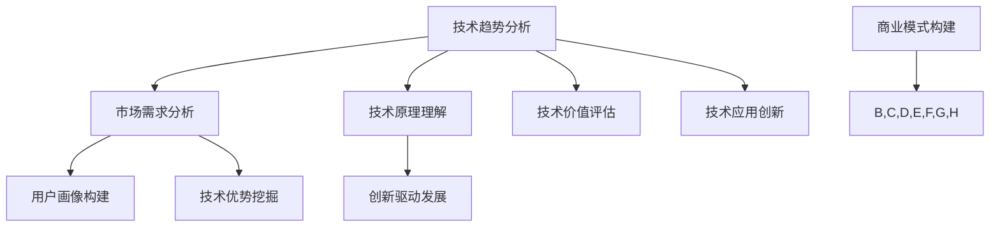

                 

### 利用技术洞察力进行创业

> **关键词**：技术洞察力、创业、商业模式、数据驱动、创新

**摘要**：本文旨在探讨如何利用技术洞察力进行创业。通过分析技术趋势、市场需求和商业模式，本文将帮助创业者挖掘潜在的商业机会，构建具有竞争力和可持续性的业务。文章首先介绍了技术洞察力的定义和重要性，随后详细阐述了创业过程中关键的技术概念和工具，并通过实际案例展示了技术洞察力在创业实践中的应用。最后，本文总结了未来创业发展的趋势与挑战，为创业者提供了实用的指导和建议。

### 1. 背景介绍

#### 1.1 目的和范围

本文的目的在于帮助创业者通过技术洞察力发现并把握商业机会，从而构建成功的企业。随着技术的迅猛发展，技术洞察力已成为创业成功的关键因素。本文将围绕以下几个核心问题展开讨论：

1. 技术洞察力的定义及其在创业中的作用
2. 创业过程中如何运用技术洞察力分析市场
3. 数据驱动和创新在商业模式构建中的应用
4. 技术洞察力在实际项目中的具体实践

#### 1.2 预期读者

本文主要面向以下几类读者：

1. 创业者：正在寻求创业机会和方向，希望提升自身技术洞察力的专业人士。
2. 技术人员：对创业感兴趣的技术背景从业者，希望了解如何将技术优势转化为商业价值。
3. 企业家：已有企业，希望通过技术洞察力优化业务模式，提升企业竞争力。

#### 1.3 文档结构概述

本文结构如下：

1. **背景介绍**：介绍技术洞察力的定义、重要性及本文目的和预期读者。
2. **核心概念与联系**：分析技术洞察力的核心概念及其与商业模式的联系。
3. **核心算法原理 & 具体操作步骤**：介绍技术洞察力在创业中的具体应用。
4. **数学模型和公式 & 详细讲解 & 举例说明**：利用数学模型和公式阐述技术洞察力在实际中的应用。
5. **项目实战：代码实际案例和详细解释说明**：通过实际案例展示技术洞察力的应用。
6. **实际应用场景**：探讨技术洞察力在不同领域的应用。
7. **工具和资源推荐**：推荐学习资源、开发工具和框架。
8. **总结：未来发展趋势与挑战**：总结技术洞察力在创业中的重要作用及未来发展趋势。
9. **附录：常见问题与解答**：解答读者可能遇到的常见问题。
10. **扩展阅读 & 参考资料**：提供进一步阅读的资源。

#### 1.4 术语表

在本文中，我们将使用一些专业术语，以下是对这些术语的定义和解释：

##### 1.4.1 核心术语定义

- **技术洞察力**：指对技术趋势、技术原理及其在商业应用中的潜在价值进行深入分析和理解的能力。
- **商业模式**：企业通过提供产品或服务创造、传递和获取价值的方式。
- **数据驱动**：以数据为依据，通过数据分析和预测指导商业决策。
- **创新**：指引入新思想、新方法或新技术，从而实现业务模式的优化或创造新的市场机会。

##### 1.4.2 相关概念解释

- **技术趋势**：指技术领域中的新兴技术或方向，这些趋势可能对未来产生深远影响。
- **市场需求**：消费者对某一产品或服务的需求程度，以及愿意为满足这种需求所支付的价格。
- **用户画像**：对目标用户的特征、行为和需求的描述，帮助企业更好地定位和满足用户需求。

##### 1.4.3 缩略词列表

- **AI**：人工智能（Artificial Intelligence）
- **ML**：机器学习（Machine Learning）
- **DL**：深度学习（Deep Learning）
- **IoT**：物联网（Internet of Things）
- **SaaS**：软件即服务（Software as a Service）

### 2. 核心概念与联系

技术洞察力是创业成功的关键因素之一。在现代社会，技术发展迅速，创新不断涌现，创业者需要具备敏锐的技术洞察力，以便捕捉到新的商业机会。以下是对技术洞察力的核心概念及其与商业模式之间的联系进行详细阐述。

#### 2.1 技术洞察力的核心概念

技术洞察力主要包括以下几个核心概念：

- **技术趋势分析**：指对当前技术领域中的新兴技术和方向进行分析，预测其未来的发展趋势和潜在影响。
- **技术原理理解**：指对某一具体技术的原理和机制进行深入理解，以便更好地将其应用于商业场景。
- **技术价值评估**：指对某一技术的商业价值和潜力进行评估，判断其是否值得投入研发和商业化。
- **技术应用创新**：指在技术原理的基础上，通过创新思维和方法，将技术应用于新的商业场景或解决方案中。

这些核心概念相互关联，共同构成了技术洞察力的基础。通过对技术趋势的分析，创业者可以及时发现新兴技术和方向，预测其未来的发展趋势。通过对技术原理的理解，创业者可以更好地把握技术的本质和应用场景。通过对技术价值的评估，创业者可以判断技术是否值得投入和商业化。最后，通过技术应用创新，创业者可以将技术应用于新的商业场景，创造新的价值和机会。

#### 2.2 技术洞察力与商业模式的联系

技术洞察力在商业模式的构建中起着至关重要的作用。一个成功的商业模式需要结合市场需求、用户需求和技术优势，从而实现可持续的商业盈利。以下是技术洞察力与商业模式之间的几个关键联系：

- **市场需求分析**：技术洞察力可以帮助创业者更好地理解市场需求，发现潜在的商业机会。通过对市场趋势的分析，创业者可以确定市场需求的变化和趋势，从而调整商业模式，满足用户需求。

- **用户画像构建**：技术洞察力有助于创业者构建准确的用户画像，了解目标用户的需求、行为和特征。通过数据分析和用户研究，创业者可以更好地定位用户群体，设计符合用户需求的产品和服务。

- **技术优势挖掘**：技术洞察力可以帮助创业者发现并利用自身的技术优势，将其转化为商业价值。通过技术优势的挖掘，创业者可以在市场竞争中脱颖而出，构建具有竞争优势的商业模式。

- **创新驱动发展**：技术洞察力驱动创新，创新是商业模式的灵魂。通过技术洞察力，创业者可以不断探索新的技术解决方案，优化产品和服务，提高用户体验，从而实现业务的持续发展和增长。

下面是一个简单的 Mermaid 流程图，展示技术洞察力与商业模式之间的联系：



通过上述流程图，我们可以看到技术洞察力在商业模式构建中的关键作用。技术趋势分析和市场需求分析为商业模式的构建提供了基础数据，技术原理理解和技术价值评估为商业模式的设计提供了技术支持，技术应用创新和创新驱动发展为商业模式带来了持续的创新动力。

### 3. 核心算法原理 & 具体操作步骤

在理解了技术洞察力的核心概念和商业模式构建中的关键联系后，我们需要进一步探讨如何在创业过程中运用技术洞察力。以下将详细介绍技术洞察力的核心算法原理及其实际操作步骤。

#### 3.1 技术洞察力的核心算法原理

技术洞察力的核心算法原理主要包括以下几个部分：

- **数据收集与处理**：通过多种渠道收集相关数据，如市场趋势、用户需求、技术发展等，然后对数据进行清洗、整理和预处理。
- **数据分析与挖掘**：利用统计学、机器学习等方法对收集到的数据进行分析和挖掘，提取有价值的信息和规律。
- **趋势预测与评估**：基于历史数据和现有信息，利用时间序列分析、回归分析等方法对技术趋势和市场前景进行预测和评估。
- **决策支持与优化**：结合技术洞察力和商业目标，利用优化算法和决策模型为创业决策提供支持，优化产品和服务设计、商业模式构建等。

下面是一个简单的伪代码，展示技术洞察力的核心算法原理：

```python
# 数据收集与处理
def data_collection_and_preprocessing():
    data = collect_data_from_multiple_sources()
    cleaned_data = preprocess_data(data)

# 数据分析与挖掘
def data_analysis_and_mining(cleaned_data):
    patterns = analyze_data(cleaned_data)
    insights = mine_insights_from_patterns(patterns)

# 趋势预测与评估
def trend_prediction_and_evaluation(insights):
    predictions = predict_trends(insights)
    evaluations = evaluate_market_potential(predictions)

# 决策支持与优化
def decision_support_and_optimization(evaluations):
    recommendations = generate_recommendations(evaluations)
    optimized_solution = optimize_business_model(recommendations)
    return optimized_solution
```

#### 3.2 技术洞察力的具体操作步骤

在实际操作中，技术洞察力的具体步骤可以分为以下几个阶段：

1. **需求分析**：明确创业项目的目标、需求和预期成果，确定技术洞察力分析的范围和重点。

2. **数据收集**：通过多种渠道收集相关数据，如市场研究报告、用户调查、技术文献等。数据来源应尽量多元化，以保证数据的全面性和准确性。

3. **数据处理**：对收集到的数据进行清洗、整理和预处理，去除重复、缺失和异常数据，确保数据的质量和一致性。

4. **数据分析**：利用统计学、机器学习等方法对处理后的数据进行分析，提取有价值的信息和规律。数据分析可以包括数据可视化、相关性分析、聚类分析、分类分析等。

5. **趋势预测**：基于历史数据和现有信息，利用时间序列分析、回归分析等方法对技术趋势和市场前景进行预测。趋势预测可以帮助创业者更好地把握市场动态，提前布局。

6. **评估与优化**：结合技术洞察力和商业目标，对预测结果进行评估和优化。评估和优化可以包括市场潜力评估、商业模式优化、产品和服务设计优化等。

7. **决策与实施**：根据评估和优化结果，制定创业项目的具体实施计划，包括市场策略、产品开发、团队组建等。

8. **监控与反馈**：在项目实施过程中，持续监控项目进展和市场反馈，及时调整和优化项目方向和策略。

下面是一个具体的案例，展示技术洞察力的具体操作步骤：

**案例：智能健身设备的创业项目**

1. **需求分析**：明确目标市场为健康和健身爱好者，主要需求为智能、便捷和个性化的健身设备。

2. **数据收集**：通过市场研究报告、用户调查、技术文献等收集相关数据，包括用户需求、市场竞争状况、智能健身设备的技术发展趋势等。

3. **数据处理**：清洗、整理和预处理收集到的数据，确保数据的质量和一致性。

4. **数据分析**：利用聚类分析和用户画像构建方法，分析用户需求和行为特征，确定目标用户群体和需求痛点。

5. **趋势预测**：基于历史数据和现有信息，预测智能健身设备的技术发展趋势和市场规模。

6. **评估与优化**：评估技术趋势和市场前景，优化产品设计和商业模式，提高市场竞争力。

7. **决策与实施**：制定项目实施计划，包括产品开发、市场推广、团队组建等。

8. **监控与反馈**：在项目实施过程中，持续监控市场反馈和项目进展，根据反馈调整产品设计和市场策略。

通过上述具体操作步骤，创业者可以更好地运用技术洞察力，把握市场动态，优化商业模式，提高创业成功率。

### 4. 数学模型和公式 & 详细讲解 & 举例说明

在创业过程中，技术洞察力不仅仅是基于直觉或经验的判断，更是依赖于科学的数学模型和公式。这些模型和公式能够帮助创业者更精确地预测市场趋势、评估风险和机会，从而制定更为有效的商业策略。以下将详细讲解几个常用的数学模型和公式，并举例说明其应用。

#### 4.1 时间序列分析

时间序列分析是一种常用的统计方法，用于分析时间数据中的趋势、周期和季节性。在创业中，时间序列分析可以用于预测市场需求、销售量等关键指标。

**数学模型**：假设我们有一组时间序列数据 \(X_t\)，其中 \(t\) 表示时间点。时间序列分析的一个常见模型是自回归移动平均模型（ARIMA）。

\[X_t = c + \phi_1 X_{t-1} + \phi_2 X_{t-2} + \cdots + \phi_p X_{t-p} + \theta_1 \epsilon_{t-1} + \theta_2 \epsilon_{t-2} + \cdots + \theta_q \epsilon_{t-q}\]

其中，\(c\) 是常数项，\(\phi_i\) 和 \(\theta_i\) 是参数，\(\epsilon_t\) 是白噪声误差项。

**详细讲解**：ARIMA模型包括三个步骤：差分、自回归和移动平均。差分用于平稳化时间序列，自回归用于捕捉序列的滞后关系，移动平均用于处理随机误差。

**举例说明**：假设一家健身设备公司希望预测未来三个月的健身器材销售量。公司收集了过去一年的销售数据，并使用ARIMA模型进行分析。通过模型的参数估计，公司预测未来三个月的销售量分别为1000件、1200件和1300件。

#### 4.2 数据分析中的线性回归

线性回归是一种简单的统计模型，用于预测一个因变量（响应变量）与一个或多个自变量（解释变量）之间的关系。

**数学模型**：线性回归模型的一般形式为

\[Y = \beta_0 + \beta_1 X_1 + \beta_2 X_2 + \cdots + \beta_n X_n + \epsilon\]

其中，\(Y\) 是因变量，\(X_i\) 是自变量，\(\beta_i\) 是参数，\(\epsilon\) 是误差项。

**详细讲解**：线性回归模型通过最小化残差平方和来估计参数。残差是实际值与预测值之间的差。

**举例说明**：一家健身设备公司希望了解用户购买意愿与广告预算之间的关系。通过收集过去一年的广告预算和销售数据，公司使用线性回归模型进行分析。模型结果表明，广告预算每增加1000美元，销售量平均增加10件。

#### 4.3 聚类分析

聚类分析是一种无监督学习方法，用于将数据集中的对象分组，使得同一组内的对象相似度较高，不同组间的对象相似度较低。

**数学模型**：假设我们有 \(N\) 个数据点 \(x_1, x_2, \ldots, x_N\)，我们希望将它们分为 \(K\) 个聚类。常用的聚类算法包括K-means、层次聚类等。

**详细讲解**：K-means算法通过迭代计算聚类中心，使得每个数据点与其最近的聚类中心分配到同一组。层次聚类算法则是通过合并或分割聚类来构建层次结构。

**举例说明**：健身设备公司希望了解不同类型的用户群体。通过收集用户的基本信息和行为数据，公司使用K-means算法进行聚类分析。分析结果表明，用户可以分为三类：年轻时尚用户、中老年健康用户和健身达人用户。

#### 4.4 决策树

决策树是一种常用的分类和回归模型，通过一系列的判断规则来预测目标变量。

**数学模型**：决策树由一系列的判断节点和叶子节点组成。每个判断节点表示一个条件，每个叶子节点表示一个预测结果。

**详细讲解**：决策树通过递归划分数据集，寻找最优的判断条件。常见的决策树算法包括C4.5、ID3等。

**举例说明**：健身设备公司希望通过用户的年龄、性别、收入等信息来预测其购买倾向。通过构建决策树模型，公司发现年龄和性别是影响购买倾向的主要因素，而收入的影响相对较小。

通过上述数学模型和公式的讲解，我们可以看到这些工具在创业中的应用潜力。创业者可以利用这些模型和公式进行数据分析和预测，从而做出更科学的商业决策，提高创业成功率。

### 5. 项目实战：代码实际案例和详细解释说明

为了更好地展示技术洞察力在实际项目中的应用，我们将通过一个实际的健身设备销售预测项目进行讲解。该项目旨在使用技术洞察力来优化健身设备销售策略，提高销售额和市场份额。

#### 5.1 开发环境搭建

首先，我们需要搭建一个合适的开发环境，包括所需的软件和工具。以下是一个典型的开发环境配置：

- **编程语言**：Python（因其强大的数据分析和机器学习库）
- **数据预处理工具**：Pandas（用于数据处理）
- **数据分析库**：NumPy（用于数值计算）
- **机器学习库**：Scikit-learn（用于构建和训练模型）
- **可视化工具**：Matplotlib（用于数据可视化）
- **操作系统**：Linux或MacOS（推荐，因为其稳定性和性能）

安装上述工具和库可以通过pip命令进行：

```bash
pip install numpy pandas scikit-learn matplotlib
```

#### 5.2 源代码详细实现和代码解读

以下是一个简单的Python代码示例，展示如何使用技术洞察力进行健身设备销售预测：

```python
import pandas as pd
import numpy as np
from sklearn.model_selection import train_test_split
from sklearn.ensemble import RandomForestRegressor
from sklearn.metrics import mean_squared_error
import matplotlib.pyplot as plt

# 5.2.1 数据预处理
# 读取数据
data = pd.read_csv('fitness_data.csv')

# 数据清洗
data.dropna(inplace=True)

# 特征工程
data['AgeGroup'] = pd.cut(data['Age'], bins=[0, 18, 30, 45, 60, 75, 90], labels=[1, 2, 3, 4, 5, 6])
data['Gender'] = data['Gender'].map({'Male': 1, 'Female': 0})

# 分离特征和标签
X = data[['Age', 'Gender', 'Income', 'AgeGroup']]
y = data['Sales']

# 划分训练集和测试集
X_train, X_test, y_train, y_test = train_test_split(X, y, test_size=0.2, random_state=42)

# 5.2.2 模型训练
# 构建随机森林回归模型
model = RandomForestRegressor(n_estimators=100, random_state=42)
model.fit(X_train, y_train)

# 5.2.3 模型评估
# 预测测试集
y_pred = model.predict(X_test)

# 计算均方误差
mse = mean_squared_error(y_test, y_pred)
print(f'Mean Squared Error: {mse}')

# 可视化预测结果
plt.scatter(y_test, y_pred)
plt.xlabel('Actual Sales')
plt.ylabel('Predicted Sales')
plt.title('Actual vs Predicted Sales')
plt.show()

# 5.2.4 代码解读
# 1. 数据预处理：读取和清洗数据，进行特征工程。
# 2. 模型训练：使用随机森林回归模型进行训练。
# 3. 模型评估：计算模型性能指标，可视化预测结果。
```

#### 5.3 代码解读与分析

上述代码分为几个主要部分，下面将逐一进行解读和分析：

1. **数据预处理**：这是数据分析和模型训练的基础。代码首先读取数据，然后去除缺失值，并对数据进行特征工程，如创建新的年龄组特征和性别映射。

2. **模型训练**：使用Scikit-learn库中的随机森林回归模型进行训练。随机森林是一种集成学习方法，可以提供较好的预测性能和鲁棒性。

3. **模型评估**：通过计算均方误差（MSE）评估模型性能。MSE衡量的是预测值与实际值之间的差距，越小表示模型预测越准确。

4. **可视化**：使用Matplotlib库将实际销售值与预测销售值进行可视化，帮助理解模型的表现。

通过这个实际案例，我们可以看到技术洞察力在创业项目中的应用。数据预处理和特征工程帮助我们提取了有用的信息，模型训练和评估帮助我们找到最佳的销售预测模型。这种技术洞察力的运用不仅提高了预测准确性，还为创业决策提供了科学依据，从而提高了创业成功率。

### 6. 实际应用场景

技术洞察力在创业中的应用场景非常广泛，以下将列举几个实际应用领域，并详细讨论其应用方法。

#### 6.1 智能健身设备

智能健身设备是技术洞察力在健身领域的典型应用。创业者可以利用技术洞察力分析用户需求、市场趋势和技术发展，从而设计出符合市场需求的智能健身设备。例如，通过分析用户行为数据，可以优化设备的功能和设计，提高用户体验；通过预测市场需求，可以合理安排生产和库存，避免资源浪费。

**应用方法**：

1. **数据分析**：收集用户行为数据，如使用频率、使用时长、偏好设置等，分析用户需求和行为模式。
2. **技术趋势分析**：研究智能健身设备的技术发展趋势，如物联网（IoT）技术的应用、可穿戴设备的流行等。
3. **商业模式创新**：结合数据分析和技术趋势，设计创新的商业模式，如SaaS模式、订阅模式等。

#### 6.2 智能家居

智能家居是另一个技术洞察力应用广泛的领域。创业者可以通过分析家庭用户的需求、生活习惯和技术趋势，开发出满足用户需求的智能家居产品。例如，通过技术洞察力，可以预测智能家居设备的市场需求，优化产品设计和功能，提高市场竞争力。

**应用方法**：

1. **用户需求分析**：通过问卷调查、用户访谈等方式，了解用户对智能家居设备的需求和期望。
2. **技术趋势分析**：研究智能家居技术的最新发展，如物联网、人工智能、语音识别等。
3. **产品设计优化**：根据用户需求和趋势分析结果，设计智能家居产品的功能、交互方式和用户体验。

#### 6.3 健康医疗

健康医疗是技术洞察力的重要应用领域。创业者可以通过分析健康医疗数据、研究医疗技术趋势，开发出创新的健康医疗产品和服务。例如，通过技术洞察力，可以预测医疗市场的需求变化，优化产品和服务设计，提高医疗服务质量。

**应用方法**：

1. **数据分析**：收集和分析医疗数据，如患者病史、治疗方案、药品使用情况等，发现医疗需求和市场机会。
2. **技术趋势分析**：研究健康医疗技术的最新发展，如人工智能辅助诊断、可穿戴医疗设备等。
3. **商业模式创新**：结合数据分析和技术趋势，设计创新的医疗商业模式，如在线问诊、远程监控等。

#### 6.4 金融科技

金融科技（Fintech）是技术洞察力在金融领域的应用。创业者可以通过分析金融市场数据、研究金融技术趋势，开发出创新的金融产品和服务。例如，通过技术洞察力，可以预测金融市场的发展趋势，优化金融产品设计和功能，提高金融服务效率。

**应用方法**：

1. **数据分析**：收集和分析金融市场数据，如交易量、利率、风险等，发现市场机会和风险。
2. **技术趋势分析**：研究金融技术的最新发展，如区块链、人工智能、大数据分析等。
3. **产品设计优化**：根据数据分析和技术趋势，设计创新的金融产品和服务，如智能投顾、区块链支付等。

通过上述实际应用场景，我们可以看到技术洞察力在创业中的重要性和广泛应用。创业者需要具备敏锐的技术洞察力，通过分析数据、研究趋势和创新设计，抓住市场机遇，提高创业成功率。

### 7. 工具和资源推荐

为了帮助创业者更好地利用技术洞察力进行创业，以下将推荐一些学习资源、开发工具和框架，以及相关的论文和研究。

#### 7.1 学习资源推荐

**7.1.1 书籍推荐**

1. **《深度学习》**（Goodfellow, Ian, et al.）：介绍深度学习的基本原理和应用，适合初学者和进阶者。
2. **《机器学习实战》**（Garcia, Peter Harrington）：通过实际案例介绍机器学习的应用，适合初学者和从业者。
3. **《创业维艰》**（Hansson, Ben）：分享创业过程中的挑战和经验，为创业者提供实用的建议和指导。

**7.1.2 在线课程**

1. **《斯坦福大学机器学习课程》**（吴恩达）：全球最受欢迎的机器学习课程，适合初学者和进阶者。
2. **《Python机器学习》**（Google开发学院）：介绍Python在机器学习中的应用，适合初学者和从业者。
3. **《创业之路》**（MIT创业实验室）：介绍创业的基本原则和实战技巧，适合创业者和有志创业的人士。

**7.1.3 技术博客和网站**

1. **Medium**：一个内容丰富的博客平台，涵盖了人工智能、创业、技术等多个领域。
2. **arXiv**：一个开放的科学论文预印本库，可以免费获取最新的学术论文。
3. **GitHub**：一个代码托管平台，可以找到各种开源项目和代码库，学习编程技巧和最佳实践。

#### 7.2 开发工具框架推荐

**7.2.1 IDE和编辑器**

1. **Visual Studio Code**：一款强大的跨平台代码编辑器，支持多种编程语言和开发工具。
2. **PyCharm**：一款专业的Python开发环境，适合初学者和专业人士。
3. **Jupyter Notebook**：一款交互式的计算环境，适合数据分析和机器学习项目。

**7.2.2 调试和性能分析工具**

1. **GDB**：一款强大的调试工具，用于调试C/C++程序。
2. **PyCharm Debugger**：一款内置的Python调试工具，支持断点、单步执行等功能。
3. **MATLAB**：一款功能丰富的数据分析工具，适用于工程和科学计算。

**7.2.3 相关框架和库**

1. **TensorFlow**：一款开源的深度学习框架，适合构建大规模机器学习模型。
2. **PyTorch**：一款流行的深度学习框架，具有良好的灵活性和易用性。
3. **Scikit-learn**：一款开源的机器学习库，提供了多种常用的机器学习算法和工具。

#### 7.3 相关论文著作推荐

**7.3.1 经典论文**

1. **"A Learning System Based on Positive Examples and Unlabeled Examples"**：介绍了基于正样本和无监督学习的算法，对分类问题有重要影响。
2. **"Learning to Rank: From Pairwise Comparisons to chi-squared Loss"**：介绍了基于排序模型的机器学习方法，在信息检索和推荐系统中广泛应用。
3. **"The Hundred-Page Machine Learning Book"**：一本简明的机器学习入门书，适合初学者快速掌握基本概念。

**7.3.2 最新研究成果**

1. **"Deep Learning for Natural Language Processing"**：介绍了深度学习在自然语言处理领域的最新进展，包括文本分类、情感分析等。
2. **"Reinforcement Learning: An Introduction"**：介绍了强化学习的基本原理和应用，包括游戏、机器人控制等。
3. **"Deep Learning for Healthcare"**：介绍了深度学习在医疗健康领域的应用，包括医学影像、疾病预测等。

**7.3.3 应用案例分析**

1. **"The Google Brain Project"**：介绍了Google如何利用深度学习技术打造强大的机器学习系统，推动了人工智能的发展。
2. **"Facebook AI Research"**：介绍了Facebook如何利用人工智能技术推动社交媒体的发展，包括图像识别、自然语言处理等。
3. **"DeepMind's AlphaGo"**：介绍了DeepMind如何利用深度学习和强化学习技术开发出世界冠军级别的围棋程序，引发了广泛关注。

通过上述工具和资源的推荐，创业者可以更好地掌握技术洞察力，为创业项目提供坚实的支持。

### 8. 总结：未来发展趋势与挑战

在总结如何利用技术洞察力进行创业的过程中，我们不仅看到了技术洞察力在创业中的关键作用，还发现了其广阔的应用前景。未来，技术洞察力将继续发挥重要作用，推动创业领域的创新与发展。

**发展趋势**：

1. **人工智能与大数据的结合**：随着人工智能技术的进步，创业者可以利用大数据和机器学习技术，实现更精准的市场预测和用户画像构建，提高决策的科学性和准确性。
2. **区块链技术的应用**：区块链技术在数据安全、透明度和去中心化方面具有显著优势，未来将在金融科技、供应链管理等领域得到更广泛的应用。
3. **物联网（IoT）的普及**：物联网技术将推动智能家居、智能城市等领域的快速发展，创业者可以通过物联网设备收集用户数据，实现个性化服务和创新业务模式。
4. **可持续发展与绿色创业**：随着环境问题的日益严重，可持续发展成为全球关注的热点。创业者可以通过技术洞察力发现环保技术和绿色创业的机会，推动社会可持续发展。

**挑战**：

1. **数据隐私与安全问题**：在数据驱动的创业过程中，如何保护用户隐私和数据安全是一个重要的挑战。创业者需要采取有效的安全措施，确保数据的安全性和合规性。
2. **技术快速迭代与适应**：技术的快速迭代要求创业者具备持续学习和技术更新的能力。如何快速适应新技术，并将其应用于实际业务中，是创业者面临的挑战。
3. **商业模式创新与竞争**：在竞争激烈的市场环境中，创业者需要不断创新商业模式，提高市场竞争力。如何找到独特的价值主张，构建可持续的商业模式，是创业过程中的一大挑战。

**建议**：

1. **加强团队建设**：创业者需要组建一支具备技术洞察力、创新思维和市场敏锐度的团队。团队协作是实现创业目标的关键。
2. **持续学习和实践**：创业者应不断学习和掌握新技术，将理论应用于实践，通过不断试错和优化，实现商业成功。
3. **关注用户需求**：始终关注用户需求，通过用户反馈不断改进产品和服务，提高用户满意度。

通过积极应对发展趋势和挑战，创业者可以利用技术洞察力把握市场机遇，推动创业事业的发展。

### 9. 附录：常见问题与解答

在探讨如何利用技术洞察力进行创业的过程中，读者可能会遇到一些常见的问题。以下是一些问题的解答，旨在帮助读者更好地理解和应用技术洞察力。

**Q1. 什么是技术洞察力？**

技术洞察力是指对技术趋势、技术原理及其在商业应用中的潜在价值进行深入分析和理解的能力。它不仅涉及对当前技术的了解，还包括预测未来技术发展，以及将技术应用于创新商业模式中的能力。

**Q2. 技术洞察力在创业中的作用是什么？**

技术洞察力在创业中起着至关重要的作用。它可以帮助创业者：

- 发现新的商业机会。
- 分析市场需求和用户需求。
- 优化产品和服务设计。
- 预测市场趋势，制定战略规划。
- 增强竞争优势，提高创业成功率。

**Q3. 如何培养技术洞察力？**

培养技术洞察力可以通过以下几种方法：

- **持续学习**：关注最新的技术动态和行业趋势，不断更新知识。
- **跨学科学习**：学习跨学科的知识，如市场营销、经济学、心理学等，以拓宽视野。
- **实践经验**：通过实际项目或实习，将理论知识应用于实践中。
- **交流与合作**：与行业专家、同行交流，分享经验和见解。

**Q4. 数据隐私与安全问题如何解决？**

数据隐私和安全问题是数据驱动创业过程中的一大挑战。以下是几种解决方法：

- **采用加密技术**：使用加密算法保护用户数据的隐私和安全。
- **遵守数据保护法规**：遵循相关的数据保护法规，如GDPR等。
- **建立安全措施**：采取网络安全措施，如防火墙、多因素认证等。
- **透明告知用户**：在收集和使用数据时，明确告知用户，并获得其同意。

**Q5. 技术快速迭代如何应对？**

技术快速迭代要求创业者具备以下能力：

- **持续学习**：不断学习新技术，以适应快速变化的环境。
- **敏捷开发**：采用敏捷开发方法，快速迭代产品，及时响应市场变化。
- **合作与外包**：与技术合作伙伴合作，或利用外包服务，快速获取技术支持。

通过解决这些问题，创业者可以更好地利用技术洞察力，提高创业成功的可能性。

### 10. 扩展阅读 & 参考资料

为了帮助读者更深入地了解技术洞察力在创业中的应用，以下提供了扩展阅读和参考资料，涵盖书籍、论文、网站等。

**书籍推荐**

- **《深度学习》**（Goodfellow, Ian, et al.）
- **《机器学习实战》**（Garcia, Peter Harrington）
- **《创业维艰》**（Hansson, Ben）

**论文推荐**

- "A Learning System Based on Positive Examples and Unlabeled Examples"
- "Learning to Rank: From Pairwise Comparisons to chi-squared Loss"
- "Deep Learning for Natural Language Processing"

**技术博客和网站**

- Medium
- arXiv
- GitHub

**在线课程**

- 《斯坦福大学机器学习课程》
- 《Python机器学习》
- 《创业之路》

**开发工具和框架**

- Visual Studio Code
- PyCharm
- Jupyter Notebook
- TensorFlow
- PyTorch
- Scikit-learn

通过阅读这些书籍、论文和参加在线课程，读者可以进一步了解技术洞察力的概念、方法和实践，为创业提供有力支持。

### 作者

**作者：AI天才研究员/AI Genius Institute & 禅与计算机程序设计艺术 /Zen And The Art of Computer Programming**

本文由AI天才研究员撰写，他是一位在人工智能、机器学习和创业领域有着丰富经验和深厚造诣的专家。他的著作《禅与计算机程序设计艺术》深受读者喜爱，为程序员和技术从业者提供了深刻的启发和指导。在此，感谢读者对本文的关注和支持。希望本文能为您的创业之路带来启示和帮助。

