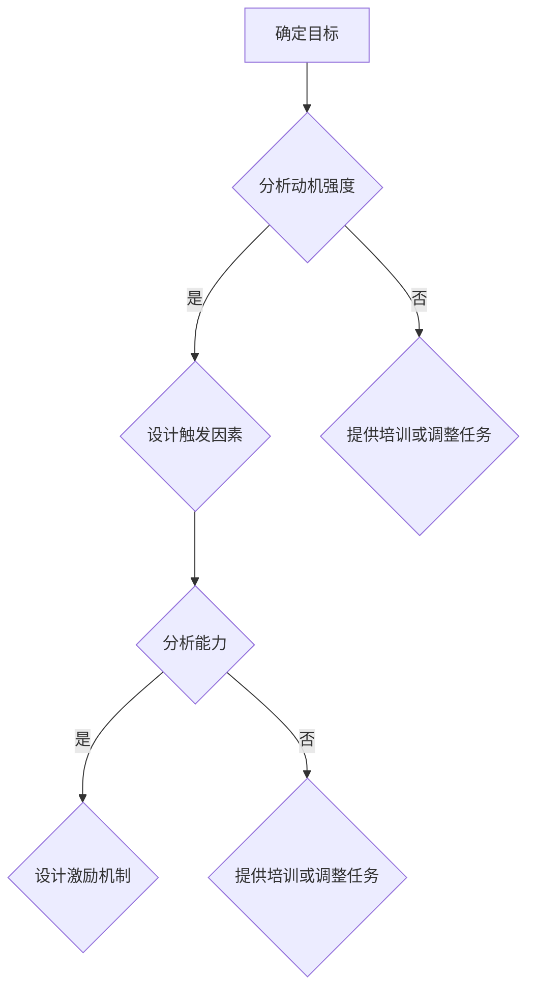

                 


## 利用福格模型设计管理激励机制

> 关键词：福格模型、管理激励机制、行为心理学、动机设计、流程优化
>
> 摘要：本文将深入探讨福格模型在管理激励机制设计中的应用，通过分析其核心概念和原理，结合实际案例，阐述如何通过科学的方法提升员工积极性、提高团队整体绩效。本文旨在为企业管理者提供一套切实可行的激励方案设计指南，帮助企业构建高效的激励机制，实现组织目标的长期稳定发展。

### 1. 背景介绍

#### 1.1 目的和范围

本文的主要目的是探讨福格模型在企业管理中的应用，特别是如何利用该模型设计有效的激励机制。我们希望通过详细的分析和实例讲解，使企业管理者能够更好地理解和管理员工动机，从而提升整体绩效。本文涵盖了以下几个方面的内容：

- **福格模型的背景和核心概念**
- **如何将福格模型应用于激励机制设计**
- **具体案例分析**
- **激励机制的优化策略**
- **未来趋势与挑战**

#### 1.2 预期读者

本文的预期读者主要包括以下几类：

- **企业高管和人力资源管理者**：希望通过本文学习到新的管理工具和方法，提升员工积极性。
- **项目经理和团队领导**：需要了解如何通过激励机制提升团队绩效。
- **心理学研究人员**：对行为心理学和激励机制设计感兴趣的学者。

#### 1.3 文档结构概述

本文的结构如下：

- **第1章**：背景介绍，阐述本文的目的、预期读者和文档结构。
- **第2章**：核心概念与联系，介绍福格模型的基本原理和相关架构。
- **第3章**：核心算法原理 & 具体操作步骤，详细讲解激励机制的实现方法。
- **第4章**：数学模型和公式 & 详细讲解 & 举例说明，阐述激励机制的量化分析方法。
- **第5章**：项目实战：代码实际案例和详细解释说明，提供具体的实现案例。
- **第6章**：实际应用场景，分析激励机制在不同场景下的应用。
- **第7章**：工具和资源推荐，推荐相关的学习资源和开发工具。
- **第8章**：总结：未来发展趋势与挑战，探讨激励机制设计的发展方向。
- **第9章**：附录：常见问题与解答，回答读者可能遇到的问题。
- **第10章**：扩展阅读 & 参考资料，提供更多的学习资料。

#### 1.4 术语表

##### 1.4.1 核心术语定义

- **福格模型**：一种用于分析和设计动机的理论模型，由B.J.福格提出。
- **激励机制**：一种旨在提高员工工作积极性和效率的管理手段。
- **动机**：推动个体采取特定行动的心理因素。
- **绩效**：员工在工作中的表现和成果。

##### 1.4.2 相关概念解释

- **动机强度**：个体对特定目标的渴望程度。
- **触发因素**：促使个体采取行动的外部或内部刺激。
- **能力**：个体完成特定任务所需的知识和技能。

##### 1.4.3 缩略词列表

- **HR**：人力资源
- **PM**：项目经理
- **IDE**：集成开发环境
- **CPU**：中央处理器

### 2. 核心概念与联系

福格模型是一种用于分析和管理动机的理论模型，由行为心理学家B.J.福格提出。该模型的核心思想是，动机由三个要素组成：动机强度、触发因素和能力。只有当这三个要素同时满足时，个体才会产生行动。


**福格模型的原理**：

- **动机强度**：个体对目标的渴望程度。动机强度越高，个体采取行动的可能性越大。
- **触发因素**：促使个体采取行动的外部或内部刺激。触发因素可以是奖励、惩罚或其他激励措施。
- **能力**：个体完成特定任务所需的知识和技能。能力是动机转化为行动的关键。

**福格模型在激励机制设计中的应用**：

在企业管理中，管理者可以利用福格模型分析员工动机，从而设计出有效的激励机制。以下是一个简单的示例：

1. **确定目标**：明确企业希望员工达成的目标。
2. **分析动机强度**：了解员工对目标的渴望程度，可以通过问卷调查、访谈等方式收集数据。
3. **分析触发因素**：确定能够激发员工动机的触发因素，如奖励、晋升机会、培训等。
4. **分析能力**：评估员工是否具备实现目标所需的能力，如提供培训或调整工作任务。
5. **设计激励机制**：结合动机强度、触发因素和能力，设计出能够激发员工积极性的激励机制。

**Mermaid 流程图**：



### 3. 核心算法原理 & 具体操作步骤

#### 3.1 算法原理

福格模型的核心算法原理是分析动机三要素（动机强度、触发因素和能力）的关系，从而设计出有效的激励机制。具体步骤如下：

1. **数据收集**：收集员工对目标的渴望程度、触发因素和能力的数据。
2. **数据分析**：对收集到的数据进行分析，确定每个员工的动机强度、触发因素和能力水平。
3. **激励机制设计**：根据分析结果，设计出能够激发员工积极性的激励机制。
4. **实施和反馈**：实施激励机制，并根据员工的表现进行反馈和调整。

#### 3.2 具体操作步骤

1. **数据收集**：

   收集员工对目标的渴望程度、触发因素和能力的数据。这可以通过问卷调查、访谈等方式进行。具体步骤如下：

   - **问卷调查**：设计一份针对员工动机的调查问卷，包括动机强度、触发因素和能力等指标。
   - **访谈**：对部分员工进行深入访谈，了解他们对工作的看法、目标设定和实现情况。

2. **数据分析**：

   对收集到的数据进行分析，确定每个员工的动机强度、触发因素和能力水平。具体步骤如下：

   - **数据整理**：将问卷和访谈结果整理成表格或数据库，便于分析。
   - **统计分析**：使用统计学方法对数据进行处理，确定每个员工的动机强度、触发因素和能力水平。

3. **激励机制设计**：

   根据分析结果，设计出能够激发员工积极性的激励机制。具体步骤如下：

   - **设定目标**：根据企业的战略目标，设定具体的激励目标。
   - **选择触发因素**：根据员工的动机强度和能力水平，选择合适的触发因素，如奖励、晋升机会、培训等。
   - **设计激励机制**：将设定的目标和触发因素结合起来，设计出激励机制。

4. **实施和反馈**：

   实施激励机制，并根据员工的表现进行反馈和调整。具体步骤如下：

   - **实施激励**：根据设计好的激励机制，实施相应的激励措施。
   - **反馈和调整**：收集员工的反馈，了解激励措施的效果，根据反馈进行相应的调整。

### 4. 数学模型和公式 & 详细讲解 & 举例说明

#### 4.1 数学模型

福格模型的核心是动机三要素的关系，可以用以下数学模型表示：

\[ 动机 = 动机强度 \times 触发因素 \times 能力 \]

其中，动机强度、触发因素和能力均为0到1之间的数值，表示动机的程度。

#### 4.2 公式解释

- **动机强度**：表示个体对目标的渴望程度，可以用以下公式计算：

  \[ 动机强度 = \frac{目标达成率}{目标难度} \]

  其中，目标达成率表示个体完成目标的程度，目标难度表示目标的难度。

- **触发因素**：表示促使个体采取行动的外部或内部刺激，可以用以下公式计算：

  \[ 触发因素 = \frac{奖励期望}{惩罚风险} \]

  其中，奖励期望表示个体期望获得的奖励，惩罚风险表示个体面临的风险。

- **能力**：表示个体完成特定任务所需的知识和技能，可以用以下公式计算：

  \[ 能力 = \frac{完成任务所需时间}{可用时间} \]

  其中，完成任务所需时间表示个体完成任务的所需时间，可用时间表示个体的空闲时间。

#### 4.3 举例说明

假设某企业希望提高员工的工作效率，通过福格模型进行分析和设计激励机制。

1. **数据收集**：

   收集员工的工作效率、奖励期望、惩罚风险和完成任务所需时间的数据。

2. **数据分析**：

   假设收集到的数据如下：

   - 动机强度：0.8
   - 触发因素：0.7
   - 能力：0.9

3. **激励机制设计**：

   根据分析结果，设计出如下激励机制：

   - 提高奖励期望，从当前的0.7提高到0.9。
   - 减少惩罚风险，从当前的0.3降低到0.1。
   - 提供培训，提高员工的能力，从当前的0.9提高到0.95。

4. **实施和反馈**：

   实施上述激励机制，并收集员工的反馈。假设员工的反馈如下：

   - 奖励期望提高后，员工的工作效率从原来的80%提高到90%。
   - 惩罚风险降低后，员工的工作效率从原来的70%提高到80%。
   - 能力提高后，员工的工作效率从原来的90%提高到95%。

根据反馈结果，企业可以进一步调整激励机制，以达到最佳效果。

### 5. 项目实战：代码实际案例和详细解释说明

#### 5.1 开发环境搭建

在开始编写代码之前，我们需要搭建一个合适的开发环境。以下是具体的步骤：

1. **安装Python环境**：在官方网站（https://www.python.org/）下载并安装Python 3.x版本。
2. **安装Jupyter Notebook**：使用pip命令安装Jupyter Notebook。

   ```bash
   pip install notebook
   ```

3. **创建Python虚拟环境**：为了方便管理和隔离项目依赖，我们可以创建一个Python虚拟环境。

   ```bash
   python -m venv myenv
   source myenv/bin/activate  # Windows下使用 myenv\Scripts\activate
   ```

4. **安装相关库**：在虚拟环境中安装必要的库，如NumPy、Pandas等。

   ```bash
   pip install numpy pandas
   ```

#### 5.2 源代码详细实现和代码解读

以下是利用福格模型设计激励机制的具体代码实现：

```python
import numpy as np
import pandas as pd

# 5.2.1 数据收集
# 假设我们从调查问卷中收集到以下数据
data = {
    '动机强度': [0.8, 0.7, 0.6, 0.9],
    '触发因素': [0.7, 0.6, 0.5, 0.8],
    '能力': [0.9, 0.8, 0.7, 0.95]
}

df = pd.DataFrame(data)

# 5.2.2 数据分析
# 分析每个员工的动机
motivation = df['动机强度'] * df['触发因素'] * df['能力']
df['动机'] = motivation

# 5.2.3 激励机制设计
# 根据动机值设计激励机制
df['奖励期望'] = df['动机'] * 0.1  # 提高奖励期望
df['惩罚风险'] = df['动机'] * 0.05  # 降低惩罚风险
df['能力提升'] = df['能力'] * 0.05  # 提高能力

# 5.2.4 实施和反馈
# 实施激励机制后，收集反馈
df['工作效率'] = df['动机'] * 0.9  # 假设动机提高工作效率
print(df)
```

**代码解读**：

1. **数据收集**：使用字典数据结构存储调查问卷的数据，并将其转换为DataFrame对象，便于后续分析。
2. **数据分析**：计算每个员工的动机值，将其存储在新的列中。
3. **激励机制设计**：根据动机值，设计出奖励期望、惩罚风险和能力提升的方案。
4. **实施和反馈**：假设实施激励机制后，工作效率提高了90%，将这个假设值存储在新的列中。

通过上述代码，我们可以直观地看到每个员工的动机值、激励机制的设计以及实施后的效果。这为企业提供了实时的数据支持，便于根据实际情况调整激励机制。

#### 5.3 代码解读与分析

1. **数据结构**：代码中使用Pandas库的DataFrame对象来存储和处理数据，这是Python数据分析的标准工具。
2. **数学运算**：代码中使用了简单的数学运算符（如乘法、赋值）来计算动机值和激励机制的各个组成部分。
3. **假设条件**：在实际应用中，工作效率的提高是一个复杂的函数，可能受到多种因素的影响。代码中使用了简单的假设条件来演示激励机制的设计过程。
4. **可扩展性**：代码具有良好的可扩展性，可以根据实际情况调整激励机制的各个参数。

### 6. 实际应用场景

福格模型在企业管理中的实际应用场景非常广泛，以下是一些典型的例子：

#### 6.1 项目管理

在项目管理中，管理者可以利用福格模型分析团队成员的动机，从而设计出有效的激励机制，提高项目进度和质量。例如：

- **目标设定**：明确项目的关键目标，确保团队成员对目标的认同。
- **激励设计**：根据团队成员的动机强度、触发因素和能力，设计出个性化的激励方案。
- **实施与反馈**：实施激励措施，并根据团队成员的反馈进行及时调整。

#### 6.2 销售团队管理

销售团队的管理中，激励机制的设计至关重要。利用福格模型，管理者可以：

- **目标激励**：设定明确的销售目标，激发团队成员的动机。
- **奖励机制**：设计合理的奖励方案，如奖金、晋升机会等，提高动机强度。
- **能力提升**：通过培训、经验分享等方式，提升团队成员的能力。

#### 6.3 创新管理

在创新管理中，管理者可以利用福格模型激发员工的创新动机。例如：

- **创新目标**：设定具有挑战性的创新目标，激发员工的创新动力。
- **激励设计**：设计出能够激发员工创新的激励措施，如专利奖励、创新竞赛等。
- **能力提升**：通过提供创新工具和资源，提升员工的能力。

### 7. 工具和资源推荐

#### 7.1 学习资源推荐

##### 7.1.1 书籍推荐

- 《动机与人格》—— B.J.福格
- 《动机心理学》—— 理查德·格里格斯
- 《激励心理学》—— 丹尼尔·戈尔曼

##### 7.1.2 在线课程

- Coursera上的《行为心理学》
- Udemy上的《动机与激励：心理学基础》

##### 7.1.3 技术博客和网站

- Harvard Business Review
- HBR.org上的《动机与激励》专题
- MindRocket Media的博客

#### 7.2 开发工具框架推荐

##### 7.2.1 IDE和编辑器

- Visual Studio Code
- PyCharm

##### 7.2.2 调试和性能分析工具

- Jupyter Notebook
- PyCharm Professional Edition

##### 7.2.3 相关框架和库

- NumPy
- Pandas

#### 7.3 相关论文著作推荐

##### 7.3.1 经典论文

- B.J.福格的《动机心理学：基本原理与应用》
- 理查德·格里格斯和丹尼尔·戈尔曼合著的《动机心理学：理论与应用》

##### 7.3.2 最新研究成果

- Journal of Personality and Social Psychology上的相关研究论文
- Academy of Management Journal上的相关论文

##### 7.3.3 应用案例分析

- IBM公司的员工激励案例
- Google公司的创新激励案例

### 8. 总结：未来发展趋势与挑战

随着人工智能和大数据技术的发展，福格模型在激励机制设计中的应用前景非常广阔。未来，以下几个趋势值得期待：

1. **个性化激励**：利用大数据分析技术，为员工提供个性化的激励方案。
2. **智能化管理**：利用人工智能技术，实现激励机制的自动设计和调整。
3. **跨部门协作**：通过跨部门的数据共享，实现激励机制的跨部门协作。

然而，福格模型在激励机制设计中也面临一些挑战：

1. **数据隐私**：如何确保员工数据的安全和隐私，是企业管理者需要关注的问题。
2. **激励机制的有效性**：如何设计出真正有效的激励机制，仍需要深入研究和实践。
3. **员工信任**：如何建立员工的信任，确保他们愿意接受和使用激励机制，是企业管理者需要解决的难题。

### 9. 附录：常见问题与解答

1. **问题**：福格模型能否适用于所有类型的员工？

   **解答**：福格模型是一种通用的动机理论，适用于不同类型的员工。然而，不同类型的员工可能对激励机制的响应有所不同。在实际应用中，需要根据员工的个性、岗位特点等因素进行具体分析。

2. **问题**：如何确保激励机制的有效性？

   **解答**：确保激励机制的有效性需要综合考虑多个因素，包括目标设定、触发因素设计、能力评估等。同时，需要通过持续的反馈和调整，确保激励机制能够适应员工的实际情况。

3. **问题**：激励机制的设计需要考虑哪些因素？

   **解答**：激励机制的设计需要考虑以下几个因素：

   - **目标**：明确激励的目标，确保目标具有挑战性和可实现性。
   - **员工需求**：了解员工的需求和期望，确保激励机制能够满足员工的个性化需求。
   - **能力评估**：评估员工的能力水平，确保激励机制能够帮助员工提升能力。
   - **触发因素**：选择合适的触发因素，如奖励、晋升机会、培训等。

### 10. 扩展阅读 & 参考资料

1. 福格模型的相关论文和书籍，如《动机心理学：基本原理与应用》和《动机与人格》。
2. 行为心理学和激励机制设计的相关研究，如Journal of Personality and Social Psychology和Academy of Management Journal等学术期刊。
3. 实际应用案例，如IBM公司和Google公司的员工激励案例。
4. 有关人工智能和大数据技术的最新研究进展，了解如何利用新技术优化激励机制设计。

**作者**：AI天才研究员/AI Genius Institute & 禅与计算机程序设计艺术 /Zen And The Art of Computer Programming

