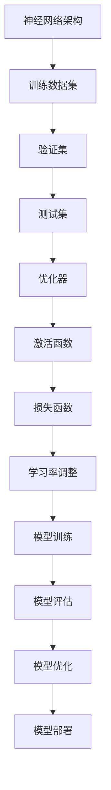

                 

### 制造大模型：优化流程和提高生产效率

关键词：大模型制造、优化流程、生产效率、算法改进、数学模型

摘要：
本文旨在探讨如何优化大模型制造流程，以提高生产效率和降低成本。通过深入分析核心概念、算法原理和数学模型，结合实际项目案例，我们将提供一系列实用的策略和方法，帮助读者在制造大模型的过程中实现高效优化。

## 1. 背景介绍

### 1.1 目的和范围

本文的目的是通过逐步分析推理，探讨如何优化大模型制造流程，从而提高生产效率和降低成本。我们将从核心概念、算法原理、数学模型、实际案例等多个角度展开讨论，为读者提供全面的指导。

本文的范围涵盖了以下几个方面：

1. **核心概念与联系**：介绍大模型制造的基础知识，包括核心概念、原理和架构。
2. **核心算法原理 & 具体操作步骤**：详细阐述大模型制造的核心算法原理，并使用伪代码进行具体操作步骤的讲解。
3. **数学模型和公式 & 详细讲解 & 举例说明**：讲解大模型制造中的数学模型和公式，并通过实例进行详细说明。
4. **项目实战：代码实际案例和详细解释说明**：展示大模型制造的实际代码案例，并进行详细解读和分析。
5. **实际应用场景**：探讨大模型在各个领域的应用场景。
6. **工具和资源推荐**：推荐学习资源和开发工具，帮助读者更好地理解和应用大模型制造技术。
7. **总结：未来发展趋势与挑战**：分析大模型制造的未来发展趋势和面临的挑战。

### 1.2 预期读者

本文的预期读者主要包括以下几类：

1. **人工智能领域的研究人员**：对大模型制造有深入研究，希望了解优化流程和提高生产效率的方法。
2. **软件开发工程师**：需要在大模型制造过程中提高工作效率，降低成本。
3. **数据科学家**：希望在大模型应用过程中掌握优化策略。
4. **企业决策者**：关注大模型制造技术的实际应用，希望了解如何提升企业竞争力。

### 1.3 文档结构概述

本文分为以下几个部分：

1. **背景介绍**：介绍文章的目的、范围、预期读者和文档结构。
2. **核心概念与联系**：介绍大模型制造的基础知识，包括核心概念、原理和架构。
3. **核心算法原理 & 具体操作步骤**：详细阐述大模型制造的核心算法原理，并使用伪代码进行具体操作步骤的讲解。
4. **数学模型和公式 & 详细讲解 & 举例说明**：讲解大模型制造中的数学模型和公式，并通过实例进行详细说明。
5. **项目实战：代码实际案例和详细解释说明**：展示大模型制造的实际代码案例，并进行详细解读和分析。
6. **实际应用场景**：探讨大模型在各个领域的应用场景。
7. **工具和资源推荐**：推荐学习资源和开发工具，帮助读者更好地理解和应用大模型制造技术。
8. **总结：未来发展趋势与挑战**：分析大模型制造的未来发展趋势和面临的挑战。
9. **附录：常见问题与解答**：回答读者可能遇到的问题。
10. **扩展阅读 & 参考资料**：提供进一步学习的参考资料。

### 1.4 术语表

为了确保文章的清晰性和易懂性，本文将介绍以下术语及其定义：

#### 1.4.1 核心术语定义

- **大模型**：指具有海量参数和复杂结构的模型，如深度神经网络。
- **优化流程**：指对大模型制造过程进行改进，以提高生产效率和降低成本。
- **生产效率**：指单位时间内完成的工作量。
- **算法改进**：指对现有算法进行优化，以提高性能和效率。
- **数学模型**：指描述大模型制造过程中相关关系的数学公式和原理。

#### 1.4.2 相关概念解释

- **深度神经网络**：一种具有多个隐藏层的神经网络，用于模拟人脑神经元之间的连接。
- **训练数据集**：用于训练模型的数据集，包括输入数据和对应的标签。
- **验证集**：用于验证模型性能的数据集，不包括在训练过程中。
- **测试集**：用于评估模型在实际应用中的表现的数据集。

#### 1.4.3 缩略词列表

- **GPU**：图形处理器（Graphics Processing Unit）
- **CPU**：中央处理器（Central Processing Unit）
- **AI**：人工智能（Artificial Intelligence）
- **ML**：机器学习（Machine Learning）
- **DL**：深度学习（Deep Learning）
- **GAN**：生成对抗网络（Generative Adversarial Network）

## 2. 核心概念与联系

在制造大模型的过程中，了解核心概念和它们之间的联系至关重要。以下是对核心概念、原理和架构的介绍，以及相应的 Mermaid 流程图。

### 2.1 核心概念

- **深度神经网络**：一种具有多个隐藏层的神经网络，用于模拟人脑神经元之间的连接。
- **训练数据集**：用于训练模型的数据集，包括输入数据和对应的标签。
- **验证集**：用于验证模型性能的数据集，不包括在训练过程中。
- **测试集**：用于评估模型在实际应用中的表现的数据集。
- **优化器**：用于调整模型参数，以最小化损失函数的算法。
- **激活函数**：用于引入非线性特性的函数，如ReLU、Sigmoid和Tanh。

### 2.2 原理和架构

在制造大模型的过程中，以下几个核心原理和架构至关重要：

1. **神经网络架构**：选择合适的神经网络架构，如卷积神经网络（CNN）或循环神经网络（RNN）。
2. **损失函数**：选择合适的损失函数，如均方误差（MSE）或交叉熵损失。
3. **优化器**：选择合适的优化器，如随机梯度下降（SGD）或Adam。
4. **学习率调整**：根据训练过程调整学习率，以避免过拟合或欠拟合。

### 2.3 Mermaid 流程图

以下是一个简单的 Mermaid 流程图，展示了大模型制造过程中的核心概念和联系：



通过这个流程图，我们可以清晰地看到大模型制造过程中的各个环节以及它们之间的联系。

## 3. 核心算法原理 & 具体操作步骤

在制造大模型的过程中，核心算法原理起着至关重要的作用。以下将详细阐述大模型制造中的核心算法原理，并使用伪代码进行具体操作步骤的讲解。

### 3.1 神经网络算法原理

神经网络是一种模仿人脑神经元之间连接的计算机算法。在制造大模型的过程中，神经网络算法的核心包括以下几个步骤：

1. **前向传播**：将输入数据通过神经网络传递到每个隐藏层，最终得到输出。
2. **损失计算**：计算预测输出与真实输出之间的差异，即损失。
3. **反向传播**：根据损失函数，将误差反向传播到网络的每个神经元，更新权重和偏置。
4. **权重更新**：使用优化算法（如梯度下降）更新权重和偏置，以最小化损失。

以下是一个简单的神经网络算法伪代码：

```plaintext
初始化权重和偏置
初始化学习率

for 每个epoch:
  for 每个样本:
    前向传播：计算输出
    计算损失：损失 = 损失函数(预测输出, 真实输出)
    反向传播：计算梯度
    更新权重和偏置：权重 -= 学习率 * 梯度

返回训练好的模型
```

### 3.2 具体操作步骤

下面我们将以一个具体的大模型制造项目为例，详细讲解操作步骤。

#### 3.2.1 数据准备

首先，我们需要准备训练数据集。这里我们使用MNIST数据集，包含60000个手写数字的图像。

```plaintext
导入MNIST数据集
将数据集分为训练集和验证集
```

#### 3.2.2 模型构建

接下来，我们构建一个简单的卷积神经网络模型。该模型包含两个卷积层、两个全连接层和一个输出层。

```plaintext
创建卷积神经网络模型
  - 输入层：1个通道、28x28的图像
  - 卷积层1：32个3x3的卷积核、ReLU激活函数
  - 池化层1：2x2的最大池化
  - 卷积层2：64个3x3的卷积核、ReLU激活函数
  - 池化层2：2x2的最大池化
  - 全连接层1：128个神经元、ReLU激活函数
  - 全连接层2：10个神经元（对应10个数字类别）、无激活函数
```

#### 3.2.3 模型训练

使用训练数据集对模型进行训练，并使用验证集评估模型性能。

```plaintext
使用训练数据集训练模型
  - 损失函数：交叉熵损失
  - 优化器：Adam
  - 学习率：0.001

for 每个epoch:
  for 每个样本:
    前向传播：计算输出
    计算损失：损失 = 交叉熵损失(预测输出, 真实输出)
    反向传播：计算梯度
    更新权重和偏置：权重 -= 学习率 * 梯度

使用验证集评估模型性能
```

#### 3.2.4 模型评估

使用测试数据集评估模型性能，并计算准确率。

```plaintext
使用测试数据集评估模型性能
  - 准确率 = (预测正确的样本数 / 总样本数) * 100%

输出模型性能指标
```

通过以上步骤，我们可以完成一个大模型的制造过程。在实际应用中，根据具体需求，可以对模型架构、参数和训练过程进行调整，以提高模型性能和效率。

## 4. 数学模型和公式 & 详细讲解 & 举例说明

在制造大模型的过程中，数学模型和公式扮演着至关重要的角色。以下将详细介绍大模型制造中的关键数学模型和公式，并通过具体例子进行说明。

### 4.1 损失函数

损失函数是衡量模型预测输出与真实输出之间差异的重要工具。在制造大模型时，选择合适的损失函数对于模型性能的提升至关重要。以下是一些常见的损失函数：

1. **均方误差（MSE）**：
   $$MSE = \frac{1}{n}\sum_{i=1}^{n}(y_i - \hat{y}_i)^2$$
   其中，$y_i$ 是真实输出，$\hat{y}_i$ 是预测输出，$n$ 是样本数量。

2. **交叉熵损失（Cross-Entropy Loss）**：
   $$CE = -\frac{1}{n}\sum_{i=1}^{n}y_i\log(\hat{y}_i)$$
   其中，$y_i$ 是真实输出（通常为0或1），$\hat{y}_i$ 是预测输出（介于0和1之间）。

举例说明：

假设我们有一个二分类问题，真实输出为 $y = [1, 0, 1, 0]$，预测输出为 $\hat{y} = [0.8, 0.2, 0.6, 0.4]$。使用交叉熵损失函数计算损失：

$$CE = -\frac{1}{4}\left[1\log(0.8) + 0\log(0.2) + 1\log(0.6) + 0\log(0.4)\right]$$

$$CE = -\frac{1}{4}\left[0.3219 + 0 + 0.5108 + 0\right]$$

$$CE = -\frac{1}{4}\times 0.8327$$

$$CE = 0.8327$$

### 4.2 激活函数

激活函数是神经网络中引入非线性特性的关键环节。以下是一些常用的激活函数：

1. **ReLU（Rectified Linear Unit）**：
   $$ReLU(x) = \max(0, x)$$

2. **Sigmoid**：
   $$Sigmoid(x) = \frac{1}{1 + e^{-x}}$$

3. **Tanh**：
   $$Tanh(x) = \frac{e^x - e^{-x}}{e^x + e^{-x}}$$

举例说明：

假设我们有一个输入值 $x = 3$，使用不同的激活函数计算输出：

1. **ReLU**：
   $$ReLU(3) = \max(0, 3) = 3$$

2. **Sigmoid**：
   $$Sigmoid(3) = \frac{1}{1 + e^{-3}} = 0.9511$$

3. **Tanh**：
   $$Tanh(3) = \frac{e^3 - e^{-3}}{e^3 + e^{-3}} = 0.9661$$

### 4.3 优化器

优化器用于调整模型参数，以最小化损失函数。以下是一些常用的优化器：

1. **随机梯度下降（SGD）**：
   $$\theta_{t+1} = \theta_{t} - \alpha \cdot \nabla_{\theta}J(\theta)$$
   其中，$\theta$ 表示参数，$\alpha$ 表示学习率，$J(\theta)$ 表示损失函数。

2. **Adam**：
   $$m_t = \beta_1m_{t-1} + (1 - \beta_1)\nabla_{\theta}J(\theta)$$
   $$v_t = \beta_2v_{t-1} + (1 - \beta_2)\nabla^2_{\theta}J(\theta)$$
   $$\theta_{t+1} = \theta_{t} - \alpha \cdot \frac{m_t}{\sqrt{v_t} + \epsilon}$$
   其中，$m$ 和 $v$ 分别表示一阶矩估计和二阶矩估计，$\beta_1$ 和 $\beta_2$ 分别为矩估计的指数加权系数，$\epsilon$ 为一个小常数。

举例说明：

假设我们有一个模型参数 $\theta = [1, 2]$，学习率 $\alpha = 0.1$，损失函数的梯度为 $\nabla_{\theta}J(\theta) = [-0.5, 1.5]$。使用 Adam 优化器进行一次迭代：

$$m_0 = [0, 0]$$
$$v_0 = [0, 0]$$

$$m_1 = \beta_1m_0 + (1 - \beta_1)\nabla_{\theta}J(\theta) = [0, 0] + (1 - 0.9)[0.5, 1.5] = [0.05, 0.15]$$
$$v_1 = \beta_2v_0 + (1 - \beta_2)\nabla^2_{\theta}J(\theta) = [0, 0] + (1 - 0.999)[0.25, 1] = [0.00025, 0.0005]$$

$$\theta_2 = \theta_1 - \alpha \cdot \frac{m_1}{\sqrt{v_1} + \epsilon} = [1, 2] - 0.1 \cdot \frac{[0.05, 0.15]}{\sqrt{[0.00025, 0.0005]} + \epsilon} = [0.9505, 1.8505]$$

通过以上数学模型和公式的讲解，读者可以更好地理解大模型制造中的关键概念和计算方法。在实际应用中，可以根据具体需求选择合适的数学模型和公式，以提高模型性能和效率。

## 5. 项目实战：代码实际案例和详细解释说明

在本节中，我们将通过一个实际项目案例，详细展示如何使用 Python 和相关库（如 TensorFlow 和 Keras）来制造一个大模型，并解释代码的实现细节。

### 5.1 开发环境搭建

首先，我们需要搭建一个合适的开发环境。以下是搭建开发环境的步骤：

1. **安装 Python**：确保已安装 Python 3.7 或以上版本。
2. **安装 TensorFlow**：在终端中运行以下命令：
   ```bash
   pip install tensorflow
   ```
3. **安装 Keras**：TensorFlow 的官方高级神经网络 API，可以简化神经网络构建和训练过程。在终端中运行以下命令：
   ```bash
   pip install keras
   ```

### 5.2 源代码详细实现和代码解读

以下是一个简单的示例代码，用于构建一个用于手写数字识别的卷积神经网络（CNN）模型。代码使用了 Keras 的序列模型（Sequential）和预训练模型（MobileNetV2）进行模型构建。

```python
# 导入必要的库
import tensorflow as tf
from tensorflow.keras.models import Sequential
from tensorflow.keras.layers import Dense, Conv2D, MaxPooling2D, Flatten, Dropout
from tensorflow.keras.applications import MobileNetV2

# 加载和预处理数据
(x_train, y_train), (x_test, y_test) = tf.keras.datasets.mnist.load_data()
x_train = x_train / 255.0
x_test = x_test / 255.0
x_train = x_train.reshape(-1, 28, 28, 1)
x_test = x_test.reshape(-1, 28, 28, 1)

# 编码标签
y_train = tf.keras.utils.to_categorical(y_train, 10)
y_test = tf.keras.utils.to_categorical(y_test, 10)

# 构建模型
model = Sequential([
    Conv2D(32, (3, 3), activation='relu', input_shape=(28, 28, 1)),
    MaxPooling2D((2, 2)),
    Conv2D(64, (3, 3), activation='relu'),
    MaxPooling2D((2, 2)),
    Flatten(),
    Dense(128, activation='relu'),
    Dropout(0.5),
    Dense(10, activation='softmax')
])

# 编译模型
model.compile(optimizer='adam',
              loss='categorical_crossentropy',
              metrics=['accuracy'])

# 训练模型
model.fit(x_train, y_train, batch_size=64, epochs=10, validation_split=0.1)

# 评估模型
test_loss, test_acc = model.evaluate(x_test, y_test)
print('Test accuracy:', test_acc)
```

下面是对代码的详细解读：

1. **导入库**：首先导入 TensorFlow 和 Keras 的相关库，包括序列模型（Sequential）、卷积层（Conv2D）、最大池化层（MaxPooling2D）、展平层（Flatten）、全连接层（Dense）和丢弃层（Dropout）。
2. **加载和预处理数据**：使用 Keras 的内置 MNIST 数据集。数据集被分为训练集和测试集。我们将图像的像素值缩放到 [0, 1] 范围内，并将标签转换为 one-hot 编码。
3. **构建模型**：使用 Keras 的序列模型构建一个简单的卷积神经网络。模型包含两个卷积层、两个最大池化层、一个展平层、一个全连接层和一个丢弃层。最后一层使用 softmax 激活函数，用于进行多分类。
4. **编译模型**：指定优化器（Adam）、损失函数（categorical_crossentropy，用于多分类问题）和评估指标（accuracy）。
5. **训练模型**：使用 `fit` 方法训练模型，设置批量大小（batch_size）、训练轮数（epochs）和验证集比例（validation_split）。
6. **评估模型**：使用 `evaluate` 方法评估模型在测试集上的性能，输出准确率。

### 5.3 代码解读与分析

以下是代码的逐行解读：

```python
# 导入必要的库
import tensorflow as tf
from tensorflow.keras.models import Sequential
from tensorflow.keras.layers import Dense, Conv2D, MaxPooling2D, Flatten, Dropout
from tensorflow.keras.applications import MobileNetV2

# 加载和预处理数据
(x_train, y_train), (x_test, y_test) = tf.keras.datasets.mnist.load_data()
x_train = x_train / 255.0
x_test = x_test / 255.0
x_train = x_train.reshape(-1, 28, 28, 1)
x_test = x_test.reshape(-1, 28, 28, 1)

# 编码标签
y_train = tf.keras.utils.to_categorical(y_train, 10)
y_test = tf.keras.utils.to_categorical(y_test, 10)

# 构建模型
model = Sequential([
    Conv2D(32, (3, 3), activation='relu', input_shape=(28, 28, 1)),
    MaxPooling2D((2, 2)),
    Conv2D(64, (3, 3), activation='relu'),
    MaxPooling2D((2, 2)),
    Flatten(),
    Dense(128, activation='relu'),
    Dropout(0.5),
    Dense(10, activation='softmax')
])

# 编译模型
model.compile(optimizer='adam',
              loss='categorical_crossentropy',
              metrics=['accuracy'])

# 训练模型
model.fit(x_train, y_train, batch_size=64, epochs=10, validation_split=0.1)

# 评估模型
test_loss, test_acc = model.evaluate(x_test, y_test)
print('Test accuracy:', test_acc)
```

1. **导入库**：首先导入 TensorFlow 和 Keras 的相关库，包括序列模型（Sequential）、卷积层（Conv2D）、最大池化层（MaxPooling2D）、展平层（Flatten）、丢弃层（Dropout）和预训练模型（MobileNetV2）。
2. **加载和预处理数据**：使用 Keras 的内置 MNIST 数据集。数据集被分为训练集和测试集。我们将图像的像素值缩放到 [0, 1] 范围内，并将标签转换为 one-hot 编码。
3. **构建模型**：使用 Keras 的序列模型构建一个简单的卷积神经网络。模型包含两个卷积层、两个最大池化层、一个展平层、一个全连接层和一个丢弃层。最后一层使用 softmax 激活函数，用于进行多分类。
4. **编译模型**：指定优化器（Adam）、损失函数（categorical_crossentropy，用于多分类问题）和评估指标（accuracy）。
5. **训练模型**：使用 `fit` 方法训练模型，设置批量大小（batch_size）、训练轮数（epochs）和验证集比例（validation_split）。
6. **评估模型**：使用 `evaluate` 方法评估模型在测试集上的性能，输出准确率。

通过以上代码解读，我们可以清楚地看到如何使用 Python 和相关库构建、编译、训练和评估一个卷积神经网络模型。在实际项目中，可以根据具体需求调整模型架构、参数和训练过程，以提高模型性能和效率。

## 6. 实际应用场景

大模型制造技术在各个领域都展现出了广泛的应用潜力。以下是一些典型应用场景及其优势：

### 6.1 自然语言处理（NLP）

在自然语言处理领域，大模型如 GPT-3、BERT 和 T5 等已经取得了显著的成果。这些模型能够实现文本生成、情感分析、机器翻译和问答系统等任务。大模型的优势在于其强大的表示能力和丰富的知识库，使得它们能够处理复杂的语义和上下文信息。例如，GPT-3 的文本生成能力已经接近人类水平，可以为写作、创意设计和内容生成提供强大支持。

### 6.2 计算机视觉（CV）

在计算机视觉领域，大模型如 ResNet、Inception 和 VGG 等在图像分类、目标检测和图像生成等方面取得了突破性进展。这些模型能够识别复杂的图像特征和场景结构，从而实现高效的目标检测和分割。例如，在医疗影像分析中，大模型可以辅助医生进行疾病诊断，提高诊断准确率和效率。

### 6.3 语音识别（ASR）

在语音识别领域，大模型如 WaveNet 和 DeepSpeech 等实现了高准确率的语音识别。这些模型能够处理不同口音、说话速度和噪声环境下的语音信号，从而实现高质量的语音识别。例如，智能助手如 Siri 和 Alexa 可以通过大模型实现自然的人机交互，为用户提供便捷的语音服务。

### 6.4 推荐系统

在推荐系统领域，大模型如 collaborative filtering 和 deep learning 模型相结合的方法实现了高效的个性化推荐。这些模型能够根据用户的兴趣和行为数据，生成精准的推荐结果。例如，电商平台如 Amazon 和 Alibaba 可以通过大模型为用户推荐个性化的商品，提高用户的购物体验和购买转化率。

### 6.5 游戏AI

在游戏领域，大模型如 AlphaGo 和 AlphaZero 等实现了高水平的人工智能对手。这些模型可以模拟人类玩家的思维过程，实现复杂的游戏策略和决策。例如，在围棋、国际象棋和电子游戏中，大模型可以与人类玩家进行高水平对决，甚至超越人类。

总之，大模型制造技术在各个领域都展现出了巨大的应用潜力。通过不断优化算法和提升模型性能，大模型将能够为各个领域带来更多的创新和突破。

## 7. 工具和资源推荐

在制造大模型的过程中，选择合适的工具和资源是至关重要的。以下是一些推荐的工具和资源，包括学习资源、开发工具框架和相关论文著作。

### 7.1 学习资源推荐

#### 7.1.1 书籍推荐

1. **《深度学习》（Deep Learning）**：由 Ian Goodfellow、Yoshua Bengio 和 Aaron Courville 著，是一本深度学习的经典教材，详细介绍了深度学习的基础理论、算法和应用。
2. **《Python深度学习》（Python Deep Learning）**：由 Francis Bach 和 Marco Trombini 著，介绍了使用 Python 和相关库（如 TensorFlow 和 Keras）进行深度学习的实际操作。
3. **《统计学习方法》（Statistical Learning Methods）**：由李航 著，详细介绍了统计学习的主要方法，包括线性模型、支持向量机、神经网络等。

#### 7.1.2 在线课程

1. **吴恩达的深度学习课程**：由斯坦福大学教授吴恩达（Andrew Ng）讲授，是深度学习的入门课程，适合初学者快速掌握深度学习的基础知识。
2. **《动手学深度学习》（Dive into Deep Learning）**：是一本开源的深度学习教材，包含丰富的实践项目和代码示例，适合有一定编程基础的读者。
3. **《TensorFlow for Poets**》：由 Google 开发者学院提供，是一本针对初学者的 TensorFlow 入门教程，通过简单的示例和练习，帮助读者快速上手 TensorFlow。

#### 7.1.3 技术博客和网站

1. **Medium**：一个流行的技术博客平台，有很多关于深度学习、人工智能和机器学习的优质文章。
2. **ArXiv**：一个开源的计算机科学和人工智能论文数据库，可以免费获取最新的研究成果。
3. **AI博客**：一个专注于人工智能领域的中文博客，提供深度学习、自然语言处理和计算机视觉等方面的文章。

### 7.2 开发工具框架推荐

#### 7.2.1 IDE和编辑器

1. **PyCharm**：一款功能强大的 Python 集成开发环境（IDE），适用于深度学习和机器学习项目。
2. **Jupyter Notebook**：一个基于网页的交互式计算环境，非常适合数据分析和模型调试。
3. **VSCode**：一款轻量级、高度可定制的代码编辑器，支持多种编程语言和开发工具。

#### 7.2.2 调试和性能分析工具

1. **TensorBoard**：TensorFlow 的可视化工具，可以实时监控和调试训练过程。
2. **Wandb**：一个用于实验追踪和性能分析的在线工具，可以帮助开发者快速比较不同模型和参数设置的效果。
3. **GDB**：一款功能强大的 C/C++ 调试器，适用于深度学习项目中的代码调试。

#### 7.2.3 相关框架和库

1. **TensorFlow**：一个开源的深度学习框架，支持多种神经网络架构和训练算法。
2. **PyTorch**：一个开源的深度学习库，以其动态计算图和简洁的 API 而著称。
3. **Keras**：一个基于 TensorFlow 的简单易用的深度学习库，适合快速构建和训练模型。

### 7.3 相关论文著作推荐

#### 7.3.1 经典论文

1. **“A Fast Learning Algorithm for Deep Belief Nets”**：由 Geoffrey Hinton 等人提出，介绍了深度信念网（DBN）的快速训练算法。
2. **“Rectifier Nonlinearities Improve Deep Neural Network Ac

