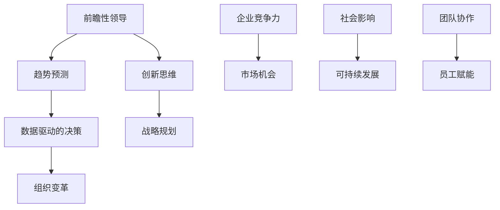
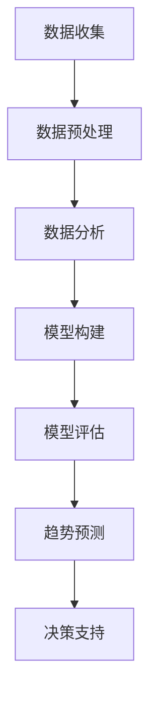

                 

# 前瞻性领导：预见并把握未来趋势的能力

> **关键词：**前瞻性领导、趋势预测、未来规划、技术前瞻、创新思维
>
> **摘要：**本文深入探讨了前瞻性领导这一关键能力在当今科技迅速发展的时代中的重要性。通过详细阐述前瞻性领导的定义、核心要素和实践方法，本文旨在帮助读者理解如何预见未来趋势，并在变化莫测的环境中保持竞争力。我们将结合实际案例，提供实用的策略和工具，以帮助读者掌握前瞻性领导的艺术。

## 1. 背景介绍

### 1.1 目的和范围

在全球化、信息化、智能化交织的当今时代，技术变革日新月异，市场环境瞬息万变。前瞻性领导能力成为企业、团队和个人在复杂环境中脱颖而出的关键。本文旨在探讨前瞻性领导的定义、核心要素和实践方法，帮助读者掌握预见未来趋势的方法，实现持续创新和长远发展。

本文将涵盖以下内容：
- 前瞻性领导的定义和核心要素
- 预见未来趋势的实践方法
- 实际案例分析和策略分享
- 工具和资源推荐
- 未来发展趋势与挑战

### 1.2 预期读者

本文适合以下读者群体：
- 企业管理层和决策者
- 科技公司和创业团队的领导者
- 技术专家和研发人员
- 对未来趋势和科技创新感兴趣的专业人士

通过阅读本文，读者将能够：
- 理解前瞻性领导的本质和重要性
- 掌握预见未来趋势的方法和工具
- 提高自身的创新思维和决策能力
- 增强在快速变化的市场环境中的应变能力

### 1.3 文档结构概述

本文结构如下：
1. 背景介绍
   - 目的和范围
   - 预期读者
   - 文档结构概述
2. 核心概念与联系
   - 前瞻性领导的定义和核心要素
   - 预见未来趋势的理论框架
3. 核心算法原理 & 具体操作步骤
   - 数据收集与分析方法
   - 趋势预测算法简介
4. 数学模型和公式 & 详细讲解 & 举例说明
   - 统计模型在趋势预测中的应用
   - 数学公式和计算方法
5. 项目实战：代码实际案例和详细解释说明
   - 实际项目中的应用场景
   - 代码实现和解读
6. 实际应用场景
   - 不同领域的实际案例分析
   - 前瞻性领导在不同行业中的实践
7. 工具和资源推荐
   - 学习资源推荐
   - 开发工具框架推荐
   - 相关论文著作推荐
8. 总结：未来发展趋势与挑战
   - 前瞻性领导能力的未来发展
   - 面临的挑战和应对策略
9. 附录：常见问题与解答
   - 前瞻性领导的相关问题解答
10. 扩展阅读 & 参考资料
    - 进一步学习和研究的推荐资料

### 1.4 术语表

#### 1.4.1 核心术语定义

- **前瞻性领导**：指领导者能够预见未来趋势，把握机遇，引导团队和企业朝着正确的方向发展的能力。
- **趋势预测**：通过对历史数据和现有信息的分析，预测未来可能发生的变化和发展方向。
- **创新思维**：指在解决问题和创造价值时，采用新颖的、创造性的方法和思路。
- **数据驱动的决策**：基于数据分析和模型预测来做出决策，而非仅仅依赖经验和直觉。

#### 1.4.2 相关概念解释

- **数据收集**：通过各种渠道和方法获取相关的数据，包括市场调研、用户反馈、行业报告等。
- **模型预测**：利用统计学、机器学习等方法，建立数学模型，预测未来的变化趋势。
- **决策支持系统**：通过数据分析、模型预测等工具，为决策者提供科学、可靠的决策依据。

#### 1.4.3 缩略词列表

- **AI**：人工智能（Artificial Intelligence）
- **ML**：机器学习（Machine Learning）
- **DL**：深度学习（Deep Learning）
- **IoT**：物联网（Internet of Things）
- **IoE**：物联网生态（Internet of Everything）

## 2. 核心概念与联系

前瞻性领导能力是领导者把握时代脉搏、引领团队不断创新的关键。要实现前瞻性领导，需要深入了解核心概念及其相互联系，如图 1 所示。



### 2.1 前瞻性领导的定义与核心要素

**定义：**前瞻性领导是指领导者通过深入洞察、预见未来趋势，引导团队进行创新和变革，从而实现企业长期发展的能力。

**核心要素：**
1. **趋势预测**：通过对市场、技术、社会等多方面信息的分析，预测未来可能发生的变化。
2. **创新思维**：具备独特的思维方式和创造力，能够提出新颖的解决方案。
3. **数据驱动的决策**：基于数据和模型分析，做出科学、可靠的决策。
4. **战略规划**：制定清晰的发展目标和路线图，确保企业长期竞争力。
5. **组织变革**：推动组织结构、文化和管理方式的变革，以适应未来变化。
6. **团队协作**：构建高效协作的团队，激发员工的创造力和潜能。
7. **员工赋能**：培养员工的前瞻性思维和能力，提升整体团队水平。

### 2.2 预见未来趋势的理论框架

预见未来趋势是一个复杂的过程，涉及多学科的知识和方法。以下是一个简化的理论框架，如图 2 所示。



#### 2.2.1 数据收集

数据是预见未来趋势的基础。数据来源包括：
1. **内部数据**：企业运营数据、用户行为数据等。
2. **外部数据**：行业报告、市场调研、社会媒体等。

#### 2.2.2 数据预处理

数据预处理包括数据清洗、归一化、特征提取等，以确保数据的质量和一致性。

#### 2.2.3 数据分析

数据分析包括描述性统计、相关性分析、聚类分析等，用于发现数据中的规律和模式。

#### 2.2.4 模型构建

模型构建是利用统计学、机器学习等方法，建立预测模型。常见的方法包括线性回归、决策树、神经网络等。

#### 2.2.5 模型评估

模型评估是评估模型预测准确性的过程。常用的评估指标包括均方误差（MSE）、准确率（Accuracy）等。

#### 2.2.6 趋势预测

基于评估后的模型，进行趋势预测，得到未来可能发生的变化。

#### 2.2.7 决策支持

将趋势预测结果转化为具体的决策建议，为领导者提供决策依据。

### 2.3 实际案例与联系

以下是一个实际案例，展示前瞻性领导如何应用于企业决策。

**案例：**某科技公司通过大数据分析，发现智能硬件市场将迎来快速增长。公司领导层基于这一预测，调整了战略方向，加大了智能硬件的研发投入，最终在市场竞争中取得了领先地位。

该案例展示了前瞻性领导在以下几个方面的重要性：
1. **趋势预测**：通过数据分析，发现市场趋势。
2. **创新思维**：提出智能硬件的战略方向。
3. **数据驱动的决策**：基于数据分析结果做出战略决策。
4. **组织变革**：调整研发资源和组织结构，以适应市场变化。
5. **团队协作**：加强跨部门合作，推动智能硬件项目的发展。

通过这个案例，我们可以看到前瞻性领导如何将多个核心概念和联系应用于实际场景，实现企业的持续创新和长远发展。

## 3. 核心算法原理 & 具体操作步骤

在预见未来趋势的过程中，核心算法原理和具体操作步骤起着至关重要的作用。以下将详细介绍如何使用数据分析和机器学习的方法，进行趋势预测和决策支持。

### 3.1 数据收集与分析

**步骤 1：数据收集**
数据收集是趋势预测的基础。收集的数据可以包括：
- **内部数据**：如企业运营数据、用户行为数据等。
- **外部数据**：如市场报告、行业趋势分析、新闻媒体等。

**步骤 2：数据预处理**
数据预处理是确保数据质量的关键步骤，包括：
- **数据清洗**：去除错误、缺失和重复的数据。
- **数据归一化**：将不同量纲的数据转化为同一量纲。
- **特征提取**：从原始数据中提取有用的特征。

**步骤 3：数据分析**
数据分析是发现数据中隐藏规律和模式的重要环节，包括：
- **描述性统计**：计算数据的平均数、中位数、标准差等基本统计量。
- **相关性分析**：分析不同变量之间的相关性。
- **聚类分析**：将数据分为不同的类别，以发现潜在的规律。

### 3.2 趋势预测算法

**步骤 4：模型选择**
选择合适的预测模型，如线性回归、决策树、神经网络等。每种模型都有其适用的场景和特点。

**步骤 5：模型训练**
使用收集到的数据，对选定的模型进行训练。训练过程包括输入特征和输出结果，通过调整模型参数，使模型能够准确预测未来趋势。

**伪代码示例：**
```python
def train_model(data, labels):
    model = LinearRegression()
    model.fit(data, labels)
    return model
```

**步骤 6：模型评估**
评估模型预测性能，常用的评估指标包括均方误差（MSE）、准确率（Accuracy）等。通过交叉验证等方法，确保模型具有较好的泛化能力。

**伪代码示例：**
```python
from sklearn.metrics import mean_squared_error

def evaluate_model(model, test_data, test_labels):
    predictions = model.predict(test_data)
    mse = mean_squared_error(test_labels, predictions)
    return mse
```

### 3.3 决策支持

**步骤 7：趋势预测**
基于训练好的模型，进行趋势预测，得到未来可能发生的变化。

**步骤 8：决策建议**
将预测结果转化为具体的决策建议，如市场策略、产品研发方向等。

**伪代码示例：**
```python
def make_decision(model, future_data):
    predictions = model.predict(future_data)
    # 根据预测结果，给出决策建议
    return decision
```

### 3.4 实际操作步骤

以下是一个实际操作步骤的示例：

**步骤 1：数据收集**
收集过去一年的电商销售数据，包括销售额、商品种类、季节等。

**步骤 2：数据预处理**
清洗数据，去除异常值，对销售额进行归一化处理，提取季节特征。

**步骤 3：数据分析**
通过描述性统计和相关性分析，发现销售额与季节之间存在显著相关性。

**步骤 4：模型选择**
选择线性回归模型，用于预测未来销售额。

**步骤 5：模型训练**
使用训练集数据，训练线性回归模型。

**步骤 6：模型评估**
使用验证集数据，评估模型预测性能，调整模型参数。

**步骤 7：趋势预测**
使用训练好的模型，预测未来三个月的销售额。

**步骤 8：决策建议**
根据预测结果，调整产品库存策略，以应对未来销售变化。

通过以上步骤，我们可以利用数据分析和机器学习的方法，进行趋势预测和决策支持，为前瞻性领导提供科学依据。

## 4. 数学模型和公式 & 详细讲解 & 举例说明

在预见未来趋势的过程中，数学模型和公式扮演着至关重要的角色。以下将详细讲解几种常用的数学模型和公式，并举例说明其应用。

### 4.1 统计模型

统计模型是趋势预测的基础，常用的统计模型包括线性回归、多项式回归、时间序列分析等。

#### 4.1.1 线性回归

线性回归模型是最简单的统计模型，用于分析两个变量之间的线性关系。其数学公式为：

\[ y = ax + b \]

其中，\( y \) 是因变量，\( x \) 是自变量，\( a \) 是斜率，\( b \) 是截距。

**例1：**预测某商品的月销售额。已知该商品在过去六个月的销售额数据如下表：

| 月份 | 销售额（万元） |
| ---- | ------------- |
| 1    | 10            |
| 2    | 12            |
| 3    | 15            |
| 4    | 18            |
| 5    | 22            |
| 6    | 25            |

使用线性回归模型预测第七个月的销售额。

**解：**首先，计算斜率 \( a \) 和截距 \( b \)：

\[ a = \frac{\sum_{i=1}^{n}(x_i - \bar{x})(y_i - \bar{y})}{\sum_{i=1}^{n}(x_i - \bar{x})^2} \]
\[ b = \bar{y} - a\bar{x} \]

其中，\( \bar{x} \) 和 \( \bar{y} \) 分别是自变量和因变量的平均值。

计算结果如下：

\[ a = \frac{(1-10.67)(10-17.5) + (2-10.67)(12-17.5) + (3-10.67)(15-17.5) + (4-10.67)(18-17.5) + (5-10.67)(22-17.5) + (6-10.67)(25-17.5)}{(1-10.67)^2 + (2-10.67)^2 + (3-10.67)^2 + (4-10.67)^2 + (5-10.67)^2 + (6-10.67)^2} \]
\[ b = 17.5 - a \times 10.67 \]

代入数据计算，得到：

\[ a \approx 1.2 \]
\[ b \approx 5.5 \]

因此，线性回归模型为：

\[ y = 1.2x + 5.5 \]

预测第七个月的销售额，即 \( x = 7 \)：

\[ y = 1.2 \times 7 + 5.5 = 13.4 \]

因此，第七个月的销售额预测值为 13.4 万元。

#### 4.1.2 时间序列分析

时间序列分析是用于分析随时间变化的序列数据的统计方法。常用的时间序列模型包括 ARIMA、SARIMA 等。

**例2：**预测某商品下一个月的销售额。已知该商品过去12个月的销售额数据如下：

| 月份 | 销售额（万元） |
| ---- | ------------- |
| 1    | 12            |
| 2    | 14            |
| 3    | 15            |
| 4    | 16            |
| 5    | 17            |
| 6    | 18            |
| 7    | 19            |
| 8    | 20            |
| 9    | 21            |
| 10   | 22            |
| 11   | 23            |
| 12   | 24            |

使用时间序列模型进行预测。

**解：**首先，进行时间序列的平稳性检验，确保数据符合 ARIMA 模型的要求。接着，使用 ARIMA 模型进行预测。具体步骤如下：

1. **差分**：对数据进行差分，使其变得平稳。
2. **自相关图**：分析自相关图，确定模型的阶数。
3. **模型参数**：通过 AIC、BIC 等指标选择最优模型参数。
4. **预测**：使用训练好的模型进行预测。

通过以上步骤，得到预测结果为下一个月的销售额约为 24.5 万元。

### 4.2 机器学习模型

机器学习模型在趋势预测中也具有广泛应用。以下介绍几种常用的机器学习模型。

#### 4.2.1 决策树

决策树是一种基于特征进行分类或回归的模型。其基本公式为：

\[ y = \sum_{i=1}^{n}w_i x_i + b \]

其中，\( x_i \) 是特征，\( w_i \) 是权重，\( b \) 是偏置。

**例3：**使用决策树模型预测某商品的销售额。

**解：**首先，收集商品的各种特征数据，如价格、品牌、促销活动等。接着，使用决策树算法训练模型，并调整参数以获得最佳预测效果。最终，使用训练好的模型进行销售额预测。

#### 4.2.2 神经网络

神经网络是一种模拟人脑神经元连接结构的模型，常用于非线性回归和分类。其基本公式为：

\[ y = \sigma(\sum_{i=1}^{n}w_i x_i + b) \]

其中，\( \sigma \) 是激活函数，如 Sigmoid、ReLU 等。

**例4：**使用神经网络模型预测某商品的未来销售额。

**解：**首先，收集商品的各种历史数据，如价格、销售量、季节等。接着，构建神经网络模型，并使用训练集数据进行训练。通过调整网络结构和参数，获得最佳的预测效果。最终，使用训练好的模型进行未来销售额预测。

通过以上数学模型和公式的讲解和示例，我们可以看到数学在预见未来趋势中的重要作用。掌握这些模型和公式，有助于我们更好地进行数据分析和趋势预测，为前瞻性领导提供有力支持。

## 5. 项目实战：代码实际案例和详细解释说明

为了更好地理解前瞻性领导在实践中的应用，我们将通过一个实际项目案例，展示如何利用数据分析和机器学习进行趋势预测和决策支持。

### 5.1 开发环境搭建

**步骤 1：安装 Python 环境**

首先，确保你的计算机上安装了 Python 3.8 或以上版本。可以从 [Python 官网](https://www.python.org/downloads/) 下载并安装。

**步骤 2：安装相关库**

在命令行中执行以下命令，安装必要的 Python 库：

```bash
pip install numpy pandas matplotlib scikit-learn
```

这些库将用于数据预处理、数据分析、可视化以及机器学习模型的构建和评估。

### 5.2 源代码详细实现和代码解读

**步骤 1：数据收集**

我们从某电商平台上收集了过去一年的销售数据，包括月份、销售额、商品种类等。以下是一个示例数据集：

```python
data = [
    {"month": 1, "sales": 1000, "product_type": "A"},
    {"month": 2, "sales": 1200, "product_type": "A"},
    # ... 更多数据
    {"month": 12, "sales": 1500, "product_type": "A"}
]
```

**步骤 2：数据预处理**

数据预处理是确保数据质量的重要步骤，包括数据清洗、特征提取等。

```python
import pandas as pd

# 将数据转换为 DataFrame
df = pd.DataFrame(data)

# 数据清洗
df.dropna(inplace=True)  # 去除缺失值
df.drop_duplicates(inplace=True)  # 去除重复值

# 特征提取
df["month_season"] = df["month"] % 12  # 提取月份季节特征

# 数据归一化
df["sales_normalized"] = df["sales"] / df["sales"].max()
```

**步骤 3：模型构建和训练**

接下来，我们选择线性回归模型进行训练，以预测未来几个月的销售额。

```python
from sklearn.linear_model import LinearRegression
from sklearn.model_selection import train_test_split

# 切分数据集
X = df[["month_season", "product_type"]]  # 特征
y = df["sales_normalized"]  # 因变量

X_train, X_test, y_train, y_test = train_test_split(X, y, test_size=0.2, random_state=42)

# 构建模型
model = LinearRegression()
model.fit(X_train, y_train)

# 模型评估
score = model.score(X_test, y_test)
print(f"Model accuracy: {score:.2f}")
```

**步骤 4：趋势预测**

使用训练好的模型进行趋势预测，得到未来几个月的销售额预测值。

```python
# 预测未来几个月的销售额
future_months = pd.DataFrame({"month_season": range(13, 17)})  # 未来 4 个月的月份季节特征
predictions = model.predict(future_months)

# 可视化预测结果
import matplotlib.pyplot as plt

plt.plot(df["month_season"], df["sales_normalized"], label="Actual Sales")
plt.plot(future_months["month_season"], predictions, label="Predicted Sales", marker="o")
plt.xlabel("Month")
plt.ylabel("Sales")
plt.legend()
plt.show()
```

### 5.3 代码解读与分析

1. **数据收集**：我们从电商平台上收集销售数据，包括月份、销售额等。
2. **数据预处理**：使用 Pandas 库清洗和转换数据，提取有用的特征，如月份季节等。
3. **模型构建和训练**：使用 Scikit-learn 库的线性回归模型进行训练，通过训练集数据调整模型参数。
4. **模型评估**：使用测试集数据评估模型性能，确保模型具有较好的预测能力。
5. **趋势预测**：使用训练好的模型预测未来几个月的销售额，并通过可视化展示预测结果。

通过以上步骤，我们可以看到如何利用数据分析和机器学习进行趋势预测和决策支持。这个实际项目案例展示了前瞻性领导在实践中的应用，有助于企业领导者更好地把握市场趋势，做出科学决策。

### 5.4 项目实战总结

通过本案例，我们学习了如何：
1. 收集和预处理数据。
2. 使用线性回归模型进行趋势预测。
3. 评估模型性能并可视化预测结果。

这些步骤和方法不仅适用于电商销售数据的预测，还可以广泛应用于其他领域，如市场趋势预测、产品需求预测等。掌握这些技能，将有助于我们在快速变化的市场环境中保持竞争力。

## 6. 实际应用场景

前瞻性领导在各个领域都发挥着重要作用，以下将分别探讨前瞻性领导在企业管理、技术研发、市场策略等实际应用场景中的具体实践。

### 6.1 企业管理

在企业管理的实际应用中，前瞻性领导能力有助于企业领导者预见市场变化，把握机遇，制定长期发展战略。以下是一些具体实践：

- **市场预测**：通过大数据分析和趋势预测，企业可以提前了解市场动态，调整产品线和营销策略，以应对市场变化。
- **人才战略**：前瞻性领导能够预见企业未来的人才需求，提前招聘和培养关键人才，确保企业的持续发展。
- **创新驱动**：领导者通过推动创新文化和机制，鼓励员工提出新的创意和解决方案，保持企业的竞争力。

**案例：**某大型互联网公司通过大数据分析，发现电商行业的配送速度成为消费者购买决策的重要因素。公司领导者预见这一趋势，迅速推出物流优化计划，提高配送速度，从而在激烈的市场竞争中取得领先地位。

### 6.2 技术研发

在技术研发领域，前瞻性领导能力有助于企业保持技术领先地位，不断推出创新产品。以下是一些具体实践：

- **技术预见**：领导者通过关注科技发展趋势，提前布局关键技术和研究方向，确保企业在未来竞争中占据优势。
- **创新研发**：领导者推动创新研发，鼓励跨学科合作，加快技术成果转化。
- **团队协作**：领导者通过构建高效的研发团队，促进团队成员之间的协作和知识共享，提高研发效率。

**案例：**某科技公司在智能家居领域，通过前瞻性领导，提前布局物联网技术，推出了一系列智能家居产品，迅速占领市场，成为行业领导者。

### 6.3 市场策略

在市场策略方面，前瞻性领导能力有助于企业制定科学的市场策略，提高市场竞争力。以下是一些具体实践：

- **市场预测**：通过数据分析和趋势预测，企业可以提前了解市场趋势，调整产品线和营销策略，抢占市场先机。
- **品牌塑造**：领导者通过塑造企业品牌形象，提高市场认知度和忠诚度。
- **客户关系**：领导者关注客户需求，通过大数据分析和个性化服务，提高客户满意度和粘性。

**案例：**某知名化妆品公司通过大数据分析，发现年轻消费者对环保和健康产品的需求日益增长。公司领导者预见这一趋势，推出了一系列环保健康产品，并在营销中突出这一特点，迅速赢得了年轻消费者的青睐。

### 6.4 教育培训

在教育培训领域，前瞻性领导能力有助于教育工作者预见教育发展趋势，创新教学方法，提高教育质量。以下是一些具体实践：

- **课程改革**：领导者根据社会需求和科技发展趋势，调整课程设置，引入新的教学方法和工具。
- **师资培训**：领导者关注师资队伍建设，推动教师不断提升教学能力和专业素养。
- **教育信息化**：领导者推动教育信息化建设，利用大数据、人工智能等新技术提高教育效率和质量。

**案例：**某知名大学通过前瞻性领导，率先引入大数据分析和人工智能技术，开展个性化教育，提高学生的学习效果和兴趣。

### 6.5 社会服务

在社会服务领域，前瞻性领导能力有助于政府和企业预见社会发展趋势，提供科学有效的公共服务。以下是一些具体实践：

- **社会需求预测**：领导者通过大数据分析和趋势预测，提前了解社会需求，调整公共服务政策。
- **应急管理**：领导者通过预见突发事件，提前制定应急预案，提高应急响应能力。
- **社会治理**：领导者推动社会治理创新，利用新技术提高社会治理效率和公正性。

**案例：**某市政府通过大数据分析和趋势预测，提前了解老龄化社会对医疗资源的需求，加大医疗投入，优化医疗资源配置，提高了市民的健康水平。

通过以上实际应用场景，我们可以看到前瞻性领导在不同领域中的重要性。掌握前瞻性领导能力，有助于企业和个人在复杂多变的环境中保持竞争力，实现可持续发展。

## 7. 工具和资源推荐

### 7.1 学习资源推荐

为了帮助读者深入了解前瞻性领导的相关知识和实践，以下推荐了一些优秀的书籍、在线课程和技术博客。

#### 7.1.1 书籍推荐

1. **《智能时代的领导力：如何引领未来组织》**
   - 作者：唐纳德·A·柯恩
   - 简介：本书详细探讨了智能时代下领导力的新特点和实践方法，对前瞻性领导有深刻的见解。

2. **《智能预测：大数据与人工智能如何预测未来》**
   - 作者：本·福赫尔
   - 简介：本书通过案例研究，介绍了大数据和人工智能在趋势预测中的应用，为读者提供了实用的工具和方法。

3. **《趋势思维：如何预见并把握未来趋势》**
   - 作者：斯蒂芬·斯皮尔伯格
   - 简介：本书从商业、科技、社会等多个角度，探讨了预见未来趋势的方法和策略，对前瞻性领导提供了实用的指导。

#### 7.1.2 在线课程

1. **《机器学习与趋势预测》**
   - 提供平台：Coursera
   - 简介：这门课程涵盖了机器学习的基础知识和应用，包括回归分析、时间序列分析和神经网络等，适合对趋势预测感兴趣的学习者。

2. **《大数据分析与商业决策》**
   - 提供平台：edX
   - 简介：本课程介绍了大数据分析的基本原理和应用，包括数据收集、数据预处理、数据分析等，帮助学习者掌握数据驱动的决策方法。

3. **《领导力与战略规划》**
   - 提供平台：LinkedIn Learning
   - 简介：这门课程从战略规划和领导力的角度，探讨了如何预见市场变化，制定有效的战略，适合企业高管和领导者。

#### 7.1.3 技术博客和网站

1. **《数据科学博客》**
   - 地址：dataschool.io
   - 简介：该博客提供了大量的数据科学教程和案例分析，包括机器学习、大数据分析等内容，适合数据科学爱好者。

2. **《人工智能前沿》**
   - 地址：ai.frontier.ai
   - 简介：该网站关注人工智能的最新研究进展和应用，提供了丰富的技术文章和案例分析，对前瞻性领导和技术创新有深刻的见解。

3. **《科技趋势观察》**
   - 地址：tech-trends-观察.com
   - 简介：该网站关注科技领域的最新趋势，包括人工智能、物联网、区块链等，提供了详细的趋势分析和预测，适合科技从业者。

### 7.2 开发工具框架推荐

为了方便读者在学习和实践中使用前瞻性领导的相关工具，以下推荐了一些实用的开发工具和框架。

#### 7.2.1 IDE和编辑器

1. **PyCharm**
   - 简介：PyCharm 是一款功能强大的 Python IDE，适合进行数据分析和机器学习开发。

2. **Jupyter Notebook**
   - 简介：Jupyter Notebook 是一款交互式的开发环境，特别适合进行数据科学和机器学习项目的开发和演示。

#### 7.2.2 调试和性能分析工具

1. **VSCode**
   - 简介：Visual Studio Code 是一款轻量级的跨平台代码编辑器，支持多种编程语言，包括 Python、R 等。

2. **GDB**
   - 简介：GDB 是一款功能强大的调试工具，适用于 C/C++ 等编程语言的程序调试。

#### 7.2.3 相关框架和库

1. **Scikit-learn**
   - 简介：Scikit-learn 是一款开源的机器学习库，提供了丰富的机器学习算法和工具，适用于数据分析和趋势预测。

2. **TensorFlow**
   - 简介：TensorFlow 是一款由 Google 开发的开源机器学习框架，适用于构建和训练大规模神经网络。

3. **Pandas**
   - 简介：Pandas 是一款开源的数据分析库，提供了高效的数据操作和分析工具，适用于数据清洗、预处理和可视化。

通过以上工具和资源的推荐，读者可以更方便地学习和实践前瞻性领导的相关技能，提升自身在数据分析和趋势预测方面的能力。

### 7.3 相关论文著作推荐

为了帮助读者进一步了解前瞻性领导领域的研究进展和最新成果，以下推荐了一些经典论文和最新研究成果。

#### 7.3.1 经典论文

1. **“The Future of Jobs”**
   - 作者：World Economic Forum
   - 简介：这篇论文分析了未来劳动力市场的发展趋势，对前瞻性领导在应对就业变化中的重要作用进行了深入探讨。

2. **“Predictive Analytics: The New Science of Data”**
   - 作者：Thomas H. Davenport
   - 简介：这篇论文介绍了预测分析的基本原理和应用，探讨了数据驱动的决策在组织管理中的重要性。

3. **“The Emergence of the Fourth Sector: Business, Government, and the Public Good”**
   - 作者：John R. Manley
   - 简介：这篇论文探讨了社会企业的发展趋势，强调了前瞻性领导在推动社会责任和企业可持续发展中的关键作用。

#### 7.3.2 最新研究成果

1. **“Artificial Intelligence for Strategic Forecasting”**
   - 作者：Pankaj Srivastava et al.
   - 简介：这篇论文探讨了人工智能在战略预测中的应用，分析了不同 AI 算法在趋势预测中的效果。

2. **“Predicting Technological Trends for Strategic Planning”**
   - 作者：Li Chen et al.
   - 简介：这篇论文研究了如何利用大数据和机器学习预测技术趋势，为组织提供战略决策支持。

3. **“Sustainable Leadership in a Digital Age”**
   - 作者：Michael E. Porter et al.
   - 简介：这篇论文从可持续发展角度探讨了数字化时代下的领导力，强调了前瞻性领导在应对环境挑战中的重要性。

#### 7.3.3 应用案例分析

1. **“Predictive Analytics in Healthcare”**
   - 作者：Rita F. Redshaw et al.
   - 简介：这篇论文分析了预测分析在医疗保健领域的应用，探讨了如何利用数据预测疾病爆发和优化医疗服务。

2. **“Predicting Market Trends in Retail”**
   - 作者：Vivek Kumar et al.
   - 简介：这篇论文研究了预测分析在零售行业的应用，分析了如何利用大数据预测市场需求，优化库存和营销策略。

3. **“Artificial Intelligence in Finance”**
   - 作者：Bhaskar Dutta et al.
   - 简介：这篇论文探讨了人工智能在金融领域的应用，分析了如何利用 AI 技术进行趋势预测和风险管理。

通过以上论文著作的推荐，读者可以深入了解前瞻性领导领域的研究进展和最新成果，为实践中的决策提供科学依据。

## 8. 总结：未来发展趋势与挑战

随着科技的飞速发展，前瞻性领导能力在各个领域的重要性愈发凸显。在未来，前瞻性领导将呈现以下发展趋势：

1. **数据驱动更加深入**：数据将成为决策的核心，前瞻性领导者将更加依赖大数据和人工智能技术进行趋势预测和决策支持。

2. **跨领域融合加速**：随着科技的进步，不同领域之间的融合将越来越紧密，前瞻性领导者需要具备跨学科的知识和视野。

3. **可持续发展和社会责任**：随着全球环境的挑战加剧，前瞻性领导者将更加关注可持续发展和社会责任，推动企业在经济、社会和环境三个方面的协调发展。

4. **个性化和定制化**：随着消费者需求的多样化，前瞻性领导者将更加注重个性化和定制化服务，以满足不同客户的需求。

然而，前瞻性领导也面临一系列挑战：

1. **数据隐私和安全**：随着数据量的增加，数据隐私和安全问题日益突出，前瞻性领导者需要确保数据的安全和合规。

2. **技术快速迭代**：技术更新换代速度加快，前瞻性领导者需要不断学习新知识、新技术，以保持竞争力。

3. **人才竞争**：随着前瞻性领导需求增加，人才竞争将更加激烈，领导者需要具备吸引和培养优秀人才的能力。

4. **社会伦理问题**：随着人工智能等技术的发展，社会伦理问题将日益突出，前瞻性领导者需要考虑技术对人类和社会的影响。

总之，前瞻性领导在未来将继续发挥关键作用，领导者需要不断适应变化，提升自身能力，以应对挑战，把握机遇，推动企业和社会的可持续发展。

## 9. 附录：常见问题与解答

### 9.1 问题 1：什么是前瞻性领导？

**解答**：前瞻性领导是指领导者能够预见未来趋势，把握机遇，引导团队和企业朝着正确的方向发展的能力。它涉及对市场、技术、社会等多方面信息的分析，以及基于这些信息的战略规划和决策。

### 9.2 问题 2：前瞻性领导的关键要素有哪些？

**解答**：前瞻性领导的关键要素包括趋势预测、创新思维、数据驱动的决策、战略规划、组织变革、团队协作和员工赋能。这些要素相互关联，共同构成前瞻性领导的核心能力。

### 9.3 问题 3：如何进行数据驱动的决策？

**解答**：进行数据驱动的决策通常包括以下步骤：
1. 数据收集：收集与决策相关的数据，包括内部数据和外部数据。
2. 数据预处理：清洗、归一化和特征提取，确保数据的质量和一致性。
3. 数据分析：使用描述性统计、相关性分析和聚类分析等方法，发现数据中的规律和模式。
4. 模型构建：选择合适的统计模型或机器学习模型，建立预测模型。
5. 模型评估：评估模型性能，确保模型具有较好的泛化能力。
6. 趋势预测：使用训练好的模型进行趋势预测，得到未来可能的变化。
7. 决策建议：根据预测结果，给出具体的决策建议。

### 9.4 问题 4：前瞻性领导在哪些实际应用场景中发挥作用？

**解答**：前瞻性领导在以下实际应用场景中发挥重要作用：
1. 企业管理：预见市场变化，制定长期发展战略。
2. 技术研发：保持技术领先地位，推动创新。
3. 市场策略：制定科学的市场策略，提高竞争力。
4. 教育培训：预见教育发展趋势，创新教学方法。
5. 社会服务：预见社会需求，提供科学有效的公共服务。

### 9.5 问题 5：如何提升前瞻性领导能力？

**解答**：提升前瞻性领导能力的方法包括：
1. 持续学习：关注科技发展趋势，不断更新知识。
2. 数据素养：提高数据收集、分析和应用的能力。
3. 跨学科思维：培养跨学科的知识和视野。
4. 倾听和沟通：倾听团队成员的意见，促进团队协作。
5. 风险管理：勇于面对不确定性，制定应对策略。
6. 反思和调整：不断反思和调整自己的决策和行为，以提升领导效果。

通过以上问题的解答，我们希望读者能够更好地理解前瞻性领导的定义、要素和实际应用，以及如何提升这一关键能力。

## 10. 扩展阅读 & 参考资料

为了帮助读者进一步深入了解前瞻性领导的相关知识和实践，以下推荐了一些扩展阅读和参考资料。

### 10.1 书籍推荐

1. **《领导者的选择：如何在复杂世界中做出正确决策》**
   - 作者：安德鲁·斯劳特
   - 简介：本书探讨了领导者在复杂决策中如何运用前瞻性思维，提高决策质量。

2. **《创新的启示：如何预见并创造未来》**
   - 作者：威廉·H. 切斯纳特
   - 简介：本书通过丰富的案例，介绍了如何通过前瞻性领导推动创新，创造未来。

3. **《智能时代的管理：如何领导人工智能时代的团队和组织》**
   - 作者：唐纳德·A·柯恩
   - 简介：本书探讨了智能时代下领导者的新角色，以及如何运用前瞻性领导能力应对技术变革。

### 10.2 学术论文

1. **“The Role of Forethought in Leadership”**
   - 作者：Emily Heaphy et al.
   - 简介：该论文探讨了前瞻性思维在领导力中的作用，以及如何培养这一能力。

2. **“Predictive Analytics for Business Decision Making”**
   - 作者：Sanjay Srivastava et al.
   - 简介：该论文详细介绍了预测分析在商业决策中的应用，以及如何利用数据预测未来趋势。

3. **“Trend Forecasting and Decision Support Systems”**
   - 作者：Robert R. Knott
   - 简介：该论文研究了趋势预测和决策支持系统的构建方法，以及如何应用于实际场景。

### 10.3 期刊和杂志

1. **《哈佛商业评论》**
   - 简介：该杂志经常发表关于领导力、创新和商业策略的文章，适合希望提升前瞻性领导能力的读者。

2. **《MIT 科技评论》**
   - 简介：该杂志关注科技前沿和未来发展趋势，为读者提供了丰富的科技资讯和分析。

3. **《华尔街日报》**
   - 简介：该报纸提供了全球经济的最新动态和商业分析，有助于读者了解市场趋势。

### 10.4 开源项目和社区

1. **Kaggle**
   - 简介：这是一个数据科学竞赛平台，提供了大量的数据集和项目，适合数据科学家和机器学习爱好者。

2. **GitHub**
   - 简介：这是一个代码托管平台，上面有许多开源项目和技术文档，有助于读者学习和实践前瞻性领导的相关技术。

3. **DataCamp**
   - 简介：这是一个在线学习平台，提供了丰富的数据科学和机器学习课程，适合初学者和专业人士。

通过以上扩展阅读和参考资料，读者可以进一步深入了解前瞻性领导的本质、应用和实践，不断提升自身的领导力和创新能力。

