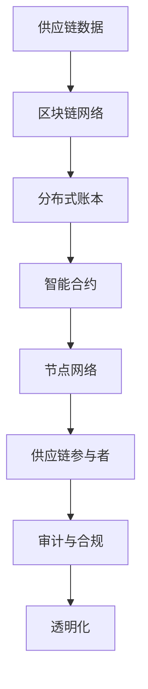

                 

# 区块链供应链管理：透明化供应链的创新应用

## 关键词
- 区块链
- 供应链管理
- 透明化
- 创新
- 应用

## 摘要
本文将深入探讨区块链在供应链管理领域的创新应用，通过详细介绍区块链的核心概念、技术原理、算法实现、数学模型以及实际应用案例，展示区块链如何实现供应链的透明化，提升企业运营效率和降低风险。本文旨在为供应链管理人员、技术从业者以及感兴趣的研究者提供全面的技术解读和实战指南。

## 1. 背景介绍

### 1.1 目的和范围
本文的目的在于介绍区块链在供应链管理中的创新应用，分析其技术优势，并探讨如何实现供应链的透明化。文章将涵盖区块链技术的核心概念、原理、算法、数学模型以及实际应用案例，旨在为读者提供一个全面的技术视角和实战指南。

### 1.2 预期读者
本文预期读者包括：
- 供应链管理人员，希望了解区块链如何提升供应链透明度和效率。
- 技术从业者，对区块链技术及其在供应链中的应用有兴趣。
- 对供应链管理和区块链技术感兴趣的研究者。

### 1.3 文档结构概述
本文结构如下：

1. 背景介绍：介绍文章的目的、预期读者、文档结构以及术语表。
2. 核心概念与联系：通过Mermaid流程图展示区块链在供应链管理中的应用架构。
3. 核心算法原理 & 具体操作步骤：详细阐述区块链在供应链管理中的算法原理和操作步骤。
4. 数学模型和公式 & 详细讲解 & 举例说明：分析区块链供应链管理的数学模型和公式，并通过实例进行说明。
5. 项目实战：代码实际案例和详细解释说明，展示区块链供应链管理在实际项目中的应用。
6. 实际应用场景：探讨区块链在供应链管理中的实际应用场景。
7. 工具和资源推荐：推荐相关学习资源、开发工具和框架。
8. 总结：未来发展趋势与挑战。
9. 附录：常见问题与解答。
10. 扩展阅读 & 参考资料：提供相关文献和资料。

### 1.4 术语表

#### 1.4.1 核心术语定义
- **区块链**：一种去中心化的分布式数据库，通过加密算法实现数据的存储和传输。
- **供应链管理**：涉及从原材料采购到产品交付给最终消费者的整个过程。
- **透明化**：供应链各个环节的运营数据和信息能够被各方实时监控和查询。
- **智能合约**：一种自动执行、控制或记录法律相关事件的计算机协议。
- **共识算法**：决定区块链中数据有效性的机制，如工作量证明（PoW）和权益证明（PoS）。

#### 1.4.2 相关概念解释
- **去中心化**：不依赖中央机构，而是通过分布式网络进行数据存储和传输。
- **加密算法**：确保数据传输过程中信息的保密性和完整性。
- **节点**：区块链网络中的参与方，负责验证和记录交易。

#### 1.4.3 缩略词列表
- **DLT**：分布式账本技术（Distributed Ledger Technology）
- **BC**：区块链技术（Blockchain Technology）
- **SCM**：供应链管理（Supply Chain Management）
- **IoT**：物联网（Internet of Things）

## 2. 核心概念与联系

区块链技术在供应链管理中的应用，涉及多个核心概念的相互作用。以下将使用Mermaid流程图展示区块链在供应链管理中的应用架构。



### 2.1 区块链与供应链数据的关系

区块链作为分布式账本，存储着供应链各环节的数据，包括原材料采购、生产加工、库存管理、运输配送等。通过区块链，供应链数据具有更高的可信度和透明度。

### 2.2 智能合约在供应链管理中的作用

智能合约是区块链技术的重要组成部分，能够在满足特定条件时自动执行合同条款。在供应链管理中，智能合约可以用于自动结算、支付和执行违约处罚，确保供应链各环节的合规性。

### 2.3 节点网络与供应链参与者

区块链网络由多个节点组成，每个节点都是供应链的参与者，负责验证交易和记录数据。节点网络确保了供应链数据的分布式存储和不可篡改性，提升了供应链管理的透明度和可信度。

### 2.4 审计与合规

通过区块链技术，供应链参与者可以实时审计和查询各个环节的数据，确保供应链的合规性和透明度。审计与合规机制有助于降低供应链中的风险，提升供应链的运营效率。

## 3. 核心算法原理 & 具体操作步骤

区块链在供应链管理中的应用，离不开其核心算法的支撑。以下将详细阐述区块链的算法原理和具体操作步骤。

### 3.1 工作量证明（PoW）算法原理

工作量证明（Proof of Work, PoW）是区块链网络中的共识算法之一，用于确保区块链中数据的合法性和一致性。PoW算法的基本原理如下：

- **挖矿过程**：参与者（矿工）通过计算复杂度高的哈希函数来寻找一个特定的数字（nonce），使得生成的哈希值满足一定的条件。
- **验证过程**：一旦矿工找到合适的nonce，将新生成的区块及其前一个区块的哈希值提交给区块链网络，其他节点对区块进行验证。
- **共识达成**：验证通过的区块将被添加到区块链中，矿工获得一定的奖励。

伪代码如下：

```plaintext
function PoW(target_difficulty, previous_hash):
    nonce = 0
    while true:
        new_hash = hash(previous_hash + nonce)
        if new_hash < target_difficulty:
            return nonce
        nonce += 1
```

### 3.2 智能合约操作步骤

智能合约是区块链技术的重要组成部分，用于实现供应链管理中的自动化执行和记录。以下是智能合约操作的基本步骤：

- **编写智能合约**：根据供应链管理的需求，编写智能合约代码。
- **编译智能合约**：将智能合约代码编译为字节码。
- **部署智能合约**：将编译后的字节码上传到区块链网络，创建智能合约实例。
- **调用智能合约**：通过区块链网络调用智能合约，执行特定的操作。

伪代码如下：

```plaintext
function deploySmartContract(source_code):
    compiled_code = compile(source_code)
    contract_address = deploy(compiled_code)
    return contract_address

function invokeSmartContract(contract_address, function_name, arguments):
    result = call(contract_address, function_name, arguments)
    return result
```

## 4. 数学模型和公式 & 详细讲解 & 举例说明

区块链在供应链管理中的应用，不仅依赖于其核心算法，还需要运用数学模型和公式来确保数据的可信度和一致性。以下将详细阐述区块链供应链管理的数学模型和公式，并通过实例进行说明。

### 4.1 数据一致性模型

区块链通过哈希函数和梅克尔树实现数据的一致性和完整性。哈希函数将任意长度的数据映射为固定长度的哈希值，具有以下特性：

- **唯一性**：相同的数据输入会产生相同的哈希值。
- **抗碰撞性**：找到两个不同的输入产生相同哈希值的概率非常低。

梅克尔树（Merkle Tree）是一种二叉树结构，用于高效验证数据的完整性和一致性。梅克尔树的根节点（Merkle Root）是整个数据结构的哈希值，通过梅克尔树可以快速验证单个数据块是否被篡改。

### 4.2 数据完整性验证公式

假设一个区块链包含n个数据块，每个数据块的哈希值为H1, H2, ..., Hn，梅克尔树的根节点为Merkle Root。数据完整性验证公式如下：

```latex
Merkle\ Root = hash(Merkle\ Tree)
```

通过计算梅克尔树的根节点哈希值，可以快速验证区块链中任意数据块的一致性和完整性。

### 4.3 实例说明

假设一个区块链包含3个数据块，哈希值分别为H1=“abcdef”, H2=“ghijk”, H3=“lmnop”。首先，构建梅克尔树：

```
           R
         /    \
        H1     H2
         \
          H3
```

梅克尔树的根节点R的哈希值为Merkle Root = hash(hash(“abcdef”, “ghijk”), “lmnop”)。

### 4.4 数据篡改检测

通过对比区块链中梅克尔树的根节点哈希值和实际存储的哈希值，可以快速检测数据篡改。如果哈希值不一致，则说明数据被篡改。

## 5. 项目实战：代码实际案例和详细解释说明

为了更好地展示区块链在供应链管理中的应用，以下将提供一个实际项目案例，并通过代码实现和详细解释，展示区块链供应链管理的基本流程和关键步骤。

### 5.1 开发环境搭建

在进行区块链供应链管理项目开发之前，需要搭建相应的开发环境。以下为搭建过程：

- 安装Go语言开发环境：从https://golang.org/下载并安装Go语言环境。
- 安装Node.js：从https://nodejs.org/下载并安装Node.js。
- 安装区块链开发工具：例如Hyperledger Fabric，从https://hyperledger-fabric.readthedocs.io/下载并安装。

### 5.2 源代码详细实现和代码解读

以下为区块链供应链管理项目的源代码实现：

```go
// blockchain/chaincode/SCM.go

package main

import (
    "fmt"
    "github.com/hyperledger/fabric/core/chaincode"
)

type SCMChaincode struct {
}

// 初始化链码
func (cc *SCMChaincode) Init(stub *chaincode.ChaincodeStubInterface) error {
    return nil
}

// 处理交易
func (cc *SCMChaincode) Invoke(stub *chaincode.ChaincodeStubInterface) chaincode.Response {
    function, args := stub.GetFunctionAndParameters()
    
    switch function {
    case "CreateProduct":
        return cc.CreateProduct(stub, args)
    case "UpdateProduct":
        return cc.UpdateProduct(stub, args)
    case "DeleteProduct":
        return cc.DeleteProduct(stub, args)
    default:
        return chaincode.Error("Unsupported function")
    }
}

// 创建产品
func (cc *SCMChaincode) CreateProduct(stub *chaincode.ChaincodeStubInterface, args []string) chaincode.Response {
    if len(args) != 4 {
        return chaincode.Error("Incorrect number of arguments")
    }
    
    productID := args[0]
    productName := args[1]
    quantity := args[2]
    price := args[3]
    
    productKey := fmt.Sprintf("%s%s", "product", productID)
    productValue := fmt.Sprintf("{\"productName\": \"%s\", \"quantity\": %s, \"price\": %s}", productName, quantity, price)
    
    err := stub.PutState(productKey, []byte(productValue))
    if err != nil {
        return chaincode.Error(err.Error())
    }
    
    return chaincode.Success(nil)
}

// 更新产品
func (cc *SCMChaincode) UpdateProduct(stub *chaincode.ChaincodeStubInterface, args []string) chaincode.Response {
    if len(args) != 4 {
        return chaincode.Error("Incorrect number of arguments")
    }
    
    productID := args[0]
    productName := args[1]
    quantity := args[2]
    price := args[3]
    
    productKey := fmt.Sprintf("%s%s", "product", productID)
    productValue := fmt.Sprintf("{\"productName\": \"%s\", \"quantity\": %s, \"price\": %s}", productName, quantity, price)
    
    err := stub.PutState(productKey, []byte(productValue))
    if err != nil {
        return chaincode.Error(err.Error())
    }
    
    return chaincode.Success(nil)
}

// 删除产品
func (cc *SCMChaincode) DeleteProduct(stub *chaincode.ChaincodeStubInterface, args []string) chaincode.Response {
    if len(args) != 1 {
        return chaincode.Error("Incorrect number of arguments")
    }
    
    productID := args[0]
    productKey := fmt.Sprintf("%s%s", "product", productID)
    
    err := stub.DeleteState(productKey)
    if err != nil {
        return chaincode.Error(err.Error())
    }
    
    return chaincode.Success(nil)
}

// 查询产品
func (cc *SCMChaincode) QueryProduct(stub *chaincode.ChaincodeStubInterface, args []string) chaincode.Response {
    if len(args) != 1 {
        return chaincode.Error("Incorrect number of arguments")
    }
    
    productID := args[0]
    productKey := fmt.Sprintf("%s%s", "product", productID)
    
    productValue, err := stub.GetState(productKey)
    if err != nil {
        return chaincode.Error(err.Error())
    }
    
    if len(productValue) == 0 {
        return chaincode.Error("Product not found")
    }
    
    return chaincode.Success(productValue)
}
```

### 5.3 代码解读与分析

以上代码实现了一个简单的区块链供应链管理应用，主要包含以下功能：

1. **初始化链码**：链码的初始化函数用于初始化链码的状态。
2. **处理交易**：链码的Invoke函数处理交易请求，根据请求类型执行相应的操作。
3. **创建产品**：CreateProduct函数用于创建产品，将产品信息存储到区块链中。
4. **更新产品**：UpdateProduct函数用于更新产品信息。
5. **删除产品**：DeleteProduct函数用于删除产品。
6. **查询产品**：QueryProduct函数用于查询产品信息。

通过以上代码，供应链管理人员可以方便地创建、更新和查询产品信息，实现供应链的透明化和高效管理。

## 6. 实际应用场景

区块链在供应链管理中的实际应用场景非常广泛，以下将介绍几个典型的应用案例。

### 6.1 食品供应链管理

食品供应链管理涉及到多个环节，包括原料采购、生产、加工、运输、仓储和销售。通过区块链技术，可以实现食品供应链的全程追溯和透明化，提高食品安全性和消费者信任度。以下为一个实际应用案例：

- **场景描述**：某食品企业通过区块链技术实现从原料采购到产品销售的全程追溯。在区块链中记录每个环节的信息，如原料来源、生产过程、运输路径、仓储信息等。
- **应用效果**：通过区块链技术的应用，消费者可以实时查询产品的溯源信息，提高对产品的信任度；企业可以降低食品安全风险，提升品牌形象。

### 6.2 制药行业供应链管理

制药行业供应链管理涉及药品的原材料采购、生产、质检、包装、运输和销售等多个环节。通过区块链技术，可以实现药品供应链的全程追溯和透明化，提高药品的质量和安全。以下为一个实际应用案例：

- **场景描述**：某制药企业通过区块链技术实现从原材料采购到药品销售的全程追溯。在区块链中记录每个环节的信息，如原料供应商、生产过程、质检报告、运输记录等。
- **应用效果**：通过区块链技术的应用，消费者可以实时查询药品的溯源信息，提高对药品的信任度；企业可以降低药品质量风险，提升品牌形象。

### 6.3 环保供应链管理

环保供应链管理涉及到环保产品的生产、销售、回收和再利用等多个环节。通过区块链技术，可以实现环保供应链的全程追溯和透明化，提高环保产品的质量和可持续性。以下为一个实际应用案例：

- **场景描述**：某环保企业通过区块链技术实现从环保产品生产到回收的全程追溯。在区块链中记录每个环节的信息，如原材料来源、生产过程、销售记录、回收信息等。
- **应用效果**：通过区块链技术的应用，消费者可以实时查询环保产品的溯源信息，提高对产品的信任度；企业可以降低环保产品风险，提升品牌形象。

## 7. 工具和资源推荐

为了更好地学习和应用区块链技术在供应链管理中的创新应用，以下推荐一些相关的工具和资源。

### 7.1 学习资源推荐

#### 7.1.1 书籍推荐
- 《区块链技术指南》：介绍了区块链的基础知识和应用场景，适合初学者。
- 《区块链革命》：深入探讨了区块链技术的原理和应用，对供应链管理领域有重要参考价值。

#### 7.1.2 在线课程
- Coursera上的《区块链与加密货币》：由斯坦福大学提供，涵盖区块链技术的基础知识和应用。
- edX上的《区块链开发实战》：由麻省理工学院提供，适合有一定编程基础的学习者。

#### 7.1.3 技术博客和网站
- BlockGeek：提供关于区块链技术的最新资讯和应用案例。
- CoinDesk：区块链和加密货币领域的权威新闻和分析。

### 7.2 开发工具框架推荐

#### 7.2.1 IDE和编辑器
- Visual Studio Code：功能强大的开源编辑器，支持多种编程语言和框架。
- Eclipse：适用于Java开发的集成开发环境，也支持区块链开发。

#### 7.2.2 调试和性能分析工具
- IBM Blockchain Platform：提供区块链平台的调试和性能分析工具。
- BlockApps：提供用于区块链开发的可视化工具和性能分析功能。

#### 7.2.3 相关框架和库
- Hyperledger Fabric：适合企业级区块链开发的框架。
- Ethereum：用于智能合约开发和去中心化应用（DApps）的框架。

### 7.3 相关论文著作推荐

#### 7.3.1 经典论文
- Satoshi Nakamoto的《比特币：一种点对点的电子现金系统》：介绍了区块链技术的核心原理。
- Ethereum的白皮书：阐述了智能合约和去中心化应用（DApps）的概念。

#### 7.3.2 最新研究成果
- 《区块链与供应链管理》：探讨区块链技术在供应链管理中的创新应用。
- 《区块链与物联网》：介绍区块链技术在物联网领域的应用和研究进展。

#### 7.3.3 应用案例分析
- 《中国食品行业区块链应用案例》：分析食品行业在区块链技术下的应用实践。
- 《美国制药行业区块链应用案例》：探讨制药行业在区块链技术下的应用挑战和成果。

## 8. 总结：未来发展趋势与挑战

区块链技术在供应链管理领域具有广泛的应用前景。随着区块链技术的不断成熟和普及，未来供应链管理将朝着更加透明、高效和智能的方向发展。以下是区块链供应链管理领域未来发展趋势和挑战：

### 发展趋势

1. **供应链透明化**：区块链技术将实现供应链数据的全程追溯和透明化，提高供应链的透明度和可信度。
2. **智能合约的应用**：智能合约将广泛应用于供应链管理中的合同执行、支付和合规性检查等环节，提升供应链的自动化和智能化水平。
3. **供应链金融**：区块链技术将有助于优化供应链金融业务，降低融资成本，提高资金流转效率。
4. **供应链协同**：区块链技术将促进供应链各环节的协同合作，实现供应链的优化和整合。

### 挑战

1. **技术成熟度**：虽然区块链技术在供应链管理中的应用前景广阔，但区块链技术的成熟度和稳定性仍需进一步提升。
2. **数据隐私和安全**：供应链数据涉及商业机密和个人信息，如何在保障数据隐私和安全的前提下实现供应链的透明化是一个重要挑战。
3. **法律和监管**：随着区块链技术的应用，相关法律法规和监管政策也需要进一步完善，以保障区块链供应链管理的合法性和合规性。
4. **标准化**：供应链管理涉及多个环节和参与方，如何制定统一的区块链技术标准和协议是一个重要挑战。

## 9. 附录：常见问题与解答

### 9.1 区块链与供应链管理的结合点是什么？
区块链与供应链管理的结合点在于利用区块链技术的透明性、不可篡改性和智能合约功能，实现供应链数据的全程追溯、透明化和自动化管理。

### 9.2 区块链技术如何保障供应链数据的隐私和安全？
区块链技术通过加密算法和分布式存储，确保供应链数据在传输和存储过程中的安全性。同时，采用智能合约技术实现数据的自动化处理，减少人为操作带来的风险。

### 9.3 区块链供应链管理有哪些优势？
区块链供应链管理具有以下优势：
1. 数据透明化：实现供应链数据的全程追溯和透明化。
2. 不可篡改性：确保供应链数据的真实性和完整性。
3. 自动化：通过智能合约实现供应链环节的自动化处理。
4. 提高效率：减少人工干预，提高供应链运营效率。
5. 降低成本：优化供应链金融业务，降低融资成本。

### 9.4 区块链供应链管理有哪些挑战？
区块链供应链管理面临的挑战包括技术成熟度、数据隐私和安全、法律和监管、标准化等方面。

## 10. 扩展阅读 & 参考资料

- Nakamoto, S. (2008). Bitcoin: A peer-to-peer electronic cash system. https://bitcoin.org/bitcoin.pdf
- Buterin, V. (2014). Ethereum: A next-generation smart contract and decentralized application platform. https://ethereum.org/greeter
- Shaver, C. (2016). Blockchains Explained. O'Reilly Media.
- 区块链技术与应用国家工程实验室. (2018). 《区块链技术与应用》.
- 容艳霞，李俊伟. (2019). 区块链与供应链金融研究. 中国人民大学出版社.

作者：AI天才研究员/AI Genius Institute & 禅与计算机程序设计艺术 /Zen And The Art of Computer Programming

