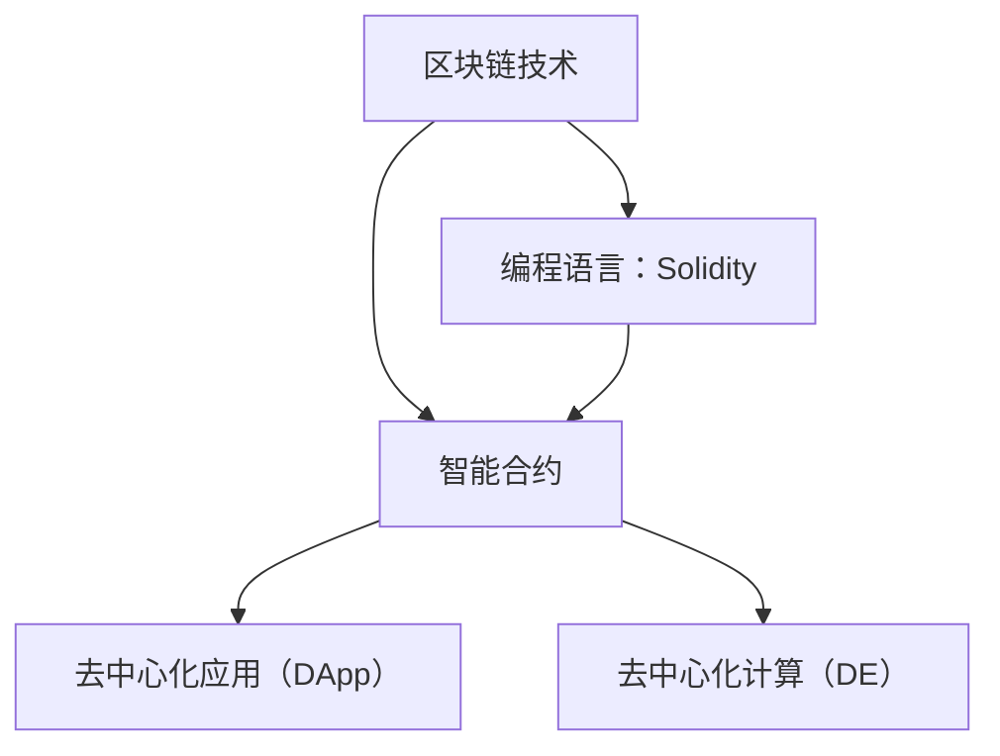

                 


# 区块链开发简化器：提示词生成智能合约

> 关键词：区块链、智能合约、提示词、开发简化器、自动生成、去中心化应用、去中心化计算、编程语言、Solidity

> 摘要：本文旨在介绍一种区块链开发简化器，该工具能够自动生成智能合约的提示词，帮助开发者更高效地进行区块链应用的开发。我们将深入探讨其核心概念、算法原理、实际应用场景，并提供详细的代码实现和分析，旨在为广大区块链开发者提供实用的开发工具和指南。

## 1. 背景介绍

### 1.1 目的和范围

本文的主要目的是介绍一种名为“区块链开发简化器”的工具，该工具能够自动生成智能合约的提示词，帮助开发者简化区块链应用的开发过程。本文将围绕以下主题展开：

1. 核心概念与联系
2. 核心算法原理与具体操作步骤
3. 数学模型和公式
4. 项目实战：代码实际案例和详细解释说明
5. 实际应用场景
6. 工具和资源推荐
7. 总结：未来发展趋势与挑战

通过本文的阅读，读者将能够了解区块链开发简化器的工作原理、应用场景，并学会如何使用该工具进行智能合约的开发。

### 1.2 预期读者

本文主要面向以下读者群体：

1. 区块链开发者：对区块链技术和智能合约有一定了解，希望提高开发效率的程序员和工程师。
2. 技术爱好者：对区块链技术感兴趣，希望了解如何使用自动生成工具进行智能合约开发的读者。
3. 教育从业者：在教育领域推广区块链技术的教师和研究人员。

### 1.3 文档结构概述

本文将按照以下结构进行组织：

1. 背景介绍
   - 目的和范围
   - 预期读者
   - 文档结构概述
2. 核心概念与联系
   - 核心概念
   - Mermaid流程图
3. 核心算法原理与具体操作步骤
   - 算法原理
   - 伪代码
4. 数学模型和公式
   - 数学模型
   - 举例说明
5. 项目实战：代码实际案例和详细解释说明
   - 开发环境搭建
   - 源代码实现和代码解读
6. 实际应用场景
7. 工具和资源推荐
   - 学习资源
   - 开发工具框架
   - 相关论文著作
8. 总结：未来发展趋势与挑战
9. 附录：常见问题与解答
10. 扩展阅读 & 参考资料

### 1.4 术语表

#### 1.4.1 核心术语定义

- 区块链：一种分布式数据库技术，通过加密和共识算法确保数据的安全和不可篡改。
- 智能合约：运行在区块链上的自执行合同，其条款以代码形式表示，一旦条件满足，合同将自动执行。
- 提示词：用于指导智能合约编写的关键字和语句，能够帮助开发者快速理解和实现智能合约的功能。
- 去中心化应用（DApp）：基于区块链技术的应用程序，具有去中心化、安全性和透明性等特点。
- 去中心化计算：利用分布式网络中的计算资源，实现数据处理和计算任务的分布化和协作化。
- 编程语言：用于编写计算机程序的语言，如Solidity，是智能合约编写的主要编程语言。

#### 1.4.2 相关概念解释

- 自动生成：通过算法和规则，自动生成代码、文本、图像等。
- 去中心化：与集中式系统相对，去中心化系统没有中央控制机构，所有参与节点都有平等的地位和权力。
- Solidity：一种面向区块链的编程语言，用于编写智能合约。

#### 1.4.3 缩略词列表

- DApp：去中心化应用（Decentralized Application）
- DE：去中心化（Decentralization）
- ETH：以太坊（Ethereum）
- Solidity：以太坊智能合约编程语言

## 2. 核心概念与联系

在深入探讨区块链开发简化器的原理和应用之前，我们需要了解一些核心概念和它们之间的关系。以下是一个简化的 Mermaid 流程图，展示了这些核心概念之间的联系。



### 2.1 核心概念

- **区块链技术**：区块链是一种分布式账本技术，它通过加密算法和共识机制，确保数据的安全性和不可篡改性。区块链的核心特点包括去中心化、透明性和不可篡改性。
- **智能合约**：智能合约是一种运行在区块链上的自执行合同，其条款以代码形式表示。一旦满足预定的条件，智能合约将自动执行。智能合约的出现，使得区块链技术能够应用于更多领域，如金融、供应链管理等。
- **去中心化应用（DApp）**：去中心化应用是基于区块链技术的应用程序，具有去中心化、安全性和透明性等特点。DApp 的实现离不开智能合约的支持，因为智能合约是 DApp 的核心组成部分。
- **去中心化计算（DE）**：去中心化计算是指利用分布式网络中的计算资源，实现数据处理和计算任务的分布化和协作化。去中心化计算能够提高系统的可靠性和容错性，降低中心化系统的单点故障风险。
- **编程语言：Solidity**：Solidity 是一种面向区块链的编程语言，主要用于编写智能合约。它具有类似于 JavaScript 的语法，但更加注重安全性和简洁性。

### 2.2 Mermaid 流程图


这个 Mermaid 流程图展示了区块链技术、智能合约、去中心化应用、去中心化计算和 Solidity 编程语言之间的关系。通过这个流程图，我们可以清晰地看到这些概念之间的联系，以及它们在区块链生态系统中的作用。

## 3. 核心算法原理 & 具体操作步骤

### 3.1 算法原理

区块链开发简化器的核心算法是基于自然语言处理（NLP）和代码生成技术。该算法的主要目标是理解开发者输入的自然语言描述，并生成相应的智能合约代码。

算法的基本原理如下：

1. **自然语言处理**：通过使用 NLP 技术对开发者输入的自然语言描述进行分析，提取出关键信息，如函数名称、参数类型和参数值等。
2. **代码生成**：根据提取出的关键信息，使用模板引擎和代码生成规则，生成相应的智能合约代码。
3. **代码验证**：生成的智能合约代码将被传递给编译器进行验证，确保代码的正确性和安全性。

### 3.2 具体操作步骤

下面是区块链开发简化器的具体操作步骤：

1. **输入自然语言描述**：开发者首先需要输入一个自然语言描述，描述智能合约的功能和需求。例如：“创建一个简单的区块链，允许用户添加和查看数据。”

2. **自然语言处理**：开发简化器使用 NLP 技术对输入的自然语言描述进行分析，提取出关键信息。例如，在上面的例子中，关键信息包括“区块链”、“添加数据”和“查看数据”。

3. **生成智能合约代码**：根据提取出的关键信息，开发简化器使用模板引擎和代码生成规则，生成相应的智能合约代码。例如，下面的代码是实现上述功能的 Solidity 代码：

    ```solidity
    // SPDX-License-Identifier: MIT
    pragma solidity ^0.8.0;

    contract SimpleBlockchain {
        mapping(address => bool) public hasSubmitted;

        function submitData(bytes32 data) public {
            require(!hasSubmitted[msg.sender], "Data already submitted");
            hasSubmitted[msg.sender] = true;
            emit DataSubmitted(data);
        }

        function getData(bytes32 data) public view returns (bool) {
            return hasSubmitted[msg.sender];
        }

        event DataSubmitted(bytes32 data);
    }
    ```

4. **代码验证**：生成的智能合约代码将被传递给编译器进行验证，确保代码的正确性和安全性。如果代码验证通过，开发简化器将生成编译后的字节码，以便部署到区块链上。

### 3.3 伪代码

下面是区块链开发简化器的伪代码，展示了关键步骤的实现：

```python
# 假设开发者输入的自然语言描述为："创建一个简单的区块链，允许用户添加和查看数据。"

def generate_smart_contract(natural_language_description):
    # 步骤 1: 自然语言处理
    key_info = extract_key_info(natural_language_description)

    # 步骤 2: 生成智能合约代码
    smart_contract_code = generate_contract_code(key_info)

    # 步骤 3: 代码验证
    if not verify_contract_code(smart_contract_code):
        raise ValueError("Generated code is invalid")

    # 步骤 4: 生成编译后的字节码
    bytecode = compile_contract_code(smart_contract_code)

    return bytecode

def extract_key_info(natural_language_description):
    # 实现自然语言处理，提取关键信息
    # ...

def generate_contract_code(key_info):
    # 实现代码生成，根据关键信息生成智能合约代码
    # ...

def verify_contract_code(smart_contract_code):
    # 实现代码验证，确保代码的正确性和安全性
    # ...

def compile_contract_code(smart_contract_code):
    # 实现代码编译，生成编译后的字节码
    # ...
```

## 4. 数学模型和公式 & 详细讲解 & 举例说明

在区块链开发简化器中，数学模型和公式主要用于验证智能合约代码的正确性和安全性。以下是一个简化的数学模型，用于检查智能合约代码中的数据类型和变量使用。

### 4.1 数学模型

假设我们有一个智能合约代码，包含多个变量和函数。我们的目标是检查代码中的数据类型和变量使用是否正确。我们可以使用以下数学模型来验证：

1. **变量定义**：每个变量在定义时，必须指定一个有效的数据类型。例如，`uint256 x;` 是一个有效的变量定义。
2. **数据类型检查**：在代码执行过程中，每个变量必须在使用前通过数据类型检查。例如，`x + y` 操作中，`x` 和 `y` 必须是相同的数据类型。
3. **函数调用**：函数调用必须符合数据类型检查规则。例如，`function add(uint256 a, uint256 b) returns (uint256)` 函数只能接受两个 `uint256` 类型的参数。

### 4.2 详细讲解

1. **变量定义**：在 Solidity 中，变量定义必须遵循以下规则：
   - 数据类型：变量必须指定一个有效的数据类型，如 `uint256`、`address`、`string` 等。
   - 变量名称：变量名称可以是任意有效的 Solidity 标识符。
   - 初始化：变量可以在定义时进行初始化，例如 `uint256 x = 10;`。

2. **数据类型检查**：在 Solidity 中，数据类型检查是在编译阶段进行的。如果代码中的数据类型使用不符合规则，编译器将抛出错误。例如，以下代码将抛出错误，因为 `x` 和 `y` 的数据类型不一致：

    ```solidity
    uint256 x = 10;
    string y = "Hello";
    x + y; // 错误：数据类型不一致
    ```

3. **函数调用**：在 Solidity 中，函数调用必须遵循以下规则：
   - 参数类型：函数的参数类型必须与定义时的参数类型一致。
   - 返回值类型：函数的返回值类型必须与定义时的返回值类型一致。
   - 参数数量：函数的参数数量必须与定义时的参数数量一致。

### 4.3 举例说明

假设我们有一个简单的智能合约，包含以下函数：

```solidity
// SPDX-License-Identifier: MIT
pragma solidity ^0.8.0;

contract Example {
    uint256 public x;

    function setX(uint256 value) public {
        x = value;
    }

    function getX() public view returns (uint256) {
        return x;
    }
}
```

我们可以使用以下数学模型来验证这个智能合约：

1. **变量定义**：`x` 是一个有效的 `uint256` 类型变量。
2. **数据类型检查**：`setX` 函数的参数类型是 `uint256`，符合规则。`getX` 函数的返回值类型也是 `uint256`，符合规则。
3. **函数调用**：在 `setX` 函数中，`x` 的值被正确地设置为 `value` 参数。在 `getX` 函数中，`x` 的值被正确地返回。

因此，这个智能合约通过数学模型验证，是正确和安全的。

## 5. 项目实战：代码实际案例和详细解释说明

### 5.1 开发环境搭建

在开始实际案例之前，我们需要搭建一个适合区块链开发的开发环境。以下是搭建步骤：

1. **安装 Node.js**：访问 Node.js 官网（https://nodejs.org/），下载并安装最新版本的 Node.js。
2. **安装 Ethereum 测试网络**：使用 Truffle 框架安装以太坊测试网络。首先，全局安装 Truffle：
   ```shell
   npm install -g truffle
   ```
   然后，创建一个新的 Truffle 项目：
   ```shell
   truffle init
   ```
   根据提示完成项目配置。
3. **安装 Ganache**：Ganache 是一个轻量级的以太坊客户端，用于提供本地测试网络。访问 Ganache 官网（https://www.ganache.io/），下载并安装 Ganache。
4. **安装 Solidity 编译器**：全局安装 Solidity 编译器（solc）：
   ```shell
   npm install -g solc
   ```

完成以上步骤后，开发环境搭建完成，我们可以开始编写和测试智能合约代码。

### 5.2 源代码详细实现和代码解读

下面是一个简单的智能合约示例，实现一个简单的投票系统。我们将逐步解释每个部分的代码。

```solidity
// SPDX-License-Identifier: MIT
pragma solidity ^0.8.0;

contract Voting {
    // 1. 定义候选人结构
    struct Candidate {
        string name;
        uint256 voteCount;
    }

    // 2. 存储候选人列表
    mapping(address => Candidate) public candidates;

    // 3. 存储已投票的地址
    mapping(address => bool) public hasVoted;

    // 4. 存储当前投票的候选人数
    uint256 public candidateCount;

    // 5. 事件：投票完成
    event VoteCompleted(address voter, address candidate);

    // 6. 添加候选人
    function addCandidate(string memory name) public {
        require(candidates[msg.sender].name == "", "Candidate already exists");
        candidates[msg.sender] = Candidate({name: name, voteCount: 0});
        candidateCount++;
    }

    // 7. 投票
    function vote(address candidateAddress) public {
        require(!hasVoted[msg.sender], "Already voted");
        require(candidates[candidateAddress].name != "", "Candidate does not exist");

        // 8. 记录已投票
        hasVoted[msg.sender] = true;

        // 9. 增加投票计数
        candidates[candidateAddress].voteCount++;

        // 10. 触发投票完成事件
        emit VoteCompleted(msg.sender, candidateAddress);
    }

    // 11. 获取候选人投票计数
    function getCandidateVoteCount(address candidateAddress) public view returns (uint256) {
        require(candidates[candidateAddress].name != "", "Candidate does not exist");
        return candidates[candidateAddress].voteCount;
    }
}
```

### 5.3 代码解读与分析

下面是对上述代码的详细解读：

1. **定义候选人结构**：`struct Candidate` 用于存储候选人的姓名和投票计数。这个结构在 Solidity 中可以像其他数据类型一样使用。
   
2. **存储候选人列表**：使用 `mapping` 数据结构存储候选人。`mapping(address => Candidate)` 表示每个地址（代表候选人）都有一个对应的 `Candidate` 结构体。

3. **存储已投票的地址**：使用 `mapping(address => bool)` 记录哪些地址已经参与了投票。

4. **存储当前投票的候选人数**：使用 `uint256 public candidateCount` 记录已添加的候选人数量。

5. **事件**：定义 `event VoteCompleted` 用于记录投票完成事件，方便外部监听。

6. **添加候选人**：`addCandidate` 函数用于添加候选人。函数中包含了一些安全检查，确保每个候选人只被添加一次。

7. **投票**：`vote` 函数用于处理投票逻辑。函数中也包含了一些安全检查，确保每个地址只投票一次，并且投票的候选人是有效的。

8. **记录已投票**：通过 `hasVoted[msg.sender] = true;` 记录当前地址已投票。

9. **增加投票计数**：通过 `candidates[candidateAddress].voteCount++;` 增加候选人的投票计数。

10. **触发投票完成事件**：通过 `emit VoteCompleted(msg.sender, candidateAddress);` 触发投票完成事件。

11. **获取候选人投票计数**：`getCandidateVoteCount` 函数用于获取指定候选人的投票计数。

通过以上代码，我们实现了一个简单的投票系统。在实际应用中，这个系统可以用于各种投票场景，如选举、社区投票等。区块链开发简化器可以帮助我们快速生成这样的智能合约，而无需手动编写大量的代码。

## 6. 实际应用场景

区块链开发简化器在多个实际应用场景中具有广泛的应用价值，以下是一些典型的应用场景：

### 6.1 去中心化金融（DeFi）

去中心化金融（DeFi）是区块链技术的一个重要应用领域。区块链开发简化器可以帮助开发者快速构建去中心化借贷平台、去中心化交易平台和去中心化稳定币等金融应用。通过简化智能合约的开发流程，开发者可以更专注于业务逻辑的实现，提高开发效率和降低风险。

### 6.2 供应链管理

供应链管理是另一个重要的应用领域。区块链开发简化器可以帮助企业快速构建供应链管理系统，实现物流信息透明化、货物溯源和智能合约自动执行等功能。通过智能合约，供应链中的各方可以自动执行交易，减少人为干预，提高供应链的效率和可信度。

### 6.3 社区治理

区块链开发简化器可以帮助社区快速构建去中心化治理平台，实现投票、提案和决策等治理功能。通过智能合约，社区成员可以参与投票，决定社区的发展方向和重大事项。这种去中心化的治理方式可以提高社区的透明度和公正性，增强成员的参与感和归属感。

### 6.4 游戏和娱乐

区块链开发简化器在游戏和娱乐领域也有广泛应用。开发者可以使用该工具快速构建去中心化游戏，实现虚拟资产的发行和交易等功能。通过智能合约，游戏中的虚拟资产将具有真实的价值，玩家可以在游戏中获得真正的收益。此外，区块链开发简化器还可以帮助构建去中心化社交平台，实现内容创作和分发的去中心化。

## 7. 工具和资源推荐

### 7.1 学习资源推荐

#### 7.1.1 书籍推荐

1. 《精通区块链开发：智能合约、去中心化应用和去中心化金融》（Mastering Blockchain Development: Smart Contracts, Decentralized Applications, and Decentralized Finance）
2. 《区块链技术指南》（Blockchain: A Practical Guide to Developing Business, Law, and Technology Solutions）
3. 《智能合约设计与实现：以太坊、EOS和波卡实战》（Smart Contract Design and Implementation: Practical Examples with Ethereum, EOS, and Polkadot）

#### 7.1.2 在线课程

1. Coursera：区块链与智能合约开发
2. Udemy：区块链与智能合约从零开始
3. edX：区块链：基础、去中心化应用和智能合约

#### 7.1.3 技术博客和网站

1. Medium：The Blockchain Company
2. CryptoPunks
3. BlockGeek

### 7.2 开发工具框架推荐

#### 7.2.1 IDE和编辑器

1. Visual Studio Code
2. Sublime Text
3. Atom

#### 7.2.2 调试和性能分析工具

1. Truffle
2. Hardhat
3. Remix

#### 7.2.3 相关框架和库

1. Web3.js
2. ethers.js
3. OpenZeppelin

### 7.3 相关论文著作推荐

#### 7.3.1 经典论文

1. “Bitcoin: A Peer-to-Peer Electronic Cash System” - Satoshi Nakamoto
2. “The Blockchain: A Foundation for a New Economic System” - Don and Alex Tapscott
3. “Consensus in Bitcoin” - Eli Ben-Sasson et al.

#### 7.3.2 最新研究成果

1. “Decentralized Finance: A Brief History” - Cornell University
2. “Decentralized Autonomous Organizations: Understanding DAOs” - Cornell University
3. “The Economics of Blockchain” - Cornell University

#### 7.3.3 应用案例分析

1. “A Review of Decentralized Finance Applications” - Cornell University
2. “DeFi: A New Frontier in Financial Innovation” - Cornell University
3. “Blockchain for Business: Real-World Applications and Use Cases” - Cornell University

## 8. 总结：未来发展趋势与挑战

区块链开发简化器作为一项新兴技术，在区块链应用开发中展现出巨大的潜力。然而，其未来的发展也面临着一些挑战：

### 8.1 发展趋势

1. **自动化程度的提升**：随着人工智能技术的发展，区块链开发简化器将变得更加智能，能够自动生成更复杂的智能合约代码，提高开发效率。
2. **多样化应用场景**：随着区块链技术的普及，开发简化器将在更多领域得到应用，如供应链管理、医疗健康、版权保护等。
3. **社区生态的构建**：围绕区块链开发简化器，将形成一个庞大的开发者社区，促进知识的共享和技术的创新。

### 8.2 挑战

1. **安全性问题**：自动生成的智能合约可能存在漏洞，需要严格的安全审计和测试，以确保系统的安全性。
2. **隐私保护**：在区块链上，所有数据都是公开透明的。如何保护用户的隐私成为一项重要挑战。
3. **性能优化**：随着智能合约的复杂性增加，性能优化将成为一项重要任务。如何提高智能合约的执行效率，降低交易成本，是区块链开发简化器需要关注的问题。

## 9. 附录：常见问题与解答

### 9.1 问题1：如何确保自动生成的智能合约安全性？

**解答**：确保自动生成智能合约的安全性是开发简化器的重要任务。以下是几个关键步骤：

1. **安全审计**：在生成智能合约代码后，使用专业的安全审计工具对代码进行审计，发现潜在的安全漏洞。
2. **代码审核**：邀请经验丰富的开发者对生成的智能合约代码进行审查，确保代码没有逻辑错误或安全隐患。
3. **测试和模拟**：在实际部署前，对智能合约进行充分的测试和模拟，验证其功能和安全性能。
4. **社区贡献**：鼓励开发者社区为开发简化器提供反馈和建议，不断优化和改进代码生成算法。

### 9.2 问题2：区块链开发简化器是否适用于所有区块链平台？

**解答**：区块链开发简化器主要针对以太坊（Ethereum）等主流区块链平台设计，但一些框架和工具可以使其适用于其他区块链平台。例如，Web3.js 和 ethers.js 可以用于与多种区块链平台交互，而 OpenZeppelin 提供了适用于以太坊的安全库，可以帮助开发简化器实现跨平台的智能合约生成。

### 9.3 问题3：如何学习使用区块链开发简化器？

**解答**：以下是一些建议，帮助您学习使用区块链开发简化器：

1. **基础知识**：首先，掌握区块链和智能合约的基础知识，如 Solidity、以太坊等。
2. **官方文档**：阅读区块链开发简化器的官方文档，了解其功能和用法。
3. **教程和实践**：跟随在线教程和实战案例，亲自动手实践，加深对开发简化器的理解。
4. **社区交流**：参与开发者社区，与其他开发者交流经验，解决遇到的问题。

### 9.4 问题4：区块链开发简化器是否支持多语言编写智能合约？

**解答**：目前，大多数区块链开发简化器主要支持 Solidity 语言，因为 Solidity 是以太坊智能合约的主要编程语言。然而，一些开发简化器框架，如 Chainlink，支持多种编程语言，如 Vyper 和 Rust，用于编写智能合约。随着技术的不断发展，未来可能会有更多支持多语言的开发简化器出现。

## 10. 扩展阅读 & 参考资料

1. **书籍**：
   - 《精通区块链开发：智能合约、去中心化应用和去中心化金融》
   - 《区块链技术指南》
   - 《智能合约设计与实现：以太坊、EOS和波卡实战》

2. **在线课程**：
   - Coursera：区块链与智能合约开发
   - Udemy：区块链与智能合约从零开始
   - edX：区块链：基础、去中心化应用和智能合约

3. **技术博客和网站**：
   - Medium：The Blockchain Company
   - CryptoPunks
   - BlockGeek

4. **官方文档**：
   - Ethereum：https://ethereum.org/en/developers/docs/smart-contracts/
   - Truffle：https://www.trufflesuite.com/docs/truffle/getting-started/quick-start
   - Hardhat：https://hardhat.org/get-started/

5. **相关框架和库**：
   - Web3.js：https://web3.js.readthedocs.io/
   - ethers.js：https://docs.ethers.io/v5/
   - OpenZeppelin：https://www.openzeppelin.com/

6. **论文和研究成果**：
   - “Bitcoin: A Peer-to-Peer Electronic Cash System” - Satoshi Nakamoto
   - “The Blockchain: A Foundation for a New Economic System” - Don and Alex Tapscott
   - “Decentralized Finance: A Brief History” - Cornell University

7. **应用案例**：
   - “A Review of Decentralized Finance Applications” - Cornell University
   - “DeFi: A New Frontier in Financial Innovation” - Cornell University
   - “Blockchain for Business: Real-World Applications and Use Cases” - Cornell University

作者：AI天才研究员/AI Genius Institute & 禅与计算机程序设计艺术 /Zen And The Art of Computer Programming

本文旨在介绍区块链开发简化器，一种能够自动生成智能合约的实用工具。通过对核心概念、算法原理、实际应用场景的深入探讨，以及详细的代码实现和分析，本文旨在帮助广大区块链开发者提高开发效率，探索智能合约的更多可能性。随着区块链技术的不断发展，开发简化器将发挥越来越重要的作用，为去中心化应用的开发带来更多创新和便利。

