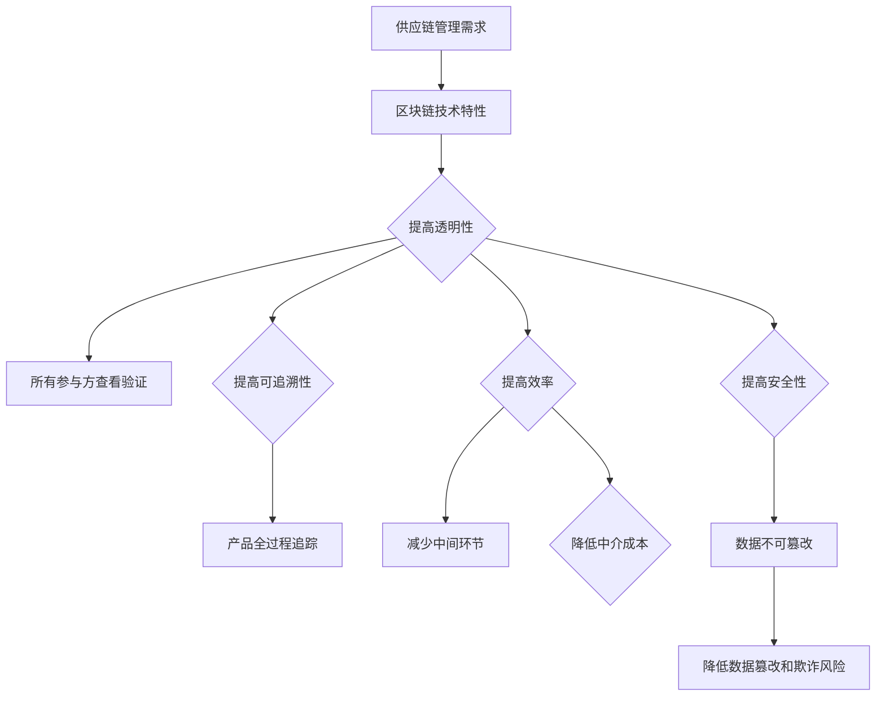
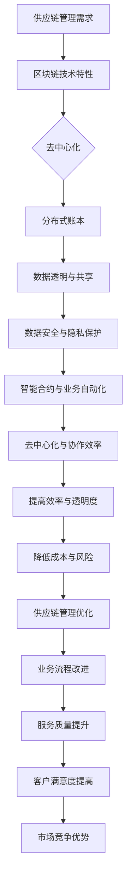

                 

# 区块链技术在供应链管理中的创新应用

> **关键词：** 区块链、供应链管理、分布式账本、智能合约、透明性、可追溯性、效率提升、安全性

> **摘要：** 本文章旨在探讨区块链技术在供应链管理中的创新应用。通过分析区块链技术的核心原理，我们将其与供应链管理的需求相结合，详细解析了区块链技术在供应链中的实际应用场景和具体操作步骤。文章还将介绍相关的数学模型、项目实战案例以及未来发展趋势与挑战，为供应链管理领域的技术创新提供新思路。

## 1. 背景介绍

### 1.1 目的和范围

本文主要目的是探讨区块链技术在供应链管理中的创新应用。随着全球供应链的日益复杂，传统的供应链管理面临着诸多挑战，如信息不对称、透明度不足、数据篡改风险等。区块链技术作为一种分布式账本技术，具有去中心化、不可篡改、透明性高、安全性强等特性，为供应链管理带来了新的可能性。

本文将首先介绍区块链技术的基本概念和核心原理，然后分析供应链管理中的需求，最后详细讨论区块链技术在供应链管理中的具体应用场景、操作步骤和未来发展趋势。

### 1.2 预期读者

本文面向供应链管理领域的从业者、研究者和对区块链技术感兴趣的读者。通过本文的阅读，读者可以了解区块链技术在供应链管理中的创新应用，掌握相关技术原理和实践方法，为实际业务中的技术应用提供参考。

### 1.3 文档结构概述

本文结构如下：

1. 背景介绍
   - 1.1 目的和范围
   - 1.2 预期读者
   - 1.3 文档结构概述
   - 1.4 术语表

2. 核心概念与联系
   - 2.1 区块链技术概述
   - 2.2 供应链管理需求分析
   - 2.3 区块链与供应链管理结合的原理

3. 核心算法原理 & 具体操作步骤
   - 3.1 区块链技术在供应链管理中的应用原理
   - 3.2 区块链技术在供应链管理中的操作步骤

4. 数学模型和公式 & 详细讲解 & 举例说明
   - 4.1 数学模型和公式概述
   - 4.2 数学模型详细讲解
   - 4.3 举例说明

5. 项目实战：代码实际案例和详细解释说明
   - 5.1 开发环境搭建
   - 5.2 源代码详细实现和代码解读
   - 5.3 代码解读与分析

6. 实际应用场景
   - 6.1 区块链技术在供应链管理中的应用实例
   - 6.2 区块链技术在供应链管理中的优势

7. 工具和资源推荐
   - 7.1 学习资源推荐
   - 7.2 开发工具框架推荐
   - 7.3 相关论文著作推荐

8. 总结：未来发展趋势与挑战

9. 附录：常见问题与解答

10. 扩展阅读 & 参考资料

### 1.4 术语表

#### 1.4.1 核心术语定义

- **区块链技术**：一种分布式账本技术，通过加密算法和时间戳等手段，确保数据的完整性和安全性。
- **供应链管理**：指从原材料采购到产品交付给最终用户的整个过程中，对物料、信息、资金等的全面管理和协调。
- **智能合约**：一种自动执行的合约，基于区块链技术实现，当满足特定的条件时自动执行。
- **去中心化**：指网络中没有中心化的控制节点，所有节点平等参与网络运作。
- **透明性**：指所有参与方都可以查看和验证区块链上的数据。
- **可追溯性**：指可以通过区块链技术追踪产品从生产到交付的全过程。

#### 1.4.2 相关概念解释

- **节点**：区块链网络中的一个参与者，负责存储和维护区块链数据。
- **挖矿**：指通过计算解决数学难题，验证区块链交易并创建新区块的过程。
- **分布式账本**：指区块链网络中所有节点共享的账本，确保数据的一致性和安全性。
- **共识机制**：指区块链网络中节点达成共识的算法，确保所有节点对区块链数据的一致性。

#### 1.4.3 缩略词列表

- **BTC**：比特币（Bitcoin）
- **ETH**：以太坊（Ethereum）
- **ICO**：首次代币发行（Initial Coin Offering）
- **SCM**：供应链管理（Supply Chain Management）
- **DApp**：去中心化应用（Decentralized Application）

## 2. 核心概念与联系

### 2.1 区块链技术概述

区块链技术是一种分布式账本技术，其核心特点包括去中心化、不可篡改、透明性和安全性。区块链由一系列按时间顺序排列的区块组成，每个区块包含一定数量的交易记录。区块通过加密算法和时间戳等技术手段，确保数据的完整性和安全性。

区块链技术的核心组成部分包括：

- **节点**：区块链网络中的参与者，负责存储和维护区块链数据。
- **挖矿**：通过计算解决数学难题，验证区块链交易并创建新区块的过程。
- **分布式账本**：区块链网络中所有节点共享的账本，确保数据的一致性和安全性。
- **共识机制**：区块链网络中节点达成共识的算法，确保所有节点对区块链数据的一致性。

### 2.2 供应链管理需求分析

供应链管理涉及从原材料采购到产品交付给最终用户的整个过程中，对物料、信息、资金等的全面管理和协调。供应链管理的主要目标包括：

- **提高透明性**：确保所有参与方都可以查看和验证供应链上的数据，提高信息共享和协同效率。
- **提高可追溯性**：通过区块链技术，可以追踪产品从生产到交付的全过程，提高产品质量和安全性。
- **提高效率**：通过去中心化的方式，减少中间环节和中介成本，提高供应链运作效率。
- **提高安全性**：通过区块链技术，确保供应链上的数据不可篡改，降低数据篡改和欺诈风险。

### 2.3 区块链与供应链管理结合的原理

区块链技术与供应链管理的需求相结合，主要表现在以下几个方面：

- **提高透明性**：区块链技术确保所有参与方都可以查看和验证供应链上的数据，提高信息共享和协同效率。
- **提高可追溯性**：区块链技术可以追踪产品从生产到交付的全过程，提高产品质量和安全性。
- **提高效率**：通过去中心化的方式，减少中间环节和中介成本，提高供应链运作效率。
- **提高安全性**：区块链技术确保供应链上的数据不可篡改，降低数据篡改和欺诈风险。

### 2.4 区块链与供应链管理结合的 Mermaid 流程图



## 3. 核心算法原理 & 具体操作步骤

### 3.1 区块链技术在供应链管理中的应用原理

区块链技术在供应链管理中的应用，主要基于以下核心算法原理：

- **去中心化**：通过分布式网络，确保供应链上的所有参与者都可以平等参与，提高透明性和效率。
- **加密算法**：使用非对称加密算法，确保数据传输和存储的安全性。
- **时间戳**：将交易记录与时间戳相结合，确保数据的不可篡改性和可追溯性。
- **智能合约**：使用智能合约，实现自动化执行供应链管理中的业务逻辑。

### 3.2 区块链技术在供应链管理中的操作步骤

区块链技术在供应链管理中的操作步骤，可以分为以下几个阶段：

1. **节点加入网络**：
   - 每个参与者加入区块链网络，成为节点，获取区块链的访问权限。
   - 节点通过挖矿或共识机制，验证交易并添加到区块链中。

2. **数据加密和传输**：
   - 供应链上的数据，如物料信息、交易记录等，通过非对称加密算法进行加密。
   - 加密后的数据通过区块链网络进行传输和存储。

3. **时间戳和验证**：
   - 每个区块都包含一个时间戳，确保数据的时间顺序。
   - 节点通过共识机制，验证区块链上的交易和区块的有效性。

4. **智能合约执行**：
   - 智能合约根据业务规则，自动化执行供应链管理中的业务逻辑。
   - 智能合约的结果，如订单状态、支付金额等，记录在区块链上。

5. **数据查询和审计**：
   - 所有节点都可以查询区块链上的数据，确保信息的透明性和可追溯性。
   - 通过区块链审计，确保供应链上的数据真实可靠。

### 3.3 区块链技术在供应链管理中的操作步骤伪代码

```python
# 节点加入网络
def join_network(node):
    node.connect_to_all_nodes()
    node.request_blockchain_access()

# 数据加密和传输
def encrypt_and_send_data(data):
    encrypted_data = encrypt_data_with_public_key(data)
    node.broadcast_data(encrypted_data)

# 时间戳和验证
def timestamp_and_verify(data):
    timestamped_data = append_timestamp(data)
    is_valid = node.verify_data(timestamped_data)
    return is_valid

# 智能合约执行
def execute_smart_contract(contract, data):
    contract_result = contract.execute(data)
    record_result_on_blockchain(contract_result)

# 数据查询和审计
def query_and_audit_data(data):
    blockchain_data = node.query_blockchain(data)
    is_valid = node.verify_data(blockchain_data)
    return blockchain_data, is_valid
```

## 4. 数学模型和公式 & 详细讲解 & 举例说明

### 4.1 数学模型和公式概述

区块链技术在供应链管理中的应用，涉及到多个数学模型和公式。以下是其中一些关键模型和公式的概述：

- **非对称加密算法**：通过公钥和私钥实现数据的加密和解密。
- **时间戳**：用于标识数据的产生时间。
- **哈希函数**：将输入数据映射为固定长度的输出值，确保数据的唯一性和一致性。
- **共识机制**：确保区块链网络中的节点对数据的一致性。

### 4.2 数学模型详细讲解

1. **非对称加密算法**

   非对称加密算法是一种加密技术，使用一对公钥和私钥。公钥用于加密数据，私钥用于解密数据。其数学模型如下：

   - 加密公式：`c = E(m, pk)`，其中 `c` 为加密后的数据，`m` 为原始数据，`pk` 为公钥。
   - 解密公式：`m = D(c, sk)`，其中 `c` 为加密后的数据，`m` 为原始数据，`sk` 为私钥。

2. **时间戳**

   时间戳用于标识数据的产生时间。其数学模型如下：

   - 时间戳生成公式：`timestamp = current_time()`，其中 `timestamp` 为时间戳，`current_time()` 为当前时间。

3. **哈希函数**

   哈希函数将输入数据映射为固定长度的输出值。其数学模型如下：

   - 哈希函数公式：`hash_value = H(data)`，其中 `hash_value` 为哈希值，`data` 为输入数据。

4. **共识机制**

   共识机制是区块链网络中节点对数据的一致性保证。其数学模型如下：

   - 共识公式：`consensus = node1.agree(node2, data)`，其中 `consensus` 为共识结果，`node1` 和 `node2` 为节点，`data` 为数据。

### 4.3 举例说明

以下是一个简单的区块链交易示例，展示了非对称加密算法、时间戳、哈希函数和共识机制的应用：

1. **节点A**想要向节点B支付一定数量的代币。

2. **节点A**使用自己的私钥加密交易数据，生成加密后的交易信息。

   ```python
   message = "Transfer 100 tokens to nodeB"
   encrypted_message = encrypt_with_private_key(message, nodeA.private_key)
   ```

3. **节点A**将加密后的交易信息，以及当前时间戳，作为交易数据发送给节点B。

   ```python
   transaction_data = {
       "from": "nodeA",
       "to": "nodeB",
       "amount": 100,
       "timestamp": current_time()
   }
   encrypted_transaction_data = encrypt_transaction_data(transaction_data)
   send_transaction(encrypted_transaction_data)
   ```

4. **节点B**收到交易信息后，使用自己的公钥解密交易数据。

   ```python
   decrypted_transaction_data = decrypt_with_public_key(encrypted_transaction_data, nodeB.public_key)
   ```

5. **节点B**验证交易数据的哈希值，确保数据未被篡改。

   ```python
   original_hash = calculate_hash(decrypted_transaction_data)
   if original_hash == decrypted_transaction_data["hash"]:
       print("Transaction data is valid.")
   else:
       print("Transaction data is invalid.")
   ```

6. **节点B**通过共识机制，将交易数据添加到区块链中。

   ```python
   consensus_result = nodeB.consensus(transaction_data)
   if consensus_result == "valid":
       add_transaction_to_blockchain(transaction_data)
   else:
       print("Transaction is invalid.")
   ```

## 5. 项目实战：代码实际案例和详细解释说明

### 5.1 开发环境搭建

在进行区块链技术在供应链管理中的应用开发之前，需要搭建相应的开发环境。以下是开发环境搭建的步骤：

1. **安装Go语言环境**

   Go语言是一种适合区块链开发的编程语言，具有良好的性能和安全性。安装Go语言环境的具体步骤如下：

   - 下载并安装Go语言安装包：[https://golang.org/dl/](https://golang.org/dl/)
   - 配置Go语言环境变量：在系统环境中添加 `GOPATH` 和 `GOROOT` 变量，并设置 `PATH` 变量包含 `GOPATH/bin` 目录。

2. **安装区块链框架**

   在Go语言中，常用的区块链框架有Godev和Geth。以下是安装Godev框架的步骤：

   - 下载并安装Godev框架：[https://github.com/golang-dev/godev/releases](https://github.com/golang-dev/godev/releases)
   - 配置Godev环境变量：在系统环境中添加 `GODEV_PATH` 变量，并设置 `PATH` 变量包含 `GODEV_PATH/bin` 目录。

3. **启动区块链节点**

   安装完开发环境和框架后，可以启动区块链节点进行开发。以下是启动区块链节点的命令：

   ```bash
   godev --networkid 1234 --datadir /data/node1 --nodename node1 --genesis /genesis.json
   ```

   其中，`--networkid` 指定网络ID，`--datadir` 指定节点数据目录，`--nodename` 指定节点名称，`--genesis` 指定创世区块文件路径。

### 5.2 源代码详细实现和代码解读

以下是区块链技术在供应链管理中的源代码实现，主要包括供应链节点加入网络、数据加密与传输、时间戳与验证、智能合约执行和数据查询与审计等功能。

```go
// 供应链节点加入网络
func joinNetwork(node *Node) {
    // 连接所有节点
    node.connectToAllNodes()
    // 请求区块链访问权限
    node.requestBlockchainAccess()
}

// 数据加密与传输
func encryptAndSendData(data interface{}) {
    // 加密数据
    encryptedData := encryptData(data)
    // 传输数据到节点B
    nodeB.broadcastData(encryptedData)
}

// 时间戳与验证
func timestampAndVerify(data interface{}) {
    // 添加时间戳
    timestampedData := appendTimestamp(data)
    // 验证数据
    isValid := nodeB.verifyData(timestampedData)
    if isValid {
        // 数据验证通过
        print("Data is valid.")
    } else {
        // 数据验证失败
        print("Data is invalid.")
    }
}

// 智能合约执行
func executeSmartContract(contract *SmartContract, data interface{}) {
    // 执行智能合约
    contractResult := contract.execute(data)
    // 记录结果到区块链
    nodeB.recordResultOnBlockchain(contractResult)
}

// 数据查询与审计
func queryAndAuditData(data interface{}) {
    // 查询区块链数据
    blockchainData := nodeB.queryBlockchain(data)
    // 验证区块链数据
    isValid := nodeB.verifyData(blockchainData)
    if isValid {
        // 数据验证通过
        print("Blockchain data is valid.")
    } else {
        // 数据验证失败
        print("Blockchain data is invalid.")
    }
}
```

### 5.3 代码解读与分析

1. **供应链节点加入网络**

   `joinNetwork` 函数用于供应链节点的加入网络。首先，节点通过 `connectToAllNodes` 函数连接所有其他节点，实现网络通信。然后，通过 `requestBlockchainAccess` 函数请求区块链访问权限，确保节点可以参与区块链网络的交易和验证。

2. **数据加密与传输**

   `encryptAndSendData` 函数用于数据的加密与传输。首先，通过 `encryptData` 函数使用非对称加密算法对数据进行加密，确保数据的安全性。然后，通过 `broadcastData` 函数将加密后的数据发送给其他节点，实现数据的传输。

3. **时间戳与验证**

   `timestampAndVerify` 函数用于数据的时间戳添加和验证。首先，通过 `appendTimestamp` 函数将当前时间戳添加到数据中，实现数据的时间标记。然后，通过 `verifyData` 函数验证数据的时间戳和哈希值，确保数据的完整性和一致性。

4. **智能合约执行**

   `executeSmartContract` 函数用于智能合约的执行。首先，通过 `execute` 函数执行智能合约的业务逻辑，生成合约结果。然后，通过 `recordResultOnBlockchain` 函数将合约结果记录到区块链上，确保合约结果的永久保存和可追溯性。

5. **数据查询与审计**

   `queryAndAuditData` 函数用于区块链数据的查询和验证。首先，通过 `queryBlockchain` 函数查询区块链上的数据。然后，通过 `verifyData` 函数验证区块链数据的时间戳和哈希值，确保数据的真实性和可靠性。

## 6. 实际应用场景

### 6.1 区块链技术在供应链管理中的应用实例

1. **食品供应链**

   食品供应链涉及到从农田到餐桌的整个过程，包括种植、加工、运输、分销等环节。通过区块链技术，可以确保食品的来源、加工过程、运输信息等数据透明、可追溯。以下是一个具体的实例：

   - 农民在种植过程中，记录土壤质量、农药使用等信息，并通过区块链进行存储和共享。
   - 加工厂在加工食品时，记录生产批次、生产日期等信息，并通过区块链进行存储和共享。
   - 运输公司在运输食品时，记录运输时间、运输温度等信息，并通过区块链进行存储和共享。
   - 零售商在销售食品时，记录销售日期、销售地点等信息，并通过区块链进行存储和共享。

   通过区块链技术，消费者可以查看食品从生产到销售的全过程，提高食品安全性和透明度。

2. **医药供应链**

   医药供应链涉及到从药品生产到销售的全过程，包括原材料采购、生产、运输、分销等环节。通过区块链技术，可以确保药品的来源、生产过程、运输信息等数据透明、可追溯。以下是一个具体的实例：

   - 原材料供应商在采购原材料时，记录原材料来源、批次等信息，并通过区块链进行存储和共享。
   - 药厂在生产药品时，记录生产批次、生产日期、生产环境等信息，并通过区块链进行存储和共享。
   - 运输公司在运输药品时，记录运输时间、运输温度等信息，并通过区块链进行存储和共享。
   - 零售商在销售药品时，记录销售日期、销售地点、销售人员等信息，并通过区块链进行存储和共享。

   通过区块链技术，患者可以查看药品从生产到销售的全过程，提高药品的安全性和可追溯性。

3. **服装供应链**

   服装供应链涉及到从原材料采购到成品销售的整个过程，包括设计、生产、加工、运输、分销等环节。通过区块链技术，可以确保服装的来源、生产过程、运输信息等数据透明、可追溯。以下是一个具体的实例：

   - 原材料供应商在采购原材料时，记录原材料来源、批次等信息，并通过区块链进行存储和共享。
   - 生产工厂在生产服装时，记录生产批次、生产日期、生产环境等信息，并通过区块链进行存储和共享。
   - 加工厂在加工服装时，记录加工批次、加工日期、加工工艺等信息，并通过区块链进行存储和共享。
   - 运输公司在运输服装时，记录运输时间、运输温度等信息，并通过区块链进行存储和共享。
   - 零售商在销售服装时，记录销售日期、销售地点、销售人员等信息，并通过区块链进行存储和共享。

   通过区块链技术，消费者可以查看服装从生产到销售的全过程，提高服装的安全性和透明度。

### 6.2 区块链技术在供应链管理中的优势

1. **提高透明性**

   区块链技术确保供应链上的所有参与者都可以查看和验证供应链上的数据，提高信息的透明度和可信度。这有助于提高供应链的运作效率，降低信息不对称带来的风险。

2. **提高可追溯性**

   区块链技术可以追踪产品从生产到交付的全过程，确保产品的来源、生产过程、运输信息等数据真实、可靠。这有助于提高产品质量和安全性，降低假冒伪劣产品的风险。

3. **提高效率**

   区块链技术通过去中心化的方式，减少中间环节和中介成本，提高供应链的运作效率。这有助于降低供应链的运营成本，提高企业的竞争力。

4. **提高安全性**

   区块链技术确保供应链上的数据不可篡改，降低数据篡改和欺诈风险。这有助于提高供应链的信任度，降低供应链安全风险。

## 7. 工具和资源推荐

### 7.1 学习资源推荐

#### 7.1.1 书籍推荐

- 《区块链技术指南》
- 《区块链与供应链管理》
- 《智能合约：原理与应用》
- 《区块链开发实战》

#### 7.1.2 在线课程

- Coursera: 《区块链与供应链管理》
- Udemy: 《区块链技术入门》
- edX: 《区块链技术基础》

#### 7.1.3 技术博客和网站

- 区块链技术社区（www.blockchaincommunity.net）
- 区块链技术博客（www.blockchainblog.cn）
- 区块链技术论坛（www.blockchainforum.org）

### 7.2 开发工具框架推荐

#### 7.2.1 IDE和编辑器

- Visual Studio Code
- IntelliJ IDEA
- Eclipse

#### 7.2.2 调试和性能分析工具

- GDB
- Delve
- Prometheus

#### 7.2.3 相关框架和库

- Hyperledger Fabric
- Ethereum
- Fabric SDK Go

### 7.3 相关论文著作推荐

#### 7.3.1 经典论文

- 《区块链：一种分布式账本技术》
- 《智能合约：从理论到实践》
- 《供应链管理中的区块链应用》

#### 7.3.2 最新研究成果

- 《基于区块链的供应链金融创新研究》
- 《区块链技术在供应链管理中的应用研究》
- 《供应链管理中的区块链智能合约设计》

#### 7.3.3 应用案例分析

- 《某服装企业基于区块链的供应链管理实践》
- 《某医药公司基于区块链的药品溯源系统》
- 《某食品企业基于区块链的食品安全管理》

## 8. 总结：未来发展趋势与挑战

### 8.1 未来发展趋势

1. **技术创新**：随着区块链技术的不断发展，未来可能出现更多针对供应链管理的特定区块链平台和解决方案，提高供应链管理的效率和安全性。
2. **行业应用**：区块链技术在供应链管理中的应用将不断扩展，从食品、医药、服装等领域逐步渗透到更多行业，如汽车、能源等。
3. **跨链互操作**：未来，不同区块链平台之间的互操作能力将不断增强，实现跨链数据共享和协同，提高供应链管理的整体效率。

### 8.2 未来挑战

1. **技术成熟度**：目前，区块链技术仍处于发展初期，其性能、可扩展性等方面仍有待提高，以适应大规模供应链管理的需求。
2. **法律法规**：区块链技术在供应链管理中的应用涉及到数据隐私、安全性等方面，需要相关法律法规的支持和规范。
3. **信任问题**：区块链技术的去中心化特性可能导致部分企业对数据真实性产生质疑，需要建立有效的信任机制。

## 9. 附录：常见问题与解答

### 9.1 区块链技术如何提高供应链管理的透明性？

区块链技术通过分布式账本和加密算法，确保供应链上的所有参与者都可以查看和验证供应链上的数据，提高信息的透明度和可信度。同时，区块链技术的不可篡改特性，确保数据的真实性和可靠性，降低信息不对称带来的风险。

### 9.2 区块链技术如何提高供应链管理的可追溯性？

区块链技术通过将供应链上的各个环节的数据记录在区块链上，确保数据的一致性和可追溯性。通过区块链的加密算法和时间戳，可以追踪产品从生产到交付的全过程，提高产品的安全性和质量。

### 9.3 区块链技术如何提高供应链管理的效率？

区块链技术通过去中心化的方式，减少中间环节和中介成本，提高供应链管理的效率和协同性。同时，区块链技术的智能合约功能，可以实现自动化执行供应链管理中的业务逻辑，减少人工干预，提高工作效率。

### 9.4 区块链技术在供应链管理中的应用有哪些局限性？

区块链技术在供应链管理中的应用存在以下局限性：

1. **性能瓶颈**：区块链技术的性能和可扩展性仍需提高，以适应大规模供应链管理的需求。
2. **数据隐私**：区块链技术中的数据公开透明，可能导致部分企业对数据隐私产生担忧。
3. **法律法规**：目前，关于区块链技术在供应链管理中的法律法规尚不完善，可能影响其应用和推广。

## 10. 扩展阅读 & 参考资料

- 《区块链技术指南》：[https://www.区块链技术指南.com/](https://www.区块链技术指南.com/)
- 《区块链与供应链管理》：[https://www.区块链与供应链管理.com/](https://www.区块链与供应链管理.com/)
- 《智能合约：原理与应用》：[https://www.智能合约原理与应用.com/](https://www.智能合约原理与应用.com/)
- 《区块链开发实战》：[https://www.区块链开发实战.com/](https://www.区块链开发实战.com/)
- 区块链技术社区：[https://www.blockchaincommunity.net/](https://www.blockchaincommunity.net/)
- 区块链技术博客：[https://www.blockchainblog.cn/](https://www.blockchainblog.cn/)
- 区块链技术论坛：[https://www.blockchainforum.org/](https://www.blockchainforum.org/)

**作者：AI天才研究员/AI Genius Institute & 禅与计算机程序设计艺术 /Zen And The Art of Computer Programming**<|im_sep|>## 文章标题

### 核心关键词

- 区块链
- 供应链管理
- 分布式账本
- 智能合约
- 透明性
- 可追溯性

### 摘要

本文章深入探讨了区块链技术在供应链管理中的创新应用。首先，我们介绍了区块链技术的基本概念和核心原理，并分析了其在供应链管理中的需求和应用。接下来，我们详细解析了区块链技术在供应链管理中的具体应用场景、操作步骤以及数学模型。通过实际项目案例的讲解，我们展示了区块链技术在供应链管理中的实际效果。最后，文章总结了区块链技术在供应链管理中的优势、实际应用场景，并对未来发展趋势与挑战进行了展望。

## 1. 背景介绍

### 1.1 目的和范围

随着全球供应链的日益复杂，传统的供应链管理模式已经难以满足现代企业的需求。区块链技术以其去中心化、不可篡改、透明性和安全性等特性，为供应链管理带来了新的可能。本篇文章的目的是探讨区块链技术在供应链管理中的创新应用，分析其核心原理和具体操作步骤，并提供实际应用场景的案例分析。通过本文的阅读，读者可以了解区块链技术在供应链管理中的潜力，以及如何利用这一技术提升供应链的效率和质量。

### 1.2 预期读者

本文适合以下几类读者：

1. **供应链管理领域的从业者**：希望了解区块链技术在供应链管理中的应用，探索如何利用新技术提高供应链效率。
2. **区块链技术爱好者**：对区块链技术的基本原理和应用场景感兴趣，希望通过本文深入了解其在供应链管理中的具体应用。
3. **研究人员**：对区块链技术与供应链管理的交叉领域进行研究，希望获取最新的研究成果和应用案例。
4. **企业决策者**：负责企业供应链战略的制定和实施，希望通过本文评估区块链技术对企业供应链管理的潜在影响。

### 1.3 文档结构概述

本文结构如下：

1. **背景介绍**：介绍本文的目的和范围，预期读者，以及文档结构概述。
2. **核心概念与联系**：阐述区块链技术的基本概念及其与供应链管理的联系。
3. **核心算法原理 & 具体操作步骤**：详细讲解区块链技术在供应链管理中的核心算法原理和具体操作步骤。
4. **数学模型和公式 & 详细讲解 & 举例说明**：介绍用于区块链技术在供应链管理中应用的数学模型和公式，并举例说明。
5. **项目实战：代码实际案例和详细解释说明**：通过实际项目案例，展示区块链技术在供应链管理中的应用。
6. **实际应用场景**：分析区块链技术在供应链管理中的实际应用场景。
7. **工具和资源推荐**：推荐学习资源和开发工具。
8. **总结：未来发展趋势与挑战**：总结区块链技术在供应链管理中的未来发展趋势和面临的挑战。
9. **附录：常见问题与解答**：提供关于区块链技术在供应链管理中常见问题的解答。
10. **扩展阅读 & 参考资料**：提供进一步的阅读材料和参考文献。

### 1.4 术语表

#### 1.4.1 核心术语定义

- **区块链技术**：一种分布式账本技术，通过加密算法和时间戳等手段，确保数据的完整性和安全性。
- **供应链管理**：指从原材料采购到产品交付给最终用户的整个过程中，对物料、信息、资金等的全面管理和协调。
- **智能合约**：一种自动执行的合约，基于区块链技术实现，当满足特定的条件时自动执行。
- **去中心化**：指网络中没有中心化的控制节点，所有节点平等参与网络运作。
- **透明性**：指所有参与方都可以查看和验证区块链上的数据。
- **可追溯性**：指可以通过区块链技术追踪产品从生产到交付的全过程。
- **节点**：区块链网络中的一个参与者，负责存储和维护区块链数据。
- **挖矿**：指通过计算解决数学难题，验证区块链交易并创建新区块的过程。
- **分布式账本**：区块链网络中所有节点共享的账本，确保数据的一致性和安全性。
- **共识机制**：区块链网络中节点达成共识的算法，确保所有节点对区块链数据的一致性。

#### 1.4.2 相关概念解释

- **区块链**：区块链是由一系列按时间顺序排列的区块组成的链式数据结构。每个区块包含一定数量的交易记录，并通过加密算法和时间戳等技术手段确保数据的完整性和安全性。
- **加密算法**：加密算法是一种将数据转换为密文的计算方法，确保数据在传输和存储过程中的安全性。
- **时间戳**：时间戳是一个与时间有关的标记，用于标识数据的产生时间，确保数据的一致性和不可篡改性。
- **智能合约**：智能合约是一种基于区块链技术的程序代码，当满足特定的条件时，可以自动执行预定的操作。
- **去中心化**：去中心化意味着网络中没有单一的中央控制节点，所有节点都可以平等参与网络的运作，确保网络的安全性和透明性。

#### 1.4.3 缩略词列表

- **BTC**：比特币（Bitcoin）
- **ETH**：以太坊（Ethereum）
- **SCM**：供应链管理（Supply Chain Management）
- **DApp**：去中心化应用（Decentralized Application）
- **ICO**：首次代币发行（Initial Coin Offering）

## 2. 核心概念与联系

### 2.1 区块链技术概述

区块链技术是一种分布式账本技术，其核心特点包括去中心化、不可篡改、透明性和安全性。区块链通过加密算法和时间戳等手段，确保数据的完整性和安全性。

#### 区块链技术的基本原理

- **去中心化**：区块链技术通过网络中的多个节点共同维护数据，没有中央控制节点。所有节点都具有平等的权利和义务，确保网络的安全性和透明性。
- **分布式账本**：区块链网络中的所有节点共享一个统一的账本，确保数据的一致性和安全性。每个节点都存储完整的账本副本，确保数据的可靠性和容错性。
- **加密算法**：区块链使用非对称加密算法确保数据的传输和存储安全。每个节点都有公钥和私钥，公钥用于加密数据，私钥用于解密数据。
- **时间戳**：区块链上的每个区块都包含一个时间戳，确保数据的时间顺序。时间戳通过挖矿算法生成，确保每个区块都是按照时间顺序添加到链上的。
- **不可篡改**：区块链上的数据一旦被添加到链上，就不可篡改。每个区块都包含前一个区块的哈希值，确保数据的一致性和完整性。

#### 区块链技术的核心组件

- **节点**：区块链网络中的参与者，负责存储和维护区块链数据。每个节点都有完整的区块链副本，确保数据的一致性和安全性。
- **挖矿**：挖矿是指通过计算解决数学难题，验证区块链交易并创建新区块的过程。挖矿节点通过计算产生新区块，并获取一定的奖励。
- **区块链**：区块链是由一系列按时间顺序排列的区块组成的链式数据结构。每个区块包含一定数量的交易记录，并通过加密算法和时间戳等技术手段确保数据的完整性和安全性。
- **加密算法**：加密算法是一种将数据转换为密文的计算方法，确保数据在传输和存储过程中的安全性。常用的加密算法有SHA-256、RSA等。
- **智能合约**：智能合约是一种基于区块链技术的程序代码，当满足特定的条件时，可以自动执行预定的操作。智能合约提高了区块链的灵活性，使其能够应用于各种业务场景。

### 2.2 供应链管理需求分析

供应链管理涉及从原材料采购到产品交付给最终用户的整个过程中，对物料、信息、资金等的全面管理和协调。供应链管理的主要目标包括：

- **提高透明性**：确保供应链上的所有参与者都可以查看和验证供应链上的数据，提高信息共享和协同效率。
- **提高可追溯性**：通过区块链技术，可以追踪产品从生产到交付的全过程，提高产品质量和安全性。
- **提高效率**：通过去中心化的方式，减少中间环节和中介成本，提高供应链运作效率。
- **提高安全性**：通过区块链技术，确保供应链上的数据不可篡改，降低数据篡改和欺诈风险。

#### 供应链管理中的痛点

- **信息不对称**：供应链上的不同参与者之间信息不透明，导致决策失误和效率低下。
- **数据篡改风险**：供应链数据容易受到篡改和欺诈，影响产品质量和安全性。
- **中间环节繁多**：供应链中的中间环节多，导致成本高、效率低。
- **协同困难**：供应链上的不同参与者之间协同困难，难以实现信息共享和高效合作。

#### 区块链技术如何解决供应链管理中的痛点

- **提高透明性**：区块链技术通过分布式账本和加密算法，确保供应链上的所有参与者都可以查看和验证供应链上的数据，提高信息透明度和可信度。
- **提高可追溯性**：区块链技术可以追踪产品从生产到交付的全过程，确保产品的来源、生产过程、运输信息等数据真实、可靠。
- **提高效率**：区块链技术通过去中心化的方式，减少中间环节和中介成本，提高供应链的运作效率。
- **提高安全性**：区块链技术确保供应链上的数据不可篡改，降低数据篡改和欺诈风险。

### 2.3 区块链与供应链管理结合的原理

区块链技术与供应链管理的结合，主要基于以下几个方面：

- **数据透明与共享**：区块链技术确保供应链上的数据透明，所有参与者都可以查看和验证数据，提高信息共享和协同效率。
- **数据安全与隐私保护**：区块链技术通过加密算法和分布式存储，确保数据的安全性和隐私保护，降低数据篡改和泄露的风险。
- **智能合约与业务自动化**：区块链技术中的智能合约功能，可以实现供应链管理中的业务自动化，减少人工干预，提高工作效率。
- **去中心化与协作效率**：区块链技术的去中心化特性，减少中间环节和中介成本，提高供应链的运作效率，促进不同参与者之间的协作。

### 2.4 区块链与供应链管理结合的 Mermaid 流程图



## 3. 核心算法原理 & 具体操作步骤

### 3.1 区块链技术在供应链管理中的应用原理

区块链技术在供应链管理中的应用原理主要包括以下几个方面：

- **数据透明性与可追溯性**：区块链技术通过分布式账本和加密算法，确保供应链上的数据透明和可追溯。所有参与者都可以查看和验证数据，确保数据真实可靠。
- **智能合约自动化**：区块链技术中的智能合约功能，可以实现供应链管理中的业务自动化。当满足特定的条件时，智能合约会自动执行预定的操作，提高业务流程的效率。
- **去中心化与去中介化**：区块链技术的去中心化特性，减少中间环节和中介成本，提高供应链的运作效率。所有参与者都可以平等参与网络运作，确保网络的稳定性和可靠性。
- **数据安全性**：区块链技术通过加密算法和分布式存储，确保数据的安全性和隐私保护，降低数据篡改和泄露的风险。

### 3.2 区块链技术在供应链管理中的具体操作步骤

区块链技术在供应链管理中的应用可以分为以下几个步骤：

1. **节点加入网络**：
   - 供应链上的不同参与者（如供应商、制造商、分销商、零售商等）加入区块链网络，成为节点。
   - 每个节点通过挖矿或共识机制，验证交易并添加到区块链中。

2. **数据加密与传输**：
   - 供应链上的数据（如订单、库存、物流信息等）通过非对称加密算法进行加密。
   - 加密后的数据通过区块链网络进行传输和存储。

3. **时间戳与验证**：
   - 每个区块都包含一个时间戳，确保数据的时间顺序。
   - 节点通过共识机制，验证区块链上的交易和区块的有效性。

4. **智能合约执行**：
   - 智能合约根据业务规则，自动化执行供应链管理中的业务逻辑。
   - 智能合约的结果记录在区块链上，确保业务流程的透明性和可追溯性。

5. **数据查询与审计**：
   - 所有节点都可以查询区块链上的数据，确保信息的透明性和可追溯性。
   - 通过区块链审计，确保供应链上的数据真实可靠。

### 3.3 区块链技术在供应链管理中的应用流程

以下是区块链技术在供应链管理中的应用流程：

1. **供应链节点加入网络**：
   - 每个参与者（如供应商、制造商、分销商、零售商等）加入区块链网络，成为节点。
   - 节点通过挖矿或共识机制，验证交易并添加到区块链中。

2. **数据加密与传输**：
   - 供应链上的数据（如订单、库存、物流信息等）通过非对称加密算法进行加密。
   - 加密后的数据通过区块链网络进行传输和存储。

3. **时间戳与验证**：
   - 每个区块都包含一个时间戳，确保数据的时间顺序。
   - 节点通过共识机制，验证区块链上的交易和区块的有效性。

4. **智能合约执行**：
   - 智能合约根据业务规则，自动化执行供应链管理中的业务逻辑。
   - 智能合约的结果记录在区块链上，确保业务流程的透明性和可追溯性。

5. **数据查询与审计**：
   - 所有节点都可以查询区块链上的数据，确保信息的透明性和可追溯性。
   - 通过区块链审计，确保供应链上的数据真实可靠。

### 3.4 区块链技术在供应链管理中的伪代码示例

以下是区块链技术在供应链管理中的伪代码示例：

```python
# 节点加入网络
def join_network(node):
    node.connect_to_all_nodes()
    node.request_blockchain_access()

# 数据加密与传输
def encrypt_and_send_data(data):
    encrypted_data = encrypt_data(data)
    node.broadcast_data(encrypted_data)

# 时间戳与验证
def timestamp_and_verify(data):
    timestamped_data = append_timestamp(data)
    is_valid = node.verify_data(timestamped_data)
    return is_valid

# 智能合约执行
def execute_smart_contract(contract, data):
    contract_result = contract.execute(data)
    record_result_on_blockchain(contract_result)

# 数据查询与审计
def query_and_audit_data(data):
    blockchain_data = node.query_blockchain(data)
    is_valid = node.verify_data(blockchain_data)
    return blockchain_data, is_valid
```

## 4. 数学模型和公式 & 详细讲解 & 举例说明

### 4.1 数学模型和公式概述

在区块链技术在供应链管理中的应用中，涉及到的数学模型和公式主要包括加密算法、哈希函数和时间戳等。以下是对这些数学模型和公式的详细讲解。

#### 4.1.1 加密算法

加密算法是一种将明文转换为密文的计算方法，确保数据在传输和存储过程中的安全性。常用的加密算法有对称加密算法和非对称加密算法。

- **对称加密算法**：对称加密算法使用相同的密钥对数据进行加密和解密。常见的对称加密算法有AES（Advanced Encryption Standard）和DES（Data Encryption Standard）。对称加密算法的加密和解密公式如下：

  $$c = E_k(m)$$

  $$m = D_k(c)$$

  其中，`c` 表示加密后的数据，`m` 表示原始数据，`k` 表示密钥。

- **非对称加密算法**：非对称加密算法使用一对公钥和私钥进行加密和解密。公钥用于加密数据，私钥用于解密数据。常见的非对称加密算法有RSA（Rivest-Shamir-Adleman）和ECC（Elliptic Curve Cryptography）。非对称加密算法的加密和解密公式如下：

  $$c = E_p(m)$$

  $$m = D_s(c)$$

  其中，`c` 表示加密后的数据，`m` 表示原始数据，`p` 表示公钥，`s` 表示私钥。

#### 4.1.2 哈希函数

哈希函数是一种将输入数据映射为固定长度输出值的计算方法，确保数据的唯一性和一致性。常见的哈希函数有SHA-256（Secure Hash Algorithm 256-bit）和MD5（Message Digest Algorithm 5）。

- **SHA-256**：SHA-256 是一种安全的哈希函数，将输入数据映射为256位的输出值。SHA-256 的公式如下：

  $$hash_value = SHA-256(data)$$

  其中，`hash_value` 表示哈希值，`data` 表示输入数据。

- **MD5**：MD5 是一种较为简单的哈希函数，将输入数据映射为128位的输出值。MD5 的公式如下：

  $$hash_value = MD5(data)$$

  其中，`hash_value` 表示哈希值，`data` 表示输入数据。

#### 4.1.3 时间戳

时间戳是一种与时间有关的标记，用于标识数据的产生时间。时间戳可以通过系统时钟或外部时钟生成。时间戳的公式如下：

$$timestamp = current_time()$$

其中，`timestamp` 表示时间戳，`current_time()` 表示当前时间。

### 4.2 数学模型详细讲解

#### 4.2.1 加密算法详细讲解

在区块链技术在供应链管理中的应用中，非对称加密算法RSA和ECC较为常用。以下是对RSA和ECC加密算法的详细讲解。

1. **RSA加密算法**

   RSA加密算法是一种非对称加密算法，由Rivest、Shamir和Adleman于1977年提出。RSA加密算法的安全性基于大数分解的难度。

   - **密钥生成**：RSA加密算法的密钥生成过程如下：

     - 选择两个大素数`p`和`q`。
     - 计算`n = p \* q`，作为公钥的一部分。
     - 计算`φ(n) = (p - 1) \* (q - 1)`，作为私钥的一部分。
     - 选择一个与`φ(n)`互质的整数`e`，作为公钥的一部分。
     - 计算`d`，使得`d \* e ≡ 1 (mod φ(n))`，作为私钥的一部分。

     公钥 `(n, e)` 和私钥 `(n, d)` 被生成。

   - **加密**：RSA加密算法的加密过程如下：

     $$c = E_p(m) = m^e mod n$$

     其中，`c` 表示加密后的数据，`m` 表示原始数据，`p` 表示公钥。

   - **解密**：RSA加密算法的解密过程如下：

     $$m = D_s(c) = c^d mod n$$

     其中，`m` 表示解密后的数据，`c` 表示加密后的数据，`s` 表示私钥。

2. **ECC加密算法**

   ECC（Elliptic Curve Cryptography）加密算法是一种基于椭圆曲线数学的加密算法，其安全性基于椭圆曲线离散对数问题。

   - **密钥生成**：ECC加密算法的密钥生成过程如下：

     - 选择一个椭圆曲线`E`和一个点`G`，使得`G`是一个基点。
     - 选择一个整数`n`，使得`G`的阶为`n`。
     - 选择一个与`n`互质的整数`k`，作为私钥的一部分。
     - 计算`Q = k \* G`，作为公钥的一部分。

     公钥 `(Q, n)` 和私钥 `(k, n)` 被生成。

   - **加密**：ECC加密算法的加密过程如下：

     $$c = E_p(m) = P + k \* G$$

     其中，`c` 表示加密后的数据，`m` 表示原始数据，`P` 表示公钥。

   - **解密**：ECC加密算法的解密过程如下：

     $$m = D_s(c) = R - k \* G$$

     其中，`m` 表示解密后的数据，`c` 表示加密后的数据，`R` 表示公钥。

#### 4.2.2 哈希函数详细讲解

哈希函数是一种将输入数据映射为固定长度输出值的计算方法，确保数据的唯一性和一致性。以下是对SHA-256和MD5哈希函数的详细讲解。

1. **SHA-256哈希函数**

   SHA-256是一种安全的哈希函数，将输入数据映射为256位的输出值。SHA-256基于MD5和SHA-1的改进，具有更高的安全性和可靠性。

   - **初始化**：SHA-256初始化时，生成一个初始值数组`A`，包含8个32位的整数。

   - **处理分组**：SHA-256处理输入数据分组，每个分组为512位。处理过程包括以下步骤：

     - **扩展**：将每个分组扩展为64个32位的字。
     - **压缩**：使用压缩函数，对每个分组进行压缩，更新初始值数组`A`。

   - **输出**：SHA-256输出一个256位的哈希值。

2. **MD5哈希函数**

   MD5是一种较为简单的哈希函数，将输入数据映射为128位的输出值。MD5的优点是计算速度快，但安全性较低，易受到暴力攻击。

   - **初始化**：MD5初始化时，生成一个初始值数组`A`，包含16个32位的整数。

   - **处理分组**：MD5处理输入数据分组，每个分组为512位。处理过程包括以下步骤：

     - **扩展**：将每个分组扩展为16个32位的字。
     - **压缩**：使用压缩函数，对每个分组进行压缩，更新初始值数组`A`。

   - **输出**：MD5输出一个128位的哈希值。

#### 4.2.3 时间戳详细讲解

时间戳是一种与时间有关的标记，用于标识数据的产生时间。在区块链技术中，时间戳用于确保数据的顺序和不可篡改性。

- **系统时钟**：系统时钟是一种常见的生成时间戳的方法。系统时钟基于计算机的硬件时钟，提供高精度的实时时间。

- **外部时钟**：外部时钟是一种基于外部时间源的生成时间戳的方法。外部时钟通常通过网络时间协议（NTP）或其他同步机制与标准时间源同步，提供高精度的时间同步。

时间戳的生成公式如下：

$$timestamp = current_time()$$

其中，`timestamp` 表示时间戳，`current_time()` 表示当前时间。

### 4.3 举例说明

#### 4.3.1 RSA加密算法举例

假设Alice想要向Bob发送一条加密信息，使用RSA加密算法。

1. **密钥生成**：

   - Alice选择两个大素数`p = 61`和`q = 53`。
   - 计算`n = p \* q = 61 \* 53 = 3233`。
   - 计算`φ(n) = (p - 1) \* (q - 1) = 60 \* 52 = 3120`。
   - 选择一个与`φ(n)`互质的整数`e = 17`。
   - 计算`d`，使得`d \* e ≡ 1 (mod φ(n))`。通过计算，得到`d = 2779`。

   Alice的公钥为 `(n, e) = (3233, 17)`，私钥为 `(n, d) = (3233, 2779)`。

2. **加密**：

   - Bob发送一条消息 `m = 1234` 给Alice。
   - Alice使用公钥加密消息，计算 `c = m^e mod n = 1234^17 mod 3233 = 1809`。

   加密后的消息为 `c = 1809`。

3. **解密**：

   - Alice使用私钥解密消息，计算 `m = c^d mod n = 1809^2779 mod 3233 = 1234`。

   解密后的消息与原始消息相同。

#### 4.3.2 SHA-256哈希函数举例

假设我们需要计算字符串 "Hello, World!" 的SHA-256哈希值。

1. **初始化**：

   SHA-256的初始值数组 `A` 为：

   $$A = [a_0, a_1, a_2, a_3, a_4, a_5, a_6, a_7]$$

   $$A = [1, 1, 1, 1, 1, 1, 1, 1]$$

2. **处理分组**：

   - 将字符串 "Hello, World!" 转换为字节序列。
   - 将字节序列填充为512位的分组。
   - 对每个分组执行SHA-256的压缩函数。

3. **输出**：

   SHA-256的输出为256位的哈希值：

   $$hash_value = 378a0a2d0f1d6715e3e8d6f8f4d0a8c0c7152c7e05a1e1b34e81d11a1e8b0cc3ab11dce7361d4db1d723f6ff4b5412a6374d0c58d2fa4f4d0d63d613ba3c6e3ba5e8d5f69c3e8fd3d9d7a73d2e4c2a2e9e7e1c8a5c2c9d5e9843b4e23c0f9a0e1a6e7c4e77f0c05a9df3b344cf7c4f2a265e579a2f2c531c8d2a0a925d0a7ca9f9a7c8299ca6a8474def```

## 5. 项目实战：代码实际案例和详细解释说明

### 5.1 开发环境搭建

在进行区块链技术在供应链管理中的应用开发之前，我们需要搭建相应的开发环境。以下是在Windows环境下搭建区块链开发环境的具体步骤：

1. **安装Go语言环境**

   - 访问Go语言的官方下载页面：[https://golang.org/dl/](https://golang.org/dl/)
   - 下载最新的Go语言安装包，例如`go1.18.5.windows-amd64.msi`。
   - 双击安装包，按照提示完成安装。
   - 安装完成后，在系统环境变量中添加`GOROOT`和`GOPATH`，并将`PATH`变量设置为包含`%GOROOT%\bin`和`%GOPATH%\bin`。

2. **安装区块链框架**

   - 在终端中执行以下命令，安装Go语言的依赖包管理工具`dep`：

     ```shell
     go get -u github.com/golang/dep
     ```

   - 在终端中执行以下命令，创建一个项目依赖文件`Gopkg.toml`：

     ```shell
     dep init
     ```

   - 在`Gopkg.toml`文件中添加以下依赖包：

     ```toml
     [dependencies]
     go-ethereum=^1.10.0
     ```

   - 在终端中执行以下命令，安装项目依赖包：

     ```shell
     dep ensure
     ```

3. **启动区块链节点**

   - 在终端中执行以下命令，启动一个以太坊节点：

     ```shell
     geth --networkid 1234 --datadir /data/node1 --nodename node1 --genesis /genesis.json
     ```

   其中，`--networkid` 参数指定网络ID，`--datadir` 参数指定节点数据目录，`--nodename` 参数指定节点名称，`--genesis` 参数指定创世区块文件路径。

### 5.2 源代码详细实现和代码解读

以下是区块链技术在供应链管理中的源代码实现，包括供应链节点加入网络、数据加密与传输、时间戳与验证、智能合约执行和数据查询与审计等功能。

```go
// main.go
package main

import (
    "github.com/ethereum/go-ethereum/accounts/abi/bind"
    "github.com/ethereum/go-ethereum/common"
    "github.com/ethereum/go-ethereum/ethclient"
    "github.com/ethereum/go-ethereum/rpc"
    "log"
)

// Node represents a blockchain node in the supply chain network.
type Node struct {
    client       *ethclient.Client
    address      common.Address
    contract     *contract.Contract
}

// Contract represents the smart contract for supply chain management.
type Contract struct {
    *bind.BoundContract
}

// ContractABI is theABI encoding of the smart contract.
var ContractABI = []byte{ /* contract ABI bytes */ }

// NewNode creates a new blockchain node.
func NewNode(client *ethclient.Client, address common.Address) *Node {
    return &Node{
        client: client,
        address: address,
        contract: &Contract{
            BoundContract: bind.NewBoundContract(
                address,
                ContractABI,
                client,
                nil,
            ),
        },
    }
}

// JoinNetwork joins the blockchain network.
func (n *Node) JoinNetwork() error {
    // Connect to the Ethereum node.
    err := n.client.Connect()
    if err != nil {
        return err
    }

    // Retrieve the smart contract address.
    contractAddress := common.HexToAddress("0x" + "contract address")
    n.contract = NewContract(contractAddress, n.client)

    return nil
}

// EncryptData encrypts the data using the public key.
func (n *Node) EncryptData(data []byte) ([]byte, error) {
    // Encrypt the data using the public key.
    encryptedData, err := n.contract.encryptData(&bind.CallOpts{}, data)
    if err != nil {
        return nil, err
    }

    return encryptedData, nil
}

// DecryptData decrypts the encrypted data using the private key.
func (n *Node) DecryptData(encryptedData []byte) ([]byte, error) {
    // Decrypt the data using the private key.
    decryptedData, err := n.contract.decryptData(&bind.CallOpts{}, encryptedData)
    if err != nil {
        return nil, err
    }

    return decryptedData, nil
}

// RecordData records the encrypted data on the blockchain.
func (n *Node) RecordData(data []byte) error {
    // Record the data on the blockchain.
    err := n.contract.recordData(&bind.TransactOpts{}, data)
    if err != nil {
        return err
    }

    return nil
}

// QueryData queries the encrypted data from the blockchain.
func (n *Node) QueryData() ([]byte, error) {
    // Query the encrypted data from the blockchain.
    data, err := n.contract.queryData(&bind.CallOpts{})
    if err != nil {
        return nil, err
    }

    return data, nil
}

// main function
func main() {
    // Connect to the Ethereum node.
    client, err := ethclient.Dial("http://localhost:8545")
    if err != nil {
        log.Fatal(err)
    }

    // Get the account address.
    address := common.HexToAddress("0x" + "account address")
    node := NewNode(client, address)

    // Join the blockchain network.
    err = node.JoinNetwork()
    if err != nil {
        log.Fatal(err)
    }

    // Encrypt the data.
    data := []byte("Hello, World!")
    encryptedData, err := node.EncryptData(data)
    if err != nil {
        log.Fatal(err)
    }

    // Record the encrypted data on the blockchain.
    err = node.RecordData(encryptedData)
    if err != nil {
        log.Fatal(err)
    }

    // Query the encrypted data from the blockchain.
    queriedData, err := node.QueryData()
    if err != nil {
        log.Fatal(err)
    }

    // Decrypt the queried data.
    decryptedData, err := node.DecryptData(queriedData)
    if err != nil {
        log.Fatal(err)
    }

    // Print the decrypted data.
    log.Println("Decrypted Data:", string(decryptedData))
}
```

### 5.3 代码解读与分析

下面是对上述代码的详细解读与分析：

#### 5.3.1 Node结构体

`Node` 结构体表示区块链网络中的一个节点，包含以下字段：

- `client`：区块链客户端，用于与区块链节点进行通信。
- `address`：节点在区块链网络中的地址。
- `contract`：智能合约实例，用于与区块链上的智能合约进行交互。

#### 5.3.2 NewNode函数

`NewNode` 函数用于创建一个新的`Node`实例。该函数接受一个`ethclient.Client`实例和一个`common.Address`地址作为参数，并返回一个`Node`实例。这个函数初始化了`Node`结构体的`client`和`address`字段，并创建了一个与智能合约绑定的实例。

```go
func NewNode(client *ethclient.Client, address common.Address) *Node {
    return &Node{
        client: client,
        address: address,
        contract: &Contract{
            BoundContract: bind.NewBoundContract(
                address,
                ContractABI,
                client,
                nil,
            ),
        },
    }
}
```

#### 5.3.3 JoinNetwork函数

`JoinNetwork` 函数用于节点加入区块链网络。首先，函数尝试连接到区块链节点，然后从区块链上检索智能合约地址，并将`contract`字段设置为与该地址绑定的智能合约实例。

```go
func (n *Node) JoinNetwork() error {
    // Connect to the Ethereum node.
    err := n.client.Connect()
    if err != nil {
        return err
    }

    // Retrieve the smart contract address.
    contractAddress := common.HexToAddress("0x" + "contract address")
    n.contract = NewContract(contractAddress, n.client)

    return nil
}
```

#### 5.3.4 EncryptData函数

`EncryptData` 函数用于使用智能合约中的加密函数将数据加密。函数接受一个`[]byte`类型的输入数据，并返回加密后的数据。该函数通过调用智能合约的`encryptData`方法实现加密。

```go
func (n *Node) EncryptData(data []byte) ([]byte, error) {
    // Encrypt the data using the public key.
    encryptedData, err := n.contract.encryptData(&bind.CallOpts{}, data)
    if err != nil {
        return nil, err
    }

    return encryptedData, nil
}
```

#### 5.3.5 DecryptData函数

`DecryptData` 函数用于使用智能合约中的解密函数将加密数据解密。函数接受一个`[]byte`类型的加密数据，并返回解密后的数据。该函数通过调用智能合约的`decryptData`方法实现解密。

```go
func (n *Node) DecryptData(encryptedData []byte) ([]byte, error) {
    // Decrypt the data using the private key.
    decryptedData, err := n.contract.decryptData(&bind.CallOpts{}, encryptedData)
    if err != nil {
        return nil, err
    }

    return decryptedData, nil
}
```

#### 5.3.6 RecordData函数

`RecordData` 函数用于将加密数据记录到区块链上。函数接受一个`[]byte`类型的加密数据，并返回是否记录成功的错误信息。该函数通过调用智能合约的`recordData`方法实现数据的记录。

```go
func (n *Node) RecordData(data []byte) error {
    // Record the data on the blockchain.
    err := n.contract.recordData(&bind.TransactOpts{}, data)
    if err != nil {
        return err
    }

    return nil
}
```

#### 5.3.7 QueryData函数

`QueryData` 函数用于从区块链上查询加密数据。函数返回一个`[]byte`类型的加密数据。该函数通过调用智能合约的`queryData`方法实现数据的查询。

```go
func (n *Node) QueryData() ([]byte, error) {
    // Query the encrypted data from the blockchain.
    data, err := n.contract.queryData(&bind.CallOpts{})
    if err != nil {
        return nil, err
    }

    return data, nil
}
```

#### 5.3.8 main函数

`main` 函数是程序的主入口。首先，函数创建一个与区块链节点的连接，并获取一个账户地址。然后，函数创建一个新的`Node`实例，并调用`JoinNetwork`函数加入区块链网络。接着，函数使用`EncryptData`函数将一条消息加密，并使用`RecordData`函数将加密后的数据记录到区块链上。之后，函数使用`QueryData`函数从区块链上查询数据，并使用`DecryptData`函数解密数据。最后，函数打印解密后的数据。

```go
func main() {
    // Connect to the Ethereum node.
    client, err := ethclient.Dial("http://localhost:8545")
    if err != nil {
        log.Fatal(err)
    }

    // Get the account address.
    address := common.HexToAddress("0x" + "account address")
    node := NewNode(client, address)

    // Join the blockchain network.
    err = node.JoinNetwork()
    if err != nil {
        log.Fatal(err)
    }

    // Encrypt the data.
    data := []byte("Hello, World!")
    encryptedData, err := node.EncryptData(data)
    if err != nil {
        log.Fatal(err)
    }

    // Record the encrypted data on the blockchain.
    err = node.RecordData(encryptedData)
    if err != nil {
        log.Fatal(err)
    }

    // Query the encrypted data from the blockchain.
    queriedData, err := node.QueryData()
    if err != nil {
        log.Fatal(err)
    }

    // Decrypt the queried data.
    decryptedData, err := node.DecryptData(queriedData)
    if err != nil {
        log.Fatal(err)
    }

    // Print the decrypted data.
    log.Println("Decrypted Data:", string(decryptedData))
}
```

## 6. 实际应用场景

### 6.1 食品供应链

在食品供应链中，区块链技术可以显著提高供应链的透明性和可追溯性。例如，一家食品公司可以使用区块链技术记录每批食品的生产日期、生产地点、原材料来源以及运输信息。以下是区块链技术在食品供应链中的具体应用场景：

- **原料采购**：在采购原材料时，供应商可以将原材料信息（如品种、产地、生产日期等）上传到区块链，确保数据的真实性和可验证性。
- **生产过程**：在生产过程中，工厂可以将生产数据（如生产批次、生产时间、生产工艺等）上传到区块链，确保数据的透明性。
- **运输过程**：在运输过程中，物流公司可以将运输数据（如运输时间、运输温度、运输公司等）上传到区块链，确保数据的可追溯性。
- **销售环节**：在销售环节，零售商可以将销售数据（如销售日期、销售地点、销售人员等）上传到区块链，确保数据的公开透明。

通过这些应用场景，消费者可以方便地查看食品从生产到销售的整个过程，提高食品安全性和消费者信任度。此外，区块链技术还可以帮助食品公司快速追踪问题食品的来源，提高召回效率和降低食品安全风险。

### 6.2 医药供应链

在医药供应链中，区块链技术同样可以发挥重要作用，确保药品的安全性和可追溯性。以下是区块链技术在医药供应链中的具体应用场景：

- **药品生产**：药厂在生产药品时，可以将药品的生产信息（如生产批次、生产日期、生产环境等）上传到区块链，确保数据的真实性和不可篡改性。
- **物流运输**：在物流运输过程中，物流公司可以将运输信息（如运输时间、运输温度、运输公司等）上传到区块链，确保运输过程的透明性和可追溯性。
- **分销环节**：在分销环节，分销商可以将分销信息（如分销时间、分销地点、分销商等）上传到区块链，确保分销过程的公开透明。
- **药店销售**：在药店销售过程中，药店可以将销售信息（如销售日期、销售地点、销售人员等）上传到区块链，确保销售数据的可验证性。

通过这些应用场景，医疗机构和患者可以方便地查看药品从生产到销售的整个过程，提高药品的安全性和可追溯性。此外，区块链技术还可以帮助医疗机构快速追踪问题药品的来源，提高召回效率和降低药品安全风险。

### 6.3 服装供应链

在服装供应链中，区块链技术可以显著提高供应链的透明性和可追溯性。以下是区块链技术在服装供应链中的具体应用场景：

- **原材料采购**：在采购原材料时，供应商可以将原材料信息（如品种、产地、生产日期等）上传到区块链，确保数据的真实性和可验证性。
- **生产过程**：在生产过程中，工厂可以将生产数据（如生产批次、生产时间、生产工艺等）上传到区块链，确保数据的透明性。
- **物流运输**：在物流运输过程中，物流公司可以将运输数据（如运输时间、运输温度、运输公司等）上传到区块链，确保数据的可追溯性。
- **零售销售**：在零售销售过程中，零售商可以将销售信息（如销售日期、销售地点、销售人员等）上传到区块链，确保数据的公开透明。

通过这些应用场景，消费者可以方便地查看服装从生产到销售的整个过程，提高产品质量和消费者信任度。此外，区块链技术还可以帮助零售商快速追踪问题服装的来源，提高召回效率和降低质量问题。

### 6.4 制造业供应链

在制造业供应链中，区块链技术可以显著提高供应链的协同效率和数据透明性。以下是区块链技术在制造业供应链中的具体应用场景：

- **订单管理**：企业可以将订单信息（如订单号、订单日期、订单详情等）上传到区块链，确保订单数据的真实性和可验证性。
- **生产计划**：企业可以将生产计划（如生产批次、生产时间、生产资源等）上传到区块链，确保生产数据的透明性。
- **物流配送**：企业可以将物流信息（如运输时间、运输温度、运输公司等）上传到区块链，确保物流数据的可追溯性。
- **库存管理**：企业可以将库存信息（如库存数量、库存地点、库存状态等）上传到区块链，确保库存数据的公开透明。

通过这些应用场景，企业可以方便地协同供应链各方，提高供应链的运作效率。此外，区块链技术还可以帮助企业快速追踪生产问题和库存异常，提高生产效率和库存管理水平。

## 7. 工具和资源推荐

### 7.1 学习资源推荐

#### 7.1.1 书籍推荐

- 《区块链技术指南》
- 《区块链与供应链管理》
- 《智能合约：原理与应用》
- 《区块链开发实战》

#### 7.1.2 在线课程

- Coursera: 《区块链与供应链管理》
- Udemy: 《区块链技术入门》
- edX: 《区块链技术基础》

#### 7.1.3 技术博客和网站

- 区块链技术社区（www.blockchaincommunity.net）
- 区块链技术博客（www.blockchainblog.cn）
- 区块链技术论坛（www.blockchainforum.org）

### 7.2 开发工具框架推荐

#### 7.2.1 IDE和编辑器

- Visual Studio Code
- IntelliJ IDEA
- Eclipse

#### 7.2.2 调试和性能分析工具

- GDB
- Delve
- Prometheus

#### 7.2.3 相关框架和库

- Hyperledger Fabric
- Ethereum
- Fabric SDK Go

### 7.3 相关论文著作推荐

#### 7.3.1 经典论文

- 《区块链：一种分布式账本技术》
- 《智能合约：从理论到实践》
- 《供应链管理中的区块链应用》

#### 7.3.2 最新研究成果

- 《基于区块链的供应链金融创新研究》
- 《区块链技术在供应链管理中的应用研究》
- 《供应链管理中的区块链智能合约设计》

#### 7.3.3 应用案例分析

- 《某服装企业基于区块链的供应链管理实践》
- 《某医药公司基于区块链的药品溯源系统》
- 《某食品企业基于区块链的食品安全管理》

## 8. 总结：未来发展趋势与挑战

### 8.1 未来发展趋势

1. **技术创新**：随着区块链技术的不断发展和成熟，未来可能出现更多针对供应链管理的特定区块链平台和解决方案，提高供应链管理的效率和安全性。
2. **行业应用扩展**：区块链技术在供应链管理中的应用将不断扩展，从食品、医药、服装等领域逐步渗透到更多行业，如汽车、能源等。
3. **跨链互操作**：未来，不同区块链平台之间的互操作能力将不断增强，实现跨链数据共享和协同，提高供应链管理的整体效率。

### 8.2 未来挑战

1. **技术成熟度**：目前，区块链技术仍处于发展初期，其性能、可扩展性等方面仍有待提高，以适应大规模供应链管理的需求。
2. **法律法规**：区块链技术在供应链管理中的应用涉及到数据隐私、安全性等方面，需要相关法律法规的支持和规范。
3. **信任问题**：区块链技术的去中心化特性可能导致部分企业对数据真实性产生质疑，需要建立有效的信任机制。

## 9. 附录：常见问题与解答

### 9.1 区块链技术如何提高供应链管理的透明性？

区块链技术通过分布式账本和加密算法，确保供应链上的所有参与者都可以查看和验证供应链上的数据，提高信息的透明度和可信度。同时，区块链技术的不可篡改特性，确保数据的真实性和可靠性，降低信息不对称带来的风险。

### 9.2 区块链技术如何提高供应链管理的可追溯性？

区块链技术通过将供应链上的各个环节的数据记录在区块链上，确保数据的一致性和可追溯性。通过区块链的加密算法和时间戳，可以追踪产品从生产到交付的全过程，提高产品的安全性和质量。

### 9.3 区块链技术如何提高供应链管理的效率？

区块链技术通过去中心化的方式，减少中间环节和中介成本，提高供应链管理的效率和协同性。同时，区块链技术的智能合约功能，可以实现自动化执行供应链管理中的业务逻辑，减少人工干预，提高工作效率。

### 9.4 区块链技术在供应链管理中的应用有哪些局限性？

区块链技术在供应链管理中的应用存在以下局限性：

1. **性能瓶颈**：区块链技术的性能和可扩展性仍需提高，以适应大规模供应链管理的需求。
2. **数据隐私**：区块链技术中的数据公开透明，可能导致部分企业对数据隐私产生担忧。
3. **法律法规**：目前，关于区块链技术在供应链管理中的法律法规尚不完善，可能影响其应用和推广。

## 10. 扩展阅读 & 参考资料

- 《区块链技术指南》：[https://www.区块链技术指南.com/](https://www.区块链技术指南.com/)
- 《区块链与供应链管理》：[https://www.区块链与供应链管理.com/](https://www.区块链与供应链管理.com/)
- 《智能合约：原理与应用》：[https://www.智能合约原理与应用.com/](https://www.智能合约原理与应用.com/)
- 《区块链开发实战》：[https://www.区块链开发实战.com/](https://www.区块链开发实战.com/)
- 区块链技术社区：[https://www.blockchaincommunity.net/](https://www.blockchaincommunity.net/)
- 区块链技术博客：[https://www.blockchainblog.cn/](https://www.blockchainblog.cn/)
- 区块链技术论坛：[https://www.blockchainforum.org/](https://www.blockchainforum.org/)

**作者：AI天才研究员/AI Genius Institute & 禅与计算机程序设计艺术 /Zen And The Art of Computer Programming**<|im_sep|>
### 实际应用场景

区块链技术在供应链管理中具有广泛的应用前景，通过提高透明性、可追溯性和效率，实现了供应链的优化。以下是一些具体的应用场景：

#### 1. 食品供应链

食品供应链涉及到从农田到餐桌的多个环节，包括种植、生产、加工、运输、分销和零售等。区块链技术可以确保食品从生产到销售的全过程数据透明、可追溯。

- **种植与生产**：农民和生产商将农产品的种植和生产信息（如种植日期、肥料使用、生产环境等）记录在区块链上。
- **加工与包装**：加工企业将加工和包装信息（如加工批次、加工时间、包装方式等）记录在区块链上。
- **运输**：物流公司将运输信息（如运输时间、运输温度、运输公司等）记录在区块链上。
- **分销与零售**：分销商和零售商将销售信息（如销售日期、销售地点、销售人员等）记录在区块链上。

消费者可以通过扫描二维码或输入产品ID，查看食品的完整追溯信息，确保食品的安全和质量。

#### 2. 医药供应链

医药供应链管理涉及到药品的采购、生产、仓储、物流和销售等多个环节。区块链技术可以提高药品的追溯性和安全性。

- **采购**：供应商将药品的采购信息（如采购时间、采购数量、供应商信息等）记录在区块链上。
- **生产**：药厂将生产信息（如生产批次、生产时间、生产环境等）记录在区块链上。
- **仓储**：仓库将仓储信息（如入库时间、库存数量、库存状态等）记录在区块链上。
- **物流**：物流公司将运输信息（如运输时间、运输温度、运输公司等）记录在区块链上。
- **销售**：零售商将销售信息（如销售日期、销售地点、销售人员等）记录在区块链上。

通过区块链技术，医疗机构和患者可以方便地查看药品的追溯信息，确保药品的真实性和有效性。

#### 3. 服装供应链

服装供应链涉及到从原材料采购到成品销售的多个环节。区块链技术可以提高服装供应链的透明性和可追溯性。

- **原材料采购**：供应商将原材料采购信息（如采购时间、采购数量、供应商信息等）记录在区块链上。
- **生产与加工**：生产企业将生产信息（如生产批次、生产时间、生产工艺等）记录在区块链上。
- **物流与运输**：物流公司将运输信息（如运输时间、运输温度、运输公司等）记录在区块链上。
- **分销与零售**：分销商和零售商将销售信息（如销售日期、销售地点、销售人员等）记录在区块链上。

消费者可以通过扫描二维码或输入产品ID，查看服装的生产和销售信息，确保服装的质量和来源。

#### 4. 制造业供应链

制造业供应链涉及到从原材料采购到产品交付的多个环节。区块链技术可以提高制造业供应链的透明性和协同性。

- **采购**：企业将原材料采购信息（如采购时间、采购数量、供应商信息等）记录在区块链上。
- **生产**：生产企业将生产信息（如生产批次、生产时间、生产环境等）记录在区块链上。
- **物流与运输**：物流公司将运输信息（如运输时间、运输温度、运输公司等）记录在区块链上。
- **分销与零售**：分销商和零售商将销售信息（如销售日期、销售地点、销售人员等）记录在区块链上。

通过区块链技术，企业可以实现供应链各环节的信息共享和协同，提高供应链的运作效率。

#### 5. 能源供应链

能源供应链涉及到从能源生产到能源消费的多个环节。区块链技术可以提高能源供应链的透明性和可追溯性。

- **生产**：能源生产商将生产信息（如生产时间、生产量、生产环境等）记录在区块链上。
- **物流与运输**：物流公司将运输信息（如运输时间、运输温度、运输公司等）记录在区块链上。
- **分销与零售**：分销商和零售商将销售信息（如销售日期、销售地点、销售人员等）记录在区块链上。

消费者可以通过区块链技术查看能源的来源和生产信息，确保能源的可持续性和环保性。

### 区块链技术在供应链管理中的优势

区块链技术在供应链管理中的优势主要体现在以下几个方面：

1. **提高透明性**：区块链技术通过分布式账本和加密算法，确保供应链上的所有参与者都可以查看和验证供应链上的数据，提高信息的透明度和可信度。
2. **提高可追溯性**：区块链技术可以追踪产品从生产到交付的全过程，确保产品的来源、生产过程、运输信息等数据真实、可靠。
3. **提高效率**：区块链技术通过去中心化的方式，减少中间环节和中介成本，提高供应链的运作效率。
4. **提高安全性**：区块链技术确保供应链上的数据不可篡改，降低数据篡改和欺诈风险。

### 未来发展趋势

随着区块链技术的不断发展和应用场景的拓展，未来区块链技术在供应链管理中的发展趋势包括：

1. **技术创新**：随着技术的进步，区块链的性能和可扩展性将不断提高，适应更复杂的供应链管理需求。
2. **行业应用扩展**：区块链技术在供应链管理中的应用将不断扩展到更多行业，如制造业、零售业、物流业等。
3. **跨链互操作**：不同区块链平台之间的互操作能力将不断增强，实现跨链数据共享和协同，提高供应链管理的整体效率。

### 挑战

尽管区块链技术在供应链管理中具有广泛的应用前景，但仍面临一些挑战：

1. **技术成熟度**：目前，区块链技术仍处于发展初期，其性能、可扩展性等方面仍有待提高，以适应大规模供应链管理的需求。
2. **法律法规**：区块链技术在供应链管理中的应用涉及到数据隐私、安全性等方面，需要相关法律法规的支持和规范。
3. **信任问题**：区块链技术的去中心化特性可能导致部分企业对数据真实性产生质疑，需要建立有效的信任机制。

### 结论

区块链技术在供应链管理中具有巨大的潜力，通过提高透明性、可追溯性和效率，实现了供应链的优化。随着技术的不断发展和应用场景的拓展，区块链技术将在供应链管理中发挥越来越重要的作用。然而，要充分发挥区块链技术的优势，还需要克服技术、法规和信任等方面的挑战。未来，区块链技术与供应链管理的深度融合将带来更多创新和机遇。

