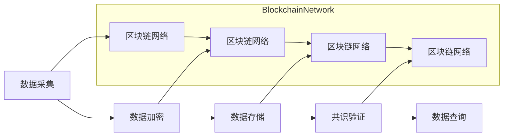
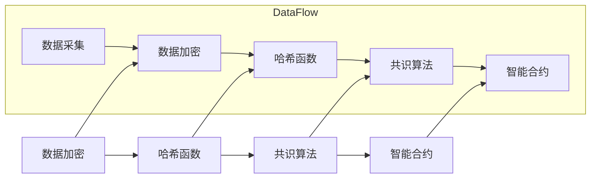

                 

# 区块链溯源平台：食品安全的创新解决方案

> **关键词**：区块链、溯源平台、食品安全、分布式账本、加密算法、智能合约、加密货币

> **摘要**：随着食品供应链的复杂化和全球化，食品安全问题日益突出。本文探讨了如何利用区块链技术构建溯源平台，以提高食品安全的透明度和可追溯性。通过详细分析区块链的基本原理、溯源平台的架构设计、核心算法和数学模型，以及实际应用案例，本文旨在为食品安全领域提供一种创新且有效的解决方案。

## 1. 背景介绍

### 1.1 目的和范围

本文旨在介绍区块链溯源平台在食品安全领域的应用，分析其技术原理、架构设计以及具体操作步骤，并探讨其在实际应用中的挑战和未来发展趋势。本文不仅适合对区块链技术感兴趣的读者，也适用于关注食品安全领域专业人士。

### 1.2 预期读者

- 对区块链技术有初步了解的技术人员；
- 关注食品安全问题的研究人员和从业者；
- 对分布式系统和智能合约有兴趣的学习者。

### 1.3 文档结构概述

本文结构如下：

- **第1章 背景介绍**：介绍文章的目的、范围和预期读者。
- **第2章 核心概念与联系**：介绍区块链的基本概念和溯源平台的架构设计。
- **第3章 核心算法原理 & 具体操作步骤**：详细阐述区块链的核心算法和操作步骤。
- **第4章 数学模型和公式 & 详细讲解 & 举例说明**：介绍与区块链相关的重要数学模型。
- **第5章 项目实战：代码实际案例和详细解释说明**：通过具体代码案例展示溯源平台的实现。
- **第6章 实际应用场景**：探讨区块链溯源平台在不同领域的应用。
- **第7章 工具和资源推荐**：推荐相关学习资源和开发工具。
- **第8章 总结：未来发展趋势与挑战**：总结未来发展趋势和面临的挑战。
- **第9章 附录：常见问题与解答**：解答读者可能遇到的问题。
- **第10章 扩展阅读 & 参考资料**：提供进一步学习的参考资料。

### 1.4 术语表

#### 1.4.1 核心术语定义

- **区块链**：一种分布式数据库，其中数据以块的形式存储，并以链式结构链接在一起。
- **溯源平台**：利用区块链技术实现产品来源、生产、运输等全过程追溯的系统。
- **分布式账本**：一种无需中央权威机构的数据存储和传输方式，由多个参与方共同维护。
- **智能合约**：一种自动执行、管理和执行合同条款的计算机程序。
- **加密算法**：用于保护数据安全和隐私的算法。

#### 1.4.2 相关概念解释

- **共识算法**：区块链网络中节点达成共识的机制。
- **节点**：区块链网络中的参与者，负责验证和存储数据。
- **工作量证明（PoW）**：一种共识算法，通过计算证明参与者的工作量。
- **权益证明（PoS）**：另一种共识算法，通过持有代币的数量和时长来证明权益。

#### 1.4.3 缩略词列表

- **AES**：高级加密标准（Advanced Encryption Standard）
- **SHA-256**：安全哈希算法256位（Secure Hash Algorithm 256-bit）
- **BTC**：比特币（Bitcoin）
- **ICO**：初始代币发行（Initial Coin Offering）
- **DApp**：去中心化应用（Decentralized Application）

## 2. 核心概念与联系

区块链技术作为分布式账本技术的代表，通过加密算法和共识机制实现了数据的安全和透明。溯源平台作为区块链技术的应用之一，旨在通过区块链实现食品供应链的全程追溯。

### 2.1 区块链基本概念

区块链是一个去中心化的数据库，它由一系列按时间顺序排列的“块”组成，每个块都包含一定数量的交易记录，并通过加密算法和哈希函数确保数据的完整性和不可篡改性。区块链的核心特点包括：

- **去中心化**：没有中央权威机构，所有节点都有平等的权利和义务。
- **透明性**：所有数据都是公开透明的，任何节点都可以查看和验证。
- **安全性**：通过加密算法和共识机制，确保数据的安全性和不可篡改性。
- **可靠性**：由于分布式存储，区块链具有高度的容错性和抗攻击性。

### 2.2 溯源平台架构设计

溯源平台的核心架构包括区块链网络、智能合约、前端应用和后端服务器。以下是一个简化的溯源平台架构设计：

```
+----------------+      +----------------+      +----------------+
|   前端应用     | <---> |   智能合约     | <---> |   区块链网络   |
+----------------+      +----------------+      +----------------+
    |                |                |
    |                |                |
    |                |                |
    |                |                |
    |                |                |
+----------------+      +----------------+
|   后端服务器    |
+----------------+
```

#### 2.2.1 区块链网络

区块链网络由多个节点组成，每个节点都维护一份完整的区块链副本。节点通过共识算法达成一致，确保区块链的完整性和安全性。

#### 2.2.2 智能合约

智能合约是区块链上的计算机程序，它自动执行合同条款。在溯源平台中，智能合约用于定义食品溯源的规则和流程，例如：记录食品的生产、运输和销售信息。

#### 2.2.3 前端应用

前端应用用于用户与溯源平台交互，例如：用户可以通过前端应用查询食品的溯源信息。

#### 2.2.4 后端服务器

后端服务器用于处理数据存储、管理和分析等任务，它与区块链网络和智能合约进行交互，确保数据的同步和一致性。

### 2.3 区块链溯源平台工作原理

区块链溯源平台的工作原理主要包括以下几个步骤：

1. **数据采集**：食品的生产、加工、运输和销售等信息被采集并上传到区块链网络。
2. **数据加密**：上传的数据通过加密算法进行加密，确保数据的安全和隐私。
3. **数据存储**：加密后的数据被记录在区块链上的特定区块中。
4. **共识验证**：区块链网络中的节点对数据进行验证，确保数据的真实性和完整性。
5. **数据查询**：用户可以通过前端应用查询食品的溯源信息，例如：食品的生产日期、加工地点、运输路线等。

### 2.4 Mermaid 流程图

以下是一个简单的 Mermaid 流程图，描述了区块链溯源平台的基本工作流程：



## 3. 核心算法原理 & 具体操作步骤

区块链溯源平台的核心算法主要包括数据加密、哈希函数、共识算法和智能合约。以下是这些算法的基本原理和具体操作步骤。

### 3.1 数据加密

数据加密是区块链溯源平台中确保数据安全和隐私的重要环节。常用的加密算法包括高级加密标准（AES）和SHA-256。

#### 3.1.1 AES加密算法

AES加密算法是一种对称加密算法，它通过密钥对数据进行加密和解密。以下是一个简单的AES加密算法的伪代码：

```plaintext
function AES_encrypt(plaintext, key):
    ciphertext = encrypt(plaintext, key)
    return ciphertext

function AES_decrypt(ciphertext, key):
    plaintext = decrypt(ciphertext, key)
    return plaintext
```

#### 3.1.2 SHA-256哈希函数

SHA-256是一种非对称加密算法，它将任意长度的数据压缩为固定长度的哈希值。以下是一个简单的SHA-256哈希函数的伪代码：

```plaintext
function SHA256(data):
    hash_value = hash(data, SHA256)
    return hash_value
```

### 3.2 哈希函数

哈希函数是区块链溯源平台中另一个关键算法，它用于生成数据的唯一标识。常见的哈希函数包括SHA-256和SHA-3。

#### 3.2.1 SHA-256哈希函数

SHA-256哈希函数的输入是任意长度的数据，输出是固定长度的哈希值。以下是一个简单的SHA-256哈希函数的伪代码：

```plaintext
function SHA256(data):
    hash_value = hash(data, SHA256)
    return hash_value
```

### 3.3 工作量证明（PoW）共识算法

工作量证明（PoW）是区块链溯源平台中常用的共识算法之一。它通过计算大量的哈希值，找到一个满足特定条件的解，以证明节点的工作量。

#### 3.3.1 PoW共识算法原理

PoW共识算法的基本原理是：节点通过计算大量的哈希值，找到一个满足特定条件的解，然后将解提交给网络。网络中的其他节点验证该解的有效性，并确认交易。

#### 3.3.2 PoW共识算法步骤

1. **初始化**：节点选择一个随机数作为起始值。
2. **计算哈希值**：使用SHA-256哈希函数计算当前值的哈希值。
3. **验证哈希值**：检查哈希值是否满足特定条件（例如：哈希值的前几位为0）。
4. **更新起始值**：如果哈希值不满足条件，更新随机数，重复步骤2和3。
5. **提交解**：找到满足条件的哈希值后，节点将解提交给网络。
6. **验证解**：网络中的其他节点验证该解的有效性，并确认交易。

### 3.4 智能合约

智能合约是区块链溯源平台中用于定义和执行合同条款的计算机程序。智能合约通过编程语言（例如Solidity）编写，并在区块链上执行。

#### 3.4.1 智能合约原理

智能合约的基本原理是：当满足特定条件时，智能合约会自动执行预定义的合同条款。智能合约的执行是透明和不可篡改的，因为它们在区块链上记录。

#### 3.4.2 智能合约步骤

1. **编写合约**：使用智能合约编程语言编写合同条款。
2. **部署合约**：将编写好的智能合约部署到区块链上。
3. **调用合约**：当满足特定条件时，调用智能合约执行预定义的操作。

### 3.5 Mermaid 流程图

以下是一个简单的 Mermaid 流程图，描述了区块链溯源平台的核心算法和工作原理：



## 4. 数学模型和公式 & 详细讲解 & 举例说明

区块链溯源平台中涉及多个数学模型和公式，包括加密算法、哈希函数、共识算法和智能合约。以下是这些数学模型和公式的详细讲解以及举例说明。

### 4.1 加密算法

加密算法是一种将明文转换为密文的算法，确保数据在传输和存储过程中的安全。常见的加密算法包括高级加密标准（AES）和RSA。

#### 4.1.1 AES加密算法

AES加密算法是一种对称加密算法，它通过密钥对数据进行加密和解密。加密算法的数学模型可以表示为：

$$
C = E(K, P)
$$

其中，\(C\) 是密文，\(K\) 是密钥，\(P\) 是明文，\(E\) 是加密函数。

#### 4.1.2 RSA加密算法

RSA加密算法是一种非对称加密算法，它通过公钥和私钥对数据进行加密和解密。加密算法的数学模型可以表示为：

$$
C = E(K_{pub}, P)
$$

$$
P = D(K_{pri

