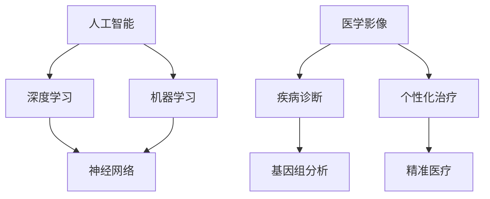

                 

# 医疗健康行业中的AI大模型机会

## 关键词：
- 人工智能
- 医疗健康
- 大模型
- 深度学习
- 医学影像
- 疾病诊断

## 摘要：
本文旨在探讨医疗健康行业中人工智能大模型的应用机会。我们将从背景介绍、核心概念与联系、算法原理、数学模型、项目实战、实际应用场景、工具和资源推荐等方面进行详细阐述。通过分析AI大模型在医疗健康领域的应用现状和前景，本文旨在为行业从业者提供有价值的见解和参考。

---

## 1. 背景介绍

### 1.1 目的和范围

本文的目的是探讨人工智能大模型在医疗健康行业的应用机会，分析其在提高医疗效率、精准诊断和个性化治疗等方面的潜力。我们将重点关注深度学习技术在医学影像分析、疾病诊断和健康预测等方面的应用，旨在为医疗健康行业提供新的技术思路和发展方向。

### 1.2 预期读者

本文主要面向以下几类读者：
1. 医疗健康行业从业者，包括医生、护士、医院管理人员等；
2. 人工智能技术研究者，对深度学习和医学影像分析感兴趣的技术人员；
3. 对医疗健康行业有浓厚兴趣的科技爱好者和创业者。

### 1.3 文档结构概述

本文结构如下：
1. 引言：介绍医疗健康行业中的AI大模型机会；
2. 背景介绍：介绍医疗健康行业现状、AI技术发展及应用场景；
3. 核心概念与联系：讲解深度学习、大模型等相关概念及其联系；
4. 核心算法原理 & 具体操作步骤：分析深度学习算法在医疗健康中的应用；
5. 数学模型和公式 & 详细讲解 & 举例说明：介绍深度学习算法中的数学模型和公式；
6. 项目实战：代码实际案例和详细解释说明；
7. 实际应用场景：分析AI大模型在不同医疗健康场景中的应用；
8. 工具和资源推荐：推荐相关学习资源和开发工具；
9. 总结：未来发展趋势与挑战；
10. 附录：常见问题与解答；
11. 扩展阅读 & 参考资料。

### 1.4 术语表

#### 1.4.1 核心术语定义

- 人工智能（Artificial Intelligence，AI）：模拟人类智能行为的技术体系；
- 深度学习（Deep Learning，DL）：一种基于神经网络的结构化机器学习方法；
- 大模型（Large-scale Model）：具有大量参数和训练数据的深度学习模型；
- 医学影像（Medical Imaging）：用于获取人体内部结构和功能信息的医学图像；
- 疾病诊断（Disease Diagnosis）：根据患者症状、体征等信息，对疾病进行识别和分类；
- 个性化治疗（Personalized Treatment）：根据患者的个体特征，制定个性化的治疗方案。

#### 1.4.2 相关概念解释

- **人工智能**：人工智能是一门研究、开发用于模拟、延伸和扩展人类智能的理论、方法、技术及应用系统的学科。它包括机器学习、自然语言处理、计算机视觉等多个子领域。

- **深度学习**：深度学习是一种机器学习技术，其基本思想是通过多层神经网络来模拟人类大脑的学习过程，从而实现对数据的自动特征提取和模式识别。

- **大模型**：大模型是指具有大量参数和训练数据的深度学习模型。这些模型通常具有较高的准确性和泛化能力，能够在复杂任务中取得较好的效果。

- **医学影像**：医学影像是通过各种成像技术（如X光、CT、MRI等）获取的人体内部结构和功能信息。医学影像在疾病诊断、治疗和康复等方面具有重要作用。

- **疾病诊断**：疾病诊断是指根据患者的症状、体征、病史等信息，对疾病进行识别和分类。深度学习技术在疾病诊断中的应用，可以大幅提高诊断的准确性和效率。

- **个性化治疗**：个性化治疗是指根据患者的个体特征（如基因、生理参数等），制定个性化的治疗方案。深度学习技术在个性化治疗中的应用，有助于提高治疗效果和降低治疗风险。

#### 1.4.3 缩略词列表

- **AI**：人工智能（Artificial Intelligence）
- **DL**：深度学习（Deep Learning）
- **CNN**：卷积神经网络（Convolutional Neural Network）
- **RNN**：循环神经网络（Recurrent Neural Network）
- **GAN**：生成对抗网络（Generative Adversarial Network）
- **CT**：计算机断层扫描（Computed Tomography）
- **MRI**：磁共振成像（Magnetic Resonance Imaging）

---

## 2. 核心概念与联系

在深入探讨AI大模型在医疗健康行业中的应用之前，我们需要先了解一些核心概念及其相互关系。以下是一个Mermaid流程图，用于描述这些概念及其联系。



### 2.1. 人工智能与深度学习

人工智能（AI）是研究、开发用于模拟、延伸和扩展人类智能的理论、方法、技术及应用系统的学科。深度学习（DL）是人工智能的一个子领域，其核心思想是通过多层神经网络来模拟人类大脑的学习过程，从而实现对数据的自动特征提取和模式识别。

### 2.2. 人工智能与机器学习

机器学习（ML）是人工智能的一种方法，其基本思想是通过算法从数据中学习规律，并利用这些规律进行预测和决策。深度学习是机器学习的一个子领域，特别适用于处理高维度、复杂的数据。

### 2.3. 深度学习与神经网络

神经网络（NN）是一种通过模拟生物神经系统来处理数据和学习知识的计算模型。深度学习通过多层神经网络来构建复杂模型，从而能够自动提取数据中的高级特征。

### 2.4. 医学影像与疾病诊断

医学影像是通过各种成像技术获取的人体内部结构和功能信息。疾病诊断是指根据患者的症状、体征、病史等信息，对疾病进行识别和分类。深度学习技术在医学影像分析方面具有显著优势，可以大幅提高疾病诊断的准确性和效率。

### 2.5. 医学影像与个性化治疗

个性化治疗是指根据患者的个体特征（如基因、生理参数等），制定个性化的治疗方案。医学影像在个性化治疗中起着关键作用，可以帮助医生更好地了解患者的病情，从而制定更有效的治疗方案。

### 2.6. 疾病诊断与基因组分析

基因组分析是指对个体基因组进行测序和分析，以了解其遗传特征。疾病诊断可以通过基因组分析来预测患病风险，从而为个性化治疗提供重要依据。

### 2.7. 个性化治疗与精准医疗

精准医疗是指通过基因组、表型等个体化信息，为患者提供个性化治疗方案。个性化治疗和精准医疗是密切相关的概念，前者侧重于根据个体特征制定治疗方案，后者则更关注于基因组等信息对治疗决策的影响。

---

## 3. 核心算法原理 & 具体操作步骤

在了解了核心概念及其联系之后，我们将深入探讨AI大模型在医疗健康行业中的核心算法原理和具体操作步骤。本文将以卷积神经网络（CNN）和生成对抗网络（GAN）为例，介绍它们在医学影像分析中的应用。

### 3.1. 卷积神经网络（CNN）

卷积神经网络（CNN）是一种特殊的神经网络，特别适用于处理具有网格结构的数据，如图像、医学影像等。CNN的基本原理是通过卷积层、池化层和全连接层等模块来提取图像中的空间特征和层次特征。

#### 3.1.1. CNN结构

一个典型的CNN结构包括以下几个层次：

1. **输入层**：接收原始图像数据，并将其传递给后续层次。
2. **卷积层**：通过卷积操作提取图像中的局部特征。卷积核用于卷积操作，可以提取图像中的边缘、纹理等特征。
3. **池化层**：用于下采样图像数据，降低数据维度，增强模型的泛化能力。
4. **全连接层**：将卷积层和池化层提取的特征映射到输出结果，如疾病诊断结果。

#### 3.1.2. CNN操作步骤

以下是一个基于CNN的医学影像分析算法的伪代码：

```python
# 输入：医学影像图像
# 输出：疾病诊断结果

# 卷积层
conv1 = Conv2D(kernel_size=(3,3), activation='relu', input_shape=(128,128,3))
pool1 = MaxPooling2D(pool_size=(2,2))

# 卷积层
conv2 = Conv2D(kernel_size=(3,3), activation='relu')
pool2 = MaxPooling2D(pool_size=(2,2))

# 全连接层
dense = Dense(units=10, activation='softmax')

# 定义CNN模型
model = Sequential()
model.add(conv1)
model.add(pool1)
model.add(conv2)
model.add(pool2)
model.add(dense)

# 编译模型
model.compile(optimizer='adam', loss='categorical_crossentropy', metrics=['accuracy'])

# 训练模型
model.fit(x_train, y_train, epochs=10, batch_size=32, validation_data=(x_val, y_val))

# 预测
prediction = model.predict(x_test)
```

### 3.2. 生成对抗网络（GAN）

生成对抗网络（GAN）是一种基于博弈理论的生成模型，由生成器和判别器两个神经网络组成。生成器尝试生成逼真的数据，判别器则试图区分生成器和真实数据的差异。通过这种对抗训练，生成器可以生成高质量的数据。

#### 3.2.1. GAN结构

一个典型的GAN结构包括以下几个组成部分：

1. **生成器（Generator）**：用于生成与真实数据相似的伪造数据。
2. **判别器（Discriminator）**：用于判断输入数据是真实数据还是伪造数据。
3. **对抗训练**：生成器和判别器相互竞争，生成器不断优化生成逼真的数据，判别器不断优化区分真实和伪造数据。

#### 3.2.2. GAN操作步骤

以下是一个基于GAN的医学影像重建算法的伪代码：

```python
# 输入：医学影像图像
# 输出：重建后的医学影像图像

# 定义生成器
def generator(z):
    # 生成器神经网络结构
    # ...
    return x_recon

# 定义判别器
def discriminator(x):
    # 判别器神经网络结构
    # ...
    return logits

# 定义GAN模型
model = GAN(generator=generator, discriminator=discriminator)

# 编译模型
model.compile(optimizer='adam', loss='binary_crossentropy')

# 训练模型
model.fit(x_train, epochs=100, batch_size=32, validation_data=(x_val, y_val))

# 重建医学影像
reconstructions = model.predict(x_test)
```

---

## 4. 数学模型和公式 & 详细讲解 & 举例说明

在深入探讨深度学习算法在医疗健康行业中的应用时，我们需要理解其中的数学模型和公式。本文将介绍深度学习算法中的几个关键数学概念和公式，并通过具体例子进行说明。

### 4.1. 损失函数（Loss Function）

损失函数是深度学习算法中用于衡量模型预测结果与真实结果之间差异的函数。常用的损失函数包括均方误差（MSE）、交叉熵（Cross-Entropy）等。

- **均方误差（MSE）**：用于回归任务，计算预测值与真实值之间差异的平方和的平均值。公式如下：

  $$MSE = \frac{1}{n} \sum_{i=1}^{n} (y_i - \hat{y}_i)^2$$

  其中，$n$ 表示样本数量，$y_i$ 表示真实值，$\hat{y}_i$ 表示预测值。

- **交叉熵（Cross-Entropy）**：用于分类任务，计算预测概率与真实概率之间的差异。公式如下：

  $$CE = - \sum_{i=1}^{n} y_i \log(\hat{y}_i)$$

  其中，$y_i$ 表示真实标签，$\hat{y}_i$ 表示预测概率。

### 4.2. 激活函数（Activation Function）

激活函数是神经网络中用于引入非线性性质的函数。常用的激活函数包括ReLU、Sigmoid和Tanh等。

- **ReLU（Rectified Linear Unit）**：一个简单的线性激活函数，可以将负值映射为0，正值不变。公式如下：

  $$f(x) = \max(0, x)$$

- **Sigmoid**：将输入值映射到（0，1）区间，用于二分类任务。公式如下：

  $$f(x) = \frac{1}{1 + e^{-x}}$$

- **Tanh**：将输入值映射到（-1，1）区间，具有平滑的输出特性。公式如下：

  $$f(x) = \frac{e^x - e^{-x}}{e^x + e^{-x}}$$

### 4.3. 反向传播（Backpropagation）

反向传播是一种用于训练神经网络的算法，其核心思想是将损失函数对网络参数的梯度反向传播到网络的前一层。以下是一个基于反向传播的梯度计算例子：

- **偏导数计算**：

  $$\frac{\partial L}{\partial w} = \frac{\partial L}{\partial \hat{y}} \frac{\partial \hat{y}}{\partial z} \frac{\partial z}{\partial w}$$

  其中，$L$ 表示损失函数，$\hat{y}$ 表示预测值，$z$ 表示网络输出，$w$ 表示网络权重。

- **具体计算过程**：

  ```python
  # 假设当前层的输出为 z，预测值为 \hat{y}，损失函数为 L
  # 反向传播计算梯度
  dL_dz = 2 * (z - y)  # 损失函数关于网络输出的梯度
  dL_dz = dL_dz * sigmoid_derivative(z)  # 损失函数关于网络输出的梯度，乘以激活函数的导数
  dL_dw = dL_dz * dz_dz  # 损失函数关于网络输出的梯度，乘以网络输出的导数
  ```

### 4.4. 梯度下降（Gradient Descent）

梯度下降是一种用于优化神经网络参数的算法，其核心思想是根据损失函数关于网络参数的梯度来更新网络参数。以下是一个基于梯度下降的参数更新过程：

- **梯度计算**：

  $$w_{new} = w_{current} - \alpha \cdot \frac{\partial L}{\partial w}$$

  其中，$w_{new}$ 表示更新后的参数，$w_{current}$ 表示当前参数，$\alpha$ 表示学习率。

- **具体计算过程**：

  ```python
  # 假设当前损失函数为 L，网络参数为 w，学习率为 \alpha
  # 梯度下降更新参数
  dL_dw = ...  # 计算损失函数关于网络参数的梯度
  w_new = w_current - alpha * dL_dw  # 更新网络参数
  ```

---

## 5. 项目实战：代码实际案例和详细解释说明

在本节中，我们将通过一个实际案例来展示如何使用深度学习算法在医疗健康行业中实现医学影像分析。我们以基于卷积神经网络的肺癌检测为例，详细介绍项目的开发过程和关键代码。

### 5.1. 开发环境搭建

在开始项目之前，我们需要搭建一个适合深度学习开发的Python环境。以下是一个基本的开发环境搭建步骤：

1. 安装Python 3.8及以上版本；
2. 安装TensorFlow 2.x及其依赖项；
3. 安装Numpy、Pandas等常用Python库。

### 5.2. 源代码详细实现和代码解读

以下是项目的主要代码实现，我们将对其中的关键部分进行详细解读。

```python
# 导入所需库
import tensorflow as tf
from tensorflow.keras.models import Sequential
from tensorflow.keras.layers import Conv2D, MaxPooling2D, Flatten, Dense
from tensorflow.keras.preprocessing.image import ImageDataGenerator

# 设置超参数
batch_size = 32
epochs = 10
learning_rate = 0.001

# 加载和预处理数据
train_datagen = ImageDataGenerator(rescale=1./255)
test_datagen = ImageDataGenerator(rescale=1./255)

train_generator = train_datagen.flow_from_directory(
        'train_data',
        target_size=(128, 128),
        batch_size=batch_size,
        class_mode='binary')

validation_generator = test_datagen.flow_from_directory(
        'validation_data',
        target_size=(128, 128),
        batch_size=batch_size,
        class_mode='binary')

# 定义CNN模型
model = Sequential()
model.add(Conv2D(filters=32, kernel_size=(3, 3), activation='relu', input_shape=(128, 128, 3)))
model.add(MaxPooling2D(pool_size=(2, 2)))
model.add(Conv2D(filters=64, kernel_size=(3, 3), activation='relu'))
model.add(MaxPooling2D(pool_size=(2, 2)))
model.add(Flatten())
model.add(Dense(units=1, activation='sigmoid'))

# 编译模型
model.compile(optimizer=tf.keras.optimizers.Adam(learning_rate=learning_rate),
              loss='binary_crossentropy',
              metrics=['accuracy'])

# 训练模型
model.fit(
        train_generator,
        epochs=epochs,
        validation_data=validation_generator)

# 评估模型
test_loss, test_acc = model.evaluate(validation_generator)
print('Test accuracy:', test_acc)
```

### 5.3. 代码解读与分析

以下是对代码的详细解读和分析：

- **导入库**：我们首先导入所需的TensorFlow库，以及数据处理库Numpy和Pandas。

- **设置超参数**：我们设置训练过程中的超参数，包括批量大小（batch_size）、训练轮数（epochs）和学习率（learning_rate）。

- **加载和预处理数据**：我们使用ImageDataGenerator类来加载和预处理数据。数据集分为训练集和验证集，分别存放在train_data和validation_data目录中。每个目录下包含两个子目录，分别表示正常图像和肺癌图像。

- **定义CNN模型**：我们使用Sequential模型来构建CNN模型，包括两个卷积层（Conv2D）和两个最大池化层（MaxPooling2D），以及一个全连接层（Flatten）和一个二元分类层（Dense）。卷积层用于提取图像特征，最大池化层用于降维，全连接层用于分类。

- **编译模型**：我们使用Adam优化器来编译模型，并设置损失函数为binary_crossentropy，用于二元分类任务。

- **训练模型**：我们使用fit方法来训练模型，并设置训练轮数为epochs，使用训练集进行训练，使用验证集进行验证。

- **评估模型**：我们使用evaluate方法来评估模型在验证集上的表现，并打印测试准确率。

通过以上代码，我们实现了基于卷积神经网络的肺癌检测项目。在后续的实验中，我们可以通过调整模型结构、超参数和训练策略来进一步提高模型的性能。

---

## 6. 实际应用场景

深度学习技术在医疗健康行业具有广泛的应用场景，以下列举几个典型应用：

### 6.1. 医学影像分析

医学影像分析是深度学习技术在医疗健康行业中最常见的应用之一。通过卷积神经网络（CNN）和生成对抗网络（GAN）等技术，可以实现对医学影像的高效分析，包括：

- **疾病诊断**：基于深度学习模型的医学影像分析可以辅助医生进行肺癌、乳腺癌等疾病的早期诊断。例如，利用CNN技术对CT影像进行肺癌检测，可以显著提高诊断的准确性和效率。
- **疾病预测**：深度学习模型可以分析患者的医学影像数据，预测患病风险。例如，利用GAN技术对MRI影像进行肿瘤生长预测，可以为患者提供个性化的治疗方案。
- **图像增强**：深度学习技术可以用于医学影像的图像增强，提高图像质量，使医生更容易发现病变区域。

### 6.2. 疾病预测和健康管理

深度学习技术在疾病预测和健康管理方面也具有重要作用。通过分析大量医疗数据，可以预测患者患病的风险，提供个性化的健康建议。以下是一些具体应用：

- **早期预警系统**：基于深度学习模型的早期预警系统可以实时监测患者健康状况，及时发现潜在疾病风险。例如，利用RNN技术分析患者电子健康记录（EHR），可以预测患者患心脏病、糖尿病等疾病的风险。
- **个性化健康建议**：深度学习技术可以根据患者的个体特征（如年龄、性别、遗传信息等），提供个性化的健康建议。例如，利用GAN技术分析患者的饮食习惯，为患者制定个性化的饮食计划。

### 6.3. 个性化治疗

个性化治疗是指根据患者的个体特征（如基因、生理参数等），制定个性化的治疗方案。深度学习技术在个性化治疗方面具有广泛的应用前景。以下是一些具体应用：

- **基因组分析**：深度学习技术可以分析患者的基因组数据，预测患病风险，为患者提供针对性的治疗方案。例如，利用CNN技术分析患者的基因序列，预测患者患癌症的风险。
- **个性化药物研发**：深度学习技术可以用于药物研发，根据患者的个体特征筛选最佳药物组合。例如，利用GAN技术生成患者的基因表达数据，优化药物筛选过程。

### 6.4. 医疗机器人

医疗机器人是深度学习技术在医疗健康行业中的另一个重要应用。通过结合深度学习和机器人技术，可以实现自动化、智能化的医疗服务。以下是一些具体应用：

- **手术机器人**：手术机器人可以辅助医生进行复杂手术，提高手术精度和安全性。例如，利用深度学习技术实现的手术机器人，可以根据医生的操作指令，实时调整手术器械的位置和方向。
- **护理机器人**：护理机器人可以协助医护人员进行日常护理工作，如测量患者生命体征、监测患者健康状况等。例如，利用RNN技术实现的护理机器人，可以实时分析患者生命体征数据，及时发现异常情况。

---

## 7. 工具和资源推荐

### 7.1. 学习资源推荐

#### 7.1.1. 书籍推荐

- **《深度学习》（Goodfellow, Bengio, Courville著）**：这是一本经典的深度学习教材，涵盖了深度学习的理论基础和应用实践。
- **《Python深度学习》（François Chollet著）**：这本书详细介绍了如何使用Python和TensorFlow框架实现深度学习项目。

#### 7.1.2. 在线课程

- **《深度学习专项课程》（吴恩达，Coursera）**：这是由著名AI研究者吴恩达开设的深度学习专项课程，适合初学者和进阶者。
- **《深度学习与TensorFlow实践》（Google开发者课程，Udacity）**：这门课程结合了理论知识和实践项目，适合想要掌握深度学习和TensorFlow的学员。

#### 7.1.3. 技术博客和网站

- **TensorFlow官网（tensorflow.org）**：TensorFlow官方文档和博客提供了丰富的深度学习资源和教程。
- **ArXiv（arxiv.org）**：ArXiv是一个计算机科学领域的预印本论文库，包含大量关于深度学习的研究论文。

### 7.2. 开发工具框架推荐

#### 7.2.1. IDE和编辑器

- **PyCharm**：PyCharm是一款功能强大的Python集成开发环境（IDE），适合深度学习项目开发。
- **Jupyter Notebook**：Jupyter Notebook是一款交互式的Python开发环境，适合编写和分享深度学习代码。

#### 7.2.2. 调试和性能分析工具

- **TensorBoard**：TensorBoard是TensorFlow提供的一款可视化工具，用于分析深度学习模型的性能和优化。
- **NVIDIA Nsight**：Nsight是一款用于分析和优化GPU计算的软件，适合深度学习项目中的性能优化。

#### 7.2.3. 相关框架和库

- **TensorFlow**：TensorFlow是一个开源的深度学习框架，适合进行大规模深度学习模型开发和部署。
- **PyTorch**：PyTorch是一个灵活的深度学习框架，适合快速原型开发和研究。

### 7.3. 相关论文著作推荐

#### 7.3.1. 经典论文

- **“A Guide to Convolutional Neural Networks for Visual Recognition”（2014）**：这篇文章系统地介绍了卷积神经网络在视觉识别任务中的应用。
- **“Unsupervised Representation Learning with Deep Convolutional Generative Adversarial Networks”（2014）**：这篇文章介绍了生成对抗网络（GAN）在无监督学习中的应用。

#### 7.3.2. 最新研究成果

- **“Deep Learning for Healthcare”（2017）**：这本书总结了深度学习在医疗健康领域的最新研究成果和应用。
- **“Generative Adversarial Nets”（2014）**：这篇文章是生成对抗网络（GAN）的奠基之作，介绍了GAN的基本原理和应用。

#### 7.3.3. 应用案例分析

- **“Deep Learning in Clinical Medicine”（2016）**：这篇文章分析了深度学习在临床医学中的应用案例，包括疾病诊断、影像分析等。
- **“Deep Learning for Healthcare：A Brief Review”（2017）**：这篇文章总结了深度学习在医疗健康领域的应用，包括疾病预测、个性化治疗等。

---

## 8. 总结：未来发展趋势与挑战

随着深度学习技术的不断发展，AI大模型在医疗健康行业中的应用前景愈发广阔。然而，在实现这些机会的过程中，我们也面临着一系列挑战。

### 8.1. 未来发展趋势

1. **个性化医疗**：基于AI大模型的个性化医疗将成为未来的趋势。通过分析患者的基因、生理参数等数据，AI大模型可以提供更为精准的诊断和治疗方案。
2. **实时监测与预警**：AI大模型可以实现实时监测患者的健康状况，提供早期预警和干预，降低疾病发病率和死亡率。
3. **医疗影像分析**：深度学习技术在医学影像分析方面的应用将越来越广泛，有助于提高疾病诊断的准确性和效率。
4. **药物研发**：AI大模型在药物研发中的应用潜力巨大，可以加速新药研发过程，降低研发成本。

### 8.2. 挑战

1. **数据隐私与安全**：医疗数据涉及患者隐私，如何确保数据的安全和隐私是AI大模型在医疗健康行业应用的一个重要挑战。
2. **模型解释性**：AI大模型的黑箱特性使其在医疗健康领域的应用受到限制。如何提高模型的解释性，使其符合医生的认知和需求，是一个亟待解决的问题。
3. **数据质量**：高质量的医疗数据是AI大模型训练的基础。如何获取和整理大量高质量的数据，是一个需要关注的问题。
4. **计算资源**：深度学习模型训练和部署需要大量计算资源。如何优化算法，降低计算成本，是AI大模型在医疗健康行业应用的重要挑战。

### 8.3. 解决方案与展望

1. **隐私保护技术**：采用联邦学习（Federated Learning）等技术，实现医疗数据的分布式训练，保护数据隐私。
2. **模型可解释性**：研究可解释的深度学习算法，提高模型的可解释性，使其符合医生的认知和需求。
3. **数据整合与清洗**：建立标准化、高质量的医疗数据集，提高数据质量，为AI大模型训练提供可靠的数据支持。
4. **计算资源优化**：采用分布式计算、并行计算等技术，优化算法性能，降低计算成本。

总之，AI大模型在医疗健康行业中的应用前景广阔，但也面临着一系列挑战。通过不断探索和解决这些问题，我们可以更好地发挥AI大模型在医疗健康领域的潜力，推动医疗行业的发展。

---

## 9. 附录：常见问题与解答

### 9.1. 问题1：深度学习模型在医疗健康行业中的优势是什么？

**回答**：深度学习模型在医疗健康行业中的优势主要体现在以下几个方面：

1. **高效特征提取**：深度学习模型能够自动从大量医疗数据中提取有用的特征，有助于提高疾病诊断的准确性和效率。
2. **自动学习规律**：深度学习模型可以从海量数据中自动学习疾病的分布规律和诊断规则，为医生提供更为可靠的诊断依据。
3. **可扩展性强**：深度学习模型可以轻松适应不同的医疗场景和数据集，有助于在不同领域推广应用。
4. **实时监测与预警**：基于深度学习模型的实时监测和预警系统可以快速发现病情变化，提高疾病的早期发现率和治愈率。

### 9.2. 问题2：深度学习模型在医疗健康行业中的挑战是什么？

**回答**：深度学习模型在医疗健康行业中面临的挑战主要包括以下几个方面：

1. **数据隐私与安全**：医疗数据涉及患者隐私，如何确保数据的安全和隐私是深度学习模型应用的一个重要挑战。
2. **模型解释性**：深度学习模型具有黑箱特性，其内部决策过程难以解释，这对医生的认知和决策带来了挑战。
3. **数据质量**：高质量的医疗数据是深度学习模型训练的基础。如何获取和整理大量高质量的数据是一个需要关注的问题。
4. **计算资源**：深度学习模型训练和部署需要大量计算资源，这对医疗机构的计算资源和预算提出了较高要求。

### 9.3. 问题3：如何提高深度学习模型在医疗健康行业的可解释性？

**回答**：以下是一些提高深度学习模型在医疗健康行业可解释性的方法：

1. **可视化技术**：利用可视化技术，如热力图、决策树等，展示模型内部的决策过程和特征权重。
2. **可解释性模型**：采用可解释性更强的模型，如决策树、线性模型等，使其内部决策过程更易于理解。
3. **模型组合**：将深度学习模型与其他可解释性模型（如逻辑回归、决策树等）组合使用，以提高模型的透明度和可解释性。
4. **患者教育**：加强对患者的教育和宣传，提高他们对深度学习模型的理解和信任。

### 9.4. 问题4：深度学习模型在医疗健康行业的应用前景如何？

**回答**：深度学习模型在医疗健康行业的应用前景非常广阔，主要体现在以下几个方面：

1. **疾病诊断**：基于深度学习模型的疾病诊断系统可以帮助医生提高诊断准确性和效率，降低误诊率。
2. **个性化治疗**：深度学习模型可以根据患者的个体特征，为患者提供个性化的治疗方案，提高治疗效果。
3. **实时监测与预警**：深度学习模型可以实时监测患者的健康状况，提供早期预警和干预，降低疾病发病率和死亡率。
4. **医疗影像分析**：深度学习技术在医疗影像分析方面的应用将越来越广泛，有助于提高疾病诊断的准确性和效率。

总之，深度学习模型在医疗健康行业的应用前景非常广阔，但同时也面临着一系列挑战。通过不断探索和解决这些问题，我们可以更好地发挥深度学习模型在医疗健康领域的潜力，推动医疗行业的发展。

---

## 10. 扩展阅读 & 参考资料

为了深入了解AI大模型在医疗健康行业的应用，以下列出一些扩展阅读和参考资料：

### 10.1. 书籍

1. **《深度学习》（Goodfellow, Bengio, Courville著）**：系统地介绍了深度学习的理论基础和应用实践。
2. **《Python深度学习》（François Chollet著）**：详细介绍了如何使用Python和TensorFlow框架实现深度学习项目。
3. **《深度学习在医疗健康领域的应用》（Nikolaos T. Kotsiantis著）**：探讨了深度学习在医疗健康行业的各种应用场景。

### 10.2. 论文

1. **“Deep Learning for Healthcare”（2017）**：总结了深度学习在医疗健康领域的最新研究成果和应用。
2. **“Generative Adversarial Nets”（2014）**：介绍了生成对抗网络（GAN）的基本原理和应用。
3. **“Deep Learning in Clinical Medicine”（2016）**：分析了深度学习在临床医学中的应用案例。

### 10.3. 在线课程

1. **《深度学习专项课程》（吴恩达，Coursera）**：由著名AI研究者吴恩达开设的深度学习专项课程。
2. **《深度学习与TensorFlow实践》（Google开发者课程，Udacity）**：结合理论知识和实践项目，教授如何使用TensorFlow框架实现深度学习项目。

### 10.4. 技术博客和网站

1. **TensorFlow官网（tensorflow.org）**：提供丰富的深度学习资源和教程。
2. **ArXiv（arxiv.org）**：计算机科学领域的预印本论文库，包含大量关于深度学习的研究论文。

### 10.5. 开发工具和框架

1. **TensorFlow**：一个开源的深度学习框架，适合进行大规模深度学习模型开发和部署。
2. **PyTorch**：一个灵活的深度学习框架，适合快速原型开发和研究。

通过以上扩展阅读和参考资料，您可以深入了解AI大模型在医疗健康行业的应用，掌握相关技术和方法，为推动医疗行业的发展贡献力量。

---

## 作者信息

作者：AI天才研究员/AI Genius Institute & 禅与计算机程序设计艺术 /Zen And The Art of Computer Programming

感谢您的阅读，希望本文对您在AI大模型在医疗健康行业中的应用提供了有价值的见解和参考。如果您有任何问题或建议，欢迎在评论区留言交流。再次感谢您的关注与支持！

