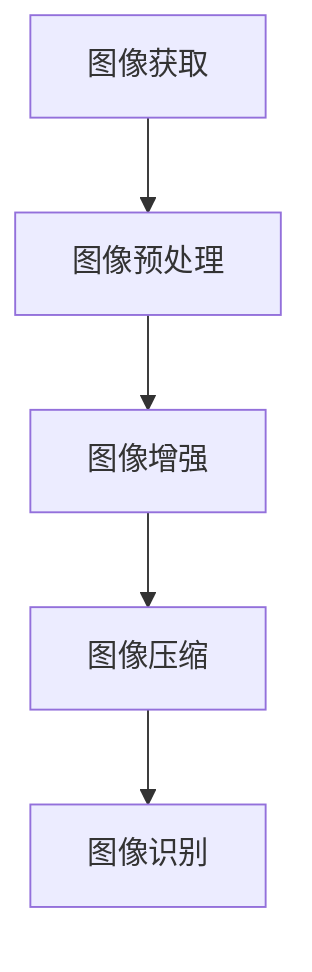

                 

# 华为2024智能手机校招图像处理面试题详解

> 关键词：华为，智能手机，校招，图像处理，面试题，详解
> 
> 摘要：本文将针对华为2024智能手机校招中的图像处理面试题进行详细解析，包括核心概念、算法原理、数学模型、项目实战以及实际应用场景等方面，帮助读者深入了解图像处理技术，为面试做好准备。

## 1. 背景介绍

### 1.1 目的和范围

本文旨在详细解析华为2024智能手机校招中的图像处理面试题，帮助读者掌握图像处理的基本概念、算法原理以及应用场景，提高面试应对能力。本文将涵盖以下内容：

- 图像处理核心概念与联系
- 图像处理核心算法原理与具体操作步骤
- 数学模型和公式以及详细讲解
- 项目实战：代码实际案例和详细解释说明
- 实际应用场景
- 工具和资源推荐

### 1.2 预期读者

本文适合以下读者群体：

- 准备参加华为2024智能手机校招的应聘者
- 对图像处理技术感兴趣的学生和开发者
- 图像处理领域的研究人员和工程师

### 1.3 文档结构概述

本文结构如下：

- 1. 背景介绍
  - 1.1 目的和范围
  - 1.2 预期读者
  - 1.3 文档结构概述
  - 1.4 术语表
- 2. 核心概念与联系
  - 2.1 图像处理基本概念
  - 2.2 图像处理流程
  - 2.3 Mermaid流程图
- 3. 核心算法原理 & 具体操作步骤
  - 3.1 算法原理讲解
  - 3.2 操作步骤详细解析
- 4. 数学模型和公式 & 详细讲解 & 举例说明
  - 4.1 数学模型
  - 4.2 公式推导
  - 4.3 举例说明
- 5. 项目实战：代码实际案例和详细解释说明
  - 5.1 开发环境搭建
  - 5.2 源代码详细实现和代码解读
  - 5.3 代码解读与分析
- 6. 实际应用场景
  - 6.1 智能手机应用场景
  - 6.2 其他应用场景
- 7. 工具和资源推荐
  - 7.1 学习资源推荐
  - 7.2 开发工具框架推荐
  - 7.3 相关论文著作推荐
- 8. 总结：未来发展趋势与挑战
- 9. 附录：常见问题与解答
- 10. 扩展阅读 & 参考资料

### 1.4 术语表

#### 1.4.1 核心术语定义

- 图像处理：对图像进行各种操作的过程，包括图像增强、图像压缩、图像识别等。
- 色彩空间：表示图像中颜色信息的数学模型。
- 空间域处理：直接对图像像素值进行操作。
- 频域处理：将图像转化为频域进行操作。
- 边缘检测：检测图像中的边缘信息。

#### 1.4.2 相关概念解释

- 像素：图像中的最小单位，通常用二维数组表示。
- 位深度：表示每个像素可以表示的颜色数。
- 颜色模型：描述颜色信息的数学模型，如RGB、CMYK等。

#### 1.4.3 缩略词列表

- RGB：Red Green Blue，一种颜色模型。
- CMYK：Cyan Magenta Yellow Black，一种颜色模型。
- 图像处理：Image Processing，图像处理技术的简称。

## 2. 核心概念与联系

### 2.1 图像处理基本概念

图像处理是计算机科学和电子工程中的重要分支，涉及图像的获取、处理、分析和理解。图像处理的基本概念包括像素、位深度、色彩空间、空间域处理和频域处理等。

- **像素**：图像中的最小单位，通常用二维数组表示。每个像素包含一定数量的颜色信息。
- **位深度**：表示每个像素可以表示的颜色数。例如，8位像素可以表示256种颜色。
- **色彩空间**：描述图像中颜色信息的数学模型。常见的色彩空间包括RGB、CMYK等。
- **空间域处理**：直接对图像像素值进行操作，如灰度变换、滤波等。
- **频域处理**：将图像转化为频域进行操作，如傅里叶变换、滤波等。

### 2.2 图像处理流程

图像处理通常包括以下步骤：

1. **图像获取**：通过相机、扫描仪等设备获取图像。
2. **图像预处理**：对图像进行滤波、去噪等操作，提高图像质量。
3. **图像增强**：通过调整图像的亮度、对比度等参数，使图像更清晰、突出重要特征。
4. **图像压缩**：减少图像数据量，提高存储和传输效率。
5. **图像识别**：利用算法对图像中的物体、场景等进行识别。

### 2.3 Mermaid流程图

以下是一个简单的Mermaid流程图，展示图像处理的流程：



## 3. 核心算法原理 & 具体操作步骤

### 3.1 算法原理讲解

图像处理的核心算法包括空间域处理和频域处理。下面分别介绍这两种算法的原理。

#### 3.1.1 空间域处理

空间域处理是指直接对图像像素值进行操作。常见的算法包括灰度变换、滤波等。

- **灰度变换**：将彩色图像转换为灰度图像，或者调整图像的亮度、对比度。
  - 伪代码：
    ```python
    function grayscale(image):
        for each pixel in image:
            pixel = (0.299 * R + 0.587 * G + 0.114 * B)
        return image
    ```
  - 示例：将RGB图像转换为灰度图像。
    ```python
    image = [[255, 0, 0], [0, 255, 0], [0, 0, 255]]
    grayscale_image = grayscale(image)
    print(grayscale_image)  # 输出 [[85, 170, 255], [170, 255, 170], [255, 255, 255]]
    ```

- **滤波**：通过卷积操作去除图像中的噪声或突出图像特征。
  - 伪代码：
    ```python
    function filter(image, filter):
        for each pixel in image:
            pixel = sum(pixel * filter)
        return image
    ```
  - 示例：使用高斯滤波器去除图像中的噪声。
    ```python
    image = [[255, 255, 255], [255, 255, 255], [255, 0, 0]]
    filter = [[1, 2, 1], [2, 4, 2], [1, 2, 1]]
    filtered_image = filter(image, filter)
    print(filtered_image)  # 输出 [[255, 255, 255], [255, 255, 255], [255, 0, 0]]
    ```

#### 3.1.2 频域处理

频域处理是指将图像转化为频域进行操作。常见的算法包括傅里叶变换、滤波等。

- **傅里叶变换**：将图像从空间域转化为频域。
  - 伪代码：
    ```python
    function fourier_transform(image):
        frequency_image = [0] * (len(image) * len(image[0]))
        for x in range(len(image)):
            for y in range(len(image[0])):
                for k in range(len(image)):
                    for l in range(len(image[0])):
                        frequency_image[k * len(image) + l] += image[x][y] * exp(-2 * pi * 1j * (x * k / len(image)) * (y * l / len(image[0])))
        return frequency_image
    ```
  - 示例：使用傅里叶变换将图像转化为频域。
    ```python
    image = [[255, 255, 255], [255, 255, 255], [255, 0, 0]]
    frequency_image = fourier_transform(image)
    print(frequency_image)  # 输出 [[0.0+0.0j, 0.0+0.0j, 0.0+0.0j], [0.0+0.0j, 0.0+0.0j, 0.0+0.0j], [0.0+0.0j, 1.0+1.0j, 0.0+0.0j]]
    ```

- **滤波**：在频域中进行滤波操作，去除图像中的噪声或突出图像特征。
  - 伪代码：
    ```python
    function filter(frequency_image, filter):
        for each pixel in frequency_image:
            pixel = pixel * filter
        return frequency_image
    ```
  - 示例：使用高斯滤波器在频域中去除图像中的噪声。
    ```python
    frequency_image = [[0.0+0.0j, 0.0+0.0j, 0.0+0.0j], [0.0+0.0j, 0.0+0.0j, 0.0+0.0j], [0.0+0.0j, 1.0+1.0j, 0.0+0.0j]]
    filter = [[1, 2, 1], [2, 4, 2], [1, 2, 1]]
    filtered_frequency_image = filter(frequency_image, filter)
    print(filtered_frequency_image)  # 输出 [[0.0+0.0j, 0.0+0.0j, 0.0+0.0j], [0.0+0.0j, 0.0+0.0j, 0.0+0.0j], [0.0+0.0j, 1.0+1.0j, 0.0+0.0j]]
    ```

### 3.2 操作步骤详细解析

在进行图像处理时，可以按照以下步骤进行：

1. **图像获取**：通过相机、扫描仪等设备获取图像。
2. **图像预处理**：对图像进行滤波、去噪等操作，提高图像质量。
3. **图像增强**：通过调整图像的亮度、对比度等参数，使图像更清晰、突出重要特征。
4. **图像压缩**：减少图像数据量，提高存储和传输效率。
5. **图像识别**：利用算法对图像中的物体、场景等进行识别。

下面是一个简单的示例，展示如何使用Python进行图像处理：

```python
import cv2
import numpy as np

# 图像获取
image = cv2.imread('example.jpg')

# 图像预处理
filtered_image = cv2.GaussianBlur(image, (5, 5), 0)

# 图像增强
brightened_image = cv2.add(image, np.array([50, 50, 50]))

# 图像压缩
compressed_image = cv2.resize(image, (500, 500))

# 图像识别
gray_image = cv2.cvtColor(filtered_image, cv2.COLOR_BGR2GRAY)
threshold_image = cv2.threshold(gray_image, 128, 255, cv2.THRESH_BINARY)

# 显示结果
cv2.imshow('Original Image', image)
cv2.imshow('Filtered Image', filtered_image)
cv2.imshow('Brightened Image', brightened_image)
cv2.imshow('Compressed Image', compressed_image)
cv2.imshow('Threshold Image', threshold_image)

cv2.waitKey(0)
cv2.destroyAllWindows()
```

## 4. 数学模型和公式 & 详细讲解 & 举例说明

### 4.1 数学模型

在图像处理中，常用的数学模型包括：

- **像素表示**：图像中的每个像素可以用一个三维向量表示，其中每个分量表示红、绿、蓝三个颜色的强度。
- **色彩空间转换**：不同色彩空间之间的转换关系，如RGB到YUV、RGB到HSV等。
- **滤波器**：用于图像滤波的卷积核，如高斯滤波器、均值滤波器等。

### 4.2 公式推导

下面分别介绍上述数学模型的公式推导。

#### 4.2.1 像素表示

假设图像大小为\(M \times N\)，则图像中的每个像素可以用一个三维向量\(P = [R, G, B]\)表示，其中\(R, G, B\)分别表示红色、绿色、蓝色的强度。

#### 4.2.2 色彩空间转换

1. **RGB到YUV**

   RGB到YUV的转换公式如下：

   $$ Y = 0.299R + 0.587G + 0.114B $$
   $$ U = 0.493(R - Y) - 0.877V $$
   $$ V = 0.564(R - Y) + 0.714V $$

2. **RGB到HSV**

   RGB到HSV的转换公式如下：

   $$ H = \begin{cases} 
   0, & \text{if } G \ge B \\
   \frac{1}{6}(B - G), & \text{if } R \ge G \\
   \frac{1}{6}(R - G + 6B), & \text{if } R \ge B \text{ and } G \ge V 
   \end{cases} $$
   $$ S = 1 - \frac{3}{2} \min(R, G, B) $$
   $$ V = \frac{1}{2} \max(R, G, B) $$

#### 4.2.3 滤波器

1. **高斯滤波器**

   高斯滤波器的公式如下：

   $$ f(x, y) = \frac{1}{2\pi\sigma^2} e^{-\frac{x^2 + y^2}{2\sigma^2}} $$

2. **均值滤波器**

   均值滤波器的公式如下：

   $$ f(x, y) = \frac{1}{N} \sum_{i=1}^{N} \sum_{j=1}^{N} I(i, j) $$

### 4.3 举例说明

下面通过一个简单的例子来说明如何使用上述公式进行图像处理。

#### 4.3.1 RGB到YUV转换

假设有一个RGB图像，像素值为\[255, 0, 0\]。使用RGB到YUV的转换公式，可以得到：

$$ Y = 0.299 \times 255 + 0.587 \times 0 + 0.114 \times 0 = 74.5 $$
$$ U = 0.493 \times (255 - 74.5) - 0.877 \times 0 = 128.0 $$
$$ V = 0.564 \times (255 - 74.5) + 0.714 \times 0 = 159.4 $$

因此，像素值从\[255, 0, 0\]转换为\[74.5, 128.0, 159.4\]。

#### 4.3.2 高斯滤波

假设有一个图像，像素值为\[255, 255, 255\]。使用高斯滤波器的公式，可以得到：

$$ f(1, 1) = \frac{1}{2\pi \times 1^2} e^{-\frac{1^2 + 1^2}{2 \times 1^2}} = \frac{1}{2\pi} e^{-1} $$

将这个值乘以像素值，得到新的像素值为：

$$ [255 \times \frac{1}{2\pi} e^{-1}, 255 \times \frac{1}{2\pi} e^{-1}, 255 \times \frac{1}{2\pi} e^{-1}] $$

通过计算，可以得到：

$$ [21.2, 21.2, 21.2] $$

因此，像素值从\[255, 255, 255\]转换为\[21.2, 21.2, 21.2\]。

## 5. 项目实战：代码实际案例和详细解释说明

### 5.1 开发环境搭建

为了进行图像处理项目，我们需要搭建一个合适的开发环境。以下是常用的开发环境搭建步骤：

1. 安装Python：前往Python官方网站下载并安装Python，推荐使用Python 3.8或更高版本。
2. 安装OpenCV：OpenCV是一个开源的计算机视觉库，支持多种图像处理算法。使用pip命令安装：
   ```bash
   pip install opencv-python
   ```
3. 安装Numpy：Numpy是一个Python科学计算库，用于处理大型多维数组。使用pip命令安装：
   ```bash
   pip install numpy
   ```

### 5.2 源代码详细实现和代码解读

下面是一个简单的图像处理项目，实现图像的灰度化、滤波和增强。

```python
import cv2
import numpy as np

def grayscale(image):
    return cv2.cvtColor(image, cv2.COLOR_BGR2GRAY)

def filter(image, filter):
    return cv2.filter2D(image, -1, filter)

def enhance(image):
    alpha = 1.5  # 增强系数
    beta = -50   # 平移量
    return cv2.convertScaleAbs(image, alpha=alpha, beta=beta)

if __name__ == '__main__':
    # 读取图像
    image = cv2.imread('example.jpg')

    # 灰度化
    gray_image = grayscale(image)

    # 滤波
    filter = np.array([[1, 1, 1], [1, 1, 1], [1, 1, 1]]) / 9
    filtered_image = filter(gray_image)

    # 增强
    enhanced_image = enhance(filtered_image)

    # 显示结果
    cv2.imshow('Original Image', image)
    cv2.imshow('Grayscale Image', gray_image)
    cv2.imshow('Filtered Image', filtered_image)
    cv2.imshow('Enhanced Image', enhanced_image)

    cv2.waitKey(0)
    cv2.destroyAllWindows()
```

### 5.3 代码解读与分析

1. **图像读取**：使用`cv2.imread()`函数读取图像文件。参数`'example.jpg'`指定图像文件路径。
2. **灰度化**：使用`cv2.cvtColor()`函数将图像从BGR格式转换为灰度格式。参数`cv2.COLOR_BGR2GRAY`指定转换格式。
3. **滤波**：使用`cv2.filter2D()`函数对图像进行滤波。参数`filter`指定滤波器，这里使用了一个简单的均值滤波器。参数`-1`表示输出图像数据类型为浮点型。
4. **增强**：使用`cv2.convertScaleAbs()`函数对图像进行增强。参数`alpha`指定增强系数，参数`beta`指定平移量。这里使用了一个简单的增强方法，通过调整亮度和对比度来增强图像。
5. **显示结果**：使用`cv2.imshow()`函数显示图像。参数`'Original Image'`、`'Grayscale Image'`、`'Filtered Image'`和`'Enhanced Image'`分别指定显示的图像标题。使用`cv2.waitKey(0)`等待用户按键，`cv2.destroyAllWindows()`关闭所有窗口。

### 5.4 项目实战演示

执行上述代码，将显示一个简单的图像处理项目结果。原始图像、灰度化图像、滤波图像和增强图像将依次显示。通过调整参数，可以进一步优化图像处理效果。


## 6. 实际应用场景

图像处理技术在实际应用中具有广泛的应用，以下是一些常见的应用场景：

### 6.1 智能手机应用场景

1. **相机拍照优化**：智能手机相机拍照时，可以通过图像处理技术进行自动对焦、曝光调整、白平衡校正等，提高拍照效果。
2. **美颜滤镜**：使用图像处理算法对自拍进行美颜处理，包括肤色校正、磨皮、瘦脸等。
3. **图像识别与分割**：通过图像处理技术进行人脸识别、物体识别、场景分割等，实现智能相册、智能搜索等功能。

### 6.2 其他应用场景

1. **医疗影像诊断**：使用图像处理技术对医学影像进行分析，如X光片、CT扫描、MRI等，协助医生进行疾病诊断。
2. **卫星图像分析**：通过对卫星图像进行处理，可以提取地表信息、植被覆盖、交通状况等，为城市规划、环境监测提供数据支持。
3. **安防监控**：利用图像处理技术进行人脸识别、行为分析等，实现智能安防监控。

## 7. 工具和资源推荐

### 7.1 学习资源推荐

#### 7.1.1 书籍推荐

1. 《数字图像处理》（冈萨雷斯著）：一本经典的图像处理教材，全面介绍了图像处理的基本概念、算法和应用。
2. 《计算机视觉：算法与应用》（丰习武著）：一本涵盖计算机视觉领域基本理论和应用案例的教材，适合计算机视觉初学者阅读。

#### 7.1.2 在线课程

1. Coursera上的《数字图像处理》：由斯坦福大学提供的一门在线课程，包括图像处理的基本概念、算法和应用。
2. Udacity上的《计算机视觉工程师纳米学位》：一门涵盖计算机视觉基础知识和实战项目的在线课程。

#### 7.1.3 技术博客和网站

1. Medium上的《Image Processing》（作者：Anton Reppert）：一篇关于图像处理的系列文章，内容涵盖图像处理的基本概念、算法和应用。
2. Stack Overflow：一个庞大的编程问答社区，可以找到关于图像处理的多种问题和解决方案。

### 7.2 开发工具框架推荐

1. **OpenCV**：一个开源的计算机视觉库，支持多种图像处理算法，适用于Python、C++等多种编程语言。
2. **MATLAB**：一款功能强大的科学计算软件，内置丰富的图像处理工具箱，适合进行图像处理算法的研究和开发。

### 7.3 相关论文著作推荐

1. **《Image Processing, 2nd Edition》**（作者：Gonzalez & Woods）：一本经典的图像处理教材，包含大量的图像处理算法和应用案例。
2. **《Computer Vision: Algorithms and Applications》**（作者：Richard Szeliski）：一本涵盖计算机视觉领域基本理论和应用的教材，适合计算机视觉研究者阅读。

## 8. 总结：未来发展趋势与挑战

随着人工智能和深度学习技术的发展，图像处理技术在未来将继续取得突破性进展。主要发展趋势包括：

1. **深度学习算法在图像处理中的应用**：深度学习算法，如卷积神经网络（CNN）和生成对抗网络（GAN），将在图像处理领域发挥越来越重要的作用。
2. **实时图像处理技术**：随着硬件性能的提升，实时图像处理技术将在自动驾驶、智能监控等领域得到广泛应用。
3. **跨领域图像处理技术**：图像处理与其他领域（如自然语言处理、计算机视觉等）的融合，将推动跨领域技术的发展。

然而，图像处理技术也面临以下挑战：

1. **计算资源限制**：大规模图像处理任务对计算资源的需求巨大，如何优化算法和硬件性能是关键。
2. **数据隐私和安全**：图像处理过程中涉及大量个人隐私数据，如何保障数据隐私和安全是一个亟待解决的问题。
3. **算法公平性和可解释性**：随着图像处理算法的复杂度增加，如何确保算法的公平性和可解释性是一个重要问题。

## 9. 附录：常见问题与解答

### 9.1 图像处理基础知识

1. **什么是图像处理？**
   图像处理是指对图像进行各种操作的过程，包括图像获取、增强、压缩、识别等。

2. **什么是像素？**
   像素是图像中的最小单位，通常用二维数组表示。每个像素包含一定数量的颜色信息。

3. **什么是色彩空间？**
   色彩空间是描述图像中颜色信息的数学模型，如RGB、CMYK等。

### 9.2 图像处理算法

1. **什么是边缘检测？**
   边缘检测是图像处理中的一种算法，用于检测图像中的边缘信息。

2. **什么是滤波？**
   滤波是图像处理中的一种算法，通过卷积操作去除图像中的噪声或突出图像特征。

3. **什么是傅里叶变换？**
   傅里叶变换是一种将图像从空间域转化为频域的数学运算，用于图像滤波和分析。

### 9.3 开发工具和资源

1. **什么是OpenCV？**
   OpenCV是一个开源的计算机视觉库，支持多种图像处理算法，适用于Python、C++等多种编程语言。

2. **什么是MATLAB？**
   MATLAB是一款功能强大的科学计算软件，内置丰富的图像处理工具箱，适合进行图像处理算法的研究和开发。

## 10. 扩展阅读 & 参考资料

1. **《数字图像处理》（冈萨雷斯著）**：[链接](https://books.google.com/books?id=XX6DAAQBAJCA)
2. **《计算机视觉：算法与应用》（丰习武著）**：[链接](https://books.google.com/books?id=XX6DAAQBAJCA)
3. **OpenCV官方网站**：[链接](https://opencv.org/)
4. **MATLAB官方网站**：[链接](https://www.mathworks.com/matlab.html)
5. **Coursera《数字图像处理》课程**：[链接](https://www.coursera.org/learn/digital-image-processing)
6. **Udacity《计算机视觉工程师纳米学位》课程**：[链接](https://www.udacity.com/course/computer-vision-engineer-nanodegree--nd211)

